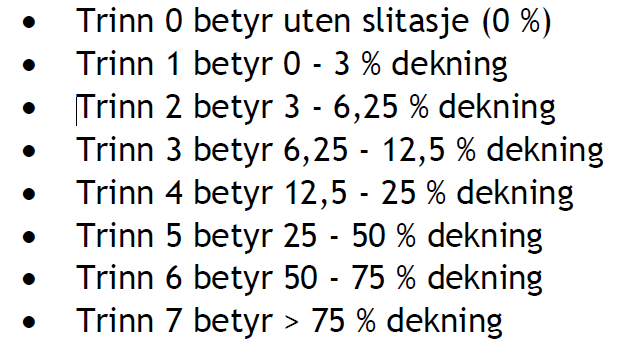

# Slitasje og kjørespor

*Author and date:* Anders L. Kolstad

```{r}
Sys.Date()
```

```{r setup, include=FALSE}
library(knitr)
library(sf)
library(tmap)
library(ggplot2)
library(ggpubr)
library(DT)
library(units)
library(eaTools)
library(tidyverse)
library(tidyr)
knitr::opts_chunk$set(echo = TRUE)
```

```{r, echo=F}
Ecosystem <- "Våtmark, Naturlig åpne områder under skoggrensa, Semi-naturlig mark" 
Egenskap  <- "Primærproduksjon (evt. Abiotiske fohold)"
ECT       <- "Physical state characteristics" 
Contact   <- "anders.kolstad@nina.no"
```

```{r, echo=F}
metaData <- data.frame(Ecosystem,
                       "Økologisk egenskap" = Egenskap,
                       "ECT class" = ECT)
knitr::kable(metaData)
```

<hr/>

## Introduction

1.  Import [Nature type data set](#NTM) set (incl. GRUK) and [ANO data
    set](#ANO-import)

2.  Identify the [relevant](#naturtype) nature types and [subset](#NTM)
    the data

3.  Covert [ANO points to polygons](#ANO-points-to-poly)

4.  For each polygon, extract the NiN-variable that has the lowest value
    (worst-rules rule), e.g. like Fig. \@ref(fig:slitasje-naturetype).

5.  [Combine](#combine-nt-ano) data sets

6.  [Scale](#scale-slitasje-ind) the `slitasje` variable

7.  Define [homogeneous impact areas](#HIA) (HIA)

8.  [Aggregate and spread](#spread-slitasje) indicator value across HIAs
    and assessment regions

9.  Crop based on ecosystem delineation

10. Confirm relationship between infrastructure index and indicator
    values to justify the extrapolation

11. Calculate uncertainty?

12. Export indicator maps and extrapolated maps

## About the underlying data

<!-- Text here -->

### Representativity in time and space

<!-- Text here -->

### Original units

<!-- Text here -->

### Temporal coverage

<!-- Text here -->

### Aditional comments about the dataset

<!-- Text here -->

## Ecosystem characteristic

### Norwegain standard

<!-- Text here -->

### <!-- Text here -->

<!-- Text here. Note that there are two parallell systems for defining ecosystem properties - one Norwegian and one international (SEEA EA). See man/SEEA EA examples.pdf for help -->

## Collinearities with other indicators

<!-- Text here -->

## Reference state and values

### Reference state

<!-- Text here -->

### Reference values, thresholds for defining *good ecological condition*, minimum and/or maximum values

<!-- Text here -->

## Uncertainties

<!-- Text here -->

## References

<!-- Text here -->

## Analyses

### Data sets

#### Nature type mapping {#NTM}

This indicator uses the dataset
`Naturtyper etter Miljødirektoratets Instruks`, which can be found
[here](https://kartkatalog.geonorge.no/metadata/naturtyper-miljoedirektoratets-instruks/eb48dd19-03da-41e1-afd9-7ebc3079265c).
See [here](#naturtype) for a detailed description of the dataset.

Importing the full dataset can be done like this, but because it can
take a few seconds due to its size, I will cache the data on the P
server.

```{r}
dir <- substr(getwd(), 1,2)
```

```{r, eval=F}
path <- ifelse(dir == "C:", 
               "P:/41201785_okologisk_tilstand_2022_2023/data/Natur_Naturtyper_NiN_norge_med_svalbard_25833.gdb",
               "/data/P-Prosjekter2/41201785_okologisk_tilstand_2022_2023/data/Natur_Naturtyper_NiN_norge_med_svalbard_25833.gdb")

naturetypes <- sf::st_read(dsn = path)
```

We also have a separate summary file where the nature types are manually
mapped to the correct NiN-main types. We can use this to find the nature
types associated with the NiN main types that we are interested in.

```{r}
naturetypes_summary <- readRDS("data/naturetypes/natureType_summary.rds")
```

We are only interested in a few NiN main types and their mapping units
(see [here](https://ninanor.github.io/ecosystemCondition/naturtype.html)
for justification)

```{r}
main_NiN_types <- c("T12",
          "T18",
          "T21",
          "T31",
          "T33",
          "T34",
          "V1",
          "V3")
```

```{r}
naturetypes_summary <- naturetypes_summary[naturetypes_summary$NiN_mainType %in% main_NiN_types,]
```

Sub-setting the main data file:

```{r, eval=F}
naturetypes <- naturetypes[naturetypes$naturtype %in% naturetypes_summary$Nature_type,]
```

Fix duplicated name for an ecosystem

```{r, eval=F}
naturetypes$hovedøkosystem[naturetypes$hovedøkosystem=="Naturlig åpne områder i lavlandet"] <- "Naturlig åpne områder under skoggrensa"
```

Export subsetted data set

```{r, eval=F}
saveRDS(naturetypes, "/data/P-Prosjekter2/41201785_okologisk_tilstand_2022_2023/data/rds/naturtyper.rds")
```

Import back in

```{r}
path <- ifelse(dir == "C:", 
               "P:/41201785_okologisk_tilstand_2022_2023/data/rds/naturtyper.rds",
               "/data/P-Prosjekter2/41201785_okologisk_tilstand_2022_2023/data/rds/naturtyper.rds")
naturetypes <- readRDS(path)
```

```{r, fig.cap="An overview of the naturetypes for which we will calculate the indicator. Colours refer to the main ecosystem affiliation."}
ggplot(data = naturetypes, aes(x = naturtype, fill = hovedøkosystem))+
  geom_bar()+
  coord_flip()+
  theme_bw(base_size = 12)+
  guides(fill = "none")+
  xlab("")+
  ylab("Number of localities")
```

Calculate area for each polygon.

```{r}
naturetypes$area <- sf::st_area(naturetypes)
```

The NiN variables are combined into a single field which we need to spit
apart.

```{r}
naturetypes <- tidyr::separate_rows(naturetypes,
                                    ninbeskrivelsesvariabler,
                                    sep=",") %>%
  separate(col = ninbeskrivelsesvariabler,
           into = c("NiN_variable_code", "NiN_variable_value"),
           sep = "_",
           remove=F
           )
```

Convert the value column to numeric. Ignore NA's.

```{r}
naturetypes$NiN_variable_value <- as.numeric(naturetypes$NiN_variable_value)
```

Keep only the relevant variables.

```{r}
myVars <- c(
  #"7FA",     #treated separately in a different indicator
  "7SE", "7TK", "PRTK", "PRSL")
naturetypes <- filter(naturetypes,
                      NiN_variable_code %in% myVars)
```

Names starting with a number is problematic, so adding a prefix

```{r}
naturetypes$NiN_variable_code <- paste0("var_", naturetypes$NiN_variable_code)
```

Now I need to create a single row per locality with a new variable which
is a product of the four variables "7SE", "7TK", "PRTK" and "PRSL". I
will create a new data table where I calculate the new variable which I
then paste back into the sf object.

```{r}
naturetypes_wide <- pivot_wider(naturetypes,
                                names_from = "NiN_variable_code",
                                values_from = "NiN_variable_value",
                                id_cols = "identifikasjon_lokalid")
naturetypes_wide <- as.data.frame(naturetypes_wide)
head(naturetypes_wide)
```

The variables use slightly different scales. PRSL and PRTK use this 8
step scale:

```{r eight-step, fig.cap="Eight step condition scale"}

```

7TK and 7SE use a 4 step scale 

I want to base this indicator on whichever of the variables have the
highest value (worst condition). This table shows that a locality may
have been assessed with both a PR variable and a NiN variable

```{r}
table(naturetypes_wide$var_7SE, naturetypes_wide$var_PRTK)
```

Therefore I need to reconcile these scales. The only way I can think of
is to decrease the resolution of the PR variables to the ar4b scale.
This is of course a shame to loose this detail.

A locality will never have values for both 7SE and PRSL

```{r}
table(naturetypes_wide$var_7SE, naturetypes_wide$var_PRSL)
```

nor 7TK and PRTK

```{r}
table(naturetypes_wide$var_7TK, naturetypes_wide$var_PRTK)
```

```{r}
naturetypes_wide$var_7TK <-  ifelse(is.na(naturetypes_wide$var_7TK),
                              ifelse(naturetypes_wide$var_PRTK == 0, 0,
                                ifelse(naturetypes_wide$var_PRTK < 3, 1,
                                  ifelse(naturetypes_wide$var_PRTK < 6, 2, 3))),
                            naturetypes_wide$var_7TK)
```

Checking that I successfully combined classes 1+2, 3+4+5 and 6+7.

```{r}
table(naturetypes_wide$var_7TK, naturetypes_wide$var_PRTK,
      deparse.level = 2)
```

That looks fine. Now doing the same for the other variable PRSL:

```{r}
naturetypes_wide$var_7SE <-  ifelse(is.na(naturetypes_wide$var_7SE),
                              ifelse(naturetypes_wide$var_PRSL == 0, 0,
                                ifelse(naturetypes_wide$var_PRSL < 3, 1,
                                  ifelse(naturetypes_wide$var_PRSL < 6, 2, 3))),
                            naturetypes_wide$var_7SE)
```

Remove the old PR variables.

```{r}
naturetypes_wide <- select(naturetypes_wide,
                           -var_PRTK,
                           -var_PRSL)
```

There are some very few cells with X's. These are NA's.

```{r}
naturetypes_wide$var_7SE[naturetypes_wide$var_7SE == "X"] <- NA
naturetypes_wide$var_7TK[naturetypes_wide$var_7TK == "X"] <- NA

naturetypes_wide$var_7SE <- as.numeric(naturetypes_wide$var_7SE)
naturetypes_wide$var_7TK <- as.numeric(naturetypes_wide$var_7TK)
```

```{r}
head(naturetypes_wide)
anyDuplicated(naturetypes_wide$identifikasjon_lokalid)
```

7SE has `r nrow(naturetypes_wide[is.na(naturetypes_wide$var_7SE),])`
NA's, and 7TK has
`r nrow(naturetypes_wide[is.na(naturetypes_wide$var_7TK),])`.

```{r, fig.cap="7SE scores in the naturetype dataset"}
temp <- naturetypes_wide %>%
  group_by(var_7SE) %>%
  summarise(sum = n())

ggplot(temp, aes(x = factor(var_7SE),
                 y = sum))+
  geom_bar(stat="identity",
           fill="grey",
           colour = "black")+
  theme_bw(base_size = 12)+
  labs(x = "7SE score",
       y = "Number of localities")
```

The NA fraction is quite big. These are localities with 7TK recorded,
but not 7SE.

```{r, fig.cap="7TK scores in the nature type dataset"}
temp <- naturetypes_wide %>%
  group_by(var_7TK) %>%
  summarise(sum = n())

ggplot(temp, aes(x = factor(var_7TK),
                 y = sum))+
  geom_bar(stat="identity",
           fill="grey",
           colour = "black")+
  theme_bw(base_size = 12)+
  labs(x = "7TK score",
       y = "Number of localities")
```

Then I can combine these two variables into a composite variable called
`slitasje`

```{r, warning=F}
naturetypes_wide$slitasje <- apply(naturetypes_wide[,c("var_7TK", "var_7SE")], 1, max, na.rm=T)
```

When both variables are NA, we get -Inf. There were nine cases of this.
Removing these now.

```{r}
naturetypes_wide <- naturetypes_wide[naturetypes_wide$slitasje>=0,]
```

```{r slitasje-naturetype, fig.cap="Slitasje scores."}
temp <- naturetypes_wide %>%
  group_by(slitasje) %>%
  summarise(sum = n())

ggplot(temp, aes(x = factor(slitasje),
                 y = sum))+
  geom_bar(stat="identity",
           fill="grey",
           colour = "black")+
  theme_bw(base_size = 12)+
  labs(x = "slitasje score",
       y = "Number of localities")
```

I appears most localities are in good condition.

I would also like to know how often 7TK was defining of the
slitasje-indicator, and how often it was 7SE. I can do this by taking
the difference

```{r, fig.cap="Counting the number of cases where 7TK or 7SE ws defining of the slitasje indicator score."}
diff <- naturetypes_wide$var_7SE - 
        naturetypes_wide$var_7TK

diff <- ifelse(diff == 0, "7TK and 7SE",
               ifelse(diff <0, "7TK", "7SE"))

diff_tbl <- as.data.frame(table(diff))

ggplot(diff_tbl, aes(x = diff, y = Freq))+
  geom_bar(stat = "identity",
           colour = "black",
           fill = "grey")+
  theme_bw(base_size = 12)+
  labs(x = "Defining variable",
       y = "Number of localities")
```

Looks like 7SE is more likely to be in a detrimental state.

Now I will copy these slitasje-values into the sf object.

```{r}
naturetypes$slitasje <- naturetypes_wide$slitasje[match(naturetypes$identifikasjon_lokalid, naturetypes_wide$identifikasjon_lokalid)]
#nrow(naturetypes[is.na(naturetypes$slitasje),])  # 13 cases
naturetypes <- naturetypes[!is.na(naturetypes$slitasje),]
```

#### GRUK

This variable is also recorded in GRUK. The nature type dataset I'm
working on here includes this data already (presently only 2021
included). GRUK also records a related variable:
`% cover in 5m radii circles`. This data is not published. In any case
it is better to use the harmonized dataset.

#### ANO {#ANO-import}

Arealrepresentativ Naturovervåking (ANO) consist of 1000 systematically
placed locations each with 18 sample points. In each sample point a
circle of 250 m2 is visualised, and the main ecosystem is recorded.
Depending on the main ecosystem, certain NiN variables are also
recorded. 7SE is recorded for våtmark, but not semi-natural areas or
naturally open areas. 7TK is recorded in våtmark and naturally open
areas only.

| Variable | Våtmark | Naturlig åpne områder | Semi-naturlige områder |
|----------|---------|-----------------------|------------------------|
| 7SE      | X       | \-                    | \-                     |
| 7TK      | X       | X                     | \-                     |

: Table showing which main ecosystems the two NiN variables 7SE and 7TK
is recorded in withing the ANO dataset.

It would be very nice to have 7SE recorded for naturally open areas.
This variable is very relevant here.

I think I will only use våtmark here since my approach will be to the
'worst value' of the variable 7SE and 7TK (see below). I think not
having 7SE for naturally open areas will underestimate the degree of
degredation in these areas.

```{r}
path <- ifelse(dir == "C:", 
        "P:/41201785_okologisk_tilstand_2022_2023/data/Naturovervaking_eksport.gdb",
        "/data/P-Prosjekter2/41201785_okologisk_tilstand_2022_2023/data/Naturovervaking_eksport.gdb")

ano <- sf::st_read(path,
                   layer = "ANO_SurveyPoint") %>%
  dplyr::filter(hovedoekosystem_punkt == "vaatmark")
```

```{r}
table(ano$aar)
```

This dataset only contains data from year 2019 and 2021. We need to
update this dataset later.

Each point/row here is 250 square meters. The data also contains
information about how big a proportion of this area is made up of the
dominant main ecosystem. However, there are
`r (NAS <- length(ano$andel_hovedoekosystem_punkt[is.na(ano$andel_hovedoekosystem_punkt)]))`
NA's here, which is `r round(NAS/nrow(ano), 2)*100`% of the data.

It appears the proportion of each circle that is made up of the dominant
ecosystem was only recorded after year 2019. In fact, the main ecosystem
was not recorded at all in 2019:

```{r}
table(ano$hovedtype_250m2, ano$aar)
```

I can remove the NA's, and thus the 2019 data.

```{r}
ano <- ano[!is.na(ano$andel_hovedoekosystem_punkt),]
```

Let's look at the variation in the recorded proportion of ecosystem
cover

```{r, fig.cap="Distribution of the ANO variable andel_hovedoekosystem_punkt for wetland localities."}
par(mar=c(5,6,4,2))
plot(ano$andel_hovedoekosystem_punkt[order(ano$andel_hovedoekosystem_punkt)],
     ylab="Percentage of the 250 m2 area\ncovered by the main ecosystem")
```

The zero in there is an obvious mistake.

```{r}
ano <- ano[ano$andel_hovedoekosystem_punkt>20,]
```

Here's another plot of the distribution of the same variable:

```{r, warning=F, fig.cap="Percentage cover of the Våtmark main ecosystem in the 250m2 circle"}
ggplot(ano, aes(x = andel_hovedoekosystem_punkt))+
         geom_histogram(fill = "grey",
                        colour="black",
                        binwidth = 1)+
  theme_bw(base_size = 12)+
  xlab("Percentage cover of the Våtmark main ecosystem\n in the 250m2 circle")+
  scale_x_continuous(limits = c(0,101),
                     breaks = seq(0,100,10))
```

We can see that people tend to record the variable in steps of 5%, and
that most sample points are 100% belonging to the same main ecosystem.

We want to use area weighting in this indicator, so we can use this
percentage cover data to calculate the area. Note that both datasets use
m2 as area units.

```{r}
ano$area <- (ano$andel_hovedoekosystem_punkt/100)*250
```

Let's now look at the distribution of the variables. First I need to
seperate the variable name fro the values themselves. Now the data looks
like this:

```{r}
ano$bv_7se[1:6]
```

So I create a new variable prefixed var\_:

```{r}
ano$var_7SE <- as.numeric(sub(pattern = "7SE_",
                 replacement = "",
                 x = ano$bv_7se))
```

The NA's is the case of blank cells. The field app should not allow
users leaving this field blank. I will need to remove these rows. There
are fourteen cases:

```{r}
nrow(ano[is.na(ano$var_7SE),])
```

```{r}
ano <- ano[!is.na(ano$var_7SE),]
```

Same with the other variable 7TK

```{r}
ano$var_7TK <- as.numeric(sub(pattern = "7TK_",
                 replacement = "",
                 x = ano$bv_7tk))
```

No NA's this time.

```{r, fig.cap="Distribution of 7TK and 7SE scores in the ANO data"}
par(mfrow=c(1,2))
barplot(table(ano$var_7TK), xlab="7TK scores")
barplot(table(ano$var_7SE), xlab="7SE scores")
```

Combining these two variables into the indicator, same as for the nature
type data.

```{r}
temp <- as.data.frame(ano)
temp$slitasje <- apply(temp[,c("var_7TK", "var_7SE")], 1, max, na.rm=T)
ano$slitasje <- temp$slitasje
```

```{r, fig.cap="Distribution of slitasje scores in the ANO data"}
barplot(table(ano$slitasje), xlab="Sliatsje scores")
```

##### Combine Naturtype data and ANO {#combine-nt-ano}

We need to combine the nature type dataset with the ANO dataset. I will
add a column `origin` to show where the data comes from. I will also and
add data about the main ecosystem.

```{r}
ano$origin <- "ANO"
naturetypes$origin <- "Nature type mapping"
ano$hovedøkosystem <- "Våtmark"
ano$kartleggingsår <- ano$aar
```

Fix class

```{r}
naturetypes$kartleggingsår <- as.numeric(naturetypes$kartleggingsår)
naturetypes$area <- units::drop_units(naturetypes$area)
```

I use `dplyr::select` to can reduce the number of columns to keep things
a bit more tidy.

```{r}
slitasje_data <- dplyr::bind_rows(select(ano,
                                  GlobalID,
                                  origin,
                                  kartleggingsår,
                                  hovedøkosystem,
                                  area,
                                  slitasje,
                                  SHAPE), 
                           select(naturetypes,
                                  identifikasjon_lokalid,
                                  origin,
                                  hovedøkosystem,
                                  kartleggingsår,
                                  area,
                                  slitasje,
                                  SHAPE))

unique(st_geometry_type(slitasje_data))
```

###### Points to polygons {#ANO-points-to-poly}

The ANO data is point data, and the nature type data is multipolygon.
Because later we want to save this as a shape file, we cannot have a
mixed class type. I will therefore convert the points to polygons. I use
the area column to calculate a radii that gives that area.

```{r}
slitasje_data_points <- slitasje_data %>%
  mutate(g_type = st_geometry_type(.)) %>%
  filter(g_type =="POINT") %>%
  st_buffer(sqrt(slitasje_data$area/pi))
```

Checking no that the new polygons have the area corresponding to the
proportion of the point that was part of the same main ecosystem:

```{r new-area, fig.cap="Checking that the area of the new polygons fall in line with the proportion of each point which is part of the main ecosystem."}
slitasje_data_points$area2 <- st_area(slitasje_data_points)
plot(slitasje_data_points$area, slitasje_data_points$area2,
     xlab = "Target area",
     ylab = "Area of the new polygons")
```

The area calculation seems to have worked fine.

```{r}
slitasje_data_polygons <- slitasje_data %>%
  mutate(g_type = st_geometry_type(.)) %>%
  filter(g_type !="POINT")

slitasje_data <- bind_rows(slitasje_data_points, slitasje_data_polygons)

unique(st_geometry_type(slitasje_data))
```

The new dataset only contains polygons.

Grouping and tallying the data for plotting

```{r}
temp <- as.data.frame(table(slitasje_data$slitasje))
```

```{r, fig.cap="Slitasje scores."}
ggplot(temp, aes(x = Var1,
                 y = Freq))+
  geom_bar(stat="identity",
           fill="grey",
           colour = "black")+
  theme_bw(base_size = 12)+
  labs(x = "slitasje score",
       y = "Number of localities")
```

Let's see the proportion of data points (not area) origination from each
data set

```{r, fig.cap="Barplot show the contribution (number of localities) of different data sets to the slitasje indicator."}
temp <- as.data.frame(table(slitasje_data$origin))

ggplot(temp, aes(x = Var1,
                 y = Freq))+
  geom_bar(stat="identity",
           fill="grey",
           colour = "black")+
  theme_bw(base_size = 12)+
  labs(x = "Data origin",
       y = "Number of localities")
```

So the ANO data is not very important here, but it can become more
important in the future.

#### Outline of Norway and regions

```{r}
outline <- sf::read_sf("data/outlineOfNorway_EPSG25833.shp")
```

```{r}
regions <- sf::read_sf("data/regions.shp", options = "ENCODING=UTF8")
unique(regions$region)
```

### Scaled indicator values {#scale-slitasje-ind}

I can scale the indicator for each polygon, or I can chose to aggregate
them first. If the scaled value is representative and precise at the
polygon level, then I could scale at that level. However, the combined
surveyed area is still so little of the total area of Norway, so that
only producing indicator values for these leaves the indicator without
much value for regional assessments. Later when we produce assessments
and indicator values at the regional level, we cannot simply do an area
weighting of the polygons in each region. This is because we don't want
to assume that the polygons are representative far outside of the mapped
area. But perhaps we can assume them to be representative inside
*homogeneous ecological areas*. That's where the infrastructure index
comes in. Here's the plan:

1.  scale the indicators at the polygon level.

2.  take the simplified infrastructure index and, one class at the time,
    extract the indicator value that intersect with those cells, and
    extrapolate the mean of those values to all similar cell within a
    given region.

3.  calculate an indicator value for a region by doing a weighted
    average based o the relative area of each infrastructure class.

#### Scaled variable

The variable is ordinal, not continuous. See fig. \@ref(fig:eight-step).
I could create another variable which was more like original range
scale. Although not perfect, I will use the median value for each
category.

```{r}
slitasje_data$slitasje_percentage <- slitasje_data$slitasje

slitasje_data$slitasje_percentage[slitasje_data$slitasje_percentage == 1] <- ((1/16)/2)*100
slitasje_data$slitasje_percentage[slitasje_data$slitasje_percentage == 2] <- (((1/2)/2)+(1/16))*100
slitasje_data$slitasje_percentage[slitasje_data$slitasje_percentage == 3] <- (3/4)*100
table(slitasje_data$slitasje_percentage)
```

```{r continuous-scale, fig.cap="Showing the conversion from ordinal to (pseudo)continous cale for the slitasje variable"}
ggplot(slitasje_data, aes(x = slitasje,
                          y = slitasje_percentage))+
  geom_point(size=6)+
  geom_line()+
  theme_bw(base_size = 16)
```

I will use the same reference levels/values for all of Norway:

```{r}
upper <- 0
lower <- 100
threshold <- 10
```

This implies that it is impossible to detect or measure a state when it
is in its most degraded form (100% disturbed). This is a problem with
the original data resolution. But I will compensate somewhat for this by
using a non-linear transformation.

I need to do a little trick and reverse the upper and lower reference
values for the normalisation to work. This is a bug which can be fixed
inside eaTools.

```{r slitasje-normalise, fig.cap="Performing a non-linear break-point type normalisation of the slitasje variable."}
eaTools::ea_normalise(data = slitasje_data,
                      vector = "slitasje_percentage",
                      upper_reference_level = lower,
                      lower_reference_level = upper,
                      break_point = threshold,
                      plot=T,
                      reverse = T
                      )
```

This normalisation seems reasonable to me. I can save it as indicator
values. There is no point yet making this a time series, and I will
assign all the indicator value to the average year of the data.

```{r}
mean(slitasje_data$kartleggingsår)
```

```{r}
slitasje_data$i_2020 <- eaTools::ea_normalise(data = slitasje_data,
                      vector = "slitasje_percentage",
                      upper_reference_level = lower,
                      lower_reference_level = upper,
                      break_point = threshold,
                      reverse = T
                      )
```

### Homogeneous impact areas {#HIA}

I want to use the [Homogeneous Impact Areas](#HIA) (HIA) to define
smaller regions into which I can extrapolate the indicator values. This
data is generated by discretizing the Norwegian Infrastructure Index. I
refer to the ordinal values of the four impact area classes as their
*Human Impact Factor* (HIF).

```{r}
HIA <- readRDS("P:/41201785_okologisk_tilstand_2022_2023/data/infrastrukturindeks/homogeneous_impact_areas.rds")
```

I want to check that HIF is in fact a good predictor for _slitasje_.

I also want to split these four HIA classes based on their region. To do
this I need the two layers to have the same CRS.

```{r}
st_crs(HIA) == st_crs(regions)
```

Since the two layers are completely overlapping, we can get the
intersections

```{r, eval=F}
HIA_regions <- eaTools::ea_homogeneous_area(HIA,
                             regions,
                             keep1 = "infrastructureIndex",
                             keep2 = "region")
saveRDS(HIA_regions, "P:/41201785_okologisk_tilstand_2022_2023/data/cache/HIA_regions.rds")
```

```{r, echo=F}
# silently read cached file
HIA_regions <- readRDS("P:/41201785_okologisk_tilstand_2022_2023/data/cache/HIA_regions.rds")
```

```{r}
HIA_regions <- HIA_regions %>%
  mutate(region_HIF = paste(region, infrastructureIndex))
```


#### Validate
I now have 20 unique areas (for each main ecosystem) that I will, given there is data, extrapolate
indicator values over

###### Subset ETs
I will subset the `sliatsje_data` in the three ecosystems. 
Note that only for open wetlands do we have good ecosystem delineation maps to base a spatial averaging on.

```{r}
wetlands <- slitasje_data[slitasje_data$hovedøkosystem == "Våtmark",]
seminat <- slitasje_data[slitasje_data$hovedøkosystem == "Semi-naturlig mark",]
natOpen <- slitasje_data[slitasje_data$hovedøkosystem == "Naturlig åpne områder under skoggrensa",]
```

```{r, eval=F}
wetland_stats <- ea_spread(indicator_data = wetlands,
          indicator = i_2020,
          regions = HIA_regions,
          groups = region_HIF,
          summarise = TRUE)

seminat_stats <- ea_spread(indicator_data = seminat,
          indicator = i_2020,
          regions = HIA_regions,
          groups = region_HIF,
          summarise = TRUE)

natOpen_stats <- ea_spread(indicator_data = natOpen,
          indicator = i_2020,
          regions = HIA_regions,
          groups = region_HIF,
          summarise = TRUE)

wetland_stats <- wetland_stats %>%
  add_column(eco = "wetland")

seminat_stats <- seminat_stats %>%
  add_column(eco = "semi-natural")

natOpen_stats <- natOpen_stats %>%
  add_column(eco = "Naturally-open")

all_stats <- rbind(wetland_stats,
                   seminat_stats,
                   natOpen_stats)
all_stats <- all_stats %>%
  separate(region_HIF,
           into = c("region", "HIF"),
           sep = " ")
saveRDS(all_stats, "P:/41201785_okologisk_tilstand_2022_2023/data/cache/all_stats.rds")
```

```{r, include=F}
#silently read cached file
all_stats <- readRDS("P:/41201785_okologisk_tilstand_2022_2023/data/cache/all_stats.rds")
```


```{r dense-stats, fig.height=20, fig.width=12}
ggarrange(
ggplot(all_stats, aes(x = region, y = n, group = HIF, fill = HIF))+
  geom_bar(position = "dodge", stat = "identity")+
  theme_bw(base_size = 30)+
  coord_flip()+
  facet_wrap(.~eco),
ggplot(all_stats, aes(x = region, y = w_mean, group = HIF, fill = HIF))+
  geom_bar(position = "dodge", stat = "identity")+
  theme_bw(base_size = 30)+
  coord_flip()+
  facet_wrap(.~eco),
ggplot(all_stats, aes(x = region, y = sd, group = HIF, fill = HIF))+
  geom_bar(position = "dodge", stat = "identity")+
  theme_bw(base_size = 30)+
  coord_flip()+
  facet_wrap(.~eco),
ncol = 1)

```

This rather dense figure needs to be looked at carefully. 
In the top row we see that the sample size (number of polygons) varies between ecosystems. For naturally open ecosystems many polygons are from high infrastructure areas, not surprisingly, and there are few points for the lowest impact class (zero such polygins in _Sørlandet_ for example). We there may not be able to extrapolate indicator values in areas in _Sørlandet_ with low levels of infrastructure. We can also from the middle row see the association between the indicator values (area weighted means) and the modified infrastructure index (HIF). We should then not put too much weight on data were there is little data (low n) and/or high standard error (sd, bottom row). For example, with Naturally open ecosystems, Midt-Norge has the overall lowest errors, and there we also see the kind of relationship between the indicator and the pressure that we want to see (middle row). The pattern is repeated for all regions except Østlandet, but there we also see that HIF class 3 has very little data, and a high sd, and this could explain the discrepancy (but it doesn't support the general relationship either). 

In semi-natural areas and wetlands, we have very little data from HIF class 3, and the sd's are very big. The indicator-pressure relationship (middle row) looks the most messy for wetlands, but if ignoring HIF=3, the relationship looks much better.

```{r, fig.cap="Summary statistics for the slitasje indicator."}
DT::datatable(all_stats)
```


In addition to looking at the area weighted means and its relationship with the pressure indicator (HIF), we can do the same at the polygon level. Because the indicator is pseudo-continuous, boxplots for example become useless, so I will present a relative frequency plot.

```{r, eval=F}
corrCheck <- st_intersection(slitasje_data, HIA_regions)
saveRDS(corrCheck, "P:/41201785_okologisk_tilstand_2022_2023/data/cache/corrCheck.rds")
```
```{r, include=F}
#Silently read cached data
corrCheck <- readRDS("P:/41201785_okologisk_tilstand_2022_2023/data/cache/corrCheck.rds")
```

```{r slitasje-precentageplot, fig.height=12, fig.width=12, fig.cap="Relative frequency plot (conditioned on region and main ecosystem) showing the distribution of polygons with different indicator values."}
ggplot(corrCheck, aes(x = factor(infrastructureIndex), fill = factor(i_2020)))+
  geom_bar(position="fill")+
  theme_bw(base_size = 12)+
  guides(fill = guide_legend("Sliatsje indicator"))+
  ylab("Fraction of data points")+
  xlab("HIF")+
  facet_grid(hovedøkosystem~region)
```

When down weighting the importance of those groups/categories that have very little The figure above I think supports the indicator-pressure relationship and justifies using the HIA+region intersections as local reference areas (i.e. homogeneous impact areas). 

We can also calculate Kendall tau b coefficients, although I'm not complete sure this is valid when we have ordinal data with only four levels, since there will be a lot of ties. 

```{r}
corrCheck_grouped <- as.data.frame(corrCheck) %>%
  group_by(hovedøkosystem, region) %>%
  summarise(cor = cor(i_2020, infrastructureIndex, method = "kendall"))
```


```{r, fig.cap="Pearson correlations between the indicator values at the polygons level and the HIF."}
ggplot(corrCheck_grouped, aes(x = hovedøkosystem, 
                      y = cor))+
  geom_bar(stat = "identity")+
  facet_wrap(.~region)+
  coord_flip()
```

```{r, fig.cap="Pearson correlations between indicator values and the HIF."}
corrCheck_eco <- corrCheck_grouped %>%
  group_by(hovedøkosystem) %>%
  summarise(cor = mean(cor))
corrCheck_reg <- corrCheck_grouped %>%
  group_by(region) %>%
  summarise(cor = mean(cor))

ggarrange(
ggplot(corrCheck_eco, aes(x = hovedøkosystem, 
                      y = cor))+
  geom_bar(stat = "identity")+
  coord_flip(),
ggplot(corrCheck_reg, aes(x = region, 
                      y = cor))+
  geom_bar(stat = "identity")+
  coord_flip(),
ncol=1
)
```

From the figures above it appears that the relationship is quite week in general. However, the sheer number of data points suggest that group differences will be very reliable.
_Naturlig åpne områder_ has the lowest correlation between the indicator and the homogeneous area classes, and of the five regions, _Nord-Norge_ has the lowest correlation.


#### Looking at the HIA
Here is a view of the data zooming in on Trondheim

```{r}
myBB <- st_bbox(c(xmin=260520.12, xmax = 278587.56,
                ymin = 7032142.5, ymax = 7045245.27),
                crs = st_crs(HIA_regions))
```

Cropping the raster to the bbox

```{r}
HIA_trd <- sf::st_crop(HIA_regions, myBB)
```

Get map of major roads, for context

```{r}
hw_utm <- readRDS("data/cache/highways_trondheim.rds")
```

```{r, fig.cap="A closer look at the HIA designation over Trondheim"}
(HIA_trd <- tm_shape(HIA_trd)+
  tm_polygons(col = "infrastructureIndex",
    title="Infrastructure index\n(modified 4-step scale)",
    palette = "-viridis",
    style="cat")+
  tm_layout(legend.outside = T)+
  tm_shape(hw_utm)+
  tm_lines(col="red")+
  tm_shape(outline)+
  tm_borders(col = "black", lwd=2))
```

Let's calculate the areas of these polygons and compare the HIF in the
five regions.

```{r}
HIA_regions$area <- sf::st_area(HIA_regions)
```

```{r HIF-region, fig.cap="Stacked barplot showing the distribution of human impact factor across five regions in Norway."}
temp <- as.data.frame(HIA_regions) %>%
  group_by(region, infrastructureIndex) %>%
  summarise(area = mean(area))

ggplot(temp, aes(x = region, y = area, fill = factor(infrastructureIndex)))+
  geom_bar(position = "stack", stat = "identity")+
  guides(fill = guide_legend("HIF"))
```

The figure above shows that Nord-Norge for example, has a lot of
relatively untouched areas, and that Østlandet has the highest
proportion of impacted areas. This is expected.


### Aggregate and spread (extrapolate) {#spread-slitasje}

I now want to find the mean indicator value for each HIA (i.e. to
aggregate) and to spread these out spatially to the entire HIA within
each region (i.e. to extrapolate).

I want to add a threshold so that we don't end up over extrapolating
based on too few data points. From Fig. \@ref(fig:dense-stats) I conclude that we need at least 70 data points for the sd to stabilize. I will conservatively round this up to 100 data points. 

```{r, eval=F}
wetlands_slitasje_extr <- ea_spread(indicator_data = wetlands,
                         indicator = i_2020,
                         regions = HIA_regions,
                         groups = region_HIF,
                         threshold = 100)

seminat_slitasje_extr <- ea_spread(indicator_data = seminat,
                         indicator = i_2020,
                         regions = HIA_regions,
                         groups = region_HIF,
                         threshold = 100)

natOpen_slitasje_extr <- ea_spread(indicator_data = natOpen,
                         indicator = i_2020,
                         regions = HIA_regions,
                         groups = region_HIF,
                         threshold = 100)
#saveRDS(wetlands_slitasje_extr, "P:/41201785_okologisk_tilstand_2022_2023/data/cache/wetlands_slitasje_extr.rds")
#saveRDS(seminat_slitasje_extr, "P:/41201785_okologisk_tilstand_2022_2023/data/cache/seminat_slitasje_extr.rds")
#saveRDS(natOpen_slitasje_extr, "P:/41201785_okologisk_tilstand_2022_2023/data/cache/natOpen_slitasje_extr.rds")
```
```{r, include=F}
wetlands_slitasje_extr <- readRDS("P:/41201785_okologisk_tilstand_2022_2023/data/cache/wetlands_slitasje_extr.rds")
seminat_slitasje_extr <- readRDS("P:/41201785_okologisk_tilstand_2022_2023/data/cache/seminat_slitasje_extr.rds")
natOpen_slitasje_extr <- readRDS("P:/41201785_okologisk_tilstand_2022_2023/data/cache/natOpen_slitasje_extr.rds")
```


It's easier to see what's happening if we zoom in a bit. Lets get a
boundary box around Trondheim.

```{r}
myBB <- st_bbox(c(xmin=260520.12, xmax = 278587.56,
                ymin = 7032142.5, ymax = 7045245.27),
                crs = st_crs(wetlands_slitasje_extr))
```

Cropping the raster to the bbox

```{r}
wetlands_slitasje_extr_trd <- sf::st_crop(wetlands_slitasje_extr, myBB)
seminat_slitasje_extr_trd <- sf::st_crop(seminat_slitasje_extr, myBB)
natOpen_slitasje_extr_trd <- sf::st_crop(natOpen_slitasje_extr, myBB)
```

```{r, fig.cap="Slitasje indicator extrapolated over Trondheim"}
tmap_arrange(
tm_shape(wetlands_slitasje_extr_trd)+
  tm_polygons(col = "w_mean",
    title="Slitasje indicator",
    palette = "viridis",
    style="cont",
    breaks = c(0,1))+
  tm_layout(legend.outside = T)+
  tm_shape(hw_utm)+
  tm_lines(col="blue")+
  tm_layout(title = "Wetland"),

tm_shape(seminat_slitasje_extr_trd)+
  tm_polygons(col = "w_mean",
    title="Slitasje indicator",
    palette = "viridis",
    style="cont",
    breaks = c(0,1))+
  tm_layout(legend.outside = T)+
  tm_shape(hw_utm)+
  tm_lines(col="blue")+
  tm_layout(title = "Semi-natural areas"),

tm_shape(natOpen_slitasje_extr_trd)+
  tm_polygons(col = "w_mean",
    title="Slitasje indicator",
    palette = "viridis",
    style="cont",
    breaks = c(0,1))+
  tm_layout(legend.outside = T)+
  tm_shape(hw_utm)+
  tm_lines(col="blue")+
  tm_layout(title = "Naturally open areas"),
HIA_trd)
```

There is very little variation both between the ecosystems and the four classes in the modified infrastructure index. Note however, that for wetland and semi-natural areas we did not extrapolate values for the most urban areas, and that for naturally open areas we did not extrapolate to the least affected areas.

The next steps now are to 

1. crop the extrapolated indicator maps to ecosystem delineation maps, and then;

2. aggregate these for each region or accounting area.


### Uncertainty

<!-- Text here -->

Bootstrapping of nin-polygons per infrastructure class and region?

## Eksport files (final product)

According to the workflow specifications, I will export the indicator
map at its highest resolution, for use in various web interfaces etc.

But I also need to export a map of the indicator where we extrapolate
the indicator values to the homogeneous areas. This map should be
interpreted with caution, since they seem to provide explicit indicator
values for areas where there is no data. This map is mainly for
aggregation purposes. I will mark this map with the prefix
*homogeneous-areas*.

I will also export a map of the *homogeneous areas*, over which I will
aggregate the indicator values. This map might be useful in later
indicator work.

For the finest resolution indicator map I will not include columns for
uncertainty (because this will only be estimated at the aggregated
level), or reference levels (because there is no spatial variation).

### Sliatsje in wetlands

Prepare export

```{r}
exp_wetland <- select(slitasje_data[slitasje_data$hovedøkosystem == "Våtmark",],
              origin,
              area,
              i_2020,
              SHAPE
              )
```

Write to file

```{r, eval=F}
st_write(exp_wetland, "indicators/indicatorMaps/slitasje/wetland_slitasje.shp",
         append = F)
```

### Sliatsje in wetlands, extrapolated to homegeneous impact areas.
