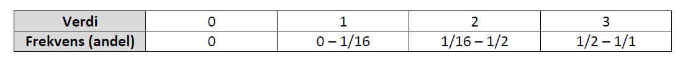

<!-- Replace 'indicator name' with yor own indicator name  -->

# Slitasje og kjørespor

<br />

*Author and date:* Anders L. Kolstad

```{r}
Sys.Date()
```

<br />

<!-- Load all you dependencies here -->

```{r setup, include=FALSE}
library(knitr)
library(sf)
library(tmap)
library(ggplot2)
library(units)
library(tidyverse)
knitr::opts_chunk$set(echo = TRUE)
```

<!-- Fill in which ecosystem the indicator belongs to, as well as the ecosystem characteristic it should be linked to. It's OK to use some Norwegian here -->

```{r, echo=F}
Ecosystem <- "Våtmark, Naturlig åpne områder under skoggrensa, Semi-naturlig mark" 
Egenskap  <- "Primærproduksjon (evt. Abiotiske fohold)"
ECT       <- "Physical state characteristics" 
Contact   <- "anders.kolstad@nina.no"
```

```{r, echo=F}
metaData <- data.frame(Ecosystem,
                       "Økologisk egenskap" = Egenskap,
                       "ECT class" = ECT)
knitr::kable(metaData)
```

<!-- Don't remove these three html lines -->

<br /> <br />

<hr />

<!-- Document you work below. Try not to change  the headers too much. Data can be stored on NINA server. Since the book is rendered on the R Server this works fine, but note that directory paths are different on the server compared to you local machine. If it is not too big you may store under /data/ on this repository -->

## Introduction

<!-- Text here -->

## About the underlying data

<!-- Text here -->

### Representativity in time and space

<!-- Text here -->

### Original units

<!-- Text here -->

### Temporal coverage

<!-- Text here -->

### Aditional comments about the dataset

<!-- Text here -->

## Ecosystem characteristic

### Norwegain standard

<!-- Text here -->

### <!-- Text here -->

<!-- Text here. Note that there are two parallell systems for defining ecosystem properties - one Norwegian and one international (SEEA EA). See man/SEEA EA examples.pdf for help -->

## Collinearities with other indicators

<!-- Text here -->

## Reference state and values

### Reference state

<!-- Text here -->

### Reference values, thresholds for defining *good ecological condition*, minimum and/or maximum values

<!-- Text here -->

## Uncertainties

<!-- Text here -->

## References

<!-- Text here -->

## Analyses

### Data sets

#### Nature type mapping

This indicator uses the dataset
`Naturtyper etter Miljødirektoratets Instruks`, which can be found
[here](https://kartkatalog.geonorge.no/metadata/naturtyper-miljoedirektoratets-instruks/eb48dd19-03da-41e1-afd9-7ebc3079265c).
See [here](#naturtype) for a detailed description of the dataset.

Importing the full dataset can be done like this, but because it can
take a few seconds due to its size, I will cache the data on the P
server.

```{r}
dir <- substr(getwd(), 1,2)
```

```{r, eval=F}
path <- ifelse(dir == "C:", 
               "P:/41201785_okologisk_tilstand_2022_2023/data/Natur_Naturtyper_NiN_norge_med_svalbard_25833.gdb",
               "/data/P-Prosjekter2/41201785_okologisk_tilstand_2022_2023/data/Natur_Naturtyper_NiN_norge_med_svalbard_25833.gdb")

naturetypes <- sf::st_read(dsn = path)
```

We also have a separate summary file where the nature types are manually
mapped to the correct NiN-main types. We can use this to find the nature
types associated with the NiN main types that we are interested in.

```{r}
naturetypes_summary <- readRDS("data/naturetypes/natureType_summary.rds")
```

We are only interested in a few NiN main types and their mapping units
(see [here](https://ninanor.github.io/ecosystemCondition/naturtype.html)
for justification)

```{r}
main_NiN_types <- c("T12",
          "T18",
          "T21",
          "T31",
          "T33",
          "T34",
          "V1",
          "V3")
```

```{r}
naturetypes_summary <- naturetypes_summary[naturetypes_summary$NiN_mainType %in% main_NiN_types,]
```

Sub-setting the main data file:

```{r, eval=F}
naturetypes <- naturetypes[naturetypes$naturtype %in% naturetypes_summary$Nature_type,]
```

Fix duplicated name for an ecosystem

```{r, eval=F}
naturetypes$hovedøkosystem[naturetypes$hovedøkosystem=="Naturlig åpne områder i lavlandet"] <- "Naturlig åpne områder under skoggrensa"
```

Export subsetted data set

```{r, eval=F}
saveRDS(naturetypes, "/data/P-Prosjekter2/41201785_okologisk_tilstand_2022_2023/data/rds/naturtyper.rds")
```

Import back in

```{r}
naturetypes <- readRDS("/data/P-Prosjekter2/41201785_okologisk_tilstand_2022_2023/data/rds/naturtyper.rds")

```

```{r, fig.cap="An overview of the naturetypes for which we will calculate the indicator. Colours refer to the main ecosystem affiliation."}
ggplot(data = naturetypes, aes(x = naturtype, fill = hovedøkosystem))+
  geom_bar()+
  coord_flip()+
  theme_bw(base_size = 12)+
  guides(fill = "none")+
  xlab("")+
  ylab("Number of localities")
```

Calculate area

```{r}
naturetypes$area <- sf::st_area(naturetypes)
```

The nin variables are combined into a single field which we need to spit
apart.

```{r}
naturetypes <- tidyr::separate_rows(naturetypes,
                                    ninbeskrivelsesvariabler,
                                    sep=",") %>%
  separate(col = ninbeskrivelsesvariabler,
           into = c("NiN_variable_code", "NiN_variable_value"),
           sep = "_",
           remove=F
           )
```

Convert the value column to numeric. Ignore NA's

```{r}
naturetypes$NiN_variable_value <- as.numeric(naturetypes$NiN_variable_value)
```

Keep only the relevant variables

```{r}
myVars <- c(
  #"7FA",     #treated separately in a different indicator
  "7SE", "7TK", "PRTK", "PRSL")
naturetypes <- filter(naturetypes,
                      NiN_variable_code %in% myVars)
```

Colum names starting with a number is problematic, so adding a prefix

```{r}
naturetypes$NiN_variable_code <- paste0("var_", naturetypes$NiN_variable_code)
```

Now I need to create a single row per locality with a new variable which
is a product of the four variables "7SE", "7TK", "PRTK" and "PRSL". I
will create a new data table where I calculate the new variable which I
then paste back into the sf object.

```{r}
naturetypes_wide <- pivot_wider(naturetypes,
                                names_from = "NiN_variable_code",
                                values_from = "NiN_variable_value",
                                id_cols = "identifikasjon_lokalid")
naturetypes_wide <- as.data.frame(naturetypes_wide)
head(naturetypes_wide)
```

The variables use slightly different scales. PRSL and PRTK use this 8
step scale:

{width="400"}

7TK and 7SE use a 4 step scale 

I want to base this indicator on whichever of the variables have the
highest value (worst condition). This table shows that a locality may
have been assessed with both a PR variable and a NiN variable

```{r}
table(naturetypes_wide$var_7SE, naturetypes_wide$var_PRTK)
```

Therefore I need to reconcile these scales. The only way I can think of
is to decrease the resolution of the PR variables to the ar4b scale.
This is of course a shame to loose this detail.

A locality will never have values for both 7SE and PRSL

```{r}
table(naturetypes_wide$var_7SE, naturetypes_wide$var_PRSL)
```

nor 7TK and PRTK

```{r}
table(naturetypes_wide$var_7TK, naturetypes_wide$var_PRTK)
```

```{r}
naturetypes_wide$var_7TK <-  ifelse(is.na(naturetypes_wide$var_7TK),
                              ifelse(naturetypes_wide$var_PRTK == 0, 0,
                                ifelse(naturetypes_wide$var_PRTK < 3, 1,
                                  ifelse(naturetypes_wide$var_PRTK < 6, 2, 3))),
                            naturetypes_wide$var_7TK)
```

Checking that I successfully combined classes 1+2, 3+4+5 and 6+7.

```{r}
table(naturetypes_wide$var_7TK, naturetypes_wide$var_PRTK,
      deparse.level = 2)
```

That looks fine. Now doing the same for the other variable PRSL:

```{r}
naturetypes_wide$var_7SE <-  ifelse(is.na(naturetypes_wide$var_7SE),
                              ifelse(naturetypes_wide$var_PRSL == 0, 0,
                                ifelse(naturetypes_wide$var_PRSL < 3, 1,
                                  ifelse(naturetypes_wide$var_PRSL < 6, 2, 3))),
                            naturetypes_wide$var_7SE)
```

Remove the old PR variables

```{r}
naturetypes_wide <- select(naturetypes_wide,
                           -var_PRTK,
                           -var_PRSL)
```

There are some very few cells with X's. These are NA's.

```{r}
naturetypes_wide$var_7SE[naturetypes_wide$var_7SE == "X"] <- NA
naturetypes_wide$var_7TK[naturetypes_wide$var_7TK == "X"] <- NA

naturetypes_wide$var_7SE <- as.numeric(naturetypes_wide$var_7SE)
naturetypes_wide$var_7TK <- as.numeric(naturetypes_wide$var_7TK)
```

```{r}
head(naturetypes_wide)
anyDuplicated(naturetypes_wide$identifikasjon_lokalid)
```

7SE has `r nrow(naturetypes_wide[is.na(naturetypes_wide$var_7SE),])`
NA's, and 7TK has
`r nrow(naturetypes_wide[is.na(naturetypes_wide$var_7TK),])`.

```{r, fig.cap="7SE scores in the naturetype dataset"}
temp <- naturetypes_wide %>%
  group_by(var_7SE) %>%
  summarise(sum = n())

ggplot(temp, aes(x = factor(var_7SE),
                 y = sum))+
  geom_bar(stat="identity",
           fill="grey",
           colour = "black")+
  theme_bw(base_size = 12)+
  labs(x = "7SE score",
       y = "Number of localities")
```

The NA fraction is quite big. These are localities with 7TK recorded,
but not 7SE.

```{r, fig.cap="7TK scores in the nature type dataset"}
temp <- naturetypes_wide %>%
  group_by(var_7TK) %>%
  summarise(sum = n())

ggplot(temp, aes(x = factor(var_7TK),
                 y = sum))+
  geom_bar(stat="identity",
           fill="grey",
           colour = "black")+
  theme_bw(base_size = 12)+
  labs(x = "7TK score",
       y = "Number of localities")
```

Then I can combine these two variables into a composite variable called
`slitasje`

```{r, warning=F}
naturetypes_wide$slitasje <- apply(naturetypes_wide[,c("var_7TK", "var_7SE")], 1, max, na.rm=T)
```

When both variables are NA, we get -Inf. There were nine cases of this.
Removing these now.

```{r}
naturetypes_wide <- naturetypes_wide[naturetypes_wide$slitasje>=0,]
```

```{r, fig.cap="Slitasje scores."}
temp <- naturetypes_wide %>%
  group_by(slitasje) %>%
  summarise(sum = n())

ggplot(temp, aes(x = factor(slitasje),
                 y = sum))+
  geom_bar(stat="identity",
           fill="grey",
           colour = "black")+
  theme_bw(base_size = 12)+
  labs(x = "slitasje score",
       y = "Number of localities")
```

I appears most localities are in good condition.

I would also like to know how often 7TK was defining of the
slitasje-indicator, and how often it was 7SE. I can do this by taking
the difference

```{r, fig.cap="Counting the number of cases where 7TK or 7SE ws defining of the slitasje indicator score."}
diff <- naturetypes_wide$var_7SE - 
        naturetypes_wide$var_7TK

diff <- ifelse(diff == 0, "7TK and 7SE",
               ifelse(diff <0, "7TK", "7SE"))

diff_tbl <- as.data.frame(table(diff))

ggplot(diff_tbl, aes(x = diff, y = Freq))+
  geom_bar(stat = "identity",
           colour = "black",
           fill = "grey")+
  theme_bw(base_size = 12)+
  labs(x = "Defining variable",
       y = "Number of localities")
```

Looks like 7SE is more likely to be in a detrimental state.

Now I will copy these slitasje-values into the sf object.

```{r}
naturetypes$slitasje <- naturetypes_wide$slitasje[match(naturetypes$identifikasjon_lokalid, naturetypes_wide$identifikasjon_lokalid)]
#nrow(naturetypes[is.na(naturetypes$slitasje),])  # 13 cases
naturetypes <- naturetypes[!is.na(naturetypes$slitasje),]
```

#### GRUK

This variable is also recorded in GRUK. The nature type dataset I'm
working on here includes this data already (presently only 2021
included). GRUK also records a related variable:
`% cover in 5m radii circles`. This data is not published. In any case
it is better to use the harmonized dataset.

#### ANO

Arealrepresentativ Naturovervåking (ANO) consist of 1000 systematically
placed locations each with 18 sample points. In each sample point a
circle of 250 m2 is visualised, and the main ecosystem is recorded.
Depending on the main ecosystem, certain NiN variables are also
recorded. 7SE is recorded for våtmark, but not semi-natural areas or
naturally open areas. 7TK is recorded in våtmark and naturally open
areas only.

| Variable | Våtmark | Naturlig åpne områder | Semi-naturlige områder |
|----------|---------|-----------------------|------------------------|
| 7SE      | X       | \-                    | \-                     |
| 7TK      | X       | X                     | \-                     |

: Table showing which main ecosystems the two NiN variables 7SE and 7TK
is recorded in withing the ANO dataset.

It would be very nice to have 7SE recorded for naturally open areas.
This variable is very relevant here.

I think I will only use våtmark here since my approach will be to the
'worst value' of the variable 7SE and 7TK (see below). I think not
having 7SE for naturally open areas will underestimate the degree of
degredation in these areas.

```{r}
path <- ifelse(dir == "C:", 
        "P:/41201785_okologisk_tilstand_2022_2023/data/Naturovervaking_eksport.gdb",
        "/data/P-Prosjekter2/41201785_okologisk_tilstand_2022_2023/data/Naturovervaking_eksport.gdb")

ano <- sf::st_read(path,
                   layer = "ANO_SurveyPoint") %>%
  dplyr::filter(hovedoekosystem_punkt == "vaatmark")
```

```{r}
table(ano$aar)
```

This dataset only contains data from year 2019 and 2021.

Each point/row here is 250 square meters. The data also contains
information about how big a proportion of this area is made up of the
dominant main ecosystem. However, there are
`r (NAS <- length(ano$andel_hovedoekosystem_punkt[is.na(ano$andel_hovedoekosystem_punkt)]))`
NA's here, which is `r round(NAS/nrow(ano), 2)*100`% of the data.

It appears the proportion of each circle that is made up of the dominant
ecosystem was only recorded after year 2019. In fact, the main ecosystem
was not recorded at all in 2019:

```{r}
table(ano$hovedtype_250m2, ano$aar)
```

I can remove the NA's, and thus the 2019 data.

```{r}
ano <- ano[!is.na(ano$andel_hovedoekosystem_punkt),]
```

Let's look at the variation in the recorded proportion of ecosystem
cover

```{r}
par(mar=c(5,6,4,2))
plot(ano$andel_hovedoekosystem_punkt[order(ano$andel_hovedoekosystem_punkt)],
     ylab="Percentage of the 250 m2 area\ncovered by the main ecosystem")
```

The zero in there is an obvious mistake.

```{r}
ano <- ano[ano$andel_hovedoekosystem_punkt>20,]
```

Here's another plot of the distribution of the same variable:

```{r, warning=F, fig.cap="Percentage cover of the Våtmark main ecosystem in the 250m2 circle"}
ggplot(ano, aes(x = andel_hovedoekosystem_punkt))+
         geom_histogram(fill = "grey",
                        colour="black",
                        binwidth = 1)+
  theme_bw(base_size = 12)+
  xlab("Percentage cover of the Våtmark main ecosystem\n in the 250m2 circle")+
  scale_x_continuous(limits = c(0,101),
                     breaks = seq(0,100,10))
```

We can see that people tend to record the variable in steps of 5%, and
that most sample points are 100% belonging to the same main ecosystem.

We want to use area weighting in this indicator, so we can use this
percentage cover data to calculate the area. Note that both datasets use
m2 as area units.

```{r}
ano$area <- (ano$andel_hovedoekosystem_punkt/100)*250
```

Let's now look at the distribution of the variables. First I need to
sepertae the variable name fro the values themsolves. Now the data looks
like this:

```{r}
ano$bv_7se[1:6]
```

So I create a new variable prefixed var\_:

```{r}
ano$var_7SE <- as.numeric(sub(pattern = "7SE_",
                 replacement = "",
                 x = ano$bv_7se))
```

The NA's is the case of blank cells. The field app should not allow
users leaving this field blank. I will need to remove these rows. There
are fourteen cases:

```{r}
nrow(ano[is.na(ano$var_7SE),])
```

```{r}
ano <- ano[!is.na(ano$var_7SE),]
```

Same with the other variable 7TK

```{r}
ano$var_7TK <- as.numeric(sub(pattern = "7TK_",
                 replacement = "",
                 x = ano$bv_7tk))
```

No NA's this time.

```{r, fig.cap="Distribution of 7TK and 7SE scores in the ANO data"}
par(mfrow=c(1,2))
barplot(table(ano$var_7TK), xlab="7TK scores")
barplot(table(ano$var_7SE), xlab="7SE scores")
```

Combining these two variables into the indicator, same as for the nature
type data.

```{r}
temp <- as.data.frame(ano)
temp$slitasje <- apply(temp[,c("var_7TK", "var_7SE")], 1, max, na.rm=T)
ano$slitasje <- temp$slitasje
```

```{r, fig.cap="Distribution of slitasje scores in the ANO data"}
barplot(table(ano$slitasje), xlab="Sliatsje scores")
```

### Combine datasets

We need to combine the nature type dataset with the ANO dataset. I will
add a column `origin` to show where the data comes from. I will also and
add data about the main ecosystem.

```{r}
ano$origin <- "ANO"
naturetypes$origin <- "Nature type mapping"
ano$hovedøkosystem <- "Våtmark"
ano$kartleggingsår <- ano$aar
```

I will loose the sf class and the crs when joining the datasets, so I
will save the crs

```{r}
sf::st_crs(ano) == sf::st_crs(naturetypes) # TRUE
myCRS <- st_crs(ano)
```

Fix class

```{r}
naturetypes$kartleggingsår <- as.numeric(naturetypes$kartleggingsår)
naturetypes$area <- units::drop_units(naturetypes$area)
```

I can reduce the number of columns to keep things a bit more tidy

```{r}
temp <- as.data.frame(ano)
temp2 <- as.data.frame(naturetypes)
slitasje_data <- full_join(select(temp,
                                  GlobalID,
                                  origin,
                                  kartleggingsår,
                                  hovedøkosystem,
                                  area,
                                  slitasje,
                                  SHAPE), 
                           select(temp2,
                                  identifikasjon_lokalid,
                                  origin,
                                  hovedøkosystem,
                                  kartleggingsår,
                                  area,
                                  slitasje,
                                  SHAPE))
# convert back to sf object
slitasje_data <- st_as_sf(slitasje_data)
st_crs(slitasje_data) <- myCRS
```

```{r, fig.cap="Slitasje scores."}
temp <- slitasje_data %>%
  group_by(slitasje) %>%
  summarise(sum = n())

ggplot(temp, aes(x = factor(slitasje),
                 y = sum))+
  geom_bar(stat="identity",
           fill="grey",
           colour = "black")+
  theme_bw(base_size = 12)+
  labs(x = "slitasje score",
       y = "Number of localities")
```

Let's see the propotion of datapoints (not area) origination from each
data set

```{r, fig.cap="Barplot show the contribution (number of localities) of different data sets to the slitasje indicator."}
barplot(table(slitasje_data$origin),
        ylab="Number of localities")
```

So the ANO data is not very important here, bu it can become more
important in the future.

#### Outline of Norway and regions

```{r}
outline <- sf::read_sf("data/outlineOfNorway_EPSG25833.shp")
```

```{r}
regions <- sf::read_sf("data/regions.shp")
```


#### Infrastructure index
The infrastructure index is explained [here](https://brage.nina.no/nina-xmlui/handle/11250/2983607).
I use it as a kind of pressure or human influence index. It is likely to be a good predictor for *slitasje*.

```{r}
# The original data is here, on the R server, but it is not always working, so I also include a copy on the P server.

#path <- ifelse(dir == "C:", 
#        "R:/GeoSpatialData/Utility_governmentalServices/Norway_Infrastructure_Index/Original",
#        "/data/R/GeoSpatialData/Utility_governmentalServices/Norway_Infrastructure_Index/Original")
#

path <- ifelse(dir == "C:", 
        "P:/41201785_okologisk_tilstand_2022_2023/data/infrastrukturindeks",
        "/data/P-Prosjekter2/41201785_okologisk_tilstand_2022_2023/data/infrastrukturindeks")


```

Import a stars proxy (no data imported yet)
```{r, eval=F}
infra <- stars::read_stars(paste0(path, "/NY_INFRA_IND.tif"))
```


It's easier to see what's happening if we zoom in a bit. 
Lets get a boundary box around Trondheim.
```{r}
myBB <- st_bbox(c(xmin=260520.12, xmax = 278587.56,
                ymin = 7032142.5, ymax = 7045245.27),
                crs = st_crs(infra))
```

Cropping the raster to speed up processing.
```{r}
infra_trd <- sf::st_crop(infra, myBB)
```

Transform to lat long dye to osm requirements
```{r, warning=F}
infra_trd_ll <- sf::st_transform(infra_trd, 4326)
```

Get the boundary box of the cropped raster
```{r}
myBB_ll <- sf::st_bbox(infra_trd_ll)
```

Download highways using the above bbox.
```{r, warning=FALSE, message=F, eval=F}
hw <- 
  osmplotr::extract_osm_objects(
    bbox = myBB_ll,
    key = "highway",
    sf = T)
```

Transforming highway data back into utm, although not strictly necessary.
```{r, eval=F}
hw_utm <- sf::st_transform(hw, sf::st_crs(infra_trd)) 
```

This object contains too many roads. I'll take out the unnamed roads. 
```{r, eval=F}
hw_utm <- hw_utm[!is.na(hw_utm$name),]
```

Caching the sf object
```{r, eval=F}
saveRDS(hw_utm, "data/cache/highways_trondheim.rds")
```

Load object
```{r}
hw_utm <- readRDS("data/cache/highways_trondheim.rds")
```


```{r, fig.cap="Infrastrcture indeks over Trondheim. Major roads are in white."}
map_trd <- tm_shape(infra_trd)+
  tm_raster(title="Infrastructure Index",
            style="cont",
            palette = "viridis")+
  tm_layout(legend.outside = T)+
  tm_shape(hw_utm)+
  tm_lines(col="white")
map_trd
```

The infrastructure index is in EPSG32633. I will need to transform it. It takes a couple of minutes, so I will store the result in P and load it back in afterwards.
```{r, eval=F}

path <- ifelse(dir == "C:", 
        "P:/41201785_okologisk_tilstand_2022_2023/data/infrastrukturindeks",
        "/data/P-Prosjekter2/41201785_okologisk_tilstand_2022_2023/data/infrastrukturindeks")

infra <- sf::st_transform(infra, 25833)
stars::write_stars(infra, paste0(path, "/infrastrukturindeksEPSG_EPSG35833.tif"))
```

```{r}
infra2 <- stars::read_stars(paste0(path, "/infrastrukturindeksEPSG_EPSG35833.tif"))
```

```{r}
names(infra_trd) <- "infrastructureIndex"
infra_trd_reclassed <-  infra_trd %>%
  mutate(infrastructureIndex = case_when(
    infrastructureIndex < 1 ~ 0,
    infrastructureIndex < 6 ~ 1,
    infrastructureIndex < 9 ~ 2,
    infrastructureIndex >= 9 ~ 3
  ))
```

```{r}
map_trd_reclassed <- tm_shape(infra_trd_reclassed)+
  tm_raster(title="Infrastructure Index",
            #palette = "viridis",
            style="cat")+
  tm_layout(legend.outside = T)+
  tm_shape(hw_utm)+
  tm_lines(col="white")

```


```{r, fig.cap="Infrastrcture indeks over Trondheim, comparing the continous scale with the ordinal four-step scale. Major roads are in white."}
tmap_arrange(map_trd,
             map_trd_reclassed,
             ncol=1)
```

I tweaked the thresholds so that most of the forest next to Trondheim was i the second lowest class.


### Scaled indicator values

<!-- Text and analyses here -->

I can scale the indicator for each polygon, or I can chose to aggregate
them first. If the scaled value is representative and precise at the
polygon level, then I could scale at that level. However, the combined
surveyed area is still so little of the total area of Norway, so that
only producing indicator values for these leaves the indicator without
much value for regional assessments. Later when we produce assessments
and indicator values at the regional level, we cannot simply do an area
weighting of the polygons in each region. This is because we don't want
to assume that the polygons are representative far outside of the mapped
area. But perhaps we can assume them to be representative inside
*homogenous ecological areas*. That's where the infrastructure index comes in. I will scale the indicators at the polygon level. I then take the simplified infrastructure index and, one class at the time, extract the indicator value that intersect with those cells, and extrapolate the mean of those values to all similar cell within a given region.


### Uncertainty

<!-- Text here -->
Bootstrapping of nin-polygons per infrastructure class and region?

## Prepare export

<!-- Text here -->

### Eksport file (final product)

<!-- Export final file. Ideally a georeferenced shape or raster wit indicators values (raw and normalised), reference values and errors. -->
