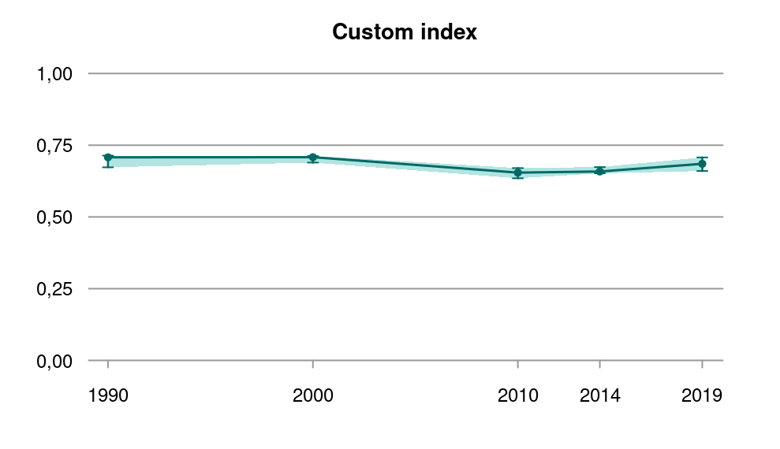

# Nature index product

<br />

*Author and date:*

Chloé R. Nater

September 2023

<br />

<!-- Load all you dependencies here -->

```{r setup, include=FALSE}
library(NIflex)
library(magrittr)
library(knitr)
knitr::opts_chunk$set(echo = TRUE)
```

<!-- Fill in which ecosystem the indicator belongs to, as well as the ecosystem characteristic it should be linked to. It's OK to use some Norwegian here -->

```{r, echo=F}
Ecosystem <- "Våtmark (også fjell og skog)" 
Egenskap  <- "Biologisk mangfold" 
ECT       <- "Compositional state characteristic"
Contact   <- "Chloé R. Nater" 
```

```{r, echo=F}
metaData <- data.frame(Ecosystem,
                       "Økologisk egenskap" = Egenskap,
                       "ECT class" = ECT)
knitr::kable(metaData)
```

<!-- Don't remove these three html lines -->

<br /> <br />

<hr />

<!-- Document you work below. Try not to change  the headers too much. Data can be stored on NINA server. Since the book is rendered on the R Server this works fine, but note that directory paths are different on the server compared to you local machine. If it is not too big you may store under /data/ on this repository -->

## Introduction

The Norwegian Nature Index (NI) is a composite metric for quantifying the state of biodiversity in an abundance-context.
It has been established and published for the first time in 2010 and has since been updated for years 2011, 2012, 2013,2014, and 2019.
It is owned and presented by the Norwegian Environmental Agency and the latest iteration, including a lot of information, can be found on its webpage: <https://www.naturindeks.no/>

NI is a composite index made up of single- and multi-species (abundance) indicators that are scaled to fall between 0 and 1 (where 0 = absent/extinct and 1 = abundance corresponding to expected abundance in a natural environment with minimum human disturbance).
During the aggregation process, indicators are weighed on three levels: functional group (trophic weights), spatial coverage (area weights)and key function (key weights).

The methodology for calculating NI is well established and has been described in detail in NINA reports 347 [@nybo2008a], 425 [@nybo2008b], 797 [@pedersen2012], 1130 [@pedersen2015], and 1886 [@jakobsson2020] and several international scientific articles [e.g. @certain2011] and will not be elaborated on further here.

It is important to note that the NI products that are used indicators in Ecosystem Condition Assessment and the Norwegian Nature Index that has been previously published, and will be published again in 2025, as a national biodiversity assessment are not identical.
We use modified versions of the NI in Ecosystem Condition Assessments, the details of which will be described below.
Moving forward, it will be important to stress this distinction, and we will therefore start talking about "NI products" when referring to composite indices built based on data in the Nature Index Database (see below) that are not identical to the regularly published national assessments (i.e. what is published on <https://www.naturindeks.no/>).

## About the underlying data

The data underlying NI products is stored in the Nature Index Database at <https://naturindeks.nina.no/>.
The database needs login credentials for access.

In the database, data on a large number of indicators are stored separately for different areas and different years.
The areas and years available for each indicator vary but most indicators have data for years 2000, 2010, 2014, and 2019.
The database currently also holds data for 1990, but for many indicators, no data is available for this year.
New data will be added in 2024, and we are currently working on extending the database such that it may also hold data from years in between official NI updates.

The data held in the NI database are a mixture of observational data, modelled estimates, and quantitative expert assessments.

Here, we focus primarily on an NI product for wetlands, and the following table gives an overview of the indicators included in the official NI for wetlands in 2020.
It also provides information on each indicators trophic level, underlying data, whether we expect updated indicator data towards NI 2025, and additional notes.

```{r, echo = FALSE}

indicatorTable <- readRDS(paste0(here::here(),"/data/indicatorTable.RDS"))

indicatorTable %>%
  kableExtra::kbl(caption = "Overview of indicators used in wetlands NI 2020:") %>%
  kableExtra::kable_styling(fixed_thead = TRUE) 
```

### Representativity in time and space

NI products for inclusion in Ecological Condition Assessments are can currently be calculated for years 1990, 2000, 2010, 2014, and 2019, which correspond to the years in which the official NI updates took place.
Ecosystem level NI products are calculated for 5 major regions in Norway: "Nord-Norge" (northern Norway), "Sør-Norge" (southern Norway), "Midt-Norge" (central Norway), "Vestlandet" (western Norway), and "Østlandet".
In theory, it would be possible to calculate NI products also for other, including smaller, spatial units, but this would require additional coding.
It is also important to note that the spatial resolution of the indicators that make up a specific NI product can vary substantially.
As many indicators have rather crude spatial resolution, scaling NI products down to smaller spatial units may not make a lot of sense.
Consequently, it is important to keep in mind that NI products, even plotted to a map, quantify trends in biodiversity at relatively large spatial scales, and are not suitable for quantifying and comparing biodivseristy in small and very localised areas.

### Original units

The NI is a composite index made up of scaled indicators.
NI products are therefore numbers between 0 and 1 (more specifically a set of simulated numbers resulting from a bootstrap, and derived summary metrics including mean, median, and 95 % confidence intervals) that have no unit.

### Temporal coverage

As mentioned above, NI products can currently be calculated for years 1990, 2000, 2010, 2014, and 2019.
From 2025, calculations based on new data from 2024 will become available.

### Aditional comments about the dataset

There are missing values in the NI database.
The proportion of missing data values depends on the individual indicators that are to be included in an NI product.
As part of the NI analysis workflow, missing data values can be imputed using the MICE (Multivariate Imputation by Chained Equations) algorithm.
This is an imputation procedure that uses (temporal) correlations among included indicators to make inference about missing values.
Uncertainty due to NA imputation is propagated into the final NI product.
Since the imputation procedure is based on correlations, it will be influenced by the composition of the dataset, i.e. the choice of indicators, years, and locations will affect the parameters in the imputation routine.
For now, we recommend using data for all official NI years when calculating products with NA imputation as this will be the approach that most closely resembles the routine used for the official regular NI analyses.

## Ecosystem characteristic

### Norwegain standard

NI products are regarded as indicators of biodiversity ("biologisk mangfold").
It is important to note though that NI products represent species abundance in this context and are **not** indicators of species richness or species distribution.

### SEEA EA (UN standard)

NI products are tagged as "Compositional state characteristic".
This seems like the obvious choice for biodiversity indicators that focus on species richness, but may need revisiting for NI products, which are indicators of species abundance.

## Collinearities with other indicators

There is a substantial potential for collinearity between NI products and other indicators, primarily due to the fact that a range of indicators that may be part of an NI product for a given ecosystem may also enter the Ecological Condition Assessment as indicators in their own right or through other composite indicators.
For the wetlands ecosystem, this is the case, for example, for the bird indicators based on data from "Hekkefuglovervåkingen".
These indicators form an important proportion of wetlands NI products (at least how they are defined now) but also enter into the Ecological Condition Assessment as a composite bird indicator.
Collinearity between the two indicators/indices should be checked.

## Reference condition and values

### Reference condition

The reference condition is defined along the same lines for NI and for other indicators in Ecological Condition Assessments.

### Reference values, thresholds for defining *good ecological condition*, minimum and/or maximum values

As NI products are already scaled to range from 0 to 1 and reference conditions are set according to the same approach, the reference value is 1.
For wetlands ecosystems in particular, we have not yet discussed the definition of "good ecological condition", but it seems that in the Ecological Condition Assessments for forest and mountain ecosystems, 0.6 was used as "good ecological condition" consistent with the approach from "Vanndirektivet".
To what degree this is appropriate is difficult to judge.
It may well be best to use 0.6 due to its consistency with other frameworks (e.g. Vanndirektivet) as it would be challenging to otherwise determine what is "good enough" condition for a highly derived variable such as NI products.

## Uncertainties

Calculated NI products are actually composed of a pre-defined number of random samples from a probability distribution drawn during an internal bootstrap implemented in the R package NIcalc.
These draws can be summarised with metrics such as mean, median, confidence intervals.
etc.
The degree of uncertainty is determined by a) the uncertainty associated with each indicator's data as deposited in the NI database and b) the uncertainty resulting from imputation of missing values.

Besides these "quantitative" sources of uncertainty, there is also "qualitative" uncertainty linked to using NI products as indicators in Ecological Condition Assessments.
This is linked to methodological questions regarding how (and perhaps if) highly processed composite indices should be included as indicators to make other composite indices.
While some of these questions are of a more philosohpical nature, some more pragmatic ones include decisions about which indicators to include/exclude (especially considering indicators that may get used directly and via NI products and indicators that do not really quantify species abundance), how to weigh indicators, and whether or not to impute NA values as part of generating the NI product.

We present some thoughts and suggestions regarding these latter questions in the next section.
## Suggestions for using NI products in Ecological Condition Assessments [This section will hold some insights and suggestions based on a discussion to be held once Anders is back from leave.
Content will be added later.]

## References

::: {#refs}
:::

## Analyses

The following analysis workflow is almost entirely arranged in functions.
The functions for the different steps are from the NIflex R package (<https://github.com/NINAnor/NIflex>).Many of the NIflex functions call on functions from NIcalc (<https://github.com/NINAnor/NIcalc>), the R package written for entering and extracting data from the NI database and calculating NI products from it.
Before proceeding any further, we therefore need to make sure that both of these packages and their dependencies are installed:

```{r}
if(system.file(package = 'NIcalc') == ""){
  devtools::install_github("NINAnor/NIcalc", build_vignettes = TRUE)
}

if(system.file(package = 'NIflex') == ""){
  devtools::install_github("NINAnor/NIflex", build_vignettes = TRUE)
}
```

NIflex was written to provide a flexible workflow for calculating a range of NI products including the original NI for all seven main ecosystems, a range of previously used thematic indices, fully custom indices and -- most important here -- NI products aimed for use in Ecological Condition Assessments for forest, mountain, and wetland ecosystems.

Below I walk through the workflow for an NI product for the Ecosystem Condition Assessment for wetlands.
I will not provide a lot of additional details on the functions and their arguments here as all necessary information is included in the function documentation.

### Data sets

#### Nature Index database

All data required for making the NI product are contained in the NI database (<https://naturindeks.nina.no/>).
Accessing the database requires a username and a password.
At present, this setup works with the username and password saved as personal environmental variables `NIDB_USERNAME` and `NIDB_PASSWORD`.

```{r, eval=FALSE}
NIdb_username <- Sys.getenv("NIDB_USRNAME")
NIdb_password <- Sys.getenv("NIDB_PASSWORD")
```

User credentials can be requested from NINA.

#### Regions

As mentioned above, ecosystem-level NI products are calculated for five major regions in Norway: "Nord-Norge" (northern Norway), "Sør-Norge" (southern Norway), "Midt-Norge" (central Norway), "Vestlandet" (western Norway), and "Østlandet".
For georeferencing values and plotting them onto a map, shapefiles for these regions are required.
The relevant files can be downloaded in JSON format from the NI API (<https://ninweb08.nina.no/NaturindeksAPI/index.html>) and subsequently need to be transformed into shapefiles.

In this workflow, we access the shapefiles that are deposited on NINA's internal file system:

```{r}
shapeLibraryPath <- "/data/P-Prosjekter/41201611_naturindeks_2021_2023_vitenskapelig_ansvar/Shapefiles"
```

### Workflow options

NIflex offers a workflow for calculating NI products that can be customized in terms of a range of options.
So next, we set the global options for calculating our wetlands NI product, starting with the years of data we want to include.
Since we may want to use NA imputation, we select all official NI years:

```{r}
years <- c("1990", "2000", "2010", "2014", "2019")
```

Next, we decide what type of output we want and whether or not to impute missing values

```{r}
OutputType <- "EcologicalCondition"
EC_ecosystem <- c("Wetlands", "Våtmark")

NAImputation <- TRUE 
```

and continue to set how we want indicators to be weighed.
At present, we will not use key indicator weights, but we will still weigh according to area and trophic group:

```{r}
KeyIndicators <- FALSE
KeyWeight <- 0.5

AreaWeights <- TRUE 

TrophicWeights <- TRUE
```

We also need to state that we want to use Norwegian indicator names

```{r}
norwegianNames <- TRUE
```

and set the way in which we want to specify which indicators are dropped.
There are two options for this: "pre-defined" drops the hard-coded set of indicators that should be dropped in any case.
So far, there is only one indicator that gets dropped for wetlands and that is "lavhei" (due to low representativeness for the ecosystem).
It's also possible to set it to "custom" and specify which indicators should be dropped, but we are not doing that here.

```{r}
DropIndMode <- "pre-defined"
if(DropIndMode == "pre-defined"){DropIndList <- NULL}
```

With the final options, we choose whether we want dataset diagnostics to be calculated and also whether we want to run a test run or a full run:

```{r}
Diagnostics <- TRUE # Yes
TestRun <- TRUE # Yes
```

The difference for the latter is that in a test run, we only run NA imputation and bootstrap for 10 iterations instead of 1000, which makes the runtime of the workflow a lot more "practical" (but 1000 or even more iterations should be run for the final results).

### Scaled indicator values

Before beginning index calculation, there are a few more conditional variables that need to be set, namely the Norwegian name of the ecosystem and the lists of indicators to use and indicators to drop.

```{r}
ecosystem_use <- EC_ecosystem[2]
indicators_use <- NULL

dropInd <- selectDropIndicators(DropIndMode = DropIndMode,
                                OutputType = OutputType,
                                ecosystem = ifelse(OutputType %in% c("NatureIndex", "EcologicalCondition"), ecosystem_use, NULL),
                                customList = DropIndList)
```

Note that we set `indicators_use` to `NULL` because we are working with a pre-defined set of indicators (i.e. the set linked to NI for wetlands).

We also need to set variables "theme" and "funArguments" to "none" and `NULL`, respectivel (these are used for controlling workflow elements linked to thematic indices):

```{r,eval=FALSE}
theme <- "none"
funArguments <- NULL
```

With this, we are ready to move ahead with the calculation of our wetlands NI product.
For this, we use `NIflex::calculateCustomNI()`, a wrapper function that downloads the data, runs dataset diagnostics (if requested), imputes NA values (if requested), and calculates the NI product using functions from the NIcalc package:

```{r, results = FALSE, eval=FALSE}
CustomNI <- calculateCustomNI(ecosystem = ecosystem_use,
                              indicators = indicators_use,
                              theme = theme,
                              dropInd = dropInd,
                              username = NIdb_username,
                              password = NIdb_password,
                              KeyIndicators = KeyIndicators,
                              KeyWeight = KeyWeight,
                              AreaWeights = AreaWeights,
                              TrophicWeights = TrophicWeights,
                              NAImputation = NAImputation,
                              years = years,
                              OutputType = OutputType,
                              funArguments = funArguments,
                              Diagnostics = Diagnostics,
                              TestRun = TestRun,
                              norwegianNames = norwegianNames,
                              saveSteps = FALSE)
```

```{r, echo=FALSE, message=FALSE, warning=FALSE}
CustomNI<-readRDS("data/cache/CustomNI.RDS")
```

After calculating the index values, we can extract summary metrics for a specified year and match them to geospatial data for further analysis and/or inclusion in the Ecosystem Condition framework:

```{r, eval=FALSE}
CustomNI_map <- geomapNI(Index = CustomNI$CustomIndex, 
                         year = 2019, 
                         OutputType = OutputType, 
                         ecosystem = ecosystem_use,
                         shapeLibraryPath = shapeLibraryPath)
```

```{r, echo=FALSE}
CustomNI_map<-readRDS("data/cache/CustomNI_map.RDS")
```

Next we can have a look at some visualizations of our NI product.
First, we can plot the "traditional" time-series plot of the index averaged across regions and calculate the corresponding summary metrics:

```{r, eval=FALSE}
Index <- CustomNI$CustomIndex
plot(Index$wholeArea, main = "Custom index", cex = 1, lwd = 2, shade = TRUE)
summary(Index$wholeArea)
```



```{r, echo=FALSE}
Index <- CustomNI$CustomIndex
#plot(Index$wholeArea, main = "Custom index", cex = 1, lwd = 2, shade = TRUE)
summary(Index$wholeArea)

```

The summary metrics (here median) for any given year can then be plotted onto a map by matching them up to the shapefiles:

```{r, message = FALSE, warning = FALSE}
plotNI_Map(shp = CustomNI_map,
           year = 2019,
           OutputType = OutputType,
           ecosystem = ecosystem_use,
           plotMedian = TRUE, plotCI = FALSE, plotDisplacement = FALSE,
           interactiveMap = FALSE)

```


### Uncertainty

Based on recent work done as part of a pilot study on visualizing NI products (<https://ninanor.github.io/NIviz/index.html>) I have also implemented some more advanced plotting functions.
The first one plots a time-series as well, but including the entire uncertainty distribution, not just summary statistics:

```{r, results = FALSE, message = FALSE, warning=FALSE}
Index <- Index <- CustomNI$CustomIndex

plotNI_DensityRidgeTS(Index = Index, 
                      OutputType = OutputType, 
                      ecosystem = ecosystem_use, 
                      theme = theme,
                      allAreas = FALSE, 
                      selectedArea  = "wholeArea")
```

This works for plotting values averaged across the entire Norway as above, but also by area:

```{r, results = FALSE, message = FALSE, warning=FALSE}
plotNI_DensityRidgeTS(Index = Index, 
                      OutputType = OutputType, 
                      ecosystem = ecosystem_use, 
                      theme = theme,
                      allAreas = TRUE)

```

Uncertainty can also be visualized on a map alongside the median:

```{r, message = FALSE, warning = FALSE}
plotNI_Map(shp = CustomNI_map,
           year = 2019,
           OutputType = OutputType,
           ecosystem = ecosystem_use,
           plotMedian = TRUE, plotCI = TRUE, plotDisplacement = FALSE,
           interactiveMap = FALSE)
```

Finally, the `plotNI_Map()` function also supports the option of plotting "displacement", which is a statistical artifact generated by the NI calculation routine.
In short, it's a negative number that quantifies the degree to which the mean of the index is shifted away from 1 when scaling indicators.
The higher the displacement value, the more cautious one may want to be when making inference based on summary metrics alone:

```{r, message = FALSE, warning = FALSE}
plotNI_Map(shp = CustomNI_map,
           year = 2019,
           OutputType = OutputType,
           ecosystem = ecosystem_use,
           plotMedian = TRUE, plotCI = FALSE, plotDisplacement = TRUE,
           interactiveMap = FALSE)
```
## Prepare export

Preparing the export is only a matter of renaming columns at this stage.
Using `geomapNI()` we have already extracted summaries and matched them to spatial data.
We can take the resulting object, `CustomNI_map`, rename the required columns to match the naming conventions outlined in the main document, add information on reference state, and remove columns that are not needed:

```{r}
CustomNI_map <- CustomNI_map %>%
  dplyr::rename(v_2019 = meanValue,
                sd_2019 = standardDev) %>%
  dplyr::mutate(i_2019 = v_2019,
                reference_high = 1,
                reference_low = 0,
                thr = 0.6) %>%
  dplyr::select(-medianValue, -widthCI, -displacement)
```

Note that Nature Index products only exist as scaled variables.
For that reason, there is no difference between `i_yyyy` and `v_yyyy`.

### Eksport file (final product)

Lastly, we can save the results in the designated folder:

```{r}
saveRDS(CustomNI, "indicators/naturindeks.rds")
saveRDS(CustomNI_map, "indicators/indicatorMaps/naturindeks_map.rds")
```
