# NDVI - Semi-natural Ecosystems {#NDVI-indicator-seminat}

NDVI (greenness) indicator, semi-natural ecosystems

<br /> Norwegian name: **Primærproduksjon** <br />

*Author and date:*

Joachim Töpper, Tessa Bargmann

September 2023

<br />

<!-- Load all you dependencies here -->


|Ecosystem     |Økologisk.egenskap |ECT.class                        |
|:-------------|:------------------|:--------------------------------|
|semi-naturlig |Primærproduksjon   |Structural state characteristics |

<!-- Don't remove these three html lines -->

<br /> <br />

<hr />

## Introduction {#intro-ndvis}

The Normalized difference vegetation index (NDVI) can be used to
describe the greenness of an area, and may thus represent a proxy for
the amount of chlorophyll and plant productivity in the given area.
Different ecosystem types naturally have greenness signals of different
intensity but also with a certain variance. Deviations beyond the
natural variation in either direction may indicate a reduction in
ecological condition of a given ecosystem. E.g. lower than normal NDVI
may indicate excessive disturbance, while higher than normal NDVI may
indicate regrowth and transitions towards more densely vegetated
systems. In recent assessments of ecological condition for forest and
mountain ecosystems, two different NDVI-based indicators were developed
and applied. For forests, NDVI-values across the country were compared
to a spatial reference NDVI-signal from protected areas (Framstad et al.
2020). For mountains, the extent and consistence of the temporal change
of NDVI-values over the last twenty years was assessed (Framstad et al
2021). In both cases, the NDVI-product from the MODIS satellite
reflectance imagery was used based on available maps of spatial
ecosystem extent in Norway (i.e. national maps for the forest and
mountain ecosystems).

Here, we explore the potential for developing an NDVI-indicator for
ecological condition representing open semi-natural ecosystems. For this
task, two initial challenges can be identified early on:

1.  We don't yet have a national map for semi-natural ecosystems, i.e.
    we don't know the exact locations of all semi-natural areas in
    Norway, which is a prerequisite to extract satellite data for the
    right locations and ecosystems, and thus achieve a good and unbiased
    spatial representation for the assessment area.
2.  The spatial extent of the single semi-natural ecosystem occurrences
    (hereafter 'polygons') includes many areas which are way smaller
    than the pixel size in the MODIS imagery (250 x 250 m) which was
    used for forests and mountains and has a time series back to year
    2000.

In this draft development for a NDVI indicator for ecological condition
in semi-natural systems we approach these challenges in the following
ways:

1.  We use ecosystem occurrence data from NiN-mapping to guide the
    extraction of satellite NDVI data for pixels representing the right
    ecosystem. However, the ecosystem occurrences in the NiN data are
    highly spatially biased and thus cannot provide a good and unbiased
    spatial representation for the assessment area. Our work therefore
    represents a concept and method development which may be applied in
    an assessment of ecological condition once spatially unbiased
    occurrence data or a national map of semi-natural ecosystems are
    available.
2.  We include Sentinel-2 imagery for semi-natural ecosystems as the
    resolution for the bands underlying the NDVI product here is 10 x 10
    m which is smaller than almost all semi-natural polygons in the
    NiN-data. However, since Sentinel-2 only goes back to 2015, we lose
    much of the time series aspect as compared to the MODIS data. In
    addition, we include Landsat imagery which goes back to 1984 and has
    a resolution of 30 x 30 m, but also has more variable data due to
    less frequent seasonal measurements. We also still explore NDVI data
    from MODIS (see more details below).

## About the underlying data {#underlying-data-ndvis}

In the NDVI project for semi-natural systems, we use two kinds of data
(coming as four datasets) for building indicators for ecological
condition:

-   NiN ecosystem data from 'Naturtypekartlegging etter
    Miljødirektoratets instruks' to guide extraction of NDVI data for
    the right locations and to provide information on the field-assessed
    ecological condition of mapped polygons
-   remote sensed NDVI data
    -   Sentinel-2 satellite NDVI data
    -   MODIS satellite NDVI data
    -   Landsat satellite NDVI data

(1) NiN ecosystem data: The NiN data in this study contain data about
    the ecosystem categories (cf. Halvorsen et al. 2020) present at
    mapped sites as wall as their spatial delimitation (in the form of
    polygons). Since we use NiN data that were collected following
    'Miljødirektoratets instruks', these data also include information
    on the ecological condition and underlying condition variabels of
    the mapped sites (see the Miljødirektoratets mapping manual for
    details). Polygon sizes in these NiN data may vary from \<100 sqm to
    the dimension of sqkm's.

(2) NDVI data: The NDVI data used in the work at hand are pixel means
    for polygons in the NiN-data, i.e. each NiN polygon is represented
    by one NDVI value per measurement time (see below for more details
    on the temporal resolution of NDVI data). With respect to that, it
    does only make sense to use NDVI data for polygons that are at least
    of the same size as the resolution of the respective satellite, and
    thus we excluded any polygons smaller than each satellite's
    resolution.

(2a) Sentinel-2 satellite NDVI data: The Sentinel data have a resolution
of 10 x 10 m, and we thus excluded all NiN-polygons smaller than 100
sqm. Sentinel-2 has a revisit frequency of 10 days and should thus
provide enough measurements during peak growing season to provide a
robust measure of maximum greenness.

(2b) MODIS satellite NDVI data: The MODIS data have a resolution of 250
x 250 m, and we thus excluded all NiN-polygons smaller than 62500 sqm.
MODIS has a revisit frequency of 1-2 days and thus provides an extensive
sample to provide a robust measure of maximum greenness.

(2c) Landsat satellite NDVI data: The Landsat data have a resolution of
30 x 30 m, and we thus excluded all NiN-polygons smaller than 900 sqm.
Landsat has a revisit frequency of 16 days and thus provides the poorest
growing season sample among the available NDVI data for a robust measure
of maximum greenness.

### Representativity in time and space {#representativity-ndvis}

For semi-natural systems, the NiN data contain 24494 semi-natural
polygons of known area size across mainland Norway. However, NiN-mapping
is not planned and performed in a spatially representative way and thus
both the ecosystem occurrences and their spatial extent have to be
treated as spatially biased. The 24494 semi-natural polygons are
distributed across regions and major ecosystem types in the following
way:

| Region          | T31  | T32  | T33 | T34  | T40 |
|-----------------|------|------|-----|------|-----|
| Northern Norway | 1194 | 2081 | 14  | 1    | 15  |
| Central Norway  | 641  | 2518 | 210 | 2338 | 97  |
| Western Norway  | 132  | 2922 | 94  | 2200 | 66  |
| Eastern Norway  | 1064 | 4488 | 10  | 10   | 371 |
| Southern Norway | 234  | 2317 | 112 | 749  | 111 |

In addition, there are 10 T31s, 78 T32s, 15 T33s, 59 T34s, and 1 T40
that are not assigned to any region. (These polygons likely lie in water and thus outside of the regional polygons due to imprecise coordinates from the mapping device).

The NDVI data from either satellite follow the spatial distribution and
bias status of the NiN-data. Due to the larger number of excluded
polygons in the NDVI data from MODIS (because of the large pixel size in
MODIS, see above), the MODIS NDVI data for the semi-natural occurrences
in the NiN data are likely even more spatially biased than it is the
case for the NDVI data from Sentinel-2 and Landsat.

### Temporal coverage {#temp-cov-ndvis}

The currently available NiN data on semi-natural ecosystems span a time
period from 2018-2021 and thus represent a contemporary sample of
ecosystem occurrences. Note that none of the polygons in the NiN-data
has been visited more than once during that period.

Available Sentinel-2 satellite NDVI data span the years 2015-2022.

Available MODIS satellite NDVI data span the years 2000-2022.

Available Landsat satellite NDVI data span the years 1984-2021.

## Collinearities with other indicators {#coll-ndvis}

The NDVI signal may likely be co-linear with [the re-growth indicator](https://ninanor.github.io/ecosystemCondition/gjengroing.html)
based on LiDAR derived canopy height in abandoned semi-natural areas
under shrub and tree encroachment.

## Reference state and values {#ref-state-ndvis}

### Reference state and scaling values {#ref-state2-ndvis}

This indicator project is mainly exploratory, mapping the possibilities
of and lacking prerequisites for satellite derived NDVI data to inform
ecological condition assessments. Therefore, we lack a concise strategy
for how to define the reference state, especially prior to having access
to an ecosystem map for semi-natural ecosystems (cf. Jakobsson et al.
2020, Töpper & Jakobsson 2021). In this exploratory work, we will use
the condition classification in the NiN-data to explore (1) how NDVI
connects to semi-natural ecology and condition and (2) its applicability
for defining a reference state. We will use statistical models to test
whether or not NDVI varies systematically with condition and across
time.

## Uncertainties {#uncertainties-ndvis}

Given a condition index can be achieved, we can calculate a mean
indicator value (after scaling) for every region (or any other delimited
area of interest) as well as its corresponding standard error and
standard deviation as a measure of spatial uncertainty for a
geographical area (see Töpper & Jakobsson 2021).

## References

Framstad, E., Kolstad, A. L., Nybø, S., Töpper, J. & Vandvik, V. 2022.
The condition of forest and mountain ecosystems in Norway. Assessment by
the IBECA method. NINA Report 2100. Norwegian Institute for Nature
Research.

Halvorsen, R., Skarpaas, O., Bryn, A., Bratli, H., Erikstad, L.,
Simensen, T., & Lieungh, E. (2020). Towards a systematics of
ecodiversity: The EcoSyst framework. Global Ecology and Biogeography,
29(11), 1887-1906. <doi:10.1111/geb.13164>

Jakobsson, S., Töpper, J.P., Evju, M., Framstad, E., Lyngstad, A.,
Pedersen, B., Sickel, H., Sverdrup-Thygeson, A., Vandvik. V., Velle,
L.G., Aarrestad, P.A. & Nybø, S. 2020. Setting reference levels and
limits for good ecological condition in terrestrial ecosystems. Insights
from a case study based on the IBECA approach. Ecological Indicators
116: 106492.

Miljødiretoratets mapping manual:
<https://www.miljodirektoratet.no/publikasjoner/2022/januar/kartleggingsinstruks-kartlegging-av-terrestriske-naturtyper-etter-nin/>

Töpper, J. & Jakobsson, S. 2021. The Index-Based Ecological Condition
Assessment (IBECA) - Technical protocol, version 1.0. NINA Report 1967.
Norwegian Institute for Nature Research.

## Analyses {#analyses-ndvis}

### Data sets {#datasets-ndvis}

The analyses in this document make use of the following data sets:

- NiN data (Naturtyper etter Miljødirektoratets instruks) 
- Sentinel-2 NDVI data 
- MODIS NDVI data 
- Landsat NDVI data

#### NiN data and geometry for Norway and the five regions

We read the NiN data for this document from a cache at the GitHub
repository...


```r
# Add NiN data from cache
nin <- readRDS(paste0(here::here(), "/data/cache/nin.RDS"))
```

...but it can also be directly downloaded from Miljødirektoratets
kartkatalog (<https://kartkatalog.miljodirektoratet.no/Dataset>)


```r
url <- "https://nedlasting.miljodirektoratet.no/Miljodata//Naturtyper_nin/FILEGDB/4326/Naturtyper_nin_0000_norge_4326_FILEGDB.zip"
download(url, dest = "P:/41201785_okologisk_tilstand_2022_2023/data/Naturtyper_nin_0000_norge_4326_FILEGDB.zip", mode = "wb")
unzip("P:/41201785_okologisk_tilstand_2022_2023/data/Naturtyper_nin_0000_norge_4326_FILEGDB.zip",
  exdir = "P:/41201785_okologisk_tilstand_2022_2023/data/nin_data"
)
st_layers("P:/41201785_okologisk_tilstand_2022_2023/data/nin_data/Naturtyper_nin_0000_norge_4326_FILEGDB.gdb")
nin <- st_read("P:/41201785_okologisk_tilstand_2022_2023/data/nin_data/Naturtyper_nin_0000_norge_4326_FILEGDB.gdb",
  layer = "naturtyper_nin_omr"
)
```

And we upload maps for Norway and the five regions: Southern, Western,
Eastern, Central, and Northern Norway


```r
# Import region- og Norgeskart, make sure they have the same geometry as the nin data
nor <- st_read("data/outlineOfNorway_EPSG25833.shp") %>%
  st_as_sf() %>%
  st_transform(crs = st_crs(nin))
#> Reading layer `outlineOfNorway_EPSG25833' from data source 
#>   `/data/Egenutvikling/41001581_egenutvikling_anders_kolstad/github/ecosystemCondition/data/outlineOfNorway_EPSG25833.shp' 
#>   using driver `ESRI Shapefile'
#> Simple feature collection with 1 feature and 2 fields
#> Geometry type: MULTIPOLYGON
#> Dimension:     XY
#> Bounding box:  xmin: -113472.7 ymin: 6448359 xmax: 1114618 ymax: 7939917
#> Projected CRS: ETRS89 / UTM zone 33N

reg <- st_read("data/regions.shp") %>%
  st_as_sf() %>%
  st_transform(crs = st_crs(nin))
#> Reading layer `regions' from data source 
#>   `/data/Egenutvikling/41001581_egenutvikling_anders_kolstad/github/ecosystemCondition/data/regions.shp' 
#>   using driver `ESRI Shapefile'
#> Simple feature collection with 5 features and 2 fields
#> Geometry type: POLYGON
#> Dimension:     XY
#> Bounding box:  xmin: -99551.21 ymin: 6426048 xmax: 1121941 ymax: 7962744
#> Projected CRS: ETRS89 / UTM zone 33N

# change region names to something R-friendly
reg$region
#> [1] "Nord-Norge"      "Midt-Norge"      "Ã\u0098stlandet"
#> [4] "Vestlandet"      "Sørlandet"
reg$region <- c("Northern Norway", "Central Norway", "Eastern Norway", "Western Norway", "Southern Norway")

# combine the Norway and the region maps
regnor <- st_intersection(reg, nor)
#> Warning: attribute variables are assumed to be spatially
#> constant throughout all geometries
```


#### NDVI data

All NDVI data are calculated mean NDVI values for each respective NiN
polygon from each available Sentinel-2, MODIS, or Landsat image in
Google Earth Engine (GEE).

<!-- RUNTIME 30 sec -->


##### Sentinel-2 NDVI data

The GEE code can be seen here:
<https://code.earthengine.google.com/2ceb0c3e03adade9e6f6d0903184b8c4>
The image collection contains Sentinel imagery from June, July and
August 2015-2022 To not exceed GEE memory limits, the exported files had
to be iterated over a grid which resulted in 42 separate csv files. This
script merges them and then merges the dataframe to the NiN data.


```r
# Import Sentinel NDVI Data
df.s <- list.files("/data/P-Prosjekter2/41201785_okologisk_tilstand_2022_2023/data/NDVI_åpenlavland/NDVI_data_Sentinel/", pattern = "*.csv", full.names = TRUE) %>%
  map_df(~ fread(.))
```

##### MODIS NDVI data

The GEE code can be seen here:
<https://code.earthengine.google.com/efb84013701f1d5f6e1e81345f389b84>
The image collection contains MODIS imagery from June, July and August
2000-2022


```r
# Import MODIS NDVI Data
# MODIS NDVI is scaled by 0.0001. Mean must be divided by 10000.
df.m <- read.csv("/data/P-Prosjekter241201785_okologisk_tilstand_2022_2023/data/NDVI_åpenlavland/NDVI_data_MODIS/modis_ndvi_ts_2000_2022.csv", )
df.m$mean <- df.m$mean / 10000
```

##### Landsat NDVI data

The GEE code can be seen here:
<https://code.earthengine.google.com/da8a9279238ef26d14be08a43788b6b7>
The image collection contains Landsat imagery from June, July and August
1984-2022 To not exceed GEE memory limits, the exported files had to be
iterated over a grid which resulted in 42 separate csv files. This
script merges them and then merges the dataframe to the NiN data.


```r
# Import Landsat NDVI Data
# Set up conditional file paths
dir <- substr(getwd(), 1, 2)

path <- ifelse(dir == "C:",
  "R:/GeoSpatialData/Habitats_biotopes/Norway_Miljodirektoratet_Naturtyper_nin/Original/versjon20221231/Natur_Naturtyper_nin_norge_med_svalbard_25833/Natur_Naturtyper_NiN_norge_med_svalbard_25833.gdb",
  "/data/R/GeoSpatialData/Habitats_biotopes/Norway_Miljodirektoratet_Naturtyper_nin/Original/versjon20221231/Natur_Naturtyper_nin_norge_med_svalbard_25833/Natur_Naturtyper_NiN_norge_med_svalbard_25833.gdb"
)

pData <- ifelse(dir == "C:",
  "P:/41201785_okologisk_tilstand_2022_2023/data/NDVI_åpenlavland/NDVI_data_Landsat",
  "/data/P-Prosjekter2/41201785_okologisk_tilstand_2022_2023/data/NDVI_åpenlavland/NDVI_data_Landsat"
)


# Fread doesn't like the weird path to the server version of the P drive
# hence this horrendous work around
files <- list.files(pData, pattern = "*.csv", full.names = TRUE)

df_list <- list() # initialise a list of dataframes
# read in a dataframe in each slot of the df_list
for (i in files) {
  name <- gsub("-", ".", i)
  name <- gsub(".csv", "", name)
  i <- paste(i, sep = "")
  df_list[[i]] <- assign(name, read.csv(i, header = TRUE))
}

df.l <- bind_rows(df_list, .id = "column_label")
```

### Data handling {#data-handling-ndvis}

#### NiN data {#nin-data-ndvis}


```r
# fixing variable- and ecosystem-names with special characters
colnames(nin)
colnames(nin)[c(3, 8, 17, 26, 31, 33, 34)] <- c(
  "hovedoekosystem", "kartleggingsaar", "noyaktighet",
  "omraadenavn", "uk_naertruet", "uk_sentraloekosystemfunksjon",
  "uk_spesieltdaarligkartlagt"
)
unique(nin$hovedoekosystem)

nin <- nin %>%
  mutate(hovedoekosystem = recode(hovedoekosystem,
    "Våtmark" = "Vaatmark",
    "Semi-naturlig mark" = "Semi_naturlig",
    "Naturlig åpne områder i lavlandet" = "Naturlig-aapent",
    "Naturlig åpne områder under skoggrensa" = "Naturlig_aapent"
  )) %>%
  mutate(validGeo = st_is_valid(SHAPE))

# checking how many polygons have multiple ecosystem types
unique(nin$ninkartleggingsenheter)

nrow(nin)
# 95469 polygons altogether
nrow(nin %>%
  filter(grepl(",", ninkartleggingsenheter)))
# 21094 polygons have more than 1 ecosystem type (they are separated by commas in the ninkartleggingsenheter-variable)

nrow(nin %>%
  filter(!grepl(",", ninkartleggingsenheter)))
# 74375 polygons should have only 1 ecosystem type

# there's no information on the proportion of ecosystem types in the polygons, so we got to omit all polygons with multiple ecosystem types :(
nin <- nin %>%
  filter(!grepl(",", ninkartleggingsenheter))

# fix the content in the ninkartleggingsenheter-variable
summary(as.factor(nin$ninkartleggingsenheter))
# get rid of the NA- in the beginning
nin <- nin %>% mutate(ninkartleggingsenheter = str_remove(ninkartleggingsenheter, "NA_"))
# making a main ecosystem type variable
nin <- nin %>% mutate(
  hovedtype = substr(ninkartleggingsenheter, 1, 3),
  hovedtype = str_remove(hovedtype, "-")
)
# checking mapping unit against main ecosystem type
nin[, c("hovedoekosystem", "hovedtype")]
summary(as.factor(nin$hovedtype[nin$hovedoekosystem == "Vaatmark"]))
summary(as.factor(nin$hovedtype[nin$hovedoekosystem == "Semi_naturlig"]))
summary(as.factor(nin$hovedtype[nin$hovedoekosystem == "Naturlig_aapne"]))
summary(as.factor(nin$hovedtype[nin$hovedoekosystem == "Skog"]))
summary(as.factor(nin$hovedtype[nin$hovedoekosystem == "Fjell"]))
# making a new variable for the overarching ecosystem types based on the main ecosystem types
nin$hovedoekosystem.orig <- nin$hovedoekosystem

nin <- nin %>%
  mutate(hovedoekosystem = case_when(
    hovedtype %in% paste("V", c(1, 3:7, 9:10), sep = "") ~ "Vaatmark",
    hovedtype %in% paste("V", 11:13, sep = "") ~ "Vaatmark_sterkt_endret",
    hovedtype %in% paste("T", c(31:34, 40:41), sep = "") ~ "Semi_naturlig",
    hovedtype %in% paste("T", c(2, 12, 18, 20:21), sep = "") ~ "Naturlig_aapent",
    hovedtype %in% c(paste("T", c(4, 30, 38), sep = ""), paste("V", c(2, 8), sep = "")) ~ "Skog",
    hovedtype %in% c(paste("T", c(3, 7, 9, 10, 14, 22, 26), sep = ""), paste("V", c(6, 7), sep = "")) ~ "Fjell",
    TRUE ~ "NA"
  ))


summary(as.factor(nin$tilstand))

nin <- nin %>% mutate(tilstand = recode(tilstand,
  "Dårlig" = "Redusert",
  "Svært redusert" = "Svaert_redusert"
))
nin <- nin %>% mutate(tilstand_num = recode(tilstand,
  "God" = 0, "Moderat" = 1,
  "Redusert" = 2, "Svaert_redusert" = 3
))

summary(as.factor(nin$tilstand))
summary(as.numeric(nin$tilstand_num))


## filter out only semi-natural data
nin.seminat <- nin %>%
  filter(hovedoekosystem %in% c("Semi_naturlig")) %>%
  mutate(id = identifikasjon_lokalid) %>%
  filter(validGeo) %>%
  drop_na(tilstand) %>%
  dplyr::select(id, hovedoekosystem, hovedtype, ninkartleggingsenheter, lokalitetskvalitet, tilstand, tilstand_num, ninbeskrivelsesvariabler, kartleggingsaar)


# merge NiN-data with region
nin.seminat <- st_join(nin.seminat, regnor, left = TRUE)
nin.seminat

colnames(nin.seminat)[c(1, 10)] <- c("id", "region_id")

# check that every nin-polygon still occurs only once
summary(as.factor(nin.seminat$id)) # ok

nin.seminat <- nin.seminat %>%
  mutate(area_meters_nin = st_area(nin.seminat))
# check and edit the order of regions
levels(nin.seminat$region)
nin.seminat$region <- as.factor(nin.seminat$region)
levels(nin.seminat$region)
nin.seminat$region <- factor(nin.seminat$region, levels = c("Northern Norway", "Central Norway", "Eastern Norway", "Western Norway", "Southern Norway"))
levels(nin.seminat$region)

# splitting content in the ninbeskrivelsesvariabler-column into separate rows per variable and then separating that column into two for the variable name and value
nin.seminat2 <- nin.seminat %>%
  separate_rows(ninbeskrivelsesvariabler, sep = ",") %>%
  separate(
    col = ninbeskrivelsesvariabler,
    into = c("NiN_variable_code", "NiN_variable_value"),
    sep = "_",
    remove = F
  ) %>%
  mutate(NiN_variable_value = as.numeric(NiN_variable_value)) %>%
  mutate(NiN_variable_code = as.factor(NiN_variable_code)) %>%
  subset(select = -ninbeskrivelsesvariabler)
nin.seminat2 <- as.data.frame(nin.seminat2)
```

<!-- RUNTIME 2 sec -->


#### NDVI data {#ndvi-data-ndvis}

<!-- RUNTIME 4 min. Caching it. -->

```r
## Sentinel-2
# join nin.seminat & Sentinel NDVI data
SentinelNDVI.seminat <- full_join(nin.seminat, df.s, by = "id")
# summary(SentinelNDVI.seminat)
SentinelNDVI.seminat <- SentinelNDVI.seminat %>%
  mutate(
    hovedoekosystem = as.factor(hovedoekosystem),
    hovedtype = as.factor(hovedtype),
    ninkartleggingsenheter = as.factor(ninkartleggingsenheter),
    lokalitetskvalitet = as.factor(lokalitetskvalitet),
    tilstand = as.factor(tilstand),
    area_meters = st_area(SentinelNDVI.seminat)
  )
# summary(SentinelNDVI.seminat)
# get rid of NAs (i.e. NDVI cells that were not in semi-natural polygons)
SentinelNDVI.seminat <- SentinelNDVI.seminat %>% filter(!is.na(hovedtype))
SentinelNDVI.seminat <- SentinelNDVI.seminat %>% filter(!is.na(mean))
# summary(SentinelNDVI.seminat)
# get rid of any nin-polygons smaller than the Sentinel grid cell size (100 sqm)
dim(SentinelNDVI.seminat)
SentinelNDVI.seminat <- SentinelNDVI.seminat %>% filter(as.numeric(area_meters) >= 100)
dim(SentinelNDVI.seminat)
# split date into year, month & day
SentinelNDVI.seminat <- SentinelNDVI.seminat %>%
  dplyr::mutate(
    year = lubridate::year(date),
    month = lubridate::month(date),
    day = lubridate::day(date)
  )
# add column for sub-ecosystem types
SentinelNDVI.seminat <- SentinelNDVI.seminat %>% mutate(
  subtype = substring(ninkartleggingsenheter, 4),
  subtype = str_remove(subtype, "-"),
  subtype = str_remove(subtype, "-")
)
# we are using max NDVI per year in every NiN polygon
SentinelNDVI.seminat <- SentinelNDVI.seminat %>%
  group_by(id, year) %>%
  filter(mean == max(mean, na.rm = TRUE))

summary(SentinelNDVI.seminat)

## MODIS
# join nin.seminat and Modis NDVI data
ModisNDVI.seminat <- full_join(nin.seminat, df.m, by = "id")

# summary(ModisNDVI.seminat)
ModisNDVI.seminat <- ModisNDVI.seminat %>%
  mutate(
    hovedoekosystem = as.factor(hovedoekosystem),
    hovedtype = as.factor(hovedtype),
    ninkartleggingsenheter = as.factor(ninkartleggingsenheter),
    lokalitetskvalitet = as.factor(lokalitetskvalitet),
    tilstand = as.factor(tilstand),
    area_meters = st_area(ModisNDVI.seminat)
  )
# summary(ModisNDVI.seminat)
# get rid of NAs (i.e. NDVI cells that were not in semi-natural polygons)
ModisNDVI.seminat <- ModisNDVI.seminat %>% filter(!is.na(hovedtype))
ModisNDVI.seminat <- ModisNDVI.seminat %>% filter(!is.na(mean))
# summary(ModisNDVI.seminat)
# get rid of any nin-polygons smaller than the Modis grid cell size (62500 sqm)
dim(ModisNDVI.seminat)
ModisNDVI.seminat <- ModisNDVI.seminat %>% filter(as.numeric(area_meters) >= 62500)
dim(ModisNDVI.seminat)
# split date into year, month & day
ModisNDVI.seminat <- ModisNDVI.seminat %>%
  dplyr::mutate(
    year = lubridate::year(date),
    month = lubridate::month(date),
    day = lubridate::day(date)
  )
# we are using max NDVI per year in every NiN polygon
ModisNDVI.seminat <- ModisNDVI.seminat %>%
  group_by(id, year) %>%
  filter(mean == max(mean, na.rm = TRUE))
# summary(ModisNDVI.seminat)

## Landsat
# join nin.seminat & Landsat NDVI data
LandsatNDVI.seminat <- full_join(nin.seminat, df.l, by = "id")

# summary(LandsatNDVI.seminat)
LandsatNDVI.seminat <- LandsatNDVI.seminat %>%
  mutate(
    hovedoekosystem = as.factor(hovedoekosystem),
    hovedtype = as.factor(hovedtype),
    ninkartleggingsenheter = as.factor(ninkartleggingsenheter),
    lokalitetskvalitet = as.factor(lokalitetskvalitet),
    tilstand = as.factor(tilstand),
    area_meters = st_area(LandsatNDVI.seminat)
  )
# summary(LandsatNDVI.seminat)
# get rid of NAs (i.e. NDVI cells that were not in semi-natural polygons)
LandsatNDVI.seminat <- LandsatNDVI.seminat %>% filter(!is.na(hovedtype))
LandsatNDVI.seminat <- LandsatNDVI.seminat %>% filter(!is.na(mean))
# summary(LandsatNDVI.seminat)
# get rid of any nin-polygons smaller than the Landsat grid cell size (900 sqm)
dim(LandsatNDVI.seminat)
LandsatNDVI.seminat <- LandsatNDVI.seminat %>% filter(as.numeric(area_meters) >= 900)
dim(LandsatNDVI.seminat)
# split date into year, month & day
LandsatNDVI.seminat <- LandsatNDVI.seminat %>%
  dplyr::mutate(
    year = lubridate::year(date),
    month = lubridate::month(date),
    day = lubridate::day(date)
  )
# we are using max NDVI per year in every NiN polygon
LandsatNDVI.seminat <- LandsatNDVI.seminat %>%
  group_by(id, year) %>%
  filter(mean == max(mean, na.rm = TRUE))

# summary(LandsatNDVI.seminat)
```


### Exploratory analyses, Sentinel-2

**Where are the seminat sites?**


```r
tm_shape(regnor) +
  tm_fill("GID_0", labels = "", title = "", legend.show = FALSE, alpha=0) +
  tm_borders() +
  tm_shape(SentinelNDVI.seminat) +
  tm_dots("hovedtype", midpoint = NA, palette = tmaptools::get_brewer_pal("YlOrRd", 5, plot = FALSE), scale = 2.5, legend.show = FALSE) +
  tm_add_legend(
    type = "symbol",
    col = tmaptools::get_brewer_pal("YlOrRd", 5, plot = FALSE),
    labels = c(
      "T31",
      "T32",
      "T33",
      "T34",
      "T40/41"
    ),
    title = "Major ecosystem type",
    size = 1.5
  ) +
  tm_layout(
    main.title = "Semi-natural ecosystems \n(NiN, Miljødirektoratets instruks)",
    main.title.size = 1.2, legend.position = c("right", "bottom"),
    legend.text.size = 1.3, legend.title.size = 1.4
  )
```

<div class="figure">
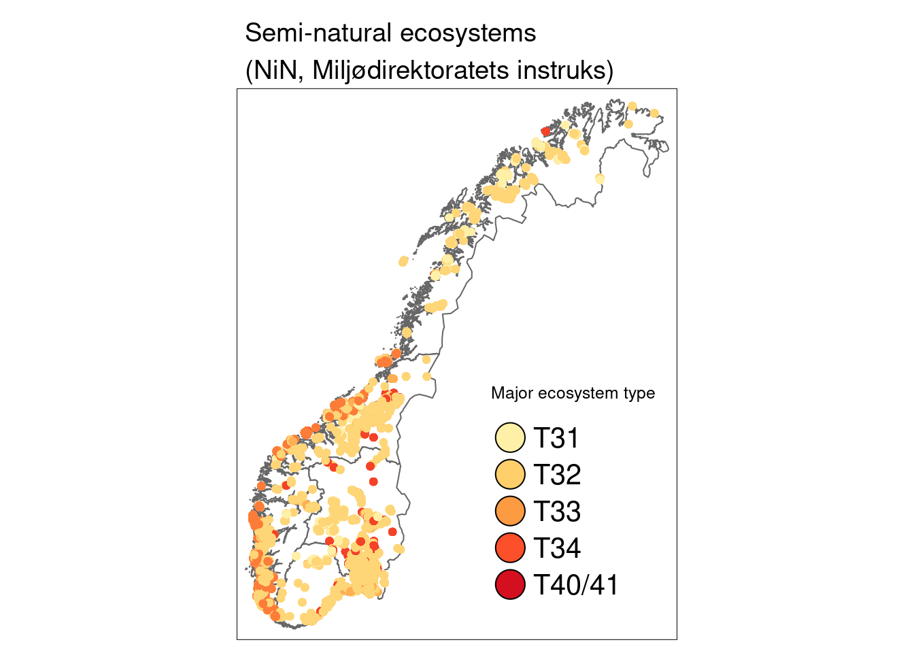
<p class="caption">(\#fig:where-are-seminat-sites)A map of Norway showing the location of the semi-natural ecosystem sites.</p>
</div>
T31...Boreal heath, T32...semi-natural grasslands, T33...semi-natural coastal grasslands, T34...Coastal heathlands, T40/T41...previously heavily managed grasslands (now similar to T32)

**How are polygon sizes distributed?**


```r
summary(SentinelNDVI.seminat$area_meters)
#>      Min.   1st Qu.    Median      Mean   3rd Qu.      Max. 
#>     111.6    1508.6    3714.9   15297.9   10059.0 2954478.0
hist(SentinelNDVI.seminat$area_meters, xlim = c(0, 20000), breaks = 50000,xlab="Area",main="")
abline(v = 100, lty = 2)
```

<div class="figure">
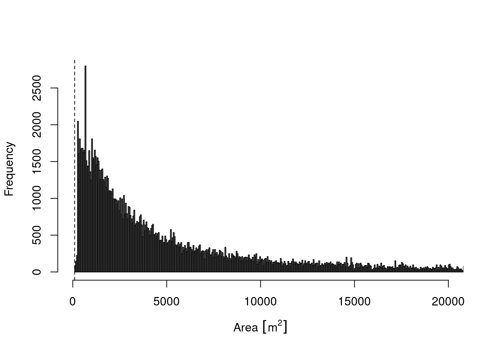
<p class="caption">(\#fig:hist-sentinel-ndvis)A histogram showing the distribution of polygon sizes.</p>
</div>

Semi-natural polygons stretch a large number of sizes from just above
100 sqm to almost 3 million sqm. 75% of all polygons are below 15297
sqm.
The dashed line indicates the minimum size of the Sentinel-2 pixels for NDVI, all NiN-polygons smaller than that have been removed form the data.

**How does NDVI vary over the years**


```r
SentinelNDVI.seminat %>%
  filter(tilstand!="") %>%
  ggplot(aes(x = year, y = mean)) +
  geom_point() +
  facet_grid(tilstand ~ hovedtype) +
  theme(axis.text.x = element_text(angle = -45, vjust = 0.5, hjust = 0.2, size = 12)) +
  ggtitle("NDVI across years for different ecosystem types in all condition classes") +
  labs(y = "NDVI values (Sentinel-2)", x = "Year")
```

<div class="figure">

<p class="caption">(\#fig:NDVI-values-over-time-ndvis)A figure showing NDVI values for semi-natural ecosystem over time for six different main nature types in varying degrees of condition.</p>
</div>

2022 stands out with the highest NDVI values missing. 
We omit 2022 for this analysis.


```r
SentinelNDVI.seminat <- SentinelNDVI.seminat %>% filter(year != "2022")
```

**How do NDVI values vary between major and basic ecosystem types for sites in good condition? (using only NDVI data matching NiN-mapping years)**


```r
SentinelNDVI.seminat %>%
  filter(tilstand == "God") %>%
  filter(year == kartleggingsaar) %>%
  ggplot(aes(x = hovedtype, y = mean)) +
  geom_violin() +
  geom_point(size = 0.7, shape = 16, color = "grey", position = position_jitter(.1) ) +
  ggtitle("NDVI for different ecosystem types in good condition") +
  labs(y = "NDVI values (Sentinel-2)", x = "Major ecosystem type")
```

<div class="figure">
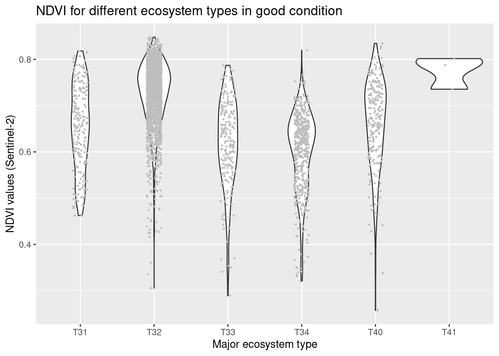
<p class="caption">(\#fig:NDVI-major-basic-ndvis-1)NDVI values in major and basic semi natural ecosystem types in good condition.</p>
</div>

```r

SentinelNDVI.seminat$subtype <- factor(SentinelNDVI.seminat$subtype, levels = c("C1", "C2", "C3", "C4", "C5", "C6", "C7", "C8", "C9", "C10", "C11", "C12", "C13", "C14", "C15", "C16", "C17", "C18", "C19", "C20", "C21", "E1", "E2", "E3", "E4", "E5", "E6", "E7"))
SentinelNDVI.seminat %>%
  filter(tilstand == "God") %>%
  filter(year == kartleggingsaar) %>%
  ggplot(aes(x = subtype, y = mean)) +
  geom_violin() +
  geom_point(size = 0.7, shape = 16, color = "grey" ) +
  facet_wrap(~hovedtype) +
  theme(axis.text.x = element_text(angle = -45, vjust = 0.5, hjust = 0.2, size = 7)) +
  ggtitle("NDVI for different ecosystem sub-types in good condition") +
  labs(y = "NDVI values (Sentinel-2)", x = "Ecosystem sub-type")
```

<div class="figure">
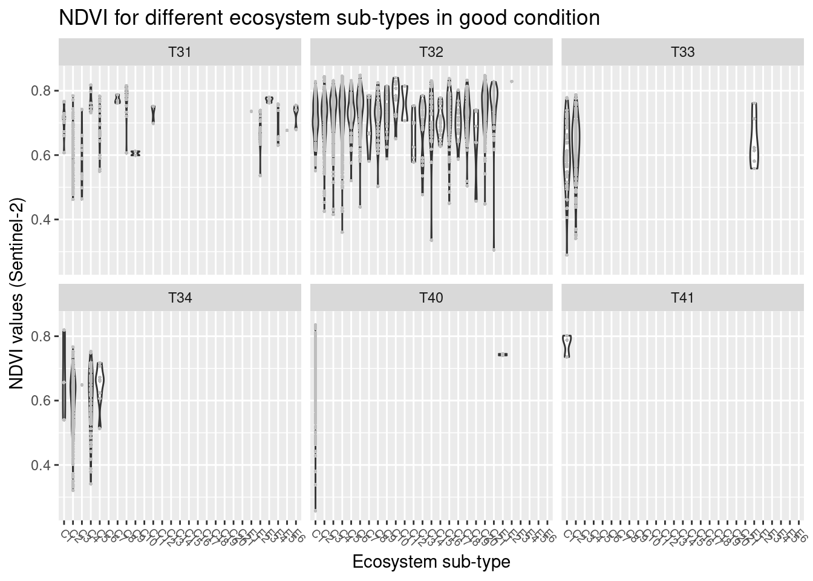
<p class="caption">(\#fig:NDVI-major-basic-ndvis-2)NDVI values in major and basic semi natural ecosystem types in good condition.</p>
</div>

NDVI varies between major ecosystem types with the highest values in
semi-natural grasslands (T32) and in previously intensively used and
altered grasslands that today resemble a semi-natural grassland (T40,
T41), lowest values in coastal heathlands (T34). Other ecosystem types:
Boreal heath (T31), semi-natural coastal grasslands (T33). The overlaps
between the ecosystem types are considerable. With respect to basic
ecosystem types within the major types, NDVI appears to cover very
similar ranges across the subtypes, and those with deviating violin
plots have a smaller sample size. There is no obvious trend related to
the structuring environmental gradients withing the major types, and
also here the overlap is large.

**How does NDVI vary across regions in semi-natural ecosystems (major types) in good condition? (using only NDVI data matching NiN-mapping years)**


```r
SentinelNDVI.seminat %>%
  filter(tilstand == "God") %>%
  filter(year == kartleggingsaar) %>%
  filter(!is.na(region)) %>%
  ggplot(aes(x = region, y = mean)) +
  geom_violin() +
  geom_point(size = 0.7, shape = 16, color = "grey", position = position_jitter(.1) ) +
  facet_wrap(~hovedtype) +
  theme(axis.text.x = element_text(angle = -45, vjust = 0.5, hjust = 0.2, size = 9)) +
  ggtitle("NDVI for different ecosystems in good condition across regions") +
  labs(y = "NDVI values (Sentinel-2)", x = "Region")
```

<div class="figure">
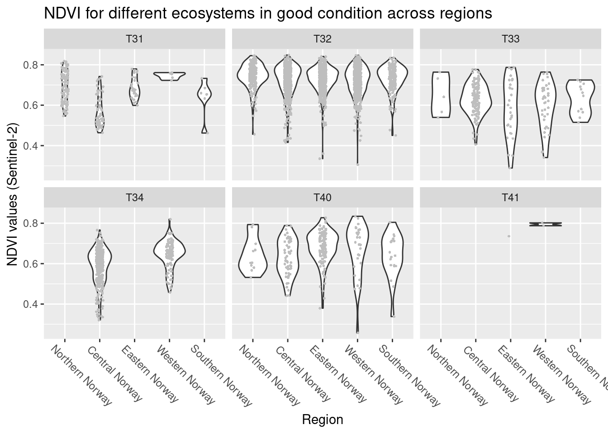
<p class="caption">(\#fig:ndvi-regions-ndvis)DVI variation across regions in semi-natural ecosystems (major types) in good condition</p>
</div>

For the meadow systems (T32, T33, T40, T41) there is no obvious trends
in geography. In the heath systems (T31, T34) the distribution of NDVI
values in Central Norway is somewhat lower than in the other regions.

**How does NDVI vary across condition classes (for major types and NDVI data matching NiN-mapping years)**


```r
SentinelNDVI.seminat %>%
  filter(year == kartleggingsaar) %>%
  ggplot(aes(x = tilstand, y = mean)) +
  geom_violin() +
  geom_point(size = 0.7, shape = 16, color = "grey", position = position_jitter(.1) ) +
  facet_wrap(~hovedtype) +
  theme(axis.text.x = element_text(angle = -45, vjust = 0.5, hjust = 0.2)) +
  ggtitle("NDVI for different ecosystems in different condition classes") +
  labs(y = "NDVI values (Sentinel-2)", x = "Condition")
```

<div class="figure">
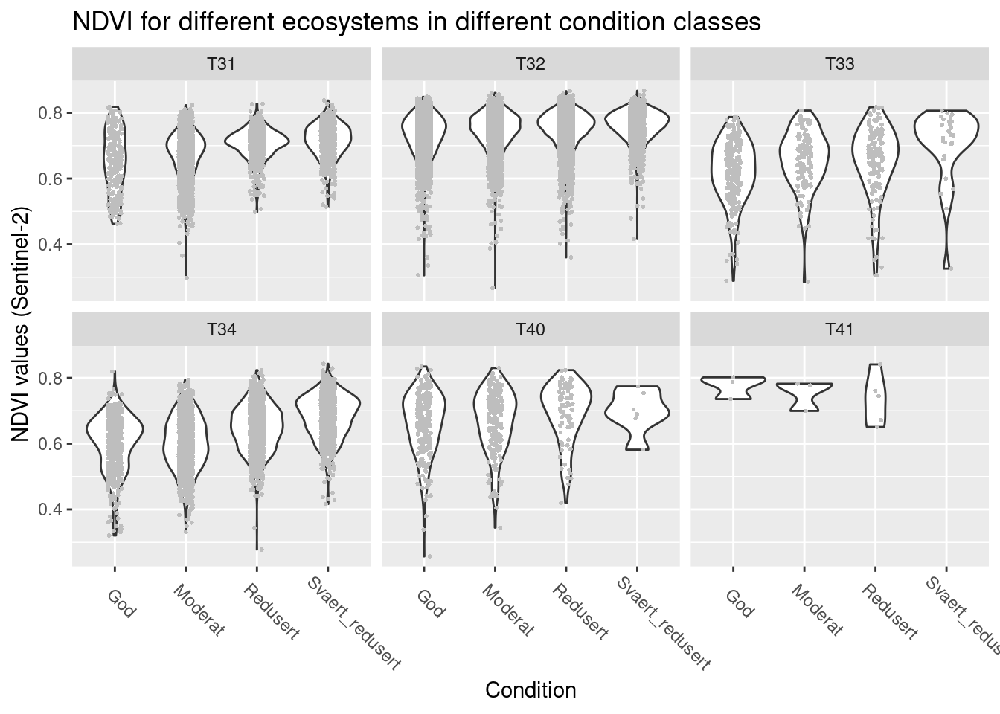
<p class="caption">(\#fig:ndvi-condition-ndvis)NDVI values across semi-natural ecosystem sites in different ecological condition.</p>
</div>

In the coastal types (T33, T34, coastal meadows and heathlands,
respectively) NDVI seems to increase as condition deteriorates, but in
the remaining types such a pattern is absent. Overlaps between condition
classes are generally very large.

**Which ecological relevant variable(s) is the condition measure in the NiN data related to?**


```r
nin.seminat2 %>%
  filter(hovedtype == "T31") %>%
  filter(NiN_variable_code %in% c("7JB-BT", "7RA-BA", "7FA", "7TK")) %>%
  mutate(NiN_variable_des = recode(NiN_variable_code,
    "7JB-BT" = "Grazing pressure",
    "7RA-BA" = "Succession",
    "7FA" = "Alien species",
    "7TK" = "Heavy vehicles"
  )) %>%
  ggplot(aes(x = NiN_variable_value, y = tilstand_num)) +
  geom_point(size = 2) +
  geom_jitter(width = 0.25, height = 0.25) +
  facet_wrap(~NiN_variable_des, nrow = 2, ncol = 3) +
  theme(legend.position = "none") +
  ggtitle("Condition variables in boreal heath (T31)") +
  labs(y = "Condition level (0-3='good' to 'very reduced')", x = "Condition variable score")
```

<div class="figure">
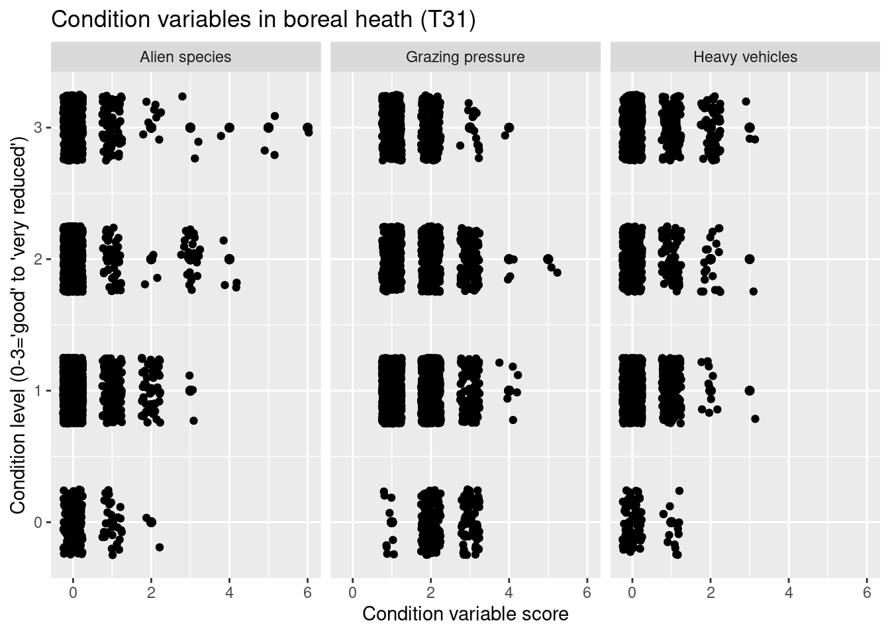
<p class="caption">(\#fig:important-variables-ndvis-1)Which ecological relevant variable(s) is the condition measure in the NiN data related to?</p>
</div>

```r


nin.seminat2 %>%
  filter(hovedtype == "T32") %>%
  filter(NiN_variable_code %in% c("7JB-BA", "7RA-SJ", "7FA", "7SE", "7JB-GJ")) %>%
  mutate(NiN_variable_des = recode(NiN_variable_code,
    "7JB-BA" = "Land-use intensity",
    "7RA-SJ" = "Succession",
    "7FA" = "Alien species",
    "7SE" = "Wear/tear",
    "7JB-GJ" = "Fertilization"
  )) %>%
  ggplot(aes(x = NiN_variable_value, y = tilstand_num)) +
  geom_point(size = 2) +
  geom_jitter(width = 0.25, height = 0.25) +
  facet_wrap(~NiN_variable_des, nrow = 2, ncol = 3) +
  theme(legend.position = "none") +
  ggtitle("Condition variables in semi-natural grasslands (T32)") +
  labs(y = "Condition level (0-3='good' to 'very reduced')", x = "Condition variable score")
```

<div class="figure">
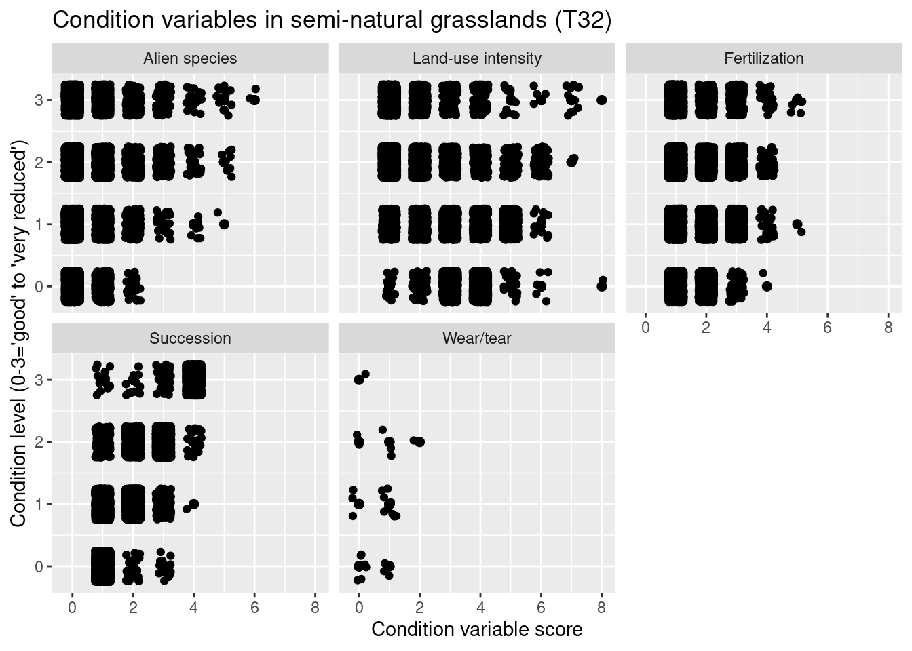
<p class="caption">(\#fig:important-variables-ndvis-2)Which ecological relevant variable(s) is the condition measure in the NiN data related to?</p>
</div>

```r

nin.seminat2 %>%
  filter(hovedtype == "T33") %>%
  filter(NiN_variable_code %in% c("7JB-BA", "7RA-SJ", "7FA", "7JB-GJ")) %>%
  mutate(NiN_variable_des = recode(NiN_variable_code,
    "7JB-BA" = "Land-use intensity",
    "7RA-SJ" = "Succession",
    "7FA" = "Alien species",
    "7JB-GJ" = "Fertilization"
  )) %>%
  ggplot(aes(x = NiN_variable_value, y = tilstand_num)) +
  geom_point(size = 2) +
  geom_jitter(width = 0.25, height = 0.25) +
  facet_wrap(~NiN_variable_des, nrow = 2, ncol = 3) +
  theme(legend.position = "none") +
  ggtitle("Condition variables in semi-natural coastal grasslands (T33)") +
  labs(y = "Condition level (0-3='good' to 'very reduced')", x = "Condition variable score")
```

<div class="figure">
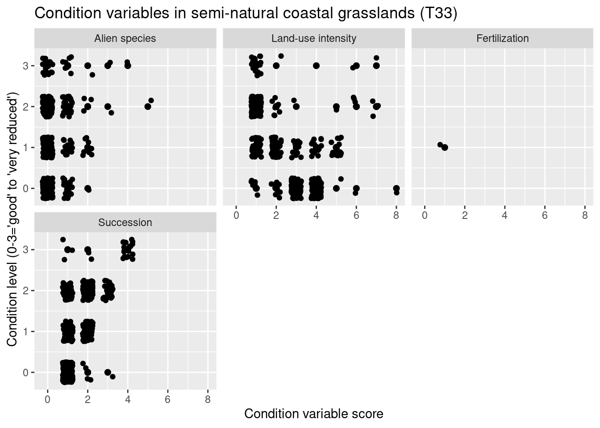
<p class="caption">(\#fig:important-variables-ndvis-3)Which ecological relevant variable(s) is the condition measure in the NiN data related to?</p>
</div>

```r

nin.seminat2 %>%
  filter(hovedtype == "T34") %>%
  filter(NiN_variable_code %in% c("7JB-BT", "7RA-SJ", "7FA", "7TK")) %>%
  mutate(NiN_variable_des = recode(NiN_variable_code,
    "7JB-BT" = "Grazing pressure",
    "7RA-SJ" = "Succession",
    "7FA" = "Alien species",
    "7TK" = "Heavy vehicles"
  )) %>%
  ggplot(aes(x = NiN_variable_value, y = tilstand_num)) +
  geom_point(size = 2) +
  geom_jitter(width = 0.25, height = 0.25) +
  facet_wrap(~NiN_variable_des, nrow = 2, ncol = 3) +
  theme(legend.position = "none") +
  ggtitle("Condition variables in coastal heathlands (T34)") +
  labs(y = "Condition level (0-3='good' to 'very reduced')", x = "Condition variable score")
```

<div class="figure">
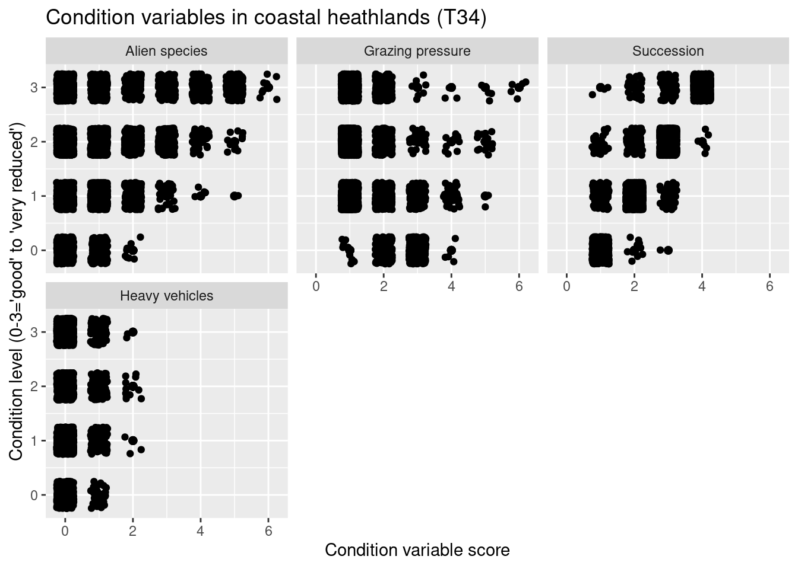
<p class="caption">(\#fig:important-variables-ndvis-4)Which ecological relevant variable(s) is the condition measure in the NiN data related to?</p>
</div>

```r

nin.seminat2 %>%
  filter(hovedtype %in% c("T40", "T41")) %>%
  filter(NiN_variable_code %in% c("7JB-BA", "7RA-SJ", "7FA", "7SE", "7JB-GJ")) %>%
  mutate(NiN_variable_des = recode(NiN_variable_code,
    "7JB-BA" = "Land-use intensity",
    "7RA-SJ" = "Succession",
    "7FA" = "Alien species",
    "7SE" = "Wear/tear",
    "7JB-GJ" = "Fertilization"
  )) %>%
  ggplot(aes(x = NiN_variable_value, y = tilstand_num)) +
  geom_point(size = 2) +
  geom_jitter(width = 0.25, height = 0.25) +
  facet_wrap(~NiN_variable_des, nrow = 2, ncol = 3) +
  theme(legend.position = "none") +
  ggtitle("Condition variables in previously heavily altered grasslands (T40/T41)") +
  labs(y = "Condition level (0-3='good' to 'very reduced')", x = "Condition variable score")
```

<div class="figure">
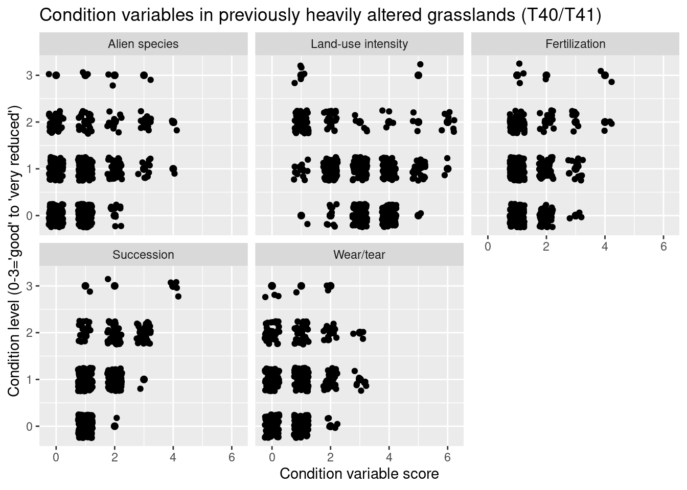
<p class="caption">(\#fig:important-variables-ndvis-5)Which ecological relevant variable(s) is the condition measure in the NiN data related to?</p>
</div>

In these plots, the panels for the different major ecosystem types
differ because Miljødirektoratets mapping manual (see reference list
above) uses different variables in these major ecosystem types to define
condition.

In the heath systems - T31 and T34 - reduced condition is mainly related
to low levels of grazing and ongoing succession (but also too intensive
grazing). In the meadow systems - T32, T33, T40, T41 - reduced condition
is related to low levels of land-use intensity and ongoing succession
(but also too intensive land use). In addition, reduced condition is
related to high abundance of alien species in all major semi-natural
ecosystem types.

### Regression analyses Sentinel-2, NDVI as a function of condition

We can investigate further how NDVI and condition are connected using
regression analyses.

First, we take a look at how balanced the data are across major
ecosystem types, regions and condition classes


```r
# NDVI across hovedtyper, regions and condition classes (only for NDVI years data matching NiN-mapping years)
SentinelNDVI.seminat %>%
  group_by(id, year) %>%
  filter(!is.na(region)) %>%
  filter(year == kartleggingsaar) %>%
  ggplot(aes(x = tilstand, y = mean)) +
  geom_violin() +
  geom_point(size = 0.7, shape = 16, color = "grey") +
  facet_grid(region ~ hovedtype) +
  theme(axis.text.x = element_text(angle = -45, vjust = 0.5, hjust = 0.2, size = 9)) +
  labs(y = "NDVI values (Sentinel-2)", x = "Condition")
```

<div class="figure">

<p class="caption">(\#fig:balanced-data-ndvis)NDVI values across a condition gradient, faceted by six semi natural ecosystem types in five regions in Norway. </p>
</div>

T41 is has only very few data and is present in 2 regions only, we omit
it. Northern Norway does not have any T34 occurrences and very few T33
and T40, we won't be able to model it together with the other regions,
and might need to model T31 and T32 there only.

NDVI data are bounded between -1 and 1, and thus require modelling with
an appropriate method that can handle bounded data. We can transform the
variable to be bounded between 0 and 1 and use beta-regression models:


```r
SentinelNDVI.seminat$mean_beta <- (SentinelNDVI.seminat$mean + 1) / 2
# NDVI data from the year of NiN-mapping (and thus with condition assessment) to train the condition models
# we drop T41 for the analysis as it lacks data for most combinations of condition and region, and thus would cause convergence issues
SentinelNDVI.seminat.train <- SentinelNDVI.seminat %>%
  filter(year == kartleggingsaar) %>%
  filter(hovedtype != "T41")

# check if there's any 0s or 1s (which beta cannot handle)
summary(SentinelNDVI.seminat.train$mean_beta) # ok
#>    Min. 1st Qu.  Median    Mean 3rd Qu.    Max. 
#>  0.6286  0.8323  0.8627  0.8541  0.8847  0.9333
LandsatNDVI.seminat$mean_beta <- (LandsatNDVI.seminat$mean + 1) / 2
# replace 1s in Landsat data with 0.9999
LandsatNDVI.seminat <- LandsatNDVI.seminat %>%
  mutate(mean_beta = replace(mean_beta, mean_beta == 1, 0.9999))
```


<!-- RUNTIME approx. 2 min -->

```r
# We run a stepwise-function on the full model including condition, ecosystem type, and region to find the most parsimonious model
model.seminat.cond.Sent <- betareg(mean_beta ~ tilstand_num * region * hovedtype, data = SentinelNDVI.seminat.train[SentinelNDVI.seminat.train$region != "Northern Norway", ])
model.seminat.cond.Sent <- StepBeta(model.seminat.cond.Sent)
summary(model.seminat.cond.Sent)

# Caching
saveRDS(model.seminat.cond.Sent, 
        "/data/P-Prosjekter2/41201785_okologisk_tilstand_2022_2023/data/cache/model.seminat.cond.Sent.rds")
```


NDVI values do vary between: - Regions - Ecosystem types - Condition
classes

It is evident that there are differences between regions. 
But since we are not interested in the statistics for region differences, 
we run **separate models for every region** for ease of interpretation.


<!-- RUNTIME 5 sec -->

```r
model.seminat.cond.Sent.N <- betareg(mean_beta ~ tilstand_num * hovedtype, data = SentinelNDVI.seminat.train[SentinelNDVI.seminat.train$region == "Northern Norway" & SentinelNDVI.seminat.train$hovedtype != "T34", ])
model.seminat.cond.Sent.C <- betareg(mean_beta ~ tilstand_num * hovedtype, data = SentinelNDVI.seminat.train[SentinelNDVI.seminat.train$region == "Central Norway", ])
model.seminat.cond.Sent.W <- betareg(mean_beta ~ tilstand_num * hovedtype, data = SentinelNDVI.seminat.train[SentinelNDVI.seminat.train$region == "Western Norway", ])
model.seminat.cond.Sent.E <- betareg(mean_beta ~ tilstand_num * hovedtype, data = SentinelNDVI.seminat.train[SentinelNDVI.seminat.train$region == "Eastern Norway", ])
model.seminat.cond.Sent.S <- betareg(mean_beta ~ tilstand_num * hovedtype, data = SentinelNDVI.seminat.train[SentinelNDVI.seminat.train$region == "Southern Norway", ])
```

**Northern Norway**


```r
SentinelNDVI.seminat.train %>%
  filter(region == "Northern Norway") %>%
  ggplot(aes(x = tilstand, y = mean)) +
  geom_violin() +
  geom_point(size = 0.7, shape = 16, color = "grey", position = position_jitter(.1) ) +
  theme(axis.text.x = element_text(angle = -45, vjust = 0.5, hjust = 0.2, size = 9)) +
  ggtitle("Northern Norway") +
  labs(y = "NDVI values (Sentinel-2)", x = "Condition") +
  facet_wrap(~hovedtype)
```

<div class="figure">
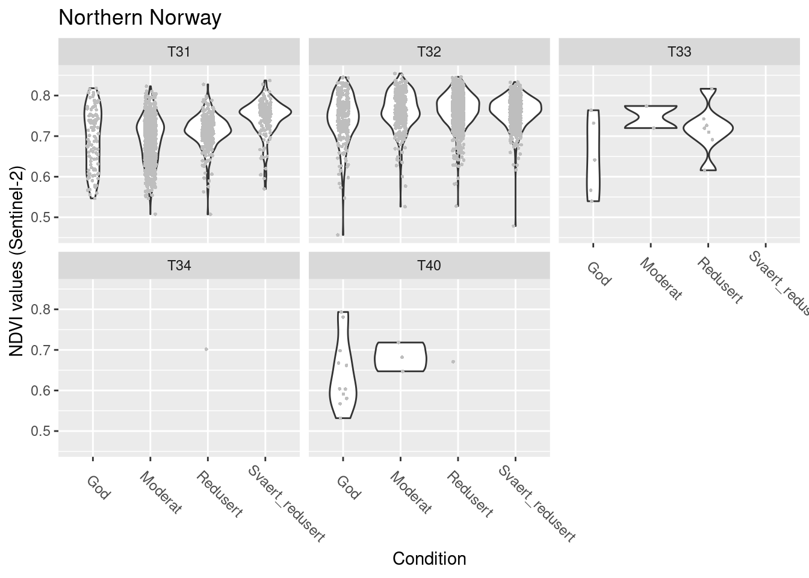
<p class="caption">(\#fig:north-nvdi-vs-tilstand-ndvis)NDVI agains ecosystm condition for five semi-natural ecosystems in Northern Norway.</p>
</div>


```r
summary(model.seminat.cond.Sent.N)$coefficients
#> $mean
#>                              Estimate  Std. Error
#> (Intercept)                1.64415534 0.010995779
#> tilstand_num               0.07658679 0.007020091
#> hovedtypeT32               0.32588773 0.015169077
#> hovedtypeT33              -0.04037829 0.079834264
#> hovedtypeT40              -0.09084877 0.054787510
#> tilstand_num:hovedtypeT32 -0.06323568 0.008606086
#> tilstand_num:hovedtypeT33  0.04215782 0.056292800
#> tilstand_num:hovedtypeT40 -0.01336016 0.080919730
#>                               z value      Pr(>|z|)
#> (Intercept)               149.5260480  0.000000e+00
#> tilstand_num               10.9096585  1.036450e-27
#> hovedtypeT32               21.4836879 2.212261e-102
#> hovedtypeT33               -0.5057765  6.130136e-01
#> hovedtypeT40               -1.6582023  9.727665e-02
#> tilstand_num:hovedtypeT32  -7.3477868  2.015156e-13
#> tilstand_num:hovedtypeT33   0.7489025  4.539160e-01
#> tilstand_num:hovedtypeT40  -0.1651039  8.688622e-01
#> 
#> $precision
#>       Estimate Std. Error  z value Pr(>|z|)
#> (phi) 208.7112   5.124613 40.72722        0
```

NDVI in good condition: T32 \> T31/T33 \> T40 (last not sig. but very
few data)

T31,T33,T40: NDVI increases as condition deteriorates T32: NDVI does not
change with condition

**Central Norway**


```r
SentinelNDVI.seminat.train %>%
  filter(region == "Central Norway") %>%
  ggplot(aes(x = tilstand, y = mean)) +
  geom_violin() +
  geom_point(size = 0.7, shape = 16, color = "grey", position = position_jitter(.1) ) +
  theme(axis.text.x = element_text(angle = -45, vjust = 0.5, hjust = 0.2, size = 9)) +
  ggtitle("Central Norway") +
  labs(y = "NDVI values (Sentinel-2)", x = "Condition") +
  facet_wrap(~hovedtype)
```

<div class="figure">
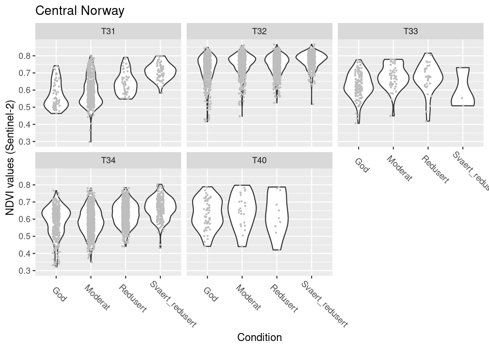
<p class="caption">(\#fig:central-nvdi-vs-tilstand-ndvis)NDVI against ecosystem condition for five semi-natural ecosystems in Central Norway.</p>
</div>


```r
summary(model.seminat.cond.Sent.C)$coefficients
#> $mean
#>                              Estimate Std. Error   z value
#> (Intercept)                1.22774728 0.01731295 70.914970
#> tilstand_num               0.15691924 0.01329505 11.802830
#> hovedtypeT32               0.62582634 0.01963605 31.871297
#> hovedtypeT33               0.27267266 0.02650528 10.287483
#> hovedtypeT34               0.07427412 0.01938164  3.832189
#> hovedtypeT40               0.26718403 0.03474356  7.690173
#> tilstand_num:hovedtypeT32 -0.09927187 0.01432066 -6.932074
#> tilstand_num:hovedtypeT33 -0.08603560 0.02475601 -3.475341
#> tilstand_num:hovedtypeT34 -0.07170670 0.01439664 -4.980793
#> tilstand_num:hovedtypeT40 -0.12411621 0.03869858 -3.207255
#>                                Pr(>|z|)
#> (Intercept)                0.000000e+00
#> tilstand_num               3.774033e-32
#> hovedtypeT32              6.673860e-223
#> hovedtypeT33               8.024663e-25
#> hovedtypeT34               1.270081e-04
#> hovedtypeT40               1.469358e-14
#> tilstand_num:hovedtypeT32  4.147161e-12
#> tilstand_num:hovedtypeT33  5.102038e-04
#> tilstand_num:hovedtypeT34  6.332410e-07
#> tilstand_num:hovedtypeT40  1.340081e-03
#> 
#> $precision
#>       Estimate Std. Error  z value Pr(>|z|)
#> (phi) 119.0685   2.215105 53.75297        0
```

NDVI in good condition: T32 \> T33/T34/T40 \> T31

T31: NDVI increases as condition deteriorates T32/T33/T34/T40: NDVI
increases sig. less than in T31 as condition deteriorates, but it still
increases

**Western Norway**


```r
SentinelNDVI.seminat.train %>%
  filter(region == "Western Norway") %>%
  ggplot(aes(x = tilstand, y = mean)) +
  geom_violin() +
  geom_point(size = 0.7, shape = 16, color = "grey", position = position_jitter(.1) ) +
  theme(axis.text.x = element_text(angle = -45, vjust = 0.5, hjust = 0.2, size = 9)) +
  ggtitle("Western Norway") +
  labs(y = "NDVI values (Sentinel-2)", x = "Condition") +
  facet_wrap(~hovedtype)
```

<div class="figure">

<p class="caption">(\#fig:west-nvdi-vs-tilstand-ndvis)NDVI agains ecosystm condition for five semi-natural ecosystems in W-Norway.</p>
</div>


```r
summary(model.seminat.cond.Sent.W)$coefficients
#> $mean
#>                               Estimate Std. Error
#> (Intercept)                1.735847267 0.05313826
#> tilstand_num               0.057295177 0.02511492
#> hovedtypeT32               0.083194970 0.05376401
#> hovedtypeT33              -0.334452794 0.06349165
#> hovedtypeT34              -0.260143425 0.05477030
#> hovedtypeT40              -0.085010435 0.06743251
#> tilstand_num:hovedtypeT32 -0.005239066 0.02561689
#> tilstand_num:hovedtypeT33 -0.018241211 0.03678248
#> tilstand_num:hovedtypeT34  0.003840380 0.02579273
#> tilstand_num:hovedtypeT40 -0.039969775 0.04700781
#>                              z value      Pr(>|z|)
#> (Intercept)               32.6666195 4.654419e-234
#> tilstand_num               2.2813203  2.252950e-02
#> hovedtypeT32               1.5474100  1.217644e-01
#> hovedtypeT33              -5.2676656  1.381695e-07
#> hovedtypeT34              -4.7497167  2.037018e-06
#> hovedtypeT40              -1.2606743  2.074262e-01
#> tilstand_num:hovedtypeT32 -0.2045161  8.379502e-01
#> tilstand_num:hovedtypeT33 -0.4959212  6.199500e-01
#> tilstand_num:hovedtypeT34  0.1488939  8.816373e-01
#> tilstand_num:hovedtypeT40 -0.8502795  3.951697e-01
#> 
#> $precision
#>       Estimate Std. Error  z value Pr(>|z|)
#> (phi) 128.1346    2.73882 46.78459        0
```

NDVI in good condition: T31/T32/T40 \> T33/T34

all types: NDVI increases slightly as condition deteriorates, but just
about sig.

**Eastern Norway**


```r
SentinelNDVI.seminat.train %>%
  filter(region == "Eastern Norway") %>%
  ggplot(aes(x = tilstand, y = mean)) +
  geom_violin() +
  geom_point(size = 0.7, shape = 16, color = "grey", position = position_jitter(.1) ) +
  theme(axis.text.x = element_text(angle = -45, vjust = 0.5, hjust = 0.2, size = 9)) +
  ggtitle("Eastern Norway") +
  labs(y = "NDVI values (Sentinel-2)", x = "Condition") +
  facet_wrap(~hovedtype)
```

<div class="figure">
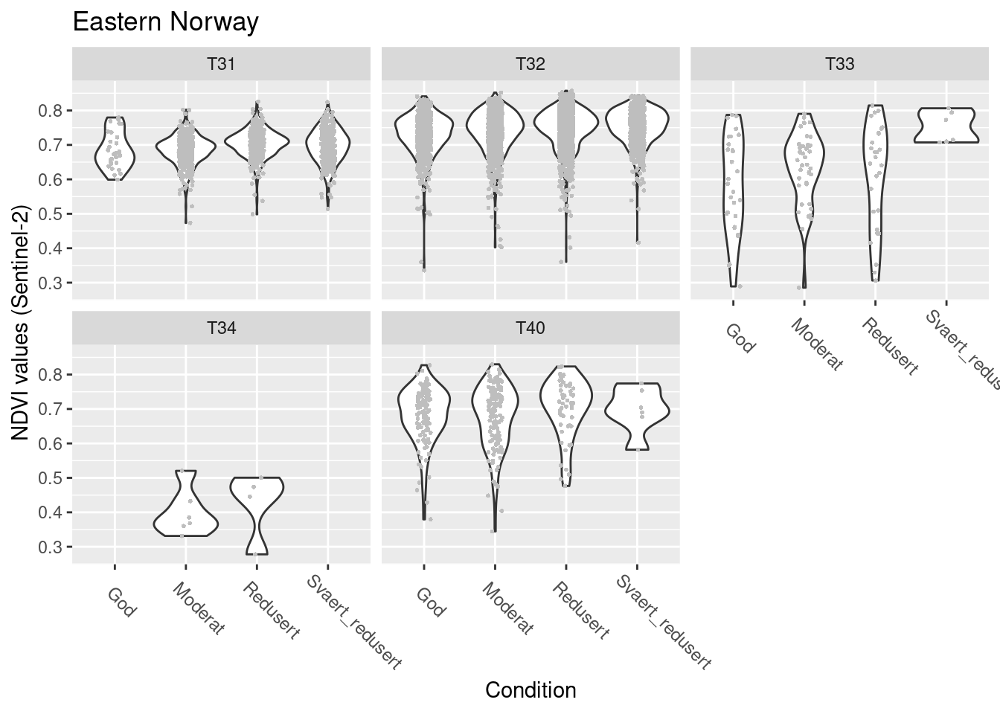
<p class="caption">(\#fig:east-nvdi-vs-tilstand-ndvis)NDVI against ecosystem condition for five semi-natural ecosystems in E-Norway.</p>
</div>


```r
summary(model.seminat.cond.Sent.E)$coefficients
#> $mean
#>                                Estimate  Std. Error
#> (Intercept)                1.6546047246 0.016449665
#> tilstand_num               0.0263501777 0.008052426
#> hovedtypeT32               0.2002941827 0.018021762
#> hovedtypeT33              -0.2773641962 0.036663349
#> hovedtypeT34              -0.8724991879 0.173082055
#> hovedtypeT40              -0.0002143578 0.025184855
#> tilstand_num:hovedtypeT32  0.0081680904 0.008958606
#> tilstand_num:hovedtypeT33  0.0737223863 0.025204980
#> tilstand_num:hovedtypeT34  0.0361838511 0.116924722
#> tilstand_num:hovedtypeT40  0.0067977292 0.018495037
#>                                 z value     Pr(>|z|)
#> (Intercept)               100.585920439 0.000000e+00
#> tilstand_num                3.272327931 1.066658e-03
#> hovedtypeT32               11.114017527 1.072244e-28
#> hovedtypeT33               -7.565162528 3.873799e-14
#> hovedtypeT34               -5.040956959 4.632096e-07
#> hovedtypeT40               -0.008511377 9.932090e-01
#> tilstand_num:hovedtypeT32   0.911759109 3.618955e-01
#> tilstand_num:hovedtypeT33   2.924913468 3.445520e-03
#> tilstand_num:hovedtypeT34   0.309462793 7.569695e-01
#> tilstand_num:hovedtypeT40   0.367543424 7.132137e-01
#> 
#> $precision
#>       Estimate Std. Error  z value Pr(>|z|)
#> (phi) 146.5212   2.806937 52.19967        0
```


NDVI in good condition: T32 \> T31/T40 \> T33 \> T34

T31/T32/T34/T40: NDVI increases slightly as condition deteriorates T33:
NDVI increases as condition deteriorates, more strongly than in the
other types

**Southern Norway**


```r
SentinelNDVI.seminat.train %>%
  filter(region == "Southern Norway") %>%
  ggplot(aes(x = tilstand, y = mean)) +
  geom_violin() +
  geom_point(size = 0.7, shape = 16, color = "grey", position = position_jitter(.1) ) +
  theme(axis.text.x = element_text(angle = -45, vjust = 0.5, hjust = 0.2, size = 9)) +
  ggtitle("Southern Norway") +
  labs(y = "NDVI values (Sentinel-2)", x = "Condition") +
  facet_wrap(~hovedtype)
```

<div class="figure">
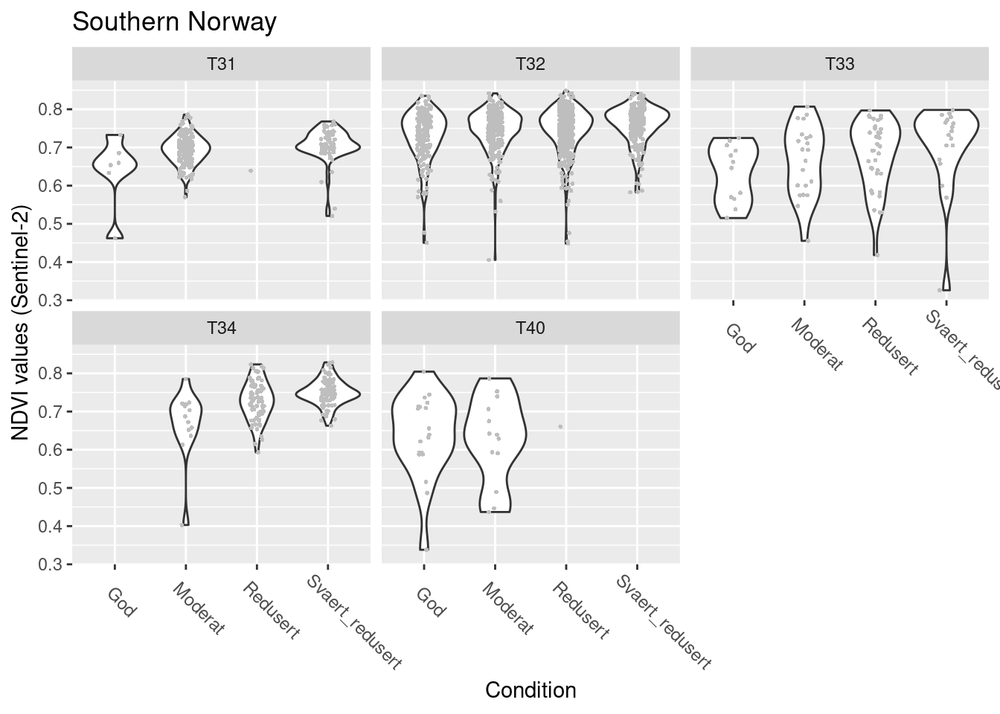
<p class="caption">(\#fig:south-nvdi-vs-tilstand-ndvis)NDVI against ecosystem condition for five semi-natural ecosystems in S-Norway.</p>
</div>


```r
summary(model.seminat.cond.Sent.S)$coefficients
#> $mean
#>                               Estimate Std. Error
#> (Intercept)                1.659442006 0.02805242
#> tilstand_num               0.031677650 0.01582980
#> hovedtypeT32               0.209644262 0.03143978
#> hovedtypeT33              -0.141424820 0.05424488
#> hovedtypeT34              -0.095889437 0.07510055
#> hovedtypeT40              -0.135125543 0.05475481
#> tilstand_num:hovedtypeT32  0.003853678 0.01755278
#> tilstand_num:hovedtypeT33  0.052543902 0.02912373
#> tilstand_num:hovedtypeT34  0.095449312 0.03230053
#> tilstand_num:hovedtypeT40 -0.049736550 0.06712609
#>                              z value     Pr(>|z|)
#> (Intercept)               59.1550299 0.000000e+00
#> tilstand_num               2.0011409 4.537721e-02
#> hovedtypeT32               6.6681208 2.590995e-11
#> hovedtypeT33              -2.6071554 9.129791e-03
#> hovedtypeT34              -1.2768141 2.016679e-01
#> hovedtypeT40              -2.4678295 1.359350e-02
#> tilstand_num:hovedtypeT32  0.2195480 8.262232e-01
#> tilstand_num:hovedtypeT33  1.8041611 7.120606e-02
#> tilstand_num:hovedtypeT34  2.9550388 3.126297e-03
#> tilstand_num:hovedtypeT40 -0.7409422 4.587285e-01
#> 
#> $precision
#>       Estimate Std. Error  z value      Pr(>|z|)
#> (phi) 153.2421   5.511914 27.80198 4.105499e-170
```

NDVI in good condition: T32 \> T31/T40 \> T33/T34

T31/T32: borderline NDVI increases as condition deteriorates T33/T34:
NDVI increases as condition deteriorates T40: insufficient power

<br />
<br />
<hr />

> Overall take home messages:
>
> In semi-natural ecosystems NDVI increases as ecosystem condition deteriorates, but the effect sizes vary with major ecosystem types. Boreal heath shows the most consistent increases, and also coastal meadows and coastal heathlands show increases in parts of the country. Semi-natural and semi-natural-looking meadows show very tiny increases if any at all.

<hr />

### NDVI across time - Sentinel, MODIS & LandSat

As a last step, we can investigate how NDVI has changed over time. For
this we include data from both MODIS and Landsat in addition to
Sentinel-2.

First, there's again some data handling to do. We merge the Sentinel,
MODIS, and Landsat data to show the full picture across time. Then we
model the time series for each Satellite separately.


```r
## data handling for time series analysis
# Sentinel time series checked in exploratory analysis script

# checking time series for MODIS
   #ModisNDVI.seminat %>%
   #  group_by(id, year) %>%
   #  filter(mean == max(mean, na.rm = TRUE)) %>%
   #  ggplot(aes(x = year, y = mean)) +
   #  geom_point() +
   #  facet_wrap(~hovedtype)
# 2022 does not stand out as in the Sentinel data, so we keep it
ModisNDVI.seminat <- ModisNDVI.seminat %>%
  group_by(id, year) %>%
  filter(mean == max(mean, na.rm = TRUE))

# checking time series for Landsat
   #LandsatNDVI.seminat %>%
   #  group_by(id, year) %>%
   #  filter(mean == max(mean, na.rm = TRUE)) %>%
   #  ggplot(aes(x = year, y = mean)) +
   #  geom_point() +
   #  facet_wrap(~hovedtype)
# nothing worrying to see here either
LandsatNDVI.seminat <- LandsatNDVI.seminat %>%
  group_by(id, year) %>%
  filter(mean == max(mean, na.rm = TRUE))

# transformation of NDVI scale to beta scale
# SentinelNDVI.seminat$mean_beta <- (SentinelNDVI.seminat$mean + 1) / 2
ModisNDVI.seminat$mean_beta <- (ModisNDVI.seminat$mean + 1) / 2
LandsatNDVI.seminat$mean_beta <- (LandsatNDVI.seminat$mean + 1) / 2

# check if there's any 0s or 1s (which beta cannot handle)
summary(SentinelNDVI.seminat$mean_beta) # ok
summary(ModisNDVI.seminat$mean_beta) # ok
summary(LandsatNDVI.seminat$mean_beta) # has 1's
# replace 1s in Landsat data with 0.9999
LandsatNDVI.seminat <- LandsatNDVI.seminat %>%
  mutate(mean_beta = replace(mean_beta, mean_beta == 1, 0.9999))

# check if the three Satellite objects have the same structure (for concatenating them)
names(SentinelNDVI.seminat)
names(ModisNDVI.seminat)
names(LandsatNDVI.seminat)
# Sentinel and Landsat have each an extra column -> omit them when concatenating further below
# one column is named slightly differently in the Sentinel data -> rename it
SentinelNDVI.seminat <- SentinelNDVI.seminat %>%
  dplyr::rename("system.index" = "system:index")

# check if they have the same geometry
st_crs(SentinelNDVI.seminat)
st_crs(ModisNDVI.seminat)
st_crs(LandsatNDVI.seminat)
# all good

# add an increment to the year variable to avoid overlapping data being hidden in figures
SentinelNDVI.seminat$year_jit <- SentinelNDVI.seminat$year + 0.3
ModisNDVI.seminat$year_jit <- ModisNDVI.seminat$year - 0.3
LandsatNDVI.seminat$year_jit <- LandsatNDVI.seminat$year

# concatenate the three Satellite objects
allSatNDVI.seminat <- rbind(
  SentinelNDVI.seminat[, !names(SentinelNDVI.seminat) %in% "subtype"],
  ModisNDVI.seminat,
  LandsatNDVI.seminat[, !names(LandsatNDVI.seminat) %in% "column_label"]
)
# add variable for Satellite identity
allSatNDVI.seminat$Sat <- c(
  rep("Sentinel", nrow(SentinelNDVI.seminat)),
  rep("Modis", nrow(ModisNDVI.seminat)),
  rep("Landsat", nrow(LandsatNDVI.seminat))
)
allSatNDVI.seminat$Sat <- factor(allSatNDVI.seminat$Sat, levels = c("Sentinel", "Modis", "Landsat"))
levels(allSatNDVI.seminat$Sat)
```

Now we can plot the time series for each main ecosystem type, showing
each satellite time series separately:


```r
# plot
allSatNDVI.seminat %>%
  ggplot(aes(x = year_jit, y = mean, color = Sat)) +
  geom_point() +
  ggtitle("NDVI across time") +
  labs(y = "NDVI values", x = "Year") +
  facet_wrap(~hovedtype, ncol = 1)
```

<div class="figure">

<p class="caption">(\#fig:ndvi-time-series-comparison-ndvis)Comparing the NDVI time series in the three data sets.</p>
</div>

It is quite obvious that the NDVI values from the three satellites are
not quantitatively comparable. They vary both in their placement along
the y-axis and in their variance. Modis data are absent from the
T40/T41-ecosystem types because of a too large pixel size compared to
the NiN-polygon sizes. In the other types, Modis is poorly represented
for the same reason.

We can test if there are consistent temporal changes in NDVI by running
regressions including year as a covariate.

We first investigate a model testing NDVI as a function of year and main
ecosystem type for polygons in good condition, and we do so separately
for each satellite.


<!-- RUNTIME 10 min -->

```r
model.seminat.time.GodTilst.Sent <- glmmTMB(mean_beta ~ year * hovedtype + (1 | id), family = beta_family(), data = SentinelNDVI.seminat[SentinelNDVI.seminat$tilstand == "God", ])
model.seminat.time.GodTilst.Modi <- glmmTMB(mean_beta ~ year * hovedtype + (1 | id), family = beta_family(), data = ModisNDVI.seminat[ModisNDVI.seminat$tilstand == "God", ])
model.seminat.time.GodTilst.Land <- glmmTMB(mean_beta ~ year * hovedtype + (1 | id), family = beta_family(), data = LandsatNDVI.seminat[LandsatNDVI.seminat$tilstand == "God", ])
```


```r
summary(model.seminat.time.GodTilst.Sent)$coefficients$cond
#>                        Estimate   Std. Error     z value
#> (Intercept)       -45.780951305  3.081255872 -14.8578869
#> year                0.023458652  0.001526906  15.3635239
#> hovedtypeT32       26.244560360  3.242217032   8.0946340
#> hovedtypeT33       12.760090321  4.237644667   3.0111280
#> hovedtypeT34      -19.042562520  3.602208159  -5.2863582
#> hovedtypeT40       28.738193372  4.289513342   6.6996396
#> hovedtypeT41      -15.690936569 31.070809016  -0.5050057
#> year:hovedtypeT32  -0.012861099  0.001606667  -8.0048299
#> year:hovedtypeT33  -0.006381392  0.002099939  -3.0388456
#> year:hovedtypeT34   0.009328309  0.001785065   5.2257530
#> year:hovedtypeT40  -0.014212323  0.002125635  -6.6861550
#> year:hovedtypeT41   0.008020360  0.015397374   0.5208914
#>                       Pr(>|z|)
#> (Intercept)       6.184530e-50
#> year              2.875127e-53
#> hovedtypeT32      5.743676e-16
#> hovedtypeT33      2.602791e-03
#> hovedtypeT34      1.247755e-07
#> hovedtypeT40      2.089342e-11
#> hovedtypeT41      6.135548e-01
#> year:hovedtypeT32 1.196319e-15
#> year:hovedtypeT33 2.374866e-03
#> year:hovedtypeT34 1.734478e-07
#> year:hovedtypeT40 2.291104e-11
#> year:hovedtypeT41 6.024424e-01
```


```r
summary(model.seminat.time.GodTilst.Modi)$coefficients$cond
#>                        Estimate  Std. Error    z value
#> (Intercept)        0.9417938119 2.404923160  0.3916108
#> year               0.0005957467 0.001195488  0.4983291
#> hovedtypeT32      -0.7198852149 3.147259223 -0.2287340
#> hovedtypeT33      -9.0494604384 6.513110325 -1.3894223
#> hovedtypeT34      10.4299968766 2.611678729  3.9935987
#> year:hovedtypeT32  0.0004530230 0.001564548  0.2895551
#> year:hovedtypeT33  0.0044483793 0.003237828  1.3738775
#> year:hovedtypeT34 -0.0053189040 0.001298233 -4.0970321
#>                       Pr(>|z|)
#> (Intercept)       6.953458e-01
#> year              6.182521e-01
#> hovedtypeT32      8.190757e-01
#> hovedtypeT33      1.647044e-01
#> hovedtypeT34      6.507796e-05
#> year:hovedtypeT32 7.721566e-01
#> year:hovedtypeT33 1.694797e-01
#> year:hovedtypeT34 4.184809e-05
```


```r
summary(model.seminat.time.GodTilst.Land)$coefficients$cond
#>                        Estimate   Std. Error     z value
#> (Intercept)       -2.178073e+01 0.4411725413 -49.3701030
#> year               1.171816e-02 0.0002202274  53.2093510
#> hovedtypeT32       5.090566e+00 0.4696298758  10.8395273
#> hovedtypeT33       6.886573e+00 0.7448223401   9.2459269
#> hovedtypeT34       8.433829e+00 0.5162507377  16.3366909
#> hovedtypeT40      -3.864882e-01 0.8262214619  -0.4677779
#> year:hovedtypeT32 -2.395131e-03 0.0002344365 -10.2165460
#> year:hovedtypeT33 -3.499599e-03 0.0003717377  -9.4141633
#> year:hovedtypeT34 -4.304575e-03 0.0002576806 -16.7050824
#> year:hovedtypeT40  1.969451e-04 0.0004124556   0.4774941
#>                       Pr(>|z|)
#> (Intercept)       0.000000e+00
#> year              0.000000e+00
#> hovedtypeT32      2.236234e-27
#> hovedtypeT33      2.332105e-20
#> hovedtypeT34      5.411108e-60
#> hovedtypeT40      6.399434e-01
#> year:hovedtypeT32 1.671925e-24
#> year:hovedtypeT33 4.768650e-21
#> year:hovedtypeT34 1.203615e-62
#> year:hovedtypeT40 6.330103e-01
```

There's an increase in NDVI over time in mainly the Sentinel and Landsat
time series in boreal heath in good condition, but this pattern is
reduced or absent in the other semi-natural ecosystem types. MODIS does
not show any trends in time but also has way less statistical power
compared to Sentinel and Landsat.

Given the consistently higher NDVI-values with decreasing condition in
**boreal heath**, We may ask the question if the temporal NDVI increase
might be stronger under reduced condition?

<!-- RUNTIME 10 min -->

```r
model.seminat.time.tilst.T31.Sent <- glmmTMB(mean_beta ~ year * tilstand + (1 | id), family = beta_family(), data = SentinelNDVI.seminat[SentinelNDVI.seminat$hovedtype %in% c("T31"), ])
model.seminat.time.tilst.T31.Modi <- glmmTMB(mean_beta ~ year * tilstand + (1 | id), family = beta_family(), data = ModisNDVI.seminat[ModisNDVI.seminat$hovedtype %in% c("T31"), ])
model.seminat.time.tilst.T31.Land <- glmmTMB(mean_beta ~ year * tilstand + (1 | id), family = beta_family(), data = LandsatNDVI.seminat[LandsatNDVI.seminat$hovedtype %in% c("T31"), ])
```


```r
summary(model.seminat.time.tilst.T31.Sent)$coefficients$cond
#>                                   Estimate  Std. Error
#> (Intercept)                  -4.575579e+01 3.120798729
#> year                          2.344589e-02 0.001546508
#> tilstandModerat               6.019395e-02 3.297959059
#> tilstandRedusert              1.011284e+01 3.577419807
#> tilstandSvaert_redusert      -9.457218e-01 3.651673254
#> year:tilstandModerat         -2.646114e-05 0.001634299
#> year:tilstandRedusert        -4.942408e-03 0.001772783
#> year:tilstandSvaert_redusert  5.537298e-04 0.001809584
#>                                   z value     Pr(>|z|)
#> (Intercept)                  -14.66156419 1.136249e-48
#> year                          15.16054003 6.453651e-52
#> tilstandModerat                0.01825188 9.854379e-01
#> tilstandRedusert               2.82685399 4.700776e-03
#> tilstandSvaert_redusert       -0.25898313 7.956483e-01
#> year:tilstandModerat          -0.01619112 9.870819e-01
#> year:tilstandRedusert         -2.78793699 5.304486e-03
#> year:tilstandSvaert_redusert   0.30599834 7.596059e-01
```


```r
summary(model.seminat.time.tilst.T31.Modi)$coefficients$cond
#>                                   Estimate   Std. Error
#> (Intercept)                   0.9376760636 1.9284718315
#> year                          0.0005998599 0.0009586688
#> tilstandModerat               0.8882297240 2.0971098697
#> tilstandRedusert              4.3529934686 2.3864880714
#> tilstandSvaert_redusert       1.3122148220 2.3407551762
#> year:tilstandModerat         -0.0004437392 0.0010424992
#> year:tilstandRedusert        -0.0020959207 0.0011863530
#> year:tilstandSvaert_redusert -0.0006143634 0.0011636174
#>                                 z value   Pr(>|z|)
#> (Intercept)                   0.4862275 0.62680587
#> year                          0.6257218 0.53149746
#> tilstandModerat               0.4235494 0.67189443
#> tilstandRedusert              1.8240164 0.06814959
#> tilstandSvaert_redusert       0.5605946 0.57507390
#> year:tilstandModerat         -0.4256494 0.67036332
#> year:tilstandRedusert        -1.7666923 0.07727977
#> year:tilstandSvaert_redusert -0.5279772 0.59751516
```


```r
summary(model.seminat.time.tilst.T31.Land)$coefficients$cond
#>                                   Estimate   Std. Error
#> (Intercept)                  -2.179185e+01 0.4337005742
#> year                          1.172387e-02 0.0002165269
#> tilstandModerat               9.872640e-01 0.4581637325
#> tilstandRedusert              1.055443e+00 0.4974375073
#> tilstandSvaert_redusert       5.571359e+00 0.5074515791
#> year:tilstandModerat         -4.819522e-04 0.0002287408
#> year:tilstandRedusert        -4.465030e-04 0.0002483586
#> year:tilstandSvaert_redusert -2.684806e-03 0.0002533521
#>                                 z value     Pr(>|z|)
#> (Intercept)                  -50.246300 0.000000e+00
#> year                          54.145093 0.000000e+00
#> tilstandModerat                2.154828 3.117531e-02
#> tilstandRedusert               2.121760 3.385794e-02
#> tilstandSvaert_redusert       10.979095 4.817235e-28
#> year:tilstandModerat          -2.106980 3.511935e-02
#> year:tilstandRedusert         -1.797815 7.220627e-02
#> year:tilstandSvaert_redusert -10.597132 3.072578e-26
```

The temporal NDVI increase in boreal heath has NOT been stronger with
reduced ecological condition. So a temporal NDVI approach does not seem
like a promising way to go. 

We could check for the same pattern in T32 and
T34, just because they are the other semi-natural major ecosystem types
with a substantial number of occurrences in the the NiN data. Here's the code for that, stored for later.


```r
model.seminat.time.tilst.T32.Sent <- glmmTMB(mean_beta ~ year * tilstand + (1 | id), family = beta_family(), data = SentinelNDVI.seminat[SentinelNDVI.seminat$hovedtype %in% c("T32"), ])
model.seminat.time.tilst.T32.Modi <- glmmTMB(mean_beta ~ year * tilstand + (1 | id), family = beta_family(), data = ModisNDVI.seminat[ModisNDVI.seminat$hovedtype %in% c("T32"), ])
model.seminat.time.tilst.T32.Land <- glmmTMB(mean_beta ~ year * tilstand + (1 | id), family = beta_family(), data = LandsatNDVI.seminat[LandsatNDVI.seminat$hovedtype %in% c("T32"), ])
summary(model.seminat.time.tilst.T32.Sent)$coefficients$cond
summary(model.seminat.time.tilst.T32.Modi)$coefficients$cond
summary(model.seminat.time.tilst.T32.Land)$coefficients$cond

model.seminat.time.tilst.T34.Sent <- glmmTMB(mean_beta ~ year * tilstand + (1 | id), family = beta_family(), data = SentinelNDVI.seminat[SentinelNDVI.seminat$hovedtype %in% c("T34"), ])
model.seminat.time.tilst.T34.Modi <- glmmTMB(mean_beta ~ year * tilstand + (1 | id), family = beta_family(), data = ModisNDVI.seminat[ModisNDVI.seminat$hovedtype %in% c("T34"), ])
model.seminat.time.tilst.T34.Land <- glmmTMB(mean_beta ~ year * tilstand + (1 | id), family = beta_family(), data = LandsatNDVI.seminat[LandsatNDVI.seminat$hovedtype %in% c("T34"), ])
summary(model.seminat.time.tilst.T34.Sent)$coefficients$cond
summary(model.seminat.time.tilst.T34.Modi)$coefficients$cond
summary(model.seminat.time.tilst.T34.Land)$coefficients$cond
```

But again, patterns are only identifiable with Sentinel and Landsat data,
but not with Modis. Semi-natural grasslands (T32) do indeed show a
stronger increase in NDVI as condition deteriorates, so here a temporal
approach may be useful under a reduced
land-management/shrub-/tree-encroachment scenario. Coastal heathlands
(T34), on the other hand, do not show stronger temporal increases with
reduced condition. Coastal heathlands are subject to a management cycle,
which includes developmental and successional changes over a course of
15-25 years followed by prescribed burning which resets that process.
So, we have to expect increases in greenness in coastal heathlands over
time also in well-managed areas, and thus temporal changes in NDVI are
largely irrelevant for assessing ecological condition.

## Overall conclusion

NDVI in semi-natural ecosystem does vary with condition and also with
ecosystem type, but the variance and thus overlap between condition
classes and ecosystem types is large. Especially in boreal heath and
semi-natural grasslands greenness and its change over time appear to be
indicative of the ecological condition of local ecosystems, linking well
to the registered condition variables behind the lower condition scores
(shrub/tree encroachment, low land-use intensity, succession) and thus
reduced land-use as the main pressure identified for these systems.
However, the large variance and thus overlap between condition classes
and ecosystem types makes it generally difficult to define useful
scaling values for absolute NDVI values. Since ecological condition also
relates to the temporal development of NDVI values in semi-natural
grasslands, a potential way way to approach this can be to define
scaling values for time slopes as for instance has been done for the
NDVI indicator in the ecological condition assessment for Norwegian
mountains (Framstad et al. 2022 in references above, see coded example
at <https://ninanor.github.io/IBECA/ndvi-trend_fjell.html>).

Beyond these considerations, there are two general issues which limit a
more comprehensive and robust application of satellite based NDVI-data
in an ecological condition context:

1. We are lacking ecosystem maps for semi-natural ecosystems
The analysis at hand clearly shows that different semi-natural ecosystem
types display different greenness levels and thus need to be evaluated
separately. Thus, we need ecosystem maps, that allow us to treat NDVI
values, and temporal changes of these, for at least the different major
ecosystem types within semi-natural systems separately. 
2. We are lacking a good ecological understanding and ground-truthing for NDVI in
semi-natural ecosystems Unlike for ecosystems like forests, tundra,
savannah and similar, there is little empirical work and ground-truthing
data documented that link NDVI values to ecological phenomena in
semi-natural systems. Here, we need field studies investigating more
thoroughly how NDVI and ecological drivers, like for example shrub-/tree
encroachment, are connected. This includes a need for understanding
temporal increases in NDVI in ecosystems in good condition.

In addition, further investigations should test how NDVI-condition
pattern vary across biogeographic regions in addition to administrative
regions (which are ecologically irrelevant), in order to better
understand the results for the administrative regions.

### Eksport file (final product)

<!-- Export final file. Ideally a georeferenced shape or raster wit indicators values (raw and normalised), reference values and errors. -->
