# NDVI - wetland ecosystems  {#NDVI-indicator-wetland}

NDVI (greenness) indicator, wetland ecosystems

<br /> Norwegian name: **Primærproduksjon** <br />


_Author and date:_

Joachim Töpper, Tessa Bargmann

September 2023

<br />

<!-- Load all you dependencies here -->


```{=html}
<div class="tabwid"><style>.cl-b4094caa{table-layout:auto;}.cl-b4021296{font-family:'DejaVu Sans';font-size:11pt;font-weight:bold;font-style:normal;text-decoration:none;color:rgba(0, 0, 0, 1.00);background-color:transparent;}.cl-b40212aa{font-family:'DejaVu Sans';font-size:11pt;font-weight:normal;font-style:normal;text-decoration:none;color:rgba(0, 0, 0, 1.00);background-color:transparent;}.cl-b405a7e4{margin:0;text-align:left;border-bottom: 0 solid rgba(0, 0, 0, 1.00);border-top: 0 solid rgba(0, 0, 0, 1.00);border-left: 0 solid rgba(0, 0, 0, 1.00);border-right: 0 solid rgba(0, 0, 0, 1.00);padding-bottom:5pt;padding-top:5pt;padding-left:5pt;padding-right:5pt;line-height: 1;background-color:transparent;}.cl-b405c56c{background-color:rgba(173, 216, 230, 1.00);vertical-align: middle;border-bottom: 1.5pt solid rgba(102, 102, 102, 1.00);border-top: 1.5pt solid rgba(102, 102, 102, 1.00);border-left: 0 solid rgba(0, 0, 0, 1.00);border-right: 0 solid rgba(0, 0, 0, 1.00);margin-bottom:0;margin-top:0;margin-left:0;margin-right:0;}.cl-b405c576{background-color:transparent;vertical-align: middle;border-bottom: 1.5pt solid rgba(102, 102, 102, 1.00);border-top: 0 solid rgba(0, 0, 0, 1.00);border-left: 0 solid rgba(0, 0, 0, 1.00);border-right: 0 solid rgba(0, 0, 0, 1.00);margin-bottom:0;margin-top:0;margin-left:0;margin-right:0;}</style><table data-quarto-disable-processing='true' class='cl-b4094caa'><thead><tr style="overflow-wrap:break-word;"><th class="cl-b405c56c"><p class="cl-b405a7e4"><span class="cl-b4021296">Ecosystem</span></p></th><th class="cl-b405c56c"><p class="cl-b405a7e4"><span class="cl-b4021296">Økologisk egenskap</span></p></th><th class="cl-b405c56c"><p class="cl-b405a7e4"><span class="cl-b4021296">ECT class</span></p></th></tr></thead><tbody><tr style="overflow-wrap:break-word;"><td class="cl-b405c576"><p class="cl-b405a7e4"><span class="cl-b40212aa">Våtmark</span></p></td><td class="cl-b405c576"><p class="cl-b405a7e4"><span class="cl-b40212aa">Primærproduksjon</span></p></td><td class="cl-b405c576"><p class="cl-b405a7e4"><span class="cl-b40212aa">Structural state characteristics</span></p></td></tr></tbody></table></div>
```

<!-- Don't remove these three html lines -->
<br />
<br />
<hr />

## Introduction {#intro-ndviw}
The Normalized difference vegetation index (NDVI) can be used to describe the greenness of an area, 
and may thus represent a proxy for the amount of chlorophyll and plant productivity in the given area. 
Different ecosystem types naturally have greenness signals of different intensity but also with a certain variance. 
Deviations beyond the natural variation in either direction may indicate a reduction in ecological condition of a given ecosystem. 
E.g. lower than normal NDVI may indicate excessive disturbance, while higher than normal NDVI may indicate regrowth and transitions towards more densely vegetated systems. 
In recent assessments of ecological condition for forest and mountain ecosystems, two different NDVI-based indicators were developed and applied. 
For forests, NDVI-values across the country were compared to a spatial reference NDVI-signal from protected areas (Framstad et al. 2020). 
For mountains, the extent and consistence of the temporal change of NDVI-values over the last twenty years was assessed (Framstad et al 2021). 
In both cases, the NDVI-product from the MODIS satellite reflectance imagery was used based on available maps of spatial ecosystem extent in Norway (i.e. national maps for the forest and mountain ecosystems). 

Here, we explore the potential for developing an NDVI-indicator for ecological condition representing open wetland ecosystems (i.e. excluding forest swamps). 
For this task, three initial challenges can be identified early on:

1. We don't yet have a national wetland map, i.e. we don't know the exact locations of all wetlands in Norway, which is a prerequisite to extract satellite data for the right locations and ecosystems, and thus achieve a good and unbiased spatial representation for the assessment area.
2. The spatial extent of the single wetland ecosystem occurrences (hereafter 'polygons') includes many wetland areas which are way smaller than the pixel size in the MODIS imagery (250 x 250 m) which was used for forests and mountains and has a time series back to year 2000.
3. NDVI in wetland systems lacks the thorough ground-truthing known from globally large ecosystems as forests, tundra or Savannah. Normal variation, like stochastic rain events and moss moisture status may influence NDVI signals greatly (Valøen, 2019). Our current understanding of what NDVI and its changes in different wetland ecosystems mean is thus limited.

In this draft development for a wetland NDVI indicator for ecological condition we approach these challenges in the following ways:

1. We use ecosystem occurrence data from NiN-mapping to guide the extraction of satellite NDVI data for pixels representing the right ecosystem. However, the ecosystem occurrences in the NiN data are highly spatially biased and thus cannot provide a good and unbiased spatial representation for the assessment area. Our work therefore represents a concept and method development which may be applied in an assessment of ecological condition once spatially unbiased occurrence data or a national map of wetland ecosystems are available.
2. We include Sentinel-2 imagery for wetland ecosystems as the resolution for the bands underlying the NDVI product here is 10 x 10 m which is smaller than almost all wetland polygons in the NiN-data. However, since Sentinel-2 only goes back to 2015, we lose much of the time series aspect as compared to the MODIS data. In addition, we include Landsat imagery which goes back to 1984 and has a resolution of 30 x 30 m, but also has more variable data due to less frequent seasonal measurements. We also still explore NDVI data from MODIS (see more details below).


## About the underlying data {#underlying-data-ndviw}
In the NDVI project for wetlands, we use two kinds of data (coming as four datasets) for building indicators for ecological condition:

- NiN ecosystem data from 'Naturtypekartlegging etter Miljødirektoratets instruks' to guide extraction of NDVI data for the right locations and to provide information on the field-assessed ecological condition of mapped polygons
- remote sensed NDVI data
  - Sentinel-2 satellite NDVI data
  - MODIS satellite NDVI data
  - Landsat satellite NDVI data

1. NiN ecosystem data:
The NiN data in this study contain data about the ecosystem categories (cf. Halvorsen et al. 2020) present at mapped sites as wall as their spatial delimitation (in the form of polygons). Since we use NiN data that were collected following 'Miljødirektoratets instruks', these data also include information on the ecological condition and underlying condition variabels of the mapped sites (see the Miljødirektoratets mapping manual for details).
Polygon sizes in these NiN data may vary from <100 sqm to the dimension of sqkm's.

2. NDVI data:
The NDVI data used in the work at hand are pixel means for polygons in the NiN-data, i.e. each NiN polygon is represented by one NDVI value per measurement time (see below for more details on the temporal resolution of NDVI data). With respect to that, it does only make sense to use NDVI data for polygons that are at least of the same size as the resolution of the respective satellite, and thus we excluded any polygons smaller than each satellite's resolution.

(2a) Sentinel-2 satellite NDVI data:
The Sentinel data have a resolution of 10 x 10 m, and we thus excluded all NiN-polygons smaller than 100 sqm. Sentinel-2 has a revisit frequency of 10 days and should thus provide enough measurements during peak growing season to provide a robust measure of maximum greenness.

(2b) MODIS satellite NDVI data:
The MODIS data have a resolution of 250 x 250 m, and we thus excluded all NiN-polygons smaller than 62500 sqm. MODIS has a revisit frequency of 1-2 days and thus provides an extensive sample to provide a robust measure of maximum greenness.

(2c) Landsat satellite NDVI data:
The Landsat data have a resolution of 30 x 30 m, and we thus excluded all NiN-polygons smaller than 900 sqm. Landsat has a revisit frequency of 16 days and thus provides the poorest growing season sample among the available NDVI data for a robust measure of maximum greenness.


### Representativity in time and space {#representativity-ndviw}
For wetlands, the NiN data contain 6502 wetland polygons of known area size across mainland Norway. However, NiN-mapping is not planned and performed in a spatially representative way and thus both the ecosystem occurrences and their spatial extent have to be treated as spatially biased. The 6502 wetland polygons are distributed across regions and major ecosystem types in the following way:

| Region          | V1  | V3   | V4  | V6  | V9  | V10 |
|-----------------|-----|------|-----|-----|-----|-----|
| Northern Norway | 638 | 275  | 55  | 102 | 360 | 315 |
| Central Norway  | 702 | 1250 | 34  | 0   | 302 | 116 |
| Western Norway  | 296 | 111  | 30  | 0   | 460 | 158 |
| Eastern Norway  | 251 | 89   | 103 | 0   | 251 | 223 |
| Southern Norway | 58  | 44   | 5   | 0   | 155 | 102 |


In addition, there is 3 V3s, 1 V4, 4 V9s, and 9 V10s that are not assigned to any region. (These polygons likely lie in water and thus outside of the regional polygons due to imprecise coordinates from the mapping device).


The NDVI data from either satellite follow the spatial distribution and bias status of the NiN-data. 
Due to the larger number of excluded polygons in the NDVI data from MODIS (because of the large pixel size in MODIS, see above), 
the MODIS NDVI data for the wetland occurrences in the NiN data are likely even more spatially biased than it is the case for the NDVI data from Sentinel-2 and Landsat. 

### Temporal coverage {#temp-cov-ndvis
The currently available NiN data on wetland ecosystems span a time period from 2018-2021 and thus represent a contemporary sample of ecosystem occurrences. 
Note that none of the polygons in the NiN-data has been visited more than once during that period.

- Available Sentinel-2 satellite NDVI data span the years 2015-2022.
- Available MODIS satellite NDVI data span the years 2000-2022.
- Available Landsat satellite NDVI data span the years 1984-2021.


## Collinearities with other indicators {#coll-ndvis}
The NDVI signal may likely be co-linear with [the re-growth indicator](https://ninanor.github.io/ecosystemCondition/gjengroing.html) based on LiDAR derived canopy height in drained wetland areas under shrub and tree encroachment.

## Reference state and values {#ref-state-ndviw}

### Reference state and scaling values {#ref-state2-ndviw}
This indicator project is mainly exploratory, mapping the possibilities of and lacking prerequisites for satellite derived NDVI data to inform ecological condition assessments. 
Therefore, we lack a concise strategy for how to define the reference state, especially prior to having access to an ecosystem map for wetland ecosystems (cf. Jakobsson et al. 2020, Töpper & Jakobsson 2021). 
In this exploratory work, we will use the condition classification in the NiN-data to explore 

1. how NDVI connects to wetland ecology and condition and 
2. its applicability for defining a reference state. 

We will use statistical models to test whether or not NDVI varies systematically with condition and across time.

## Uncertainties {#uncertainties-ndviw}
Given a condition index can be achieved, we can calculate a mean indicator value (after scaling) for every region 
(or any other delimited area of interest) as well as its corresponding standard error and standard deviation as a 
measure of spatial uncertainty for a geographical area (see Töpper & Jakobsson 2021).


## References

Framstad, E., Kolstad, A. L., Nybø, S., Töpper, J. & Vandvik, V. 2022. The condition of forest and mountain ecosystems in Norway. Assessment by the IBECA method. NINA Report 2100. Norwegian Institute for Nature Research.

Halvorsen, R., Skarpaas, O., Bryn, A., Bratli, H., Erikstad, L., Simensen, T., & Lieungh, E. (2020). Towards a systematics of ecodiversity: The EcoSyst framework. Global Ecology and Biogeography, 29(11), 1887-1906. doi:10.1111/geb.13164

Jakobsson, S., Töpper, J.P., Evju, M., Framstad, E., Lyngstad, A., Pedersen, B., Sickel, H., Sverdrup-Thygeson, A., Vandvik. V., Velle, L.G., Aarrestad, P.A. & Nybø, S. 2020. Setting reference levels and limits for good ecological condition in terrestrial ecosystems. Insights from a case study based on the IBECA approach. Ecological Indicators 116: 106492.

Miljødiretoratets mapping manual: https://www.miljodirektoratet.no/publikasjoner/2022/januar/kartleggingsinstruks-kartlegging-av-terrestriske-naturtyper-etter-nin/

Töpper, J. & Jakobsson, S. 2021. The Index-Based Ecological Condition Assessment (IBECA) - Technical protocol, version 1.0. NINA Report 1967. Norwegian Institute for Nature Research.

Valøen, K. 2019. Stochastic rain events increase NDVI through moss water content: a High-Arctic field experiment. Master Thesis NTNU.


## Analyses {#analyses-ndviw}

### Data sets {#datasets-ndviw}
The analyses in this document make use of the following data sets:

- NiN data (Naturtyper etter Miljødirektoratets instruks) 
- Sentinel-2 NDVI data 
- MODIS NDVI data 
- Landsat NDVI data

#### NiN data and geometry for Norway and the five regions {#nindata-ndviw}


The NiN data can be directly downloaded from Miljødirektoratets kartkatalog (https://kartkatalog.miljodirektoratet.no/Dataset)


```r
url <- "https://nedlasting.miljodirektoratet.no/Miljodata//Naturtyper_nin/FILEGDB/4326/Naturtyper_nin_0000_norge_4326_FILEGDB.zip"
download(url, dest = "P:/41201785_okologisk_tilstand_2022_2023/data/Naturtyper_nin_0000_norge_4326_FILEGDB.zip", mode = "wb")
unzip("P:/41201785_okologisk_tilstand_2022_2023/data/Naturtyper_nin_0000_norge_4326_FILEGDB.zip",
  exdir = "P:/41201785_okologisk_tilstand_2022_2023/data/nin_data"
)
st_layers("P:/41201785_okologisk_tilstand_2022_2023/data/nin_data/Naturtyper_nin_0000_norge_4326_FILEGDB.gdb")
nin <- st_read("P:/41201785_okologisk_tilstand_2022_2023/data/nin_data/Naturtyper_nin_0000_norge_4326_FILEGDB.gdb",
  layer = "naturtyper_nin_omr"
)
```

And we upload maps for Norway and the five regions: Southern, Western, Eastern, Central, and Northern Norway


```r
# Import region- og Norgeskart, make sure they have the same geometry as the nin data
nor <- st_read("data/outlineOfNorway_EPSG25833.shp") %>%
  st_as_sf() %>%
  st_transform(crs = st_crs(nin))
#> Reading layer `outlineOfNorway_EPSG25833' from data source 
#>   `/data/Egenutvikling/41001581_egenutvikling_anders_kolstad/github/ecosystemCondition_v2/data/outlineOfNorway_EPSG25833.shp' 
#>   using driver `ESRI Shapefile'
#> Simple feature collection with 1 feature and 2 fields
#> Geometry type: MULTIPOLYGON
#> Dimension:     XY
#> Bounding box:  xmin: -113472.7 ymin: 6448359 xmax: 1114618 ymax: 7939917
#> Projected CRS: ETRS89 / UTM zone 33N

reg <- st_read("data/regions.shp") %>%
  st_as_sf() %>%
  st_transform(crs = st_crs(nin))
#> Reading layer `regions' from data source 
#>   `/data/Egenutvikling/41001581_egenutvikling_anders_kolstad/github/ecosystemCondition_v2/data/regions.shp' 
#>   using driver `ESRI Shapefile'
#> Simple feature collection with 5 features and 2 fields
#> Geometry type: POLYGON
#> Dimension:     XY
#> Bounding box:  xmin: -99551.21 ymin: 6426048 xmax: 1121941 ymax: 7962744
#> Projected CRS: ETRS89 / UTM zone 33N

# change region names to something R-friendly
#reg$region
reg$region <- c("Northern Norway", "Central Norway", "Eastern Norway", "Western Norway", "Southern Norway")

# combine the Norway and the region maps
regnor <- st_intersection(reg, nor)
#> Warning: attribute variables are assumed to be spatially
#> constant throughout all geometries
```


#### NDVI data {#ndvidata-ndviw}
All NDVI data are calculated mean NDVI values for each respective NiN polygon from each available Sentinel-2, MODIS, or Landsat image in Google Earth Engine (GEE). 


##### Sentinel-2 NDVI data {#sentinelldata-ndviw}
The GEE code can be seen here: https://code.earthengine.google.com/2ceb0c3e03adade9e6f6d0903184b8c4
The image collection contains Sentinel imagery from June, July and August 2015-2022
To not exceed GEE memory limits, the exported files had to be iterated over a grid which resulted in 42 separate csv files. 
This script merges them and then merges the dataframe to the NiN data.


```r
# Import Sentinel NDVI Data
df.s <- list.files("/data/P-Prosjekter2/41201785_okologisk_tilstand_2022_2023/data/NDVI_åpenlavland/NDVI_data_Sentinel/", pattern = "*.csv", full.names = TRUE) %>%
  map_df(~ fread(.))
```

##### MODIS NDVI data {#modisdata-ndviw}
The GEE code can be seen here: https://code.earthengine.google.com/efb84013701f1d5f6e1e81345f389b84
The image collection contains MODIS imagery from June, July and August 2000-2022


```r
# Import MODIS NDVI Data
# MODIS NDVI is scaled by 0.0001. Mean must be divided by 10000.
df.m <- read.csv("/data/P-Prosjekter2/41201785_okologisk_tilstand_2022_2023/data/NDVI_åpenlavland/NDVI_data_MODIS/modis_ndvi_ts_2000_2022.csv")
df.m$mean <- df.m$mean / 10000
```

##### Landsat NDVI data {#landsatdata-ndviw}
The GEE code can be seen here: https://code.earthengine.google.com/da8a9279238ef26d14be08a43788b6b7
The image collection contains Landsat imagery from June, July and August 1984-2022
To not exceed GEE memory limits, the exported files had to be iterated over a grid which resulted in 42 separate csv files. 
This script merges them and then merges the dataframe to the NiN data.


```r
# Import Landsat NDVI Data
# Set up conditional file paths
dir <- substr(getwd(), 1, 2)

path <- ifelse(dir == "C:",
  "R:/GeoSpatialData/Habitats_biotopes/Norway_Miljodirektoratet_Naturtyper_nin/Original/versjon20221231/Natur_Naturtyper_nin_norge_med_svalbard_25833/Natur_Naturtyper_NiN_norge_med_svalbard_25833.gdb",
  "/data/R/GeoSpatialData/Habitats_biotopes/Norway_Miljodirektoratet_Naturtyper_nin/Original/versjon20221231/Natur_Naturtyper_nin_norge_med_svalbard_25833/Natur_Naturtyper_NiN_norge_med_svalbard_25833.gdb"
)

pData <- ifelse(dir == "C:",
  "P:/41201785_okologisk_tilstand_2022_2023/data/NDVI_åpenlavland/NDVI_data_Landsat",
  "/data/P-Prosjekter2/41201785_okologisk_tilstand_2022_2023/data/NDVI_åpenlavland/NDVI_data_Landsat"
)


# Fread doesn't like the weird path to the server version of the P drive
# hence this horrendous work around
files <- list.files(pData, pattern = "*.csv", full.names = TRUE)

df_list <- list() # initialise a list of dataframes
# read in a dataframe in each slot of the df_list
for (i in files) {
  name <- gsub("-", ".", i)
  name <- gsub(".csv", "", name)
  i <- paste(i, sep = "")
  df_list[[i]] <- assign(name, read.csv(i, header = TRUE))
}

df.l <- bind_rows(df_list, .id = "column_label")
```

### Data handling {#data-handling-ndviw}
#### NiN data {#nin-data-handling-ndviw}

```r
# fixing variable- and ecosystem-names with special characters
colnames(nin)
colnames(nin)[c(3, 8, 17, 26, 31, 33, 34)] <- c(
  "hovedoekosystem", "kartleggingsaar", "noyaktighet",
  "omraadenavn", "uk_naertruet", "uk_sentraloekosystemfunksjon",
  "uk_spesieltdaarligkartlagt"
)
unique(nin$hovedoekosystem)

nin <- nin %>%
  mutate(hovedoekosystem = recode(hovedoekosystem,
    "Våtmark" = "Vaatmark",
    "Semi-naturlig mark" = "Semi_naturlig",
    "Naturlig åpne områder i lavlandet" = "Naturlig-aapent",
    "Naturlig åpne områder under skoggrensa" = "Naturlig_aapent"
  )) %>%
  mutate(validGeo = st_is_valid(SHAPE))

# checking how many polygons have multiple ecosystem types
unique(nin$ninkartleggingsenheter)

nrow(nin)
# 95469 polygons altogether
nrow(nin %>%
  filter(grepl(",", ninkartleggingsenheter)))
# 21094 polygons have more than 1 ecosystem type (they are separated by commas in the ninkartleggingsenheter-variable)

nrow(nin %>%
  filter(!grepl(",", ninkartleggingsenheter)))
# 74375 polygons should have only 1 ecosystem type

# there's no information on the proportion of ecosystem types in the polygons, so we got to omit all polygons with multiple ecosystem types :(
nin <- nin %>%
  filter(!grepl(",", ninkartleggingsenheter))

# fix the content in the ninkartleggingsenheter-variable
summary(as.factor(nin$ninkartleggingsenheter))
# get rid of the NA- in the beginning
nin <- nin %>% mutate(ninkartleggingsenheter = str_remove(ninkartleggingsenheter, "NA_"))
# making a main ecosystem type variable
nin <- nin %>% mutate(
  hovedtype = substr(ninkartleggingsenheter, 1, 3),
  hovedtype = str_remove(hovedtype, "-")
)
# checking mapping unit against main ecosystem type
nin[, c("hovedoekosystem", "hovedtype")]
summary(as.factor(nin$hovedtype[nin$hovedoekosystem == "Vaatmark"]))
summary(as.factor(nin$hovedtype[nin$hovedoekosystem == "Semi_naturlig"]))
summary(as.factor(nin$hovedtype[nin$hovedoekosystem == "Naturlig_aapne"]))
summary(as.factor(nin$hovedtype[nin$hovedoekosystem == "Skog"]))
summary(as.factor(nin$hovedtype[nin$hovedoekosystem == "Fjell"]))
# making a new variable for the overarching ecosystem types based on the main ecosystem types
nin$hovedoekosystem.orig <- nin$hovedoekosystem

nin <- nin %>%
  mutate(hovedoekosystem = case_when(
    hovedtype %in% paste("V", c(1, 3:7, 9:10), sep = "") ~ "Vaatmark",
    hovedtype %in% paste("V", 11:13, sep = "") ~ "Vaatmark_sterkt_endret",
    hovedtype %in% paste("T", c(31:34, 40:41), sep = "") ~ "Semi_naturlig",
    hovedtype %in% paste("T", c(2, 12, 18, 20:21), sep = "") ~ "Naturlig_aapent",
    hovedtype %in% c(paste("T", c(4, 30, 38), sep = ""), paste("V", c(2, 8), sep = "")) ~ "Skog",
    hovedtype %in% c(paste("T", c(3, 7, 9, 10, 14, 22, 26), sep = ""), paste("V", c(6, 7), sep = "")) ~ "Fjell",
    TRUE ~ "NA"
  ))


summary(as.factor(nin$tilstand))

nin <- nin %>% mutate(tilstand = recode(tilstand,
  "Dårlig" = "Redusert",
  "Svært redusert" = "Svaert_redusert"
))
nin <- nin %>% mutate(tilstand_num = recode(tilstand,
  "God" = 0, "Moderat" = 1,
  "Redusert" = 2, "Svaert_redusert" = 3
))

summary(as.factor(nin$tilstand))
summary(as.numeric(nin$tilstand_num))


## filter out only wetland data
nin.wetland <- nin %>%
  filter(hovedoekosystem %in% c("Vaatmark")) %>%
  mutate(id = identifikasjon_lokalid) %>%
  filter(validGeo) %>%
  drop_na(tilstand) %>%
  dplyr::select(id, hovedoekosystem, hovedtype, ninkartleggingsenheter, lokalitetskvalitet, tilstand, tilstand_num, ninbeskrivelsesvariabler, kartleggingsaar)


# merge NiN-data with region
nin.wetland <- st_join(nin.wetland, regnor, left = TRUE)
nin.wetland

colnames(nin.wetland)[c(1, 10)] <- c("id", "region_id")

# check that every nin-polygon still occurs only once
summary(as.factor(nin.wetland$id))
nin.wetland[nin.wetland$id == "NINFP2110008060", ]
# this one was assigned to both Western and Central Norway, we drop the latter
nin.wetland <- nin.wetland[!row.names(nin.wetland) %in% "1144.1", ]

nin.wetland <- nin.wetland %>%
  mutate(area_meters_nin = st_area(nin.wetland))
# check and edit the order of regions
levels(nin.wetland$region)
nin.wetland$region <- as.factor(nin.wetland$region)
levels(nin.wetland$region)
nin.wetland$region <- factor(nin.wetland$region, levels = c("Northern Norway", "Central Norway", "Eastern Norway", "Western Norway", "Southern Norway"))
levels(nin.wetland$region)

# splitting content in the ninbeskrivelsesvariabler-column into separate rows per variable and then separating that column into two for the variable name and value
nin.wetland2 <- nin.wetland %>%
  separate_rows(ninbeskrivelsesvariabler, sep = ",") %>%
  separate(
    col = ninbeskrivelsesvariabler,
    into = c("NiN_variable_code", "NiN_variable_value"),
    sep = "_",
    remove = F
  ) %>%
  mutate(NiN_variable_value = as.numeric(NiN_variable_value)) %>%
  mutate(NiN_variable_code = as.factor(NiN_variable_code)) %>%
  subset(select = -ninbeskrivelsesvariabler)
nin.wetland2 <- as.data.frame(nin.wetland2)
```


#### NDVI data {#ndvi-data-ndviw}

```r
## Sentinel-2
# join nin.wetland & Sentinel NDVI data
SentinelNDVI.wetland <- full_join(nin.wetland, df.s, by = "id")
#> Warning in sf_column %in% names(g): Each row in `x` is expected to match at most 1 row in `y`.
#> ℹ Row 1 of `x` matches multiple rows.
#> ℹ If multiple matches are expected, set `multiple = "all"`
#>   to silence this warning.
# summary(SentinelNDVI.wetland)
SentinelNDVI.wetland <- SentinelNDVI.wetland %>%
  mutate(
    hovedoekosystem = as.factor(hovedoekosystem),
    hovedtype = as.factor(hovedtype),
    ninkartleggingsenheter = as.factor(ninkartleggingsenheter),
    lokalitetskvalitet = as.factor(lokalitetskvalitet),
    tilstand = as.factor(tilstand),
    area_meters = st_area(SentinelNDVI.wetland)
  )
# summary(SentinelNDVI.wetland)
# get rid of NAs (i.e. NDVI cells that were not in wetland polygons)
SentinelNDVI.wetland <- SentinelNDVI.wetland %>% filter(!is.na(hovedtype))
SentinelNDVI.wetland <- SentinelNDVI.wetland %>% filter(!is.na(mean))
# summary(SentinelNDVI.wetland)
# get rid of any nin-polygons smaller than the Sentinel grid cell size (100 sqm)
  # dim(SentinelNDVI.wetland)
SentinelNDVI.wetland <- SentinelNDVI.wetland %>% filter(as.numeric(area_meters) >= 100)
  # dim(SentinelNDVI.wetland)
# split date into year, month & day
SentinelNDVI.wetland <- SentinelNDVI.wetland %>%
  dplyr::mutate(
    year = lubridate::year(date),
    month = lubridate::month(date),
    day = lubridate::day(date)
  )
# add column for sub-ecosystem types
SentinelNDVI.wetland <- SentinelNDVI.wetland %>% mutate(
  subtype = substring(ninkartleggingsenheter, 4),
  subtype = str_remove(subtype, "-"),
  subtype = str_remove(subtype, "-")
)
# we are using max NDVI per year in every NiN polygon
SentinelNDVI.wetland <- SentinelNDVI.wetland %>%
  group_by(id, year) %>%
  filter(mean == max(mean, na.rm = TRUE))

  # summary(SentinelNDVI.wetland)

## MODIS
# join nin.wetland and Modis NDVI data
ModisNDVI.wetland <- full_join(nin.wetland, df.m, by = "id")
#> Warning in sf_column %in% names(g): Each row in `x` is expected to match at most 1 row in `y`.
#> ℹ Row 1 of `x` matches multiple rows.
#> ℹ If multiple matches are expected, set `multiple = "all"`
#>   to silence this warning.

# summary(ModisNDVI.wetland)
ModisNDVI.wetland <- ModisNDVI.wetland %>%
  mutate(
    hovedoekosystem = as.factor(hovedoekosystem),
    hovedtype = as.factor(hovedtype),
    ninkartleggingsenheter = as.factor(ninkartleggingsenheter),
    lokalitetskvalitet = as.factor(lokalitetskvalitet),
    tilstand = as.factor(tilstand),
    area_meters = st_area(ModisNDVI.wetland)
  )
# summary(ModisNDVI.wetland)
# get rid of NAs (i.e. NDVI cells that were not in wetland polygons)
ModisNDVI.wetland <- ModisNDVI.wetland %>% filter(!is.na(hovedtype))
ModisNDVI.wetland <- ModisNDVI.wetland %>% filter(!is.na(mean))
# summary(ModisNDVI.wetland)
# get rid of any nin-polygons smaller than the Modis grid cell size (62500 sqm)
  # dim(ModisNDVI.wetland)
ModisNDVI.wetland <- ModisNDVI.wetland %>% filter(as.numeric(area_meters) >= 62500)
  # dim(ModisNDVI.wetland)
# split date into year, month & day
ModisNDVI.wetland <- ModisNDVI.wetland %>%
  dplyr::mutate(
    year = lubridate::year(date),
    month = lubridate::month(date),
    day = lubridate::day(date)
  )
# we are using max NDVI per year in every NiN polygon
ModisNDVI.wetland <- ModisNDVI.wetland %>%
  group_by(id, year) %>%
  filter(mean == max(mean, na.rm = TRUE))
# summary(ModisNDVI.wetland)

## Landsat
# join nin.wetland & Landsat NDVI data
LandsatNDVI.wetland <- full_join(nin.wetland, df.l, by = "id")
#> Warning in sf_column %in% names(g): Each row in `x` is expected to match at most 1 row in `y`.
#> ℹ Row 1 of `x` matches multiple rows.
#> ℹ If multiple matches are expected, set `multiple = "all"`
#>   to silence this warning.

# summary(LandsatNDVI.wetland)
LandsatNDVI.wetland <- LandsatNDVI.wetland %>%
  mutate(
    hovedoekosystem = as.factor(hovedoekosystem),
    hovedtype = as.factor(hovedtype),
    ninkartleggingsenheter = as.factor(ninkartleggingsenheter),
    lokalitetskvalitet = as.factor(lokalitetskvalitet),
    tilstand = as.factor(tilstand),
    area_meters = st_area(LandsatNDVI.wetland)
  )
# summary(LandsatNDVI.wetland)
# get rid of NAs (i.e. NDVI cells that were not in wetland polygons)
LandsatNDVI.wetland <- LandsatNDVI.wetland %>% filter(!is.na(hovedtype))
LandsatNDVI.wetland <- LandsatNDVI.wetland %>% filter(!is.na(mean))
# summary(LandsatNDVI.wetland)
# get rid of any nin-polygons smaller than the Landsat grid cell size (900 sqm)
  # dim(LandsatNDVI.wetland)
LandsatNDVI.wetland <- LandsatNDVI.wetland %>% filter(as.numeric(area_meters) >= 900)
  # dim(LandsatNDVI.wetland)
# split date into year, month & day
LandsatNDVI.wetland <- LandsatNDVI.wetland %>%
  dplyr::mutate(
    year = lubridate::year(date),
    month = lubridate::month(date),
    day = lubridate::day(date)
  )
# we are using max NDVI per year in every NiN polygon
LandsatNDVI.wetland <- LandsatNDVI.wetland %>%
  group_by(id, year) %>%
  filter(mean == max(mean, na.rm = TRUE))

# summary(LandsatNDVI.wetland)
```


### Exploratory analyses, Sentinel-2 {#exploratory-ndviw}

**Where are the wetland sites?**


```r
tm_shape(regnor) +
  tm_fill("GID_0", labels = "", title = "", legend.show = FALSE, alpha=0) +
  tm_borders() +
  tm_shape(SentinelNDVI.wetland) +
  tm_dots("hovedtype", midpoint = NA, palette = tmaptools::get_brewer_pal("YlOrRd", 6, plot = FALSE), scale = 2.5, legend.show = FALSE) +
  tm_add_legend(
    type = "symbol",
    col = tmaptools::get_brewer_pal("YlOrRd", 6, plot = FALSE),
    labels = c(
      "V1",
      "V3",
      "V4",
      "V6",
      "V9",
      "V10"
    ),
    title = "Major ecosystem type",
    size = 1.5
  ) +
  tm_layout(
    main.title = "Wetland ecosystems \n(NiN, Miljødirektoratets instruks)",
    main.title.size = 1.2, legend.position = c("right", "bottom"),
    legend.text.size = 1.3, legend.title.size = 1.4
  )
```

<div class="figure">
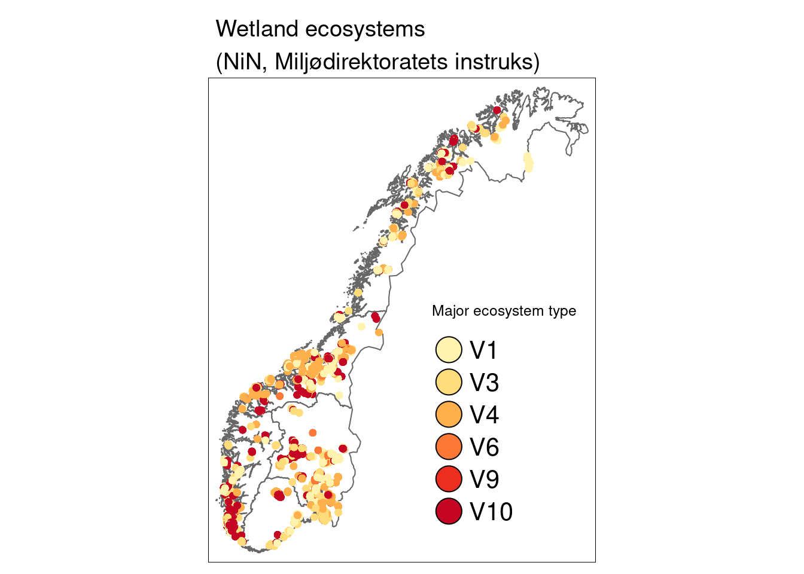
<p class="caption">(\#fig:where-are-wetland-sites)A map of Norway showing the location of the wetland ecosystem sites. V1 = minerotrophic mires, V3 = ombrotrophic bogs, V4 = cold springs, V6 = wet snowbeds, V9 = semi-natural mires, V10 = semi-natural wet meadows.</p>
</div>


**How are polygon sizes distributed?**

```r
summary(SentinelNDVI.wetland$area_meters)
#>    Min. 1st Qu.  Median    Mean 3rd Qu.    Max. 
#>     100    2103    5034   22302   14264 4462705
hist(SentinelNDVI.wetland$area_meters, xlim = c(0, 20000), breaks = 50000,xlab="Area",main="")
abline(v = 100, lty = 2)
```

<div class="figure">
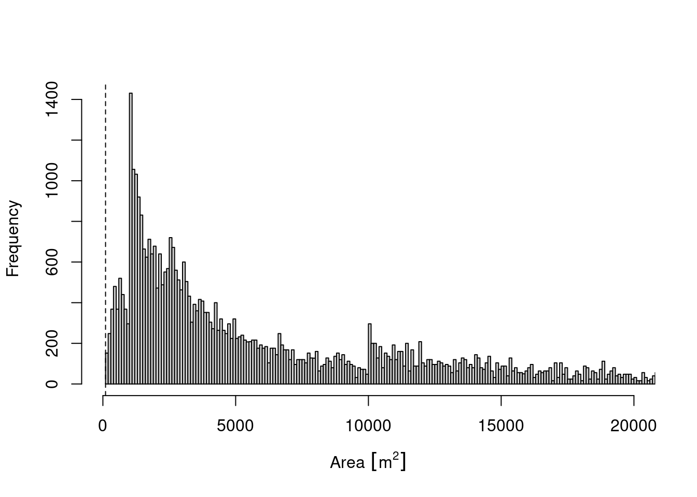
<p class="caption">(\#fig:histogram-sentinall-ndviw)Histogram of wetland ecosystem polygon sizes in Norway.</p>
</div>

Wetland polygons stretch a large number of sizes from just above 100 sqm to more than 4 million sqm. 75% of all polygons are below 14264 sqm.
The dashed line indicates the minimum size of the Sentinel-2 pixels for NDVI, all NiN-polygons smaller than that have been removed form the data.


**How does NDVI vary over the years?**

```r
SentinelNDVI.wetland %>%
  ggplot(aes(x = year, y = mean)) +
  geom_point() +
  facet_grid(tilstand ~ hovedtype) +
  theme(axis.text.x = element_text(angle = -45, vjust = 0.5, hjust = 0.2, size = 12)) +
  ggtitle("NDVI across years for different ecosystem types in all condition classes") +
  labs(y = "NDVI values (Sentinel-2)", x = "Year")
```

<div class="figure">

<p class="caption">(\#fig:NDVI-values-over-time-ndviw)A figure showing NDVI values for wetland ecosystem over time for six different main nature types in varying degrees of condition. V1 = minerotrophic mires, V3 = ombrotrophic bogs, V4 = cold springs, V9 = semi-natural mires, V10 = semi-natural wet meadows.</p>
</div>

2022 stands out with the highest NDVI values missing.
WE omit 2022 for this analysis

```r
SentinelNDVI.wetland <- SentinelNDVI.wetland %>% filter(year != "2022")
```

**How do NDVI values vary between major and basic ecosystem types for sites in good condition? (using only NDVI data matching NiN-mapping years)**

```r
SentinelNDVI.wetland %>%
  filter(tilstand == "God") %>%
  filter(year == kartleggingsaar) %>%
  ggplot(aes(x = hovedtype, y = mean)) +
  geom_violin() +
  geom_point(size = 0.7, shape = 16, color = "grey", position = position_jitter(.1) ) +
  ggtitle("NDVI for different ecosystem types in good condition") +
  labs(y = "NDVI values (Sentinel-2)", x = "Major ecosystem type")
```

<div class="figure">
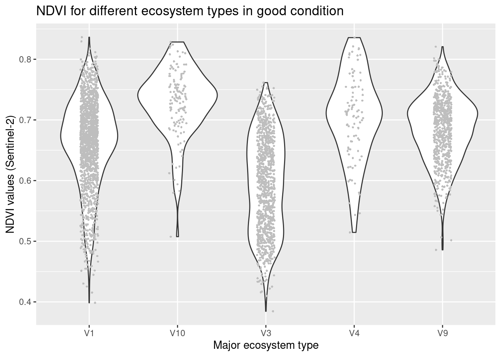
<p class="caption">(\#fig:NDVI-major-ndviw)NDVI values in major wetland ecosystem types in good condition. V1 = minerotrophic mires, V3 = ombrotrophic bogs, V4 = cold springs, V9 = semi-natural mires, V10 = semi-natural wet meadows</p>
</div>


```r
SentinelNDVI.wetland %>%
  filter(tilstand == "God") %>%
  filter(year == kartleggingsaar) %>%
  ggplot(aes(x = subtype, y = mean)) +
  geom_violin() +
  geom_point(size = 0.7, shape = 16, color = "grey") +
  facet_wrap(~hovedtype) +
  theme(axis.text.x = element_text(angle = -45, vjust = 0.5, hjust = 0.2, size = 9)) +
  ggtitle("NDVI for different ecosystem sub-types in good condition") +
  labs(y = "NDVI values (Sentinel-2)", x = "Ecosystem sub-type")
```

<div class="figure">
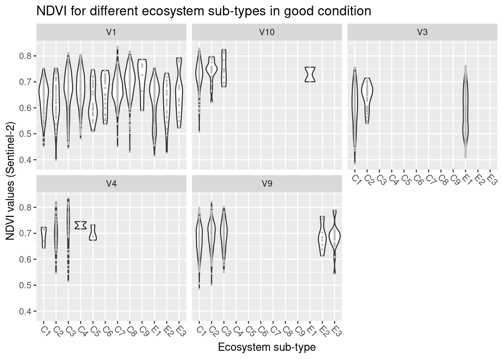
<p class="caption">(\#fig:NDVI-basic-ndviw)NDVI values in basic wetland ecosystem types in good condition. V1 = minerotrophic mires, V3 = ombrotrophic bogs, V4 = cold springs, V9 = semi-natural mires, V10 = semi-natural wet meadows.</p>
</div>

NDVI varies between major ecosystem types with the highest values in semi-natural wet-meadows (V10), and lowest values in ombrotrophic bogs (V3). The overlaps between the ecosystem types are considerable.
With respect to basic ecosystem types within the major types, NDVI appears to increase with increasing limestone level (C1-C4, C5-C8, and E1-E3 in V1, C1-C3 in the other major types), and also here the overlap is large. 

**How does NDVI vary across regions in wetlands (major types) in good condition? (using only NDVI data matching NiN-mapping years)**

```r
SentinelNDVI.wetland %>%
  filter(tilstand == "God") %>%
  filter(year == kartleggingsaar) %>%
  filter(!is.na(region)) %>%
  ggplot(aes(x = region, y = mean)) +
  geom_violin() +
  geom_point(size = 0.7, shape = 16, color = "grey", position = position_jitter(.1) ) +
  facet_wrap(~hovedtype) +
  theme(axis.text.x = element_text(angle = -45, vjust = 0.5, hjust = 0.2, size = 9)) +
  ggtitle("NDVI for different ecosystems in good condition across regions") +
  labs(y = "NDVI values (Sentinel-2)", x = "Region")
```

<div class="figure">

<p class="caption">(\#fig:ndvi-regions-ndviw)NDVI variation across regions in wetland ecosystems (major types) in good condition. V1 = minerotrophic mires, V3 = ombrotrophic bogs, V4 = cold springs, V9 = semi-natural mires, V10 = semi-natural wet meadows.</p>
</div>
There is no obvious trends in geography, with the exception of V3 which shows lower values in Central Norway.

**How does NDVI vary across condition classes (for major types and NDVI data matching NiN-mapping years)**

```r
SentinelNDVI.wetland %>%
  filter(year == kartleggingsaar) %>%
  ggplot(aes(x = tilstand, y = mean)) +
  geom_violin() +
  geom_point(size = 0.7, shape = 16, color = "grey", position = position_jitter(.1) ) +
  facet_wrap(~hovedtype) +
  theme(axis.text.x = element_text(angle = -45, vjust = 0.5, hjust = 0.2)) +
  ggtitle("NDVI for different ecosystems in different condition classes") +
  labs(y = "NDVI values (Sentinel-2)", x = "Condition")
```

<div class="figure">
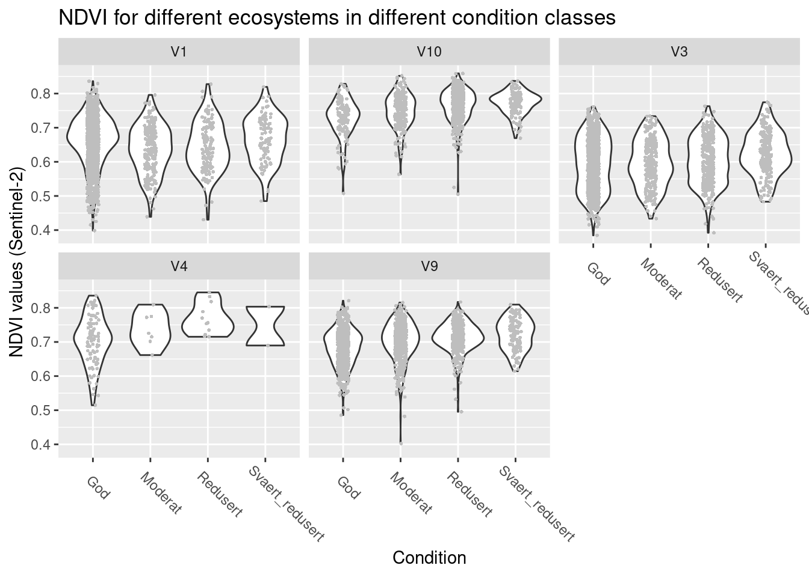
<p class="caption">(\#fig:ndvi-condition-ndviw)NDVI values across wetland sites in different ecological condition. V1 = minerotrophic mires, V3 = ombrotrophic bogs, V4 = cold springs, V9 = semi-natural mires, V10 = semi-natural wet meadows.</p>
</div>
In semi-natural types (V9,V10), kaldkilde (V4), and ombrotrophic bogs (V3) NDVI seems to increase as condition deteriorates, 
but in minertrophic fens (V1) there is not much of a pattern. 
Overlaps between condition classes are generally very large.

**Which ecological relevant variable(s) is the condition measure in the NiN data related to?**

```r
nin.wetland2 %>%
  filter(hovedtype == "V9") %>%
  filter(NiN_variable_code %in% c("1AG-B", "7GR-GI", "1AG-A-G", "1AR-C-L", "7TK", "PRSL")) %>%
  mutate(NiN_variable_des = recode(NiN_variable_code,
    "1AG-B" = "Shrub cover",
    "7GR-GI" = "Abundance of ditches",
    "1AG-A-G" = "Tree cover",
    "1AR-C-L" = "Woody plants in field layer",
    "7TK" = "Heavy vehicles",
    "PRSL" = "Wear/tear"
  )) %>%
  ggplot(aes(x = NiN_variable_value, y = tilstand_num)) +
  geom_point(size = 2) +
  geom_jitter(width = 0.25, height = 0.25) +
  facet_wrap(~NiN_variable_des, nrow = 2, ncol = 3) +
  theme(legend.position = "none") +
  ggtitle("Condition variables in semi-natural mires (V9)") +
  labs(y = "Condition level (0-3='good' to 'very reduced')", x = "Condition variable score")
```

<div class="figure">
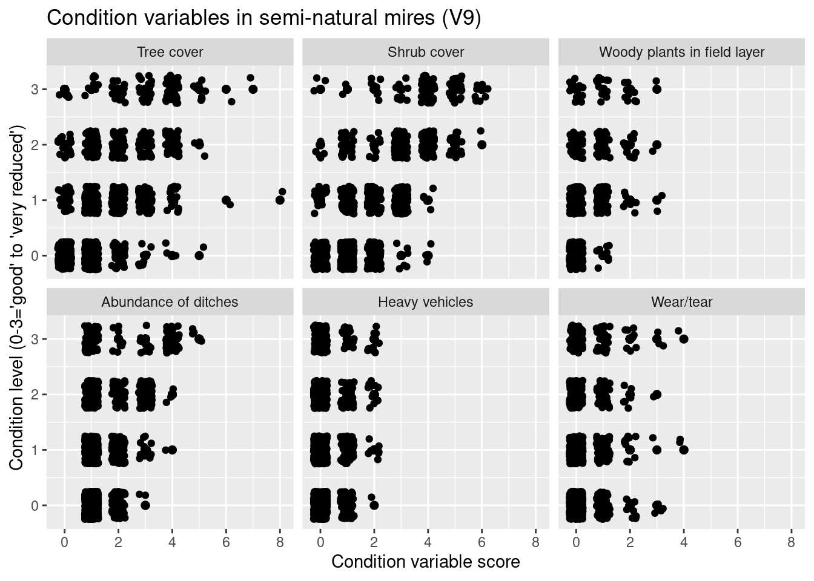
<p class="caption">(\#fig:important-variables-ndviwv9)Which ecological relevant variable(s) is the condition measure in the NiN data related to?</p>
</div>


```r
nin.wetland2 %>%
  filter(hovedtype == "V10") %>%
  filter(NiN_variable_code %in% c("7JB-BA", "7RA-SJ", "7FA", "7JB-GJ")) %>%
  mutate(NiN_variable_des = recode(NiN_variable_code,
    "7JB-BA" = "Land use intensity",
    "7RA-SJ" = "Succession",
    "7FA" = "Alien species",
    "7JB-GJ" = "Fertilization"
  )) %>%
  ggplot(aes(x = NiN_variable_value, y = tilstand_num)) +
  geom_point(size = 2) +
  geom_jitter(width = 0.25, height = 0.25) +
  facet_wrap(~NiN_variable_des, nrow = 2, ncol = 2) +
  theme(legend.position = "none") +
  ggtitle("Condition variables in semi-natural wet-meadows (V10)") +
  labs(y = "Condition level (0-3='good' to 'very reduced')", x = "Condition variable score")
```

<div class="figure">
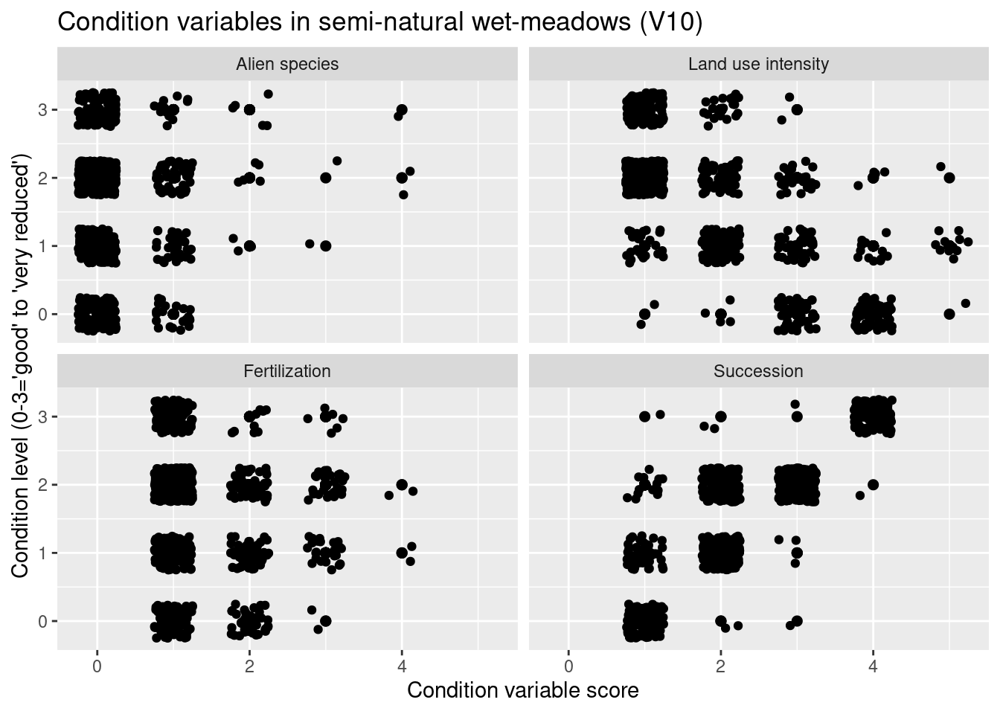
<p class="caption">(\#fig:important-variables-ndviwv10)Which ecological relevant variable(s) is the condition measure in the NiN data related to?</p>
</div>


```r
nin.wetland2 %>%
  filter(hovedtype == "V1") %>%
  filter(NiN_variable_code %in% c("7GR-GI", "PRTK", "7FA", "7TK", "7SE", "PRSL")) %>%
  mutate(NiN_variable_des = recode(NiN_variable_code,
    "7GR-GI" = "Abundance of ditches",
    "PRTK" = "Heavy vehicles",
    "7FA" = "Alien species",
    "7TK" = "Heavy vehicles2",
    "7SE" = "Wear/tear",
    "PRSL" = "Wear/tear2"
  )) %>%
  ggplot(aes(x = NiN_variable_value, y = tilstand_num)) +
  geom_point(size = 2) +
  geom_jitter(width = 0.25, height = 0.25) +
  facet_wrap(~NiN_variable_des, nrow = 2, ncol = 3) +
  theme(legend.position = "none") +
  ggtitle("Condition variables in minerotrophic fens (V1)") +
  labs(y = "Condition level (0-3='good' to 'very reduced')", x = "Condition variable score")
```

<div class="figure">

<p class="caption">(\#fig:important-variables-ndviwv1)Which ecological relevant variable(s) is the condition measure in the NiN data related to?</p>
</div>


In these plots, the panels for V1, V9 and V10 differ because Miljødirektoratets mapping manual (see reference list above) uses different variables in these major ecosystem types to define condition.

In V9, semi-natural mires, reduced condition is mainly related to increasing cover of shrubs and trees. 
In V10, semi-natural wet-meadows, reduced condition is related to insufficient land-use intensity and succession. 
In both cases, we'd expect an increase in the greenness signal. 
Thus, NDVI can, in principle, be indicative of ecological condition in semi-natural wetlands due to a direct connection to the main pressures on the ecosystems.
In V1 (minerotrophic fens), reduced condition is mainly related to the abundance of ditches, but also increased use of heavy vehicles and high alien species abundance are related to very reduce condition. 
Under these drivers, greenness would not directly be affected, although drainage due to ditches may lead to succession and woody plant encroachment, and thus greening, in the longer run. 
**Currently, NDVI seems poorly linked to ecological condition in, and the major pressures on, minerotrophic fens.**

### Regression analyses Sentinel-2, NDVI as a function of condition {#regression-ndviw}
We can investigate further how NDVI and condition are connected using regression analyses.

First, we take a look at how balanced the data are across major ecosystem types, regions and condition classes

```r
# NDVI across hovedtyper, regions and condition classes (only for NDVI years data matching NiN-mapping years)
SentinelNDVI.wetland %>%
  group_by(id, year) %>%
  filter(year == kartleggingsaar) %>%
  filter(!is.na(region)) %>%
  ggplot(aes(x = tilstand, y = mean)) +
  geom_violin() +
  geom_point(size = 0.7, shape = 16, color = "grey") +
  facet_grid(region ~ hovedtype) +
  theme(axis.text.x = element_text(angle = -45, vjust = 0.5, hjust = 0.2, size = 9)) +
  labs(y = "NDVI values (Sentinel-2)", x = "Condition")
```

<div class="figure">

<p class="caption">(\#fig:balanced-data-ndviw)NDVI values across a condition gradient, faceted by five wetland ecosystem types in five regions in Norway. </p>
</div>

V4 has sparse data and is lacking in some combinations of region and condition level, so we drop it.

NDVI data are bounded between -1 and 1, and thus require modelling with an appropriate method that can handle bounded data. We can transform the variable to be bounded between 0 and 1 and use beta-regression models:

```r
SentinelNDVI.wetland$mean_beta <- (SentinelNDVI.wetland$mean + 1) / 2
# NDVI data from the year of NiN-mapping (and thus with condition assessment) to train the condition models
# we drop V4 for the analysis as it lacks data for most combinations of condition and region, and thus would cause convergence issues
SentinelNDVI.wetland.train <- SentinelNDVI.wetland %>%
  filter(year == kartleggingsaar) %>%
  filter(hovedtype != "V4")

# We run a stepwise-function on the full model including condition, ecosystem type, and region to find the most parsimonious model
model.wetland.cond.Sent <- betareg(mean_beta ~ tilstand_num * region * hovedtype, data = SentinelNDVI.wetland.train)
model.wetland.cond.Sent <- StepBeta(model.wetland.cond.Sent)
#> [1] "100 % of the process"
summary(model.wetland.cond.Sent)
#> 
#> Call:
#> "betareg(formula =  mean_beta ~ hovedtype + region + tilstand_num + region:hovedtype + tilstand_num:hovedtype + tilstand_num:region:hovedtype data = SentinelNDVI.wetland.train )"
#> 
#> Standardized weighted residuals 2:
#>     Min      1Q  Median      3Q     Max 
#> -3.8916 -0.6702 -0.0255  0.6375  3.7930 
#> 
#> Coefficients (mean model with logit link):
#>                                                   Estimate
#> (Intercept)                                      1.6708640
#> hovedtypeV10                                     0.2108959
#> hovedtypeV3                                     -0.1524467
#> hovedtypeV9                                      0.0181524
#> regionCentral Norway                            -0.1779053
#> regionEastern Norway                             0.0303260
#> regionWestern Norway                            -0.1062018
#> regionSouthern Norway                           -0.0522541
#> tilstand_num                                    -0.0463176
#> hovedtypeV10:regionCentral Norway                0.1464568
#> hovedtypeV3:regionCentral Norway                -0.0787934
#> hovedtypeV9:regionCentral Norway                 0.1288021
#> hovedtypeV10:regionEastern Norway                0.0274397
#> hovedtypeV3:regionEastern Norway                 0.0636284
#> hovedtypeV9:regionEastern Norway                -0.0370905
#> hovedtypeV10:regionWestern Norway                0.0233371
#> hovedtypeV3:regionWestern Norway                 0.1823422
#> hovedtypeV9:regionWestern Norway                 0.0951785
#> hovedtypeV10:regionSouthern Norway               0.1587937
#> hovedtypeV3:regionSouthern Norway                0.1370854
#> hovedtypeV9:regionSouthern Norway                0.1292549
#> hovedtypeV10:tilstand_num                        0.0994613
#> hovedtypeV3:tilstand_num                         0.0362305
#> hovedtypeV9:tilstand_num                         0.1083055
#> hovedtypeV1:regionCentral Norway:tilstand_num    0.0163315
#> hovedtypeV10:regionCentral Norway:tilstand_num   0.0140504
#> hovedtypeV3:regionCentral Norway:tilstand_num    0.0681189
#> hovedtypeV9:regionCentral Norway:tilstand_num   -0.0124844
#> hovedtypeV1:regionEastern Norway:tilstand_num    0.0288659
#> hovedtypeV10:regionEastern Norway:tilstand_num  -0.0040408
#> hovedtypeV3:regionEastern Norway:tilstand_num   -0.0012722
#> hovedtypeV9:regionEastern Norway:tilstand_num   -0.0087535
#> hovedtypeV1:regionWestern Norway:tilstand_num    0.1099644
#> hovedtypeV10:regionWestern Norway:tilstand_num   0.0221430
#> hovedtypeV3:regionWestern Norway:tilstand_num   -0.0573753
#> hovedtypeV9:regionWestern Norway:tilstand_num   -0.0477682
#> hovedtypeV1:regionSouthern Norway:tilstand_num   0.1194407
#> hovedtypeV10:regionSouthern Norway:tilstand_num -0.0087023
#> hovedtypeV3:regionSouthern Norway:tilstand_num   0.0003832
#> hovedtypeV9:regionSouthern Norway:tilstand_num  -0.0190572
#>                                                 Std. Error
#> (Intercept)                                      0.0090128
#> hovedtypeV10                                     0.0343499
#> hovedtypeV3                                      0.0179386
#> hovedtypeV9                                      0.0192686
#> regionCentral Norway                             0.0124275
#> regionEastern Norway                             0.0187436
#> regionWestern Norway                             0.0159522
#> regionSouthern Norway                            0.0326521
#> tilstand_num                                     0.0140607
#> hovedtypeV10:regionCentral Norway                0.0529350
#> hovedtypeV3:regionCentral Norway                 0.0211338
#> hovedtypeV9:regionCentral Norway                 0.0274319
#> hovedtypeV10:regionEastern Norway                0.0524074
#> hovedtypeV3:regionEastern Norway                 0.0378203
#> hovedtypeV9:regionEastern Norway                 0.0327965
#> hovedtypeV10:regionWestern Norway                0.0496855
#> hovedtypeV3:regionWestern Norway                 0.0302974
#> hovedtypeV9:regionWestern Norway                 0.0266669
#> hovedtypeV10:regionSouthern Norway               0.0734277
#> hovedtypeV3:regionSouthern Norway                0.0492598
#> hovedtypeV9:regionSouthern Norway                0.0480220
#> hovedtypeV10:tilstand_num                        0.0215979
#> hovedtypeV3:tilstand_num                         0.0194711
#> hovedtypeV9:tilstand_num                         0.0185078
#> hovedtypeV1:regionCentral Norway:tilstand_num    0.0167452
#> hovedtypeV10:regionCentral Norway:tilstand_num   0.0293834
#> hovedtypeV3:regionCentral Norway:tilstand_num    0.0143445
#> hovedtypeV9:regionCentral Norway:tilstand_num    0.0188535
#> hovedtypeV1:regionEastern Norway:tilstand_num    0.0187904
#> hovedtypeV10:regionEastern Norway:tilstand_num   0.0250147
#> hovedtypeV3:regionEastern Norway:tilstand_num    0.0237466
#> hovedtypeV9:regionEastern Norway:tilstand_num    0.0184443
#> hovedtypeV1:regionWestern Norway:tilstand_num    0.0229877
#> hovedtypeV10:regionWestern Norway:tilstand_num   0.0290413
#> hovedtypeV3:regionWestern Norway:tilstand_num    0.0408132
#> hovedtypeV9:regionWestern Norway:tilstand_num    0.0163002
#> hovedtypeV1:regionSouthern Norway:tilstand_num   0.0351652
#> hovedtypeV10:regionSouthern Norway:tilstand_num  0.0375637
#> hovedtypeV3:regionSouthern Norway:tilstand_num   0.0542752
#> hovedtypeV9:regionSouthern Norway:tilstand_num   0.0224351
#>                                                 z value
#> (Intercept)                                     185.388
#> hovedtypeV10                                      6.140
#> hovedtypeV3                                      -8.498
#> hovedtypeV9                                       0.942
#> regionCentral Norway                            -14.315
#> regionEastern Norway                              1.618
#> regionWestern Norway                             -6.658
#> regionSouthern Norway                            -1.600
#> tilstand_num                                     -3.294
#> hovedtypeV10:regionCentral Norway                 2.767
#> hovedtypeV3:regionCentral Norway                 -3.728
#> hovedtypeV9:regionCentral Norway                  4.695
#> hovedtypeV10:regionEastern Norway                 0.524
#> hovedtypeV3:regionEastern Norway                  1.682
#> hovedtypeV9:regionEastern Norway                 -1.131
#> hovedtypeV10:regionWestern Norway                 0.470
#> hovedtypeV3:regionWestern Norway                  6.018
#> hovedtypeV9:regionWestern Norway                  3.569
#> hovedtypeV10:regionSouthern Norway                2.163
#> hovedtypeV3:regionSouthern Norway                 2.783
#> hovedtypeV9:regionSouthern Norway                 2.692
#> hovedtypeV10:tilstand_num                         4.605
#> hovedtypeV3:tilstand_num                          1.861
#> hovedtypeV9:tilstand_num                          5.852
#> hovedtypeV1:regionCentral Norway:tilstand_num     0.975
#> hovedtypeV10:regionCentral Norway:tilstand_num    0.478
#> hovedtypeV3:regionCentral Norway:tilstand_num     4.749
#> hovedtypeV9:regionCentral Norway:tilstand_num    -0.662
#> hovedtypeV1:regionEastern Norway:tilstand_num     1.536
#> hovedtypeV10:regionEastern Norway:tilstand_num   -0.162
#> hovedtypeV3:regionEastern Norway:tilstand_num    -0.054
#> hovedtypeV9:regionEastern Norway:tilstand_num    -0.475
#> hovedtypeV1:regionWestern Norway:tilstand_num     4.784
#> hovedtypeV10:regionWestern Norway:tilstand_num    0.762
#> hovedtypeV3:regionWestern Norway:tilstand_num    -1.406
#> hovedtypeV9:regionWestern Norway:tilstand_num    -2.931
#> hovedtypeV1:regionSouthern Norway:tilstand_num    3.397
#> hovedtypeV10:regionSouthern Norway:tilstand_num  -0.232
#> hovedtypeV3:regionSouthern Norway:tilstand_num    0.007
#> hovedtypeV9:regionSouthern Norway:tilstand_num   -0.849
#>                                                 Pr(>|z|)
#> (Intercept)                                      < 2e-16
#> hovedtypeV10                                    8.27e-10
#> hovedtypeV3                                      < 2e-16
#> hovedtypeV9                                     0.346154
#> regionCentral Norway                             < 2e-16
#> regionEastern Norway                            0.105676
#> regionWestern Norway                            2.78e-11
#> regionSouthern Norway                           0.109526
#> tilstand_num                                    0.000987
#> hovedtypeV10:regionCentral Norway               0.005662
#> hovedtypeV3:regionCentral Norway                0.000193
#> hovedtypeV9:regionCentral Norway                2.66e-06
#> hovedtypeV10:regionEastern Norway               0.600567
#> hovedtypeV3:regionEastern Norway                0.092494
#> hovedtypeV9:regionEastern Norway                0.258086
#> hovedtypeV10:regionWestern Norway               0.638572
#> hovedtypeV3:regionWestern Norway                1.76e-09
#> hovedtypeV9:regionWestern Norway                0.000358
#> hovedtypeV10:regionSouthern Norway              0.030573
#> hovedtypeV3:regionSouthern Norway               0.005387
#> hovedtypeV9:regionSouthern Norway               0.007111
#> hovedtypeV10:tilstand_num                       4.12e-06
#> hovedtypeV3:tilstand_num                        0.062781
#> hovedtypeV9:tilstand_num                        4.86e-09
#> hovedtypeV1:regionCentral Norway:tilstand_num   0.329415
#> hovedtypeV10:regionCentral Norway:tilstand_num  0.632527
#> hovedtypeV3:regionCentral Norway:tilstand_num   2.05e-06
#> hovedtypeV9:regionCentral Norway:tilstand_num   0.507858
#> hovedtypeV1:regionEastern Norway:tilstand_num   0.124489
#> hovedtypeV10:regionEastern Norway:tilstand_num  0.871671
#> hovedtypeV3:regionEastern Norway:tilstand_num   0.957275
#> hovedtypeV9:regionEastern Norway:tilstand_num   0.635079
#> hovedtypeV1:regionWestern Norway:tilstand_num   1.72e-06
#> hovedtypeV10:regionWestern Norway:tilstand_num  0.445783
#> hovedtypeV3:regionWestern Norway:tilstand_num   0.159782
#> hovedtypeV9:regionWestern Norway:tilstand_num   0.003384
#> hovedtypeV1:regionSouthern Norway:tilstand_num  0.000682
#> hovedtypeV10:regionSouthern Norway:tilstand_num 0.816795
#> hovedtypeV3:regionSouthern Norway:tilstand_num  0.994366
#> hovedtypeV9:regionSouthern Norway:tilstand_num  0.395639
#>                                                    
#> (Intercept)                                     ***
#> hovedtypeV10                                    ***
#> hovedtypeV3                                     ***
#> hovedtypeV9                                        
#> regionCentral Norway                            ***
#> regionEastern Norway                               
#> regionWestern Norway                            ***
#> regionSouthern Norway                              
#> tilstand_num                                    ***
#> hovedtypeV10:regionCentral Norway               ** 
#> hovedtypeV3:regionCentral Norway                ***
#> hovedtypeV9:regionCentral Norway                ***
#> hovedtypeV10:regionEastern Norway                  
#> hovedtypeV3:regionEastern Norway                .  
#> hovedtypeV9:regionEastern Norway                   
#> hovedtypeV10:regionWestern Norway                  
#> hovedtypeV3:regionWestern Norway                ***
#> hovedtypeV9:regionWestern Norway                ***
#> hovedtypeV10:regionSouthern Norway              *  
#> hovedtypeV3:regionSouthern Norway               ** 
#> hovedtypeV9:regionSouthern Norway               ** 
#> hovedtypeV10:tilstand_num                       ***
#> hovedtypeV3:tilstand_num                        .  
#> hovedtypeV9:tilstand_num                        ***
#> hovedtypeV1:regionCentral Norway:tilstand_num      
#> hovedtypeV10:regionCentral Norway:tilstand_num     
#> hovedtypeV3:regionCentral Norway:tilstand_num   ***
#> hovedtypeV9:regionCentral Norway:tilstand_num      
#> hovedtypeV1:regionEastern Norway:tilstand_num      
#> hovedtypeV10:regionEastern Norway:tilstand_num     
#> hovedtypeV3:regionEastern Norway:tilstand_num      
#> hovedtypeV9:regionEastern Norway:tilstand_num      
#> hovedtypeV1:regionWestern Norway:tilstand_num   ***
#> hovedtypeV10:regionWestern Norway:tilstand_num     
#> hovedtypeV3:regionWestern Norway:tilstand_num      
#> hovedtypeV9:regionWestern Norway:tilstand_num   ** 
#> hovedtypeV1:regionSouthern Norway:tilstand_num  ***
#> hovedtypeV10:regionSouthern Norway:tilstand_num    
#> hovedtypeV3:regionSouthern Norway:tilstand_num     
#> hovedtypeV9:regionSouthern Norway:tilstand_num     
#> 
#> Phi coefficients (precision model with identity link):
#>       Estimate Std. Error z value Pr(>|z|)    
#> (phi)  159.671      2.905   54.96   <2e-16 ***
#> ---
#> Signif. codes:  0 '***' 0.001 '**' 0.01 '*' 0.05 '.' 0.1 ' ' 1 
#> 
#> Type of estimator: ML (maximum likelihood)
#> Log-likelihood: 1.278e+04 on 41 Df
#> Pseudo R-squared: 0.5115
#> Number of iterations: 51 (BFGS) + 2 (Fisher scoring)
```

NDVI values do vary between:

- Regions
- Ecosystem types
- Condition classes

It is evident that there are differences between regions. But since we are not interested in the statistics for region differences, we run separate models for every region for ease of interpretation.


```r
model.wetland.cond.Sent.N <- betareg(mean_beta ~ tilstand_num * hovedtype, data = SentinelNDVI.wetland.train[SentinelNDVI.wetland.train$region == "Northern Norway", ])
model.wetland.cond.Sent.C <- betareg(mean_beta ~ tilstand_num * hovedtype, data = SentinelNDVI.wetland.train[SentinelNDVI.wetland.train$region == "Central Norway", ])
model.wetland.cond.Sent.W <- betareg(mean_beta ~ tilstand_num * hovedtype, data = SentinelNDVI.wetland.train[SentinelNDVI.wetland.train$region == "Western Norway", ])
model.wetland.cond.Sent.E <- betareg(mean_beta ~ tilstand_num * hovedtype, data = SentinelNDVI.wetland.train[SentinelNDVI.wetland.train$region == "Eastern Norway", ])
model.wetland.cond.Sent.S <- betareg(mean_beta ~ tilstand_num * hovedtype, data = SentinelNDVI.wetland.train[SentinelNDVI.wetland.train$region == "Southern Norway", ])
```

**Northern Norway**

```r
SentinelNDVI.wetland.train %>%
  filter(region == "Northern Norway") %>%
  ggplot(aes(x = tilstand, y = mean)) +
  geom_violin() +
  geom_point(size = 0.7, shape = 16, color = "grey", position = position_jitter(.1) ) +
  theme(axis.text.x = element_text(angle = -45, vjust = 0.5, hjust = 0.2, size = 9)) +
  ggtitle("Northern Norway") +
  labs(y = "NDVI values (Sentinel-2)", x = "Condition") +
  facet_wrap(~hovedtype)
```

<div class="figure">
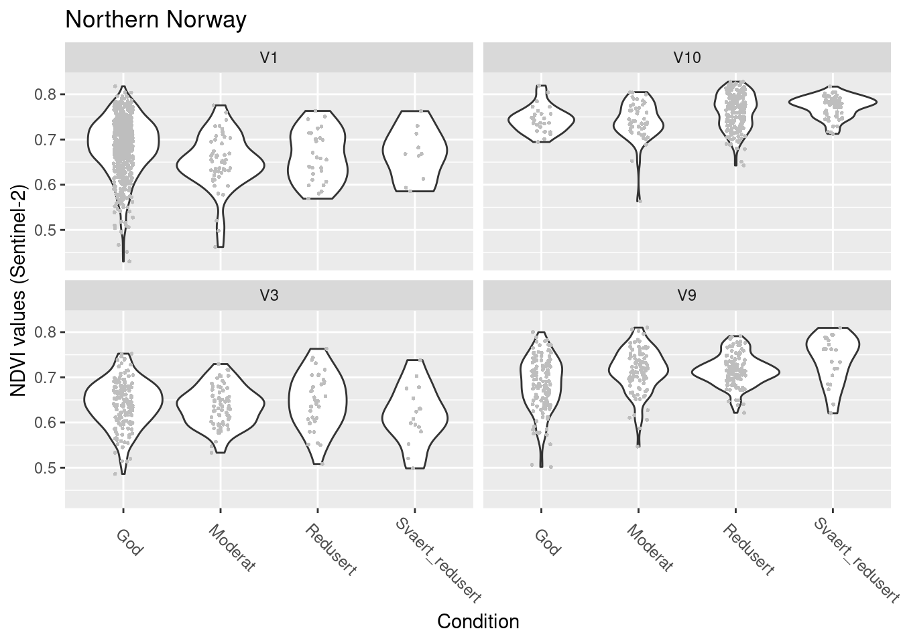
<p class="caption">(\#fig:north-nvdi-vs-tilstand-ndviw)NDVI against ecosystem condition for four wetland ecosystems in Northern Norway.</p>
</div>

```r
summary(model.wetland.cond.Sent.N)$coefficients
#> $mean
#>                              Estimate  Std. Error
#> (Intercept)                1.67333314 0.008318038
#> tilstand_num              -0.04643158 0.012959228
#> hovedtypeV10               0.21150547 0.031686815
#> hovedtypeV3               -0.15282168 0.016532632
#> hovedtypeV9                0.01819835 0.017764052
#> tilstand_num:hovedtypeV10  0.09975973 0.019917685
#> tilstand_num:hovedtypeV3   0.03632141 0.017944353
#> tilstand_num:hovedtypeV9   0.10859877 0.017061551
#>                              z value     Pr(>|z|)
#> (Intercept)               201.169208 0.000000e+00
#> tilstand_num               -3.582897 3.398044e-04
#> hovedtypeV10                6.674873 2.474460e-11
#> hovedtypeV3                -9.243639 2.382542e-20
#> hovedtypeV9                 1.024448 3.056237e-01
#> tilstand_num:hovedtypeV10   5.008601 5.482719e-07
#> tilstand_num:hovedtypeV3    2.024114 4.295847e-02
#> tilstand_num:hovedtypeV9    6.365117 1.951404e-10
#> 
#> $precision
#>       Estimate Std. Error  z value      Pr(>|z|)
#> (phi) 188.7014    6.66989 28.29153 4.393116e-176
```

NDVI in good condition: V10 > V1 > V9 > V3

V1: NDVI decreases as condition deteriorates

V3: NDVI does not change as condition deteriorates

V9 & V10: NDVI increases as condition deteriorates

**Central Norway**

```r
SentinelNDVI.wetland.train %>%
  filter(region == "Central Norway") %>%
  ggplot(aes(x = tilstand, y = mean)) +
  geom_violin() +
  geom_point(size = 0.7, shape = 16, color = "grey", position = position_jitter(.1) ) +
  theme(axis.text.x = element_text(angle = -45, vjust = 0.5, hjust = 0.2, size = 9)) +
  ggtitle("Central Norway") +
  labs(y = "NDVI values (Sentinel-2)", x = "Condition") +
  facet_wrap(~hovedtype)
```

<div class="figure">
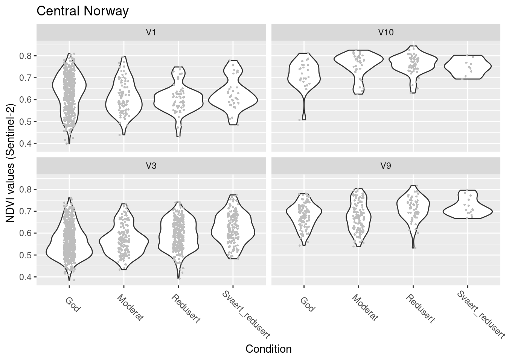
<p class="caption">(\#fig:central-nvdi-vs-tilstand-ndviw)NDVI against ecosystem condition for four wetland ecosystems in Central Norway.</p>
</div>


```r
summary(model.wetland.cond.Sent.C)$coefficients
#> $mean
#>                              Estimate  Std. Error
#> (Intercept)                1.48904059 0.009730197
#> tilstand_num              -0.02986332 0.010324515
#> hovedtypeV10               0.35557629 0.045636443
#> hovedtypeV3               -0.23033949 0.012687183
#> hovedtypeV9                0.14627542 0.022150023
#> tilstand_num:hovedtypeV10  0.09659936 0.029484671
#> tilstand_num:hovedtypeV3   0.08767876 0.011747020
#> tilstand_num:hovedtypeV9   0.07911535 0.019427414
#>                              z value     Pr(>|z|)
#> (Intercept)               153.032930 0.000000e+00
#> tilstand_num               -2.892467 3.822287e-03
#> hovedtypeV10                7.791499 6.621894e-15
#> hovedtypeV3               -18.155291 1.166093e-73
#> hovedtypeV9                 6.603850 4.006160e-11
#> tilstand_num:hovedtypeV10   3.276257 1.051928e-03
#> tilstand_num:hovedtypeV3    7.463916 8.398842e-14
#> tilstand_num:hovedtypeV9    4.072356 4.653991e-05
#> 
#> $precision
#>       Estimate Std. Error  z value      Pr(>|z|)
#> (phi) 123.0947   3.562555 34.55236 1.313652e-261
```

NDVI in good condition: V10 > V1 & V9 > V3

V1: NDVI decreases as condition deteriorates

V3, V9 & V10: NDVI increases as condition deteriorates

**Western Norway**

```r
SentinelNDVI.wetland.train %>%
  filter(region == "Western Norway") %>%
  ggplot(aes(x = tilstand, y = mean)) +
  geom_violin() +
  geom_point(size = 0.7, shape = 16, color = "grey", position = position_jitter(.1) ) +
  theme(axis.text.x = element_text(angle = -45, vjust = 0.5, hjust = 0.2, size = 9)) +
  ggtitle("Western Norway") +
  labs(y = "NDVI values (Sentinel-2)", x = "Condition") +
  facet_wrap(~hovedtype)
```

<div class="figure">
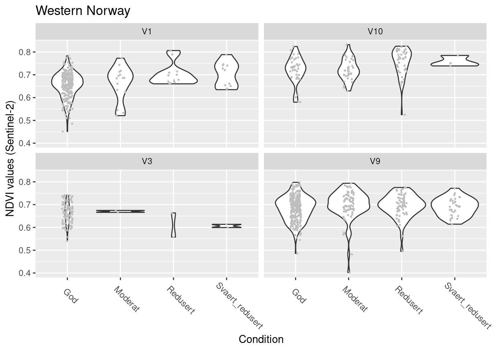
<p class="caption">(\#fig:west-nvdi-vs-tilstand-ndviw)NDVI against ecosystem condition for four wetland ecosystems in W-Norway.</p>
</div>

```r
summary(model.wetland.cond.Sent.W)$coefficients
#> $mean
#>                              Estimate Std. Error
#> (Intercept)                1.56690485 0.01212684
#> tilstand_num               0.06381437 0.01673950
#> hovedtypeV10               0.23487085 0.03305072
#> hovedtypeV3                0.02996982 0.02246694
#> hovedtypeV9                0.11362231 0.01696498
#> tilstand_num:hovedtypeV10  0.01171594 0.02770462
#> tilstand_num:hovedtypeV3  -0.13143403 0.03919401
#> tilstand_num:hovedtypeV9  -0.04955503 0.01956023
#>                               z value     Pr(>|z|)
#> (Intercept)               129.2096140 0.000000e+00
#> tilstand_num                3.8122020 1.377342e-04
#> hovedtypeV10                7.1063768 1.191289e-12
#> hovedtypeV3                 1.3339521 1.822196e-01
#> hovedtypeV9                 6.6974617 2.120708e-11
#> tilstand_num:hovedtypeV10   0.4228878 6.723771e-01
#> tilstand_num:hovedtypeV3   -3.3534216 7.981904e-04
#> tilstand_num:hovedtypeV9   -2.5334586 1.129431e-02
#> 
#> $precision
#>       Estimate Std. Error  z value      Pr(>|z|)
#> (phi) 189.3318   8.789978 21.53951 6.640391e-103
```

NDVI in good condition: V10 > V9 & V3 > V1

V1 & V10: NDVI increases as condition deteriorates

V3: NDVI decreases as condition deteriorates (but really insufficient data)

V9: NDVI does not change as condition deteriorates

**Eastern Norway**

```r
SentinelNDVI.wetland.train %>%
  filter(region == "Eastern Norway") %>%
  ggplot(aes(x = tilstand, y = mean)) +
  geom_violin() +
  geom_point(size = 0.7, shape = 16, color = "grey", position = position_jitter(.1) ) +
  theme(axis.text.x = element_text(angle = -45, vjust = 0.5, hjust = 0.2, size = 9)) +
  ggtitle("Eastern Norway") +
  labs(y = "NDVI values (Sentinel-2)", x = "Condition") +
  facet_wrap(~hovedtype)
```

<div class="figure">
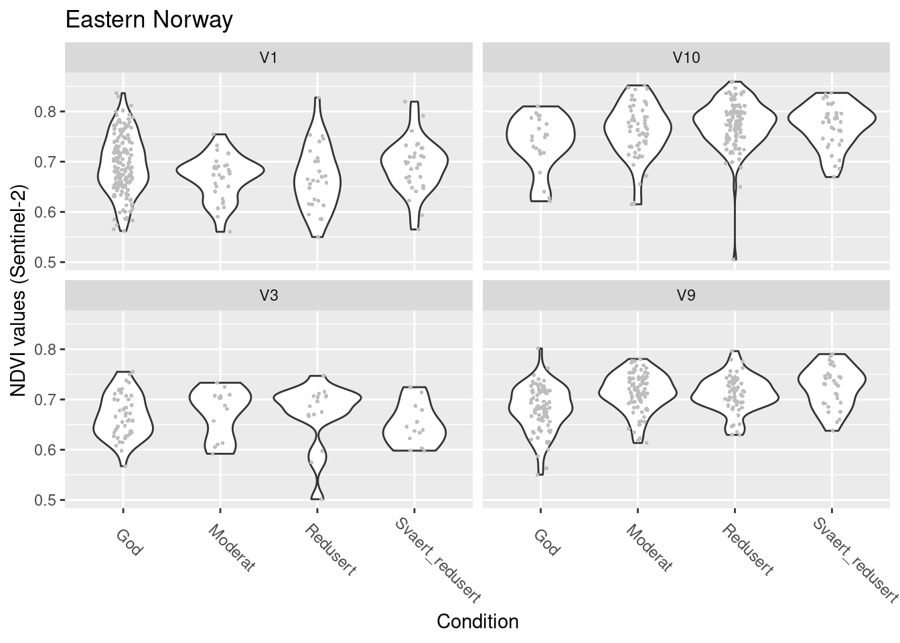
<p class="caption">(\#fig:east-nvdi-vs-tilstand-ndviw)NDVI against ecosystem condition for four wetland ecosystems in E-Norway.</p>
</div>

```r
summary(model.wetland.cond.Sent.E)$coefficients
#> $mean
#>                               Estimate Std. Error
#> (Intercept)                1.704888063 0.01455067
#> tilstand_num              -0.017517523 0.01102260
#> hovedtypeV10               0.239364865 0.03503891
#> hovedtypeV3               -0.089152665 0.02943892
#> hovedtypeV9               -0.019019876 0.02347098
#> tilstand_num:hovedtypeV10  0.066889663 0.02003607
#> tilstand_num:hovedtypeV3   0.006116913 0.02050429
#> tilstand_num:hovedtypeV9   0.070976897 0.01656420
#>                               z value     Pr(>|z|)
#> (Intercept)               117.1690768 0.000000e+00
#> tilstand_num               -1.5892374 1.120068e-01
#> hovedtypeV10                6.8314015 8.408902e-12
#> hovedtypeV3                -3.0283942 2.458572e-03
#> hovedtypeV9                -0.8103571 4.177350e-01
#> tilstand_num:hovedtypeV10   3.3384627 8.424333e-04
#> tilstand_num:hovedtypeV3    0.2983236 7.654562e-01
#> tilstand_num:hovedtypeV9    4.2849573 1.827743e-05
#> 
#> $precision
#>       Estimate Std. Error  z value     Pr(>|z|)
#> (phi)  205.477   10.16601 20.21217 7.651633e-91
```

NDVI in good condition: V10 > V1 > V3 & V9

V1 & V3: NDVI does not change as condition deteriorates

V9 & V10: NDVI increases as condition deteriorates

**Southern Norway**

```r
SentinelNDVI.wetland.train %>%
  filter(region == "Southern Norway") %>%
  ggplot(aes(x = tilstand, y = mean)) +
  geom_violin() +
  geom_point(size = 1, shape = 16, color = "grey", position = position_jitter(.1) ) +
  theme(axis.text.x = element_text(angle = -45, vjust = 0.5, hjust = 0.2, size = 9)) +
  ggtitle("Southern Norway") +
  labs(y = "NDVI values (Sentinel-2)", x = "Condition") +
  facet_wrap(~hovedtype)
```

<div class="figure">
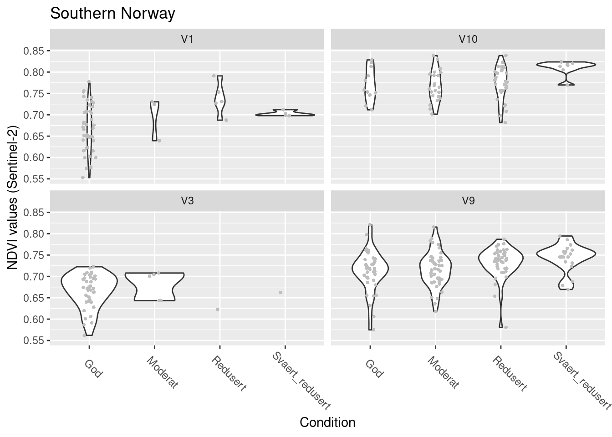
<p class="caption">(\#fig:south-nvdi-vs-tilstand-ndviw)NDVI against ecosystem condition for four wetland ecosystems in S-Norway.</p>
</div>

```r
summary(model.wetland.cond.Sent.S)$coefficients
#> $mean
#>                              Estimate Std. Error    z value
#> (Intercept)                1.62525471 0.02369318 68.5958826
#> tilstand_num               0.07371408 0.02435052  3.0272082
#> hovedtypeV10               0.37289353 0.04909476  7.5953840
#> hovedtypeV3               -0.01546251 0.03461680 -0.4466765
#> hovedtypeV9                0.14854854 0.03321194  4.4727444
#> tilstand_num:hovedtypeV10 -0.02881262 0.03532794 -0.8155759
#> tilstand_num:hovedtypeV3  -0.08348705 0.04654306 -1.7937595
#> tilstand_num:hovedtypeV9  -0.03041127 0.02824395 -1.0767359
#>                               Pr(>|z|)
#> (Intercept)               0.000000e+00
#> tilstand_num              2.468239e-03
#> hovedtypeV10              3.068811e-14
#> hovedtypeV3               6.551087e-01
#> hovedtypeV9               7.722205e-06
#> tilstand_num:hovedtypeV10 4.147427e-01
#> tilstand_num:hovedtypeV3  7.285156e-02
#> tilstand_num:hovedtypeV9  2.815983e-01
#> 
#> $precision
#>       Estimate Std. Error z value     Pr(>|z|)
#> (phi) 283.6989   22.81418 12.4352 1.683209e-35
```


NDVI in good condition: V10 > V9 > V1 & V3

V1, V9 & V10: NDVI increases as condition deteriorates

V3: NDVI does not change as condition deteriorates (but also insuffcient data)

<br />
<br />
<hr />

>Overall take home messages:
>
>In semi-natural wetland ecosystems (V9, V10) NDVI increases as ecosystem condition deteriorates, and this is consistent for the entire country. This supports the conclusion from the exploratory analyses that NDVI is indicative of ecological condition in semi-natural wetland ecosystems.
In natural minerotrophic fens (V1) NDVI increases in the South but decreases in the North as ecosystem condition deteriorates. A factor with potential for affecting vegetation composition and productivity, and thus NDVI, is Nitrogen deposition. Nitrogen deposition is higher in Southern parts of Norway than further north, and could thus be responsible for increased NDVI with reduced condition in the South, but it is not clear how Nitrogen deposition and the variables underlying the condition assessment in V1 (Ditches, Alien species, Heavy vehicles, Wear/tear) are connected. Furthermore we are to date lacking documented empirical ground-truthed information about the connection between NDVI and Nitrogen effects in wetlands. In bogs (V3) there is no consistent pattern.

<hr />

### NDVI across time - Sentinel, MODIS & LandSat {#across-time-ndviw}
As a last step, we can investigate how NDVI has changed over time. For this we include data from both MODIS and Landsat in addition to Sentinel-2.

First, there's again some data handling to do. We merge the Sentinel, MODIS, and Landsat data to show the full picture across time. Then we model the time series for each Satellite separately.

```r
## data handling for time series analysis
# Sentinel time series checked in exploratory analysis script

# checking time series for MODIS
   # ModisNDVI.wetland %>%
   #   group_by(id, year) %>%
   #   filter(mean == max(mean, na.rm = TRUE)) %>%
   #   ggplot(aes(x = year, y = mean)) +
   #   geom_point() +
   #   facet_wrap(~hovedtype)
# 2022 does not stand out as in the Sentinel data, so we keep it
ModisNDVI.wetland <- ModisNDVI.wetland %>%
  group_by(id, year) %>%
  filter(mean == max(mean, na.rm = TRUE))

# checking time series for Landsat
   # LandsatNDVI.wetland %>%
   #   group_by(id, year) %>%
   #   filter(mean == max(mean, na.rm = TRUE)) %>%
   #   ggplot(aes(x = year, y = mean)) +
   #   geom_point() +
   #   facet_wrap(~hovedtype)
# nothing worrying to see here either
LandsatNDVI.wetland <- LandsatNDVI.wetland %>%
  group_by(id, year) %>%
  filter(mean == max(mean, na.rm = TRUE))

# transformation of NDVI scale to beta scale
# SentinelNDVI.wetland$mean_beta <- (SentinelNDVI.wetland$mean + 1) / 2
ModisNDVI.wetland$mean_beta <- (ModisNDVI.wetland$mean + 1) / 2
LandsatNDVI.wetland$mean_beta <- (LandsatNDVI.wetland$mean + 1) / 2

# check if there's any 0s or 1s (which beta cannot handle)
   # summary(SentinelNDVI.wetland$mean_beta)
   # summary(ModisNDVI.wetland$mean_beta)
   # summary(LandsatNDVI.wetland$mean_beta)
# replace 1s in Landsat data with 0.9999
LandsatNDVI.wetland <- LandsatNDVI.wetland %>%
  mutate(mean_beta = replace(mean_beta, mean_beta == 1, 0.9999))

# check if the three Satellite objects have the same structure (for concatenating them)
   # names(SentinelNDVI.wetland)
   # names(ModisNDVI.wetland)
   # names(LandsatNDVI.wetland)
# Sentinel and Landsat have each an extra column -> omit them when concatenating further below
# one column is named slightly differently in the Sentinel data -> rename it
SentinelNDVI.wetland <- SentinelNDVI.wetland %>%
  dplyr::rename("system.index" = "system:index")

# check if they have the same geometry
   # st_crs(SentinelNDVI.wetland)
   # st_crs(ModisNDVI.wetland)
   # st_crs(LandsatNDVI.wetland)
# all good

# add an increment to the year variable to avoid overlapping data being hidden in figures
SentinelNDVI.wetland$year_jit <- SentinelNDVI.wetland$year + 0.3
ModisNDVI.wetland$year_jit <- ModisNDVI.wetland$year - 0.3
LandsatNDVI.wetland$year_jit <- LandsatNDVI.wetland$year

# concatenate the three Satellite objects
allSatNDVI.wetland <- rbind(
  SentinelNDVI.wetland[, !names(SentinelNDVI.wetland) %in% "subtype"],
  ModisNDVI.wetland,
  LandsatNDVI.wetland[, !names(LandsatNDVI.wetland) %in% "column_label"]
)
# add variable for Satellite identity
allSatNDVI.wetland$Sat <- c(
  rep("Sentinel", nrow(SentinelNDVI.wetland)),
  rep("Modis", nrow(ModisNDVI.wetland)),
  rep("Landsat", nrow(LandsatNDVI.wetland))
)
allSatNDVI.wetland$Sat <- factor(allSatNDVI.wetland$Sat, levels = c("Sentinel", "Modis", "Landsat"))
  # levels(allSatNDVI.wetland$Sat)
```


Now we can plot the time series for each main ecosystem type, showing each satellite time series separately:

```r
# plot
allSatNDVI.wetland %>%
  ggplot(aes(x = year_jit, y = mean, color = Sat)) +
  geom_point() +
  ggtitle("NDVI across time") +
  labs(y = "NDVI values", x = "Year") +
  facet_wrap(~hovedtype, ncol = 1)
```

<div class="figure">
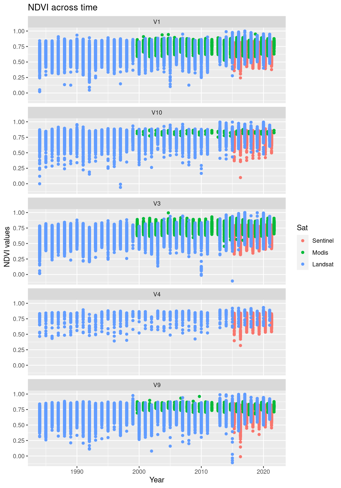
<p class="caption">(\#fig:ndvi-time-series-comparison-ndviw)Comparing the NDVI time series in the three data sets.</p>
</div>

It is quite obvious that the NDVI values from the three satellites are not quantitatively comparable. 
They vary both in their placement along the y-axis and in their variance. 
Modis data are absent from the V4-ecosystem type because of a too large pixel size compared to the NiN-polygon sizes. 
In V10, Modis is poorly represented for the same reason.

We can test if there are consistent temporal changes in NDVI by running regressions including year as a covariate.

We first investigate a model testing NDVI as a function of year and main ecosystem type for polygons in good condition, and we do so separately for each satellite.

<!-- RUNTIME approx. 15 min -->

```r
model.wetland.time.GodTilst.Sent <- glmmTMB(mean_beta ~ year * hovedtype + (1 | id), family = beta_family(), data = SentinelNDVI.wetland[SentinelNDVI.wetland$tilstand == "God", ])
model.wetland.time.GodTilst.Modi <- glmmTMB(mean_beta ~ year * hovedtype + (1 | id), family = beta_family(), data = ModisNDVI.wetland[ModisNDVI.wetland$tilstand == "God", ])
model.wetland.time.GodTilst.Land <- glmmTMB(mean_beta ~ year * hovedtype + (1 | id), family = beta_family(), data = LandsatNDVI.wetland[LandsatNDVI.wetland$tilstand == "God", ])
```


```r
summary(model.wetland.time.GodTilst.Sent)$coefficients$cond
#>                        Estimate   Std. Error     z value
#> (Intercept)       -1.925588e+01 0.9754640428 -19.7402253
#> year               1.033546e-02 0.0004833795  21.3816715
#> hovedtypeV10      -9.969031e+00 3.8172312004  -2.6115870
#> hovedtypeV3       -1.011107e+01 1.4976132157  -6.7514561
#> hovedtypeV4       -6.859260e-01 4.3058771904  -0.1593000
#> hovedtypeV9       -7.163768e-01 1.8330129528  -0.3908193
#> year:hovedtypeV10  5.062563e-03 0.0018916053   2.6763315
#> year:hovedtypeV3   4.889985e-03 0.0007421254   6.5891629
#> year:hovedtypeV4   4.147249e-04 0.0021337353   0.1943657
#> year:hovedtypeV9   3.864512e-04 0.0009083285   0.4254531
#>                        Pr(>|z|)
#> (Intercept)        9.734292e-87
#> year              1.979126e-101
#> hovedtypeV10       9.012306e-03
#> hovedtypeV3        1.463687e-11
#> hovedtypeV4        8.734326e-01
#> hovedtypeV9        6.959308e-01
#> year:hovedtypeV10  7.443299e-03
#> year:hovedtypeV3   4.423132e-11
#> year:hovedtypeV4   8.458896e-01
#> year:hovedtypeV9   6.705064e-01
```


```r
summary(model.wetland.time.GodTilst.Modi)$coefficients$cond
#>                       Estimate   Std. Error    z value
#> (Intercept)      -1.0322620875 1.0901088732 -0.9469349
#> year              0.0015527003 0.0005418631  2.8654842
#> hovedtypeV3      -1.2427690096 1.4970870034 -0.8301248
#> hovedtypeV9       0.4793622528 2.4276936759  0.1974558
#> year:hovedtypeV3  0.0005978803 0.0007441607  0.8034291
#> year:hovedtypeV9 -0.0002091212 0.0012067644 -0.1732908
#>                    Pr(>|z|)
#> (Intercept)      0.34367198
#> year             0.00416372
#> hovedtypeV3      0.40646824
#> hovedtypeV9      0.84347085
#> year:hovedtypeV3 0.42172678
#> year:hovedtypeV9 0.86242282
```


```r
summary(model.wetland.time.GodTilst.Land)$coefficients$cond
#>                        Estimate   Std. Error     z value
#> (Intercept)       -2.074622e+01 1.614497e-01 -128.499599
#> year               1.124142e-02 8.060694e-05  139.459752
#> hovedtypeV10       1.169580e+00 6.726923e-01    1.738656
#> hovedtypeV3        4.633300e+00 2.466544e-01   18.784579
#> hovedtypeV4       -2.500609e+00 1.695836e+00   -1.474559
#> hovedtypeV9        1.528318e+00 2.998024e-01    5.097751
#> year:hovedtypeV10 -4.819325e-04 3.359055e-04   -1.434727
#> year:hovedtypeV3  -2.441902e-03 1.231224e-04  -19.833130
#> year:hovedtypeV4   1.365779e-03 8.468504e-04    1.612775
#> year:hovedtypeV9  -7.481056e-04 1.496844e-04   -4.997888
#>                       Pr(>|z|)
#> (Intercept)       0.000000e+00
#> year              0.000000e+00
#> hovedtypeV10      8.209535e-02
#> hovedtypeV3       1.009844e-78
#> hovedtypeV4       1.403312e-01
#> hovedtypeV9       3.437116e-07
#> year:hovedtypeV10 1.513650e-01
#> year:hovedtypeV3  1.541442e-87
#> year:hovedtypeV4  1.067934e-01
#> year:hovedtypeV9  5.796166e-07
```

There's an increase in NDVI over time in all three satellite time series in essentially all major wetland ecosystem types in good condition. 
It is worth pointing out though that the model on the MODIS data shows 1/10 of the effect size for the time slope and has way less statistical power compared to Sentinel and Landsat.

Given the systematically higher NDVI-values with decreasing condition in semi-natural wetlands, we may ask the question if the temporal NDVI increase might be stronger with reduced condition?

```r
model.wetland.time.tilst.V9V10.Sent <- glmmTMB(mean_beta ~ year * tilstand + (1 | id), family = beta_family(), data = SentinelNDVI.wetland[SentinelNDVI.wetland$hovedtype %in% c("V9", "V10"), ])
model.wetland.time.tilst.V9V10.Modi <- glmmTMB(mean_beta ~ year * tilstand + (1 | id), family = beta_family(), data = ModisNDVI.wetland[ModisNDVI.wetland$hovedtype %in% c("V9", "V10"), ])
model.wetland.time.tilst.V9V10.Land <- glmmTMB(mean_beta ~ year * tilstand + (1 | id), family = beta_family(), data = LandsatNDVI.wetland[LandsatNDVI.wetland$hovedtype %in% c("V9", "V10"), ])
```


```r
summary(model.wetland.time.tilst.V9V10.Sent)$coefficients$cond
#>                                   Estimate  Std. Error
#> (Intercept)                  -21.318811477 1.671765664
#> year                           0.011403740 0.000828431
#> tilstandModerat               -8.338657043 2.558213254
#> tilstandRedusert             -11.704682247 2.468918581
#> tilstandSvaert_redusert      -10.747458539 3.649454324
#> year:tilstandModerat           0.004174034 0.001267707
#> year:tilstandRedusert          0.005898434 0.001223461
#> year:tilstandSvaert_redusert   0.005429102 0.001808474
#>                                 z value     Pr(>|z|)
#> (Intercept)                  -12.752273 3.027877e-37
#> year                          13.765468 4.112137e-43
#> tilstandModerat               -3.259563 1.115840e-03
#> tilstandRedusert              -4.740813 2.128619e-06
#> tilstandSvaert_redusert       -2.944949 3.230074e-03
#> year:tilstandModerat           3.292585 9.927104e-04
#> year:tilstandRedusert          4.821105 1.427649e-06
#> year:tilstandSvaert_redusert   3.002035 2.681810e-03
```

```r
summary(model.wetland.time.tilst.V9V10.Modi)$coefficients$cond
#>                                   Estimate  Std. Error
#> (Intercept)                  -0.5581407751 2.019245745
#> year                          0.0013465648 0.001004007
#> tilstandModerat               1.4013664258 2.951242988
#> tilstandRedusert              1.9299854474 4.462294111
#> tilstandSvaert_redusert       5.1700628311 5.305636372
#> year:tilstandModerat         -0.0006888262 0.001467401
#> year:tilstandRedusert        -0.0008692581 0.002218744
#> year:tilstandSvaert_redusert -0.0025437860 0.002637961
#>                                 z value  Pr(>|z|)
#> (Intercept)                  -0.2764105 0.7822328
#> year                          1.3411904 0.1798587
#> tilstandModerat               0.4748394 0.6349015
#> tilstandRedusert              0.4325097 0.6653710
#> tilstandSvaert_redusert       0.9744473 0.3298345
#> year:tilstandModerat         -0.4694191 0.6387701
#> year:tilstandRedusert        -0.3917794 0.6952212
#> year:tilstandSvaert_redusert -0.9643001 0.3348955
```

```r
summary(model.wetland.time.tilst.V9V10.Land)$coefficients$cond
#>                                   Estimate   Std. Error
#> (Intercept)                  -19.216406849 0.2536004285
#> year                           0.010503751 0.0001266447
#> tilstandModerat               -3.130595762 0.3877833509
#> tilstandRedusert              -4.340231073 0.3849970602
#> tilstandSvaert_redusert       -5.380941705 0.5655042387
#> year:tilstandModerat           0.001600110 0.0001936701
#> year:tilstandRedusert          0.002271715 0.0001922920
#> year:tilstandSvaert_redusert   0.002801372 0.0002824738
#>                                 z value     Pr(>|z|)
#> (Intercept)                  -75.774347 0.000000e+00
#> year                          82.938724 0.000000e+00
#> tilstandModerat               -8.073054 6.856151e-16
#> tilstandRedusert             -11.273414 1.775502e-29
#> tilstandSvaert_redusert       -9.515299 1.811917e-21
#> year:tilstandModerat           8.262039 1.432052e-16
#> year:tilstandRedusert         11.813881 3.309240e-32
#> year:tilstandSvaert_redusert   9.917278 3.501744e-23
```

Indeed, the temporal NDVI increase has been stronger in semi-natural wetlands with reduced ecological condition, in both Sentinel and Landsat. 
For MODIS, the time slope is again 1/10 of the slopes in the other two satellite time series, and it is not significant.

## Overall conclusion

NDVI in wetland ecosystem does vary with condition and also with ecosystem type but the variance and thus overlap between condition classes and ecosystem types is large. Especially the semi-natural wetland ecosystems show a very consistent pattern of higher NDVI and larger temporal NDVI increase in sites in reduced ecological condition, which also links well to the registered condition variables behind the lower condition scores (shrub/tree encroachment, low land-use intensity, succession) and thus reduced land-use as the main pressure identified for these systems.
The large variance and thus overlap between condition classes and ecosystem types makes it generally difficult to define useful scaling values for absolute NDVI values.
Since ecological condition also relates to the temporal development of NDVI values in the analyses above, an alternative approach can be to define scaling values for time slopes as for instance has been done for the NDVI indicator in the ecological condition assessment for Norwegian mountains (Framstad et al. 2022 in references above, see coded example at https://ninanor.github.io/IBECA/ndvi-trend_fjell.html).

Beyond these considerations, there are two general issues which limit a more comprehensive and robust application of satellite based NDVI-data in an ecological condition context:

1. We are lacking ecosystem maps for wetland ecosystems
The analysis at hand clearly shows that different wetland ecosystem types display different greenness levels and thus need to be evaluated separately. Thus, we need ecosystem maps, that allow us to treat NDVI values, and temporal changes of these, for at least the different major ecosystem types within wetlands separately.
2. We are lacking a good ecological understanding and ground-truthing for NDVI in wetland ecosystems
Unlike for ecosystems like forests, tundra, savannah and similar, there is little empirical work and ground-truthing data documented that link NDVI values to ecological phenomena in wetlands. 

Here, we need field studies investigating:

- The connection between NDVI and ecological drivers like for example potential effects of Nitrogen deposition. This includes a need for understanding temporal increases in NDVI in ecosystems in good condition.
- How reflectance in different wetland types is affected by how moist the moss layer is at the time of measuring. The literature suggests a high variability in NDVI measurements from mosses in particular, in part due to moisture content (Valøen, 2019). Minerotrophic wetlands (V1) are more dominated by graminoids than V3, and the moss-layer is generally more visible from above. At the same time, wetlands are generally drier in the western parts of Norway than in the East (Moen et al. 2011), so NDVI patterns may, at least in part, be determined by moisture.

In addition, further investigations should test how NDVI-condition pattern vary across biogeographic regions in addition to administrative regions (which are ecologically irrelevant), in order to better understand the results for the administrative regions.


**References introduced in the conclusion:**

Moen, A., Lyngstad, A. & Øien, D.-I. 2011. Kunnskapsstatus og innspill til faggrunnlag for oseanisk nedbørmyr som utvalgt naturtype. – NTNU Vitensk.mus. Rapp. bot. Ser. 2011-7: 1-72

Valøen, K. 2019. Stochastic rain events increase NDVI through moss water content: a High-Arctic field experiment. NTNU

### Eksport {#export-ndviw}
<!-- Export final file. Ideally a georeferenced shape or raster wit indicators values (raw and normalised), reference values and errors. -->
