# Alien species {#alien-species}

*Author and date:* 

Anders L. Kolstad

March 2023


|Ecosystem                                                           |Økologisk.egenskap                      |ECT.class                              |
|:-------------------------------------------------------------------|:---------------------------------------|:--------------------------------------|
|Våtmark, Naturlig åpne områder under skoggrensa, Semi-naturlig mark |Funksjonelt viktige arter og strukturer |B1 Compositional state characteristics |


<hr/>

## Introduction
This indicator represent the the ecological on-site effect from  alien species. Whilst the introduction of alien species is best considered a pressure variable, the relative abundance of alien species on a given location is seen here as a manifestation of this negative anthropogenic impact, and is therefore a valid condition indicator.

A related variable has been used previously for [alpine](https://ninanor.github.io/IBECA/faktaark.html#Frav%C3%A6r_av_fremmede_arter) and forest ecosystems in Norway. These indicators were based on ANO, a national monitoring program, where alien species cover was estimated to the closest whole percent. The upper and lower reference levels that was used back then was 0 or 100% of the species composition made up of alien species, respectively. The threshold value between good and reduced condition was defined as 5%. In this approach, the indicator represented the relative area with an absence of alien species. It is in a way the flip-side of _alien species abundance_. The latter was said to be a pressure variable, whilst the former reacts as direct and linear consequence of changes to this variable, and was therefore accepted as a condition indicator. We do not make this distinction here. 

This time we are using the [nature type mapping dataset](#naturtype) which records the assumed _effect_ of alien species, rather than a direct measure of abundance such as percentage cover. The recording scale is called R7 (Fig. \@ref(fig:R7)) and is an ordinal scale which has a non-linear relationship with percentage cover recorded in ANO (Fig. \@ref(fig:fremmedart-prosentVSinnslag)). In order to combine these two data sets, we must convert one of these scales to match the other.

Here I base the indicator on the R7 scale, since this is, presumably, the bigger data set. I therefore convert percentage cover into R7 classes based on what I can interpret from Fig. \@ref(fig:fremmedart-prosentVSinnslag).

Upper reference value is then 1, and lower reference value is 7, on the R7 scale.
For the threshold value I will set this to value 4 on the R7 scale. 
This is based on interpretation by the author and based of the definition of this value in Fig. \@ref(fig:R7). 
Step 4 on the R7 scale is the step that, concordantly, best matches the 5% threshold in the old approach, as seen from Fig. \@ref(fig:fremmedart-prosentVSinnslag).


```r
knitr::include_graphics("images/R7 scale.PNG")
```

<div class="figure">

<p class="caption">(\#fig:R7)The R7 scale used when recording the effect of alien species in the nature type monitoring program</p>
</div>


```r
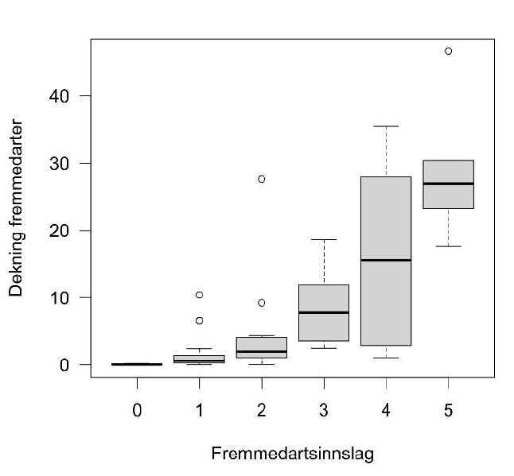
```

<div class="figure">

<p class="caption">(\#fig:fremmedart-prosentVSinnslag)Comparing the R7 scale (x axis) which is used in the nature type monitoring program with percentage cover (y-axis), which is how alien species is recorded in ANO. I am assuming the x axis is shifted downwards compared to the original R7 scale which range from 1 to 7, so that a value of 0 here equals an R7 value of 1. Cropped from Evju et al (2022).</p>
</div>


Since the nature type data is not sampled in a systematic or random way, we must take extra care not to over-extrapolate in space. We delineate _homogeneous impact areas_ (HIA) based on four classes of increasing infrastructure intersected with municipality borders, and we say that if we have more than _n_ data points then this field data is representative inside the entire HIA. In [a related indicator](#slitasje-og-kjørespor) we used the accounting areas to define the HIA (5 accounting areas in Norway), in addition to the infrastructure classes. For this indicator, we expect more gradients also inside accounting areas, and therefore we define HIAs based on municipalities. This means that there will be more missing data in our final indicator maps, since not all municipalities will have sufficient data points to estimate indicator values.

We then calculate an area weighted mean (and error) indicator value for each HIA, as long as there is more than _n_ data points for a given combination of HIA and municipality.     

Here a general workflow for the calculation of the indicator.

1.  Import [Nature type data](#NTM2) data set (incl. GRUK) and [ANO data
    set](#ANO-import2)

2.  Identify the [relevant](#naturtype) nature types and [subset](#NTM)
    the data

3.  Convert [ANO points to polygons](#ANO-points-to-poly)

5.  [Combine](#combine-nt-ano) data sets

6.  [Scale](#scale-alien-ind) the `alien species` variable based on
    reference values.

7.  Define [homogeneous impact areas](#HIA) (HIA) based on an infrastructure index and municipalities

8.  [Aggregate and spread](#spread-slitasje) indicator value across HIAs
    (and municipalities)

9.  Confirm relationship between infrastructure index and indicator
    values to justify the extrapolation

10. TO DO: Prepare ecosystem delineation maps and use these to mask the extrapolated indicator maps

11. Spatial aggregation of indicator values and uncertainties to accounting areas

12. Export indicator maps and regional extrapolated maps

## About the underlying data

The indicator uses a data set from a standardised field survey of nature
types. You can read more about this data set from my preliminary analyses
[here](#naturtype). See also the [official
site](https://www.miljodirektoratet.no/ansvarsomrader/overvaking-arealplanlegging/naturkartlegging/naturtyper/)
of the Environment Agency. I also import a data set called
[ANO](#ANO-import2), which you can read about
[here](https://www.miljodirektoratet.no/ansvarsomrader/overvaking-arealplanlegging/miljoovervaking/overvakingsprogrammer/natur-pa-land/arealrepresentativ-naturovervakning-ano/).

### Representativity in time and space

The nature type mapping is not random and cannot be said to be area
representative. The ANO data set however, is area representative. The
data is from 2018 to present. The data from one field season usually
becomes available early the following year.

### Original units

The variables are recorded on a unitless seven-step ordinal scale (Fig.
\@ref(fig:R7)) or a as a percentage cover of alien species.

### Temporal coverage

The data goes back to 2018. I therefore bulk all the data from 2018 to 2022 into one time step. I then use the mean date for the raw data,
and define the variable as belonging to the year 2020 (read more
[here](#scaled-alien-variable)).

### Aditional comments about the dataset

For a run through of the nature type data set, see [here](#naturtype).

## Ecosystem characteristic

### Norwegian standard

The indicator is tagged to the *Økologisk egenskap* called
**Funksjonelt viktige arter og strukturer** (Functionally important species and structures). This emphasises the negative effect that alien species have on for example supressing or excluding native species. In some cases, alien species can also affect nutrient cycling or recruitment.

### UN standard

The indicator is tagged as a **B1 Compositional state characteristics**
indicator. 

## Collinearities with other indicators

_Alien species_ is not thought to exhibit collinearity with any other indicator at
the present.

## Reference condition and values

### Reference condition

The reference condition is one with minimal negative human impact. This
is also true for semi-natural ecosystems. In a sense, the reference condition is pre-1800,
since the Alien Species List of Norway only contains species established after 1800. 

### Reference values, thresholds for defining *good ecological condition*, minimum and/or maximum values


* Upper = 1 (R7 scale), corresponding to 0% alien species

* Threshold = 4 (R7 scale), corresponding to about 5-30% alien species cover.

* Lower = 7 (R7 scale), corresponding to 100% alien species cover.

Read about the normalisation [here](##scaled-alien-variable).

## Uncertainties

Uncertainties/errors are estimated for aggregated indicator values by
bootstrapping individual indicator values 1000 times and calculating a
distribution of area weighted means. This uncertainty is different from 
the spatial variation which we could get more straightforward without 
bootstrapping. When aggregating a second time,
from homogeneous impact areas to accounting areas, we assume a normal
distribution around the indicator values, with the already mentioned
errors, and sample _n_ times from these and combine the resamples into an
a new, area-weighted, distribution. The errors for the accounting areas
thus represents both the spatial variation and the precision of the
indicator values within the accounting areas.

## References

[Nature type data](https://www.miljodirektoratet.no/ansvarsomrader/overvaking-arealplanlegging/naturkartlegging/naturtyper/)

[ANO](https://www.miljodirektoratet.no/ansvarsomrader/overvaking-arealplanlegging/miljoovervaking/overvakingsprogrammer/natur-pa-land/arealrepresentativ-naturovervakning-ano/)

Evju, M., Skrindo, A.B. & Solstad, H. (red.) 2022. Overvåking av åpen grunnlendt kalkmark 2021‒2024. Årsrapport 2022. NINA Rapport 2195. Norsk institutt for naturforskning.

## Analyses

### Data sets

#### Nature type mapping {#NTM2}

This indicator uses the data set
`Naturtyper etter Miljødirektoratets Instruks`, which can be found
[here](https://kartkatalog.geonorge.no/metadata/naturtyper-miljoedirektoratets-instruks/eb48dd19-03da-41e1-afd9-7ebc3079265c).
See also [here](#naturtype) for a detailed description of the data set.

We also have a separate [summary file](##exp-natureType-summary) where
the nature types are manually mapped to the NiN variables and to the correct NiN-main types. 
We can use this to find the nature types of interest.


```r
naturetypes_summary_import <- readRDS("data/naturetypes/natureType_summary.rds")
```

We are only interested in mapping units that include our target variables. The variable _fremmedartsinnslag_ (presence of alien species) is coded as 7FA.


```r
myVars <- '7FA'
```


```r
naturetypes_summary <- naturetypes_summary_import %>%
  rowwise() %>%
  mutate(keepers = sum(c_across(
    all_of(myVars))>0, na.rm=T)) %>%
  filter(keepers >0) %>%
  select(Nature_type, NiN_mainType, Year)
```

This deleted 30 nature types and left us with these 24 nature types where 7FA was recorded:


```r
DT::datatable(naturetypes_summary)
```


```{=html}
<div class="datatables html-widget html-fill-item-overflow-hidden html-fill-item" id="htmlwidget-3f3b2bb88fec3a22749c" style="width:100%;height:auto;"></div>
<script type="application/json" data-for="htmlwidget-3f3b2bb88fec3a22749c">{"x":{"filter":"none","vertical":false,"data":[["1","2","3","4","5","6","7","8","9","10","11","12","13","14","15","16","17","18","19","20","21","22","23","24"],["Slåttemyr","Hagemark","Naturbeitemark","Semi-naturlig eng","Eng-aktig sterkt endret fastmark","Åpen flomfastmark","Strandeng","Nakent tørkeutsatt kalkberg","Kystlynghei","Boreal hei","Semi-naturlig våteng","Slåttemark","Sanddynemark","Semi-naturlig strandeng","Rik åpen jordvannsmyr i mellomboreal sone","Åpen grunnlendt kalkrik mark i boreonemoral sone","Rik åpen sørlig jordvannsmyr","Øvre sandstrand uten pionervegetasjon","Kalkrik helofyttsump","Åpen grunnlendt kalkrik mark i sørboreal sone","Sørlig etablert sanddynemark","Rik åpen jordvannsmyr i nordboreal og lavalpin sone","Svært tørkeutsatt sørlig kalkberg","Lauveng"],["V9","T32","T32","T32","T41","T18","T12","T1","T34","T31","V10","T32","T21","T33","V1","T2","V1","T29","L4","T2","T21","V1","T1","T32"],["2018, 2019, 2020, 2021, 2022","2018, 2019, 2020, 2021, 2022","2018, 2019, 2020, 2021, 2022","2018, 2019, 2020, 2021, 2022","2018, 2019, 2020, 2021, 2022","2018, 2019, 2020, 2021, 2022","2018, 2019, 2020, 2021, 2022","2019, 2020, 2021, 2022","2018, 2019, 2020, 2021, 2022","2018, 2019, 2020, 2021, 2022","2018, 2019, 2020, 2021, 2022","2018, 2019, 2020, 2021, 2022","2018, 2019, 2020, 2021, 2022","2018, 2019, 2020, 2021, 2022","2019, 2020, 2021, 2022","2018, 2019, 2020, 2021, 2022","2018, 2019, 2020, 2021, 2022","2019, 2020, 2021, 2022","2019, 2020, 2021, 2022","2019, 2020, 2021","2018, 2019, 2020, 2021, 2022","2019, 2020, 2021, 2022","2019, 2020, 2021, 2022","2019, 2020, 2022"]],"container":"<table class=\"display\">\n  <thead>\n    <tr>\n      <th> <\/th>\n      <th>Nature_type<\/th>\n      <th>NiN_mainType<\/th>\n      <th>Year<\/th>\n    <\/tr>\n  <\/thead>\n<\/table>","options":{"columnDefs":[{"orderable":false,"targets":0}],"order":[],"autoWidth":false,"orderClasses":false}},"evals":[],"jsHooks":[]}</script>
```


Importing and sub-setting the main data file, fix duplicate _hovedøkosystem_, calculate area, split one column in two, make numeric, and select target variables:

```r
naturetypes <- sf::st_read(dsn = path) %>%
  filter(naturtype %in% naturetypes_summary$Nature_type) %>%
  mutate(hovedøkosystem = case_match(hovedøkosystem,
                                  "naturligÅpneOmråderILavlandet" ~ "naturligÅpneOmråderUnderSkoggrensa",
                                  .default = hovedøkosystem),
         area = st_area(.)) %>%
  separate_rows(ninBeskrivelsesvariable, sep=",") %>%
  separate(col = ninBeskrivelsesvariable,
           into = c("NiN_variable_code", "NiN_variable_value"),
           sep = "_",
           remove=F) %>%
  mutate(NiN_variable_value = as.numeric(NiN_variable_value)) %>%
  filter(NiN_variable_code %in% myVars)
#> Reading layer `Naturtyper_nin_0000_norge' from data source 
#>   `/data/R/GeoSpatialData/Habitats_biotopes/Norway_Miljodirektoratet_Naturtyper_nin/Original/Naturtyper_nin_0000_norge_25833_FILEGDB/Naturtyper_nin_0000_norge_25833_FILEGDB.gdb' 
#>   using driver `OpenFileGDB'
#> Simple feature collection with 117427 features and 36 fields
#> Geometry type: MULTIPOLYGON
#> Dimension:     XY
#> Bounding box:  xmin: -74953.52 ymin: 6448986 xmax: 1075081 ymax: 7921284
#> Projected CRS: ETRS89 / UTM zone 33N
```


```r
ggplot(data = naturetypes, aes(x = naturtype, fill = hovedøkosystem))+
  geom_bar()+
  coord_flip()+
  theme_bw(base_size = 10)+
  theme(legend.position = "top",
        legend.title = element_blank(),
        legend.direction = "vertical")+
  guides(fill = "none")+
  xlab("")+
  ylab("Number of localities")+
  facet_wrap(.~hovedøkosystem, ncol=1, scale="free")
```

<div class="figure">
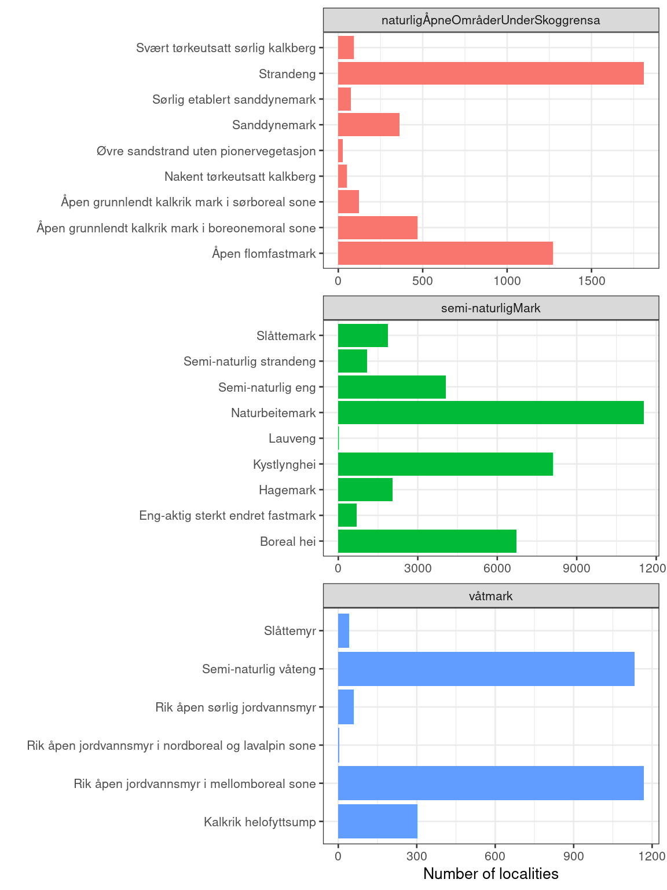
<p class="caption">(\#fig:unnamed-chunk-8)An overview of the naturetypes for which we will calculate the indicator.</p>
</div>

Note that there is a lot more data for semi-natural ecosystem compared to the other two.

Column names starting with a number is problematic, so adding a prefix


```r
naturetypes$NiN_variable_code <- paste0("var_", naturetypes$NiN_variable_code)
```

Removing NA's


```r
naturetypes <- naturetypes[!is.na(naturetypes$NiN_variable_value),]
```

Shift variable to start from 1 rather than from 0.


```r
naturetypes$NiN_variable_value <- naturetypes$NiN_variable_value+1
```


```r
ggplot(naturetypes, aes(x = NiN_variable_value))+
  geom_histogram(fill="grey",
           colour = "black",
           binwidth = 1)+
  theme_bw(base_size = 12)+
  labs(x = "Alien species variable score") +
  facet_wrap(.~hovedøkosystem, scales="free_y")
```

<div class="figure">
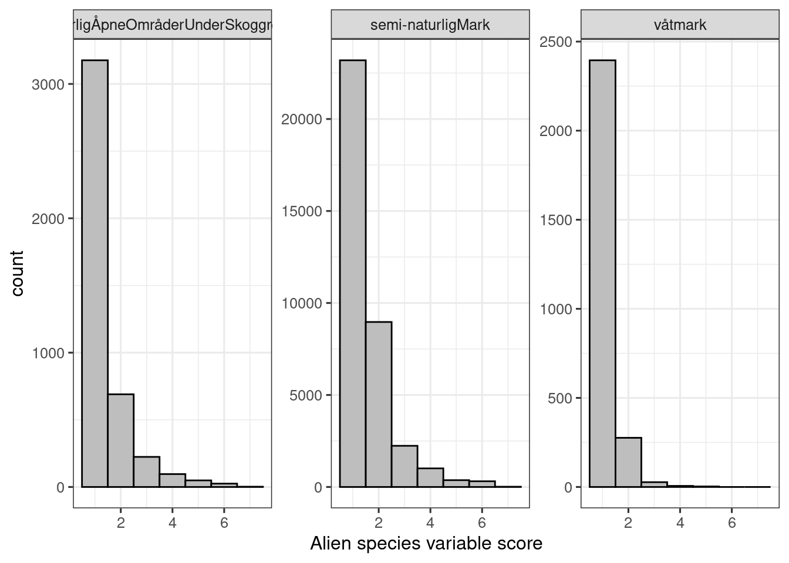
<p class="caption">(\#fig:alien-naturetype)Alien species variable scores in the nature type data set.</p>
</div>

It appears most localities are in good condition; actually, most localities have no alien species at all.


#### GRUK

This variable (7FA) is also recorded in
[GRUK](https://www.nina.no/Naturmangfold/Trua-natur/%C3%85pen-grunnlendt-kalkmark).
The nature type data set I'm working on here includes this data already
(presently only 2021 included). GRUK also records a related variable:
`% cover in 5m radii circles`, which is much more detailed. This data is
not published. In any case it is better to use the harmonized data set
in our case.

_NOTE: I'm not sure, but I wonder if the 2021 GRUK data was a pilot project and that most GRUK data, and all future GRUK data, will not be included in this data set._

#### ANO {#ANO-import2}

Arealrepresentativ Naturovervåking (ANO) consist of 1000 systematically
placed locations in Norway, each with 18 sample points. In each sample point, a
circle of 250 m^2^ is inspected, and the main ecosystem is recorded.

The percentage cover of alien vascular plant is estimated, irrespective of main ecosystem type. 
In contrast to the nature type data set, ANO only looks at vascular plants, and then also only the three highest impact categories
of the Alien Species List (SE, HI, PH). It is therefore not completely unproblematic to combine these to data sets,
but we will do so anyway. We expect plants to be the by far most common species group to influence the 7FA variable as well.
And similarly, we expect the three highest impact categories to contain the most widespread species, which will
drive the 7FA variable more than the other categories.


```r
ano_eco <- c("vaatmark", "naturlig_apne", "semi_naturlig_mark")
ano <- sf::st_read(paste0(pData, "Naturovervaking_eksport.gdb"),
                   layer = "ANO_SurveyPoint") %>%
  dplyr::filter(hovedoekosystem_punkt %in% ano_eco) %>%
   mutate(hovedoekosystem_punkt = case_match(hovedoekosystem_punkt,
                                       "vaatmark" ~ "våtmark",
                                       "naturlig_apne" ~ "naturligÅpneOmråderUnderSkoggrensa",
                                       "semi_naturlig_mark" ~ "semi-naturligMark",
                                       .default = hovedoekosystem_punkt))
#> Reading layer `ANO_SurveyPoint' from data source 
#>   `/data/P-Prosjekter2/41201785_okologisk_tilstand_2022_2023/data/Naturovervaking_eksport.gdb' 
#>   using driver `OpenFileGDB'
#> Simple feature collection with 8974 features and 71 fields
#> Geometry type: POINT
#> Dimension:     XY
#> Bounding box:  xmin: -51950 ymin: 6467050 xmax: 1094950 ymax: 7923950
#> Projected CRS: ETRS89 / UTM zone 33N
```


```r
table(ano$aar)
#> 
#> 2019 2021 
#>  215  887
```

This data set only contains data from year 2019 and 2021. We need to
update this data set later. It is not clear why there is no data from
2020.

Each point/row here is 250 square meters. The data also contains
information about how big a proportion of this area is made up of the
dominant main ecosystem. However, there are
215
NA's here, which is 20% of the data.

It appears the proportion of each circle that is made up of the dominant
ecosystem was only recorded after year 2019. In fact, the main ecosystem
was not recorded at all in 2019:


```r
table(ano$hovedtype_250m2, ano$aar)
#>                             
#>                              2019 2021
#>   Åpen flomfastmark             0    1
#>   Åpen grunnlendt mark          0   90
#>   Åpen jordvannsmyr             0  417
#>   Boreal hei                    0   81
#>   Fjellhei leside og tundra     0    5
#>   Grøftet torvmark              0    5
#>   Helofytt-ferskvannssump       0    3
#>   Historisk skredmark           0    3
#>   Isinnfrysingsmark             0    1
#>   Kaldkilde                     0    3
#>   Kystlynghei                   0   26
#>   Løs sterkt endret fastmark    0    1
#>   Myr- og sumpskogsmark         0   51
#>   Nakent berg                   0   35
#>   Nedbørsmyr                    0   53
#>   Rasmark                       0   23
#>   Rasmarkhei og -eng            0    3
#>   Semi-naturlig eng             0   44
#>   Semi-naturlig myr             0   14
#>   Semi-naturlig våteng          0    2
#>   Skogsmark                     0    3
#>   Strandberg                    0    5
#>   Strandeng                     0    2
#>   Strandsumpskogsmark           0    2
#>   Våtsnøleie og snøleiekilde    0    6
```

I can remove the NA's, and thus the 2019 data.

> *All of 2019 ANO data is excluded because of missing information*


```r
ano <- ano[!is.na(ano$andel_hovedoekosystem_punkt),]
```

Let's look at the variation in the recorded proportion of ecosystem
cover


```r
par(mar=c(5,6,4,2))
plot(ano$andel_hovedoekosystem_punkt[order(ano$andel_hovedoekosystem_punkt)],
     ylab="Percentage of the 250 m2 area\ncovered by the main ecosystem")
```

<div class="figure">

<p class="caption">(\#fig:unnamed-chunk-16)Distribution of the ANO variable andel_hovedoekosystem_punkt.</p>
</div>

The zero in there is an obvious mistake. Removing it:


```r
ano <- ano[ano$andel_hovedoekosystem_punkt>20,]
```

Here's another plot of the distribution of the same variable:


```r
ggplot(ano, aes(x = andel_hovedoekosystem_punkt))+
         geom_histogram(fill = "grey",
                        colour="black",
                        binwidth = 1)+
  theme_bw(base_size = 12)+
  xlab("Percentage cover of the main ecosystem\n in the 250m2 circle")+
  scale_x_continuous(limits = c(0,101),
                     breaks = seq(0,100,10))
```

<div class="figure">
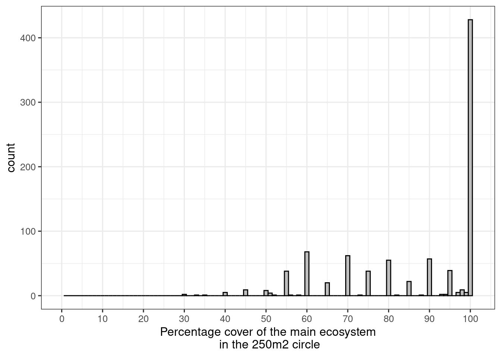
<p class="caption">(\#fig:unnamed-chunk-18)Percentage cover of the main ecosystem in the 250m2 circle</p>
</div>

We can see that people tend to record the variable in steps of 5%, and
that most sample points are 100% belonging to the same main ecosystem.

We want to use area weighting in this indicator, so we can use this
percentage cover data to calculate the area. Note that both data sets
use m^2^ as area units.


```r
ano$area <- (ano$andel_hovedoekosystem_punkt/100)*250
```

Let's now look at the distribution of the variable. It is coded as `fa_total_dekning`. 
First, there are 73 NA's in this column which we can remove.


```r
ano <- ano[!is.na(ano$fa_total_dekning),]
```

Let us plot the distribution of values.


```r
ggplot(ano, aes(x = fa_total_dekning))+
  geom_histogram(fill="grey",
           colour = "black",
           binwidth = 1)+
  theme_bw(base_size = 12)+
  labs(x = "Percentage cover alien vascular plants") +
  facet_wrap(.~hovedoekosystem_punkt, scales="free_y")
```

<div class="figure">
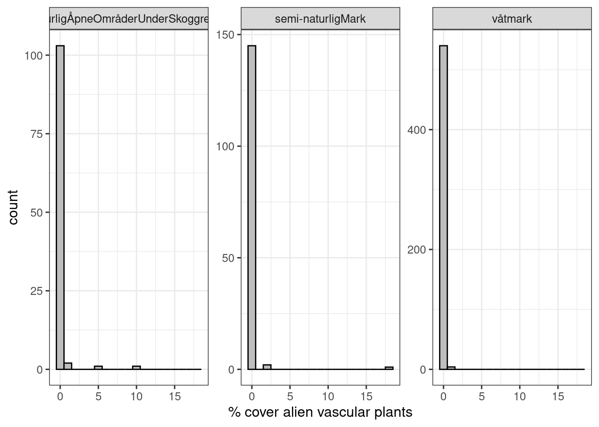
<p class="caption">(\#fig:ano-alien-dist)Distribution of percentage cover of alien plants variable in the ANO data set</p>
</div>

The ANO localities seemingly have less alien plants in them than the nature type localities. This can be due to sampling biases in the latter.

Now I will convert these percentage cover values into 7FA classes. This is a critical step, since there is no one-to-one mapping here, 
but rather there is considerable overlap, as can be seen in Fig. \@ref(fig:fremmedart-prosentVSinnslag).


```r
ano <- ano %>%
  mutate(var_7FA = case_when(
             fa_total_dekning>90 ~ 7,
             fa_total_dekning>25 ~ 6,
             fa_total_dekning>10 ~ 5,
             fa_total_dekning>5 ~ 4,
             fa_total_dekning>2 ~ 3,
             fa_total_dekning>1 ~ 2,
             fa_total_dekning<1 ~ 1))
```


```r
ggplot(ano, aes(x = var_7FA))+
  geom_histogram(fill="grey",
           colour = "black",
           binwidth = 1)+
  theme_bw(base_size = 12)+
  labs(x = "Percentage cover alien vascular plants\n converted to the R7 scale") +
  facet_wrap(.~hovedoekosystem_punkt, scales="free_y")
#> Warning: Removed 6 rows containing non-finite values
#> (`stat_bin()`).
```

<div class="figure">

<p class="caption">(\#fig:ano-alien-dist-R7)Distribution of R7 values in the ANO data set</p>
</div>


##### Combine Naturtype data and ANO {#combine-nt-ano2}

We need to combine the nature type data set with the ANO data set. I
will add a column `origin` to show where the data comes from. I will
also add a column with the main ecosystem.


```r
ano$origin <- "ANO"
naturetypes$origin <- "Nature type mapping"
ano$hovedøkosystem <- ano$hovedoekosystem_punkt
ano$kartleggingsår <- ano$aar
```

Fix class


```r
naturetypes$kartleggingsår <- as.numeric(naturetypes$kartleggingsår)
naturetypes$area <- units::drop_units(naturetypes$area)
```

I use `dplyr::select` to reduce the number of columns to keep things a
bit more tidy.


```r
alien_data <- dplyr::bind_rows(select(ano,
                                  GlobalID,
                                  origin,
                                  kartleggingsår,
                                  hovedøkosystem,
                                  area,
                                  var_7FA,
                                  SHAPE), 
                           select(naturetypes,
                                  identifikasjon_lokalId,
                                  origin,
                                  hovedøkosystem,
                                  kartleggingsår,
                                  area,
                                  var_7FA = NiN_variable_value,
                                  SHAPE))
```

###### Points to polygons {#ANO-points-to-poly}

The ANO data is point data and the nature type data is *multipolygon*:

```r
unique(st_geometry_type(alien_data))
#> [1] POINT        MULTIPOLYGON
#> 18 Levels: GEOMETRY POINT LINESTRING POLYGON ... TRIANGLE
```

Because later we will rasterize these data, we will  convert the points to polygons. I
use the area column to calculate a radius that gives that area.


```r
alien_data_points <- alien_data %>%
  mutate(g_type = st_geometry_type(.)) %>%
  filter(g_type =="POINT") %>%
  st_buffer(sqrt(alien_data$area/pi))
```

Checking now that the new polygons have the area corresponding to the
proportion of the point that was part of the same main ecosystem:


```r
alien_data_points$area2 <- st_area(alien_data_points)
plot(alien_data_points$area, alien_data_points$area2,
     xlab = "Target area",
     ylab = "Area of the new polygons")
abline(0,1)
```

<div class="figure">

<p class="caption">(\#fig:new-area2)Checking that the area of the new polygons fall in line with the proportion of each point which is part of the main ecosystem.</p>
</div>

The area calculation seems to have worked fine. Checking that the new
data set contains **only polygons**.


```r
alien_data_polygons <- alien_data %>%
  mutate(g_type = st_geometry_type(.)) %>%
  filter(g_type !="POINT")

alien_data <- bind_rows(alien_data_points, alien_data_polygons)

unique(st_geometry_type(alien_data))
#> [1] POLYGON      MULTIPOLYGON
#> 18 Levels: GEOMETRY POINT LINESTRING POLYGON ... TRIANGLE
```

Ok.

#### Distribution of 7FA scores


```r
temp <- as.data.frame(table(alien_data$var_7FA))
ggplot(temp, aes(x = Var1,
                 y = Freq))+
  geom_bar(stat="identity",
           fill="grey",
           colour = "black")+
  theme_bw(base_size = 12)+
  labs(x = "7FA score",
       y = "Number of localities")
```

<div class="figure">

<p class="caption">(\#fig:unnamed-chunk-28)7FA (alien species) scores (ANO Naturetype (and GRUK) data combined).</p>
</div>

Let's see the proportion of data points (not area) originating from each
data set


```r
temp <- as.data.frame(table(alien_data$origin))

ggplot(temp, aes(x = Var1,
                 y = Freq))+
  geom_bar(stat="identity",
           fill="grey",
           colour = "black")+
  theme_bw(base_size = 12)+
  labs(x = "Data origin",
       y = "Number of localities")
```

<div class="figure">
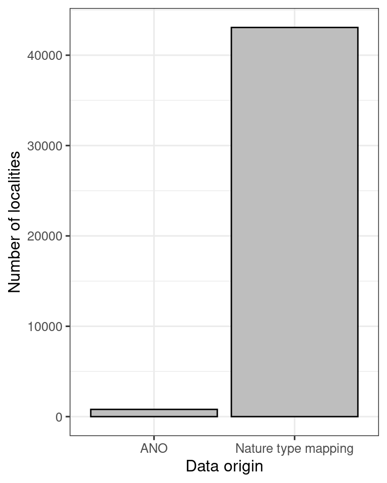
<p class="caption">(\#fig:unnamed-chunk-29)Barplot showing the contribution (number of localities) of different data sets to the alien species indicator.</p>
</div>

So the ANO data is not very important here, but it can become more
important in the future, so good to have them included in the workflow.

#### Outline of Norway and regions

These layers are used to crop out marine areas, and to define
accounting areas, respectively.


```r
outline <- sf::read_sf("data/outlineOfNorway_EPSG25833.shp")
```


```r
regions <- sf::read_sf("data/regions.shp", options = "ENCODING=UTF8")
unique(regions$region)
#> [1] "Nord-Norge" "Midt-Norge" "Østlandet"  "Vestlandet"
#> [5] "Sørlandet"
```

Municipalities


```r
path1 <- ifelse(dir == "C:", 
               "R:/",
               "/data/R/")

path <- paste0(path1, "GeoSpatialData/AdministrativeUnits/Norway_AdministrativeUnits/Original/Norway_Municipalities/Basisdata_0000_Norge_25833_Kommuner_FGDB.gdb")

# find the correct layer
#st_layers(path)
muni <- sf::read_sf(path, options = "ENCODING=UTF8", layer = "kommune")
```


There are some multi-surfaces in here that I will convert to multi-polygons before plotting.


```r
muni <- st_cast(muni, "MULTIPOLYGON")
tm_shape(muni)+
  tm_polygons(col="kommunenummer")+
  tm_layout(legend.outside = T)
```

<div class="figure">
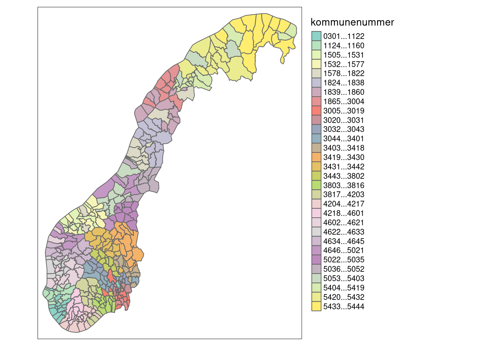
<p class="caption">(\#fig:kommuner)Municipalities in Norway.</p>
</div>

### Scaled indicator values {#scale-alien-ind}

I can scale the indicator for each polygon, or I can chose to aggregate
them first. If the scaled value is representative and precise at the
polygon level, then I could scale at that level. I think they are.

However, the combined surveyed area is a very small fraction of the
total area of Norway, so that only producing indicator values for the
mapped areas leaves the indicator without much value for regional
assessments. But we cannot simply do an area weighting of the polygons
in each region. This is because we expect considerable sampling bias
and we can't assume that the
polygons are representative far outside of the mapped area. But perhaps
we can assume them to be representative inside *homogeneous ecological
areas,* or *Homogeneous Impact Areas* (HIAs). That's where the
infrastructure index comes in. Here's the plan:

1.  normalise the indicators at the polygon level.

2.  take a simplified infrastructure index (vector data) and intersect this with municipality borders to produce a map of homogeneous impact areas (HIAs).

1.  extract the corresponding indicator values that intersect with a
    given HIA, and extrapolate the area weighted mean of those values to
    the entire HIA. Errors are
    calculated from bootstrapping.

3.  Take the new area weighted indicator values for the HIAs, rasterize it, and mask these
    with ecosystem occurrences. The errors are the same as for the HIAs.

4.  calculate an indicator value for a region (accounting area) by doing
    a weighted average based on the relative area of ecosystem
    occurrences. Errors should be carried somehow, perhaps via weighted
    resampling.

#### Scaled variable {#scaled-alien-variable}

I will use the same reference levels/values for all of Norway:


```r
low <- 1
high <- 7
threshold <- 4
```


```r
eaTools::ea_normalise(data = alien_data,
                      vector = "var_7FA",
                      upper_reference_level = high,
                      lower_reference_level = low,
                      break_point = threshold,
                      plot=T,
                      reverse = T
                      )
#> Warning: Removed 6 rows containing missing values
#> (`geom_point()`).
```

<div class="figure">

<p class="caption">(\#fig:alien-normalise)Performing a linear break-point type normalisation of the alien species variable.</p>
</div>

There is no point yet making this a time series, and I will
assign all the indicator values to the average year of the data.


```r
mean(alien_data$kartleggingsår)
#> [1] 2020.12
```

Assigning the indicator to year 2020.


```r
alien_data$i_2020 <- eaTools::ea_normalise(data = alien_data,
                      vector = "var_7FA",
                      upper_reference_level = high,
                      lower_reference_level = low,
                      break_point = threshold,
                      reverse = T
                      )
```

### Homogeneous impact areas {#HIA}

I want to use the [Homogeneous Impact Areas](#HIA) (HIA) to define
smaller regions into which I can extrapolate the indicator values. This
data is generated by discretizing the Norwegian Infrastructure Index. I
refer to the ordinal values of the four HIA classes as their *Human
Impact Factor* (HIF). This is just to keep the approach separate from
the Norwegian Infrastructure Index.


```r
HIA <- readRDS(paste0(pData, "infrastrukturindeks/homogeneous_impact_areas.rds"))
```

I want to check that HIF is in fact a good predictor for *alien species*.

I also want to split these four HIA classes based on municipality. To do
this I need the two layers to have the same CRS.


```r
st_crs(HIA) == st_crs(muni)
#> [1] TRUE
```

Then we get the intersections (unique combinations)


```r
HIA_muni <- eaTools::ea_homogeneous_area(HIA,
                             muni,
                             keep1 = "infrastructureIndex",
                             keep2 = "kommunenummer")
saveRDS(HIA_muni, "P:/41201785_okologisk_tilstand_2022_2023/data/cache/HIA_muni.rds")
```


Create a new column by crossing municipality number and HIF


```r
HIA_muni <- HIA_muni %>%
  mutate(muni_HIF = paste("ID", kommunenummer, infrastructureIndex, sep="_"))
```

Here is a view of the data zooming in on Trondheim


```r
myBB <- st_bbox(c(xmin=260520.12, xmax = 278587.56,
                ymin = 7032142.5, ymax = 7045245.27),
                crs = st_crs(HIA_muni))
```

Cropping the raster to the bbox


```r
HIA_trd <- sf::st_crop(HIA_muni, myBB)
#> Warning: attribute variables are assumed to be spatially
#> constant throughout all geometries
```

Get map of major roads, for context


```r
hw_utm <- readRDS("data/cache/highways_trondheim.rds")
```


```r
(HIA_trd <- tm_shape(HIA_trd)+
  tm_polygons(col = "infrastructureIndex",
    title="Infrastructure index\n(modified 4-step scale)",
    palette = "-viridis",
    style="cat")+
  tm_layout(legend.outside = T)+
  tm_shape(hw_utm)+
  tm_lines(col="red")+
  tm_shape(outline)+
  tm_borders(col = "black", lwd=2))
```

<div class="figure">

<p class="caption">(\#fig:unnamed-chunk-45)A closer look at the HIA designation over Trondheim</p>
</div>

See Fig. \@ref(fig:HIF-region) for a closer look at the distribution of HIA classes across Norway.


#### Validate

I now have 1350 HIAs (for each main ecosystem) that I will, given
there is data, extrapolate indicator values over. But first I want to validate the assumption that the HIF 
explains a considerable portion of the variation in the indicator values.

I will subset the `alien_data` into the three ecosystems.


```r
#make geometries valid 
alien_data <- st_make_valid(alien_data)

#subset
wetlands <- alien_data[alien_data$hovedøkosystem == "våtmark",]
seminat <- alien_data[alien_data$hovedøkosystem == "semi-naturligMark",]
natOpen <- alien_data[alien_data$hovedøkosystem == "naturligÅpneOmråderUnderSkoggrensa",]
```

Creating some summary statistics.


```r
wetland_stats <- ea_spread(indicator_data = wetlands,
          indicator = i_2020,
          regions = HIA_muni,
          groups = muni_HIF,
          summarise = TRUE)

seminat_stats <- ea_spread(indicator_data = seminat,
          indicator = i_2020,
          regions = HIA_muni,
          groups = muni_HIF,
          summarise = TRUE)

natOpen_stats <- ea_spread(indicator_data = natOpen,
          indicator = i_2020,
          regions = HIA_muni,
          groups = muni_HIF,
          summarise = TRUE)

wetland_stats <- wetland_stats %>%
  add_column(eco = "wetland")

seminat_stats <- seminat_stats %>%
  add_column(eco = "semi-natural")

natOpen_stats <- natOpen_stats %>%
  add_column(eco = "Naturally-open")

all_stats <- rbind(wetland_stats,
                   seminat_stats,
                   natOpen_stats)
all_stats <- all_stats %>%
  separate(muni_HIF,
           into = c("tempLink", "municipalityNumber", "HIF"),
           sep = "_")

#saveRDS(all_stats, "/data/P-Prosjekter2/41201785_okologisk_tilstand_2022_2023/data/cache/all_stats_alienSpecies.rds")
saveRDS(all_stats, "P:/41201785_okologisk_tilstand_2022_2023/data/cache/all_stats_alienSpecies.rds")

```


We have data from 277 out of 363 municipalities. This figure shows how many municipalities we have at least one data point for, specific for each human impact factor level: 


```r
all_stats %>%
  group_by(HIF, eco) %>%
  summarise(n = n()) %>%
  ggplot()+
  geom_bar(aes(x = HIF, y = n), stat ="identity")+
  theme_bw()+
  ylab("Number of municipalities")+
  facet_wrap(.~eco)
#> `summarise()` has grouped output by 'HIF'. You can override
#> using the `.groups` argument.
```

<div class="figure">
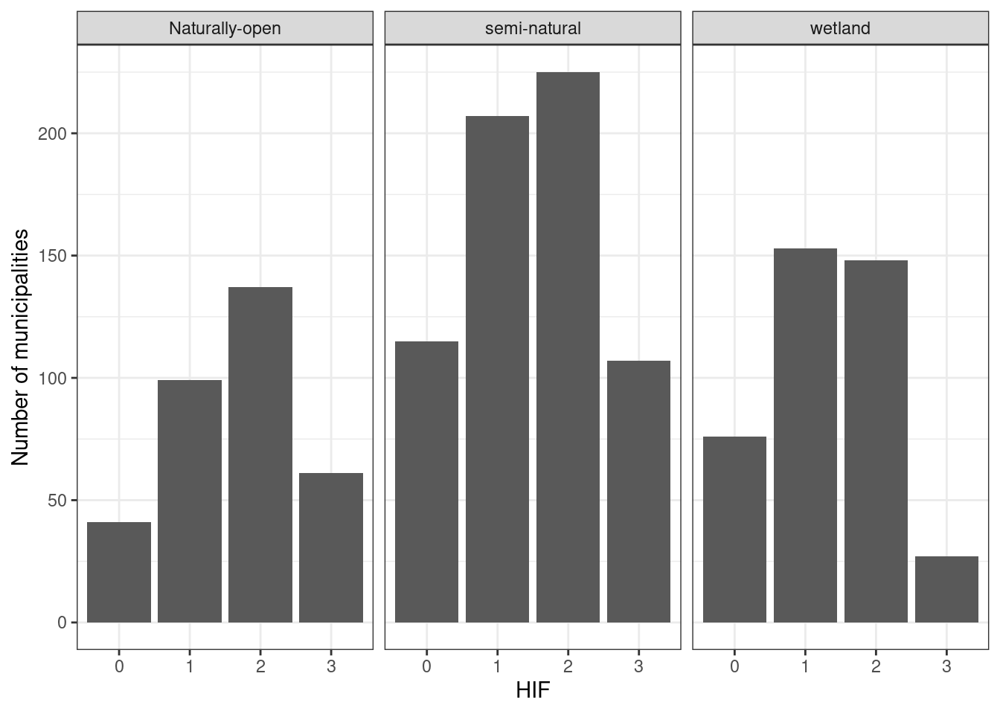
<p class="caption">(\#fig:unnamed-chunk-49)Number of municipalities we have at least one data point for, specific for each human impact factor level.</p>
</div>

If we say that we need 20 data points for each HIA and municipality combination in order to extrapolate to the entire HIA for that municipality, we get much less to work with:


```r
all_stats %>%
  filter(n>20) %>%
  group_by(HIF, eco) %>%
  summarise(n = n()) %>%
  ggplot()+
  geom_bar(aes(x = HIF, y = n), stat ="identity")+
  theme_bw()+
  ylab("Number of municipalities")+
  facet_wrap(.~eco)
#> `summarise()` has grouped output by 'HIF'. You can override
#> using the `.groups` argument.
```

<div class="figure">
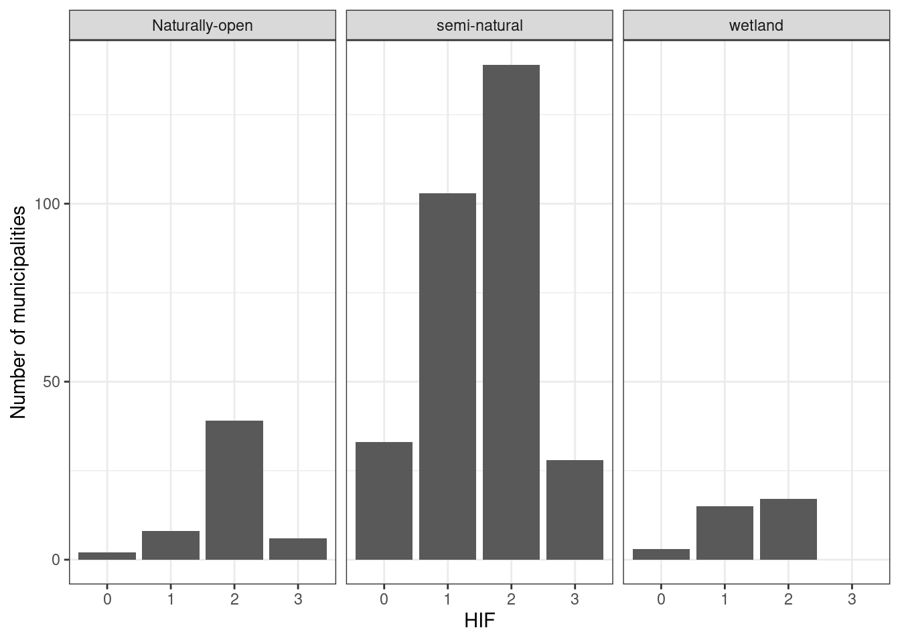
<p class="caption">(\#fig:unnamed-chunk-50)Number of municipalities we have at least 20 data points for, specific for each human impact factor level.</p>
</div>


```r
all_stats %>%
  filter(n > 20) %>%
  ggplot(aes(x = HIF, y = w_mean))+
  geom_point(size=2, position = position_dodge2(.1))+
  geom_violin(alpha=0)+
  theme_bw()+
  labs(x = "Human impact factor",
       y = "Indicator value (area weighted means)")
```

<div class="figure">
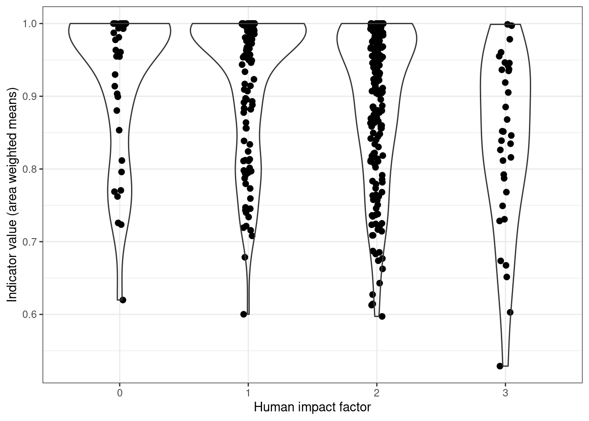
<p class="caption">(\#fig:unnamed-chunk-51)Indicator-pressure relationship across all ecosystems.</p>
</div>

There is a trend here, but not very strong perhaps.

Here is a similar figure, looking at the relative frequency of indicator level of polygons and within each HIA.


```r
corrCheck <- st_intersection(alien_data, HIA)
saveRDS(corrCheck, paste0(pData, "cache/corrCheck_alienSpecies.rds")
```


 


```r
ggplot(corrCheck, aes(x = factor(infrastructureIndex), fill = factor(round(i_2020,2))))+
  geom_bar(position="fill")+
  theme_bw(base_size = 12)+
  guides(fill = guide_legend("Alien species indicator"))+
  ylab("Fraction of data points")+
  xlab("HIF")+
  scale_fill_brewer(palette = "RdYlGn")+
  facet_wrap(.~hovedøkosystem)
```

<div class="figure">
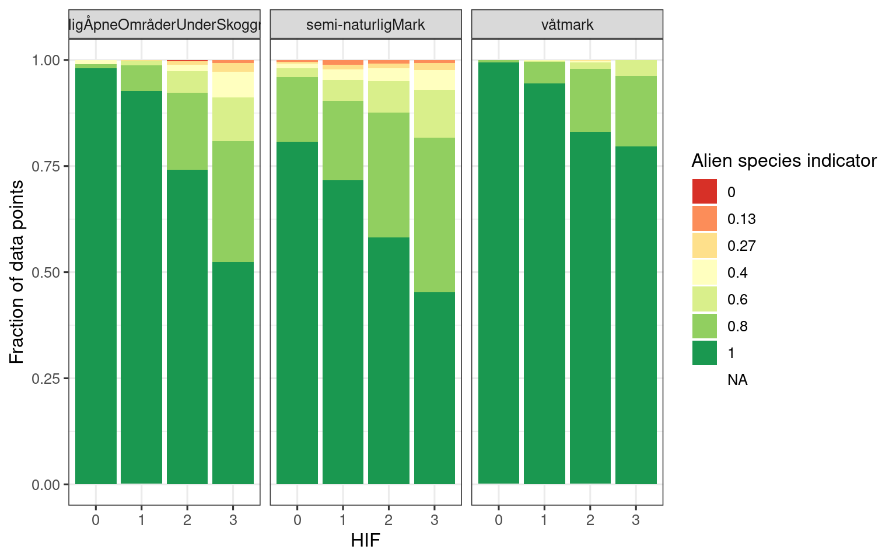
<p class="caption">(\#fig:alien-precentageplot)Relative frequency plot showing the distribution of polygons with different indicator values.</p>
</div>

The figure above I think supports the indicator-pressure relationship
and justifies using the HIA x municipality intersections as local reference
areas.

Let us look at the effect of sample size on the indicator uncertainty.


```r
all_stats %>%
  filter(n > 5) %>%
  ggplot(aes(x = n, y = sd))+
  geom_point(size=2, position = position_dodge2(.1))+
  theme_bw()+
    facet_wrap(.~eco, scales="free")
```

<div class="figure">

<p class="caption">(\#fig:unnamed-chunk-54)Sample size against indicator uncertainty.</p>
</div>

This shows that the uncertainty is really inflated with sample sizes less than about 50-100.


```r
DT::datatable(all_stats) %>%
  formatRound(columns=3:8, digits=2)
```

<div class="figure">

```{=html}
<div class="datatables html-widget html-fill-item-overflow-hidden html-fill-item" id="htmlwidget-92894de38e3dba9b6449" style="width:100%;height:auto;"></div>
<script type="application/json" data-for="htmlwidget-92894de38e3dba9b6449">{"x":{"filter":"none","vertical":false,"data":[["1","2","3","4","5","6","7","8","9","10","11","12","13","14","15","16","17","18","19","20","21","22","23","24","25","26","27","28","29","30","31","32","33","34","35","36","37","38","39","40","41","42","43","44","45","46","47","48","49","50","51","52","53","54","55","56","57","58","59","60","61","62","63","64","65","66","67","68","69","70","71","72","73","74","75","76","77","78","79","80","81","82","83","84","85","86","87","88","89","90","91","92","93","94","95","96","97","98","99","100","101","102","103","104","105","106","107","108","109","110","111","112","113","114","115","116","117","118","119","120","121","122","123","124","125","126","127","128","129","130","131","132","133","134","135","136","137","138","139","140","141","142","143","144","145","146","147","148","149","150","151","152","153","154","155","156","157","158","159","160","161","162","163","164","165","166","167","168","169","170","171","172","173","174","175","176","177","178","179","180","181","182","183","184","185","186","187","188","189","190","191","192","193","194","195","196","197","198","199","200","201","202","203","204","205","206","207","208","209","210","211","212","213","214","215","216","217","218","219","220","221","222","223","224","225","226","227","228","229","230","231","232","233","234","235","236","237","238","239","240","241","242","243","244","245","246","247","248","249","250","251","252","253","254","255","256","257","258","259","260","261","262","263","264","265","266","267","268","269","270","271","272","273","274","275","276","277","278","279","280","281","282","283","284","285","286","287","288","289","290","291","292","293","294","295","296","297","298","299","300","301","302","303","304","305","306","307","308","309","310","311","312","313","314","315","316","317","318","319","320","321","322","323","324","325","326","327","328","329","330","331","332","333","334","335","336","337","338","339","340","341","342","343","344","345","346","347","348","349","350","351","352","353","354","355","356","357","358","359","360","361","362","363","364","365","366","367","368","369","370","371","372","373","374","375","376","377","378","379","380","381","382","383","384","385","386","387","388","389","390","391","392","393","394","395","396","397","398","399","400","401","402","403","404","405","406","407","408","409","410","411","412","413","414","415","416","417","418","419","420","421","422","423","424","425","426","427","428","429","430","431","432","433","434","435","436","437","438","439","440","441","442","443","444","445","446","447","448","449","450","451","452","453","454","455","456","457","458","459","460","461","462","463","464","465","466","467","468","469","470","471","472","473","474","475","476","477","478","479","480","481","482","483","484","485","486","487","488","489","490","491","492","493","494","495","496","497","498","499","500","501","502","503","504","505","506","507","508","509","510","511","512","513","514","515","516","517","518","519","520","521","522","523","524","525","526","527","528","529","530","531","532","533","534","535","536","537","538","539","540","541","542","543","544","545","546","547","548","549","550","551","552","553","554","555","556","557","558","559","560","561","562","563","564","565","566","567","568","569","570","571","572","573","574","575","576","577","578","579","580","581","582","583","584","585","586","587","588","589","590","591","592","593","594","595","596","597","598","599","600","601","602","603","604","605","606","607","608","609","610","611","612","613","614","615","616","617","618","619","620","621","622","623","624","625","626","627","628","629","630","631","632","633","634","635","636","637","638","639","640","641","642","643","644","645","646","647","648","649","650","651","652","653","654","655","656","657","658","659","660","661","662","663","664","665","666","667","668","669","670","671","672","673","674","675","676","677","678","679","680","681","682","683","684","685","686","687","688","689","690","691","692","693","694","695","696","697","698","699","700","701","702","703","704","705","706","707","708","709","710","711","712","713","714","715","716","717","718","719","720","721","722","723","724","725","726","727","728","729","730","731","732","733","734","735","736","737","738","739","740","741","742","743","744","745","746","747","748","749","750","751","752","753","754","755","756","757","758","759","760","761","762","763","764","765","766","767","768","769","770","771","772","773","774","775","776","777","778","779","780","781","782","783","784","785","786","787","788","789","790","791","792","793","794","795","796","797","798","799","800","801","802","803","804","805","806","807","808","809","810","811","812","813","814","815","816","817","818","819","820","821","822","823","824","825","826","827","828","829","830","831","832","833","834","835","836","837","838","839","840","841","842","843","844","845","846","847","848","849","850","851","852","853","854","855","856","857","858","859","860","861","862","863","864","865","866","867","868","869","870","871","872","873","874","875","876","877","878","879","880","881","882","883","884","885","886","887","888","889","890","891","892","893","894","895","896","897","898","899","900","901","902","903","904","905","906","907","908","909","910","911","912","913","914","915","916","917","918","919","920","921","922","923","924","925","926","927","928","929","930","931","932","933","934","935","936","937","938","939","940","941","942","943","944","945","946","947","948","949","950","951","952","953","954","955","956","957","958","959","960","961","962","963","964","965","966","967","968","969","970","971","972","973","974","975","976","977","978","979","980","981","982","983","984","985","986","987","988","989","990","991","992","993","994","995","996","997","998","999","1000","1001","1002","1003","1004","1005","1006","1007","1008","1009","1010","1011","1012","1013","1014","1015","1016","1017","1018","1019","1020","1021","1022","1023","1024","1025","1026","1027","1028","1029","1030","1031","1032","1033","1034","1035","1036","1037","1038","1039","1040","1041","1042","1043","1044","1045","1046","1047","1048","1049","1050","1051","1052","1053","1054","1055","1056","1057","1058","1059","1060","1061","1062","1063","1064","1065","1066","1067","1068","1069","1070","1071","1072","1073","1074","1075","1076","1077","1078","1079","1080","1081","1082","1083","1084","1085","1086","1087","1088","1089","1090","1091","1092","1093","1094","1095","1096","1097","1098","1099","1100","1101","1102","1103","1104","1105","1106","1107","1108","1109","1110","1111","1112","1113","1114","1115","1116","1117","1118","1119","1120","1121","1122","1123","1124","1125","1126","1127","1128","1129","1130","1131","1132","1133","1134","1135","1136","1137","1138","1139","1140","1141","1142","1143","1144","1145","1146","1147","1148","1149","1150","1151","1152","1153","1154","1155","1156","1157","1158","1159","1160","1161","1162","1163","1164","1165","1166","1167","1168","1169","1170","1171","1172","1173","1174","1175","1176","1177","1178","1179","1180","1181","1182","1183","1184","1185","1186","1187","1188","1189","1190","1191","1192","1193","1194","1195","1196","1197","1198","1199","1200","1201","1202","1203","1204","1205","1206","1207","1208","1209","1210","1211","1212","1213","1214","1215","1216","1217","1218","1219","1220","1221","1222","1223","1224","1225","1226","1227","1228","1229","1230","1231","1232","1233","1234","1235","1236","1237","1238","1239","1240","1241","1242","1243","1244","1245","1246","1247","1248","1249","1250","1251","1252","1253","1254","1255","1256","1257","1258","1259","1260","1261","1262","1263","1264","1265","1266","1267","1268","1269","1270","1271","1272","1273","1274","1275","1276","1277","1278","1279","1280","1281","1282","1283","1284","1285","1286","1287","1288","1289","1290","1291","1292","1293","1294","1295","1296","1297","1298","1299","1300","1301","1302","1303","1304","1305","1306","1307","1308","1309","1310","1311","1312","1313","1314","1315","1316","1317","1318","1319","1320","1321","1322","1323","1324","1325","1326","1327","1328","1329","1330","1331","1332","1333","1334","1335","1336","1337","1338","1339","1340","1341","1342","1343","1344","1345","1346","1347","1348","1349","1350","1351","1352","1353","1354","1355","1356","1357","1358","1359","1360","1361","1362","1363","1364","1365","1366","1367","1368","1369","1370","1371","1372","1373","1374","1375","1376","1377","1378","1379","1380","1381","1382","1383","1384","1385","1386","1387","1388","1389","1390","1391","1392","1393","1394","1395","1396"],["ID","ID","ID","ID","ID","ID","ID","ID","ID","ID","ID","ID","ID","ID","ID","ID","ID","ID","ID","ID","ID","ID","ID","ID","ID","ID","ID","ID","ID","ID","ID","ID","ID","ID","ID","ID","ID","ID","ID","ID","ID","ID","ID","ID","ID","ID","ID","ID","ID","ID","ID","ID","ID","ID","ID","ID","ID","ID","ID","ID","ID","ID","ID","ID","ID","ID","ID","ID","ID","ID","ID","ID","ID","ID","ID","ID","ID","ID","ID","ID","ID","ID","ID","ID","ID","ID","ID","ID","ID","ID","ID","ID","ID","ID","ID","ID","ID","ID","ID","ID","ID","ID","ID","ID","ID","ID","ID","ID","ID","ID","ID","ID","ID","ID","ID","ID","ID","ID","ID","ID","ID","ID","ID","ID","ID","ID","ID","ID","ID","ID","ID","ID","ID","ID","ID","ID","ID","ID","ID","ID","ID","ID","ID","ID","ID","ID","ID","ID","ID","ID","ID","ID","ID","ID","ID","ID","ID","ID","ID","ID","ID","ID","ID","ID","ID","ID","ID","ID","ID","ID","ID","ID","ID","ID","ID","ID","ID","ID","ID","ID","ID","ID","ID","ID","ID","ID","ID","ID","ID","ID","ID","ID","ID","ID","ID","ID","ID","ID","ID","ID","ID","ID","ID","ID","ID","ID","ID","ID","ID","ID","ID","ID","ID","ID","ID","ID","ID","ID","ID","ID","ID","ID","ID","ID","ID","ID","ID","ID","ID","ID","ID","ID","ID","ID","ID","ID","ID","ID","ID","ID","ID","ID","ID","ID","ID","ID","ID","ID","ID","ID","ID","ID","ID","ID","ID","ID","ID","ID","ID","ID","ID","ID","ID","ID","ID","ID","ID","ID","ID","ID","ID","ID","ID","ID","ID","ID","ID","ID","ID","ID","ID","ID","ID","ID","ID","ID","ID","ID","ID","ID","ID","ID","ID","ID","ID","ID","ID","ID","ID","ID","ID","ID","ID","ID","ID","ID","ID","ID","ID","ID","ID","ID","ID","ID","ID","ID","ID","ID","ID","ID","ID","ID","ID","ID","ID","ID","ID","ID","ID","ID","ID","ID","ID","ID","ID","ID","ID","ID","ID","ID","ID","ID","ID","ID","ID","ID","ID","ID","ID","ID","ID","ID","ID","ID","ID","ID","ID","ID","ID","ID","ID","ID","ID","ID","ID","ID","ID","ID","ID","ID","ID","ID","ID","ID","ID","ID","ID","ID","ID","ID","ID","ID","ID","ID","ID","ID","ID","ID","ID","ID","ID","ID","ID","ID","ID","ID","ID","ID","ID","ID","ID","ID","ID","ID","ID","ID","ID","ID","ID","ID","ID","ID","ID","ID","ID","ID","ID","ID","ID","ID","ID","ID","ID","ID","ID","ID","ID","ID","ID","ID","ID","ID","ID","ID","ID","ID","ID","ID","ID","ID","ID","ID","ID","ID","ID","ID","ID","ID","ID","ID","ID","ID","ID","ID","ID","ID","ID","ID","ID","ID","ID","ID","ID","ID","ID","ID","ID","ID","ID","ID","ID","ID","ID","ID","ID","ID","ID","ID","ID","ID","ID","ID","ID","ID","ID","ID","ID","ID","ID","ID","ID","ID","ID","ID","ID","ID","ID","ID","ID","ID","ID","ID","ID","ID","ID","ID","ID","ID","ID","ID","ID","ID","ID","ID","ID","ID","ID","ID","ID","ID","ID","ID","ID","ID","ID","ID","ID","ID","ID","ID","ID","ID","ID","ID","ID","ID","ID","ID","ID","ID","ID","ID","ID","ID","ID","ID","ID","ID","ID","ID","ID","ID","ID","ID","ID","ID","ID","ID","ID","ID","ID","ID","ID","ID","ID","ID","ID","ID","ID","ID","ID","ID","ID","ID","ID","ID","ID","ID","ID","ID","ID","ID","ID","ID","ID","ID","ID","ID","ID","ID","ID","ID","ID","ID","ID","ID","ID","ID","ID","ID","ID","ID","ID","ID","ID","ID","ID","ID","ID","ID","ID","ID","ID","ID","ID","ID","ID","ID","ID","ID","ID","ID","ID","ID","ID","ID","ID","ID","ID","ID","ID","ID","ID","ID","ID","ID","ID","ID","ID","ID","ID","ID","ID","ID","ID","ID","ID","ID","ID","ID","ID","ID","ID","ID","ID","ID","ID","ID","ID","ID","ID","ID","ID","ID","ID","ID","ID","ID","ID","ID","ID","ID","ID","ID","ID","ID","ID","ID","ID","ID","ID","ID","ID","ID","ID","ID","ID","ID","ID","ID","ID","ID","ID","ID","ID","ID","ID","ID","ID","ID","ID","ID","ID","ID","ID","ID","ID","ID","ID","ID","ID","ID","ID","ID","ID","ID","ID","ID","ID","ID","ID","ID","ID","ID","ID","ID","ID","ID","ID","ID","ID","ID","ID","ID","ID","ID","ID","ID","ID","ID","ID","ID","ID","ID","ID","ID","ID","ID","ID","ID","ID","ID","ID","ID","ID","ID","ID","ID","ID","ID","ID","ID","ID","ID","ID","ID","ID","ID","ID","ID","ID","ID","ID","ID","ID","ID","ID","ID","ID","ID","ID","ID","ID","ID","ID","ID","ID","ID","ID","ID","ID","ID","ID","ID","ID","ID","ID","ID","ID","ID","ID","ID","ID","ID","ID","ID","ID","ID","ID","ID","ID","ID","ID","ID","ID","ID","ID","ID","ID","ID","ID","ID","ID","ID","ID","ID","ID","ID","ID","ID","ID","ID","ID","ID","ID","ID","ID","ID","ID","ID","ID","ID","ID","ID","ID","ID","ID","ID","ID","ID","ID","ID","ID","ID","ID","ID","ID","ID","ID","ID","ID","ID","ID","ID","ID","ID","ID","ID","ID","ID","ID","ID","ID","ID","ID","ID","ID","ID","ID","ID","ID","ID","ID","ID","ID","ID","ID","ID","ID","ID","ID","ID","ID","ID","ID","ID","ID","ID","ID","ID","ID","ID","ID","ID","ID","ID","ID","ID","ID","ID","ID","ID","ID","ID","ID","ID","ID","ID","ID","ID","ID","ID","ID","ID","ID","ID","ID","ID","ID","ID","ID","ID","ID","ID","ID","ID","ID","ID","ID","ID","ID","ID","ID","ID","ID","ID","ID","ID","ID","ID","ID","ID","ID","ID","ID","ID","ID","ID","ID","ID","ID","ID","ID","ID","ID","ID","ID","ID","ID","ID","ID","ID","ID","ID","ID","ID","ID","ID","ID","ID","ID","ID","ID","ID","ID","ID","ID","ID","ID","ID","ID","ID","ID","ID","ID","ID","ID","ID","ID","ID","ID","ID","ID","ID","ID","ID","ID","ID","ID","ID","ID","ID","ID","ID","ID","ID","ID","ID","ID","ID","ID","ID","ID","ID","ID","ID","ID","ID","ID","ID","ID","ID","ID","ID","ID","ID","ID","ID","ID","ID","ID","ID","ID","ID","ID","ID","ID","ID","ID","ID","ID","ID","ID","ID","ID","ID","ID","ID","ID","ID","ID","ID","ID","ID","ID","ID","ID","ID","ID","ID","ID","ID","ID","ID","ID","ID","ID","ID","ID","ID","ID","ID","ID","ID","ID","ID","ID","ID","ID","ID","ID","ID","ID","ID","ID","ID","ID","ID","ID","ID","ID","ID","ID","ID","ID","ID","ID","ID","ID","ID","ID","ID","ID","ID","ID","ID","ID","ID","ID","ID","ID","ID","ID","ID","ID","ID","ID","ID","ID","ID","ID","ID","ID","ID","ID","ID","ID","ID","ID","ID","ID","ID","ID","ID","ID","ID","ID","ID","ID","ID","ID","ID","ID","ID","ID","ID","ID","ID","ID","ID","ID","ID","ID","ID","ID","ID","ID","ID","ID","ID","ID","ID","ID","ID","ID","ID","ID","ID","ID","ID","ID","ID","ID","ID","ID","ID","ID","ID","ID","ID","ID","ID","ID","ID","ID","ID","ID","ID","ID","ID","ID","ID","ID","ID","ID","ID","ID","ID","ID","ID","ID","ID","ID","ID","ID","ID","ID","ID","ID","ID","ID","ID","ID","ID","ID","ID","ID","ID","ID","ID","ID","ID","ID","ID","ID","ID","ID","ID","ID","ID","ID","ID","ID","ID","ID","ID","ID","ID","ID","ID","ID","ID","ID","ID","ID","ID","ID","ID","ID","ID","ID","ID","ID","ID","ID","ID","ID","ID","ID","ID","ID","ID","ID","ID","ID","ID","ID","ID","ID","ID","ID","ID","ID","ID","ID","ID","ID","ID","ID","ID","ID","ID","ID","ID","ID","ID","ID","ID","ID","ID","ID","ID","ID","ID","ID","ID","ID","ID","ID","ID","ID","ID","ID","ID","ID","ID","ID","ID","ID","ID","ID","ID","ID","ID","ID","ID","ID","ID","ID","ID","ID","ID","ID","ID","ID","ID","ID","ID","ID","ID","ID","ID","ID","ID","ID","ID","ID","ID","ID","ID","ID","ID","ID","ID","ID","ID","ID","ID","ID","ID","ID","ID","ID","ID","ID","ID","ID","ID","ID","ID","ID","ID","ID","ID","ID","ID","ID","ID","ID","ID","ID","ID","ID","ID","ID","ID","ID","ID","ID","ID","ID","ID","ID","ID","ID","ID"],["0301","0301","1101","1101","1103","1103","1106","1108","1108","1111","1112","1114","1114","1119","1119","1119","1120","1121","1121","1121","1122","1122","1124","1130","1130","1133","1133","1146","1146","1149","1149","1149","1151","1160","1505","1506","1506","1507","1507","1511","1511","1511","1515","1525","1525","1531","1532","1532","1563","1566","1573","1573","1577","1579","1579","1804","1804","1804","1811","1816","1818","1818","1818","1820","1820","1824","1824","1827","1827","1827","1828","1833","1833","1833","1834","1836","1838","1838","1838","1840","1840","1841","1841","1841","1848","1848","1853","1860","1860","1865","1865","1867","1870","1875","1875","1875","3001","3001","3002","3002","3003","3004","3004","3005","3005","3005","3011","3011","3012","3013","3013","3014","3014","3015","3017","3017","3018","3018","3019","3020","3020","3021","3021","3024","3025","3025","3025","3028","3028","3030","3030","3030","3034","3036","3038","3038","3040","3040","3041","3041","3041","3042","3042","3043","3043","3043","3044","3044","3044","3047","3048","3049","3049","3049","3052","3053","3053","3053","3054","3054","3401","3407","3411","3411","3411","3412","3412","3413","3413","3415","3415","3420","3420","3421","3421","3422","3423","3424","3424","3425","3427","3430","3432","3432","3435","3438","3438","3440","3440","3441","3442","3443","3443","3446","3446","3446","3448","3448","3449","3450","3450","3451","3451","3452","3452","3452","3453","3453","3454","3801","3803","3804","3805","3805","3806","3807","3807","3807","3811","3811","3813","3813","3814","3815","3815","3817","3820","3820","3820","3822","3822","3823","3823","3825","3825","4201","4202","4202","4203","4203","4204","4204","4204","4205","4206","4206","4207","4207","4213","4213","4214","4215","4216","4216","4222","4225","4225","4225","4601","4601","4612","4612","4613","4613","4613","4614","4614","4616","4616","4621","4621","4622","4622","4622","4624","4626","4626","4627","4627","4635","4640","4640","4642","4642","4644","4644","4645","4645","4647","4647","4647","4648","4649","4649","4649","5001","5001","5001","5006","5006","5006","5006","5014","5014","5021","5021","5021","5022","5022","5025","5025","5027","5027","5027","5031","5031","5032","5032","5032","5034","5035","5036","5036","5037","5037","5038","5038","5041","5041","5042","5042","5042","5045","5045","5052","5053","5053","5054","5054","5055","5055","5056","5056","5056","5058","5058","5059","5059","5059","5060","5060","5061","5061","5401","5401","5401","5401","5402","5402","5403","5403","5403","5404","5406","5406","5411","5411","5411","5412","5412","5412","5412","5416","5416","5416","5418","5418","5418","5419","5419","5421","5421","5421","5422","5422","5422","5425","5425","5426","5428","5429","5430","5432","5432","5432","5434","5435","5436","5436","5436","5437","5438","5441","5444","0301","0301","1101","1101","1101","1101","1103","1103","1103","1103","1106","1106","1106","1106","1108","1108","1108","1108","1111","1111","1111","1112","1112","1112","1114","1114","1114","1119","1119","1120","1120","1121","1121","1121","1122","1122","1122","1124","1124","1130","1130","1130","1130","1133","1133","1133","1134","1134","1134","1145","1145","1145","1146","1146","1146","1149","1149","1149","1149","1151","1151","1151","1160","1160","1160","1160","1505","1505","1505","1506","1506","1507","1507","1507","1511","1511","1511","1515","1515","1515","1515","1525","1525","1525","1528","1528","1531","1531","1531","1531","1532","1532","1532","1532","1539","1539","1554","1563","1563","1563","1566","1566","1566","1573","1573","1573","1576","1576","1577","1577","1579","1579","1579","1579","1804","1804","1804","1816","1816","1818","1818","1818","1818","1820","1820","1820","1827","1827","1827","1833","1833","1833","1834","1836","1836","1838","1838","1838","1840","1841","1848","1848","1848","1856","1859","1860","1860","1860","1860","1865","1865","1865","1867","1870","1870","1870","1874","1874","1875","1875","1875","3001","3002","3002","3002","3003","3003","3003","3004","3004","3004","3004","3005","3005","3005","3006","3006","3007","3007","3007","3011","3011","3011","3012","3013","3013","3014","3014","3014","3015","3015","3016","3016","3017","3017","3017","3018","3018","3019","3019","3019","3020","3020","3020","3021","3021","3021","3022","3022","3023","3023","3023","3024","3024","3024","3025","3025","3028","3028","3030","3030","3030","3031","3031","3032","3033","3033","3033","3034","3036","3036","3037","3038","3038","3039","3039","3040","3040","3040","3041","3041","3041","3042","3042","3042","3043","3043","3043","3044","3044","3044","3044","3045","3045","3045","3045","3046","3046","3046","3047","3047","3047","3048","3048","3049","3049","3049","3051","3051","3052","3052","3052","3053","3053","3054","3054","3054","3401","3401","3401","3403","3403","3403","3405","3405","3407","3411","3411","3411","3412","3412","3412","3412","3413","3413","3413","3418","3420","3420","3420","3421","3424","3426","3427","3427","3428","3430","3432","3432","3435","3435","3436","3436","3438","3438","3439","3439","3439","3440","3440","3442","3442","3442","3443","3443","3443","3443","3446","3446","3446","3448","3448","3449","3450","3450","3450","3451","3451","3451","3451","3452","3452","3452","3452","3453","3453","3453","3453","3454","3801","3801","3802","3802","3802","3803","3803","3803","3804","3804","3805","3805","3805","3805","3806","3807","3807","3808","3811","3811","3813","3813","3813","3814","3814","3815","3815","3815","3817","3818","3818","3818","3819","3819","3819","3820","3820","3820","3822","3822","3825","3825","3825","4201","4201","4201","4202","4202","4202","4203","4203","4203","4204","4204","4204","4204","4205","4205","4205","4205","4206","4206","4206","4207","4207","4207","4212","4213","4213","4213","4214","4215","4215","4215","4216","4219","4220","4221","4222","4222","4222","4223","4225","4225","4225","4227","4227","4228","4601","4601","4601","4611","4611","4612","4612","4612","4613","4613","4613","4613","4614","4614","4614","4615","4616","4616","4616","4616","4617","4621","4621","4621","4621","4622","4622","4622","4622","4623","4623","4624","4624","4626","4626","4626","4626","4627","4627","4627","4628","4630","4630","4631","4635","4635","4635","4640","4640","4640","4641","4642","4642","4642","4644","4644","4644","4645","4647","4647","4647","4649","4649","4649","4650","5001","5001","5001","5006","5006","5006","5006","5007","5007","5014","5014","5014","5014","5020","5020","5021","5021","5021","5021","5022","5022","5022","5025","5025","5025","5026","5026","5026","5027","5027","5027","5028","5028","5028","5029","5031","5031","5031","5031","5032","5032","5032","5035","5035","5036","5036","5036","5037","5037","5037","5037","5038","5038","5038","5038","5042","5042","5043","5044","5045","5045","5047","5052","5052","5052","5053","5053","5053","5054","5054","5054","5054","5055","5055","5055","5056","5056","5056","5057","5057","5057","5057","5058","5058","5058","5058","5059","5059","5059","5059","5060","5060","5060","5061","5061","5061","5401","5401","5401","5401","5402","5402","5402","5402","5403","5403","5403","5406","5406","5411","5411","5411","5411","5412","5412","5412","5412","5418","5418","5418","5419","5419","5421","5421","5421","5422","5422","5422","5423","5423","5423","5425","5425","5426","5426","5426","5430","5432","5432","5432","5433","5434","5436","5436","5437","5437","5437","5440","5440","5441","5443","5443","0301","1101","1101","1101","1103","1103","1108","1108","1112","1120","1121","1121","1122","1122","1124","1130","1133","1146","1149","1149","1160","1506","1507","1507","1511","1532","1532","1532","1554","1563","1563","1573","1573","1577","1579","1579","1579","1804","1804","1816","1818","1818","1818","1818","1820","1820","1820","1824","1824","1827","1827","1827","1833","1833","1834","1838","1838","1838","1845","1848","1848","1848","1859","1860","1860","1860","1865","1865","1867","1870","1870","1874","1875","1875","1875","3001","3002","3002","3003","3003","3003","3004","3004","3004","3004","3005","3005","3005","3007","3007","3011","3011","3011","3013","3014","3014","3015","3015","3016","3016","3017","3017","3018","3019","3019","3019","3021","3021","3022","3022","3023","3024","3024","3024","3025","3025","3028","3028","3030","3030","3030","3034","3034","3036","3036","3038","3038","3040","3041","3041","3042","3042","3044","3044","3044","3048","3048","3049","3049","3053","3054","3401","3407","3407","3411","3411","3413","3413","3413","3414","3415","3415","3427","3427","3428","3432","3432","3436","3436","3436","3438","3438","3439","3439","3439","3440","3440","3442","3442","3442","3443","3443","3446","3446","3446","3447","3447","3451","3451","3451","3451","3452","3801","3801","3802","3803","3803","3804","3804","3805","3805","3805","3806","3806","3807","3811","3811","3813","3813","3814","3815","3815","3820","3820","3823","3825","3825","4202","4202","4203","4203","4203","4204","4204","4205","4205","4205","4206","4206","4207","4213","4215","4215","4219","4225","4225","4227","4612","4612","4613","4613","4613","4613","4614","4614","4616","4621","4621","4624","4624","4626","4627","4627","4640","4644","4645","4645","4647","4647","5001","5006","5006","5007","5007","5007","5014","5014","5014","5021","5021","5022","5022","5025","5025","5025","5027","5027","5028","5028","5028","5031","5031","5032","5035","5036","5036","5036","5037","5037","5037","5038","5038","5042","5047","5053","5053","5053","5054","5054","5055","5055","5056","5056","5057","5057","5057","5058","5058","5060","5060","5401","5401","5401","5402","5403","5403","5403","5403","5406","5406","5406","5412","5412","5418","5418","5418","5419","5421","5422","5425","5425","5425","5426","5426","5426","5428","5430","5432","5432","5432","5436","5436","5436","5437","5437","5437","5441","5443"],["2","3","1","2","1","2","2","1","2","1","0","0","1","0","1","2","2","0","1","2","1","2","2","1","2","1","2","1","2","1","2","3","1","2","1","1","2","1","2","0","1","2","1","1","2","1","2","3","0","1","1","2","2","1","2","0","1","2","0","2","0","1","2","1","2","0","1","0","1","2","0","0","1","2","1","2","0","1","2","0","1","0","1","2","1","2","2","1","2","1","2","0","0","0","1","2","0","1","1","2","2","2","3","1","2","3","2","3","1","1","2","1","2","2","1","2","1","2","2","1","2","2","3","1","1","2","3","1","2","1","2","3","1","1","2","3","1","2","0","1","2","1","2","0","1","2","1","2","3","2","1","1","2","3","1","1","2","3","1","2","1","2","1","2","3","1","2","1","2","0","1","1","2","0","1","1","1","0","1","1","0","0","1","2","0","0","1","0","1","1","2","1","2","1","2","3","1","2","1","1","2","1","2","1","2","3","1","2","0","2","2","2","1","2","2","1","2","3","2","3","1","2","2","0","1","2","0","1","2","0","1","0","1","0","1","2","0","1","1","2","1","2","3","2","1","2","1","2","1","2","1","2","0","1","2","1","2","3","2","3","1","2","1","2","3","1","2","1","2","0","2","0","1","2","2","1","2","2","3","2","1","2","1","2","0","1","0","1","0","1","2","0","0","1","2","1","2","3","0","1","2","3","1","2","0","1","2","1","2","1","2","0","1","2","0","1","0","1","2","0","2","1","2","1","2","0","2","0","1","0","1","2","1","2","1","1","2","1","2","0","1","0","1","2","0","1","0","1","2","1","2","1","2","0","1","2","3","1","2","0","1","2","1","0","2","0","1","2","0","1","2","3","0","1","2","0","1","2","1","2","0","1","2","0","1","2","1","2","2","0","0","0","0","1","2","1","0","0","1","2","1","0","0","0","2","3","0","1","2","3","0","1","2","3","0","1","2","3","0","1","2","3","0","1","2","0","1","2","0","1","2","1","2","2","3","0","1","2","0","1","2","2","3","0","1","2","3","0","1","2","0","1","2","0","1","2","0","1","2","0","1","2","3","0","1","2","0","1","2","3","1","2","3","1","2","1","2","3","0","1","2","0","1","2","3","0","1","2","1","2","0","1","2","3","0","1","2","3","1","2","2","0","1","2","0","1","2","0","1","2","0","1","1","2","0","1","2","3","0","1","2","1","2","0","1","2","3","1","2","3","0","1","2","1","2","3","1","0","2","0","1","2","2","2","0","1","2","1","0","0","1","2","3","0","1","2","0","1","2","3","0","1","0","1","2","2","1","2","3","1","2","3","0","1","2","3","1","2","3","1","2","1","2","3","1","2","3","1","1","2","1","2","3","1","2","1","2","1","2","3","1","2","1","2","3","1","2","3","1","2","3","2","3","1","2","3","1","2","3","2","3","1","2","1","2","3","2","3","2","1","2","3","2","1","2","2","2","3","1","2","0","1","2","0","1","2","0","1","2","0","1","2","0","1","2","3","0","1","2","3","0","1","2","1","2","3","1","2","1","2","3","1","2","0","1","2","1","2","1","2","3","1","2","3","0","1","2","1","2","2","1","2","3","0","1","2","3","1","2","3","2","0","1","2","1","2","3","0","2","1","2","1","2","0","1","2","3","2","3","1","2","3","2","3","1","2","3","0","1","2","3","1","2","3","1","2","1","0","1","2","0","1","2","3","0","1","2","3","0","1","2","3","0","2","3","1","2","3","1","2","3","2","3","0","1","2","3","2","1","2","0","2","3","0","1","3","1","2","0","1","2","2","0","1","2","0","1","2","0","1","2","0","1","0","1","2","0","1","2","1","2","3","1","2","3","0","1","2","3","0","1","2","3","1","2","3","0","1","2","1","0","1","2","1","1","2","3","1","2","1","2","0","1","2","3","1","2","3","1","2","2","1","2","3","0","1","0","1","2","0","1","2","3","1","2","3","2","0","1","2","3","2","0","1","2","3","0","1","2","3","1","2","2","3","0","1","2","3","1","2","3","2","1","2","2","0","1","2","1","2","3","2","0","1","2","1","2","3","1","0","1","2","0","1","2","1","1","2","3","0","1","2","3","1","2","0","1","2","3","1","2","0","1","2","3","0","1","2","1","2","3","1","2","3","0","1","2","1","2","3","2","0","1","2","3","1","2","3","1","2","1","2","3","0","1","2","3","0","1","2","3","1","2","1","1","1","2","2","0","1","2","1","2","3","0","1","2","3","0","1","2","0","1","2","0","1","2","3","0","1","2","3","0","1","2","3","0","1","2","0","1","2","0","1","2","3","0","1","2","3","0","1","2","1","2","0","1","2","3","0","1","2","3","0","1","2","1","2","0","1","2","0","1","2","0","1","2","1","2","0","1","2","0","0","1","2","1","1","1","2","0","1","2","1","2","2","1","2","2","1","2","3","2","3","1","2","0","2","0","2","1","2","2","1","1","2","2","3","0","2","1","2","0","1","2","3","2","1","2","1","2","1","1","2","3","1","2","1","0","1","2","3","1","2","3","0","1","0","1","2","1","2","1","0","1","2","1","0","1","2","0","1","2","3","1","2","0","0","1","0","0","1","2","1","2","3","1","2","3","0","1","2","3","1","2","3","1","2","1","2","3","2","1","2","1","2","1","2","2","3","1","1","2","3","2","3","2","3","2","1","2","3","2","3","1","2","1","2","3","2","3","1","2","2","3","1","0","1","1","2","1","2","3","1","2","1","3","2","2","2","2","3","1","2","1","2","3","2","1","2","2","3","1","1","2","1","2","3","2","3","1","2","3","0","2","1","2","3","1","2","1","2","3","1","2","0","1","2","3","2","2","3","2","2","3","2","3","1","2","3","2","3","2","2","3","1","3","2","0","1","1","2","1","0","1","0","2","1","2","3","2","3","1","2","3","1","2","2","2","1","2","2","2","3","2","1","2","0","1","2","3","1","2","2","0","1","2","3","2","2","3","1","0","0","1","1","2","3","2","3","1","2","3","0","1","2","1","2","1","2","1","2","3","2","3","1","2","3","2","3","2","2","1","2","3","0","2","3","2","3","0","2","1","2","3","1","2","1","2","1","2","0","1","2","0","3","1","2","0","1","2","2","0","1","2","3","0","1","2","2","3","0","1","2","2","2","2","0","1","2","0","1","2","0","0","0","1","2","0","1","2","0","1","2","2","1"],[8.457888812321471,1121.567987015871,21998.33683724623,4966.106251126669,12535.19908285401,18733.8596693607,144954.0355482621,8328.526829319851,40315.95883723719,1726.008444530729,249.8857841258224,23239.0821114073,951.5972393828633,172.6830675439123,21529.72711866748,73383.90230339767,95451.54677599114,1474.326126337331,57424.77453525177,40894.2453990393,6762.670071581836,8499.10985391579,21523.64915849328,5600.055584555693,2504.486651263939,149.9314704757602,3526.18649745357,29292.18976942218,21616.18883877209,15385.28016699707,44403.2490888898,21696.21541903945,3065.181533919535,101494.4727272026,9276.522061421201,1493.501915750327,3791.884302450344,53096.57507245448,66312.22654502776,437.3001222193425,190.1532632342417,4890.75583866809,1494.972933244555,7588.733069371581,509.9683108143145,3672.850839553343,36089.28718559953,46880.48686390237,199.9086273019129,78938.81291829146,34336.20964740359,10975.79559145233,6349.657701879274,4453.145563059254,12525.86101348395,118929.2618113263,436263.2850901175,341972.5236224922,187.4143380929017,3458.74723153378,4405.642566883937,2037.481713169196,13425.33711320075,36044.08396440221,330255.7875872864,1924.120537759431,174.9200488849892,53293.50747135439,349204.276032444,27861.65362405241,674.6916171370249,10828.23250402771,185005.306574883,74964.4372082261,412.3115438024688,437.3001222182211,4844.627658503217,93867.04165143671,40909.57368568979,3405.943237603613,499.7715682482813,5570.026790432632,31998.95489901806,35140.57186250854,52595.96056692809,38613.32932119944,731.3034679255215,121.6804316818016,33691.4885718982,6831.548148552421,10786.11777352478,664.6961857700371,249.8857841250865,42974.01100038606,164137.1616107059,33811.35898085657,249.885784126629,249.885784126629,89043.81130587845,138263.0387619146,57060.51586934645,14450.43343408056,6620.502315662863,8396.472018533328,18644.70085336943,20382.08195557027,87314.97228753283,5603.819307643505,7792.846944763092,2494.631728722794,5161.499414428254,1118.93935796537,45924.30886373663,913.0940593083214,1914.515452866057,36294.28428645396,48736.04453244263,128253.876925224,1224.82450463307,299.8629409509304,636.4388933209702,6868.123015109442,18309.28129052132,21313.26166512858,901.9690971364544,33358.22240071315,18982.57683175837,4724.414691220882,152950.6244135775,2887.580633314443,251242.1101026298,165859.9831276451,249.885784126629,9535.709682277578,20646.26598755212,620.2703032329737,1399.360391100243,612.2201711050511,2399.480395448394,4658.870683102374,46734.14798758469,4620.899925938964,69923.36364117754,174.9200488837014,33762.84126740671,14591.32103422209,9286.552634076092,32449.40732958375,24751.1403686147,477.2962603594642,2782.588303459903,8024.919303637522,13432.47715292806,2094.187677148457,2853.811828213526,26490.59062768785,27779.59047477541,2104.089432389941,51640.48174844388,86192.43459403019,3202.976090872806,4123.924550791096,16034.33121295498,72943.80891340929,11926.74531736824,50499.17542021209,12868.94929877578,149.9314704756835,7354.552408084567,26015.38408418559,13270.24615031481,18986.43696956791,6818.211804920764,449.7944114304119,2863.108142640645,199.9086273026187,499.771568253258,3148.560879984114,224.8972057087303,612.220171098641,2833.704791981152,949.5659796748514,24089.00054478799,25747.85337937259,199.9086273019129,1649.246175230641,674.6916171348857,2948.652252705964,424.805833010294,3148.560879995217,1966.964212827967,13971.97713389512,76845.8648693447,8051.224829168044,304781.7078686617,10835.9076104032,33932.0998215429,174784.05196141,1574.280439987575,6718.178805587086,2014.149623089179,149036.7093776324,186860.4554797363,11519.3453598346,41496.04064720916,1153.681424789364,496.6982129678945,35762.59682650759,837.1173768218723,43866.40788166517,2732.28515362076,36822.29730705987,65242.72005166986,120337.1975495892,8693.888787742198,3307.208628387874,4.885992073111993,10345.66203727778,5191.787334062858,855.3157171449857,19852.40531445936,3472.191219504224,31253.82867678558,21122.80120599115,26098.43857337804,25948.4611042117,740.2662230151691,46680.30136300878,239.4373744592376,449.7944114286765,199.9086273030662,1824.166224112963,1499.314704757802,2019.077135736603,12027.33252987085,4949.17617725709,287.3686517433634,22665.65113074976,33451.5286781733,34591.08674123364,10955.4946239969,14299.61061697768,1995.34251852172,3173.269070504546,15137.99571878375,61359.94156502052,2837.504501657068,41531.16468595798,5396.181475482997,12371.57540501427,1225.028132490599,6083.26645656403,349.840097778957,1087.003160944852,7445.172196500214,11886.02967852706,53449.89039320483,39960.91111033248,17638.95804118034,3384.547733922614,2799.267795117723,3135.767853228918,23428.44286110208,10709.56902325452,3309.371058670869,16144.5067624287,13731.48948719503,9349.502588171708,6389.595510933357,1149.474606973429,765.880859783807,25360.2897502633,47311.08544393187,17632.38831811512,2200.926022079453,225.2228947657859,26436.21133471968,9800.814279211267,1875.077326516894,2897.432091854906,699.6801955470291,174.9200488842762,74330.99976168088,20114.70116119114,577.2361613331013,237.3914949200298,1032.028288427028,1311.900366662397,1384.367244058232,349.8400977730234,2284.48730783884,174.9200488840575,212.4029165046038,2149.017743475261,972.0557002474943,85064.17885231518,120402.7336381699,760.1724378929939,240272.379345447,226540.1615138015,70637.43935161746,8890.0945099855,9671.405732221734,22295.20478422605,1174.463185386412,2425.164076385932,8191.025148524262,289072.3627314419,37801.62694250149,27466.3640931909,16854.6693732525,5524.725253736848,8378.848434149986,3386.943958332529,24.83352618117351,16642.03540083295,24885.3503951293,66130.57889267182,5591.981755722372,3238.519762283642,2424.508398966398,8296.992105462254,16846.22238372793,65613.00441536623,30627.07495910281,37786.33399237355,11040.70530945738,2761.237914597383,2124.029165080014,3203.535752502983,462.2887006344972,249.8857841246208,2232.438271907158,170.1808400129084,1706.762496650117,3459.989010915597,16.41407269990304,83652.10868378123,63311.98148620408,819.6253719334127,11026.63833782366,21182.53482631594,17585.31174956561,10647.30135764855,4173.092594882444,687.185906352388,16025.53390681418,126725.6889629449,78638.1037629302,3829.165761153839,5752.592759088475,70707.99329609644,13332.36013130198,21644.38367653309,42244.35799009776,138545.3839050141,8992.621040548018,58029.3057269611,109003.443492723,8671.039524318679,61694.22070447385,71216.5808754068,1199.451763829013,857.1082395680423,1162.637286211539,96002.03803919,307463.6905587155,57584.70800024853,44514.84592654876,1147123.347331902,646178.9446075889,29396.28004554089,25687.44571824814,35263.2102429904,77515.43838303062,236325.2844970388,918918.6115791503,121771.1962280443,178023.3049287717,1974.449198995018,88956.08006985497,1005448.139490561,378879.1479671058,24279.91102219903,407727.6915797432,146876.1551145285,7680.835578364226,9315.008713455914,1837.137388581014,112.4486028601532,242.3892106101557,5917.295368191189,71221.60035604998,303993.4606542512,18245.2265652954,674.6916171316407,174.9200488896458,524.7601466689375,11956.78266707138,876.6763440203213,4437.95877896715,269.8766468514659,3320.982071102655,749.6573523832485,4343.294762378773,45821.73570454158,6665620.677472568,14577711.82763515,6330912.445983518,47720.52564612923,169980.6064243246,7373472.372046107,4155051.846135794,131062.9029798919,959182.6654101858,9521226.1351305,6399290.461221495,91679.2650075648,1358769.486492618,9911241.646538515,4193463.692132342,174115.404919237,1277059.881608577,1292459.481990749,235491.8997284775,1110600.529056727,1053342.880874829,96485.60879211681,2187390.239792708,5712411.876778373,380231.3769965441,1149911.783326971,1119128.999488929,116679.4588552893,1083.980989064561,1016502.177013303,1386934.275814975,73887.80968742937,4961584.337591955,8896093.035316393,762059.8794707274,643395.1544792302,307219.2349970027,1267219.278243861,7835321.774580162,1888669.662136504,96329.65413171922,4147788.545717338,1890249.905604608,568797.4687059418,664125.4903458902,3000398.308140323,1802156.859990142,193647.3413203337,1267829.878946748,721974.8241040116,6020672.783755985,12234327.18398528,2158483.464567302,704660.0532926373,17561035.67416957,5935522.822476944,448761.5196237213,66806.73406106356,553683.8660148744,513671.4473451526,12716846.96726671,10335445.94478363,779212.3067836639,27471.66170132962,1920256.152406163,2041944.510985552,192177.6168823822,290014.907496872,108382.7454566538,3886439.629478674,2528824.874464386,74157.99825633162,434752.96228224,687470.851071273,184582.4094490907,1735367.038992285,4398842.326515716,4030714.929103178,139246.3946396184,57917.18320713454,92697.10641964524,52933.47842797495,27671.25584421428,51940.11693600778,1258412.989902801,4092844.164634475,725906.2998672819,224063.7032169109,41585.435698683,470747.5150274663,1649384.354351869,258898.2556466117,89526.56596538179,80991.92516370089,3186.754381316015,3001.625222803355,190136.9031758448,210414.198083503,491850.5791792703,1618105.363161497,73971.46316565914,4255777.513376863,9909011.83305127,4255959.056562093,514.3484691879712,357685.6207988595,84994.18810751721,290726.8385399627,874614.7804444109,6137995.081391761,4567975.287921484,112958.4003385331,2178854.723419707,9219287.380981442,6179714.390044982,1933.250826505071,13553.47279242717,193480.5805907134,111710.0932134568,1383180.58084545,150578.1937649972,273695.0237974448,1022367.098635234,2557.906365947449,484224.5704888813,1743310.419141675,822397.1645806369,81805.48532492304,141481.2553178502,300.7531611097256,1744.202773199358,1336.888945072729,362.3343869779346,343792.0221465789,1908515.417224171,2780068.889589378,149.9314704762073,20186.50897459942,532253.2582955977,1987437.610028034,1572858.220843151,140149.9716423273,114786.7415385982,170111.7239810688,3376732.918157498,5619733.452463591,195533.6489269914,252731.4770032597,1339372.412688917,2545258.939381314,1386.866101898195,518812.8937594781,34961.08437390253,87662.41792714258,77036.59644407779,43397.82265825476,279664.3357541491,470395.3056857244,347889.0694554409,83022.11118796343,69115.47460399712,431877.6858323264,22441.77502686344,177465.8588473699,1477617.183949956,112285.899054336,81539.31006862901,151727.6398852436,992215.8044783691,198440.5553624105,49655.91814028523,470324.0817288837,9768.567140830797,1492.505812936695,43566.83125990014,1806.803419202799,77122.99173989054,4636.338386304371,132523.6526859421,2258032.998326317,230611.9658205639,109628.9191284361,700.5090041747317,15962.6380854648,273150.9987605428,2133721.634016832,24942.62344193509,5497.171944999369,90165.35056514492,14767.12889656474,22536.15196383922,1247.791674320557,371221.2516048494,73176.85993775976,51362.25194367139,124937.5557195854,2373.851591111384,237666.256160936,2409.659364671706,13968.41997982154,130053.6158598254,3818.346373258462,1678.026009365451,135275.2384596273,16461.77532500867,16399.76867620834,2888.686823819095,27452.22785928973,41176.6444341001,2485.255562278951,85537.30561459006,82235.92951302137,6098.367387778875,387600.4944566846,100029.7077454714,16463.66299126012,637847.4356182525,466.9301645624899,315685.899745904,49488.27751281764,14035.73813792492,7990.402917974163,9467.50857283292,52269.83971778463,129577.5420238521,1754.529566709942,180129.52958757,67435.21738501189,141746.9116620216,843.849258871749,193654.6882673196,51116.40025536314,1817.040062610577,691.1702089791579,1584282.788979145,3554158.555955064,2087761.355492653,10343574.75118344,10833777.72308305,7559790.209263617,50553.45213490936,1677281.404140951,3181393.166225643,2266704.500409052,10018060.42964788,2580905.480293805,674890.1116740807,5053573.950831294,4547868.21907569,329925.3044066812,1427171.385769101,3775557.484044284,3381032.001479181,3479.143178317579,1075703.225011982,1925068.34420059,518793.1628051772,37626.05451076288,66762.97604969393,3286.234701941634,12245.27997172932,42139.45967410942,1470.982551444238,143089.8704426035,38412.52980128225,458402.2193202656,323366.2828283617,796.2835000028008,124447.8116392379,421626.5219477705,398922.6926768009,1540331.88134103,72518.79890827434,1244591.319017126,22052.20919319503,42651.22857779542,50646.60824820023,2719.864848236437,21401.28529076045,185482.5720297069,145933.8149718033,1418.840321043099,57.77952355774585,26003.0606487696,1057280.399171382,3408510.841090889,15047.50017713644,37.43494282983011,125184.1841009562,211134.6261560101,27990.25728811426,15652.91947207789,623403.8837919903,5612.833574670949,281.4995227981708,2648.390793259023,174972.7303500721,4585.833969799336,13734.46306951717,472.979296663776,1388.034099534852,249.8857841261924,14978.18038336571,36868.65880226952,1984.591143814847,61448.27201309524,73525.07083635047,487.2772790459712,3485.906688554518,50367.13144885084,2630.032916041091,531237.5728808793,61576.1647536559,4104.14705488208,496844.109674428,6124.417708084118,487968.3682041856,66719.11755464878,45795.42373834075,719739.1726601397,52353.79096854754,2106.990627295338,182699.0222907981,487177.5342176174,10052.36928754719,246370.02102864,2994635.157078655,299694.2828867926,51812.67801955959,539854.5725029383,724.6687739621921,340395.5129419919,798362.3600336041,965530.1342219692,2695024.890206302,27657130.12597528,15940685.32850817,233428.6636460851,155102.8062806419,5518948.163864879,10704410.74892833,42334.70790717556,2319329.955660139,4912174.247420063,1631507.020927582,39937.86730431119,199.9086273028333,254866.7149955744,24643.64529174124,6362.796200045396,362415.1652167515,9571.101326427673,47731.50351867091,669625.0267926768,60896.56796418199,35441.9075604664,106197.1120848931,16854.11405087424,115767.9946254978,341310.0202401462,154828.1258467764,36639.11109461861,5312.597160791658,28044.8840451005,79.0818742197589,504931.2944648592,448049.8460160439,3857.925338269619,12217.49465645624,3071.38862944732,26027.14399688225,79727.2261221818,257.4026143640804,27601.53612746391,12558.91981122654,6702.787531815571,302813.9813664299,172879.8225287786,192697.3255656924,3405705.662218121,3422034.783147501,87308.84007541362,3398252.228302309,5218793.858860014,596891.3025555097,1070.526063006138,3413.707924131129,3252186.774410443,9853462.548392456,2674077.485943864,381.2151042855112,20325.37477926746,48898.42510017976,33379.46418722957,62236.88973596714,11166.73002188023,49953.54899081297,192416.1850602233,15686.14825187006,268808.0434710422,17159.15009682356,1196749.008371858,48329.2883983135,1438900.743775279,18662342.25870678,7324568.151118854,12991.54828540476,3170364.530727264,4074128.017619636,24943.79750962009,911746.9288200736,5201176.716754331,2247413.848155032,2162.739243935372,7250.483051313786,19000.23584290737,190372.9205253815,7417.60557192337,5838.069157835795,674291.165967759,46164.40808827449,340.1292216165748,4276.795381300501,15058.81612299805,2495.04113060399,10051.8348889617,247546.7392272107,208400.4069280736,1366.840715082595,12669858.49863035,7266922.478263272,6227.315675095422,43122.88113118624,15954.84809680748,9171.412954740339,5937507.590557498,5509090.366883276,348853.506013172,3741.868754329862,1365.911119073917,4389202.488849386,14915165.75531804,8048362.332847123,3936784.495191066,14204013.4057505,7045680.701144541,395586.2878179896,482227.7158968182,1204637.096569591,124209.5298271445,16605.38898640454,15215.21375308979,112931.4892058004,249914.289113755,16197.11471293597,83576.55741265755,101038.8989667578,1150675.052866255,260429.7663383663,77106.99988834515,39082.05478000019,34920.65787019311,304511.0974450351,3646.507771222767,12676.4579676199,55286.09206629901,107766.7942083383,79681.68455459677,9507485.16160696,23593876.06579033,33169916.39157315,464623.7692398156,1138870.394840632,5057992.25704,1557541.273862651,1131.081990254741,7780.563764238876,24106.19602063221,9458.437861691295,67684.92241580971,3583032.529454498,1171511.195606869,68044.16357707501,932474.7751103051,77288.25250332568,1743.732878061317,118643.2302171341,2194749.252614184,1626847.137073203,991739.9611272829,1563456.616474385,152366.9684937356,4538.925139621046,3120.65881578577,69666.89867005567,80550.25380666323,734.6642053286682,749.65735237628,997.0442786627837,93366.41259066461,33903.72520332818,1542325.242653327,15149.34181991818,677676.8445343763,427619.5262160009,286781.4270215699,1312.080751830246,3546.274303311104,85981.98998481364,17988159.232968,22277377.19860318,9975732.51877334,4999.589560977227,198770.8504255245,379066.6124941306,15272.7832620125,1626106.147784384,1998149.192830836,36109.42070850747,4185.365110688785,560002.9797251158,1185867.520772119,4136931.818838289,5533073.561110077,453769.0357555054,3574.365773013451,68.01655168292928,1196.665042484878,114067.0610968834,11121.60311699003,12916.18108895582,8707.103307529087,177483.1729309406,2615.681327558597,35512.84637860957,12.94719660282135,83025.82675458746,162723.5918704595,5173.433139825804,413639.3125524771,87385.05518535998,5250.403270557988,143640.2701664761,346909.7946143015,11875.43105910067,339367.2283756159,36940.73557341188,137333.281947179,161537.0163044987,539760.6273962229,40054.97982402178,5513.22957362514,191378.1206210534,1377080.481789339,12182.70878833218,26256.66459011503,36125.83388504828,1870.617251509102,114903.4975709388,26140.16937396268,19536.52021481842,15619.84698732942,828974.1446479099,1775883.172954029,89240.96657962499,66000.10369812205,502336.3628517052,11841.93789768871,33344.90763240776,1144832.310086503,2359950.579199436,112853.2846487094,33880.74224730136,390253.7855571792,21794.35955402479,5267247.894714708,24015695.64631876,21801298.1873642,4244979.330647369,10974584.99590551,8166027.690969256,237864.4692310993,10901.58083918039,1988001.014100997,8273.081598624703,2412.51394057268,7191585.137142955,2745393.622695555,792714.3669105794,53944.9780073174,688564.9025723201,8157343.365413654,4106292.5167921,27577.91447612927,195647.7219821617,28825.8897005167,3188373.921242821,4171351.251562698,2144059.051682075,366523.9114973292,466907.6327145605,3557375.147652504,5678864.197044475,524523.7062333222,230623.7701524365,2343794.962562273,1908195.439726756,640385.9998420096,609722.4790992765,5000668.306036376,10488004.06935493,3557392.047782639,105798.9977812428,12134.25136442319,3527089.266759516,3124040.958752263,155265.0858052023,14944.87036646559,1611334.769070436,1071660.047870957,107396.220994991,193542.346588343,24356.7073028303,419508.9086942345,1131955.813226569,1162101.929519588,4478685.241978528,3427675.345561616,75546.8205940011,1568408.073315702,493938.4605128664,136146.7873483454,37327.74581355837,42123.6796519614,866495.6357562523,855032.2442225745,449.7944114200363,1706656.196091604,5295286.953007859,1236840.00788185,15400.69181782624,149.9314704762364,1359250.273263466,965946.7534153387,76696.89463022516,82791.47119454155,8292.130302215228,22467.1344842125,9627.51821054332,13321.93482400849,4381.302867211401,36603.79236537416,5288.548464100226,2933.164756158718,38355.8855979131,15953.15764023313,2922.612772352047,1040.016953002058,12839.72957682453,10516.06476272471,1661.740464439098,29123.73215990864,137.4371812685831,1051.387081782275,36305.68228748699,6095.566358865306,34940.3422188128,10422.72744408942,187.4143380934987,3185.359160799009,4138.027946335915,1051.521438237975,3347.578978035361,3596.098324330414,1422.913725179926,46670.45359796639,149.9314704757707,771.1300189460715,14049.26067256883,1216.19305541397,478.791918866802,4609.141327218276,13905.88104810572,60538.02092144344,336.0024276911863,6983.912753209251,889.5399242923177,69082.33089712395,33090.82564456825,97124.96262502321,198451.0188062795,594.6755699822679,13578.37119167135,6719.946086775977,226038.5185651855,21170.30574386832,5969.917787926188,80610.35477797908,3503.30515729788,1186.957474596973,749.6573523780535,5463.309989252593,15360.97583069048,24926.03813452992,30439.00952759074,116947.656801654,412.3115438024688,19306.69545220217,8483.366400679108,42978.84922160965,6749.730257697171,129942.322192409,504523.4262789132,264237.1578527352,51275.41589521989,43364.58867984477,95201.53406593914,14237.18060165599,13779.42107009175,34446.34751170813,149.931470475276,187.4143380921741,199.9086273016874,19560.83213360235,27617.73688341667,331650.6055901189,117131.8287466163,199.908627302626,71282.040036053,3238.589037831523,8990.072960320336,404424.4316554927,33853.64411809871,5440.784745070152,59717.01113309573,52901.2135975217,8374.569416487382,2462.999180583982,18745.96655758654,7689.973800751963,212.9146229380276,5588.404562240663,3127.188574367442,163564.0585406449,3983.05544566716,6802.04506793106,50606.3329469923,810437.8431819968,88593.5221981628,564159.6107417884,68762.78549048351,37855.03191681803,27597.9870730289,3957.381203129809,8725.768951526465,1308.028326443746,7585.374312320346,579.661720902659,4051.344814302982,2374.979665555467,420.9242798270425,14272.354946919,3058.923012622237,199.9086273016801,50997.23458314852,34962.42219473473,28434.32897537067,65481.56702431662,1416.462186633609,3436.195708565559,7087.784182727133,65481.32073067189,29042.19056893009,238168.2892982595,5805.190633144346,1696.373665206949,441.4552978229185,17051.9616196875,25917.62016595347,4346.559312718004,466.1711297872826,692.5266644137737,668.9753475924372,1471.183609691157,11781.11379401099,15475.96250668139,7234.932666464933,583.0701705897866,939.6442378967822,871.4597286854791,2083.389501055208,23297.11364149546,83515.84706514873,16119.52059657266,32845.6511013336,8458.94171030044,7712.81037258916,49982.95865838605,7245.811020277586,57671.19516399881,1866.527722884086,168481.8282188924,43424.8101655729,119649.118547847,4554.029328291137,384.6976022585441,378.1831430482562,48180.30961025968,257.0441173227737,26610.89605645463,37391.8967315125,20364.8241566103,170767.308320254,0.3650047616974916,3216.659489418787,157035.1402551343,1204.135796708986,249.8857841275749,1222.967008062755,55422.49125285243,364930.1711402704,48231.65048824297,2993.197290262993,3063.079608684173,7388.653308010204,35917.89205681489,1421.399862232858,176.4001987710362,105.5960652157664,2878.900314459977,18797.56470255413,55836.09448780173,8265.968440041652,1195.759676093701,32909.43372773231,20515.79070854349,701.0041177983803,5518.227996176371,26436.28985131577,1003.462793889688,4827.538329800649,6306.80866569787,81067.30828822244,138217.1036625194,2326.632548124567,3242.393267881416,12447.20703816239,42641.79487377627,116939.8367108483,13089.32794187759,617.438255866844,22894.7623436719,499.7715682432972,249.885784125494,22314.74996539095,8402.922478314791,149.9314704760654,124.9428920639693,1373.27274284474,312.3572301575514,4977.687559394981,4299.153252287273,35625.55517669773,1126.284035557183,24273.37769023307,11053.76683133576,1959.616052309459,31469.79755458889,418.4571342383497,16002.35740796882,37415.92181126501,2523.628604942,19904.9225097022,254.9665224764613,863.4369725265424,334.9330114119221,38488.56365486834,11640.74159851365,25497.77615411058,495.4313469363988,3685.848970977764,2745.333180673391,16597.62340898745,16848.70343333996,2944.501249632063,1315.186134130432,413.3450850185354,1004.763180045527,499.7715682518283,687.1859063388201,3628.088138891046,1500.295430347665,1161.758071704374,596.1769664486637,1132.82190178493,1315.043061676726,399.8172546030528,2049.063429826331,449.7944114210704,499.7715682511443,325.4481577766419,2144.137565800629,119945.454194837,370.3515927072149,6532.698471754207,217067.1007587015,67920.51403137561,4799.862524556236,23821.18077008653,35510.04748353027,13657.5749968822,61221.00088786436,6399.573371634786,642.9729618351266,181275.6040983028,208289.8772462649,8932.936181641562,11106.158699678,6018.828242667572,24870.19125617127,296625.2997526072,65268.38933479344,13920.76139461919,9468.049450129634,34995.207148327,14093.94253328724,3036.256945973495,34509.21897019235,2589.560147531811,11548.19601204091,63088.69497192367,30171.40920103028,123572.6118525265,6298.829783098015,249.885784125785,16697.07882165723,8428.580273672511,150734.3538387359,30268.25414986187,9007.91851601185,8844.67626165912,9430.460543149091,4848.19753136998,11200.97156310366,15436.30830306453,1913.290307264542,34009.28859013549,73804.40664351906,499.7715682539929,900.4179952682462,12193.21499604803,16056.56047302702,10802.50056594115,19801.45239204749,34311.20013258192,949.8070202695671,83730.79034698594,634061.0251906378,720125.8960631827,2854.64965175977,15999.90003638912,526345.8381915297,449285.9732315837,7666.892367640394,3680.279470811947,514.1322681058955,78057.39623229697,17494.31918269816,542.2518929694779,27809.3752607167,96180.52523765535,79.66178382417547,50385.35781824496,25236.63310907454,287.9972896662075,44005.11720082746,76554.66006595345,612.2201711120142,562.2430142848461,189212.9622918789,389408.5235320362,50461.32471139241,1224.440342226793,112133.207208697,219021.3339805283,63613.50308397395,45720.67686447292,6265.614245700679,24013.79143578425,26934.2018278148],[1,1,8,7,3,7,29,2,4,1,1,1,1,1,10,10,8,6,5,11,7,1,3,2,2,1,2,5,2,5,12,6,2,2,2,1,2,7,12,2,1,1,2,4,1,1,10,3,1,3,2,3,1,1,3,18,74,53,1,2,3,1,7,7,30,10,1,5,12,6,3,15,60,15,2,2,3,16,14,16,2,1,14,7,10,13,1,1,6,2,1,4,1,3,18,9,1,1,16,19,5,4,2,3,3,9,5,5,3,2,2,1,7,2,3,12,3,9,1,2,1,5,3,4,1,17,16,4,23,2,12,11,1,2,2,1,6,3,1,2,13,4,5,1,11,2,3,17,8,1,3,2,6,2,1,11,12,1,10,20,1,2,8,38,3,1,2,1,4,3,1,3,2,2,10,1,2,14,1,3,14,5,9,4,1,7,3,12,2,13,2,4,8,3,51,5,3,33,7,1,2,23,28,4,10,1,1,12,4,4,2,1,5,6,1,5,1,4,3,1,3,1,12,8,9,2,5,14,1,2,1,8,6,10,10,3,2,7,8,19,4,6,1,2,2,3,3,18,2,3,1,5,2,5,1,1,20,8,3,3,1,2,4,5,2,3,10,4,6,6,1,8,10,4,1,1,4,5,2,2,4,1,5,6,3,1,5,6,6,2,1,1,1,10,4,17,15,2,27,42,14,3,6,10,7,2,5,11,12,4,4,5,15,1,1,6,11,15,5,14,1,2,3,23,13,11,5,12,10,15,2,1,1,1,1,4,1,32,29,4,8,3,13,8,20,3,10,40,22,8,3,4,3,6,18,32,2,23,43,9,30,24,5,4,2,18,49,11,10,90,55,4,1,3,2,44,136,44,4,2,10,81,74,5,58,22,2,2,3,1,1,26,11,30,13,4,1,3,2,2,1,2,15,4,3,17,37,222,230,12,2,206,427,30,6,199,282,10,10,147,178,13,17,33,13,5,14,3,33,75,24,63,61,12,1,17,37,14,64,179,62,66,34,25,164,175,12,70,77,89,22,152,112,3,23,18,17,304,102,10,334,256,54,4,10,11,123,168,55,4,22,119,19,21,22,60,122,8,6,12,5,15,45,84,9,1,11,7,4,10,5,30,9,17,2,8,43,9,3,5,2,1,30,22,9,18,8,169,538,398,1,6,19,41,105,370,317,27,47,255,420,2,3,27,21,125,25,25,73,1,34,120,74,27,35,1,7,6,2,16,78,158,1,3,38,133,143,3,1,18,161,304,28,6,73,140,7,6,1,4,1,1,18,69,55,14,23,121,7,18,193,19,5,30,134,25,18,36,6,1,10,1,24,3,5,268,84,38,2,8,24,160,5,3,32,3,14,1,84,31,12,25,3,56,1,2,44,2,1,23,5,6,3,10,21,4,10,30,4,101,77,7,84,2,28,4,5,1,6,9,12,1,8,22,17,1,93,28,3,4,39,95,135,106,213,348,4,83,198,11,130,74,8,145,305,55,14,53,73,1,8,15,19,6,12,1,5,5,2,31,5,21,17,2,13,19,31,131,21,251,7,10,13,3,3,22,1,2,1,3,68,540,6,1,4,34,11,2,90,3,1,2,5,2,3,1,1,1,5,3,1,18,19,2,14,5,1,25,7,3,62,3,25,1,6,229,23,1,27,76,1,32,596,64,11,112,3,7,23,62,69,610,914,56,6,158,439,10,19,81,183,17,1,53,7,3,35,5,13,98,9,15,21,3,23,91,29,5,4,9,1,98,90,2,3,1,3,37,1,7,3,2,25,19,12,9,24,31,103,343,75,1,3,53,175,127,1,8,19,7,15,3,21,107,7,3,13,61,9,10,209,223,5,86,202,7,6,145,174,1,3,13,39,1,3,91,9,1,2,2,1,1,21,36,1,196,400,3,14,10,2,44,108,33,2,4,24,132,254,34,161,224,71,32,105,12,2,3,20,40,1,25,11,71,40,5,10,19,41,2,8,20,12,20,25,251,749,51,7,116,70,1,1,2,1,1,53,45,12,122,13,1,11,147,146,33,119,28,2,2,9,7,3,3,4,2,15,107,4,17,59,64,1,1,1,183,476,601,4,3,8,4,83,185,7,5,74,106,30,125,33,2,2,2,22,3,15,1,32,2,6,1,12,27,2,14,26,3,25,51,4,56,11,9,21,84,15,1,16,140,4,5,2,1,4,6,4,1,43,58,13,18,112,7,4,174,350,22,5,23,6,101,422,638,90,501,411,15,2,12,4,2,36,100,94,3,24,171,215,5,12,7,116,312,140,36,9,109,278,57,25,154,162,36,44,140,339,215,5,1,116,170,25,8,144,137,13,16,8,96,217,10,89,87,2,64,38,23,10,8,56,98,2,55,171,80,4,1,39,47,7,11,2,3,3,2,1,5,3,5,22,3,3,1,7,9,8,11,1,1,10,7,4,7,1,1,4,3,3,2,1,21,1,1,4,3,1,4,15,4,1,2,3,29,3,20,53,1,6,4,58,10,6,11,3,5,3,2,13,10,13,24,2,6,4,26,1,5,29,29,1,14,40,9,6,21,1,1,1,1,18,76,48,1,40,5,4,64,24,2,14,29,10,2,22,7,1,2,3,75,6,1,12,66,5,24,3,12,12,4,2,1,3,1,3,2,1,5,3,1,66,40,27,53,1,3,1,13,8,18,1,1,1,12,9,4,2,1,1,2,13,14,4,1,1,2,1,7,8,2,15,4,6,22,2,10,2,4,5,7,2,1,1,5,1,1,7,4,14,1,1,14,1,1,3,4,21,7,2,3,2,22,6,1,1,3,7,19,2,1,17,15,2,5,14,1,4,5,42,31,8,2,6,36,47,3,1,14,3,1,5,4,1,1,2,2,4,2,5,1,4,7,1,14,2,1,4,2,11,1,1,1,5,3,4,1,1,5,13,23,6,1,2,1,2,4,6,2,3,1,2,1,2,10,2,2,1,2,24,1,2,10,5,3,19,24,12,19,14,4,22,20,3,8,3,2,29,6,4,12,7,13,3,31,4,22,26,10,27,3,1,1,8,75,30,2,6,12,5,17,21,1,9,32,3,1,18,12,8,4,18,2,12,108,64,1,10,114,57,5,3,2,34,17,1,24,8,1,34,10,1,11,5,3,3,34,40,19,5,18,26,6,9,3,8,1],[1,1,0.9357736635507969,1,0.906187456974532,0.9077156956462357,0.8630761508140037,1,1,1,1,1,1,0.8,0.9477679704215668,0.9087288224647403,0.9823175236365838,1,1,1,1,1,0.8995154610848305,1,1,1,1,0.9618197837779924,1,0.9358916542922219,0.9099183173434775,1,1,1,1,1,0.9668698974796314,0.8847608440287751,0.8764434436875642,1,1,1,1,1,1,1,0.9882658698565574,0.9492682809071931,1,1,0.90582162318354,1,1,0.8,0.9567540715907679,1,0.9994670979209688,0.9926294619931362,1,1,1,1,0.9828712090057471,0.8859759471535172,0.8103191902628606,1,1,0.9424643894176493,0.9404604852306631,0.9842626463886972,1,1,1,1,1,1,1,0.9899562468987855,0.9514045434449935,1,1,1,1,0.8574141217795468,1,1,1,1,1,1,1,1,1,1,1,1,1,1,1,1,0.9869053709352167,1,1,0.983034504923364,0.9740337051477267,0.848183214506831,0.8077370057804332,1,1,0.8971961637554758,0.7629793851006391,0.8,0.8599863484826775,1,1,0.9695463411002031,0.8641566949749909,0.8448857758133518,1,1,1,0.9784260713223552,0.9683940540678346,1,1,0.9638769695763881,0.9811733108362801,1,0.9657796711582696,1,0.9587618275453128,0.8848189500553002,1,1,0.8000000000000002,0.8,1,1,1,1,0.9684616207444412,0.9085205562193309,1,1,0.9925831935774,1,1,1,0.9368572113716438,1,0.8,1,0.9201246908594126,1,1,0.8900882806063329,0.8344977997928651,1,0.9821704163903351,0.9109244992104095,1,0.8,0.8482716314652431,0.8418753636733075,0.9266922041564868,0.8,0.8,1,0.7078230215371001,1,1,1,1,1,1,1,1,1,1,1,1,1,1,1,1,1,1,1,1,1,0.7338000333831656,0.760517285201032,0.8901115573092819,0.8776808727180853,0.8120478678179719,0.7065222552328884,0.9705385196327854,0.8694346215212048,1,1,0.932436113064679,0.9435345893352138,0.9670453447552033,0.8951333832216797,0.8609309941975308,0.8,0.8,0.8313135965765509,1,1,1,1,1,0.9251530369329958,1,1,1,1,1,1,1,1,1,1,1,1,1,1,1,1,1,1,1,1,1,1,1,1,1,0.9935799050910117,1,1,1,1,0.9806556827596458,0.899972774579571,1,0.9813148489407034,1,1,1,1,1,1,1,1,1,0.9571012759672324,0.901944612005574,0.8891184584350138,1,1,0.6290914993142926,0.9542100240034572,1,0.9354495940160733,0.8905507428639976,1,1,1,1,1,1,1,1,0.4000000000000001,0.7277287477278961,1,1,1,1,1,1,1,1,1,1,1,1,1,1,1,1,1,1,1,0.7659935219044026,1,1,1,1,1,0.9304010216502332,0.9279571184675748,1,1,1,1,1,1,1,1,1,1,1,0.9771752046447135,1,1,1,1,1,0.8147046706489619,0.9642215309425692,1,0.9965858645586506,1,1,1,1,1,1,1,1,1,1,1,1,1,1,1,1,1,1,0.97517082771434,1,1,1,0.9999989420056246,0.9968469771963958,1,1,1,1,1,1,1,1,1,1,1,1,1,1,1,1,1,1,1,1,1,1,1,1,1,1,0.9871885796252848,0.9982737606597997,1,1,1,1,0.9536718564784382,0.9983166095107852,1,0.9980580342934124,1,1,1,1,1,1,1,1,1,1,1,1,1,1,1,1,1,1,1,0.717780063214485,0.7535991733283547,0.7687996659827897,0.7192339261852528,0.612771092497577,0.4063007135484049,0.8513269139215442,0.811030459584181,0.8585132228811794,0.9550791871567617,0.6429897404443728,0.600169410846951,0.7232884934165814,0.6006113252079897,0.9994452113761254,0.8775260916058528,0.8684327841355169,0.8058408438000714,0.919946891395757,0.7979479094733603,0.9996774876387639,0.8520876962563829,0.8920008148653458,0.9970733926510698,0.9138445641243721,0.8915501025190129,0.9656187661540057,0.8386079470565025,0.8177773573253635,0.7511983469857958,1,1,0.8835690489904415,0.8863646687834733,0.9298429383011648,0.9093073486900108,0.907064728193315,0.736171103982255,0.7285008782698337,0.9775885012846018,0.8826148941020464,0.8604279952744491,0.7882114232560915,0.9634521502301345,0.9558196108151319,0.9554485579142007,1,0.9978230420439164,0.9751960136620976,0.8408887251642216,0.7872053464014021,0.8279622681394502,0.9003901153348223,0.9169177045004846,0.870060825020311,0.5676864193912013,0.6785762542181821,0.7086491471019546,0.5288726531762865,0.9193251501388023,0.9980128124427408,0.998931039188549,0.9549060143623965,0.9337102724666524,0.9457183179843889,0.8619709151381961,0.7943813202826502,0.7833651659293539,0.6951735414293554,0.9807246676383272,0.6272623982121915,0.8120378590506087,0.7634318290924423,0.4817099326621779,0.8724273675179743,0.8649542730735051,0.7266057890210766,0.7178838618201056,0.7433427956347991,0.7347553469332527,0.3919785752403244,1,0.822332024394802,0.9461440713786669,0.9598180979101841,0.8247162519385356,0.819234493651037,0.7472088538780404,0.7934162346358639,0.8361592395749367,0.8479275277745736,0.5795874718812011,0.6144245101534773,0.5168294238301687,1,1,1,1,0.8971749046952416,0.8853623960862446,0.9558325043799804,0.9041313999168308,0.9912155517817877,0.8803279967222709,0.7796009950681208,0.6871536356572452,1,1,0.9999979269905802,0.9896543616217517,0.9033819279240233,0.7921366329261769,0.7087035561889257,0.8262050172948424,0.7621753715154087,0.8561597954275978,0.8706663393997671,0.9277351285694154,1,0.8993396678077584,0.8638036771214385,0.885576456615606,0.673603701823542,0.7400453972491571,0.8495440954660738,1,0.7257954151312467,0.7214473798434611,0.7576632788417148,0.9633476462678534,0.998438903225323,1,1,1,1,0.7732270690055582,0.8559462199046343,0.8168667454775106,1,0.8229265697604141,0.9935338367515735,0.976035931925049,0.9397570719324981,1,1,0.8761754711129539,0.8955534329572242,0.9232957382479243,0.9604195669750001,1,0.9655583045680891,0.8829916968330132,1,1,1,1,1,1,1,0.9939668470126454,0.9982706284583048,0.9735244925048426,0.9673241338397521,0.8213602616485339,0.7819359904643781,0.9424272218410469,0.8744366150952799,0.9924618083068886,0.8037476356951986,0.9604490024136088,0.9780291072621397,0.8389175730232188,0.857316313063144,0.8169716053598722,0.7711140765470668,1,0.8,1,0.9388845689827492,0.8,0.8082355846824033,0.9531451980505498,0.9364196845303461,1,0.8,0.9382147635742759,0.9525759196762731,0.9180185910280043,1,0.9101372619725692,0.9540000947754343,1,0.9886742984346985,1,0.942675279961151,0.8519217166756734,0.9705703554786,0.7631714901377497,0.9554929958127201,0.8636691470279854,0.8,0.8259811312695174,0.8070002402305526,0.8,1,0.9639485565678338,0.8337757662684986,0.8388515692508387,0.8846137725312508,0.9264874165519174,0.8219760771666039,0.9030202913162113,0.8546523350237143,0.9240883251494993,0.753033619621481,0.834267603924349,0.7492539149825134,0.9560124846989054,0.8649862508007186,1,0.982772266169194,0.9918818180533686,0.84623537606371,1,1,0.8734620534057294,0.7690359714814342,0.8,0.8621439247771129,0.9551640918617428,0.9147550733039465,1,0.8064752490366804,0.8115381827462776,0.8239482695632913,0.8221674062234273,0.981086834046717,0.9894768939279209,0.9591523464546451,0.8533244789641659,0.9071226974303137,0.9327273870212723,0.9623269294576493,0.9929283774801402,0.9794253437892834,1,0.9793450239545378,0.9749264698868315,0.997974404973084,0.9534645629988849,0.9122410651230597,0.8514378919890565,1,0.9996181416944134,0.9913726762795153,1,1,0.9991648377127994,0.9977861191394597,0.8,0.800227127716214,0.8,0.9739503600002043,0.8,1,0.9138877058678604,0.901009860550765,0.9993604361515671,0.9828587408744571,1,1,1,0.824083005081347,0.7367751182671598,0.9794107957623324,0.8022880159984892,0.8031999478485053,0.9772154116039053,0.9466336965143911,0.8871098730451505,1,0.9918747407714525,0.8,0.8,0.8,0.7961145041308043,0.79501072664713,0.7734053262234022,0.804470388262465,1,0.9982386838376563,0.6831101088370303,0.7972257309154472,0.6003657199665938,0.7244866037597253,0.8,0.6000000000000001,1,0.9808837567418125,0.6699203022510074,1,1,1,1,0.8795431047465496,1,1,1,1,1,1,0.8855045002781545,0.8,0.9809163938226427,0.8937063601646528,0.9075796385729727,0.9225226663674851,1,1,1,0.751864539531051,0.779163219534969,0.7922650291473631,1,0.8111646678139298,0.7643833085300792,0.8,0.7339153665733402,0.7457913978655323,0.7872152262182709,0.9576020190620925,0.840138349919307,1,1,0.9901570237955702,0.9043476049831363,0.9545858826831125,0.9498545739387855,0.9330978966825898,0.7308363529797041,1,0.9914810037993067,0.9758349953465515,0.6946904060164628,1,0.9985607523206503,0.9734000315467995,0.8176130932648109,1,0.8751363504029521,0.9496562430883885,1,0.9716370639365144,0.9950252925366881,0.9033437634216485,0.9076749239180576,0.8310350652600689,0.9407256402505868,0.9463639794394958,1,0.9726987177089393,0.96712904661555,0.9188472930126841,0.9957912178676236,1,0.9813501852587171,1,0.8706147587405512,0.8852397751051228,1,1,0.6000000000000001,1,0.933192639107719,1,1,1,0.6149123500000192,0.9991165235476427,0.9917732726068073,0.9745462999878105,1,1,1,1,1,0.9992728076021655,1,1,0.9607556783137212,0.9656576351806415,0.9965305424687918,1,1,0.9491574279054911,1,0.8882124019902323,0.8600761683378337,0.9997925891542401,0.920303499148205,0.9564112945767583,1,0.8831286222234662,0.9356976306058356,0.9694203530116675,0.8404055720688942,0.801421024926981,0.7570005045000944,0.8326701102598969,0.8132873453977657,0.814090461029768,0.9379076114027521,0.8019212907382284,0.8338064229521785,0.9494057275539377,1,1,0.8994328036321049,0.8806639660040725,0.8,1,0.963067360818413,0.8390708932556118,1,1,1,1,1,0.983668247340743,0.978053739643544,0.4,0.9570826127131075,0.9608558357212974,1,0.969779903032304,1,1,0.7731768501356379,0.7506104214439187,0.6674652933795361,1,1,0.7705521421804802,0.7453719091618147,0.7380099105547235,0.7235020873877491,0.7593286299979548,0.7167210056606393,0.7681380574676179,0.9143096169027067,0.8446053792313737,0.9100741600057638,1,1,0.9987060260212264,0.9779493936513194,1,0.8105860197631958,1,1,1,1,0.9907771187421542,0.9076614053851835,0.9242835633497078,0.8023767784470471,0.9231234411044676,0.9591752029126656,0.8931579702336789,0.8653285086798337,0.7958851476872673,0.7156354901660114,0.6738527060687086,0.6514888230730784,0.8235968909390764,0.8655979829494055,0.8679996955019381,1,1,1,0.8,1,0.8820542781594461,0.9027403212047294,0.9450149502539938,0.8303039492048652,0.6821881804308927,1,0.9727940362915447,0.9937615340962294,0.9525247818128361,1,0.9957232361619908,0.9988650704160426,0.8,1,1,1,1,1,1,1,0.9455194567504056,0.9689917081615378,0.9832792232005914,1,0.9462094061953258,0.9718326461758369,1,0.8000000000000002,0.8,0.8115807808758433,0.797003835969993,0.7623414054646671,0.8351315341092013,0.7187244950652276,0.6353555264607277,1,1,0.9943675041403935,0.867288660688753,1,1,0.9988232242821024,1,0.9892525187751802,0.9422793659776527,1,1,1,1,1,0.9873013935484849,1,0.9075698635871845,0.9572158497387133,1,1,0.964271835336909,0.9220587160473221,0.9727918939358244,1,0.9797718455993041,1,0.9859673871890422,0.929623500135987,0.7044136531635312,0.6853554324852763,0.7654848612233618,1,0.9725810071791591,0.8775407597842807,0.8053838162248212,1,0.9004296578645635,0.9426594945075343,0.8075953221867159,1,0.9515455003413553,1,1,1,1,1,1,0.9491932967889205,0.8725334701860741,0.9421772871063473,0.9065397581329302,0.9005886326583183,1,0.9996734929511968,0.9762010069102911,0.9051965856819375,1,0.9783219599561728,0.9223385306618626,0.6197967684588467,0.7080277333800886,0.6429482424917299,0.9929108819492862,0.8929433951506746,0.7214605062132883,0.6049698281295458,1,0.6216129969581833,0.9680575561997987,0.8511593579870413,1,0.9970901953145397,0.9318363772909389,0.6428082766720066,0.9975894681790106,0.8880861729961838,0.8481599689355726,1,1,1,1,0.9992362247350423,0.990559929600172,0.9349020999044586,1,0.9998310069639161,0.9563615275673634,0.9371805973360026,1,1,0.9904978194507333,1,1,1,0.9999679558475165,0.9997302237056894,1,1,0.9993703034865906,0.9991874694630306,0.9456246930912727,1,0.9981341940417087,0.9974332745781954,1,1,1,1,0.9919916565834209,1,0.9998937128714389,0.9847238080000205,1,0.9977990658181942,1,1,0.9915607571367874,1,0.9905812366144336,0.992460782186903,1,1,0.9920291625347303,0.9510960825263868,1,1,0.9990328287600425,0.9968558546898993,1,1,1,1,1,1,1,1,0.8000000000000002,1,0.8956120943081143,0.6752404668134232,0.5218445077647033,1,0.9476580593050808,0.9146438681370107,1,0.8112151906510612,1,1,1,0.9827608664729575,0.7878417031776843,1,1,1,0.7686120049653383,0.9422551785768237,1,1,1,0.8593851108519485,1,0.6000000000000001,0.8260452171429726,0.8997280662663365,1,1,0.9071223044668212,0.7579617541042133,1,1,1,0.995736623469777,0.9967232604100765,0.724747898643237,0.8557721533996141,1,1,1,0.9942051454524601,1,0.9710735120150116,0.9511405161119395,1,1,1,0.4292200949843417,0.9608459344458729,0.9687841759435892,1,1,1,0.8916639218131066,1,1,1,1,0.9232900492835386,0.9088893454359903,1,1,1,1,1,1,1,1,1,1,1,1,1,1,0.8561004211679928,0.7562896693578084,1,0.9043489081419833,0.9783678987047161,0.8102789778299494,0.9661920276153808,0.9669267614635466,0.8158900327858005,0.8995271451998466,0.8598171312714318,0.8766658240784786,1,0.8783079886794907,0.8512639366870031,0.7143590798311511,0.8779565941048397,1,0.9790727538464008,0.9864901509926817,0.9128742944700635,0.8802007941897254,0.9751767284296031,0.8824840984918152,0.8931873658122782,0.9002519083904249,1,1,0.3142055948465038,0.8,0.8550119140523422,0.7570737805152887,1,0.9214369257580471,0.6011197090103392,null,0.7251926550912468,0.6028514420646103,0.768075360709093,0.8347270059231541,1,1,1,0.9665095492166935,0.9604957446578402,0.9155831767179372,1,1,1,0.8460459059890877,0.9039018144469207,1,1,1,1,1,1,0.9758971741752869,0.918597486908848,0.8,1,1,1,0.8,0.8114447738289114,1,0.7622287878282321,0.8812779279667058,0.807591456505822,0.7855339176140105,0.6299791510475004,0.8185519195072771,0.7999999999999999,0.9756215281612255,0.9203095630100977,0.9891735637595835,1,1,1,1,1,1,0.9948239449397469,0.8436438067944695,0.9825978516689937,0.8,1,0.8934206440418379,1,1,1,0.8,0.5972429377122264,0.6478281875768039,1,0.8503739282233074,0.8106899216923259,0.791390472487766,0.6509707468615349,1,1,1,0.9787115419406355,0.9942631973525414,0.8,0.8,0.8606624687794868,0.9713508187124675,0.7999999999999999,0.5851899418723898,0.8259526274935711,1,0.9826247580877033,0.9644523100354515,0.886967891155788,0.8159366121659115,0.8059506341657894,0.4716454808535455,1,0.781716033773957,0.8460885143229091,0.9677491379669788,0.8,0.8653173559528096,1,1,1,1,1,1,1,1,0.8241400172391555,1,0.9288548155251285,1,0.7149751472259636,0.6337214180118454,1,0.6516235191773861,1,0.8,0.8,1,0.9539363100554454,1,1,1,0.8228065388100442,1,1,1,1,0.8946266841510052,0.8540652312214756,0.6768730248753713,0.6083676435623446,0.7999999999999999,0.6207599500995582,1,1,1,0.9474689791019171,0.8960305728548643,0.8692581242029431,1,0.8451424559666055,1,1,1,1,1,1,0.7872589841685412,0.9057435357866009,1,1,0.5645045055434214,0.9254708363066786,1,1,0.9852714698437425,1,1,1,1,1,1,1,0.8979950438010674,0.8096234099795397,0.6048906755319806,0.6626091604360569,0.7179932793439157,1,0.9460069659923684,0.9774827199878713,0.9839999390221047,0.8476462582276937,0.954032698104637,1,1,0.9112367434563552,1,0.8184115436616316,1,1,1,0.966407357014844,0.9682470591261211,0.9970464798213023,1,0.5316510661304616,1,0.97764979551321,1,1,1,1,0.9872130950404079,1,1,0.9957317847429664,0.991685579533762,1,1,0.9733355099425297,1,1,0.9902387140038794,1,1,1,0.9855655468669923,0.9839409050674204,1,1,1,1,0.9954240102812093,1,1,1,1,1,1,1,1,1,1,1,1,1,1,1,1,1,1,1,1,1,1],[1,1,0.9714285714285714,1,0.9333333333333333,0.9714285714285714,0.9172413793103449,1,1,1,1,1,1,0.8,0.96,0.9400000000000001,0.95,1,1,1,1,1,0.9333333333333333,1,1,1,1,0.96,1,0.96,0.9,1,1,1,1,1,0.9,0.8857142857142858,0.9166666666666666,1,1,1,1,1,1,1,0.96,0.9333333333333333,1,1,0.9,1,1,0.8,0.9333333333333333,1,0.9972972972972973,0.9886792452830189,1,1,1,1,0.9714285714285714,0.8285714285714286,0.8244444444444444,1,1,0.96,0.9333333333333333,0.9333333333333333,1,1,1,1,1,1,1,0.9875,0.9714285714285714,1,1,1,1,0.9428571428571428,1,1,1,1,1,1,1,1,1,1,1,1,1,1,1,1,0.96,1,1,0.9333333333333333,0.8666666666666667,0.9111111111111111,0.96,1,1,0.9,0.8,0.8,0.9428571428571428,1,1,0.9833333333333334,0.8666666666666667,0.9555555555555556,1,1,1,0.96,0.9333333333333333,1,1,0.9764705882352941,0.9875,1,0.9826086956521739,1,0.95,0.9636363636363636,1,1,0.8,0.8,1,1,1,1,0.9692307692307692,0.95,1,1,0.9818181818181818,1,1,1,0.975,1,0.8,1,0.9666666666666667,1,1,0.9090909090909091,0.8666666666666667,1,0.96,0.91,1,0.8,0.8250000000000001,0.8526315789473684,0.8666666666666667,0.8,0.8,1,0.75,1,1,1,1,1,1,1,1,1,1,1,1,1,1,1,1,1,1,1,1,1,0.7000000000000001,0.8,0.8,0.8666666666666667,0.8784313725490196,0.7200000000000001,0.9333333333333333,0.8727272727272728,1,1,0.9,0.9217391304347826,0.9428571428571428,0.9,0.8200000000000001,0.8,0.8,0.8333333333333334,1,1,1,1,1,0.9666666666666667,1,1,1,1,1,1,1,1,1,1,1,1,1,1,1,1,1,1,1,1,1,1,1,1,1,0.9894736842105263,1,1,1,1,0.9,0.9333333333333333,1,0.9592592592592593,1,1,1,1,1,1,1,1,1,0.95,0.9333333333333333,0.8,1,1,0.8,0.92,1,0.9333333333333333,0.88,1,1,1,1,1,1,1,1,0.4,0.8,1,1,1,1,1,1,1,1,1,1,1,1,1,1,1,1,1,1,1,0.96,1,1,1,1,1,0.9,0.9400000000000001,1,1,1,1,1,1,1,1,1,1,1,0.9666666666666667,1,1,1,1,1,0.9,0.9333333333333333,1,0.9846153846153847,1,1,1,1,1,1,1,1,1,1,1,1,1,1,1,1,1,1,0.975,1,1,1,0.995,0.990909090909091,1,1,1,1,1,1,1,1,1,1,1,1,1,1,1,1,1,1,1,1,1,1,1,1,1,1,0.9954545454545455,0.9985294117647059,1,1,1,1,0.9901234567901235,0.9972972972972973,1,0.996551724137931,1,1,1,1,1,1,1,1,1,1,1,1,1,1,1,1,1,1,1,0.7333333333333334,0.7137254901960784,0.8288288288288288,0.781981981981982,0.7924637681159421,0.5611111111111111,0.9,0.8744336569579289,0.9217798594847776,0.9400000000000001,0.4,0.6251256281407036,0.7222222222222222,0.5800000000000001,0.9400000000000001,0.9115646258503401,0.854307116104869,0.8307692307692308,0.8941176470588236,0.9272727272727272,0.9692307692307692,0.8,0.8571428571428572,0.9333333333333333,0.9757575757575757,0.952,0.9666666666666667,0.8412698412698413,0.8579234972677596,0.8,1,1,0.9405405405405406,0.9285714285714286,0.89375,0.9202979515828678,0.9193548387096774,0.7353535353535354,0.7450980392156863,0.976,0.9451219512195123,0.9257142857142857,0.8500000000000001,0.9914285714285714,0.9792207792207792,0.9640449438202248,1,0.9960526315789474,0.9928571428571429,0.8666666666666667,0.8260869565217391,0.9444444444444444,0.6313725490196078,0.9333333333333333,0.8797385620915033,0.5600000000000001,0.6317365269461078,0.73984375,0.6246913580246914,0.95,0.98,0.9818181818181818,0.9788617886178862,0.9666666666666667,0.9527272727272728,0.95,0.9,0.8336134453781513,0.7263157894736842,0.9142857142857143,0.693939393939394,0.87,0.7989071038251366,0.7250000000000001,0.9,0.9,0.7200000000000001,0.8933333333333333,0.8577777777777778,0.803968253968254,0.4666666666666667,1,0.9272727272727272,0.9428571428571428,0.95,0.88,0.88,0.9066666666666667,0.7333333333333334,0.8470588235294118,0.9,0.525,0.7302325581395349,0.6592592592592593,1,1,1,1,0.88,0.9,0.9777777777777777,0.9333333333333333,0.975,0.9384615384615385,0.8125154894671623,0.7256281407035177,1,1,0.9894736842105263,0.9804878048780488,0.926984126984127,0.8437837837837838,0.8060988433228181,0.8148148148148149,0.9659574468085107,0.9568627450980393,0.9315873015873016,0.9,1,0.8666666666666667,0.9428571428571428,0.8789333333333333,0.7573333333333334,0.7226666666666667,0.8420091324200913,1,0.7392156862745098,0.7794444444444445,0.8387387387387387,0.9851851851851852,0.9942857142857143,1,1,1,1,0.8625,0.8923076923076924,0.8713080168776371,1,0.8,0.9894736842105263,0.9849624060150376,0.9790209790209791,1,1,0.8740740740740741,0.9151138716356108,0.9578947368421052,0.9714285714285714,1,0.9726027397260274,0.9585714285714286,1,1,1,1,1,1,1,0.9884057971014493,0.9890909090909091,0.9285714285714286,0.9391304347826087,0.8716253443526171,0.8,0.9555555555555556,0.875993091537133,0.9578947368421052,0.92,0.9333333333333333,0.9522388059701493,0.8213333333333334,0.8555555555555556,0.8277777777777778,0.8,1,0.8,1,0.925,0.8,0.84,0.9365671641791045,0.9174603174603174,1,0.8,0.875,0.925,0.9175,1,0.9333333333333333,0.94375,1,0.9857142857142858,1,0.9142857142857143,0.8774193548387097,0.9833333333333334,0.864,0.8666666666666667,0.8892857142857143,0.8,0.9,0.8727272727272728,0.8,1,0.9217391304347826,0.84,0.8333333333333334,0.8666666666666667,0.96,0.8380952380952381,0.8500000000000001,0.96,0.8844444444444445,0.5666666666666667,0.8633663366336634,0.7021645021645022,0.9428571428571428,0.8785714285714286,1,0.9571428571428572,0.95,0.8400000000000001,1,1,0.7555555555555556,0.7277777777777779,0.8,0.875,0.9454545454545454,0.8470588235294118,1,0.789247311827957,0.7595238095238096,0.9333333333333333,0.9,0.9948717948717949,0.9557894736842105,0.9185185185185185,0.9735849056603774,0.971830985915493,0.967816091954023,0.95,0.9734939759036144,0.9636363636363636,1,0.956923076923077,0.9702702702702702,0.975,0.976551724137931,0.9521311475409836,0.9054545454545455,1,0.9924528301886792,0.9616438356164384,1,1,0.96,0.968421052631579,0.8,0.8,0.8,0.92,0.8,1,0.9096774193548387,0.8,0.9904761904761905,0.9647058823529412,1,1,1,0.8645161290322581,0.7557251908396947,0.9238095238095239,0.8257636122177955,0.8285714285714286,0.9400000000000001,0.8615384615384616,0.9333333333333333,1,0.990909090909091,0.8,0.8,0.8,0.6666666666666667,0.7627450980392158,0.7649382716049383,0.8333333333333334,1,0.95,0.723529411764706,0.7818181818181819,0.7000000000000001,0.7303703703703704,0.8,0.6000000000000001,1,0.8400000000000001,0.7000000000000001,1,1,1,1,0.88,1,1,1,1,1,1,0.92,0.8,0.96,0.8857142857142858,0.9333333333333333,0.9301075268817205,1,1,1,0.7666666666666667,0.7965065502183406,0.8434782608695652,1,0.8296296296296297,0.8105263157894738,0.8,0.775,0.7654362416107383,0.7625000000000001,0.9272727272727272,0.8321428571428572,1,1,0.991304347826087,0.8806451612903226,0.9710144927536232,0.9481967213114755,0.9041575492341357,0.7821428571428571,1,0.9468354430379747,0.8888382687927108,0.66,1,0.980246913580247,0.9074681238615665,0.8352941176470589,1,0.909433962264151,0.9428571428571428,1,0.9371428571428572,0.96,0.9384615384615385,0.9163265306122449,0.8296296296296296,0.9466666666666667,0.9206349206349207,1,0.9565217391304348,0.945054945054945,0.903448275862069,0.96,1,0.9333333333333333,1,0.8918367346938776,0.8711111111111112,1,1,0.6000000000000001,1,0.8936936936936937,1,1,1,0.8,0.984,0.9789473684210527,0.9833333333333334,1,1,1,1,1,0.9973333333333333,1,1,0.9962264150943396,0.9912380952380953,0.9811023622047245,1,1,0.9157894736842106,1,0.8044444444444444,0.7111111111111111,0.9904761904761905,0.9177570093457944,0.9428571428571428,1,0.8769230769230769,0.9300546448087432,0.9111111111111111,0.9,0.8519936204146731,0.8020926756352765,0.8400000000000001,0.8116279069767443,0.8666666666666667,0.9428571428571428,0.9333333333333333,0.952183908045977,0.953639846743295,1,1,0.9384615384615385,0.9487179487179487,0.8,1,0.9494505494505494,0.9111111111111111,1,1,1,1,1,0.9714285714285714,0.9722222222222222,0.4,0.9714285714285714,0.969,1,0.9857142857142858,1,1,0.8136363636363637,0.8462962962962963,0.7212121212121213,1,1,0.7333333333333334,0.7782828282828284,0.8160104986876641,0.8098039215686275,0.8393374741200829,0.7985119047619048,0.8422535211267606,0.95,0.9028571428571429,0.9,1,1,0.99,0.975,1,0.848,1,1,1,1,0.98,0.9578947368421052,0.9853658536585366,0.9,0.925,0.95,0.8,0.85,0.7200000000000001,0.6127490039840637,0.6585669781931465,0.7098039215686275,0.9142857142857143,0.8988505747126437,0.8971428571428571,1,1,1,0.8,1,0.9509433962264151,0.9555555555555556,0.9666666666666667,0.8950819672131147,0.7846153846153847,1,0.9636363636363636,0.9891156462585035,0.9684931506849315,1,0.9932773109243698,0.9928571428571429,0.8,1,1,1,1,1,1,1,0.9733333333333334,0.9532710280373832,0.9,1,0.9796610169491525,0.959375,1,0.8,0.8,0.8619307832422587,0.7941176470588236,0.7567387687188021,0.8500000000000001,0.7333333333333334,0.7000000000000001,1,1,0.9913513513513513,0.9428571428571428,1,1,0.9981132075471698,1,0.9872,0.9454545454545454,1,1,1,1,1,0.96,1,0.94375,0.9,1,1,0.95,0.9135802469135803,0.9,1,0.9692307692307692,1,0.992,0.9450980392156862,0.6666666666666667,0.7988095238095239,0.7696969696969698,1,0.9714285714285714,0.8968253968253969,0.8,1,0.95,0.9514285714285714,0.8,1,0.9,1,1,1,1,1,1,0.9827586206896551,0.9076923076923077,0.9555555555555556,0.9339285714285714,0.8285714285714286,1,0.9977011494252873,0.9906666666666667,0.9818181818181818,1,0.9652173913043478,0.9333333333333333,0.9445544554455446,0.8933649289099527,0.7990595611285267,0.9725925925925926,0.92228875582169,0.8009732360097324,0.648888888888889,1,0.95,0.95,0.9,1,0.996,0.9893617021276596,0.6666666666666667,0.9916666666666667,0.9169590643274854,0.8567441860465117,1,1,1,1,0.9987179487179487,0.9842857142857143,0.9611111111111111,1,0.998165137614679,0.9913669064748202,0.9649122807017544,1,1,0.9950617283950617,1,1,1,0.9994100294985251,0.9990697674418605,1,1,0.996551724137931,0.9976470588235294,0.96,1,0.9902777777777778,0.9956204379562044,1,1,1,1,0.9953917050691244,1,0.9955056179775281,0.9770114942528736,1,0.996875,1,1,0.98,1,0.9964285714285714,0.9897959183673469,1,1,0.9894736842105263,0.9725,1,1,0.9948717948717949,0.9872340425531915,1,1,1,1,1,1,1,1,0.8,1,0.8727272727272728,0.8,0.7333333333333334,1,0.9142857142857143,0.9555555555555556,1,0.8363636363636364,1,1,1,0.9714285714285714,0.75,1,1,1,0.75,0.9333333333333333,1,1,1,0.9047619047619048,1,0.6000000000000001,0.9,0.8666666666666667,1,1,0.96,0.8500000000000001,1,1,1,0.9862068965517241,0.9333333333333333,0.9400000000000001,0.9358490566037736,1,1,1,0.996551724137931,1,0.9333333333333333,0.9454545454545454,1,1,1,0.7,0.9692307692307692,0.98,1,1,1,0.9666666666666667,1,1,1,1,0.960919540229885,0.9931034482758621,1,1,1,1,1,1,1,1,1,1,1,1,1,1,0.905,0.76,1,0.95625,0.9583333333333334,0.9,0.9285714285714286,0.9379310344827586,0.86,0.9,0.8848484848484849,0.8380952380952381,1,0.9,0.8666666666666667,0.9013333333333333,0.9,1,0.9666666666666667,0.9696969696969697,0.92,0.9166666666666667,0.8666666666666667,0.8833333333333333,0.7833333333333333,0.8500000000000001,1,1,0.5111111111111112,0.8,0.8666666666666667,0.7000000000000001,1,0.84,0.6222222222222222,null,0.7343434343434344,0.5850000000000001,0.8271604938271605,0.7320754716981133,1,1,1,0.9692307692307692,0.925,0.9222222222222223,1,1,1,0.8666666666666667,0.888888888888889,1,1,1,1,1,1,0.9857142857142858,0.9,0.8,1,1,1,0.8,0.95,1,0.8933333333333333,0.9,0.8333333333333334,0.790909090909091,0.7000000000000001,0.76,0.8,0.95,0.92,0.9714285714285714,1,1,1,1,1,1,0.9714285714285714,0.9,0.9714285714285714,0.8,1,0.8238095238095239,1,1,1,0.8,0.761904761904762,0.6380952380952382,1,0.8666666666666667,0.9,0.7909090909090909,0.6333333333333334,1,1,1,0.9714285714285714,0.9578947368421052,0.8,0.8,0.9294117647058824,0.9733333333333334,0.8,0.7200000000000001,0.8714285714285714,1,0.95,0.96,0.8809523809523809,0.8645161290322581,0.8500000000000001,0.6000000000000001,1,0.8092592592592593,0.8184397163120568,0.8666666666666667,0.8,0.9285714285714286,1,1,1,1,1,1,1,1,0.9,1,0.96,1,0.75,0.8380952380952381,1,0.7523809523809524,1,0.8,0.8,1,0.9272727272727272,1,1,1,0.8400000000000001,1,1,1,1,0.88,0.8923076923076924,0.7072463768115942,0.6000000000000001,0.8,0.7000000000000001,1,1,1,0.9666666666666667,0.7,0.9333333333333333,1,0.9,1,1,1,1,1,1,0.7,0.9666666666666667,1,1,0.7533333333333334,0.88,1,1,0.975,1,1,1,1,1,1,1,0.925,0.8666666666666667,0.6000000000000001,0.7402298850574713,0.8333333333333334,1,0.9333333333333333,0.9714285714285714,0.9846153846153847,0.8666666666666667,0.9741935483870968,1,1,0.9692307692307692,1,0.8740740740740741,1,1,1,0.95,0.9813333333333334,0.9933333333333333,1,0.8111111111111111,1,0.96,1,1,1,1,0.9625,1,1,0.9764705882352941,0.9833333333333334,1,1,0.9777777777777777,1,1,0.9981481481481481,1,1,1,0.9964912280701754,0.9929824561403509,1,1,1,1,0.9882352941176471,1,1,1,1,1,1,1,1,1,1,1,1,1,1,1,1,1,1,1,1,1,1],[0,0,0.02669540240119953,0,0.05500208790690188,0.02694534776268004,0.02299777280336924,0,0,0,0,0,0,0,0.02454972686383879,0.02990188158833022,0.03170019562088539,0,0,0,0,0,0.05417405432026319,0,0,0,0,0.03553811133638585,0,0.03632653599253879,0.03648107244070823,0,0,0,0,0,0.07098083035776825,0.03629356042951832,0.05304496406499962,0,0,0,0,0,0,0,0.02515880293983329,0.05302530333628479,0,0,0.07192693155893334,0,0,0,0.05296666583722382,0,0.002639632853026944,0.006124445828921984,0,0,0,0,0.0262615548111271,0.08838672428230319,0.03790732196932469,0,0,0.03518555987367009,0.03611975718469468,0.06250468562126762,0,0,0,0,0,0,0,0.01241512098124618,0.01833715772398249,0,0,0,0,0.0332143983459278,0,0,0,0,0,0,0,0,0,0,0,0,0,0,0,0,0.03666637182518638,0,0,0.05527299515026999,0.05339831710042973,0.03197927503957442,0.03706285546548262,0,0,0.0702490208111467,0.1386911505296399,0,0.03451356672859449,0,0,0.01642330669446803,0.05487880095177932,0.02717241828811462,0,0,0,0.0359465959133512,0.05401878506826455,0,0,0.01554431435457146,0.01183805366242756,0,0.01169755476237658,0,0.02449196854460369,0.02393276844630973,0,0,0,0,0,0,0,0,0.02040149393261418,0.04423569595696213,0,0,0.0176880725131809,0,0,0,0.02311778388885777,0,0,0,0.02966987382048724,0,0,0.03084835558875272,0.02721131627671268,0,0.02572835689173227,0.02657238588632364,0,0,0.0228279541459696,0.01397488272611632,0.05437745874100996,0,0,0,0.04316991013589373,0,0,0,0,0,0,0,0,0,0,0,0,0,0,0,0,0,0,0,0,0,0.0700118680058007,0.06956255421524535,0.03623599622505808,0.05293074613217094,0.02042991384812897,0.04297260807822866,0.0550816221275964,0.01636288250601159,0,0,0.06952426643714855,0.02035062802727677,0.0198747893611507,0.05037039981156764,0.03471643459272324,0,0,0.02220829768946828,0,0,0,0,0,0.02995935778140495,0,0,0,0,0,0,0,0,0,0,0,0,0,0,0,0,0,0,0,0,0,0,0,0,0,0.01001940502823291,0,0,0,0,0.06817916396083482,0.05468421798865156,0,0.04006781405662266,0,0,0,0,0,0,0,0,0,0.0479027365833328,0.05466456696570653,0.09490115094493265,0,0,0.09977306582773059,0.07122231545111557,0,0.0541037120362415,0.05752143178950881,0,0,0,0,0,0,0,0,0,0.1201537116131433,0,0,0,0,0,0,0,0,0,0,0,0,0,0,0,0,0,null,0,0.03713199678424505,0,0,0,0,0,0.04117546298568382,0.03000192853327457,0,0,0,0,0,0,0,0,0,0,0,0.03065843994628461,0,0,0,0,0,0.07001672901773076,0.05361935317620899,0,0.0148275522595657,0,0,0,0,0,0,0,0,0,0,0,0,0,0,0,0,0,0,0.02293633472136406,0,0,0,0.005099056322043856,0.00880793084449826,0,0,0,0,0,0,0,0,0,0,0,0,0,0,0,0,0,0,0,0,0,0,0,0,0,0,0.004607311837035339,0.001454903698687339,0,0,0,0,0.004715094352671641,0.00282050442969574,0,0.003425703623274771,0,0,0,0,0,0,0,0,0,0,0,0,0,0,0,0,0,0,0,0.05512747989015131,0.04891153463727666,0.03522947052276372,0.01643302689237324,0.01647945699638402,0.06973715421556498,0.06884693094031061,0.01274529266891234,0.005816077827172572,0.02405109953249654,0.1177846182772712,0.02030723070517484,0.0129714725970048,0.05167465403725381,0.02963911059524013,0.01285018759641616,0.01213816997988649,0.02057840635438499,0.03905163353798531,0.02084808328026244,0.02030709963178441,0.07560160052539894,0.04820013536254161,0.05575084793915535,0.0114380719008619,0.0109772598387257,0.01857028113552845,0.02255296823837705,0.022359350172579,0.05342434676712632,0,0,0.01482178990849594,0.03283975752291663,0.0187326830276235,0.01083448075519518,0.01839566050468009,0.02443789607317888,0.03319341237935416,0.01259352996570053,0.00751657635482856,0.008924296263487242,0.04882345015297869,0.004779875143773472,0.006962737195882814,0.01078976844550672,0,0.002261456273142172,0.003430716876641872,0.053106625264465,0.02872967000092068,0.02163772525283284,0.07803145169844637,0.009591436013259874,0.02010124417928538,0.04797226008578019,0.01415740950562634,0.01314021793873841,0.0330409403390595,0.04534772779772339,0.01890449099499322,0.0173520743115244,0.005639916525726122,0.007393108530608424,0.01238964093006451,0.0423796653601233,0.02747535971118534,0.01136435216987475,0.0306362117344197,0.03232248684514028,0.04249583364886538,0.0165892734283865,0.01776316333676869,0.07677495942294202,0.06248991465731348,0.03696024070167914,0.04365550828249972,0.03773824699687981,0.03041478364220718,0.02470600406686384,0.06661361763512418,0,0.02989037070206703,0.03504773096059575,0.04241316277261547,0.04250577773833977,0.07312916158602033,0.03284762649822003,0.05524537589455401,0.03995009893440235,0.07053286386419372,0.1125256477270689,0.04446338847900708,0.08402628764318137,0,0,0,0,0.03191542599807906,0.02632832664811561,0.02094300536387272,0.03452667592760515,0.0235568312660956,0.007646630402585325,0.008233623944395521,0.01122233399165707,0,0,0.01057487875806281,0.009438386212394482,0.01417628401253535,0.009960349558298096,0.01165070429255201,0.02829384211663731,0.01243058213628188,0.007077900731331043,0.005902810928949862,0.06959772872618647,0,0.02048740742032933,0.03096068484680295,0.01750369588174542,0.04573404163576755,0.04114413183521268,0.02197166414422183,0,0.03880947954827232,0.02116460963956156,0.02132856218352899,0.01449137911503806,0.005861944647308549,0,0,0,0,0.03919711614282246,0.01755835031593325,0.01435478644422179,0,0.09439512343451383,0.007014982937176506,0.005377740733996924,0.006814883712072685,0,0,0.05925175637446748,0.01221738843165907,0.006417699362126375,0.02264220291902923,0,0.01008012480593334,0.0082802408732797,0,0,0,0,0,0,0,0.00896561777385263,0.006189151651086236,0.03233592334338206,0.02859483292070035,0.01577627304170094,0.05863209548173904,0.01972003094219433,0.009576874618293742,0.02274489356688582,0.04454599809125331,0.01949923526016563,0.01078559099978735,0.04761714844165495,0.03204147758633401,0.02283244847622499,0.06874697999453851,0,0,0,0.02605007321770864,0,0.09848787469258061,0.008660547098885724,0.01784970616624704,0,0,0.06841286662843708,0.02605791735199476,0.01077594844154401,0,0.05458312097043049,0.01574124551132303,0,0.01346721410134887,0,0.0135952389509015,0.02664149252505708,0.01504243617227968,0.04712336260135108,0.05405764419175356,0.02358409870433515,0,0.06964510349220854,0.03012569333636643,0,0,0.03228615636859734,0.1053120516760937,0.07330633166860247,0.05270462766947298,0.02440708310523207,0.03738551307863486,0.04334531481390249,0.02475902682678397,0.03466293937737912,0.1187361427912254,0.01612181404453594,0.0238561472463387,0.05526770312582856,0.01992016100150905,0,0.01836220683980504,0.04259406360344423,0.06734482701533745,0,0,0.06160550062163804,0.06131781101786084,0,0.06067025840768484,0.03261492734242509,0.04494302059289637,0,0.01775215153752423,0.0354931105241782,0.05352235439699916,0.04994428828136335,0.005133271797005514,0.008745342986998757,0.008336630217386013,0.006426404235800217,0.004772302000357492,0.003928664557729827,0.04400962220749964,0.007500699910038575,0.00551282394759698,0,0.007331279243601035,0.008397591364437162,0.02362325248686256,0.005296573405257477,0.005420227445660105,0.01898486814826578,0,0.005237111981067809,0.01076914990677089,0,0,0.03941506243997524,0.03002317489740411,0,0.03485361924929424,0,0.04375048004884635,0,0,0.02350411787284299,0.09359482031816926,0.00884323632382508,0.01961096601169323,0,0,0,0.0242545377407885,0.0117520331035497,0.03169590637323623,0.01107810850542404,0.02655513847565277,0.02868823129115166,0.04471205835392825,0.05467933640626803,0,0.009168108829456862,0,0,0,0.1102332488268612,0.01670948970911196,0.005630221678557015,0.03026594023402148,0,0.04397876341635393,0.02075832032897125,0.01734004631284911,0.07274889966454751,0.01400185415163806,0,0,0,0.08948733084846358,0.06987017848726193,0,0,0,0,0.07185254615104732,0,0,0,0,0,0,0.0431126094906942,0,0.02008729696846987,0.03637825249796675,0.05542125910158346,0.0198103968664376,0,0,0,0.03023586514181804,0.01068580320800435,0.0302817495656627,0,0.01729491048671712,0.01170190971267556,0,0.03015531357301208,0.005969119933319867,0.01710288029466817,0.0280384748770114,0.008963787265168456,0,0,0.008537531785903293,0.01228322686681465,0.008323769010560617,0.003615908655946196,0.003762087887904481,0.01028485364207624,0,0.00881148100816629,0.00660560542501405,0.06914561964952455,0,0.006585679992685633,0.009605617509718924,0.01843134999829489,0,0.01691816421862322,0.03494844257669424,0,0.01570791805778596,0.03481290476731779,0.02537405951263196,0.01316865774574712,0.09346785631085044,0.03902669705577303,0.04172153190072261,0,0.02453541442956318,0.01062029087572858,0.0272261118421487,0.03518804055639071,0,0.06093006214072386,0,0.01154563889148472,0.01785566938486435,0,0,0,0,0.03673295874597138,0,0,0,0.1424931728340144,0.01093153431328112,0.01448067372459466,0.01549070386879806,0,0,0,0,0,0.002581207893553962,0,0,0.003786775066478222,0.004859612396989645,0.008432235833048149,0,0,0.0221029775462188,0,0.07537261226773807,0.242326402899751,0.009314229586316785,0.01156119737128808,0.03460733841186845,0,0.06304514033060045,0.02115669554435193,0.03321752767569594,0.04174219460942141,0.01442033865602792,0.01244757558659168,0.03451015721423115,0.02611275127961343,0.01133534951824135,0.0328396984263179,0.03828668586805605,0.01147555576646322,0.008932985264161693,0,0,0.03177741530789245,0.01935215814224436,0,0,0.0154513454939017,0.03207635572037452,0,0,0,0,0,0.02089456161670145,0.0117948755069321,0,0.005428890750326187,0.004131930856464401,0,0.01357475103648082,0,0,0.02260534726265804,0.01406123069316522,0.03387263243230364,0,0,0.04265893693754431,0.02170641523515439,0.01257227969137978,0.03478119972218876,0.01286696173824571,0.01414700125970987,0.02264978399797993,0.01562635254406259,0.01358860910700561,0.02893135690390601,0,0,0.01005808456243361,0.01224997293208589,0,0.03225697022548967,0,0,0,0,0.01911967473473233,0.01845223489193471,0.008065332144348467,0.07220806051961236,0.03499932074272943,0.01937501719460631,0.04557932617947499,0.03928143239408321,0.04960975818992892,0.01712090942554388,0.009821881358798865,0.02584946442520181,0.03939071417297397,0.01194931121235029,0.01457669479173724,0,0,0,0,0,0.01585968361766125,0.0123833573853267,0.0221288076627056,0.01313055455009729,0.0355457511314703,0,0.02323403713603522,0.004165896514010943,0.006406577280254479,0,0.003186367310646134,0.007483207624778238,0,0,0,0,0,0,0,0,0.01704240329815146,0.01095758433950002,0.08721586212729084,0,0.01029183852991522,0.01365765325485788,0,0,0,0.01142780393534597,0.009845267150609743,0.009097039914774702,0.0438324227174506,0.05460593809414693,0.04979876923597023,0,0,0.003537593785694306,0.03415122102845619,0,0,0.0018601390514319,0,0.004355671947945353,0.01929565290968694,0,0,0,0,0,0.02814999941227985,0,0.01578622278538567,0.06983112763221273,0,0,0.03580415080675382,0.03183452155247537,0.07330159018140821,0,0.01826759444431395,0,0.007793104418425085,0.01485446098072712,0.1190179666583941,0.02734535214907961,0.06737661370651964,0,0.02090831657306743,0.01836128930197845,0.03307825256894985,0,0.03661192123511858,0.008344255758015545,0.07113478514522734,0,0.07017146167804994,0,0,0,0,0,0,0.007452251159442991,0.02866856708679064,0.01971932905446103,0.01066841795545545,0.07739821409289273,0,0.002273153815014061,0.003365312468823671,0.01203542877344371,0,0.01994693520994236,0.03845357677063791,0.01181913181908258,0.009524126133623521,0.008309142580601442,0.01254629534755471,0.008108009515373575,0.01352533396399496,0.06186917317736984,0,0.03353339611971905,0.0446217559168294,0.07031318470915637,0,0.002754556876084354,0.006348196430716128,0.05435131255349218,0.008035484643623069,0.01018902690799335,0.01099742636498576,0,0,0,0,0.0009753898248186018,0.005691359701224134,0.01743635202819281,0,0.001841264967913936,0.002538041904242022,0.01239519485054309,0,0,0.003817037634042341,0,0,0,0.0006038043136080013,0.00093856408190978,0,0,0.002384397080984714,0.00164066988758646,0.01617534351220205,0,0.004786410240942536,0.002574224121281432,0,0,0,0,0.002377993072737775,0,0.004294014116082299,0.01075475460098817,0,0.003115248486478644,0,0,0.01914910672298549,0,0.00360678728604441,0.005282157054556072,0,0,0.004019420256800567,0.008410435730637225,0,0,0.004825104971137163,0.007111390555509474,0,0,0,0,0,0,0,0,0,0,0.03810139231395029,0.09430428273512623,0.1438840441943765,0,0.03600865387328452,0.02769781840602423,0,0.02311714735159226,0,0,0,0.02658280310522454,0.0426166185446027,0,0,0,0.08228127191352662,0.05440547317197619,0,0,0,0.03124117220548462,0,0,0.05135949569259607,0.05348156743994711,0,0,0.02048822834786277,0.07908200783973533,0,0,0,0.01011667452011352,0.05367591010451307,0.02711222367628062,0.01624560065858672,0,0,0,0.003538630185828723,0,0.03895531292768911,0.02681772912746774,0,0,0,0.2149039173530666,0.01926438887712212,0.01882429159235359,0,0,0,0.03104911239816763,0,0,0,0,0.0253766532092372,0.006608228697800355,0,0,0,0,0,0,0,0,0,0,0,0,0,0,0.0197295268374391,0.08618232877912846,0,0.01006706117596991,0.01641459149092094,0.07133609772645849,0.03218996024351777,0.01941936316587202,0.04084245960402613,0.07087922025434437,0.04011831712791974,0.0919561478169347,0,0.07132880061936971,0.05343933410041485,0.01891321784797395,0.06204622614328019,0,0.02171451429902023,0.01167623449537639,0.04461782996460886,0.02365686845723627,0.05499820524669995,0.02795190667673034,0.1050969966842316,0.04337327796283375,0,0,0.1968718352308462,0,0.05412060745466898,0.07158375677647989,0,0.1031557633460754,0.1767050705721727,null,0.02927801047435733,0.03199574368138419,0.03297898411109364,0.02850765767238837,0,0,0,0.0288593522332666,0.049452704121665,0.02812118723563982,0,0,0,0.04385550421206143,0.03220412625306004,0,0,0,0,0,0,0.01390570655512499,0.05057220133183391,0,0,0,0,0,0.03229400722894113,0,0.04060125142372742,0.0508674502751759,0.0317609628122127,0.01978943415939366,0.06936282290392454,0.037797791907373,0,0.04209194378656955,0.04255072460210475,0.02551972088627337,0,0,0,0,0,0,0.02725404158620851,0.04842233185444727,0.01849608516391728,0,0,0.06636435716083415,0,0,0,0,0.02266967748091887,0.08060201206389231,0,0.05435065771445634,0.07193305474094898,0.04166226120209128,0.05751730576691598,0,0,0,0.02602951199462549,0.01847155577876762,0,0,0.03764779300644292,0.0175492772696839,0,0.1026735772409994,0.031807162292857,0,0.04154474655074893,0.03540909776038078,0.02106940041670939,0.02650850089035593,0.0456914881251102,0.1413470161658144,0,0.03486001544436022,0.03216762503040716,0.05478792999218334,0,0.03332173604713949,0,0,0,0,0,0,0,0,0.05024402414180176,0,0.0349253458075905,0,0.1305557536258161,0.1008020559240475,0,0.07972049561381926,0,0,0,0,0.03940298516442587,0,0,0,0.08744090296601191,0,0,0,0,0.1057782143479017,0.04029907560707473,0.04738910358517858,0.08226641671347082,0,0.0712547348408317,0,0,0,0.02986277144626374,0.2132796244328046,0.05293326760845769,0,0.0715762751417197,0,0,0,0,0,0,0.2092147480719531,0.01543727374025748,0,0,0.09145611965211416,0.1062446607031522,0,0,0.01372238533983691,0,0,0,0,0,0,0,0.03341427859484643,0.05332732698911321,0.1395769383591778,0.04082956349101352,0.1011637269737072,0,0.0355261037617825,0.02669263918728722,0.01476949224634429,0.05487166653818312,0.0119234579460194,0,0,0.01392768574222855,0,0.02172210503389622,0,0,0,0.03121808680787378,0.007767264852712372,0.006612980363426522,0,0.1132304845176668,0,0.03599575105611902,0,0,0,0,0.02068867854304274,0,0,0.02243697623323102,0.0157697871319237,0,0,0.01997262056513629,0,0,0.001778589168079995,0,0,0,0.002525891718734895,0.004728585594602314,0,0,0,0,0.01176974513755609,0,0,0,0,0,0,0,0,0,0,0,0,0,0,0,0,0,0,0,0,0,0],["wetland","wetland","wetland","wetland","wetland","wetland","wetland","wetland","wetland","wetland","wetland","wetland","wetland","wetland","wetland","wetland","wetland","wetland","wetland","wetland","wetland","wetland","wetland","wetland","wetland","wetland","wetland","wetland","wetland","wetland","wetland","wetland","wetland","wetland","wetland","wetland","wetland","wetland","wetland","wetland","wetland","wetland","wetland","wetland","wetland","wetland","wetland","wetland","wetland","wetland","wetland","wetland","wetland","wetland","wetland","wetland","wetland","wetland","wetland","wetland","wetland","wetland","wetland","wetland","wetland","wetland","wetland","wetland","wetland","wetland","wetland","wetland","wetland","wetland","wetland","wetland","wetland","wetland","wetland","wetland","wetland","wetland","wetland","wetland","wetland","wetland","wetland","wetland","wetland","wetland","wetland","wetland","wetland","wetland","wetland","wetland","wetland","wetland","wetland","wetland","wetland","wetland","wetland","wetland","wetland","wetland","wetland","wetland","wetland","wetland","wetland","wetland","wetland","wetland","wetland","wetland","wetland","wetland","wetland","wetland","wetland","wetland","wetland","wetland","wetland","wetland","wetland","wetland","wetland","wetland","wetland","wetland","wetland","wetland","wetland","wetland","wetland","wetland","wetland","wetland","wetland","wetland","wetland","wetland","wetland","wetland","wetland","wetland","wetland","wetland","wetland","wetland","wetland","wetland","wetland","wetland","wetland","wetland","wetland","wetland","wetland","wetland","wetland","wetland","wetland","wetland","wetland","wetland","wetland","wetland","wetland","wetland","wetland","wetland","wetland","wetland","wetland","wetland","wetland","wetland","wetland","wetland","wetland","wetland","wetland","wetland","wetland","wetland","wetland","wetland","wetland","wetland","wetland","wetland","wetland","wetland","wetland","wetland","wetland","wetland","wetland","wetland","wetland","wetland","wetland","wetland","wetland","wetland","wetland","wetland","wetland","wetland","wetland","wetland","wetland","wetland","wetland","wetland","wetland","wetland","wetland","wetland","wetland","wetland","wetland","wetland","wetland","wetland","wetland","wetland","wetland","wetland","wetland","wetland","wetland","wetland","wetland","wetland","wetland","wetland","wetland","wetland","wetland","wetland","wetland","wetland","wetland","wetland","wetland","wetland","wetland","wetland","wetland","wetland","wetland","wetland","wetland","wetland","wetland","wetland","wetland","wetland","wetland","wetland","wetland","wetland","wetland","wetland","wetland","wetland","wetland","wetland","wetland","wetland","wetland","wetland","wetland","wetland","wetland","wetland","wetland","wetland","wetland","wetland","wetland","wetland","wetland","wetland","wetland","wetland","wetland","wetland","wetland","wetland","wetland","wetland","wetland","wetland","wetland","wetland","wetland","wetland","wetland","wetland","wetland","wetland","wetland","wetland","wetland","wetland","wetland","wetland","wetland","wetland","wetland","wetland","wetland","wetland","wetland","wetland","wetland","wetland","wetland","wetland","wetland","wetland","wetland","wetland","wetland","wetland","wetland","wetland","wetland","wetland","wetland","wetland","wetland","wetland","wetland","wetland","wetland","wetland","wetland","wetland","wetland","wetland","wetland","wetland","wetland","wetland","wetland","wetland","wetland","wetland","wetland","wetland","wetland","wetland","wetland","wetland","wetland","wetland","wetland","wetland","wetland","wetland","wetland","wetland","wetland","wetland","wetland","wetland","wetland","wetland","wetland","wetland","wetland","wetland","wetland","wetland","wetland","wetland","wetland","wetland","wetland","wetland","wetland","wetland","wetland","wetland","wetland","wetland","wetland","wetland","wetland","wetland","wetland","wetland","wetland","wetland","wetland","wetland","wetland","wetland","semi-natural","semi-natural","semi-natural","semi-natural","semi-natural","semi-natural","semi-natural","semi-natural","semi-natural","semi-natural","semi-natural","semi-natural","semi-natural","semi-natural","semi-natural","semi-natural","semi-natural","semi-natural","semi-natural","semi-natural","semi-natural","semi-natural","semi-natural","semi-natural","semi-natural","semi-natural","semi-natural","semi-natural","semi-natural","semi-natural","semi-natural","semi-natural","semi-natural","semi-natural","semi-natural","semi-natural","semi-natural","semi-natural","semi-natural","semi-natural","semi-natural","semi-natural","semi-natural","semi-natural","semi-natural","semi-natural","semi-natural","semi-natural","semi-natural","semi-natural","semi-natural","semi-natural","semi-natural","semi-natural","semi-natural","semi-natural","semi-natural","semi-natural","semi-natural","semi-natural","semi-natural","semi-natural","semi-natural","semi-natural","semi-natural","semi-natural","semi-natural","semi-natural","semi-natural","semi-natural","semi-natural","semi-natural","semi-natural","semi-natural","semi-natural","semi-natural","semi-natural","semi-natural","semi-natural","semi-natural","semi-natural","semi-natural","semi-natural","semi-natural","semi-natural","semi-natural","semi-natural","semi-natural","semi-natural","semi-natural","semi-natural","semi-natural","semi-natural","semi-natural","semi-natural","semi-natural","semi-natural","semi-natural","semi-natural","semi-natural","semi-natural","semi-natural","semi-natural","semi-natural","semi-natural","semi-natural","semi-natural","semi-natural","semi-natural","semi-natural","semi-natural","semi-natural","semi-natural","semi-natural","semi-natural","semi-natural","semi-natural","semi-natural","semi-natural","semi-natural","semi-natural","semi-natural","semi-natural","semi-natural","semi-natural","semi-natural","semi-natural","semi-natural","semi-natural","semi-natural","semi-natural","semi-natural","semi-natural","semi-natural","semi-natural","semi-natural","semi-natural","semi-natural","semi-natural","semi-natural","semi-natural","semi-natural","semi-natural","semi-natural","semi-natural","semi-natural","semi-natural","semi-natural","semi-natural","semi-natural","semi-natural","semi-natural","semi-natural","semi-natural","semi-natural","semi-natural","semi-natural","semi-natural","semi-natural","semi-natural","semi-natural","semi-natural","semi-natural","semi-natural","semi-natural","semi-natural","semi-natural","semi-natural","semi-natural","semi-natural","semi-natural","semi-natural","semi-natural","semi-natural","semi-natural","semi-natural","semi-natural","semi-natural","semi-natural","semi-natural","semi-natural","semi-natural","semi-natural","semi-natural","semi-natural","semi-natural","semi-natural","semi-natural","semi-natural","semi-natural","semi-natural","semi-natural","semi-natural","semi-natural","semi-natural","semi-natural","semi-natural","semi-natural","semi-natural","semi-natural","semi-natural","semi-natural","semi-natural","semi-natural","semi-natural","semi-natural","semi-natural","semi-natural","semi-natural","semi-natural","semi-natural","semi-natural","semi-natural","semi-natural","semi-natural","semi-natural","semi-natural","semi-natural","semi-natural","semi-natural","semi-natural","semi-natural","semi-natural","semi-natural","semi-natural","semi-natural","semi-natural","semi-natural","semi-natural","semi-natural","semi-natural","semi-natural","semi-natural","semi-natural","semi-natural","semi-natural","semi-natural","semi-natural","semi-natural","semi-natural","semi-natural","semi-natural","semi-natural","semi-natural","semi-natural","semi-natural","semi-natural","semi-natural","semi-natural","semi-natural","semi-natural","semi-natural","semi-natural","semi-natural","semi-natural","semi-natural","semi-natural","semi-natural","semi-natural","semi-natural","semi-natural","semi-natural","semi-natural","semi-natural","semi-natural","semi-natural","semi-natural","semi-natural","semi-natural","semi-natural","semi-natural","semi-natural","semi-natural","semi-natural","semi-natural","semi-natural","semi-natural","semi-natural","semi-natural","semi-natural","semi-natural","semi-natural","semi-natural","semi-natural","semi-natural","semi-natural","semi-natural","semi-natural","semi-natural","semi-natural","semi-natural","semi-natural","semi-natural","semi-natural","semi-natural","semi-natural","semi-natural","semi-natural","semi-natural","semi-natural","semi-natural","semi-natural","semi-natural","semi-natural","semi-natural","semi-natural","semi-natural","semi-natural","semi-natural","semi-natural","semi-natural","semi-natural","semi-natural","semi-natural","semi-natural","semi-natural","semi-natural","semi-natural","semi-natural","semi-natural","semi-natural","semi-natural","semi-natural","semi-natural","semi-natural","semi-natural","semi-natural","semi-natural","semi-natural","semi-natural","semi-natural","semi-natural","semi-natural","semi-natural","semi-natural","semi-natural","semi-natural","semi-natural","semi-natural","semi-natural","semi-natural","semi-natural","semi-natural","semi-natural","semi-natural","semi-natural","semi-natural","semi-natural","semi-natural","semi-natural","semi-natural","semi-natural","semi-natural","semi-natural","semi-natural","semi-natural","semi-natural","semi-natural","semi-natural","semi-natural","semi-natural","semi-natural","semi-natural","semi-natural","semi-natural","semi-natural","semi-natural","semi-natural","semi-natural","semi-natural","semi-natural","semi-natural","semi-natural","semi-natural","semi-natural","semi-natural","semi-natural","semi-natural","semi-natural","semi-natural","semi-natural","semi-natural","semi-natural","semi-natural","semi-natural","semi-natural","semi-natural","semi-natural","semi-natural","semi-natural","semi-natural","semi-natural","semi-natural","semi-natural","semi-natural","semi-natural","semi-natural","semi-natural","semi-natural","semi-natural","semi-natural","semi-natural","semi-natural","semi-natural","semi-natural","semi-natural","semi-natural","semi-natural","semi-natural","semi-natural","semi-natural","semi-natural","semi-natural","semi-natural","semi-natural","semi-natural","semi-natural","semi-natural","semi-natural","semi-natural","semi-natural","semi-natural","semi-natural","semi-natural","semi-natural","semi-natural","semi-natural","semi-natural","semi-natural","semi-natural","semi-natural","semi-natural","semi-natural","semi-natural","semi-natural","semi-natural","semi-natural","semi-natural","semi-natural","semi-natural","semi-natural","semi-natural","semi-natural","semi-natural","semi-natural","semi-natural","semi-natural","semi-natural","semi-natural","semi-natural","semi-natural","semi-natural","semi-natural","semi-natural","semi-natural","semi-natural","semi-natural","semi-natural","semi-natural","semi-natural","semi-natural","semi-natural","semi-natural","semi-natural","semi-natural","semi-natural","semi-natural","semi-natural","semi-natural","semi-natural","semi-natural","semi-natural","semi-natural","semi-natural","semi-natural","semi-natural","semi-natural","semi-natural","semi-natural","semi-natural","semi-natural","semi-natural","semi-natural","semi-natural","semi-natural","semi-natural","semi-natural","semi-natural","semi-natural","semi-natural","semi-natural","semi-natural","semi-natural","semi-natural","semi-natural","semi-natural","semi-natural","semi-natural","semi-natural","semi-natural","semi-natural","semi-natural","semi-natural","semi-natural","semi-natural","semi-natural","semi-natural","semi-natural","semi-natural","semi-natural","semi-natural","semi-natural","semi-natural","semi-natural","semi-natural","semi-natural","semi-natural","semi-natural","semi-natural","semi-natural","semi-natural","semi-natural","semi-natural","semi-natural","semi-natural","semi-natural","semi-natural","semi-natural","semi-natural","semi-natural","semi-natural","semi-natural","semi-natural","semi-natural","semi-natural","semi-natural","semi-natural","semi-natural","semi-natural","semi-natural","semi-natural","semi-natural","semi-natural","semi-natural","semi-natural","semi-natural","semi-natural","semi-natural","semi-natural","semi-natural","semi-natural","semi-natural","semi-natural","semi-natural","semi-natural","semi-natural","semi-natural","semi-natural","semi-natural","semi-natural","semi-natural","semi-natural","semi-natural","semi-natural","semi-natural","semi-natural","semi-natural","semi-natural","semi-natural","semi-natural","semi-natural","semi-natural","semi-natural","semi-natural","semi-natural","semi-natural","semi-natural","semi-natural","semi-natural","semi-natural","semi-natural","semi-natural","semi-natural","semi-natural","semi-natural","semi-natural","semi-natural","semi-natural","semi-natural","semi-natural","semi-natural","semi-natural","semi-natural","semi-natural","semi-natural","semi-natural","semi-natural","semi-natural","semi-natural","semi-natural","semi-natural","semi-natural","semi-natural","semi-natural","semi-natural","semi-natural","semi-natural","semi-natural","semi-natural","semi-natural","semi-natural","semi-natural","semi-natural","semi-natural","semi-natural","semi-natural","semi-natural","semi-natural","semi-natural","semi-natural","semi-natural","semi-natural","semi-natural","semi-natural","semi-natural","semi-natural","semi-natural","semi-natural","semi-natural","semi-natural","semi-natural","semi-natural","semi-natural","semi-natural","semi-natural","semi-natural","semi-natural","semi-natural","semi-natural","semi-natural","semi-natural","semi-natural","semi-natural","semi-natural","semi-natural","semi-natural","semi-natural","semi-natural","semi-natural","semi-natural","semi-natural","semi-natural","semi-natural","semi-natural","Naturally-open","Naturally-open","Naturally-open","Naturally-open","Naturally-open","Naturally-open","Naturally-open","Naturally-open","Naturally-open","Naturally-open","Naturally-open","Naturally-open","Naturally-open","Naturally-open","Naturally-open","Naturally-open","Naturally-open","Naturally-open","Naturally-open","Naturally-open","Naturally-open","Naturally-open","Naturally-open","Naturally-open","Naturally-open","Naturally-open","Naturally-open","Naturally-open","Naturally-open","Naturally-open","Naturally-open","Naturally-open","Naturally-open","Naturally-open","Naturally-open","Naturally-open","Naturally-open","Naturally-open","Naturally-open","Naturally-open","Naturally-open","Naturally-open","Naturally-open","Naturally-open","Naturally-open","Naturally-open","Naturally-open","Naturally-open","Naturally-open","Naturally-open","Naturally-open","Naturally-open","Naturally-open","Naturally-open","Naturally-open","Naturally-open","Naturally-open","Naturally-open","Naturally-open","Naturally-open","Naturally-open","Naturally-open","Naturally-open","Naturally-open","Naturally-open","Naturally-open","Naturally-open","Naturally-open","Naturally-open","Naturally-open","Naturally-open","Naturally-open","Naturally-open","Naturally-open","Naturally-open","Naturally-open","Naturally-open","Naturally-open","Naturally-open","Naturally-open","Naturally-open","Naturally-open","Naturally-open","Naturally-open","Naturally-open","Naturally-open","Naturally-open","Naturally-open","Naturally-open","Naturally-open","Naturally-open","Naturally-open","Naturally-open","Naturally-open","Naturally-open","Naturally-open","Naturally-open","Naturally-open","Naturally-open","Naturally-open","Naturally-open","Naturally-open","Naturally-open","Naturally-open","Naturally-open","Naturally-open","Naturally-open","Naturally-open","Naturally-open","Naturally-open","Naturally-open","Naturally-open","Naturally-open","Naturally-open","Naturally-open","Naturally-open","Naturally-open","Naturally-open","Naturally-open","Naturally-open","Naturally-open","Naturally-open","Naturally-open","Naturally-open","Naturally-open","Naturally-open","Naturally-open","Naturally-open","Naturally-open","Naturally-open","Naturally-open","Naturally-open","Naturally-open","Naturally-open","Naturally-open","Naturally-open","Naturally-open","Naturally-open","Naturally-open","Naturally-open","Naturally-open","Naturally-open","Naturally-open","Naturally-open","Naturally-open","Naturally-open","Naturally-open","Naturally-open","Naturally-open","Naturally-open","Naturally-open","Naturally-open","Naturally-open","Naturally-open","Naturally-open","Naturally-open","Naturally-open","Naturally-open","Naturally-open","Naturally-open","Naturally-open","Naturally-open","Naturally-open","Naturally-open","Naturally-open","Naturally-open","Naturally-open","Naturally-open","Naturally-open","Naturally-open","Naturally-open","Naturally-open","Naturally-open","Naturally-open","Naturally-open","Naturally-open","Naturally-open","Naturally-open","Naturally-open","Naturally-open","Naturally-open","Naturally-open","Naturally-open","Naturally-open","Naturally-open","Naturally-open","Naturally-open","Naturally-open","Naturally-open","Naturally-open","Naturally-open","Naturally-open","Naturally-open","Naturally-open","Naturally-open","Naturally-open","Naturally-open","Naturally-open","Naturally-open","Naturally-open","Naturally-open","Naturally-open","Naturally-open","Naturally-open","Naturally-open","Naturally-open","Naturally-open","Naturally-open","Naturally-open","Naturally-open","Naturally-open","Naturally-open","Naturally-open","Naturally-open","Naturally-open","Naturally-open","Naturally-open","Naturally-open","Naturally-open","Naturally-open","Naturally-open","Naturally-open","Naturally-open","Naturally-open","Naturally-open","Naturally-open","Naturally-open","Naturally-open","Naturally-open","Naturally-open","Naturally-open","Naturally-open","Naturally-open","Naturally-open","Naturally-open","Naturally-open","Naturally-open","Naturally-open","Naturally-open","Naturally-open","Naturally-open","Naturally-open","Naturally-open","Naturally-open","Naturally-open","Naturally-open","Naturally-open","Naturally-open","Naturally-open","Naturally-open","Naturally-open","Naturally-open","Naturally-open","Naturally-open","Naturally-open","Naturally-open","Naturally-open","Naturally-open","Naturally-open","Naturally-open","Naturally-open","Naturally-open","Naturally-open","Naturally-open","Naturally-open","Naturally-open","Naturally-open","Naturally-open","Naturally-open","Naturally-open","Naturally-open","Naturally-open","Naturally-open","Naturally-open","Naturally-open","Naturally-open","Naturally-open","Naturally-open","Naturally-open","Naturally-open","Naturally-open","Naturally-open","Naturally-open","Naturally-open","Naturally-open","Naturally-open","Naturally-open","Naturally-open","Naturally-open","Naturally-open","Naturally-open","Naturally-open","Naturally-open","Naturally-open","Naturally-open","Naturally-open","Naturally-open","Naturally-open","Naturally-open","Naturally-open","Naturally-open","Naturally-open","Naturally-open","Naturally-open","Naturally-open","Naturally-open","Naturally-open","Naturally-open","Naturally-open","Naturally-open","Naturally-open","Naturally-open","Naturally-open","Naturally-open","Naturally-open","Naturally-open","Naturally-open","Naturally-open","Naturally-open","Naturally-open","Naturally-open","Naturally-open","Naturally-open","Naturally-open","Naturally-open","Naturally-open","Naturally-open","Naturally-open","Naturally-open","Naturally-open","Naturally-open","Naturally-open","Naturally-open","Naturally-open","Naturally-open","Naturally-open","Naturally-open","Naturally-open"]],"container":"<table class=\"display\">\n  <thead>\n    <tr>\n      <th> <\/th>\n      <th>tempLink<\/th>\n      <th>municipalityNumber<\/th>\n      <th>HIF<\/th>\n      <th>total_area<\/th>\n      <th>n<\/th>\n      <th>w_mean<\/th>\n      <th>mean<\/th>\n      <th>sd<\/th>\n      <th>eco<\/th>\n    <\/tr>\n  <\/thead>\n<\/table>","options":{"columnDefs":[{"targets":3,"render":"function(data, type, row, meta) {\n    return type !== 'display' ? data : DTWidget.formatRound(data, 2, 3, \",\", \".\", null);\n  }"},{"targets":4,"render":"function(data, type, row, meta) {\n    return type !== 'display' ? data : DTWidget.formatRound(data, 2, 3, \",\", \".\", null);\n  }"},{"targets":5,"render":"function(data, type, row, meta) {\n    return type !== 'display' ? data : DTWidget.formatRound(data, 2, 3, \",\", \".\", null);\n  }"},{"targets":6,"render":"function(data, type, row, meta) {\n    return type !== 'display' ? data : DTWidget.formatRound(data, 2, 3, \",\", \".\", null);\n  }"},{"targets":7,"render":"function(data, type, row, meta) {\n    return type !== 'display' ? data : DTWidget.formatRound(data, 2, 3, \",\", \".\", null);\n  }"},{"targets":8,"render":"function(data, type, row, meta) {\n    return type !== 'display' ? data : DTWidget.formatRound(data, 2, 3, \",\", \".\", null);\n  }"},{"className":"dt-right","targets":[4,5,6,7,8]},{"orderable":false,"targets":0}],"order":[],"autoWidth":false,"orderClasses":false}},"evals":["options.columnDefs.0.render","options.columnDefs.1.render","options.columnDefs.2.render","options.columnDefs.3.render","options.columnDefs.4.render","options.columnDefs.5.render"],"jsHooks":[]}</script>
```

<p class="caption">(\#fig:unnamed-chunk-55)Summary statistics for the alien species indicator.</p>
</div>


### Aggregate and spread (extrapolate) {#spread-alien}

I now want to find the mean indicator value for each HIA (i.e. to
aggregate) and to _spread_ these out spatially to the entire HIA (i.e. to extrapolate).

I want to add a threshold so that we don't end up over extrapolating
based on too few data points. I will use 20 data points as a minimum.


```r
wetland_alien_extr <- ea_spread(indicator_data = wetlands,
                         indicator = i_2020,
                         regions = HIA_muni,
                         groups = muni_HIF,
                         threshold = 20)

seminat_alien_extr <- ea_spread(indicator_data = seminat,
                         indicator = i_2020,
                         regions = HIA_muni,
                         groups = muni_HIF,
                         threshold = 20)

natOpen_alien_extr <- ea_spread(indicator_data = natOpen,
                         indicator = i_2020,
                         regions = HIA_muni,
                         groups = muni_HIF,
                         threshold = 20)
```


It's easier to see what's happening if we zoom in a bit. I will look more closely at three example municipalities: 

Trondheim (municipality nr 5001), Nordre Follo (3020) and Målselv (5418).


```r
wetland_alien_extr <- wetland_alien_extr %>%
  separate(ID,
           into = c("ID", "municipalityNumber", "HIF"),
           sep = "_") %>%
  add_column(eco = "wetlands")

seminat_alien_extr <- seminat_alien_extr %>%
  separate(ID,
           into = c("ID", "municipalityNumber", "HIF"),
           sep = "_") %>%
  add_column(eco = "semi_natural")

natOpen_alien_extr <- natOpen_alien_extr %>%
  separate(ID,
           into = c("ID", "municipalityNumber", "HIF"),
           sep = "_") %>%
  add_column(eco = "naturally_open")

alien_extr <- rbind(
  wetland_alien_extr,
  seminat_alien_extr,
  natOpen_alien_extr
)
```


```r
alien_extr_trd_nf <- alien_extr %>%
  filter(municipalityNumber %in% c("5001", "3020", "5418"))
```


```r
myCol <- "RdYlGn"

tmap_arrange(
tm_shape(alien_extr_trd_nf)+
  tm_polygons(col = "w_mean",
    title="Alien species indicator",
    palette = myCol,
     style="fixed",
    breaks = seq(0,1,.1))+
  tm_layout(legend.outside = T)+
  tm_facets(by=c("eco", "municipalityNumber"))
,
tm_shape(alien_extr_trd_nf)+
  tm_polygons(col = "HIF",
    title="Human impact factor",
    palette = "-viridis",
    style="cont",
    breaks = c(0,1))+
  tm_layout(legend.outside = T)+
  tm_facets(by=c("municipalityNumber"))
,
ncol=1,
heights = c(1,0.3))
```

<div class="figure">

<p class="caption">(\#fig:extrapolated-alien)Alien species indicator extrapolated over Nordre Follo (3020), Trondheim (5001) and Målselv (5418). Note that the maps are not masked by ecosystem type, so the three ecosystem specific indicators are overlaping. The bottom row shows the location of the four human impact sones.</p>
</div>

Figure \@ref(fig:extrapolated-alien) again indicates that this indicator will have a lot of missing data (see also [here](#alien-data-coverage)). For Nordre Follo and Trondheim for example, we do not have any indicator values tied to naturally open or wetland ecosystems, and for semi natural ecosystems we only have data for HIF class 2. This is, however, still a lot better than discarding the entire data set due to issues related to area representativity. The amount of missing data in the indicator maps is closely tied to the chosen threshold value for how many data points we must have in order to calculate an (area weighted) mean indicator value. We have used 20 as the threshold here. For Målselv (far right column), we ended up having enough data for wetlands in HIF class 0, and since most of the municipality is in this HIF class we get a lot of indicator coverage.

The following table contains the data values underlying Figure \@ref(fig:extrapolated-alien), including HIAs with <20 data points.


```r
all_stats %>%
  filter(municipalityNumber %in% c("5001", "3020", "5418")) %>%
  arrange(municipalityNumber, eco, HIF) %>%
  DT::datatable()%>%
  formatRound(columns=3:8, digits=2)
```

<div class="figure">

```{=html}
<div class="datatables html-widget html-fill-item-overflow-hidden html-fill-item" id="htmlwidget-38977f7ae10749ab22a7" style="width:100%;height:auto;"></div>
<script type="application/json" data-for="htmlwidget-38977f7ae10749ab22a7">{"x":{"filter":"none","vertical":false,"data":[["1","2","3","4","5","6","7","8","9","10","11","12","13","14","15","16","17","18","19","20","21"],["ID","ID","ID","ID","ID","ID","ID","ID","ID","ID","ID","ID","ID","ID","ID","ID","ID","ID","ID","ID","ID"],["3020","3020","3020","3020","3020","5001","5001","5001","5001","5001","5001","5001","5418","5418","5418","5418","5418","5418","5418","5418","5418"],["1","2","3","1","2","3","1","2","3","1","2","3","0","1","2","0","1","2","0","1","2"],[13968.41997982154,130053.6158598254,3818.346373258462,299.8629409509304,636.4388933209702,2144.137565800629,33903.72520332818,1542325.242653327,15149.34181991818,85064.17885231518,120402.7336381699,760.1724378929939,514.1322681058955,78057.39623229697,17494.31918269816,14944.87036646559,1611334.769070436,1071660.047870957,236325.2844970388,918918.6115791503,121771.1962280443],[2,44,2,2,1,2,15,107,4,17,15,2,2,34,17,8,144,137,44,136,44],[0.8259811312695174,0.8070002402305526,0.8,1,1,0.7872589841685412,0.9455194567504056,0.9689917081615378,0.9832792232005914,1,0.7659935219044026,1,1,1,0.9954240102812093,1,0.9981341940417087,0.9974332745781954,0.9871885796252848,0.9982737606597997,1],[0.9,0.8727272727272728,0.8,1,1,0.7,0.9733333333333334,0.9532710280373832,0.9,1,0.96,1,1,1,0.9882352941176471,1,0.9902777777777778,0.9956204379562044,0.9954545454545455,0.9985294117647059,1],[0.06964510349220854,0.03012569333636643,0,0,0,0.2092147480719531,0.01704240329815146,0.01095758433950002,0.08721586212729084,0,0.03713199678424505,0,0,0,0.01176974513755609,0,0.004786410240942536,0.002574224121281432,0.004607311837035339,0.001454903698687339,0],["semi-natural","semi-natural","semi-natural","wetland","wetland","Naturally-open","semi-natural","semi-natural","semi-natural","wetland","wetland","wetland","Naturally-open","Naturally-open","Naturally-open","semi-natural","semi-natural","semi-natural","wetland","wetland","wetland"]],"container":"<table class=\"display\">\n  <thead>\n    <tr>\n      <th> <\/th>\n      <th>tempLink<\/th>\n      <th>municipalityNumber<\/th>\n      <th>HIF<\/th>\n      <th>total_area<\/th>\n      <th>n<\/th>\n      <th>w_mean<\/th>\n      <th>mean<\/th>\n      <th>sd<\/th>\n      <th>eco<\/th>\n    <\/tr>\n  <\/thead>\n<\/table>","options":{"columnDefs":[{"targets":3,"render":"function(data, type, row, meta) {\n    return type !== 'display' ? data : DTWidget.formatRound(data, 2, 3, \",\", \".\", null);\n  }"},{"targets":4,"render":"function(data, type, row, meta) {\n    return type !== 'display' ? data : DTWidget.formatRound(data, 2, 3, \",\", \".\", null);\n  }"},{"targets":5,"render":"function(data, type, row, meta) {\n    return type !== 'display' ? data : DTWidget.formatRound(data, 2, 3, \",\", \".\", null);\n  }"},{"targets":6,"render":"function(data, type, row, meta) {\n    return type !== 'display' ? data : DTWidget.formatRound(data, 2, 3, \",\", \".\", null);\n  }"},{"targets":7,"render":"function(data, type, row, meta) {\n    return type !== 'display' ? data : DTWidget.formatRound(data, 2, 3, \",\", \".\", null);\n  }"},{"targets":8,"render":"function(data, type, row, meta) {\n    return type !== 'display' ? data : DTWidget.formatRound(data, 2, 3, \",\", \".\", null);\n  }"},{"className":"dt-right","targets":[4,5,6,7,8]},{"orderable":false,"targets":0}],"order":[],"autoWidth":false,"orderClasses":false}},"evals":["options.columnDefs.0.render","options.columnDefs.1.render","options.columnDefs.2.render","options.columnDefs.3.render","options.columnDefs.4.render","options.columnDefs.5.render"],"jsHooks":[]}</script>
```

<p class="caption">(\#fig:unnamed-chunk-61)Summary statistics for three example municipalities.</p>
</div>

Note that we can also show the uncertainties on maps:


```r
tm_shape(alien_extr_trd_nf[alien_extr_trd_nf$eco=="semi_natural",])+
  tm_polygons(col = "sd",
    title="SD(alien\nspecies indicator)",
    palette = "-viridis"
     )+
  tm_layout(legend.outside = T)+
  tm_facets(by="municipalityNumber")
```

<div class="figure">
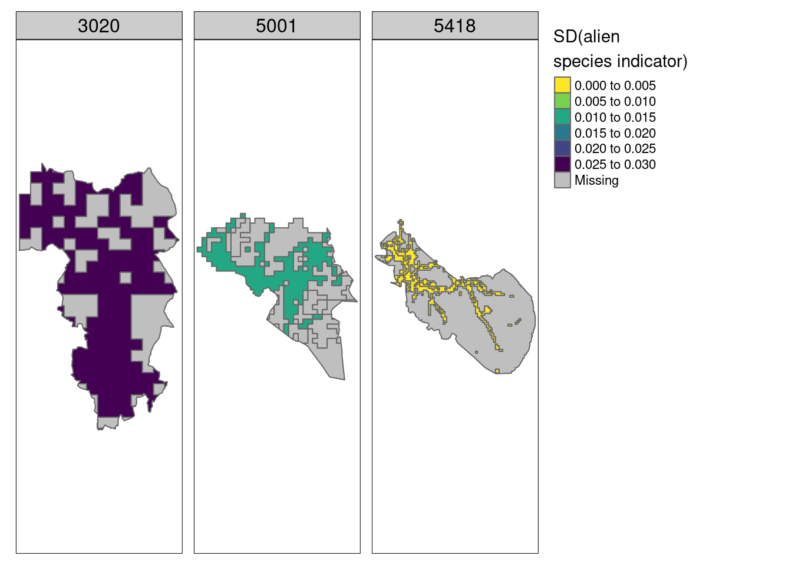
<p class="caption">(\#fig:sd-alien)Map showing the uncertainties (spatial variation) around the indicator values for alien species in three example municipalities for Semi-natural ecosystems.</p>
</div>

### Exploring the indicator values 

Most HIAs have good condition:


```r
alien_extr %>%
  filter(!is.na(w_mean)) %>%
  ggplot()+
  geom_histogram(aes(x = w_mean))+
  theme_bw()+
  labs(x = "Area weighted indicator value",
       y = "Number of HIAs with >20 data points")
#> `stat_bin()` using `bins = 30`. Pick better value with
#> `binwidth`.
```

<div class="figure">

<p class="caption">(\#fig:unnamed-chunk-62)Number of HIAs with >20 data points (sum of all three ecosystems)</p>
</div>

#### Data coverage {#alien-data-coverage}

Let's see how big proportion of Norway we ended up having data for. Ideally I would do this after masking the indicator maps with ecosystem delineations, 
but I can also get a good feel for the data coverage like this as well.

The area of Norway is 

```r
(total_area <- st_area(outline))
#> 325694265348 [m^2]
```

And here is the total and relative area of the indicator maps

```r
alien_extr %>%
  filter(!is.na(w_mean)) %>%
  mutate(m2 = st_area(.)) %>%
  group_by(eco) %>%
  summarise(sum_area = sum(m2)) %>%
  add_column(total_area = total_area) %>%
  mutate(relative_area = units::drop_units(sum_area/total_area)) %>%
  ggplot()+
  geom_bar(aes(x = eco, y = relative_area),
           stat = "identity")+
  labs(x = "Ecosystem", y = "Relative indicator data coverage")+
  theme_bw()
```

<div class="figure">

<p class="caption">(\#fig:relative-area)Relative area cover of the indicator maps for the alien species indicator (i.e. value 1 means that all HIAs had > 20 data points, and 0.2 means 20% of them did). If assuming the ecosystems are equally common where they are mapped and where they are not, this measure of data coverage is representative of the real indicator coverage after masking the maps with ecosystem delineations.</p>
</div>

Figure \@ref(fig:relative-area) shows us that this indicator will provide indicator values for about 20% of the semi-natural ecosystem, and considerably less for the other two ecosystems. The data coverage is very sensitive to the threshold for minimum data points, set to >20 in this case. Also, with more nature type data accumulating over time, the data coverage will increase. Therefore I think this indicator is worthwhile, and that this is considerably better than the alternative to discard the entire data set.

#### Effect of latitude

Alien species can be expected to decrease towards the north. Let us see if there is an effect of latitude.

Extracting x and y coordinates


```r
temp <- alien_extr %>%
  filter(!is.na(w_mean)) %>%
  st_centroid() %>%
  st_coordinates()

temp2 <- alien_extr %>%
  filter(!is.na(w_mean))  %>%
  cbind(temp)
```


```r
temp2 %>%
  ggplot(aes(x = X, y = w_mean))+
  geom_point()+
  theme_bw()+
  geom_smooth(linewidth=2,
              method="loess",
              span=0.75)+
  labs(x = "Latitude (UTM with offset)",
       y = "Alien species indicator value\n(area weighted)")+
  facet_wrap(~eco)
```

<div class="figure">
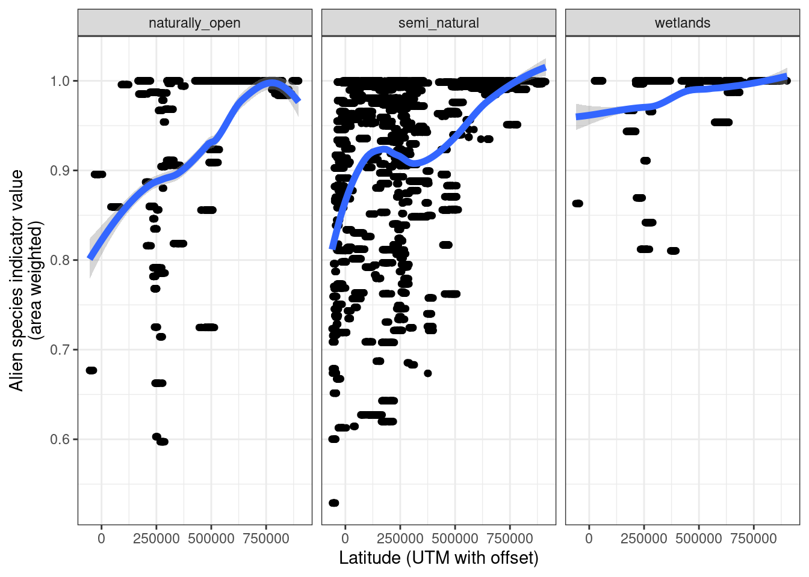
<p class="caption">(\#fig:lat-effect)Effect of latitude on the alien species indicator values. The blue line is a loess smoother (span=0.75).</p>
</div>


There is a quite clear association here between latitude and the on-site effect of alien species.


## Next steps

The next steps now are to

1. Prepare ecosystem delineation maps in EPSG:25833 and perfectly aligned to a master grid

2. Rasterize the extrapolated indicator map, using the ET map as a template 

3. and mask it using the perfectly aligned ET map.

4. Then, look at [Median Summer Temperature] for how to aggregate spatially to accounting areas (regions)


This workflow should be synchronized with the [slitasje](#slitasje-og-kjørespor) indicator. I will attempt a little proof of concept below.


## Masking with an ecosystem delineation - example {#masking-example}

Let's try steps 2 and 3 on a reduced data set. I'll work with wetlands in Gran municipality.


```r
gran <- wetland_alien_extr %>%
  filter(municipalityNumber == "3446")
```


```r
tm_shape(gran)+
  tm_polygons(col = "w_mean",
    title="Alien species indicator - wetlands",
    palette = myCol,
     style="fixed",
    breaks = seq(0,1,.1))+
  tm_layout(legend.outside = T,
            title = "Gran municipality")
```

<div class="figure">

<p class="caption">(\#fig:unnamed-chunk-67)Alien species indicator over wetlands in Gran municipality.</p>
</div>

Then I can import and crop the ecosystem delineation map (EDM).


```r
file <- "P:/41201785_okologisk_tilstand_2022_2023/data/Myrmodell/myrmodell90pros.tif"
EDM <- stars::read_stars(file, proxy=F)
```

The EDM is in UTM32 when we actually want to have it in UTM33. But transforming it takes too long, so I will transform the indicator map instead.


```r
gran <- st_transform(gran, st_crs(EDM))
```


```r
mire_gran <- st_crop(EDM, gran)
saveRDS(mire_gran, paste0(pData, "cache/mire_gran.rds"))
```


```r
ggplot()+
  geom_stars(data = st_downsample(mire_gran, 10))
```

<div class="figure">

<p class="caption">(\#fig:unnamed-chunk-72)Wetlands in Gran municipality</p>
</div>

Then I rasterize the indicator map to match the EDM. This takes a while, even for just one municipality. I'm not sure this would work for the entire country.


```r
gran_rast <- st_rasterize(gran, template = mire_gran)  
saveRDS(gran_rast, paste0(pData, "cache/gran_rast.rds"))
```


```r
gran_outline <- muni %>%
  filter(kommunenummer == "3446")
```


```r
tm_shape(st_downsample(gran_rast, 10))+
  tm_raster(col="w_mean")+
  tm_shape(gran_outline)+
  tm_borders(col="red")
```

<div class="figure">

<p class="caption">(\#fig:unnamed-chunk-76)Indictor values (alien species, extrapolated and area weighted values) in Gran municipality. Note that the pixelation is very small (10 x 10 m), and that the larger squares are remnants from the HIA map which was 1 x 1 km resolution.</p>
</div>

Then I mask to remove areas that are not actually wetlands.


```r
gran_rast_masked <- gran_rast
gran_rast_masked[mire_gran == 0] <- NA
```


```r
tm_shape(st_downsample(gran_rast_masked, 10))+
  tm_raster(col="w_mean",
            palette = "red")+
  tm_shape(gran_outline)+
  tm_borders(col="red")
```

<div class="figure">

<p class="caption">(\#fig:unnamed-chunk-78)Stratified, area weighted indictor values (alien species) in Gran municipality masked by a wetland ecosystem delimination map.</p>
</div>

From here it is easy to get zonal statistics using `exactextratr`. If I have this kind of map for all of Norway I can get the mean value for the regions (defined via a polygon set) and it will of course be area weighted (but no weight given to ecosystem occurences that don't have indicator values). 

