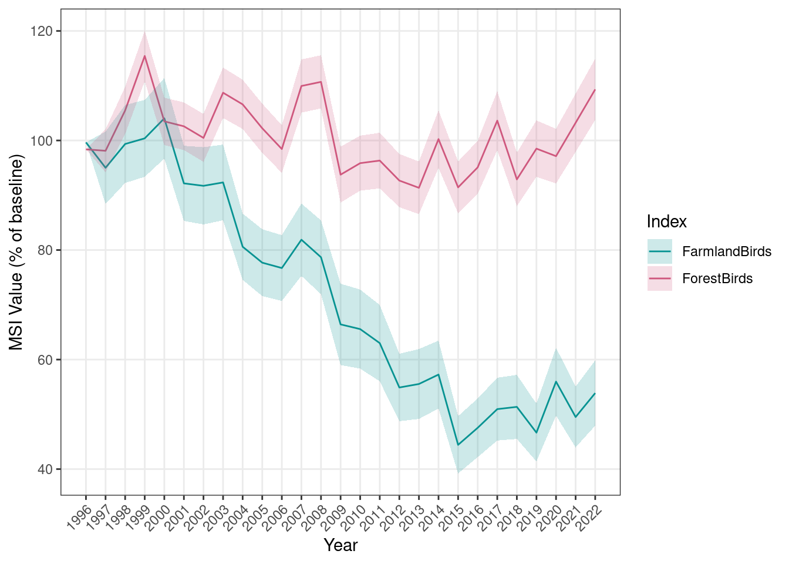
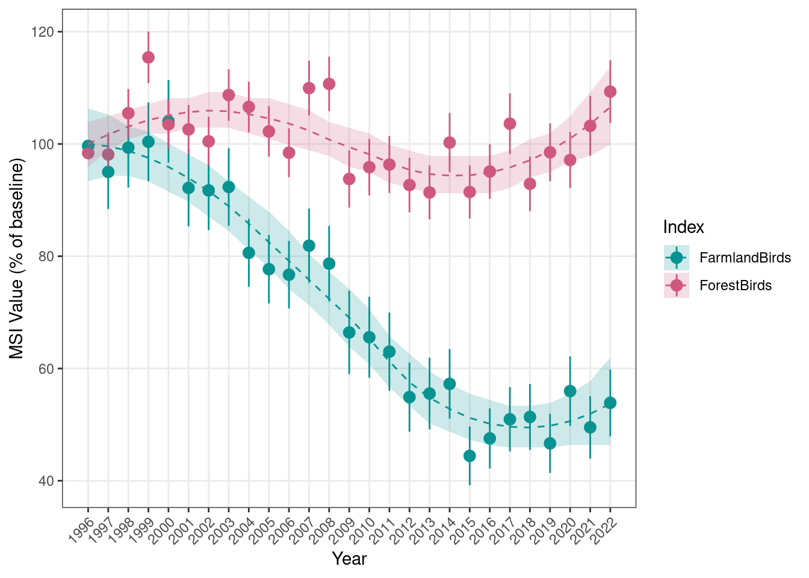
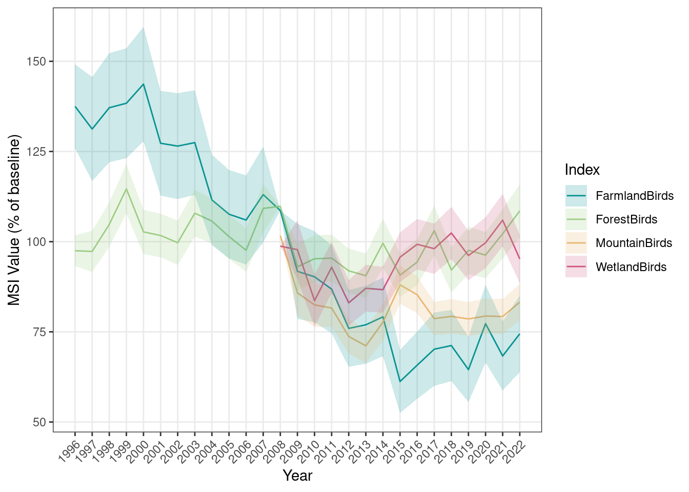
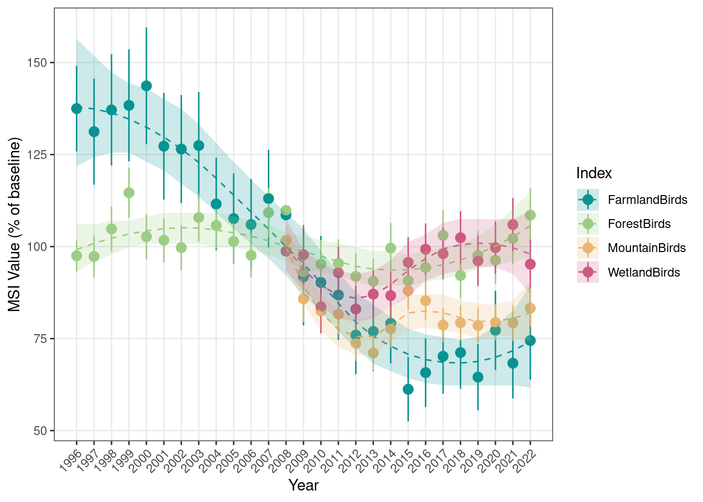

# Breeding bird indicators {#breeding-birds}

<br />
Norwegian name: **Hekkefulgindikatorer**
<br />


_Author and date:_

Chloé R. Nater, 

Diego Pavón-Jordán

Oktober 2023


<br />

<!-- Load all you dependencies here -->


```{=html}
<div class="tabwid"><style>.cl-40619ba8{table-layout:auto;}.cl-4059f5a6{font-family:'DejaVu Sans';font-size:11pt;font-weight:bold;font-style:normal;text-decoration:none;color:rgba(0, 0, 0, 1.00);background-color:transparent;}.cl-4059f5b0{font-family:'DejaVu Sans';font-size:11pt;font-weight:normal;font-style:normal;text-decoration:none;color:rgba(0, 0, 0, 1.00);background-color:transparent;}.cl-405d6cd6{margin:0;text-align:left;border-bottom: 0 solid rgba(0, 0, 0, 1.00);border-top: 0 solid rgba(0, 0, 0, 1.00);border-left: 0 solid rgba(0, 0, 0, 1.00);border-right: 0 solid rgba(0, 0, 0, 1.00);padding-bottom:5pt;padding-top:5pt;padding-left:5pt;padding-right:5pt;line-height: 1;background-color:transparent;}.cl-405d8572{background-color:rgba(173, 216, 230, 1.00);vertical-align: middle;border-bottom: 1.5pt solid rgba(102, 102, 102, 1.00);border-top: 1.5pt solid rgba(102, 102, 102, 1.00);border-left: 0 solid rgba(0, 0, 0, 1.00);border-right: 0 solid rgba(0, 0, 0, 1.00);margin-bottom:0;margin-top:0;margin-left:0;margin-right:0;}.cl-405d857c{background-color:transparent;vertical-align: middle;border-bottom: 0.75pt solid rgba(102, 102, 102, 1.00);border-top: 0 solid rgba(0, 0, 0, 1.00);border-left: 0 solid rgba(0, 0, 0, 1.00);border-right: 0 solid rgba(0, 0, 0, 1.00);margin-bottom:0;margin-top:0;margin-left:0;margin-right:0;}.cl-405d857d{background-color:transparent;vertical-align: middle;border-bottom: 0.75pt solid rgba(102, 102, 102, 1.00);border-top: 0.75pt solid rgba(102, 102, 102, 1.00);border-left: 0 solid rgba(0, 0, 0, 1.00);border-right: 0 solid rgba(0, 0, 0, 1.00);margin-bottom:0;margin-top:0;margin-left:0;margin-right:0;}.cl-405d857e{background-color:transparent;vertical-align: middle;border-bottom: 1.5pt solid rgba(102, 102, 102, 1.00);border-top: 0.75pt solid rgba(102, 102, 102, 1.00);border-left: 0 solid rgba(0, 0, 0, 1.00);border-right: 0 solid rgba(0, 0, 0, 1.00);margin-bottom:0;margin-top:0;margin-left:0;margin-right:0;}</style><table data-quarto-disable-processing='true' class='cl-40619ba8'><thead><tr style="overflow-wrap:break-word;"><th class="cl-405d8572"><p class="cl-405d6cd6"><span class="cl-4059f5a6">Ecosystem</span></p></th><th class="cl-405d8572"><p class="cl-405d6cd6"><span class="cl-4059f5a6">Økologisk egenskap</span></p></th><th class="cl-405d8572"><p class="cl-405d6cd6"><span class="cl-4059f5a6">ECT class</span></p></th></tr></thead><tbody><tr style="overflow-wrap:break-word;"><td class="cl-405d857c"><p class="cl-405d6cd6"><span class="cl-4059f5b0">Skog</span></p></td><td class="cl-405d857c"><p class="cl-405d6cd6"><span class="cl-4059f5b0">Biologisk mangfold</span></p></td><td class="cl-405d857c"><p class="cl-405d6cd6"><span class="cl-4059f5b0">Compositional state characteristic</span></p></td></tr><tr style="overflow-wrap:break-word;"><td class="cl-405d857d"><p class="cl-405d6cd6"><span class="cl-4059f5b0">fjell</span></p></td><td class="cl-405d857d"><p class="cl-405d6cd6"><span class="cl-4059f5b0">Biologisk mangfold</span></p></td><td class="cl-405d857d"><p class="cl-405d6cd6"><span class="cl-4059f5b0">Compositional state characteristic</span></p></td></tr><tr style="overflow-wrap:break-word;"><td class="cl-405d857d"><p class="cl-405d6cd6"><span class="cl-4059f5b0">våtmark</span></p></td><td class="cl-405d857d"><p class="cl-405d6cd6"><span class="cl-4059f5b0">Biologisk mangfold</span></p></td><td class="cl-405d857d"><p class="cl-405d6cd6"><span class="cl-4059f5b0">Compositional state characteristic</span></p></td></tr><tr style="overflow-wrap:break-word;"><td class="cl-405d857e"><p class="cl-405d6cd6"><span class="cl-4059f5b0">seminaturlig mark</span></p></td><td class="cl-405d857e"><p class="cl-405d6cd6"><span class="cl-4059f5b0">Biologisk mangfold</span></p></td><td class="cl-405d857e"><p class="cl-405d6cd6"><span class="cl-4059f5b0">Compositional state characteristic</span></p></td></tr></tbody></table></div>
```

<br />
<br />
<hr />


## Introduction {#intro-bb}
The Norwegian common breeding bird monitoring scheme ("hekkefuglovervåking" in Norwegian; formerly called TOV-E) was established between 2005 and 2010. The main goal of the programme is to gather data on the abundance of the most common terrestrial bird species to assess population trends and changes across Norway (available at the website), and help proposing efficient management and conservation measures for these species and their habitats in Norway. The "hekkefuglovervåking" is coordinated by NINA and BirdLife Norway and supported financially by the Norwegian Environment Agency (Miljødirektoratet), and has replaced predecessor monitoring schemes that ran from 1996 to 2008.  

These data collected through "hekkefuglovervåkingen" form the basis for a variety of national and international assessments including nationally reported species population trends (https://hekkefuglovervakingen.nina.no/hekkefugl), updates to the Red List of Birds in Norway following the IUCN protocol (https://artsdatabanken.no/lister/rodlisteforarter), indicators for the Norwegian Nature Index (https://www.naturindeks.no/), and single- and multi-species indicators that are reported nationally (https://miljostatus.miljodirektoratet.no/tema/arter/fugler/) and internationally to e.g. the Pan European Bird Monitoring Scheme (PECBMS, https://pecbms.info/) and the OECD. 

Workflows generating outputs and numbers for several of these reporting routes are already integrated thanks to coordination and standardization efforts by PECMBS, and the calculation of breeding bird indicators for use in ecosystem condition assessments should be incorporated into the same workflow. We therefore suggest to use the same multi-species indicators in the framework for ecosystem condition assessment as are reported nationally and internationally: the established "Farmland bird index", "Mountain bird index", and "Forest bird index", as well as a corresponding index for wetland birds. 


## About the underlying data {#underlying-bb}
The data from "hekkefuglovervåkingen" are gathered mostly by experienced volunteer bird-watchers following a standardized sampling protocol (https://hekkefuglovervakingen.nina.no/Fugl/public/papirskjema/MethodologyEng.pdf). Observers will visit each route once a year between 20. May and 10. June (depending on latitude) and carry out the census in good weather conditions. The observers record any bird seen or heard during 5 minutes at each of the pre-selected counting points in the route. A total of 229 species are typically recorded during this census. After 5 minutes, the observer walks to the next point in a straight line (when possible). During this 'transect' the observer is requested to record also a subset of species that are considered rare or difficult to capture during the 5-minute point counts (n = 121).

The data are subsequently entered into a database (https://hekkefuglovervakingen.nina.no/Fugl/Default.aspx) and quality-checked by NINA. Subsequently, the raw data are processed using a combination of country-specific wrangling routines and internationally standardized scripts distributed by PECBMS, which together make up the now integrated workflow below:


### Representativity in time and space {#rep-in-time-and-space-bb}
"Hekkefuglovervåking" is a nation-wide monitoring scheme consisting of 492 fixed routes across all terrestrial habitats present in Norway. Each route has between 12 and 20 counting points (ca. 9000 across Norway), which typically are 300 m apart, describing a square with side 1.5 km long (the observer walks on a straight line between two consecutive points). Deviations of this typical route shape are normally due to the landscape configuration (e.g. rough terrain, presence of a lake or river, sea, glacier, etc.). Due to limited resources, only a random sample of 370 routes are surveyed every year with an aim to survey at least 80% of the routes yearly. 

This monitoring scheme is therefore designed to gather representative samples in all (common) habitats along both latitudinal and altitudinal gradients. 

Even though implementation of the monitoring scheme started in 2005, full coverage at the national scale was not achieved until 2010. 


### Original units {#original-units-bb}
The observers in the field record "number of individuals" seen or heard during the census. Those values are then converted into "number of pairs" by multiplying the number of individuals by a conversion factor, which is 2 or 5 depending on the species (for national reporting only).
In the first step of the workflow, the raw counts are converted into species-specific abundance indices, defined as % of the population in a given baseline year (in Norway this is typically 2008). The abundance indices then form the basis of further analyses and aggregation routines.


### Temporal coverage {#temp-coverage-bb}
The "hekkefuglovervåkingen" was established in 2005 in central Norway and expanded from there to reach full national coverage by 2010. For many species, data is already of good coverage and high quality starting in 2008. The monitoring programme is still ongoing as of 2023.

Predecessor monitoring schemes existed prior to the establishment of "hekkefuglovervåkingen" and led to the collection of decent data in the period from 1996 up to and including 2008. 
Although the predecessor monitoring programmes and "hekkefuglovervåkingen" are not the same, the overlap for the years 2007 and 2008 makes it possible to combine abundance indices from across time using tools like "RSWAN", which is provided by PECBMS. For a subset of 55 species, longer time-series of abundance indices (1996-2022, as of now) are therefore available. 


### Aditional comments about the dataset {#additional-comments-bb}
From all species recorded within the Norwegian common breeding bird monitoring scheme (n = 229), 85 have sufficient data for abundance trend analyses. Abundance indices of 71 of those species, representing those with wide distributions and high continental-scale relevance, are reported annually to PECBMS. Longer (combined) time series can be calculated for 55 species, and 54 of those serve as indicators in the Norwegian Nature Index. The established breeding bird indicators contain varying numbers of species: the farmland bird index has 7 species, the mountain bird index has 8 species, and the forest bird index has 24 species. For the new index for wetland birds, we used 7 out of the 8 species suggested for this purpose by @husby2011. The one species we dropped was the Common Crane _(Grus grus)_ as it has seen strong recent population increases that are linked to anthropogenic impacts unrelated to the status of their wetland breeding habitats (Bård Stokke, pers. communication).


## Ecosystem characteristic {#ecosystem-characteristics-bb}

### Norwegian standard

Breeding bird indicators are regarded as indicators of biodiversity ("biologisk mangfold").
It is important to note though that the indicators represent species abundance (trends) in this context and are **not** indicators of species richness or species distribution.

### SEEA EA (UN standard)
Breeding bird indicators are tagged as "Compositional state characteristic".
We develop the indicators here to be as consistent as possible with the internationally reported and well-established farmland bird index (https://agridata.ec.europa.eu/Qlik_Downloads/InfoSheetEnvironmental/infoC35.html) and common bird indices (https://www.eea.europa.eu/ims/abundance-and-distribution-of-selected).

## Collinearities with other indicators
Several species that are part of the breeding bird indicators are also part of the Norwegian Nature Index (NI). For some ecosystems, e.g. wetlands, NI is dominated by bird indicators, potentially leading to substantial collinearity with the corresponding breeding bird index. In the chapter on NI products, we suggest to remove bird indicators from NI products when using them in ecosystem condition assessments that also make use of composite breeding bird indicators. 

## Reference condition and values {#ref-con-and-vals-bb}
### Reference condition {#ref-con-bb}
In general, the reference condition for breeding bird indicators should be defined along the same lines as for the other indicators in ecological condition assessments.

The internationally established composite bird indicators (farmland bird index, common bird index, etc.), however, are trend indicators that can be presented with a few different baseline years. It is the availability of monitoring data of sufficient quality that determines which years may be used as baselines, and the "hekkefuglovervåkingen", the monitoring programme that supplies the data for the Norwegian breeding bird indicators, has been running since 2007/2008. For some species, predecessor monitoring schemes have been providing data since 1996. The possible baselines for the breeding bird indicators can therefore be no earlier than 1996 or 2008 depending on the species (assemblage), and using baselines consistent with the other nationally (https://miljostatus.miljodirektoratet.no/tema/arter/fugler/; https://hekkefuglovervakingen.nina.no/Fugl/Default.aspx) and internationally reported indices (https://pecbms.info/trends-and-indicators/) seems sensible. 

We note that composite breeding bird indicators could also be built as [Nature Index (NI) product]("nature-index-product) (see separate chapters). For the species included in NI, reference values corresponding to "ecosystems with minimal human impacts" were determined previously, and an NI product for a selection of breeding birds would therefore be an indicator taking values between 0 and 1, where 1 = reference condition.
We refer to the chapter on NI products for more information (and implementation code) for this alternative approach. 

### Reference values, thresholds for defining _good ecological condition_, minimum and/or maximum values {#ref-vals-bb}
The breeding bird indicators represent average trends relative to a reference year and are therefore scaled with respect to population size in the reference year. Therefore, the indicator value in the reference year is 100 (percent). In theory, the indicators can take values between 0 (representing complete extinction of all species) and infinity (infinite population increase). 
The reference value 100 represents unchanged abundance relative to the reference year. 

Determining a threshold for what level of decrease in bird abundance is acceptable under "good ecological condition", however, is a challenging task. 
One approach to setting a threshold may be to consider thresholds of population decline used in other frameworks. The IUCN Red List of threatened species, for example, considers single species as "endangered" when a population decrease of 30% or more has been observed for the most recent decade or over the most recent 3 generations [@iucn2001]. While it is unclear to what degree that can (or should) be extended to assemblages of multiple species, one may use this as a guideline to stipulate that >70% of the original population (indicator value 70 when considering a recent trend over 10 years or 3 average generations) should be present (i.e. the species assemblage should not be endangered) when the ecosystem is in good condition. Another approach to determining a threshold would be to assume that bird populations should not be declining at all if an ecosystem is in good condition, i.e. that 100 is the threshold for good ecological condition instead of the reference value. In that case, however, one may need to come up with a reference value that is greater than 100, and determining what level of population increase would be ideal is a nearly impossible task.
We want to highlight here that these are very preliminary thoughts, and that the reference and threshold values have not been discussed in any more details yet. These discussions will nonetheless be needed, and possibly augmented with simulation studies, before putting the breeding bird indicators to use for ecosystem condition assessments. 


## Uncertainties {#errors-bb}
There is a substantial amount of uncertainty related to which year should be considered as a baseline and how the reference and threshold values should be set (see preceeding section). This is also closely related to a second question that requires discussion: over what time period should breeding bird indicators be considered in ecosystem condition assessments? One option would be to use an average over the entire period with available data). Alternatively, averages over shorter periods leading up to the year for which ecosystem condition should be assessed. This will require some careful evaluation. 

Another source of uncertainty comes from the assumption that multi-species abundance indices use a representative selection of species sampled in a representative set of habitats. However, due to resource- and logistic constraints, that is often not the case and non-random sampling along, for example, rural-urban gradients may bias breeding bird indices derived from data from "hekkefuglovervåkingen" [@husby2021].


## References {#refs-bb}

::: {#refs}
:::

## Analyses {#analyses-bb}

### Workflow setup

The code for the following analyses has been developed in a separate GitHub repository: https://github.com/NINAnor/birdIndicators
As a first step, we therefore need to read in all the functions from that repository. The repository has not been converted into a package yet, so we need to download the entire repository and source all function files in the "R" folder manually:  


```r
download.file(url = "https://github.com/NINAnor/birdIndicators/archive/refs/heads/main.zip",
              destfile = "temp/birdIndicators_Repo.zip")
unzip(zipfile = "temp/birdIndicators_Repo.zip",
      exdir = "temp")

sourceDir <- function(path, trace = TRUE, ...) {
  for (nm in list.files(path, pattern = "[.][RrSsQq]$")) {
    if(trace) cat(nm,":")
    source(file.path(path, nm), ...)
    if(trace) cat("\n")
  }
}
sourceDir("temp/birdIndicators-main/R")
```

Next, we need to define a range of relative and absolute directories / file paths. The main reason for that is that many of the scripts delivered by PECBMS function by iteratively writing and reading files in a specific folder structure. Whenever possible, I have written wrapper functions around the PECBMS code that work with relative paths, but absolute paths are still necessary for the scripts involved in the RSWAN routine as that workflow toggles between different working directories using `setwd()` repeatedly. Additionally, the RSWAN workflow also uses some helper functions that include changing working directories that are not provided as function arguments but instead need to be globally defined. 

While all code would ideally be rewritten to work with relative paths and without toggling working directories, PECBMS tends to distribute new versions of their scripts periodically and with no formal version control in place. This means that it is imperative to leave their core code as untouched as possible to facilitate including new versions (by copy paste) as they come. 

Hence we set up both relative and absolute file paths (note that I construct the latter relative to the project working directory to ensure a minimum of portability): 


```r
## Relative directory/file paths

# Storage of raw PECBMS Trim outputs
folder <- "PECBMS_Files" 

# Storage of processed PECBMS Trim outputs
subFolderName <- "Species_files" 

# Relative general and working folders for RSWAN
general_folder_rel <- "data"
working_folder_rel <- paste0(folder, "/", subFolderName)

# Storage of MSI results
MSI_results_folder <- "MSI_Results"


## Absolute directory/file paths

# NINAs local storage of legacy Trim output files
legacyFile_folder <- "P:/41201612_naturindeks_2021_2023_database_og_innsynslosning/Hekkefugl_Dataflyt/LegacyFiles_PECBMS_Trim"

# Absolute data and output paths for RSWAN 
general_folder <- paste0(getwd(), "/", general_folder_rel)
working_folder <- paste0(getwd(), "/", working_folder_rel)

output_folder <- paste0(working_folder, "/output/") 
output_folder2 <- paste0(working_folder, "/output") 


## Create directories if they are not available
dir.list <- c(folder, general_folder_rel, working_folder_rel, output_folder2)
for(i in 1:length(dir.list)){
  if(!file.exists(dir.list[i])){ 
  dir.create(dir.list[i])
  }
}

```

### Data sets {#datasets-bb}
The workflow relies on two major sources of data: the up-to-date raw data from "hekkefuglovervåkingen" and the calculated abundance indices from the predecessor monitoring schemes. Additionally, we also use a couple of lists holding information on which species (and years) are to be included in which parts of the analytical workflow.  

#### Monitoring data from "Hekkefuglovervåkingen"
The route-based raw data from "hekkefuglovervåkingen" are compiled after each breeding season and stored in NINA's database. From that database we download the data relevant for the PECBMS Trim analyses and for the specified range of years (here from 2006 up to and including 2022). The function ``downloadData_TRIM`` does that for a specified year range (from ``minYear`` up to and including ``maxYear``), and requires specifying which driver is used for accessing the database (via argument ``DriverName``). When running from the NINA RStudio server, we need to use "FreeTDS". When running locally from NINA computers, we need to select "SQL Server".
Note that downloading this data requires user-specific access privileges which can be requested from NINA. 


```r
minYear <- 2006
maxYear <- 2022

Trim_data <- downloadData_TRIM(minYear = minYear, maxYear = maxYear,
                               drop_negativeSpp = TRUE, DriverName = "FreeTDS")
```

#### PECBMS Trim results from predecessor monitoring programme
The abundance indices generated by the PECBMS RTRIM workflow using data from the predecessor scheme are stored in NINAs local file repositories. Unlike the Trim analyses for the data from "hekkefuglovervåkingen", which are re-run every year after new data has been added, the old abundance indices remain unchanged as no new data are being added.
These data are needed for the RSWAN workflow, and they need to be present in the respective "working_folder". So we copy them from their location in NINA's local file storage into the correct folder for analyses. 


```r
collectSpeciesFiles_Legacy(origin_folder = legacyFile_folder,
                           target_folder = paste0(folder, "/", subFolderName))
```

#### Lists of species information

The species list files should have been downloaded together with the rest of the `birdIndicators` repository and we can use `makeSpeciesLists()` to assemble the information. 


```r
sppLists <- makeSpeciesLists(Trim_data = Trim_data, spp_DataPath = "temp/birdIndicators-main/data")
Spp_selection <- sppLists$sppData
```

The table ``Spp_selection`` contains information for each species on which reporting routes is should be included in. The multispecies indices are grouped into a single category ("MSI") here, but we can extract the species that go into the MSI for each ecosystem via the additionally provided lists.

Farmland MSI species:

- Alauda arvensis
- Emberiza citrinella
- Hirundo rustica
- Motacilla alba
- Numenius arquata
- Sturnus vulgaris
- Vanellus vanellus

Forest MSI species:

- Anthus trivialis
- Certhia familiaris
- Dendrocopos major
- Dryocopus martius
- Erithacus rubecula
- Fringilla coelebs
- Garrulus glandarius
- Hippolais icterina
- Lophophanes cristatus
- Muscicapa striata
- Periparus ater
- Phoenicurus phoenicurus
- Phylloscopus collybita
- Phylloscopus trochilus
- Poecile montanus
- Prunella modularis
- Pyrrhula pyrrhula
- Regulus regulus
- Sylvia atricapilla
- Sylvia borin
- Turdus iliacus
- Turdus merula
- Turdus philomelos
- Turdus viscivorus

Mountain MSI species:

- Anthus pratensis
- Calcarius lapponicus
- Lagopus lagopus
- Lagopus muta
- Luscinia svecica
- Oenanthe oenanthe
- Pluvialis apricaria
- Turdus torquatus

Wetlands MSI species:

- Emberiza schoeniclus
- Gallinago gallinago
- Motacilla flava
- Numenius phaeopus
- Tringa glareola
- Tringa nebularia
- Tringa totanus

#### Regions {#regions-bb}

As per now, the breeding bird indicators are calculated at the national scale only and the data is therefore not linked to any geofiles here.

We note that some species may be sufficiently common and have enough data to allow for calculating indicator values for two major regions, Northern Norway and Southern Norway, but this requires careful evaluation that needs to be planned and organized as part of a future project. 

### PECBMS RTRIM analyses 

In the next step, the downloaded raw data get analysed and converted into species-specific abundance indices using the RTRIM approach ("**TR**ends and **I**ndices for **M**onitoring data", @R-rtrim2020). The RTRIM analyses are run for a subset of 85 species which have sufficient data for it and using the standardized scripts provided by PECBMS (more information on https://pecbms.info/methods/software/trim/). 
For the application here, we have written wrapper function around the PECBMS code for each step of the RTRIM workflow.


```r
## Write PECBMS arguments input files for each species
argument_file <- setupInputFiles_PECBMS_trimShell(Spp_selection = Spp_selection,
                                                  folderPath = folder)

## Subset data to contain only relevant species
PECBMS_data <- makeInputData_PECBMS(Trim_data = Trim_data,
                                    Spp_selection = Spp_selection,
                                    convertNA = TRUE, 
                                    save_allSppData = TRUE, returnData = TRUE)

## Run analyses using the PECBMS Rtrim shell
runRtrimShell_PECBMS(folder = folder)

## Process results
trimResults_PECBMS <- processRtrimOutput_PECBMS(folder = folder)
```

The results of the the RTRIM workflow are a series of .csv and .txt files. These are delivered directly to PECBMS each year after the analyses have been run. Prior to delivery, they get copied into a designated folder: 


```r
## Collect (and rename) species and summary files
collectSpeciesFiles_PECBMS(folder = folder, 
                           subFolderName = subFolderName)
```

### Combining data series using RSWAN

For 55 of the 85 species, RTRIM analyses have also been run using data from the predecessor monitoring schemes. The RTRIM output files from both old and new analyses should now be present in the same folder. 
From there, they enter into the next step of the workflow: PECBMS' RSWAN routine. This is based on another set of scripts distributed through PECBMS which combine RTRIM outputs from different monitoring schemes / time periods. 

Again, we have written wrapper functions around the scripts from PECBMS to make for a more streamlined and automated workflow:


```r
## Write/load schedule table
writeSchedule_SWAN(working_folder = working_folder_rel, 
                   general_folder = general_folder_rel,
                   MSI_speciesList = sppLists$sppLists$MSI,
                   loadSchedule = FALSE)

## Truncate first survey year where neccessary
correctFirstSurveyYear_SWAN(general_folder = general_folder_rel, 
                            working_folder = working_folder_rel,
                            maxYear = 2022)

## Run RSWAN
combineTimeSeries_SWAN(general_folder_abs = general_folder,
                       working_folder_abs = working_folder)

```

Running RSWAN requires some additional files that are provided by PECBMS, currently: "Swan_schedules.csv", "Swan_schedules_comb.csv", "Species_Countries.csv", and "New_notorics_2022.xlsx". 

(Once we turn ``birdIndicators`` into a package, we may add the content of these as integrated data. Although we would then need a function to write them to files as the core scripts from PECBMS need them to be files). 

THe RSWAN routine produces output files for the selected 55 species that are equivalent to those produced by the RTRIM workflow, but have a prefix "COMB" to indicate that they are based on combined time series. 


### Aggregation to multi-species indices (MSIs)

The breeding bird indicators for ecosystem condition assessments are mutli-species indices (MSIs) calculated following the guidelines from PECBMS (https://www.cbs.nl/en-gb/society/nature-and-environment/indices-and-trends--trim--/msi-tool) and using the algorithm of @soldaat2017. 

The function for calculating MSIs requires specifying whether or not to make use of combined time series generated by RSWAN (argument ``useCombTS``), which year to use as a base/reference (argument ``baseYear``), and which year to use as a changepoint (argument ``changepointYear``). The choice of change point year does not affect index values, but specifies until and from which year additional, shorter term trends should be calculated (i.e. if ``changepointYear = 2008``, the procedure will additionally provide trend estimates from starting year to 2008, and from 2008 to the last year in the data).


```r
useCombTS <- TRUE
baseYear <- 1996
changepointYear <- 2008
```

The function also requires us to provide a name (argument) and a list of EURING codes of species to include (argument ). We list these for all four ecosystem indices: 


```r
IndexNames <- c("FarmlandBirds", "ForestBirds", "MountainBirds", "WetlandBirds")
Index_sppLists <- list(sppLists$sppLists$MSI_farmland,
                       sppLists$sppLists$MSI_forest,
                       sppLists$sppLists$MSI_mountain,
                       sppLists$sppLists$MSI_wetlands)
```

First, we will calculate the farmland and forest bird indices starting from 1996 and using that year as the reference. 


```r
MSI_longTerm <- data.frame()
for(i in 1:2){
  message(paste0(crayon::bold("Calculating ", IndexNames[i], " Index...")))
  results <- calculateIndex_MultiSpecies(working_folder = working_folder_rel, 
                                         Spp_subset = Index_sppLists[[i]], 
                                         IndexName = IndexNames[i], 
                                         results_folder = MSI_results_folder,
                                         useCombTS = useCombTS,
                                         baseYear = baseYear,
                                         changepointYear = changepointYear)
  MSI_longTerm <- rbind(MSI_longTerm, results)
  message("")
}
```


The MSI is provided both as point estimates (``MSI``) with associated standard error (``sd_MSI``) and confidence interval (``lower_CL_MSI`` and ``upper_CL_MSI``), and as a smoothed trend model fit (characterised by an average trend, ``Trend``, and an associated confidence interval, ``lower_CL_trend`` and ``upper_CL_trend``):


```r
head(MSI_longTerm)
#>   year    MSI sd_MSI lower_CL_MSI upper_CL_MSI  Trend
#> 1 1996  99.65   0.00        99.65        99.65 100.00
#> 2 1997  95.02   6.61        82.91       108.91  99.59
#> 3 1998  99.36   7.12        86.34       114.34  98.77
#> 4 1999 100.39   7.02        87.53       115.13  97.53
#> 5 2000 104.04   7.35        90.59       119.49  95.91
#> 6 2001  92.17   6.86        79.67       106.63  93.92
#>   lower_CL_trend upper_CL_trend      trend_class
#> 1          93.36         106.32 moderate_decline
#> 2          94.30         105.26 moderate_decline
#> 3          94.30         103.18 moderate_decline
#> 4          93.36         102.15 moderate_decline
#> 5          91.51         100.13 moderate_decline
#> 6          89.70          98.15 moderate_decline
#>       IndexName
#> 1 FarmlandBirds
#> 2 FarmlandBirds
#> 3 FarmlandBirds
#> 4 FarmlandBirds
#> 5 FarmlandBirds
#> 6 FarmlandBirds
```

Additionally, the results are saved as a standardized set of files used for reporting to PECBMS. 

We can then visualize the results both as point MSI only and as point MSI + trend fit: 


```r
plotTimeSeries_MSI(MSI = MSI_longTerm,
                   results_folder = MSI_results_folder,
                   plot_name = "MSI_base1996_AllEcosystems", 
                   displayPlots = TRUE,
                   savePDF = FALSE)
```



Now we'll calculate indices for all ecosystems using the same setup, but using 2008 as a reference year. This makes the farmland and forest indices which can be calculated from 1996, and the mountain and wetland indices which can only be calculated from 2008 (due to insufficient data before) comparable: 


```r
## Setting function arguments
useCombTS <- c(TRUE, TRUE, FALSE, FALSE)
baseYear <- 2008

## Calculate MSI for each ecosystem
MSI_all <- data.frame()
for(i in 1:length(IndexNames)){
  message(paste0(crayon::bold("Calculating ", IndexNames[i], " Index...")))
  results <- calculateIndex_MultiSpecies(working_folder = working_folder_rel, 
                                         Spp_subset = Index_sppLists[[i]], 
                                         IndexName = IndexNames[i], 
                                         results_folder = MSI_results_folder,
                                         useCombTS = useCombTS[i],
                                         baseYear = baseYear,
                                         changepointYear = changepointYear)
  MSI_all <- rbind(MSI_all, results)
  message("")
}
```

```r
## Plot results
plotTimeSeries_MSI(MSI = MSI_all,
        results_folder = MSI_results_folder,
        plot_name = "MSI_base2008_AllEcosystems",
        displayPlots = TRUE,
        savePDF = FALSE)
```




### Uncertainty

Uncertainty in the point estimate MSI is provided via an associated standard error and confidence interval. Uncertainty in the smoothed trend model fit is provided via an associated confidence interval. 

## Prepare export {#prepare-export-bb}

Below we are preparing the output in the requested format. We are reporting the point estimate MSI here but note that we have not discussed to what degree the smoothed trend may be suitable. The breeding bird indicators exist only at the national scale as of now, so there are no spatial units associated with them. 


```r
MSI_export <- list(NA, NA, NA, NA)
names(MSI_export) <- unique(MSI_all$IndexName)

for(i in 1:length(MSI_export)){
  
  # Get mean indicator values in wide format
  mean_wide <- MSI_all %>%
    dplyr::filter(IndexName == names(MSI_export)[i]) %>%
    dplyr::mutate(toColNames = paste0("v_", year)) %>%
    reshape2::dcast(IndexName ~ toColNames, value.var = "MSI") %>%
    dplyr::select(-IndexName)
  
  # Get sd of indicator values in wide format
  sd_wide <- MSI_all %>%
    dplyr::filter(IndexName == names(MSI_export)[i]) %>%
    dplyr::mutate(toColNames = paste0("sd_", year)) %>%
    reshape2::dcast(IndexName ~ toColNames, value.var = "sd_MSI") %>%
    dplyr::select(-IndexName)
  
  # Combine and add additional columns
  MSI_export[[i]] <- cbind(mean_wide, sd_wide) %>%
    dplyr::mutate(reference_high = NA, 
                  reference_low = 0, 
                  thr = NA)
}
```
Notably, I have not added the ``i_YYYY` columns yet as these can only be calculated once we have discussed and come to an agreement on reference value (year), threshold value, and scaling function. 

### Eksport file (final product) {#export-bb}


```r
saveRDS(MSI_export, file = "indicators/BreedingBirdIndicators.rds")
```


### Tidy-up
At the very end we want to remove the downloaded "birdIndicators" repository from the temp directory:

```r
unlink("temp/birdIndicators_Repo.zip", recursive = TRUE)
unlink("temp/birdIndicators-main", recursive = TRUE)
```


