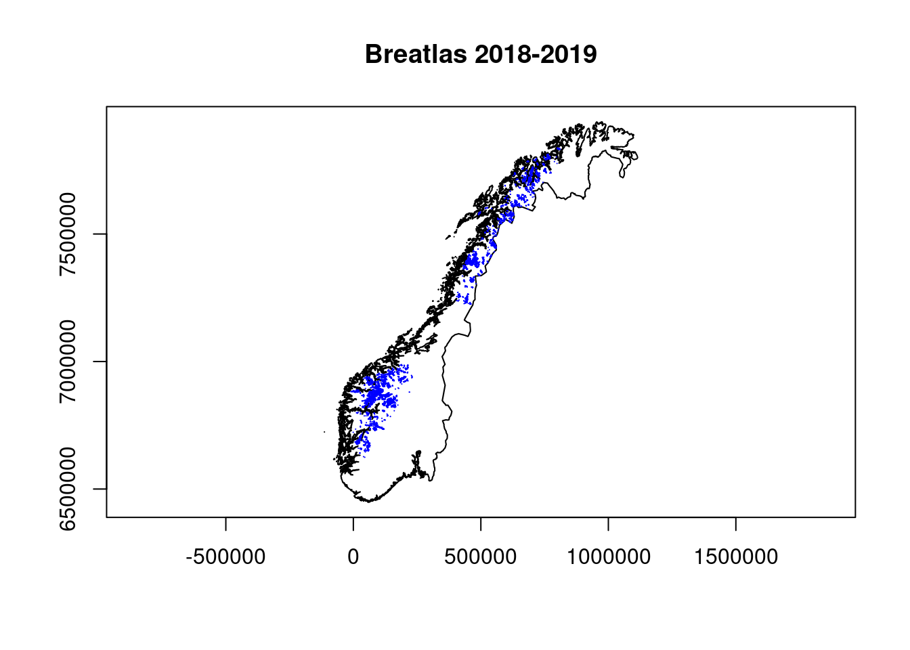
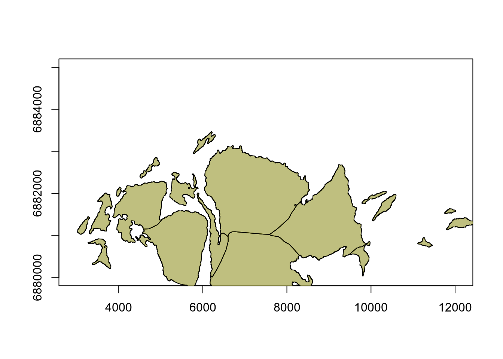
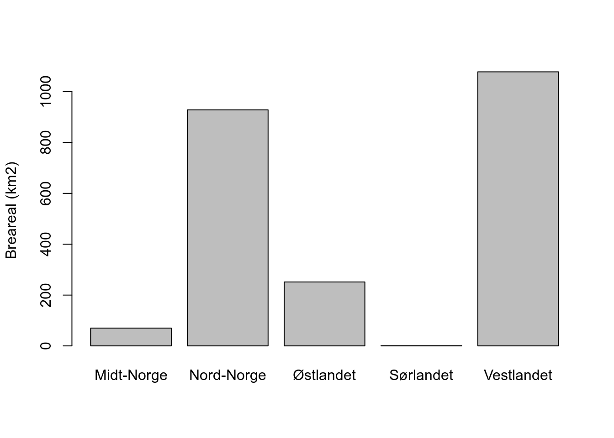

# (PART\*) INDICATORS FROM THE ALPINE ASSESSMENT {-}

# Areal av isbreer


<br />

_Author and date:_
Anders Kolstad


```
#> [1] "2023-09-07"
```


<br />


|Ecosystem |Økologisk.egenskap          |ECT.class                              |
|:---------|:---------------------------|:--------------------------------------|
|Fjell     |Landskapsøkologiske mønstre |Landscape and seascape characteristics |


<br />
<br />
<hr />

## Introduction
This indicator describes the relative change in glacial extent for each of fire regions in Norway. A [slightly different indicator](https://ninanor.github.io/IBECA/faktaark.html#Areal_av_isbreer) was used in the alpine assessment.

## About the underlying data
The indicator uses the maps of glacier extent ( _breatlas_ ) from [2018-2019](https://www.nve.no/vann-og-vassdrag/vannets-kretsloep/bre/publikasjoner-publications/breatlas-glacier-inventories/) and compares it to a similar map from 1947-1985. Both maps are owned by NVE (Norsk vassdrags og energidirektorat). The new map is based on Sentinel images, and the old map is a digitised version of the N50 maps, with some additional areal photo interpretation on top. 

### Representativity in time and space
The data set (map) covers the entire Norwegian mainland. There are only two time steps, but we expect changes in glacial extent to be relatively linear or consistent over time.
The older map may have underestimated the glacial extent due to a better chance of smaller snow and ice patches being captured by Sentinel contra aerial photo interpretations. 

### Original units
Area units (e.g. km2)

### Temporal coverage
1947-2019

### Aditional comments about the dataset
None

## Ecosystem characteristic
### Norwegian standard
The indicator was initially assigned the _Abiotiske forhold_ characteristic, but now it is considered under _Landskapsøkologiske mønstre_. The initial justificaton was that glacial melting would influence water availability downstream. Now we put more weight on glaciers as not just resevoirs of ice and water, but as a habitat, and the presence or abundance of a specific habitat can be though of as an aspect of landscape state. 

### SEEA ECT
The indicator is similarly assiged to the SEEA ECT class _C1 Landscape characteristics_.

## Collinearities with other indicators
None that are known.

## Reference state and values
### Reference state
The indicator uses the same reference state as all or most of the indicators developed in this and in similar projects, and is defined in [Nybø et al (2017): Fagsystem for fastsetting av god økologisk tilstand](https://www.regjeringen.no/no/dokumenter/fagsystem-for-fastsetting-av-god-okologisk-tilstand/id2558481/). As glacial extent is primarily, or solely, dependent on climate, we are in a case where we have actual data from the climatic reference period which is the previous normal period 1961-1990. 

### Reference values, thresholds for defining _good ecological condition_, minimum and/or maximum values
The reference value is zero change in glacial extent over time. The threshold for defining good ecological condition as set at a 40% reduction in glacial extent, as a default solution. This normalization follows a linear model, although a sigmoidal weibull function might be more appropriate. 

The minimum value is set to zero.

## Uncertainties
Here we add a 3% error on each side of the estimates, same as what is reported for the glacier maps from NVE.

## References
* Andreassen, L.M., & Winsvold, S.H. (eds.). 2012. Inventory of Norwegian glaciers. NVE Rapport 38, Norges Vassdrags- og energidirektorat, 236 s

* Andreassen, L.M., Elvehøy, H., Kjøllmoen, B. & Belart, J.M.C. 2020. Glacier change in Norway since the 1960s – an overview of mass balance, area, length and surface elevation changes. Journal of Glaciology 66: 313–328

* Andreassen, L.M., Nagy, T., Kjøllmoen, B. & Leigh, J.R. 2022. A Sentinel-2 based inventory of Norway’s glaciers and ice-marginal lakes 2018/2019. Journal of Glaciology (in review)

* Winsvold, S.H., Andreassen, L.M. & Kienholz, C.. 2014. Glacier area and length changes in Norway from repeat inventories. The Cryosphere 8: 1885-1903


## Analyses

### Importing the data sets
There are four data sets:

* glacial atlas
* n50 (the old glacial atlas)
* the regional delineation for Norway (fire regions)
* an outline of mainland Norway

We are assuming all glaciers are found in the mountins, se we do not need to mask the glacial atlas data using an ecosystem delineation map. 


#### Glacial atlas
This is the new glacial atlas from 2018 and 2019 based on Sentinell (ref. Liss Marie Andreassen, NVE)

```r

# server path
breatlas_path <- '/data/P-Prosjekter/41201042_okologisk_tilstand_fastlandsnorge_2020_dataanaly/fjell2021/data/breatlas/breatlas_2018_2019/Breatlas_20182019_temp20210922_lma.shp'

# local path 
#breatlas_path <- 'P:/41201042_okologisk_tilstand_fastlandsnorge_2020_dataanaly/fjell2021/data/breatlas/breatlas_2018_2019/Breatlas_20182019_temp20210922_lma.shp'


breatlas <- sf::st_read(breatlas_path)
#> Reading layer `Breatlas_20182019_temp20210922_lma' from data source `/data/P-Prosjekter/41201042_okologisk_tilstand_fastlandsnorge_2020_dataanaly/fjell2021/data/breatlas/breatlas_2018_2019/Breatlas_20182019_temp20210922_lma.shp' 
#>   using driver `ESRI Shapefile'
#> Simple feature collection with 6915 features and 27 fields (with 4 geometries empty)
#> Geometry type: MULTIPOLYGON
#> Dimension:     XY
#> Bounding box:  xmin: -9874.591 ymin: 6624398 xmax: 810132 ymax: 7836994
#> Projected CRS: ETRS89 / UTM zone 33N
```

All maps made in this project need to have the same CRS:  EPSG:25833 - ETRS89 / UTM zone 33N.
This one is in UTM 33N ETRS89, even if it is defined in the old Proj.4 way.

There are 6915 polygons. Let's calculate the area of the polygons and study the distribution of size classes. 

```r
breatlas$area <- st_area(breatlas)
par(mfrow=c(1,2))
hist(breatlas$area)
plot(breatlas$area)
```


Most polygons are small, and then there are a couple of very big ones. The largest polygon is 50 km2, but note that some polygons are somewhat arbitrarily split.


#### Map of Norway
This map is stored on the GitHub repository under _indicators/data/_. 

```r
nor <- sf::read_sf("data/outlineOfNorway_EPSG25833.shp")

plot(nor$geometry, axes=T, main = "Breatlas 2018-2019")
  plot(breatlas$geometry, add=T, border = "blue")
```




#### N50
This is the old glacial extent map. Import it and transform it, same as before.


```r

# server path
n50_path <- '/data/P-Prosjekter/41201042_okologisk_tilstand_fastlandsnorge_2020_dataanaly/fjell2021/data/breatlas/n50/cryoclim_GAO_NO_1952_1985_UTM_33N.shp'

# local path
#n50_path <- 'P:/41201042_okologisk_tilstand_fastlandsnorge_2020_dataanaly/fjell2021/data/breatlas/n50/cryoclim_GAO_NO_1952_1985_UTM_33N.shp'

n50 <- sf::st_read(n50_path)%>%
  st_transform(crs = crs(breatlas))
#> Reading layer `cryoclim_GAO_NO_1952_1985_UTM_33N' from data source `/data/P-Prosjekter/41201042_okologisk_tilstand_fastlandsnorge_2020_dataanaly/fjell2021/data/breatlas/n50/cryoclim_GAO_NO_1952_1985_UTM_33N.shp' 
#>   using driver `ESRI Shapefile'
#> Simple feature collection with 7141 features and 30 fields
#> Geometry type: POLYGON
#> Dimension:     XY
#> Bounding box:  xmin: -7278.562 ymin: 6623024 xmax: 812207.8 ymax: 7841654
#> Projected CRS: WGS 84 / UTM zone 33N
```


```r
plot(nor$geometry, axes=T, main = "n50 - 1952-1985")
  plot(n50$geometry, add=T, border = "red")
```


Let's now plot it all on top of each other.


```r

# define some boundary boxes for zooming in on specific regions
myExt <- raster::extent(c(0, 100000, 6840000, 6900000))
myExt2 <- raster::extent(c(5000, 10000, 6880000, 6885000))

# Prepare plotting device with one row, three columns
par(mfrow=c(1,3))

# Create three maps, each zooming in a bit further.
plot(nor$geometry, axes=T)
    plot(n50$geometry,  border = "orange", col = scales::alpha("orange", 1), add=T)
    plot(myExt, add=T, lwd=2)

plot(nor$geometry, xlim=c(0, 100000),
          ylim=c(6840000, 6900000),
          axes=T)
    plot(n50$geometry, add=T, col = "grey")
    plot(myExt2, add=T, lwd=3, col="orange")

# for this last map I plot the old extent in red and the new as grey on top. The red areas still visible will be areas where the glaciers have retreated.        
plot(nor$geometry, xlim=c(5000, 10000),
          ylim=c(6880000, 6885000),
     axes=T)
    plot(n50$geometry, add=T, col = "red")
    plot(breatlas$geometry, add=T, col = "grey")
```


The red areas in the map to the far right is where the ice has retreated for a selected glacier on the west coast. 
Now we need to devide the map into regions to then compare the area in n50 with the new glacial extent map _breatlas_.


#### Regions
Importing a shape file with the regional delineation. 


```r
reg <- st_read("data/regions.shp")
#> Reading layer `regions' from data source 
#>   `/data/scratch/Matt_temp/ecosystemCondition/data/regions.shp' 
#>   using driver `ESRI Shapefile'
#> Simple feature collection with 5 features and 2 fields
#> Geometry type: POLYGON
#> Dimension:     XY
#> Bounding box:  xmin: -99551.21 ymin: 6426048 xmax: 1121941 ymax: 7962744
#> Projected CRS: ETRS89 / UTM zone 33N
st_crs(reg)
#> Coordinate Reference System:
#>   User input: ETRS89 / UTM zone 33N 
#>   wkt:
#> PROJCRS["ETRS89 / UTM zone 33N",
#>     BASEGEOGCRS["ETRS89",
#>         ENSEMBLE["European Terrestrial Reference System 1989 ensemble",
#>             MEMBER["European Terrestrial Reference Frame 1989"],
#>             MEMBER["European Terrestrial Reference Frame 1990"],
#>             MEMBER["European Terrestrial Reference Frame 1991"],
#>             MEMBER["European Terrestrial Reference Frame 1992"],
#>             MEMBER["European Terrestrial Reference Frame 1993"],
#>             MEMBER["European Terrestrial Reference Frame 1994"],
#>             MEMBER["European Terrestrial Reference Frame 1996"],
#>             MEMBER["European Terrestrial Reference Frame 1997"],
#>             MEMBER["European Terrestrial Reference Frame 2000"],
#>             MEMBER["European Terrestrial Reference Frame 2005"],
#>             MEMBER["European Terrestrial Reference Frame 2014"],
#>             ELLIPSOID["GRS 1980",6378137,298.257222101,
#>                 LENGTHUNIT["metre",1]],
#>             ENSEMBLEACCURACY[0.1]],
#>         PRIMEM["Greenwich",0,
#>             ANGLEUNIT["degree",0.0174532925199433]],
#>         ID["EPSG",4258]],
#>     CONVERSION["UTM zone 33N",
#>         METHOD["Transverse Mercator",
#>             ID["EPSG",9807]],
#>         PARAMETER["Latitude of natural origin",0,
#>             ANGLEUNIT["degree",0.0174532925199433],
#>             ID["EPSG",8801]],
#>         PARAMETER["Longitude of natural origin",15,
#>             ANGLEUNIT["degree",0.0174532925199433],
#>             ID["EPSG",8802]],
#>         PARAMETER["Scale factor at natural origin",0.9996,
#>             SCALEUNIT["unity",1],
#>             ID["EPSG",8805]],
#>         PARAMETER["False easting",500000,
#>             LENGTHUNIT["metre",1],
#>             ID["EPSG",8806]],
#>         PARAMETER["False northing",0,
#>             LENGTHUNIT["metre",1],
#>             ID["EPSG",8807]]],
#>     CS[Cartesian,2],
#>         AXIS["(E)",east,
#>             ORDER[1],
#>             LENGTHUNIT["metre",1]],
#>         AXIS["(N)",north,
#>             ORDER[2],
#>             LENGTHUNIT["metre",1]],
#>     USAGE[
#>         SCOPE["Engineering survey, topographic mapping."],
#>         AREA["Europe between 12°E and 18°E: Austria; Denmark - offshore and offshore; Germany - onshore and offshore; Norway including Svalbard - onshore and offshore."],
#>         BBOX[46.4,12,84.42,18]],
#>     ID["EPSG",25833]]
```

Let's plot it to make sure it is correct.

```r
plot(nor$geometry, axes=T)
  plot(reg$geometry, add=T, border = "black", 
       col = scales::alpha(c("blue", 
                             "red", 
                             "green",
                             "yellow",
                             "brown"), .2))
```


Get the region names

```r
unique(reg$region)
#> [1] "Nord-Norge"      "Midt-Norge"      "Ã\u0098stlandet"
#> [4] "Vestlandet"      "Sørlandet"
```

These are odd. Let me fix the Norwegian letters manually.

```r
reg$region[reg$region=="Ã\u0098stlandet"] <- "Østlandet"
reg$region[reg$region=="Sørlandet"] <- "Sørlandet"
```


Before going any further I need to fix a problem with glacier polygons crossing themselves. 

```r
table(st_is_valid(breatlas))
#> 
#> FALSE  TRUE 
#>    68  6847
```
 68 polygons are not valid. 
 Let's look at the first four reasons for why that is. 


```r
unique(st_is_valid(breatlas, reason=T))[1:5]
#> [1] "Valid Geometry"                                       
#> [2] "Ring Self-intersection[100236.4931 6912507.5864]"     
#> [3] "Ring Self-intersection[92500.2095999997 6900940.8003]"
#> [4] "Ring Self-intersection[91965.6612 6883260.4912]"      
#> [5] "Ring Self-intersection[120595.9254 6853573.4955]"
```

There is a convinient function to fix this.

```r
# requires lwgeom
breatlas2 <- st_make_valid(breatlas)
table(st_is_valid(breatlas2))
#> 
#> TRUE 
#> 6915

# same result:
#breatlas2 <- st_buffer(breatlas, 0.0)
#table(st_is_valid(breatlas2))
```


Let me plot the new, fixed map on top of the old to see if they match. I give the new valid map a blue transparent colour, and the old map a yellow and transparent colour.  

```r
plot(nor$geometry, xlim=c(5000, 10000),
          ylim=c(6880000, 6885000),
     axes=T)
    plot(breatlas2$geometry, add=T, col = scales::alpha("blue",0.5))
    plot(breatlas$geometry, add=T, col = scales::alpha("yellow",0.5))
```



This seems to have worked. 
Notice also how some of these larger polygons are somewhat arbitrarely divided into several adjoining polygons. This is only so for the new map, not the old n50 map.

Delete the invalid data set.

```r
breatlas <- breatlas2
rm(breatlas2)
```


### Glacial area per region
#### Contemporary area

Here is one method for getting the glacial area for each region.

```r
# This intersection operation is a bit heavy, so I do it once and store it locally so that I can import it again quickly. 
#brealtas_reg <- st_intersection(breatlas, reg)
#saveRDS(brealtas_reg, "indicators/data/brealtas_reg_helperfile.rds")

# Importing what I create above
brealtas_reg <- readRDS("data/brealtas_reg_helperfile.rds")
```


Checking what happens to polygons that span to regions. Central Norway in red and western Norway in green. 50% transparency means we should get a third colour where and if they overlap.

```r
plot(brealtas_reg$geometry[brealtas_reg$region=="Midt-Norge"], 
    col = scales::alpha("red",0.5), border=NA, axes=T, 
     ylim=c(6900000, 6905000),
     xlim=c(85000, 100000))
plot(brealtas_reg$geometry[brealtas_reg$region=="Vestlandet"], 
     col = scales::alpha("green",0.5), border=NA, add=T)
  plot(nor$geometry, add=T)
```


It worked fine. 

Calculating the area of the polygons

```r
#Calculating the area of the polygons
brealtas_reg$area_crop <- st_area(brealtas_reg)

# summing the area for each region
bretabell <- tapply(
       brealtas_reg$area_crop,
       brealtas_reg$region,
       FUN = sum)

# converting from m2 to km2
bretabell <- bretabell/1000000

# plotting
barplot(
  bretabell,
  ylab="Breareal (km2)"
)
```



Southern Norway has <1km2 of glaciers in 2018-2019.


#### Same for N50

```r
n50x <- st_make_valid(n50)
#n50_reg <- st_intersection(n50x, reg)
#saveRDS(n50_reg, "indicators/data/n50_helperfile.rds")
n50_reg <- readRDS("data/n50_helperfile.rds")
```


```r
plot(n50_reg$geometry[n50_reg$region=="Midt-Norge"], 
    col = scales::alpha("red",0.5), border=NA, axes=T, 
     ylim=c(6900000, 6905000),
     xlim=c(85000, 100000))
plot(n50_reg$geometry[n50_reg$region=="Vestlandet"], 
     col = scales::alpha("green",0.5), border=NA, add=T)
  plot(nor$geometry, add=T)
```


Thats good. 
Now I will plot the reference values (n50) and the contemporary data together.

```r
n50_reg$area_crop <- st_area(n50_reg)

n50tabell <- tapply(
       n50_reg$area_crop,
       n50_reg$region,
       FUN = sum)
n50tabell <- n50tabell/1000000 


barplot(
  n50tabell,
  ylab="Breareal (km2)",
  col="grey"
)
barplot(
  bretabell,
  ylab="Breareal (km2)",
  add=T,
  col="grey30"
)
```


In the figure above, the glacial area in the reference periond is in light grey and todays area is in dark grey. The height of the light grey bar depicts the reduction in glacial area.

There was a little more glaicers in southern Norway in the reference period, but only 4 km2. The condition here will be very poor! I'm not entirely sure this is representative. The alternative is to set it to be NA, and I think I will do this - one could argue that glaciers are not as important of central to the alpine ecosystems in the south. 


### Scaled indicator values
Making a table with the indicator values.

```r
myTbl <- tibble(region           = names(bretabell),
                indikator        = bretabell,
                referanseverdi   = n50tabell)
myTbl$skalert_indikator <- myTbl$indikator/myTbl$referanseverdi

knitr::kable(myTbl)
```


|region     |    indikator| referanseverdi| skalert_indikator|
|:----------|------------:|--------------:|-----------------:|
|Midt-Norge |   69.8685069|     173.436069|         0.4028488|
|Nord-Norge |  928.5326204|    1409.196007|         0.6589095|
|Østlandet  |  251.3490789|     365.357472|         0.6879538|
|Sørlandet  |    0.7033655|       3.739583|         0.1880866|
|Vestlandet | 1077.9902876|    1372.939792|         0.7851694|


Scaling and clipping the regions against the outline of Norway


```r
# paste the scaled indicato values into the shape file with the regions, using the match function to make sure the align correctly
reg$skalert_indikator <- myTbl$skalert_indikator[match(reg$region, myTbl$region)]

# cutting away the marine areas
reg_clipped <- st_intersection(reg, nor)
#> Warning: attribute variables are assumed to be spatially
#> constant throughout all geometries
```


```r
# round of to 2 decimals
reg_clipped$skalert_indikator_r <- round(reg_clipped$skalert_indikator, 2)
```


Plotting a static map with scaled indicator values

```r
tmap_mode("plot") # mode 'view' takes a lot longer to render, but looks better
#> tmap mode set to plotting
tm_shape(reg_clipped) + 
  tm_polygons(col="skalert_indikator", 
              border.col = "white")+
  tm_text("skalert_indikator_r", size=1.5)+
  tm_shape(nor)+
  tm_polygons(alpha = 0,border.col = "black")
```


```r
# removing the value for souther norway
reg_clipped$skalert_indikator[reg_clipped$region=="Sørlandet"] <- NA
```

Calculating total change of glacier extent

```r
sum(bretabell)/sum(n50tabell)
#> [1] 0.7003536
```

We've lost 30% of the glacial area over this time.


### Uncertainty
NVE reports a 3% uncertainty with their method. This is interpret as if +- 3% represent a 99.9%CI for the estimate (ca 2 SD).
In the [original indicator](https://ninanor.github.io/IBECA/areal-av-isbreer.html) I re-sampled the indicator value 10000 times here, with a 0.015sd, to get a distribution of indicator values. This time I will settle for reporting the sd as a single value below. 


## Prepare export
Now I can prepare the final exported data file. It will be a shape file with raw and scaled indicator values, reference reference values, and uncertainties.

The names of the columns are standardised (region, v_YYYY, sd_YYYY, i_YYYY, and reference).


```r
names(reg_clipped)
#> [1] "id"                  "region"             
#> [3] "skalert_indikator"   "GID_0"              
#> [5] "NAME_0"              "geometry"           
#> [7] "skalert_indikator_r"
```


```r
# paste the raw variable estimates
reg_clipped$v_2019 <- myTbl$indikator[match(reg_clipped$region, myTbl$region)]              

# paste the reference values
reg_clipped$reference <- myTbl$referanseverdi[match(reg_clipped$region, myTbl$region)]      

# add 3% (one-sided) errors (SD=1.5% so that 1.95SD equals about 3%). 
reg_clipped$sd_2019 <- reg_clipped$v_2019*0.015
        
# subset the shape file to include only the columns of interest, and rename the column with the scaled indicator values, assigning the value to year 2019.
exp <- dplyr::select(reg_clipped,
                     region,
                     v_2019,
                     sd_2019,
                     reference,
                     i_2019 = skalert_indikator,
                     geometry)

```


### Eksport shape file (final product)


```r
sf::st_write(exp, "indicators/indicatorMaps/breareal.shp")
```


```r
knitr::kable(exp[,1:5])
```


|region     |       v_2019|     sd_2019|   reference|    i_2019|geometry                       |
|:----------|------------:|-----------:|-----------:|---------:|:------------------------------|
|Nord-Norge |  928.5326204| 13.92798931| 1409.196007| 0.6589095|MULTIPOLYGON (((353978.3 72... |
|Midt-Norge |   69.8685069|  1.04802760|  173.436069| 0.4028488|MULTIPOLYGON (((148280.6 69... |
|Østlandet  |  251.3490789|  3.77023618|  365.357472| 0.6879538|MULTIPOLYGON (((236668.3 66... |
|Vestlandet | 1077.9902876| 16.16985431| 1372.939792| 0.7851694|MULTIPOLYGON (((875.0099 64... |
|Sørlandet  |    0.7033655|  0.01055048|    3.739583|        NA|MULTIPOLYGON (((-4329.09 64... |


