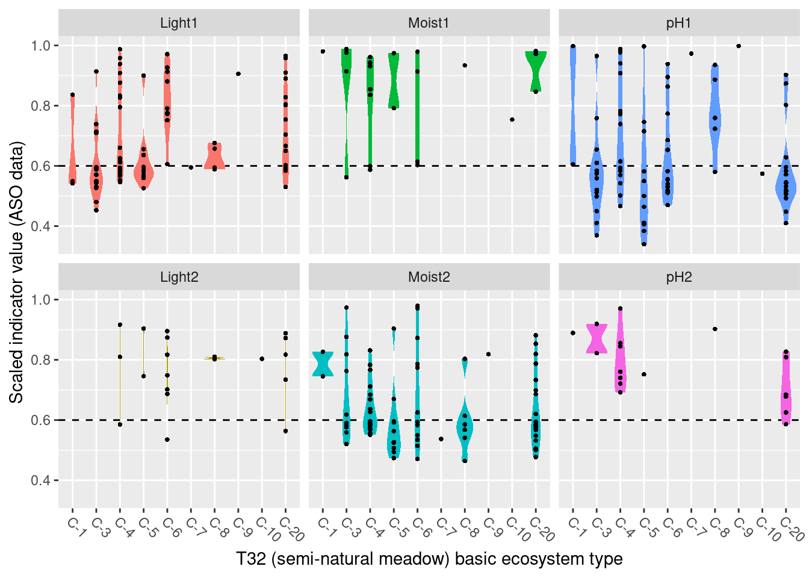
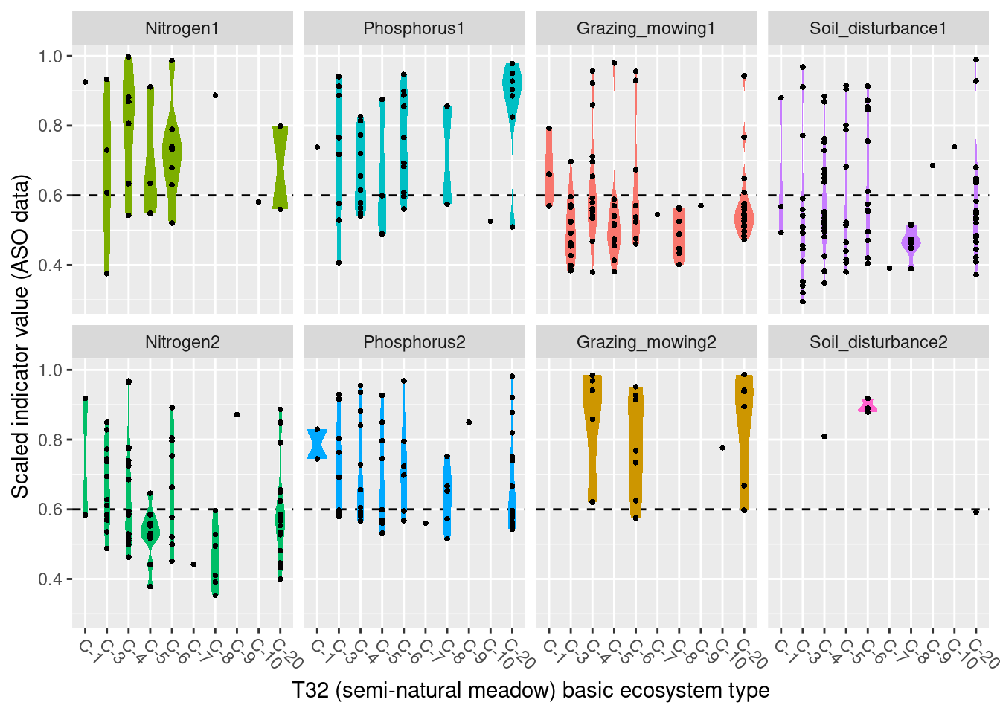

# Functional Plant Indicators - Semi-Natural Ecosystems {#functional-plant-indicators-seminat}


<br />
Norwegian name: **Planteindikatorer**
<br />


_Author and date:_
Joachim Töpper

May 2023

<br />

<!-- Load all you dependencies here -->


```{=html}
<div class="tabwid"><style>.cl-5f190fa8{table-layout:auto;}.cl-5f11976e{font-family:'DejaVu Sans';font-size:11pt;font-weight:bold;font-style:normal;text-decoration:none;color:rgba(0, 0, 0, 1.00);background-color:transparent;}.cl-5f119778{font-family:'DejaVu Sans';font-size:11pt;font-weight:normal;font-style:normal;text-decoration:none;color:rgba(0, 0, 0, 1.00);background-color:transparent;}.cl-5f14f918{margin:0;text-align:left;border-bottom: 0 solid rgba(0, 0, 0, 1.00);border-top: 0 solid rgba(0, 0, 0, 1.00);border-left: 0 solid rgba(0, 0, 0, 1.00);border-right: 0 solid rgba(0, 0, 0, 1.00);padding-bottom:5pt;padding-top:5pt;padding-left:5pt;padding-right:5pt;line-height: 1;background-color:transparent;}.cl-5f1511f0{background-color:rgba(173, 216, 230, 1.00);vertical-align: middle;border-bottom: 1.5pt solid rgba(102, 102, 102, 1.00);border-top: 1.5pt solid rgba(102, 102, 102, 1.00);border-left: 0 solid rgba(0, 0, 0, 1.00);border-right: 0 solid rgba(0, 0, 0, 1.00);margin-bottom:0;margin-top:0;margin-left:0;margin-right:0;}.cl-5f1511f1{background-color:transparent;vertical-align: middle;border-bottom: 0.75pt solid rgba(102, 102, 102, 1.00);border-top: 0 solid rgba(0, 0, 0, 1.00);border-left: 0 solid rgba(0, 0, 0, 1.00);border-right: 0 solid rgba(0, 0, 0, 1.00);margin-bottom:0;margin-top:0;margin-left:0;margin-right:0;}.cl-5f1511fa{background-color:transparent;vertical-align: middle;border-bottom: 1.5pt solid rgba(102, 102, 102, 1.00);border-top: 0.75pt solid rgba(102, 102, 102, 1.00);border-left: 0 solid rgba(0, 0, 0, 1.00);border-right: 0 solid rgba(0, 0, 0, 1.00);margin-bottom:0;margin-top:0;margin-left:0;margin-right:0;}</style><table data-quarto-disable-processing='true' class='cl-5f190fa8'><thead><tr style="overflow-wrap:break-word;"><th class="cl-5f1511f0"><p class="cl-5f14f918"><span class="cl-5f11976e">Ecosystem</span></p></th><th class="cl-5f1511f0"><p class="cl-5f14f918"><span class="cl-5f11976e">Økologisk egenskap</span></p></th><th class="cl-5f1511f0"><p class="cl-5f14f918"><span class="cl-5f11976e">ECT class</span></p></th></tr></thead><tbody><tr style="overflow-wrap:break-word;"><td class="cl-5f1511f1"><p class="cl-5f14f918"><span class="cl-5f119778">semi-natural</span></p></td><td class="cl-5f1511f1"><p class="cl-5f14f918"><span class="cl-5f119778">Primærproduksjon</span></p></td><td class="cl-5f1511f1"><p class="cl-5f14f918"><span class="cl-5f119778">Functional state characteristic</span></p></td></tr><tr style="overflow-wrap:break-word;"><td class="cl-5f1511fa"><p class="cl-5f14f918"><span class="cl-5f119778">semi-natural</span></p></td><td class="cl-5f1511fa"><p class="cl-5f14f918"><span class="cl-5f119778">Abiotiske forhold</span></p></td><td class="cl-5f1511fa"><p class="cl-5f14f918"><span class="cl-5f119778">Functional state characteristic</span></p></td></tr></tbody></table></div>
```


Indicators described in this chapter:

- Light
- Moisture
- pH
- Nitrogen
- Phosphorus
- Grazing_mowing
- Soil disturbance


<!-- Don't remove these three html lines -->
<br />
<br />
<hr />

## Introduction {#intro-fpis}
Functional plant indicators can be used to describe the functional signature of plant communities by calculating community-weighted means of plant indicator values for plant communities (Diekmann 2003). The functional signature of plant communities may be indicative of ecosystem identity, depending on which functional plant indicator we look at (cf. Töpper et al. 2018). For instance, using an indicator for moisture one would find a functional signature with higher moisture values for plant communities in mires compared to e.g. grasslands or forests. Deviations in the functional signature of such an indicator beyond a certain range of indicator values (as there of course is natural variation of functional signatures within an ecosystem type) may be related to a reduction in ecological condition. Here, we combine functional plant indicator data with field sampled plant community data from the Norwegian nature monitoring program ANO (Tingstad et al. 2019) for semi-natural ecosystems. We calculate the functional signature of plant communities in the monitored sites with respect to light, moisture, pH, nitrogen, phosphorus, grazing_mowing, and soil disturbance. These functional signatures are then compared to reference distributions of functional signature, separately for each semi-natural ecosystem type, calculated from 'generalized species lists' underlying the Norwegian categorization system for eco-diversity (Halvorsen et al. 2020). These plant functional condition indicators are developed following the principles and technical protocol of the IBECA framework (Jakobsson et al. 2021, Töpper & Jakobsson 2021). Note that deviations from the reference may occur in both directions, e.g. the soil disturbance signature from the testing data may be higher or lower than in the reference. Deviations in these two directions indicate very different environmental phenomena and thus have to be treated separately. Therefore, we develop two condition indicators for each functional plant indicator, a lower one and an upper one (see further down for more details).

## About the underlying data
In the 'functional plant indicator' project for semi-natural ecosystems, we use four sets of data for building indicators for ecological condition:

- as test data we use plant community data (1) from the ANO monitoring scheme (cf. Tingstad et al. 2019) and (2) from the ASO monitoring scheme (cf. Bär et al. 2021)
- as reference data we use (3) generalized species lists from the Norwegian categorization system for eco-diversity (NiN) (cf. Halvorsen et al. 2020)
- (4) Swedish plant indicator data for light, moisture, pH, nitrogen, phosphorus, grazing_mowing, and soil disturbance from Tyler et al. (2021)

(1) ANO monitoring data:
ANO stands for 'areal-representativ naturovervåking', i.e. 'area representative nature monitoring'. 1000 sites are randomly distributed across mainland Norway and visited within a 5-year cycle. Each ANO site spans a 500 x 500 m grid cell, and the data collection at each ANO site includes up to 18 evenly distributed vegetation analyses in 1 x 1 m plots (up to 18, because some of these evenly distributed points may be in water or otherwise inaccessible). For the vegetation analyses, the cover of each vascular plant species in the plot is recorded. Every vegetation analysis is accompanied by an assessment of the ecosystem the plot lies in, including ecosystem type and some additional variables related to ecosystem-specific drivers of state. In the analysis in this document, we only use the plots which were classified as one of the semi-natural ecosystem types in the Norwegian categorization system for eco-diversity (NiN).
In the analysis in this document, we use the data available on Miljødirektoratets kartkatalog (https://kartkatalog.miljodirektoratet.no/Dataset/Details/2054), which comprises data from the first three ANO-years, 2019-2021, and a total of 8887 plots in 498 sites.

(2) ASO monitoring data
ASO stands for 'arealrepresentativ overvåking av semi-naturlig eng', i.e. 'area representative monitoring of semi-natural meadows'. In ASO ca. 20 areas are chosen annually based on a probabilistic distribution model of semi-natural meadows in Norway (see Johansen et al. 2017 for details). Each ASO area (område) spans a 10 x 10 km grid cell, in which a maximum of up to 10 sites (flate) of 500 x 500 m are chosen. In each site, all semi-natural meadows (eng) with an area of at least 250 sqm are delineated. In up to three meadows per site the plant species composition is sampled using a transect method. For the vegetation transect analyses, both cover and frequency of each vascular plant species along the transect is recorded. For every meadow, the species data collection is accompanied by an assessment of the ecosystem, including ecosystem type and some additional variables related to ecosystem-specific drivers of state.
In the analysis in this document, we use the ASO data from 2022 only as the data from 2021 and the ASO pilot in 2019 are not in sufficiently good shape yet. In the future, all ASO data will probably be available through Miljødirektoratets kartkatalog.

(3) NiN reference data:
The generalized species lists underlying the ecosystem categorization in NiN represent expert-compiled species lists based on empirical evidence from the literature and expert knowledge of the systems and their species. In these lists, every species is assigned an abundance value on a 6-step scale, with each step representing a range for the 'expected combination of frequency and cover' of occurrence (1: < 1/32, 2: 1/32 - 1/8 , 3: 1/8 - 3/8, 4: 3/8 - 4/5, 5: 3/8 - 4/5 + dominance, 6: > 4/5). For the purpose of this project, these steps are simplified to maximum 'expected combination of frequency and cover', whereby steps 4 & 5 are assigned 0.6 and 0.8, respectively, in order to distinguish between them.

(4) The Swedish plant indicator set published by Tyler et al. (2021) contains a large collection of plant indicators based on the Swedish flora, which is well representative of the Norwegian flora as well. From this set, we decided to include indicator data for light, moisture, pH, nitrogen, phosphorus, grazing_mowing, and soil disturbance for semi-natural ecosystems as these are thought to be subject to potential change due to abandonment, drainage/flooding, pollution, and erosion.


### Representativity in time and space
For semi-natural ecosystems, the ANO data in this analysis contain 233 plots in 83 sites, in principle distributed randomly across the country. As semi-natural ecosystems occur more often in certain regions of Norway than in others, the amount of plots and sites is not equal among Norway's five regions. The 233 plots are distributed across regions in the following way:

- Northern Norway: 74
- Central Norway:  36
- Eastern Norway:  30
- Western Norway:  84
- Southern Norway: 6

For ASO, this analysis covers 381 meadow transects in 96 sites.

Of the 381 transects, 61 were missing coordinates, and the remaining 320 transects are distributed across regions in the following way:

- Northern Norway: 107
- Central Norway:  83
- Eastern Norway:  49
- Western Norway:  78
- Southern Norway: 3


### Temporal coverage
The ANO evaluation data cover the first three years, 2019-2021, of the first 5-year-cycle in the ANO monitoring scheme, as well as the 2022 ASO-data. Thus there is no actual time series to these data, and the indicator evaluation does therefore not include any temporal analyses.


## Collinearities with other indicators
<!-- Text here -->

## Reference state and values
### Reference state
The reference state is defined via the functional signature of the generalized species lists in NiN (see also Töpper et al. 2018). By bootstrapping the species lists (see details further below) and calculating community-weighted means of functional plant indicators for every re-sampled community, we describe the reference state as a distribution of indicator values for each respective plant functional indicator. These distributions are calculated for minor ecosystem types ("grunntyper" or "kartleggingsenheter" at a 1:5000 mapping scale) within the major ecosystem types (hovedtyper) in NiN. A more extensive discussion on the use of reference communities can be found in Jakobsson et al. (2020).


### Reference values, thresholds for defining _good ecological condition_, minimum and/or maximum values
In this analysis, we derive scaling values from statistical (here, non-parametric) distributions (see Jakobsson et al. 2010). For each ecosystem sub-type and plant functional indicator, the reference value is defined as the median value of the indicator value distribution. As in most cases the distributions naturally are two-sided (but see the Heat-requirement indicator in the mountain assessment for an example of a one-sided functional plant indicator, Fremstad et al. 2022), and deviation from the optimal state thus may occur in both direction (e.g. indicating too low or too high pH), we need to define two threshold values for good ecological condition as well as both a minimum and maximum value. In line with previous assessments of ecological condition for Norwegian forests and mountains, we define a lower and an upper threshold value via the 95% confidence interval of the reference distribution, i.e. its 0.025 and 0.975 quantiles. The minimum and maximum values are given by the minimum and maximum of the possible indicator values for each respective plant functional indicator. For details on the scaling principles in IBECA, please see Töpper & Jakobsson (2021).


## Uncertainties
We can calculate a mean indicator value (after scaling) for every region (or any other delimited area of interest) as well as its corresponding standard error as a measure of spatial uncertainty for a geographical area.


## References
Bär, A., Albertsen, E., Bele, B., Daugstad, K., Grenne, S.N., Jakobsson, S., Solbu, E.B., Thorvaldsen, P., Vesterbukt, P., Wehn, S. & Johansen, L. 2021. Utvikling av nasjonal arealrepresentativ overvåking av semi-naturlig eng (ASO). Uttesting, ferdigstilling og utvalg av områder. NIBIO Rapport 7 (7). 84 s. 

Diekmann, M. 2003. Species indicator values as an important tool in applied plant ecology - a review. Basic and Applied Ecology 4: 493-506, doi:10.1078/1439-1791-00185

Framstad, E., Kolstad, A. L., Nybø, S., Töpper, J. & Vandvik, V. 2022. The condition of forest and mountain ecosystems in Norway. Assessment by the IBECA method. NINA Report 2100. Norwegian Institute for Nature Research.

Halvorsen, R., Skarpaas, O., Bryn, A., Bratli, H., Erikstad, L., Simensen, T., & Lieungh, E. (2020). Towards a systematics of ecodiversity: The EcoSyst framework. Global Ecology and Biogeography, 29(11), 1887-1906. doi:10.1111/geb.13164

Jakobsson, S., Töpper, J.P., Evju, M., Framstad, E., Lyngstad, A., Pedersen, B., Sickel, H., Sverdrup-Thygeson, A., Vandvik. V., Velle, L.G., Aarrestad, P.A. & Nybø, S. 2020. Setting reference levels and limits for good ecological condition in terrestrial ecosystems. Insights from a case study based on the IBECA approach. Ecological Indicators 116: 106492.

Jakobsson, S., Evju, M., Framstad, E., Imbert, A., Lyngstad, A., Sickel, H., Sverdrup-Thygeson, A., Töpper, J., Vandvik, V., Velle, L.G., Aarrestad, P.A. & Nybø, S. 2021. An index-based assessment of ecological condition and its links to international frameworks. Ecological Indicators 124: 107252.

Johansen, L., S. Wehn, R. Halvorsen, og K. Hovstad. 2017. Metode for overvåking av semi-naturlig eng i Norge. NIBIO Rapport 3 (25). 35 s.

Tingstad, L., Evju, M., Sickel, H., & Töpper, J. 2019. Utvikling av nasjonal arealrepresentativ naturovervåking (ANO). Forslag til gjennomføring, protokoller og kostnadsvurderinger med utgangspunkt i erfaringer fra uttesting i Trøndelag. NINA Rapport 1642.

Töpper, J. & Jakobsson, S. 2021. The Index-Based Ecological Condition Assessment (IBECA) - Technical protocol, version 1.0. NINA Report 1967. Norwegian Institute for Nature Research.

Töpper, J., Velle, L.G. & Vandvik, V. 2018. Developing a method for assessment of ecological state based on indicator values after Ellenberg and Grime (revised edition). NINA Report 1529b. Norwegian Institute for Nature Research.

Tyler, T., Herbertsson, L., Olofsson, J., & Olsson, P. A. 2021. Ecological indicator and traits values for Swedish vascular plants. Ecological In-dicators, 120. doi:10.1016/j.ecolind.2020.106923


## Analyses {#analyses-fpis}
### Data sets

ANO data


ASO data


Plant indicators from Tyler et al. (2021)


Generalized species lists NiN


#### Data handling
- Checking for errors
- Checking species nomenclature in the different species lists to make species and indicator data possible to merge
- Merging indicator data with monitoring data and indicator data with reference data
(not shown here, but documented in the code)


leaving us with the monitoring data including plant indicators (ANO.sp.ind) and the reference data including plant indicators (NiN.wetland.cov)


```r
head(ANO.sp.ind)
#>      Species art_dekning
#> 1 Abies alba           0
#> 2 Abies alba           0
#> 3 Abies alba           0
#> 4 Abies alba           0
#> 5 Abies alba           0
#> 6 Abies alba           0
#>                           ParentGlobalID Light Moisture
#> 1 {0431743B-F268-4819-98F7-FFB7006E55BA}     2        5
#> 2 {CB1796B9-01F5-4109-B44E-4582CA855F93}     2        5
#> 3 {4600826A-7E20-4136-9040-5F98356963CE}     2        5
#> 4 {D880DE20-5DA3-433B-87D3-679C433471A3}     2        5
#> 5 {AB9ED5C2-E906-4C73-B543-EC6CB28B39D5}     2        5
#> 6 {B7DD61EE-A113-4486-A4B8-D50ACAAC648B}     2        5
#>   Soil_reaction_pH Nitrogen Phosphorus Grazing_mowing
#> 1                5        5          3              1
#> 2                5        5          3              1
#> 3                5        5          3              1
#> 4                5        5          3              1
#> 5                5        5          3              1
#> 6                5        5          3              1
#>   Soil_disturbance
#> 1                1
#> 2                1
#> 3                1
#> 4                1
#> 5                1
#> 6                1
head(NiN.seminat.cov)
#>                        sp T34-C1 T34-C2a T34-C2b T34-C2c
#> 1    Abietinella abietina      0       0       0       0
#> 2        Acer platanoides      0       0       0       0
#> 3    Achillea millefolium      0       0       0       0
#> 4       Achillea ptarmica      0       0       0       0
#> 5         Acinos arvensis      0       0       0       0
#> 6 Aconitum septentrionale      0       0       0       0
#>   T34-C3 T34-C4a T34-C4b T34-C4c T34-C4d T34-C5a T34-C5b
#> 1      0       0 0.00000 0.00000       0       0 0.00000
#> 2      0       0 0.00000 0.00000       0       0 0.00000
#> 3      0       0 0.03125 0.03125       0       0 0.03125
#> 4      0       0 0.00000 0.00000       0       0 0.00000
#> 5      0       0 0.00000 0.00000       0       0 0.00000
#> 6      0       0 0.00000 0.00000       0       0 0.00000
#>   T34-C5c T34-C6a T34-C6b T34-C6c T32-C1C2 T32-C3C4
#> 1 0.00000       0 0.00000 0.00000  0.00000  0.00000
#> 2 0.00000       0 0.00000 0.00000  0.00000  0.00000
#> 3 0.03125       0 0.03125 0.03125  0.03125  0.60000
#> 4 0.00000       0 0.00000 0.00000  0.00000  0.03125
#> 5 0.00000       0 0.00000 0.00000  0.00000  0.00000
#> 6 0.00000       0 0.00000 0.00000  0.00000  0.00000
#>   T32-C5C20a T32-C7C8 T32-C5C20b T32-C9a T32-C9b T32-C15
#> 1    0.03125  0.37500    0.03125   0.000 0.00000 0.60000
#> 2    0.00000  0.00000    0.00000   0.000 0.00000 0.00000
#> 3    0.37500  0.37500    0.60000   0.125 0.03125 0.37500
#> 4    0.03125  0.03125    0.03125   0.000 0.00000 0.03125
#> 5    0.03125  0.12500    0.03125   0.000 0.00000 0.12500
#> 6    0.03125  0.03125    0.00000   0.125 0.00000 0.00000
#>   T32-C21C6a T32-C21C6b T32-C10a T32-C10b T32-C16    T41a
#> 1    0.03125    0.03125  0.00000  0.00000 0.37500 0.00000
#> 2    0.00000    0.00000  0.00000  0.00000 0.00000 0.00000
#> 3    0.60000    0.80000  0.37500  0.12500 0.37500 0.12500
#> 4    0.03125    0.03125  0.03125  0.03125 0.03125 0.03125
#> 5    0.00000    0.00000  0.00000  0.00000 0.03125 0.00000
#> 6    0.00000    0.00000  0.03125  0.00000 0.00000 0.00000
#>      T41b T45-C1C2 T45-C3 V10-C1C2 V10-C3 Light Moisture
#> 1 0.00000  0.00000      0        0      0    NA       NA
#> 2 0.00000  0.00000      0        0      0     4        4
#> 3 0.37500  0.03125      0        0      0     6        2
#> 4 0.03125  0.00000      0        0      0     5        6
#> 5 0.00000  0.00000      0        0      0     7        1
#> 6 0.00000  0.00000      0        0      0     4        5
#>   Soil_reaction_pH Nitrogen Phosphorus Grazing_mowing
#> 1               NA       NA         NA             NA
#> 2                6        5          3              2
#> 3                5        5          5              5
#> 4                4        4          3              4
#> 5                7        3          1              6
#> 6                7        7          5              3
#>   Soil_disturbance
#> 1               NA
#> 2                5
#> 3                2
#> 4                2
#> 5                7
#> 6                2
```
For each ecosystem type with a NiN species list, we can calculate a community weighted mean (CWM) for the relevant functional plant indicators.
For semi-natural ecosystems, we are testing "Light", "Moisture", "Soil_reaction_pH", "Nitrogen", "Phosphorus", "Grazing_mowing", and "Soil_disturbance". In order to get distributions of CWMs rather than one single value (for comparison with the empirical testing data) the NiN lists can be bootstrapped.

##### bootstrap function for frequency abundance
- function to calculate community weighted means of selected indicator values (ind)
- for species lists (sp) with given abundances in percent (or on a scale from 0 to 1) in one or more 'sites' (abun)
- with a given number of iterations (iter),
- with species given a certain minimum abundance occurring in all bootstraps (obl), and
- with a given re-sampling ratio of the original species list (rat)
- in every bootstrap iteration the abundance of the sampled species can be randomly changed by a limited amount if wished by introducing a re-sampling of abundance values from adjacent abundance steps with a certain probability (var.abun)


Running the bootstraps


```r
colnames(NiN.seminat)
# 1st column is the species
# 2nd-35th column is the abundances of sp in different ecosystem types
# 36th-42nd column is the indicator values of the respective species
# we choose 1000 iterations
# species with abundance 1 (i.e. a max of 100%, must be included in each sample)
# each sample re-samples 1/3 of the number of species
# the abundance of the re-sampled species may vary (see bootstrap function for details)
seminat.ref.cov <- indBoot.freq(sp=NiN.seminat.cov[,1],abun=NiN.seminat.cov[,2:35],ind=NiN.seminat.cov[,36:42],
                                iter=1000,obl=1,rat=1/3,var.abun=T)

# fixing NaNs
for (i in 1:length(seminat.ref.cov) ) {
  for (j in 1:ncol(seminat.ref.cov[[i]]) ) {
    v <- seminat.ref.cov[[i]][,j]
    v[is.nan(v)] <- NA
    seminat.ref.cov[[i]][,j] <- v
  }
}
```


```r
head(seminat.ref.cov[[1]])
#>     T34-C1  T34-C2a  T34-C2b  T34-C2c   T34-C3  T34-C4a
#> 1 4.495751 4.668869 5.187970 4.913599 4.471859 5.044185
#> 2 4.798450 4.789003 5.112410 4.897709 4.776579 5.063167
#> 3 4.723618 4.693841 5.284698 4.929487 4.869919 4.661407
#> 4 4.676056 5.077778 5.052503 5.073930 4.047897 5.147425
#> 5 4.283480 4.925737 4.749687 4.936929 4.641347 5.115889
#> 6 4.439506 4.992091 4.975490 5.040605 4.395466 4.782738
#>    T34-C4b  T34-C4c  T34-C4d  T34-C5a  T34-C5b  T34-C5c
#> 1 4.905660 4.831395 5.138790 4.976965 5.305769 5.358025
#> 2 4.901687 4.903049 5.356568 4.928693 5.177665 5.633907
#> 3 5.167203 5.053498 5.128882 5.028829 4.947210 5.298851
#> 4 5.076003 4.687811 5.152466 4.780269 5.279133 5.332696
#> 5 4.793367 4.763258 5.149013 5.052083 4.692387 4.997319
#> 6 4.847183 4.508185 5.120944 4.988289 5.096742 5.337802
#>    T34-C6a  T34-C6b  T34-C6c T32-C1C2 T32-C3C4 T32-C5C20a
#> 1 4.829918 4.901768 5.295416 5.197669 5.095587   5.395248
#> 2 4.785810 5.021924 5.420382 5.120633 5.106313   5.363305
#> 3 4.899598 4.934539 5.544503 4.954911 5.141557   5.453696
#> 4 5.322330 4.637644 4.875371 4.855372 5.030933   5.002085
#> 5 4.905172 5.511243 4.914040 5.142040 5.012225   5.081940
#> 6 4.968932 5.136364 5.213483 4.939894 5.276843   5.006351
#>   T32-C7C8 T32-C5C20b  T32-C9a  T32-C9b  T32-C15 T32-C21C6a
#> 1 5.456988   5.338915 4.603297 4.788480 5.517286   4.903005
#> 2 5.157865   5.068729 4.742119 4.724733 5.577006   5.149119
#> 3 5.287039   4.886700 4.827151 5.009886 5.712148   5.207692
#> 4 5.135981   5.251815 4.609005 5.140180 5.420782   5.033461
#> 5 5.188301   4.942563 4.733110 4.810544 5.852586   5.131613
#> 6 5.343639   5.356093 4.980053 4.853164 5.552720   4.961377
#>   T32-C21C6b T32-C10a T32-C10b  T32-C16     T41a     T41b
#> 1   5.387918 4.743021 5.271682 5.526920 5.370405 5.383284
#> 2   5.080102 4.943583 4.695790 5.733663 5.185846 5.629372
#> 3   5.190100 4.798118 4.538592 5.487988 5.306589 5.119463
#> 4   4.998872 5.099108 4.777846 5.799784 5.270177 5.350643
#> 5   5.266511 4.837270 5.137168 5.491109 5.364764 5.246287
#> 6   5.259280 4.984589 4.751285 5.369032 5.205766 5.392884
#>   T45-C1C2   T45-C3 V10-C1C2   V10-C3
#> 1 5.704686 5.992205 5.139970 4.643880
#> 2 5.737460 6.085568 4.941102 4.448135
#> 3 5.589718 5.661303 5.037154 4.625765
#> 4 5.851431 5.732010 5.060109 5.026214
#> 5 5.392019 5.832375 4.533404 4.802741
#> 6 5.277558 5.885154 4.888081 4.548364
```

This results in an R-list with a slot for every selected indicator, and in every slot there's a data frame with as many columns as there are NiN species lists and as many rows as there were iterations in the bootstrap.
Next, we need to derive scaling values from these bootstrap-lists (the columns) for every mapping unit in NiN. Here, we define things in the following way:

- Median = reference values
- 0.025 and 0.975 quantiles = lower and upper limit values
- min and max of the respective indicator's scale = min/max values


```
#>     T34-C1  T34-C2a  T34-C2b  T34-C2c   T34-C3  T34-C4a
#> 1 4.495751 4.668869 5.187970 4.913599 4.471859 5.044185
#> 2 4.798450 4.789003 5.112410 4.897709 4.776579 5.063167
#> 3 4.723618 4.693841 5.284698 4.929487 4.869919 4.661407
#> 4 4.676056 5.077778 5.052503 5.073930 4.047897 5.147425
#> 5 4.283480 4.925737 4.749687 4.936929 4.641347 5.115889
#> 6 4.439506 4.992091 4.975490 5.040605 4.395466 4.782738
#>    T34-C4b  T34-C4c  T34-C4d  T34-C5a  T34-C5b  T34-C5c
#> 1 4.905660 4.831395 5.138790 4.976965 5.305769 5.358025
#> 2 4.901687 4.903049 5.356568 4.928693 5.177665 5.633907
#> 3 5.167203 5.053498 5.128882 5.028829 4.947210 5.298851
#> 4 5.076003 4.687811 5.152466 4.780269 5.279133 5.332696
#> 5 4.793367 4.763258 5.149013 5.052083 4.692387 4.997319
#> 6 4.847183 4.508185 5.120944 4.988289 5.096742 5.337802
#>    T34-C6a  T34-C6b  T34-C6c T32-C1C2 T32-C3C4 T32-C5C20a
#> 1 4.829918 4.901768 5.295416 5.197669 5.095587   5.395248
#> 2 4.785810 5.021924 5.420382 5.120633 5.106313   5.363305
#> 3 4.899598 4.934539 5.544503 4.954911 5.141557   5.453696
#> 4 5.322330 4.637644 4.875371 4.855372 5.030933   5.002085
#> 5 4.905172 5.511243 4.914040 5.142040 5.012225   5.081940
#> 6 4.968932 5.136364 5.213483 4.939894 5.276843   5.006351
#>   T32-C7C8 T32-C5C20b  T32-C9a  T32-C9b  T32-C15 T32-C21C6a
#> 1 5.456988   5.338915 4.603297 4.788480 5.517286   4.903005
#> 2 5.157865   5.068729 4.742119 4.724733 5.577006   5.149119
#> 3 5.287039   4.886700 4.827151 5.009886 5.712148   5.207692
#> 4 5.135981   5.251815 4.609005 5.140180 5.420782   5.033461
#> 5 5.188301   4.942563 4.733110 4.810544 5.852586   5.131613
#> 6 5.343639   5.356093 4.980053 4.853164 5.552720   4.961377
#>   T32-C21C6b T32-C10a T32-C10b  T32-C16     T41a     T41b
#> 1   5.387918 4.743021 5.271682 5.526920 5.370405 5.383284
#> 2   5.080102 4.943583 4.695790 5.733663 5.185846 5.629372
#> 3   5.190100 4.798118 4.538592 5.487988 5.306589 5.119463
#> 4   4.998872 5.099108 4.777846 5.799784 5.270177 5.350643
#> 5   5.266511 4.837270 5.137168 5.491109 5.364764 5.246287
#> 6   5.259280 4.984589 4.751285 5.369032 5.205766 5.392884
#>   T45-C1C2   T45-C3 V10-C1C2   V10-C3
#> 1 5.704686 5.992205 5.139970 4.643880
#> 2 5.737460 6.085568 4.941102 4.448135
#> 3 5.589718 5.661303 5.037154 4.625765
#> 4 5.851431 5.732010 5.060109 5.026214
#> 5 5.392019 5.832375 4.533404 4.802741
#> 6 5.277558 5.885154 4.888081 4.548364
#>  [1] T34-C1     T34-C2a    T34-C2b    T34-C2c    T34-C3    
#>  [6] T34-C4a    T34-C4b    T34-C4c    T34-C4d    T34-C5a   
#> [11] T34-C5b    T34-C5c    T34-C6a    T34-C6b    T34-C6c   
#> [16] T32-C1C2   T32-C3C4   T32-C5C20a T32-C7C8   T32-C5C20b
#> [21] T32-C9a    T32-C9b    T32-C15    T32-C21C6a T32-C21C6b
#> [26] T32-C10a   T32-C10b   T32-C16    T41a       T41b      
#> [31] T45-C1C2   T45-C3     V10-C1C2   V10-C3    
#> <0 rows> (or 0-length row.names)
#>  [1] "T34-C1"     "T34-C2a"    "T34-C2b"    "T34-C2c"   
#>  [5] "T34-C3"     "T34-C4a"    "T34-C4b"    "T34-C4c"   
#>  [9] "T34-C4d"    "T34-C5a"    "T34-C5b"    "T34-C5c"   
#> [13] "T34-C6a"    "T34-C6b"    "T34-C6c"    "T32-C1C2"  
#> [17] "T32-C3C4"   "T32-C5C20a" "T32-C7C8"   "T32-C5C20b"
#> [21] "T32-C9a"    "T32-C9b"    "T32-C15"    "T32-C21C6a"
#> [25] "T32-C21C6b" "T32-C10a"   "T32-C10b"   "T32-C16"   
#> [29] "T41a"       "T41b"       "T45-C1C2"   "T45-C3"    
#> [33] "V10-C1C2"   "V10-C3"
#>  [1] "T34-C1"    "T34-C2"    "T34-C2"    "T34-C2"   
#>  [5] "T34-C3"    "T34-C4"    "T34-C4"    "T34-C4"   
#>  [9] "T34-C4"    "T34-C5"    "T34-C5"    "T34-C5"   
#> [13] "T34-C6"    "T34-C6"    "T34-C6"    "T32-C1C2" 
#> [17] "T32-C3C4"  "T32-C5C20" "T32-C7C8"  "T32-C5C20"
#> [21] "T32-C9"    "T32-C9"    "T32-C15"   "T32-C21C6"
#> [25] "T32-C21C6" "T32-C10"   "T32-C10"   "T32-C16"  
#> [29] "T41"       "T41"       "T45-C1C2"  "T45-C3"   
#> [33] "V10-C1C2"  "V10-C3"
#>          V1       V2       V3       V4       V5       V6
#> 1  3.694963 4.455855 5.042233 4.064785 4.911158 5.726332
#> 2  3.872656 4.544696 5.067305 4.291278 5.026818 5.733233
#> 3  4.683814 5.014867 5.358364 4.317811 5.156158 5.852822
#> 4  4.865484 5.102876 5.363346 4.034961 4.643624 5.166102
#> 5  4.981342 5.243469 5.528039 3.830252 4.333141 4.867984
#> 6  5.276490 5.549659 5.840840 3.058656 3.507617 3.966790
#> 7  5.340400 5.590502 5.867682 3.325401 3.832367 4.293118
#> 8  5.161360 5.575833 5.949398 4.443489 5.023939 5.731531
#> 9  5.328272 5.817253 6.258642 4.308375 5.088821 6.247535
#> 10 4.612772 4.928749 5.373696 7.076748 7.744906 8.397017
#> 11 4.468003 4.837483 5.280768 6.589075 7.325905 7.962753
#> 12       NA       NA       NA       NA       NA       NA
#> 13       NA       NA       NA       NA       NA       NA
#> 14       NA       NA       NA       NA       NA       NA
#> 15       NA       NA       NA       NA       NA       NA
#> 16       NA       NA       NA       NA       NA       NA
#> 17       NA       NA       NA       NA       NA       NA
#> 18       NA       NA       NA       NA       NA       NA
#> 19       NA       NA       NA       NA       NA       NA
#> 20       NA       NA       NA       NA       NA       NA
#>          V7       V8       V9      V10      V11      V12
#> 1  2.231924 2.763966 3.643059 2.374611 3.306753 4.676875
#> 2  2.377691 2.996911 3.843860 2.551192 3.275629 4.387774
#> 3  3.437854 4.051586 4.753529 3.013542 3.801197 4.718075
#> 4  4.134956 4.550274 4.956232 3.745158 4.295415 4.840228
#> 5  4.903506 5.402029 5.882318 3.467906 3.907100 4.454971
#> 6  4.741062 5.137312 5.503883 3.550895 3.898565 4.286540
#> 7  4.840029 5.198332 5.561334 3.989319 4.530815 5.040762
#> 8  4.952658 5.452576 6.011182 5.282732 6.062480 6.633160
#> 9  4.917752 5.561022 6.194208 4.834808 5.812497 6.883664
#> 10 4.029667 4.616442 5.153380 4.332844 5.253199 6.029532
#> 11 4.198709 4.750926 5.301648 4.675791 5.482393 6.198834
#> 12       NA       NA       NA       NA       NA       NA
#> 13       NA       NA       NA       NA       NA       NA
#> 14       NA       NA       NA       NA       NA       NA
#> 15       NA       NA       NA       NA       NA       NA
#> 16       NA       NA       NA       NA       NA       NA
#> 17       NA       NA       NA       NA       NA       NA
#> 18       NA       NA       NA       NA       NA       NA
#> 19       NA       NA       NA       NA       NA       NA
#> 20       NA       NA       NA       NA       NA       NA
#>         V13      V14      V15      V16      V17      V18
#> 1  2.178991 2.702927 3.440871 2.984216 3.791938 4.358905
#> 2  2.277478 2.733013 3.347336 3.293034 3.964737 4.543427
#> 3  2.449075 2.912161 3.486105 4.335506 4.979633 5.536351
#> 4  2.911345 3.241309 3.577153 4.555127 4.954427 5.370583
#> 5  2.624162 2.993730 3.348833 4.617482 5.027109 5.427039
#> 6  2.759828 3.079720 3.432867 4.331891 4.776583 5.189621
#> 7  3.079555 3.410515 3.731820 4.060324 4.610136 5.147616
#> 8  3.710334 4.146738 4.552950 3.676524 4.639444 5.412049
#> 9  3.525970 4.168608 4.788924 3.627166 5.029662 5.757345
#> 10 3.125459 3.676992 4.160553 3.397081 3.957329 4.541129
#> 11 3.295643 3.736049 4.161127 3.275067 3.988681 4.596878
#> 12       NA       NA       NA       NA       NA       NA
#> 13       NA       NA       NA       NA       NA       NA
#> 14       NA       NA       NA       NA       NA       NA
#> 15       NA       NA       NA       NA       NA       NA
#> 16       NA       NA       NA       NA       NA       NA
#> 17       NA       NA       NA       NA       NA       NA
#> 18       NA       NA       NA       NA       NA       NA
#> 19       NA       NA       NA       NA       NA       NA
#> 20       NA       NA       NA       NA       NA       NA
#>         V19      V20      V21      NiN
#> 1  1.700971 2.585099 3.974465   T34-C1
#> 2  1.957253 2.712202 3.851444   T34-C3
#> 3  2.566533 3.341770 4.715854 T32-C1C2
#> 4  3.107489 3.708287 4.363006 T32-C3C4
#> 5  3.256646 3.825798 4.440356 T32-C7C8
#> 6  3.589531 4.102155 4.698638  T32-C15
#> 7  3.684712 4.315234 5.079617  T32-C16
#> 8  3.792943 4.772443 5.910748 T45-C1C2
#> 9  3.887352 5.313561 7.055054   T45-C3
#> 10 2.408673 3.176236 4.057877 V10-C1C2
#> 11 2.522885 3.325373 4.404043   V10-C3
#> 12       NA       NA       NA     <NA>
#> 13       NA       NA       NA     <NA>
#> 14       NA       NA       NA     <NA>
#> 15       NA       NA       NA     <NA>
#> 16       NA       NA       NA     <NA>
#> 17       NA       NA       NA     <NA>
#> 18       NA       NA       NA     <NA>
#> 19       NA       NA       NA     <NA>
#> 20       NA       NA       NA     <NA>
#> [1] "T34-C2"    "T34-C4"    "T34-C5"    "T34-C6"   
#> [5] "T32-C5C20" "T32-C9"    "T32-C21C6" "T32-C10"  
#> [9] "T41"
#> [1] 2 3 4
#>          V1       V2       V3       V4       V5       V6
#> 1  3.694963 4.455855 5.042233 4.064785 4.911158 5.726332
#> 2  3.872656 4.544696 5.067305 4.291278 5.026818 5.733233
#> 3  4.683814 5.014867 5.358364 4.317811 5.156158 5.852822
#> 4  4.865484 5.102876 5.363346 4.034961 4.643624 5.166102
#> 5  4.981342 5.243469 5.528039 3.830252 4.333141 4.867984
#> 6  5.276490 5.549659 5.840840 3.058656 3.507617 3.966790
#> 7  5.340400 5.590502 5.867682 3.325401 3.832367 4.293118
#> 8  5.161360 5.575833 5.949398 4.443489 5.023939 5.731531
#> 9  5.328272 5.817253 6.258642 4.308375 5.088821 6.247535
#> 10 4.612772 4.928749 5.373696 7.076748 7.744906 8.397017
#> 11 4.468003 4.837483 5.280768 6.589075 7.325905 7.962753
#> 12 4.644287 4.951364 5.337365 3.931920 4.383662 5.483512
#> 13 4.571538 4.973424 5.479821 3.042370 4.423535 5.515288
#> 14 4.527074 4.994966 5.516279 3.062607 4.488716 6.141326
#> 15 4.484462 5.037433 6.102683 3.293148 4.455076 6.097862
#> 16 4.902428 5.155210 5.411498 3.925413 4.406973 4.921254
#> 17 4.454662 4.775632 5.200423 5.055916 5.680832 6.385162
#> 18 4.792464 5.125608 5.428366 4.137763 4.662601 5.116347
#> 19 4.502474 4.891147 5.281771 4.978014 5.612696 6.322015
#> 20 5.003183 5.251130 5.513521 4.807721 5.178649 5.590864
#>          V7       V8       V9      V10      V11      V12
#> 1  2.231924 2.763966 3.643059 2.374611 3.306753 4.676875
#> 2  2.377691 2.996911 3.843860 2.551192 3.275629 4.387774
#> 3  3.437854 4.051586 4.753529 3.013542 3.801197 4.718075
#> 4  4.134956 4.550274 4.956232 3.745158 4.295415 4.840228
#> 5  4.903506 5.402029 5.882318 3.467906 3.907100 4.454971
#> 6  4.741062 5.137312 5.503883 3.550895 3.898565 4.286540
#> 7  4.840029 5.198332 5.561334 3.989319 4.530815 5.040762
#> 8  4.952658 5.452576 6.011182 5.282732 6.062480 6.633160
#> 9  4.917752 5.561022 6.194208 4.834808 5.812497 6.883664
#> 10 4.029667 4.616442 5.153380 4.332844 5.253199 6.029532
#> 11 4.198709 4.750926 5.301648 4.675791 5.482393 6.198834
#> 12 2.028829 2.444579 2.804951 2.080377 2.423099 2.798250
#> 13 2.232830 2.975433 4.525925 1.994667 2.650282 3.675827
#> 14 2.778285 4.026055 5.083037 2.118758 2.941948 3.836682
#> 15 3.020470 4.379822 5.795966 2.108276 2.993038 3.803690
#> 16 4.706848 5.094791 5.461205 3.629971 4.136638 4.676468
#> 17 4.514010 4.966522 5.395454 4.479744 5.276425 6.041027
#> 18 4.758323 5.100929 5.424962 4.255017 4.881833 5.394140
#> 19 4.716802 5.085724 5.428951 5.015903 5.686866 6.325652
#> 20 4.851695 5.133712 5.460406 5.327610 5.782120 6.243091
#>         V13      V14      V15      V16      V17      V18
#> 1  2.178991 2.702927 3.440871 2.984216 3.791938 4.358905
#> 2  2.277478 2.733013 3.347336 3.293034 3.964737 4.543427
#> 3  2.449075 2.912161 3.486105 4.335506 4.979633 5.536351
#> 4  2.911345 3.241309 3.577153 4.555127 4.954427 5.370583
#> 5  2.624162 2.993730 3.348833 4.617482 5.027109 5.427039
#> 6  2.759828 3.079720 3.432867 4.331891 4.776583 5.189621
#> 7  3.079555 3.410515 3.731820 4.060324 4.610136 5.147616
#> 8  3.710334 4.146738 4.552950 3.676524 4.639444 5.412049
#> 9  3.525970 4.168608 4.788924 3.627166 5.029662 5.757345
#> 10 3.125459 3.676992 4.160553 3.397081 3.957329 4.541129
#> 11 3.295643 3.736049 4.161127 3.275067 3.988681 4.596878
#> 12 2.770666 3.324569 3.646475 3.822095 4.199011 4.679568
#> 13 1.794028 3.055151 3.554441 3.964206 4.460697 5.441127
#> 14 1.895038 2.755898 3.547876 3.918681 4.583622 5.318680
#> 15 1.852948 2.719993 3.436248 3.996109 4.559088 5.281011
#> 16 2.809679 3.139092 3.461385 4.637458 4.987574 5.359284
#> 17 3.180545 3.668771 4.132592 4.092966 4.585217 5.160583
#> 18 3.236024 3.581140 3.922420 4.420037 4.855540 5.358011
#> 19 3.471647 3.924785 4.306964 4.083125 4.661327 5.268052
#> 20 3.633083 3.899025 4.178710 4.160459 4.668937 5.149184
#>         V19      V20      V21       NiN
#> 1  1.700971 2.585099 3.974465    T34-C1
#> 2  1.957253 2.712202 3.851444    T34-C3
#> 3  2.566533 3.341770 4.715854  T32-C1C2
#> 4  3.107489 3.708287 4.363006  T32-C3C4
#> 5  3.256646 3.825798 4.440356  T32-C7C8
#> 6  3.589531 4.102155 4.698638   T32-C15
#> 7  3.684712 4.315234 5.079617   T32-C16
#> 8  3.792943 4.772443 5.910748  T45-C1C2
#> 9  3.887352 5.313561 7.055054    T45-C3
#> 10 2.408673 3.176236 4.057877  V10-C1C2
#> 11 2.522885 3.325373 4.404043    V10-C3
#> 12 3.209041 4.138198 4.686286    T34-C2
#> 13 2.769936 3.864515 4.593340    T34-C4
#> 14 2.607216 3.647634 4.573322    T34-C5
#> 15 2.672613 3.638081 4.486693    T34-C6
#> 16 3.118888 3.635034 4.203783 T32-C5C20
#> 17 2.529383 3.026330 3.779491    T32-C9
#> 18 3.027811 3.730151 4.588422 T32-C21C6
#> 19 2.657839 3.315751 4.100310   T32-C10
#> 20 3.390231 3.953994 4.583870       T41
#>           V1       V2       V3       V4       V5       V6
#> 1   3.694963 4.455855 5.042233 4.064785 4.911158 5.726332
#> 2   3.872656 4.544696 5.067305 4.291278 5.026818 5.733233
#> 3   4.683814 5.014867 5.358364 4.317811 5.156158 5.852822
#> 4   4.865484 5.102876 5.363346 4.034961 4.643624 5.166102
#> 5   4.981342 5.243469 5.528039 3.830252 4.333141 4.867984
#> 6   5.276490 5.549659 5.840840 3.058656 3.507617 3.966790
#> 7   5.340400 5.590502 5.867682 3.325401 3.832367 4.293118
#> 8   5.161360 5.575833 5.949398 4.443489 5.023939 5.731531
#> 9   5.328272 5.817253 6.258642 4.308375 5.088821 6.247535
#> 10  4.612772 4.928749 5.373696 7.076748 7.744906 8.397017
#> 11  4.468003 4.837483 5.280768 6.589075 7.325905 7.962753
#> 12  4.644287 4.951364 5.337365 3.931920 4.383662 5.483512
#> 13  4.571538 4.973424 5.479821 3.042370 4.423535 5.515288
#> 14  4.527074 4.994966 5.516279 3.062607 4.488716 6.141326
#> 15  4.484462 5.037433 6.102683 3.293148 4.455076 6.097862
#> 16  4.902428 5.155210 5.411498 3.925413 4.406973 4.921254
#> 17  4.454662 4.775632 5.200423 5.055916 5.680832 6.385162
#> 18  4.792464 5.125608 5.428366 4.137763 4.662601 5.116347
#> 19  4.502474 4.891147 5.281771 4.978014 5.612696 6.322015
#> 20  5.003183 5.251130 5.513521 4.807721 5.178649 5.590864
#> 31  4.683814 5.014867 5.358364 4.317811 5.156158 5.852822
#> 41  4.865484 5.102876 5.363346 4.034961 4.643624 5.166102
#> 51  4.981342 5.243469 5.528039 3.830252 4.333141 4.867984
#> 81  5.161360 5.575833 5.949398 4.443489 5.023939 5.731531
#> 101 4.612772 4.928749 5.373696 7.076748 7.744906 8.397017
#> 161 4.902428 5.155210 5.411498 3.925413 4.406973 4.921254
#> 181 4.792464 5.125608 5.428366 4.137763 4.662601 5.116347
#>           V7       V8       V9      V10      V11      V12
#> 1   2.231924 2.763966 3.643059 2.374611 3.306753 4.676875
#> 2   2.377691 2.996911 3.843860 2.551192 3.275629 4.387774
#> 3   3.437854 4.051586 4.753529 3.013542 3.801197 4.718075
#> 4   4.134956 4.550274 4.956232 3.745158 4.295415 4.840228
#> 5   4.903506 5.402029 5.882318 3.467906 3.907100 4.454971
#> 6   4.741062 5.137312 5.503883 3.550895 3.898565 4.286540
#> 7   4.840029 5.198332 5.561334 3.989319 4.530815 5.040762
#> 8   4.952658 5.452576 6.011182 5.282732 6.062480 6.633160
#> 9   4.917752 5.561022 6.194208 4.834808 5.812497 6.883664
#> 10  4.029667 4.616442 5.153380 4.332844 5.253199 6.029532
#> 11  4.198709 4.750926 5.301648 4.675791 5.482393 6.198834
#> 12  2.028829 2.444579 2.804951 2.080377 2.423099 2.798250
#> 13  2.232830 2.975433 4.525925 1.994667 2.650282 3.675827
#> 14  2.778285 4.026055 5.083037 2.118758 2.941948 3.836682
#> 15  3.020470 4.379822 5.795966 2.108276 2.993038 3.803690
#> 16  4.706848 5.094791 5.461205 3.629971 4.136638 4.676468
#> 17  4.514010 4.966522 5.395454 4.479744 5.276425 6.041027
#> 18  4.758323 5.100929 5.424962 4.255017 4.881833 5.394140
#> 19  4.716802 5.085724 5.428951 5.015903 5.686866 6.325652
#> 20  4.851695 5.133712 5.460406 5.327610 5.782120 6.243091
#> 31  3.437854 4.051586 4.753529 3.013542 3.801197 4.718075
#> 41  4.134956 4.550274 4.956232 3.745158 4.295415 4.840228
#> 51  4.903506 5.402029 5.882318 3.467906 3.907100 4.454971
#> 81  4.952658 5.452576 6.011182 5.282732 6.062480 6.633160
#> 101 4.029667 4.616442 5.153380 4.332844 5.253199 6.029532
#> 161 4.706848 5.094791 5.461205 3.629971 4.136638 4.676468
#> 181 4.758323 5.100929 5.424962 4.255017 4.881833 5.394140
#>          V13      V14      V15      V16      V17      V18
#> 1   2.178991 2.702927 3.440871 2.984216 3.791938 4.358905
#> 2   2.277478 2.733013 3.347336 3.293034 3.964737 4.543427
#> 3   2.449075 2.912161 3.486105 4.335506 4.979633 5.536351
#> 4   2.911345 3.241309 3.577153 4.555127 4.954427 5.370583
#> 5   2.624162 2.993730 3.348833 4.617482 5.027109 5.427039
#> 6   2.759828 3.079720 3.432867 4.331891 4.776583 5.189621
#> 7   3.079555 3.410515 3.731820 4.060324 4.610136 5.147616
#> 8   3.710334 4.146738 4.552950 3.676524 4.639444 5.412049
#> 9   3.525970 4.168608 4.788924 3.627166 5.029662 5.757345
#> 10  3.125459 3.676992 4.160553 3.397081 3.957329 4.541129
#> 11  3.295643 3.736049 4.161127 3.275067 3.988681 4.596878
#> 12  2.770666 3.324569 3.646475 3.822095 4.199011 4.679568
#> 13  1.794028 3.055151 3.554441 3.964206 4.460697 5.441127
#> 14  1.895038 2.755898 3.547876 3.918681 4.583622 5.318680
#> 15  1.852948 2.719993 3.436248 3.996109 4.559088 5.281011
#> 16  2.809679 3.139092 3.461385 4.637458 4.987574 5.359284
#> 17  3.180545 3.668771 4.132592 4.092966 4.585217 5.160583
#> 18  3.236024 3.581140 3.922420 4.420037 4.855540 5.358011
#> 19  3.471647 3.924785 4.306964 4.083125 4.661327 5.268052
#> 20  3.633083 3.899025 4.178710 4.160459 4.668937 5.149184
#> 31  2.449075 2.912161 3.486105 4.335506 4.979633 5.536351
#> 41  2.911345 3.241309 3.577153 4.555127 4.954427 5.370583
#> 51  2.624162 2.993730 3.348833 4.617482 5.027109 5.427039
#> 81  3.710334 4.146738 4.552950 3.676524 4.639444 5.412049
#> 101 3.125459 3.676992 4.160553 3.397081 3.957329 4.541129
#> 161 2.809679 3.139092 3.461385 4.637458 4.987574 5.359284
#> 181 3.236024 3.581140 3.922420 4.420037 4.855540 5.358011
#>          V19      V20      V21     NiN
#> 1   1.700971 2.585099 3.974465  T34-C1
#> 2   1.957253 2.712202 3.851444  T34-C3
#> 3   2.566533 3.341770 4.715854  T32-C1
#> 4   3.107489 3.708287 4.363006  T32-C3
#> 5   3.256646 3.825798 4.440356  T32-C7
#> 6   3.589531 4.102155 4.698638 T32-C15
#> 7   3.684712 4.315234 5.079617 T32-C16
#> 8   3.792943 4.772443 5.910748  T45-C1
#> 9   3.887352 5.313561 7.055054  T45-C3
#> 10  2.408673 3.176236 4.057877  V10-C1
#> 11  2.522885 3.325373 4.404043  V10-C3
#> 12  3.209041 4.138198 4.686286  T34-C2
#> 13  2.769936 3.864515 4.593340  T34-C4
#> 14  2.607216 3.647634 4.573322  T34-C5
#> 15  2.672613 3.638081 4.486693  T34-C6
#> 16  3.118888 3.635034 4.203783  T32-C5
#> 17  2.529383 3.026330 3.779491  T32-C9
#> 18  3.027811 3.730151 4.588422 T32-C21
#> 19  2.657839 3.315751 4.100310 T32-C10
#> 20  3.390231 3.953994 4.583870     T41
#> 31  2.566533 3.341770 4.715854  T32-C2
#> 41  3.107489 3.708287 4.363006  T32-C4
#> 51  3.256646 3.825798 4.440356  T32-C8
#> 81  3.792943 4.772443 5.910748  T45-C2
#> 101 2.408673 3.176236 4.057877  V10-C2
#> 161 3.118888 3.635034 4.203783 T32-C20
#> 181 3.027811 3.730151 4.588422  T32-C6
#> [1] 27 22
#>       V1   V2   V3   V4   V5   V6   V7   V8   V9  V10  V11
#> 1   3.69 4.46 5.04 4.06 4.91 5.73 2.23 2.76 3.64 2.37 3.31
#> 2   3.87 4.54 5.07 4.29 5.03 5.73 2.38 3.00 3.84 2.55 3.28
#> 3   4.68 5.01 5.36 4.32 5.16 5.85 3.44 4.05 4.75 3.01 3.80
#> 4   4.87 5.10 5.36 4.03 4.64 5.17 4.13 4.55 4.96 3.75 4.30
#> 5   4.98 5.24 5.53 3.83 4.33 4.87 4.90 5.40 5.88 3.47 3.91
#> 6   5.28 5.55 5.84 3.06 3.51 3.97 4.74 5.14 5.50 3.55 3.90
#> 7   5.34 5.59 5.87 3.33 3.83 4.29 4.84 5.20 5.56 3.99 4.53
#> 8   5.16 5.58 5.95 4.44 5.02 5.73 4.95 5.45 6.01 5.28 6.06
#> 9   5.33 5.82 6.26 4.31 5.09 6.25 4.92 5.56 6.19 4.83 5.81
#> 10  4.61 4.93 5.37 7.08 7.74 8.40 4.03 4.62 5.15 4.33 5.25
#> 11  4.47 4.84 5.28 6.59 7.33 7.96 4.20 4.75 5.30 4.68 5.48
#> 12  4.64 4.95 5.34 3.93 4.38 5.48 2.03 2.44 2.80 2.08 2.42
#> 13  4.57 4.97 5.48 3.04 4.42 5.52 2.23 2.98 4.53 1.99 2.65
#> 14  4.53 4.99 5.52 3.06 4.49 6.14 2.78 4.03 5.08 2.12 2.94
#> 15  4.48 5.04 6.10 3.29 4.46 6.10 3.02 4.38 5.80 2.11 2.99
#> 16  4.90 5.16 5.41 3.93 4.41 4.92 4.71 5.09 5.46 3.63 4.14
#> 17  4.45 4.78 5.20 5.06 5.68 6.39 4.51 4.97 5.40 4.48 5.28
#> 18  4.79 5.13 5.43 4.14 4.66 5.12 4.76 5.10 5.42 4.26 4.88
#> 19  4.50 4.89 5.28 4.98 5.61 6.32 4.72 5.09 5.43 5.02 5.69
#> 20  5.00 5.25 5.51 4.81 5.18 5.59 4.85 5.13 5.46 5.33 5.78
#> 31  4.68 5.01 5.36 4.32 5.16 5.85 3.44 4.05 4.75 3.01 3.80
#> 41  4.87 5.10 5.36 4.03 4.64 5.17 4.13 4.55 4.96 3.75 4.30
#> 51  4.98 5.24 5.53 3.83 4.33 4.87 4.90 5.40 5.88 3.47 3.91
#> 81  5.16 5.58 5.95 4.44 5.02 5.73 4.95 5.45 6.01 5.28 6.06
#> 101 4.61 4.93 5.37 7.08 7.74 8.40 4.03 4.62 5.15 4.33 5.25
#> 161 4.90 5.16 5.41 3.93 4.41 4.92 4.71 5.09 5.46 3.63 4.14
#> 181 4.79 5.13 5.43 4.14 4.66 5.12 4.76 5.10 5.42 4.26 4.88
#>      V12  V13  V14  V15  V16  V17  V18  V19  V20  V21
#> 1   4.68 2.18 2.70 3.44 2.98 3.79 4.36 1.70 2.59 3.97
#> 2   4.39 2.28 2.73 3.35 3.29 3.96 4.54 1.96 2.71 3.85
#> 3   4.72 2.45 2.91 3.49 4.34 4.98 5.54 2.57 3.34 4.72
#> 4   4.84 2.91 3.24 3.58 4.56 4.95 5.37 3.11 3.71 4.36
#> 5   4.45 2.62 2.99 3.35 4.62 5.03 5.43 3.26 3.83 4.44
#> 6   4.29 2.76 3.08 3.43 4.33 4.78 5.19 3.59 4.10 4.70
#> 7   5.04 3.08 3.41 3.73 4.06 4.61 5.15 3.68 4.32 5.08
#> 8   6.63 3.71 4.15 4.55 3.68 4.64 5.41 3.79 4.77 5.91
#> 9   6.88 3.53 4.17 4.79 3.63 5.03 5.76 3.89 5.31 7.06
#> 10  6.03 3.13 3.68 4.16 3.40 3.96 4.54 2.41 3.18 4.06
#> 11  6.20 3.30 3.74 4.16 3.28 3.99 4.60 2.52 3.33 4.40
#> 12  2.80 2.77 3.32 3.65 3.82 4.20 4.68 3.21 4.14 4.69
#> 13  3.68 1.79 3.06 3.55 3.96 4.46 5.44 2.77 3.86 4.59
#> 14  3.84 1.90 2.76 3.55 3.92 4.58 5.32 2.61 3.65 4.57
#> 15  3.80 1.85 2.72 3.44 4.00 4.56 5.28 2.67 3.64 4.49
#> 16  4.68 2.81 3.14 3.46 4.64 4.99 5.36 3.12 3.64 4.20
#> 17  6.04 3.18 3.67 4.13 4.09 4.59 5.16 2.53 3.03 3.78
#> 18  5.39 3.24 3.58 3.92 4.42 4.86 5.36 3.03 3.73 4.59
#> 19  6.33 3.47 3.92 4.31 4.08 4.66 5.27 2.66 3.32 4.10
#> 20  6.24 3.63 3.90 4.18 4.16 4.67 5.15 3.39 3.95 4.58
#> 31  4.72 2.45 2.91 3.49 4.34 4.98 5.54 2.57 3.34 4.72
#> 41  4.84 2.91 3.24 3.58 4.56 4.95 5.37 3.11 3.71 4.36
#> 51  4.45 2.62 2.99 3.35 4.62 5.03 5.43 3.26 3.83 4.44
#> 81  6.63 3.71 4.15 4.55 3.68 4.64 5.41 3.79 4.77 5.91
#> 101 6.03 3.13 3.68 4.16 3.40 3.96 4.54 2.41 3.18 4.06
#> 161 4.68 2.81 3.14 3.46 4.64 4.99 5.36 3.12 3.64 4.20
#> 181 5.39 3.24 3.58 3.92 4.42 4.86 5.36 3.03 3.73 4.59
#>    Light_q2.5      Light_q50      Light_q97.5   
#>  Min.   :3.695   Min.   :4.456   Min.   :5.042  
#>  1st Qu.:4.549   1st Qu.:4.940   1st Qu.:5.358  
#>  Median :4.792   Median :5.103   Median :5.411  
#>  Mean   :4.747   Mean   :5.110   Mean   :5.504  
#>  3rd Qu.:4.981   3rd Qu.:5.243   3rd Qu.:5.528  
#>  Max.   :5.340   Max.   :5.817   Max.   :6.259  
#>    Moist_q2.5      Moist_q50      Moist_q97.5   
#>  Min.   :3.042   Min.   :3.508   Min.   :3.967  
#>  1st Qu.:3.878   1st Qu.:4.415   1st Qu.:5.116  
#>  Median :4.138   Median :4.663   Median :5.726  
#>  Mean   :4.346   Mean   :5.032   Mean   :5.762  
#>  3rd Qu.:4.443   3rd Qu.:5.156   3rd Qu.:6.120  
#>  Max.   :7.077   Max.   :7.745   Max.   :8.397  
#>     pH_q2.5          pH_q50         pH_q97.5    
#>  Min.   :2.029   Min.   :2.445   Min.   :2.805  
#>  1st Qu.:3.438   1st Qu.:4.216   1st Qu.:4.956  
#>  Median :4.514   Median :4.967   Median :5.425  
#>  Mean   :4.048   Mean   :4.591   Mean   :5.179  
#>  3rd Qu.:4.799   3rd Qu.:5.136   3rd Qu.:5.533  
#>  Max.   :4.953   Max.   :5.561   Max.   :6.194  
#>  Nitrogen_q2.5    Nitrogen_q50   Nitrogen_q97.5 
#>  Min.   :1.995   Min.   :2.423   Min.   :2.798  
#>  1st Qu.:3.014   1st Qu.:3.801   1st Qu.:4.455  
#>  Median :3.745   Median :4.295   Median :4.840  
#>  Mean   :3.724   Mean   :4.398   Mean   :5.100  
#>  3rd Qu.:4.406   3rd Qu.:5.265   3rd Qu.:6.035  
#>  Max.   :5.328   Max.   :6.062   Max.   :6.884  
#>  Phosphorus_q2.5 Phosphorus_q50  Phosphorus_q97.5
#>  Min.   :1.794   Min.   :2.703   Min.   :3.347   
#>  1st Qu.:2.537   1st Qu.:2.994   1st Qu.:3.461   
#>  Median :2.911   Median :3.241   Median :3.577   
#>  Mean   :2.868   Mean   :3.354   Mean   :3.805   
#>  3rd Qu.:3.236   3rd Qu.:3.677   3rd Qu.:4.161   
#>  Max.   :3.710   Max.   :4.169   Max.   :4.789   
#>  Grazing_mowing_q2.5 Grazing_mowing_q50
#>  Min.   :2.984       Min.   :3.792     
#>  1st Qu.:3.677       1st Qu.:4.510     
#>  Median :4.083       Median :4.661     
#>  Mean   :4.033       Mean   :4.618     
#>  3rd Qu.:4.420       3rd Qu.:4.967     
#>  Max.   :4.637       Max.   :5.030     
#>  Grazing_mowing_q97.5 Soil_disturbance_q2.5
#>  Min.   :4.359        Min.   :1.701        
#>  1st Qu.:5.148        1st Qu.:2.567        
#>  Median :5.358        Median :3.028        
#>  Mean   :5.182        Mean   :2.953        
#>  3rd Qu.:5.412        3rd Qu.:3.257        
#>  Max.   :5.757        Max.   :3.887        
#>  Soil_disturbance_q50 Soil_disturbance_q97.5
#>  Min.   :2.585        Min.   :3.779         
#>  1st Qu.:3.334        1st Qu.:4.204         
#>  Median :3.708        Median :4.487         
#>  Mean   :3.715        Mean   :4.608         
#>  3rd Qu.:3.909        3rd Qu.:4.692         
#>  Max.   :5.314        Max.   :7.055         
#>      NiN           
#>  Length:27         
#>  Class :character  
#>  Mode  :character  
#>                    
#>                    
#> 
#>     Light_q2.5 Light_q50 Light_q97.5 Moist_q2.5 Moist_q50
#> 1     3.694963  4.455855    5.042233   4.064785  4.911158
#> 2     3.872656  4.544696    5.067305   4.291278  5.026818
#> 3     4.683814  5.014867    5.358364   4.317811  5.156158
#> 4     4.865484  5.102876    5.363346   4.034961  4.643624
#> 5     4.981342  5.243469    5.528039   3.830252  4.333141
#> 6     5.276490  5.549659    5.840840   3.058656  3.507617
#> 7     5.340400  5.590502    5.867682   3.325401  3.832367
#> 8     5.161360  5.575833    5.949398   4.443489  5.023939
#> 9     5.328272  5.817253    6.258642   4.308375  5.088821
#> 10    4.612772  4.928749    5.373696   7.076748  7.744906
#> 11    4.468003  4.837483    5.280768   6.589075  7.325905
#> 12    4.644287  4.951364    5.337365   3.931920  4.383662
#> 13    4.571538  4.973424    5.479821   3.042370  4.423535
#> 14    4.527074  4.994966    5.516279   3.062607  4.488716
#> 15    4.484462  5.037433    6.102683   3.293148  4.455076
#> 16    4.902428  5.155210    5.411498   3.925413  4.406973
#> 17    4.454662  4.775632    5.200423   5.055916  5.680832
#> 18    4.792464  5.125608    5.428366   4.137763  4.662601
#> 19    4.502474  4.891147    5.281771   4.978014  5.612696
#> 20    5.003183  5.251130    5.513521   4.807721  5.178649
#> 31    4.683814  5.014867    5.358364   4.317811  5.156158
#> 41    4.865484  5.102876    5.363346   4.034961  4.643624
#> 51    4.981342  5.243469    5.528039   3.830252  4.333141
#> 81    5.161360  5.575833    5.949398   4.443489  5.023939
#> 101   4.612772  4.928749    5.373696   7.076748  7.744906
#> 161   4.902428  5.155210    5.411498   3.925413  4.406973
#> 181   4.792464  5.125608    5.428366   4.137763  4.662601
#>     Moist_q97.5  pH_q2.5   pH_q50 pH_q97.5 Nitrogen_q2.5
#> 1      5.726332 2.231924 2.763966 3.643059      2.374611
#> 2      5.733233 2.377691 2.996911 3.843860      2.551192
#> 3      5.852822 3.437854 4.051586 4.753529      3.013542
#> 4      5.166102 4.134956 4.550274 4.956232      3.745158
#> 5      4.867984 4.903506 5.402029 5.882318      3.467906
#> 6      3.966790 4.741062 5.137312 5.503883      3.550895
#> 7      4.293118 4.840029 5.198332 5.561334      3.989319
#> 8      5.731531 4.952658 5.452576 6.011182      5.282732
#> 9      6.247535 4.917752 5.561022 6.194208      4.834808
#> 10     8.397017 4.029667 4.616442 5.153380      4.332844
#> 11     7.962753 4.198709 4.750926 5.301648      4.675791
#> 12     5.483512 2.028829 2.444579 2.804951      2.080377
#> 13     5.515288 2.232830 2.975433 4.525925      1.994667
#> 14     6.141326 2.778285 4.026055 5.083037      2.118758
#> 15     6.097862 3.020470 4.379822 5.795966      2.108276
#> 16     4.921254 4.706848 5.094791 5.461205      3.629971
#> 17     6.385162 4.514010 4.966522 5.395454      4.479744
#> 18     5.116347 4.758323 5.100929 5.424962      4.255017
#> 19     6.322015 4.716802 5.085724 5.428951      5.015903
#> 20     5.590864 4.851695 5.133712 5.460406      5.327610
#> 31     5.852822 3.437854 4.051586 4.753529      3.013542
#> 41     5.166102 4.134956 4.550274 4.956232      3.745158
#> 51     4.867984 4.903506 5.402029 5.882318      3.467906
#> 81     5.731531 4.952658 5.452576 6.011182      5.282732
#> 101    8.397017 4.029667 4.616442 5.153380      4.332844
#> 161    4.921254 4.706848 5.094791 5.461205      3.629971
#> 181    5.116347 4.758323 5.100929 5.424962      4.255017
#>     Nitrogen_q50 Nitrogen_q97.5 Phosphorus_q2.5
#> 1       3.306753       4.676875        2.178991
#> 2       3.275629       4.387774        2.277478
#> 3       3.801197       4.718075        2.449075
#> 4       4.295415       4.840228        2.911345
#> 5       3.907100       4.454971        2.624162
#> 6       3.898565       4.286540        2.759828
#> 7       4.530815       5.040762        3.079555
#> 8       6.062480       6.633160        3.710334
#> 9       5.812497       6.883664        3.525970
#> 10      5.253199       6.029532        3.125459
#> 11      5.482393       6.198834        3.295643
#> 12      2.423099       2.798250        2.770666
#> 13      2.650282       3.675827        1.794028
#> 14      2.941948       3.836682        1.895038
#> 15      2.993038       3.803690        1.852948
#> 16      4.136638       4.676468        2.809679
#> 17      5.276425       6.041027        3.180545
#> 18      4.881833       5.394140        3.236024
#> 19      5.686866       6.325652        3.471647
#> 20      5.782120       6.243091        3.633083
#> 31      3.801197       4.718075        2.449075
#> 41      4.295415       4.840228        2.911345
#> 51      3.907100       4.454971        2.624162
#> 81      6.062480       6.633160        3.710334
#> 101     5.253199       6.029532        3.125459
#> 161     4.136638       4.676468        2.809679
#> 181     4.881833       5.394140        3.236024
#>     Phosphorus_q50 Phosphorus_q97.5 Grazing_mowing_q2.5
#> 1         2.702927         3.440871            2.984216
#> 2         2.733013         3.347336            3.293034
#> 3         2.912161         3.486105            4.335506
#> 4         3.241309         3.577153            4.555127
#> 5         2.993730         3.348833            4.617482
#> 6         3.079720         3.432867            4.331891
#> 7         3.410515         3.731820            4.060324
#> 8         4.146738         4.552950            3.676524
#> 9         4.168608         4.788924            3.627166
#> 10        3.676992         4.160553            3.397081
#> 11        3.736049         4.161127            3.275067
#> 12        3.324569         3.646475            3.822095
#> 13        3.055151         3.554441            3.964206
#> 14        2.755898         3.547876            3.918681
#> 15        2.719993         3.436248            3.996109
#> 16        3.139092         3.461385            4.637458
#> 17        3.668771         4.132592            4.092966
#> 18        3.581140         3.922420            4.420037
#> 19        3.924785         4.306964            4.083125
#> 20        3.899025         4.178710            4.160459
#> 31        2.912161         3.486105            4.335506
#> 41        3.241309         3.577153            4.555127
#> 51        2.993730         3.348833            4.617482
#> 81        4.146738         4.552950            3.676524
#> 101       3.676992         4.160553            3.397081
#> 161       3.139092         3.461385            4.637458
#> 181       3.581140         3.922420            4.420037
#>     Grazing_mowing_q50 Grazing_mowing_q97.5
#> 1             3.791938             4.358905
#> 2             3.964737             4.543427
#> 3             4.979633             5.536351
#> 4             4.954427             5.370583
#> 5             5.027109             5.427039
#> 6             4.776583             5.189621
#> 7             4.610136             5.147616
#> 8             4.639444             5.412049
#> 9             5.029662             5.757345
#> 10            3.957329             4.541129
#> 11            3.988681             4.596878
#> 12            4.199011             4.679568
#> 13            4.460697             5.441127
#> 14            4.583622             5.318680
#> 15            4.559088             5.281011
#> 16            4.987574             5.359284
#> 17            4.585217             5.160583
#> 18            4.855540             5.358011
#> 19            4.661327             5.268052
#> 20            4.668937             5.149184
#> 31            4.979633             5.536351
#> 41            4.954427             5.370583
#> 51            5.027109             5.427039
#> 81            4.639444             5.412049
#> 101           3.957329             4.541129
#> 161           4.987574             5.359284
#> 181           4.855540             5.358011
#>     Soil_disturbance_q2.5 Soil_disturbance_q50
#> 1                1.700971             2.585099
#> 2                1.957253             2.712202
#> 3                2.566533             3.341770
#> 4                3.107489             3.708287
#> 5                3.256646             3.825798
#> 6                3.589531             4.102155
#> 7                3.684712             4.315234
#> 8                3.792943             4.772443
#> 9                3.887352             5.313561
#> 10               2.408673             3.176236
#> 11               2.522885             3.325373
#> 12               3.209041             4.138198
#> 13               2.769936             3.864515
#> 14               2.607216             3.647634
#> 15               2.672613             3.638081
#> 16               3.118888             3.635034
#> 17               2.529383             3.026330
#> 18               3.027811             3.730151
#> 19               2.657839             3.315751
#> 20               3.390231             3.953994
#> 31               2.566533             3.341770
#> 41               3.107489             3.708287
#> 51               3.256646             3.825798
#> 81               3.792943             4.772443
#> 101              2.408673             3.176236
#> 161              3.118888             3.635034
#> 181              3.027811             3.730151
#>     Soil_disturbance_q97.5      NiN
#> 1                 3.974465  T34-C-1
#> 2                 3.851444  T34-C-3
#> 3                 4.715854  T32-C-1
#> 4                 4.363006  T32-C-3
#> 5                 4.440356  T32-C-7
#> 6                 4.698638 T32-C-15
#> 7                 5.079617 T32-C-16
#> 8                 5.910748  T45-C-1
#> 9                 7.055054  T45-C-3
#> 10                4.057877  V10-C-1
#> 11                4.404043  V10-C-3
#> 12                4.686286  T34-C-2
#> 13                4.593340  T34-C-4
#> 14                4.573322  T34-C-5
#> 15                4.486693  T34-C-6
#> 16                4.203783  T32-C-5
#> 17                3.779491  T32-C-9
#> 18                4.588422 T32-C-21
#> 19                4.100310 T32-C-10
#> 20                4.583870      T41
#> 31                4.715854  T32-C-2
#> 41                4.363006  T32-C-4
#> 51                4.440356  T32-C-8
#> 81                5.910748  T45-C-2
#> 101               4.057877  V10-C-2
#> 161               4.203783 T32-C-20
#> 181               4.588422  T32-C-6
#>          N1 hoved    grunn county region               Ind
#> 1   seminat    NA  T34-C-1    all    all            Light1
#> 2   seminat    NA  T34-C-1    all    all            Light2
#> 3   seminat    NA  T34-C-3    all    all            Light1
#> 4   seminat    NA  T34-C-3    all    all            Light2
#> 5   seminat    NA  T32-C-1    all    all            Light1
#> 6   seminat    NA  T32-C-1    all    all            Light2
#> 7   seminat    NA  T32-C-3    all    all            Light1
#> 8   seminat    NA  T32-C-3    all    all            Light2
#> 9   seminat    NA  T32-C-7    all    all            Light1
#> 10  seminat    NA  T32-C-7    all    all            Light2
#> 11  seminat    NA T32-C-15    all    all            Light1
#> 12  seminat    NA T32-C-15    all    all            Light2
#> 13  seminat    NA T32-C-16    all    all            Light1
#> 14  seminat    NA T32-C-16    all    all            Light2
#> 15  seminat    NA  T45-C-1    all    all            Light1
#> 16  seminat    NA  T45-C-1    all    all            Light2
#> 17  seminat    NA  T45-C-3    all    all            Light1
#> 18  seminat    NA  T45-C-3    all    all            Light2
#> 19  seminat    NA  V10-C-1    all    all            Light1
#> 20  seminat    NA  V10-C-1    all    all            Light2
#> 21  seminat    NA  V10-C-3    all    all            Light1
#> 22  seminat    NA  V10-C-3    all    all            Light2
#> 23  seminat    NA  T34-C-2    all    all            Light1
#> 24  seminat    NA  T34-C-2    all    all            Light2
#> 25  seminat    NA  T34-C-4    all    all            Light1
#> 26  seminat    NA  T34-C-4    all    all            Light2
#> 27  seminat    NA  T34-C-5    all    all            Light1
#> 28  seminat    NA  T34-C-5    all    all            Light2
#> 29  seminat    NA  T34-C-6    all    all            Light1
#> 30  seminat    NA  T34-C-6    all    all            Light2
#> 31  seminat    NA  T32-C-5    all    all            Light1
#> 32  seminat    NA  T32-C-5    all    all            Light2
#> 33  seminat    NA  T32-C-9    all    all            Light1
#> 34  seminat    NA  T32-C-9    all    all            Light2
#> 35  seminat    NA T32-C-21    all    all            Light1
#> 36  seminat    NA T32-C-21    all    all            Light2
#> 37  seminat    NA T32-C-10    all    all            Light1
#> 38  seminat    NA T32-C-10    all    all            Light2
#> 39  seminat    NA      T41    all    all            Light1
#> 40  seminat    NA      T41    all    all            Light2
#> 41  seminat    NA  T32-C-2    all    all            Light1
#> 42  seminat    NA  T32-C-2    all    all            Light2
#> 43  seminat    NA  T32-C-4    all    all            Light1
#> 44  seminat    NA  T32-C-4    all    all            Light2
#> 45  seminat    NA  T32-C-8    all    all            Light1
#> 46  seminat    NA  T32-C-8    all    all            Light2
#> 47  seminat    NA  T45-C-2    all    all            Light1
#> 48  seminat    NA  T45-C-2    all    all            Light2
#> 49  seminat    NA  V10-C-2    all    all            Light1
#> 50  seminat    NA  V10-C-2    all    all            Light2
#> 51  seminat    NA T32-C-20    all    all            Light1
#> 52  seminat    NA T32-C-20    all    all            Light2
#> 53  seminat    NA  T32-C-6    all    all            Light1
#> 54  seminat    NA  T32-C-6    all    all            Light2
#> 55  seminat    NA  T34-C-1    all    all            Moist1
#> 56  seminat    NA  T34-C-1    all    all            Moist2
#> 57  seminat    NA  T34-C-3    all    all            Moist1
#> 58  seminat    NA  T34-C-3    all    all            Moist2
#> 59  seminat    NA  T32-C-1    all    all            Moist1
#> 60  seminat    NA  T32-C-1    all    all            Moist2
#> 61  seminat    NA  T32-C-3    all    all            Moist1
#> 62  seminat    NA  T32-C-3    all    all            Moist2
#> 63  seminat    NA  T32-C-7    all    all            Moist1
#> 64  seminat    NA  T32-C-7    all    all            Moist2
#> 65  seminat    NA T32-C-15    all    all            Moist1
#> 66  seminat    NA T32-C-15    all    all            Moist2
#> 67  seminat    NA T32-C-16    all    all            Moist1
#> 68  seminat    NA T32-C-16    all    all            Moist2
#> 69  seminat    NA  T45-C-1    all    all            Moist1
#> 70  seminat    NA  T45-C-1    all    all            Moist2
#> 71  seminat    NA  T45-C-3    all    all            Moist1
#> 72  seminat    NA  T45-C-3    all    all            Moist2
#> 73  seminat    NA  V10-C-1    all    all            Moist1
#> 74  seminat    NA  V10-C-1    all    all            Moist2
#> 75  seminat    NA  V10-C-3    all    all            Moist1
#> 76  seminat    NA  V10-C-3    all    all            Moist2
#> 77  seminat    NA  T34-C-2    all    all            Moist1
#> 78  seminat    NA  T34-C-2    all    all            Moist2
#> 79  seminat    NA  T34-C-4    all    all            Moist1
#> 80  seminat    NA  T34-C-4    all    all            Moist2
#> 81  seminat    NA  T34-C-5    all    all            Moist1
#> 82  seminat    NA  T34-C-5    all    all            Moist2
#> 83  seminat    NA  T34-C-6    all    all            Moist1
#> 84  seminat    NA  T34-C-6    all    all            Moist2
#> 85  seminat    NA  T32-C-5    all    all            Moist1
#> 86  seminat    NA  T32-C-5    all    all            Moist2
#> 87  seminat    NA  T32-C-9    all    all            Moist1
#> 88  seminat    NA  T32-C-9    all    all            Moist2
#> 89  seminat    NA T32-C-21    all    all            Moist1
#> 90  seminat    NA T32-C-21    all    all            Moist2
#> 91  seminat    NA T32-C-10    all    all            Moist1
#> 92  seminat    NA T32-C-10    all    all            Moist2
#> 93  seminat    NA      T41    all    all            Moist1
#> 94  seminat    NA      T41    all    all            Moist2
#> 95  seminat    NA  T32-C-2    all    all            Moist1
#> 96  seminat    NA  T32-C-2    all    all            Moist2
#> 97  seminat    NA  T32-C-4    all    all            Moist1
#> 98  seminat    NA  T32-C-4    all    all            Moist2
#> 99  seminat    NA  T32-C-8    all    all            Moist1
#> 100 seminat    NA  T32-C-8    all    all            Moist2
#> 101 seminat    NA  T45-C-2    all    all            Moist1
#> 102 seminat    NA  T45-C-2    all    all            Moist2
#> 103 seminat    NA  V10-C-2    all    all            Moist1
#> 104 seminat    NA  V10-C-2    all    all            Moist2
#> 105 seminat    NA T32-C-20    all    all            Moist1
#> 106 seminat    NA T32-C-20    all    all            Moist2
#> 107 seminat    NA  T32-C-6    all    all            Moist1
#> 108 seminat    NA  T32-C-6    all    all            Moist2
#> 109 seminat    NA  T34-C-1    all    all               pH1
#> 110 seminat    NA  T34-C-1    all    all               pH2
#> 111 seminat    NA  T34-C-3    all    all               pH1
#> 112 seminat    NA  T34-C-3    all    all               pH2
#> 113 seminat    NA  T32-C-1    all    all               pH1
#> 114 seminat    NA  T32-C-1    all    all               pH2
#> 115 seminat    NA  T32-C-3    all    all               pH1
#> 116 seminat    NA  T32-C-3    all    all               pH2
#> 117 seminat    NA  T32-C-7    all    all               pH1
#> 118 seminat    NA  T32-C-7    all    all               pH2
#> 119 seminat    NA T32-C-15    all    all               pH1
#> 120 seminat    NA T32-C-15    all    all               pH2
#> 121 seminat    NA T32-C-16    all    all               pH1
#> 122 seminat    NA T32-C-16    all    all               pH2
#> 123 seminat    NA  T45-C-1    all    all               pH1
#> 124 seminat    NA  T45-C-1    all    all               pH2
#> 125 seminat    NA  T45-C-3    all    all               pH1
#> 126 seminat    NA  T45-C-3    all    all               pH2
#> 127 seminat    NA  V10-C-1    all    all               pH1
#> 128 seminat    NA  V10-C-1    all    all               pH2
#> 129 seminat    NA  V10-C-3    all    all               pH1
#> 130 seminat    NA  V10-C-3    all    all               pH2
#> 131 seminat    NA  T34-C-2    all    all               pH1
#> 132 seminat    NA  T34-C-2    all    all               pH2
#> 133 seminat    NA  T34-C-4    all    all               pH1
#> 134 seminat    NA  T34-C-4    all    all               pH2
#> 135 seminat    NA  T34-C-5    all    all               pH1
#> 136 seminat    NA  T34-C-5    all    all               pH2
#> 137 seminat    NA  T34-C-6    all    all               pH1
#> 138 seminat    NA  T34-C-6    all    all               pH2
#> 139 seminat    NA  T32-C-5    all    all               pH1
#> 140 seminat    NA  T32-C-5    all    all               pH2
#> 141 seminat    NA  T32-C-9    all    all               pH1
#> 142 seminat    NA  T32-C-9    all    all               pH2
#> 143 seminat    NA T32-C-21    all    all               pH1
#> 144 seminat    NA T32-C-21    all    all               pH2
#> 145 seminat    NA T32-C-10    all    all               pH1
#> 146 seminat    NA T32-C-10    all    all               pH2
#> 147 seminat    NA      T41    all    all               pH1
#> 148 seminat    NA      T41    all    all               pH2
#> 149 seminat    NA  T32-C-2    all    all               pH1
#> 150 seminat    NA  T32-C-2    all    all               pH2
#> 151 seminat    NA  T32-C-4    all    all               pH1
#> 152 seminat    NA  T32-C-4    all    all               pH2
#> 153 seminat    NA  T32-C-8    all    all               pH1
#> 154 seminat    NA  T32-C-8    all    all               pH2
#> 155 seminat    NA  T45-C-2    all    all               pH1
#> 156 seminat    NA  T45-C-2    all    all               pH2
#> 157 seminat    NA  V10-C-2    all    all               pH1
#> 158 seminat    NA  V10-C-2    all    all               pH2
#> 159 seminat    NA T32-C-20    all    all               pH1
#> 160 seminat    NA T32-C-20    all    all               pH2
#> 161 seminat    NA  T32-C-6    all    all               pH1
#> 162 seminat    NA  T32-C-6    all    all               pH2
#> 163 seminat    NA  T34-C-1    all    all         Nitrogen1
#> 164 seminat    NA  T34-C-1    all    all         Nitrogen2
#> 165 seminat    NA  T34-C-3    all    all         Nitrogen1
#> 166 seminat    NA  T34-C-3    all    all         Nitrogen2
#> 167 seminat    NA  T32-C-1    all    all         Nitrogen1
#> 168 seminat    NA  T32-C-1    all    all         Nitrogen2
#> 169 seminat    NA  T32-C-3    all    all         Nitrogen1
#> 170 seminat    NA  T32-C-3    all    all         Nitrogen2
#> 171 seminat    NA  T32-C-7    all    all         Nitrogen1
#> 172 seminat    NA  T32-C-7    all    all         Nitrogen2
#> 173 seminat    NA T32-C-15    all    all         Nitrogen1
#> 174 seminat    NA T32-C-15    all    all         Nitrogen2
#> 175 seminat    NA T32-C-16    all    all         Nitrogen1
#> 176 seminat    NA T32-C-16    all    all         Nitrogen2
#> 177 seminat    NA  T45-C-1    all    all         Nitrogen1
#> 178 seminat    NA  T45-C-1    all    all         Nitrogen2
#> 179 seminat    NA  T45-C-3    all    all         Nitrogen1
#> 180 seminat    NA  T45-C-3    all    all         Nitrogen2
#> 181 seminat    NA  V10-C-1    all    all         Nitrogen1
#> 182 seminat    NA  V10-C-1    all    all         Nitrogen2
#> 183 seminat    NA  V10-C-3    all    all         Nitrogen1
#> 184 seminat    NA  V10-C-3    all    all         Nitrogen2
#> 185 seminat    NA  T34-C-2    all    all         Nitrogen1
#> 186 seminat    NA  T34-C-2    all    all         Nitrogen2
#> 187 seminat    NA  T34-C-4    all    all         Nitrogen1
#> 188 seminat    NA  T34-C-4    all    all         Nitrogen2
#> 189 seminat    NA  T34-C-5    all    all         Nitrogen1
#> 190 seminat    NA  T34-C-5    all    all         Nitrogen2
#> 191 seminat    NA  T34-C-6    all    all         Nitrogen1
#> 192 seminat    NA  T34-C-6    all    all         Nitrogen2
#> 193 seminat    NA  T32-C-5    all    all         Nitrogen1
#> 194 seminat    NA  T32-C-5    all    all         Nitrogen2
#> 195 seminat    NA  T32-C-9    all    all         Nitrogen1
#> 196 seminat    NA  T32-C-9    all    all         Nitrogen2
#> 197 seminat    NA T32-C-21    all    all         Nitrogen1
#> 198 seminat    NA T32-C-21    all    all         Nitrogen2
#> 199 seminat    NA T32-C-10    all    all         Nitrogen1
#> 200 seminat    NA T32-C-10    all    all         Nitrogen2
#> 201 seminat    NA      T41    all    all         Nitrogen1
#> 202 seminat    NA      T41    all    all         Nitrogen2
#> 203 seminat    NA  T32-C-2    all    all         Nitrogen1
#> 204 seminat    NA  T32-C-2    all    all         Nitrogen2
#> 205 seminat    NA  T32-C-4    all    all         Nitrogen1
#> 206 seminat    NA  T32-C-4    all    all         Nitrogen2
#> 207 seminat    NA  T32-C-8    all    all         Nitrogen1
#> 208 seminat    NA  T32-C-8    all    all         Nitrogen2
#> 209 seminat    NA  T45-C-2    all    all         Nitrogen1
#> 210 seminat    NA  T45-C-2    all    all         Nitrogen2
#> 211 seminat    NA  V10-C-2    all    all         Nitrogen1
#> 212 seminat    NA  V10-C-2    all    all         Nitrogen2
#> 213 seminat    NA T32-C-20    all    all         Nitrogen1
#> 214 seminat    NA T32-C-20    all    all         Nitrogen2
#> 215 seminat    NA  T32-C-6    all    all         Nitrogen1
#> 216 seminat    NA  T32-C-6    all    all         Nitrogen2
#> 217 seminat    NA  T34-C-1    all    all       Phosphorus1
#> 218 seminat    NA  T34-C-1    all    all       Phosphorus2
#> 219 seminat    NA  T34-C-3    all    all       Phosphorus1
#> 220 seminat    NA  T34-C-3    all    all       Phosphorus2
#> 221 seminat    NA  T32-C-1    all    all       Phosphorus1
#> 222 seminat    NA  T32-C-1    all    all       Phosphorus2
#> 223 seminat    NA  T32-C-3    all    all       Phosphorus1
#> 224 seminat    NA  T32-C-3    all    all       Phosphorus2
#> 225 seminat    NA  T32-C-7    all    all       Phosphorus1
#> 226 seminat    NA  T32-C-7    all    all       Phosphorus2
#> 227 seminat    NA T32-C-15    all    all       Phosphorus1
#> 228 seminat    NA T32-C-15    all    all       Phosphorus2
#> 229 seminat    NA T32-C-16    all    all       Phosphorus1
#> 230 seminat    NA T32-C-16    all    all       Phosphorus2
#> 231 seminat    NA  T45-C-1    all    all       Phosphorus1
#> 232 seminat    NA  T45-C-1    all    all       Phosphorus2
#> 233 seminat    NA  T45-C-3    all    all       Phosphorus1
#> 234 seminat    NA  T45-C-3    all    all       Phosphorus2
#> 235 seminat    NA  V10-C-1    all    all       Phosphorus1
#> 236 seminat    NA  V10-C-1    all    all       Phosphorus2
#> 237 seminat    NA  V10-C-3    all    all       Phosphorus1
#> 238 seminat    NA  V10-C-3    all    all       Phosphorus2
#> 239 seminat    NA  T34-C-2    all    all       Phosphorus1
#> 240 seminat    NA  T34-C-2    all    all       Phosphorus2
#> 241 seminat    NA  T34-C-4    all    all       Phosphorus1
#> 242 seminat    NA  T34-C-4    all    all       Phosphorus2
#> 243 seminat    NA  T34-C-5    all    all       Phosphorus1
#> 244 seminat    NA  T34-C-5    all    all       Phosphorus2
#> 245 seminat    NA  T34-C-6    all    all       Phosphorus1
#> 246 seminat    NA  T34-C-6    all    all       Phosphorus2
#> 247 seminat    NA  T32-C-5    all    all       Phosphorus1
#> 248 seminat    NA  T32-C-5    all    all       Phosphorus2
#> 249 seminat    NA  T32-C-9    all    all       Phosphorus1
#> 250 seminat    NA  T32-C-9    all    all       Phosphorus2
#> 251 seminat    NA T32-C-21    all    all       Phosphorus1
#> 252 seminat    NA T32-C-21    all    all       Phosphorus2
#> 253 seminat    NA T32-C-10    all    all       Phosphorus1
#> 254 seminat    NA T32-C-10    all    all       Phosphorus2
#> 255 seminat    NA      T41    all    all       Phosphorus1
#> 256 seminat    NA      T41    all    all       Phosphorus2
#> 257 seminat    NA  T32-C-2    all    all       Phosphorus1
#> 258 seminat    NA  T32-C-2    all    all       Phosphorus2
#> 259 seminat    NA  T32-C-4    all    all       Phosphorus1
#> 260 seminat    NA  T32-C-4    all    all       Phosphorus2
#> 261 seminat    NA  T32-C-8    all    all       Phosphorus1
#> 262 seminat    NA  T32-C-8    all    all       Phosphorus2
#> 263 seminat    NA  T45-C-2    all    all       Phosphorus1
#> 264 seminat    NA  T45-C-2    all    all       Phosphorus2
#> 265 seminat    NA  V10-C-2    all    all       Phosphorus1
#> 266 seminat    NA  V10-C-2    all    all       Phosphorus2
#> 267 seminat    NA T32-C-20    all    all       Phosphorus1
#> 268 seminat    NA T32-C-20    all    all       Phosphorus2
#> 269 seminat    NA  T32-C-6    all    all       Phosphorus1
#> 270 seminat    NA  T32-C-6    all    all       Phosphorus2
#> 271 seminat    NA  T34-C-1    all    all   Grazing_mowing1
#> 272 seminat    NA  T34-C-1    all    all   Grazing_mowing2
#> 273 seminat    NA  T34-C-3    all    all   Grazing_mowing1
#> 274 seminat    NA  T34-C-3    all    all   Grazing_mowing2
#> 275 seminat    NA  T32-C-1    all    all   Grazing_mowing1
#> 276 seminat    NA  T32-C-1    all    all   Grazing_mowing2
#> 277 seminat    NA  T32-C-3    all    all   Grazing_mowing1
#> 278 seminat    NA  T32-C-3    all    all   Grazing_mowing2
#> 279 seminat    NA  T32-C-7    all    all   Grazing_mowing1
#> 280 seminat    NA  T32-C-7    all    all   Grazing_mowing2
#> 281 seminat    NA T32-C-15    all    all   Grazing_mowing1
#> 282 seminat    NA T32-C-15    all    all   Grazing_mowing2
#> 283 seminat    NA T32-C-16    all    all   Grazing_mowing1
#> 284 seminat    NA T32-C-16    all    all   Grazing_mowing2
#> 285 seminat    NA  T45-C-1    all    all   Grazing_mowing1
#> 286 seminat    NA  T45-C-1    all    all   Grazing_mowing2
#> 287 seminat    NA  T45-C-3    all    all   Grazing_mowing1
#> 288 seminat    NA  T45-C-3    all    all   Grazing_mowing2
#> 289 seminat    NA  V10-C-1    all    all   Grazing_mowing1
#> 290 seminat    NA  V10-C-1    all    all   Grazing_mowing2
#> 291 seminat    NA  V10-C-3    all    all   Grazing_mowing1
#> 292 seminat    NA  V10-C-3    all    all   Grazing_mowing2
#> 293 seminat    NA  T34-C-2    all    all   Grazing_mowing1
#> 294 seminat    NA  T34-C-2    all    all   Grazing_mowing2
#> 295 seminat    NA  T34-C-4    all    all   Grazing_mowing1
#> 296 seminat    NA  T34-C-4    all    all   Grazing_mowing2
#> 297 seminat    NA  T34-C-5    all    all   Grazing_mowing1
#> 298 seminat    NA  T34-C-5    all    all   Grazing_mowing2
#> 299 seminat    NA  T34-C-6    all    all   Grazing_mowing1
#> 300 seminat    NA  T34-C-6    all    all   Grazing_mowing2
#> 301 seminat    NA  T32-C-5    all    all   Grazing_mowing1
#> 302 seminat    NA  T32-C-5    all    all   Grazing_mowing2
#> 303 seminat    NA  T32-C-9    all    all   Grazing_mowing1
#> 304 seminat    NA  T32-C-9    all    all   Grazing_mowing2
#> 305 seminat    NA T32-C-21    all    all   Grazing_mowing1
#> 306 seminat    NA T32-C-21    all    all   Grazing_mowing2
#> 307 seminat    NA T32-C-10    all    all   Grazing_mowing1
#> 308 seminat    NA T32-C-10    all    all   Grazing_mowing2
#> 309 seminat    NA      T41    all    all   Grazing_mowing1
#> 310 seminat    NA      T41    all    all   Grazing_mowing2
#> 311 seminat    NA  T32-C-2    all    all   Grazing_mowing1
#> 312 seminat    NA  T32-C-2    all    all   Grazing_mowing2
#> 313 seminat    NA  T32-C-4    all    all   Grazing_mowing1
#> 314 seminat    NA  T32-C-4    all    all   Grazing_mowing2
#> 315 seminat    NA  T32-C-8    all    all   Grazing_mowing1
#> 316 seminat    NA  T32-C-8    all    all   Grazing_mowing2
#> 317 seminat    NA  T45-C-2    all    all   Grazing_mowing1
#> 318 seminat    NA  T45-C-2    all    all   Grazing_mowing2
#> 319 seminat    NA  V10-C-2    all    all   Grazing_mowing1
#> 320 seminat    NA  V10-C-2    all    all   Grazing_mowing2
#> 321 seminat    NA T32-C-20    all    all   Grazing_mowing1
#> 322 seminat    NA T32-C-20    all    all   Grazing_mowing2
#> 323 seminat    NA  T32-C-6    all    all   Grazing_mowing1
#> 324 seminat    NA  T32-C-6    all    all   Grazing_mowing2
#> 325 seminat    NA  T34-C-1    all    all Soil_disturbance1
#> 326 seminat    NA  T34-C-1    all    all Soil_disturbance2
#> 327 seminat    NA  T34-C-3    all    all Soil_disturbance1
#> 328 seminat    NA  T34-C-3    all    all Soil_disturbance2
#> 329 seminat    NA  T32-C-1    all    all Soil_disturbance1
#> 330 seminat    NA  T32-C-1    all    all Soil_disturbance2
#> 331 seminat    NA  T32-C-3    all    all Soil_disturbance1
#> 332 seminat    NA  T32-C-3    all    all Soil_disturbance2
#> 333 seminat    NA  T32-C-7    all    all Soil_disturbance1
#> 334 seminat    NA  T32-C-7    all    all Soil_disturbance2
#> 335 seminat    NA T32-C-15    all    all Soil_disturbance1
#> 336 seminat    NA T32-C-15    all    all Soil_disturbance2
#> 337 seminat    NA T32-C-16    all    all Soil_disturbance1
#> 338 seminat    NA T32-C-16    all    all Soil_disturbance2
#> 339 seminat    NA  T45-C-1    all    all Soil_disturbance1
#> 340 seminat    NA  T45-C-1    all    all Soil_disturbance2
#> 341 seminat    NA  T45-C-3    all    all Soil_disturbance1
#> 342 seminat    NA  T45-C-3    all    all Soil_disturbance2
#> 343 seminat    NA  V10-C-1    all    all Soil_disturbance1
#> 344 seminat    NA  V10-C-1    all    all Soil_disturbance2
#> 345 seminat    NA  V10-C-3    all    all Soil_disturbance1
#> 346 seminat    NA  V10-C-3    all    all Soil_disturbance2
#> 347 seminat    NA  T34-C-2    all    all Soil_disturbance1
#> 348 seminat    NA  T34-C-2    all    all Soil_disturbance2
#> 349 seminat    NA  T34-C-4    all    all Soil_disturbance1
#> 350 seminat    NA  T34-C-4    all    all Soil_disturbance2
#> 351 seminat    NA  T34-C-5    all    all Soil_disturbance1
#> 352 seminat    NA  T34-C-5    all    all Soil_disturbance2
#> 353 seminat    NA  T34-C-6    all    all Soil_disturbance1
#> 354 seminat    NA  T34-C-6    all    all Soil_disturbance2
#> 355 seminat    NA  T32-C-5    all    all Soil_disturbance1
#> 356 seminat    NA  T32-C-5    all    all Soil_disturbance2
#> 357 seminat    NA  T32-C-9    all    all Soil_disturbance1
#> 358 seminat    NA  T32-C-9    all    all Soil_disturbance2
#> 359 seminat    NA T32-C-21    all    all Soil_disturbance1
#> 360 seminat    NA T32-C-21    all    all Soil_disturbance2
#> 361 seminat    NA T32-C-10    all    all Soil_disturbance1
#> 362 seminat    NA T32-C-10    all    all Soil_disturbance2
#> 363 seminat    NA      T41    all    all Soil_disturbance1
#> 364 seminat    NA      T41    all    all Soil_disturbance2
#> 365 seminat    NA  T32-C-2    all    all Soil_disturbance1
#> 366 seminat    NA  T32-C-2    all    all Soil_disturbance2
#> 367 seminat    NA  T32-C-4    all    all Soil_disturbance1
#> 368 seminat    NA  T32-C-4    all    all Soil_disturbance2
#> 369 seminat    NA  T32-C-8    all    all Soil_disturbance1
#> 370 seminat    NA  T32-C-8    all    all Soil_disturbance2
#> 371 seminat    NA  T45-C-2    all    all Soil_disturbance1
#> 372 seminat    NA  T45-C-2    all    all Soil_disturbance2
#> 373 seminat    NA  V10-C-2    all    all Soil_disturbance1
#> 374 seminat    NA  V10-C-2    all    all Soil_disturbance2
#> 375 seminat    NA T32-C-20    all    all Soil_disturbance1
#> 376 seminat    NA T32-C-20    all    all Soil_disturbance2
#> 377 seminat    NA  T32-C-6    all    all Soil_disturbance1
#> 378 seminat    NA  T32-C-6    all    all Soil_disturbance2
#>           Rv       Gv maxmin
#> 1   4.455855 3.694963      1
#> 2   4.455855 5.042233      7
#> 3   4.544696 3.872656      1
#> 4   4.544696 5.067305      7
#> 5   5.014867 4.683814      1
#> 6   5.014867 5.358364      7
#> 7   5.102876 4.865484      1
#> 8   5.102876 5.363346      7
#> 9   5.243469 4.981342      1
#> 10  5.243469 5.528039      7
#> 11  5.549659 5.276490      1
#> 12  5.549659 5.840840      7
#> 13  5.590502 5.340400      1
#> 14  5.590502 5.867682      7
#> 15  5.575833 5.161360      1
#> 16  5.575833 5.949398      7
#> 17  5.817253 5.328272      1
#> 18  5.817253 6.258642      7
#> 19  4.928749 4.612772      1
#> 20  4.928749 5.373696      7
#> 21  4.837483 4.468003      1
#> 22  4.837483 5.280768      7
#> 23  4.951364 4.644287      1
#> 24  4.951364 5.337365      7
#> 25  4.973424 4.571538      1
#> 26  4.973424 5.479821      7
#> 27  4.994966 4.527074      1
#> 28  4.994966 5.516279      7
#> 29  5.037433 4.484462      1
#> 30  5.037433 6.102683      7
#> 31  5.155210 4.902428      1
#> 32  5.155210 5.411498      7
#> 33  4.775632 4.454662      1
#> 34  4.775632 5.200423      7
#> 35  5.125608 4.792464      1
#> 36  5.125608 5.428366      7
#> 37  4.891147 4.502474      1
#> 38  4.891147 5.281771      7
#> 39  5.251130 5.003183      1
#> 40  5.251130 5.513521      7
#> 41  5.014867 4.683814      1
#> 42  5.014867 5.358364      7
#> 43  5.102876 4.865484      1
#> 44  5.102876 5.363346      7
#> 45  5.243469 4.981342      1
#> 46  5.243469 5.528039      7
#> 47  5.575833 5.161360      1
#> 48  5.575833 5.949398      7
#> 49  4.928749 4.612772      1
#> 50  4.928749 5.373696      7
#> 51  5.155210 4.902428      1
#> 52  5.155210 5.411498      7
#> 53  5.125608 4.792464      1
#> 54  5.125608 5.428366      7
#> 55  4.911158 4.064785      1
#> 56  4.911158 5.726332     12
#> 57  5.026818 4.291278      1
#> 58  5.026818 5.733233     12
#> 59  5.156158 4.317811      1
#> 60  5.156158 5.852822     12
#> 61  4.643624 4.034961      1
#> 62  4.643624 5.166102     12
#> 63  4.333141 3.830252      1
#> 64  4.333141 4.867984     12
#> 65  3.507617 3.058656      1
#> 66  3.507617 3.966790     12
#> 67  3.832367 3.325401      1
#> 68  3.832367 4.293118     12
#> 69  5.023939 4.443489      1
#> 70  5.023939 5.731531     12
#> 71  5.088821 4.308375      1
#> 72  5.088821 6.247535     12
#> 73  7.744906 7.076748      1
#> 74  7.744906 8.397017     12
#> 75  7.325905 6.589075      1
#> 76  7.325905 7.962753     12
#> 77  4.383662 3.931920      1
#> 78  4.383662 5.483512     12
#> 79  4.423535 3.042370      1
#> 80  4.423535 5.515288     12
#> 81  4.488716 3.062607      1
#> 82  4.488716 6.141326     12
#> 83  4.455076 3.293148      1
#> 84  4.455076 6.097862     12
#> 85  4.406973 3.925413      1
#> 86  4.406973 4.921254     12
#> 87  5.680832 5.055916      1
#> 88  5.680832 6.385162     12
#> 89  4.662601 4.137763      1
#> 90  4.662601 5.116347     12
#> 91  5.612696 4.978014      1
#> 92  5.612696 6.322015     12
#> 93  5.178649 4.807721      1
#> 94  5.178649 5.590864     12
#> 95  5.156158 4.317811      1
#> 96  5.156158 5.852822     12
#> 97  4.643624 4.034961      1
#> 98  4.643624 5.166102     12
#> 99  4.333141 3.830252      1
#> 100 4.333141 4.867984     12
#> 101 5.023939 4.443489      1
#> 102 5.023939 5.731531     12
#> 103 7.744906 7.076748      1
#> 104 7.744906 8.397017     12
#> 105 4.406973 3.925413      1
#> 106 4.406973 4.921254     12
#> 107 4.662601 4.137763      1
#> 108 4.662601 5.116347     12
#> 109 2.763966 2.231924      1
#> 110 2.763966 3.643059      8
#> 111 2.996911 2.377691      1
#> 112 2.996911 3.843860      8
#> 113 4.051586 3.437854      1
#> 114 4.051586 4.753529      8
#> 115 4.550274 4.134956      1
#> 116 4.550274 4.956232      8
#> 117 5.402029 4.903506      1
#> 118 5.402029 5.882318      8
#> 119 5.137312 4.741062      1
#> 120 5.137312 5.503883      8
#> 121 5.198332 4.840029      1
#> 122 5.198332 5.561334      8
#> 123 5.452576 4.952658      1
#> 124 5.452576 6.011182      8
#> 125 5.561022 4.917752      1
#> 126 5.561022 6.194208      8
#> 127 4.616442 4.029667      1
#> 128 4.616442 5.153380      8
#> 129 4.750926 4.198709      1
#> 130 4.750926 5.301648      8
#> 131 2.444579 2.028829      1
#> 132 2.444579 2.804951      8
#> 133 2.975433 2.232830      1
#> 134 2.975433 4.525925      8
#> 135 4.026055 2.778285      1
#> 136 4.026055 5.083037      8
#> 137 4.379822 3.020470      1
#> 138 4.379822 5.795966      8
#> 139 5.094791 4.706848      1
#> 140 5.094791 5.461205      8
#> 141 4.966522 4.514010      1
#> 142 4.966522 5.395454      8
#> 143 5.100929 4.758323      1
#> 144 5.100929 5.424962      8
#> 145 5.085724 4.716802      1
#> 146 5.085724 5.428951      8
#> 147 5.133712 4.851695      1
#> 148 5.133712 5.460406      8
#> 149 4.051586 3.437854      1
#> 150 4.051586 4.753529      8
#> 151 4.550274 4.134956      1
#> 152 4.550274 4.956232      8
#> 153 5.402029 4.903506      1
#> 154 5.402029 5.882318      8
#> 155 5.452576 4.952658      1
#> 156 5.452576 6.011182      8
#> 157 4.616442 4.029667      1
#> 158 4.616442 5.153380      8
#> 159 5.094791 4.706848      1
#> 160 5.094791 5.461205      8
#> 161 5.100929 4.758323      1
#> 162 5.100929 5.424962      8
#> 163 3.306753 2.374611      1
#> 164 3.306753 4.676875      9
#> 165 3.275629 2.551192      1
#> 166 3.275629 4.387774      9
#> 167 3.801197 3.013542      1
#> 168 3.801197 4.718075      9
#> 169 4.295415 3.745158      1
#> 170 4.295415 4.840228      9
#> 171 3.907100 3.467906      1
#> 172 3.907100 4.454971      9
#> 173 3.898565 3.550895      1
#> 174 3.898565 4.286540      9
#> 175 4.530815 3.989319      1
#> 176 4.530815 5.040762      9
#> 177 6.062480 5.282732      1
#> 178 6.062480 6.633160      9
#> 179 5.812497 4.834808      1
#> 180 5.812497 6.883664      9
#> 181 5.253199 4.332844      1
#> 182 5.253199 6.029532      9
#> 183 5.482393 4.675791      1
#> 184 5.482393 6.198834      9
#> 185 2.423099 2.080377      1
#> 186 2.423099 2.798250      9
#> 187 2.650282 1.994667      1
#> 188 2.650282 3.675827      9
#> 189 2.941948 2.118758      1
#> 190 2.941948 3.836682      9
#> 191 2.993038 2.108276      1
#> 192 2.993038 3.803690      9
#> 193 4.136638 3.629971      1
#> 194 4.136638 4.676468      9
#> 195 5.276425 4.479744      1
#> 196 5.276425 6.041027      9
#> 197 4.881833 4.255017      1
#> 198 4.881833 5.394140      9
#> 199 5.686866 5.015903      1
#> 200 5.686866 6.325652      9
#> 201 5.782120 5.327610      1
#> 202 5.782120 6.243091      9
#> 203 3.801197 3.013542      1
#> 204 3.801197 4.718075      9
#> 205 4.295415 3.745158      1
#> 206 4.295415 4.840228      9
#> 207 3.907100 3.467906      1
#> 208 3.907100 4.454971      9
#> 209 6.062480 5.282732      1
#> 210 6.062480 6.633160      9
#> 211 5.253199 4.332844      1
#> 212 5.253199 6.029532      9
#> 213 4.136638 3.629971      1
#> 214 4.136638 4.676468      9
#> 215 4.881833 4.255017      1
#> 216 4.881833 5.394140      9
#> 217 2.702927 2.178991      1
#> 218 2.702927 3.440871      9
#> 219 2.733013 2.277478      1
#> 220 2.733013 3.347336      9
#> 221 2.912161 2.449075      1
#> 222 2.912161 3.486105      9
#> 223 3.241309 2.911345      1
#> 224 3.241309 3.577153      9
#> 225 2.993730 2.624162      1
#> 226 2.993730 3.348833      9
#> 227 3.079720 2.759828      1
#> 228 3.079720 3.432867      9
#> 229 3.410515 3.079555      1
#> 230 3.410515 3.731820      9
#> 231 4.146738 3.710334      1
#> 232 4.146738 4.552950      9
#> 233 4.168608 3.525970      1
#> 234 4.168608 4.788924      9
#> 235 3.676992 3.125459      1
#> 236 3.676992 4.160553      9
#> 237 3.736049 3.295643      1
#> 238 3.736049 4.161127      9
#> 239 3.324569 2.770666      1
#> 240 3.324569 3.646475      9
#> 241 3.055151 1.794028      1
#> 242 3.055151 3.554441      9
#> 243 2.755898 1.895038      1
#> 244 2.755898 3.547876      9
#> 245 2.719993 1.852948      1
#> 246 2.719993 3.436248      9
#> 247 3.139092 2.809679      1
#> 248 3.139092 3.461385      9
#> 249 3.668771 3.180545      1
#> 250 3.668771 4.132592      9
#> 251 3.581140 3.236024      1
#> 252 3.581140 3.922420      9
#> 253 3.924785 3.471647      1
#> 254 3.924785 4.306964      9
#> 255 3.899025 3.633083      1
#> 256 3.899025 4.178710      9
#> 257 2.912161 2.449075      1
#> 258 2.912161 3.486105      9
#> 259 3.241309 2.911345      1
#> 260 3.241309 3.577153      9
#> 261 2.993730 2.624162      1
#> 262 2.993730 3.348833      9
#> 263 4.146738 3.710334      1
#> 264 4.146738 4.552950      9
#> 265 3.676992 3.125459      1
#> 266 3.676992 4.160553      9
#> 267 3.139092 2.809679      1
#> 268 3.139092 3.461385      9
#> 269 3.581140 3.236024      1
#> 270 3.581140 3.922420      9
#> 271 3.791938 2.984216      1
#> 272 3.791938 4.358905      9
#> 273 3.964737 3.293034      1
#> 274 3.964737 4.543427      9
#> 275 4.979633 4.335506      1
#> 276 4.979633 5.536351      9
#> 277 4.954427 4.555127      1
#> 278 4.954427 5.370583      9
#> 279 5.027109 4.617482      1
#> 280 5.027109 5.427039      9
#> 281 4.776583 4.331891      1
#> 282 4.776583 5.189621      9
#> 283 4.610136 4.060324      1
#> 284 4.610136 5.147616      9
#> 285 4.639444 3.676524      1
#> 286 4.639444 5.412049      9
#> 287 5.029662 3.627166      1
#> 288 5.029662 5.757345      9
#> 289 3.957329 3.397081      1
#> 290 3.957329 4.541129      9
#> 291 3.988681 3.275067      1
#> 292 3.988681 4.596878      9
#> 293 4.199011 3.822095      1
#> 294 4.199011 4.679568      9
#> 295 4.460697 3.964206      1
#> 296 4.460697 5.441127      9
#> 297 4.583622 3.918681      1
#> 298 4.583622 5.318680      9
#> 299 4.559088 3.996109      1
#> 300 4.559088 5.281011      9
#> 301 4.987574 4.637458      1
#> 302 4.987574 5.359284      9
#> 303 4.585217 4.092966      1
#> 304 4.585217 5.160583      9
#> 305 4.855540 4.420037      1
#> 306 4.855540 5.358011      9
#> 307 4.661327 4.083125      1
#> 308 4.661327 5.268052      9
#> 309 4.668937 4.160459      1
#> 310 4.668937 5.149184      9
#> 311 4.979633 4.335506      1
#> 312 4.979633 5.536351      9
#> 313 4.954427 4.555127      1
#> 314 4.954427 5.370583      9
#> 315 5.027109 4.617482      1
#> 316 5.027109 5.427039      9
#> 317 4.639444 3.676524      1
#> 318 4.639444 5.412049      9
#> 319 3.957329 3.397081      1
#> 320 3.957329 4.541129      9
#> 321 4.987574 4.637458      1
#> 322 4.987574 5.359284      9
#> 323 4.855540 4.420037      1
#> 324 4.855540 5.358011      9
#> 325 2.585099 1.700971      1
#> 326 2.585099 3.974465      9
#> 327 2.712202 1.957253      1
#> 328 2.712202 3.851444      9
#> 329 3.341770 2.566533      1
#> 330 3.341770 4.715854      9
#> 331 3.708287 3.107489      1
#> 332 3.708287 4.363006      9
#> 333 3.825798 3.256646      1
#> 334 3.825798 4.440356      9
#> 335 4.102155 3.589531      1
#> 336 4.102155 4.698638      9
#> 337 4.315234 3.684712      1
#> 338 4.315234 5.079617      9
#> 339 4.772443 3.792943      1
#> 340 4.772443 5.910748      9
#> 341 5.313561 3.887352      1
#> 342 5.313561 7.055054      9
#> 343 3.176236 2.408673      1
#> 344 3.176236 4.057877      9
#> 345 3.325373 2.522885      1
#> 346 3.325373 4.404043      9
#> 347 4.138198 3.209041      1
#> 348 4.138198 4.686286      9
#> 349 3.864515 2.769936      1
#> 350 3.864515 4.593340      9
#> 351 3.647634 2.607216      1
#> 352 3.647634 4.573322      9
#> 353 3.638081 2.672613      1
#> 354 3.638081 4.486693      9
#> 355 3.635034 3.118888      1
#> 356 3.635034 4.203783      9
#> 357 3.026330 2.529383      1
#> 358 3.026330 3.779491      9
#> 359 3.730151 3.027811      1
#> 360 3.730151 4.588422      9
#> 361 3.315751 2.657839      1
#> 362 3.315751 4.100310      9
#> 363 3.953994 3.390231      1
#> 364 3.953994 4.583870      9
#> 365 3.341770 2.566533      1
#> 366 3.341770 4.715854      9
#> 367 3.708287 3.107489      1
#> 368 3.708287 4.363006      9
#> 369 3.825798 3.256646      1
#> 370 3.825798 4.440356      9
#> 371 4.772443 3.792943      1
#> 372 4.772443 5.910748      9
#> 373 3.176236 2.408673      1
#> 374 3.176236 4.057877      9
#> 375 3.635034 3.118888      1
#> 376 3.635034 4.203783      9
#> 377 3.730151 3.027811      1
#> 378 3.730151 4.588422      9
#>       N1               hoved                grunn    
#>  Length:378         Length:378         T32-C-1 : 14  
#>  Class :character   Class :character   T32-C-10: 14  
#>  Mode  :character   Mode  :character   T32-C-15: 14  
#>                                        T32-C-16: 14  
#>                                        T32-C-2 : 14  
#>                                        T32-C-20: 14  
#>                                        (Other) :294  
#>     county             region         
#>  Length:378         Length:378        
#>  Class :character   Class :character  
#>  Mode  :character   Mode  :character  
#>                                       
#>                                       
#>                                       
#>                                       
#>               Ind            Rv              Gv       
#>  Grazing_mowing1: 27   Min.   :2.423   Min.   :1.701  
#>  Grazing_mowing2: 27   1st Qu.:3.730   1st Qu.:3.631  
#>  Light1         : 27   Median :4.550   Median :4.520  
#>  Light2         : 27   Mean   :4.403   Mean   :4.419  
#>  Moist1         : 27   3rd Qu.:5.030   3rd Qu.:5.280  
#>  Moist2         : 27   Max.   :7.745   Max.   :8.397  
#>  (Other)        :216                                  
#>      maxmin  
#>  Min.   : 1  
#>  1st Qu.: 1  
#>  Median : 4  
#>  Mean   : 5  
#>  3rd Qu.: 9  
#>  Max.   :12  
#> 
```


```r
head(seminat.ref.cov.val)
#>        N1 hoved   grunn county region    Ind       Rv
#> 1 seminat    NA T34-C-1    all    all Light1 4.455855
#> 2 seminat    NA T34-C-1    all    all Light2 4.455855
#> 3 seminat    NA T34-C-3    all    all Light1 4.544696
#> 4 seminat    NA T34-C-3    all    all Light2 4.544696
#> 5 seminat    NA T32-C-1    all    all Light1 5.014867
#> 6 seminat    NA T32-C-1    all    all Light2 5.014867
#>         Gv maxmin
#> 1 3.694963      1
#> 2 5.042233      7
#> 3 3.872656      1
#> 4 5.067305      7
#> 5 4.683814      1
#> 6 5.358364      7
```

Once test data (ANO) and the scaling values from the reference data (NiN) are in place, we can calculate CWMs of the selected indicators for the ANO community data and scale them against the scaling values from the reference distribution. Note that we scale each ANO plot's CWM against either the lower threshold value and the min value OR the upper threshold value and the max value based on whether the CWM is smaller or higher than the reference value. Since the scaled values for both sides range between 0 and 1, we generate separate lower and upper condition indicators for each  functional plant indicator. An ANO plot can only have a scaled value in either the lower or the upper indicator (the other one will be 'NA'), except for the unlikely event that the CWM exactly matches the reference value, in which case both lower and upper indicator will receive a scaled indicator value of 1.

Here is the scaling function

```r

#### scaled values ####
r.s <- 1    # reference value
l.s <- 0.6  # limit value
a.s <- 0    # abscence of indicator, or indicator at maximum

#### function for calculating scaled values for measured value ####

## scaling function including truncation
scal <- function() {
  # place to hold the result
   x <- numeric()
  if (maxmin < ref) {
    # values >= the reference value equal 1
    if (val >= ref) {x <- 1}
    # values < the reference value and >= the limit value can be deducted from the linear relationship between these two
    if (val < ref & val >= lim) {x <- (l.s + (val-lim) * ( (r.s-l.s) / (ref-lim) ) )}
    # values < the limit value and > maxmin can be deducted from the linear relationship between these two
    if (val < lim & val > maxmin) {x <- (a.s + (val-maxmin) * ( (l.s-a.s) / (lim-maxmin) ) )}
    # value equals or lower than maxmin
    if (val <= maxmin) {x <-0}
  } else {
    # values <= the reference value equal 1
    if (val <= ref) {x <- 1}
    # values > the reference value and <= the limit value can be deducted from the linear relationship between these two
    if (val > ref & val <= lim) {x <- ( r.s - ( (r.s - l.s) * (val - ref) / (lim - ref) ) )}
    # values > the limit value and < maxmin can be deducted from the linear relationship between these two
    if (val > lim) {x <- ( l.s - (l.s * (val - lim) / (maxmin - lim) ) )}
    # value equals or larger than maxmin
    if (val >= maxmin) {x <-0}
  }
  return(x)
  
}
```

We then can prepare a list of data frames to hold the results and perform the scaling according to the principles described in NINA report 1967 (Töpper and Jakobsson 2021)
This is done separately for ANO and ASO. First for ANO:


```r

#### calculating scaled and non-truncated values for the indicators based on the dataset ####
for (i in 1:nrow(ANO.seminat) ) {  #
  tryCatch({
    print(i)
    print(paste(ANO.seminat$ano_flate_id[i]))
    print(paste(ANO.seminat$ano_punkt_id[i]))
#    ANO.seminat$Hovedoekosystem_sirkel[i]
#    ANO.seminat$Hovedoekosystem_rute[i]

    # if the ANO.hovedtype exists in the reference
    if (ANO.seminat$hovedtype_rute[i] %in% unique(substr(seminat.ref.cov.val$grunn,1,3)) ) {
      
      # if there is any species present in current ANO point  
      if ( length(ANO.sp.ind[ANO.sp.ind$ParentGlobalID==as.character(ANO.seminat$GlobalID[i]),'Species']) > 0 ) {
        

          
          # Light
          dat <- ANO.sp.ind[ANO.sp.ind$ParentGlobalID==as.character(ANO.seminat$GlobalID[i]),c('art_dekning','Light')]
          results.seminat.ANO[['original']][i,'richness'] <- nrow(dat)
          dat <- dat[!is.na(dat$Light),]
          
          if ( nrow(dat)>0 ) {
            
            val <- sum(dat[,'art_dekning'] * dat[,'Light'],na.rm=T) / sum(dat[,'art_dekning'],na.rm=T)
            # lower part of distribution
            ref <- seminat.ref.cov.val[seminat.ref.cov.val$Ind=='Light1' & seminat.ref.cov.val$grunn==as.character(results.seminat.ANO[['original']][i,"kartleggingsenhet_1m2"]),'Rv']
            lim <- seminat.ref.cov.val[seminat.ref.cov.val$Ind=='Light1' & seminat.ref.cov.val$grunn==as.character(results.seminat.ANO[['original']][i,"kartleggingsenhet_1m2"]),'Gv']
            maxmin <- seminat.ref.cov.val[seminat.ref.cov.val$Ind=='Light1' & seminat.ref.cov.val$grunn==as.character(results.seminat.ANO[['original']][i,"kartleggingsenhet_1m2"]),'maxmin']
            # coercing x into results.seminat.ANO dataframe
            results.seminat.ANO[['scaled']][i,'Light1'] <- scal() 
            results.seminat.ANO[['non-truncated']][i,'Light1'] <- scal.2() 
            results.seminat.ANO[['original']][i,'Light1'] <- val 
            
            # upper part of distribution
            ref <- seminat.ref.cov.val[seminat.ref.cov.val$Ind=='Light2' & seminat.ref.cov.val$grunn==as.character(results.seminat.ANO[['original']][i,"kartleggingsenhet_1m2"]),'Rv']
            lim <- seminat.ref.cov.val[seminat.ref.cov.val$Ind=='Light2' & seminat.ref.cov.val$grunn==as.character(results.seminat.ANO[['original']][i,"kartleggingsenhet_1m2"]),'Gv']
            maxmin <- seminat.ref.cov.val[seminat.ref.cov.val$Ind=='Light2' & seminat.ref.cov.val$grunn==as.character(results.seminat.ANO[['original']][i,"kartleggingsenhet_1m2"]),'maxmin']
            # coercing x into results.seminat.ANO dataframe
            results.seminat.ANO[['scaled']][i,'Light2'] <- scal() 
            results.seminat.ANO[['non-truncated']][i,'Light2'] <- scal.2() 
            results.seminat.ANO[['original']][i,'Light2'] <- val
          }
          
          
          # Moisture
          dat <- ANO.sp.ind[ANO.sp.ind$ParentGlobalID==as.character(ANO.seminat$GlobalID[i]),c('art_dekning','Moisture')]
          results.seminat.ANO[['original']][i,'richness'] <- nrow(dat)
          dat <- dat[!is.na(dat$Moisture),]
          
          if ( nrow(dat)>0 ) {
            
            val <- sum(dat[,'art_dekning'] * dat[,'Moisture'],na.rm=T) / sum(dat[,'art_dekning'],na.rm=T)
            # lower part of distribution
            ref <- seminat.ref.cov.val[seminat.ref.cov.val$Ind=='Moist1' & seminat.ref.cov.val$grunn==as.character(results.seminat.ANO[['original']][i,"kartleggingsenhet_1m2"]),'Rv']
            lim <- seminat.ref.cov.val[seminat.ref.cov.val$Ind=='Moist1' & seminat.ref.cov.val$grunn==as.character(results.seminat.ANO[['original']][i,"kartleggingsenhet_1m2"]),'Gv']
            maxmin <- seminat.ref.cov.val[seminat.ref.cov.val$Ind=='Moist1' & seminat.ref.cov.val$grunn==as.character(results.seminat.ANO[['original']][i,"kartleggingsenhet_1m2"]),'maxmin']
            # coercing x into results.seminat.ANO dataframe
            results.seminat.ANO[['scaled']][i,'Moist1'] <- scal() 
            results.seminat.ANO[['non-truncated']][i,'Moist1'] <- scal.2() 
            results.seminat.ANO[['original']][i,'Moist1'] <- val 
            
            # upper part of distribution
            ref <- seminat.ref.cov.val[seminat.ref.cov.val$Ind=='Moist2' & seminat.ref.cov.val$grunn==as.character(results.seminat.ANO[['original']][i,"kartleggingsenhet_1m2"]),'Rv']
            lim <- seminat.ref.cov.val[seminat.ref.cov.val$Ind=='Moist2' & seminat.ref.cov.val$grunn==as.character(results.seminat.ANO[['original']][i,"kartleggingsenhet_1m2"]),'Gv']
            maxmin <- seminat.ref.cov.val[seminat.ref.cov.val$Ind=='Moist2' & seminat.ref.cov.val$grunn==as.character(results.seminat.ANO[['original']][i,"kartleggingsenhet_1m2"]),'maxmin']
            # coercing x into results.seminat.ANO dataframe
            results.seminat.ANO[['scaled']][i,'Moist2'] <- scal() 
            results.seminat.ANO[['non-truncated']][i,'Moist2'] <- scal.2() 
            results.seminat.ANO[['original']][i,'Moist2'] <- val
          }
          
          
          # Soil_reaction_pH
          dat <- ANO.sp.ind[ANO.sp.ind$ParentGlobalID==as.character(ANO.seminat$GlobalID[i]),c('art_dekning','Soil_reaction_pH')]
          results.seminat.ANO[['original']][i,'richness'] <- nrow(dat)
          dat <- dat[!is.na(dat$Soil_reaction_pH),]
          
          if ( nrow(dat)>0 ) {
            
            val <- sum(dat[,'art_dekning'] * dat[,'Soil_reaction_pH'],na.rm=T) / sum(dat[,'art_dekning'],na.rm=T)
            # lower part of distribution
            ref <- seminat.ref.cov.val[seminat.ref.cov.val$Ind=='pH1' & seminat.ref.cov.val$grunn==as.character(results.seminat.ANO[['original']][i,"kartleggingsenhet_1m2"]),'Rv']
            lim <- seminat.ref.cov.val[seminat.ref.cov.val$Ind=='pH1' & seminat.ref.cov.val$grunn==as.character(results.seminat.ANO[['original']][i,"kartleggingsenhet_1m2"]),'Gv']
            maxmin <- seminat.ref.cov.val[seminat.ref.cov.val$Ind=='pH1' & seminat.ref.cov.val$grunn==as.character(results.seminat.ANO[['original']][i,"kartleggingsenhet_1m2"]),'maxmin']
            # coercing x into results.seminat.ANO dataframe
            results.seminat.ANO[['scaled']][i,'pH1'] <- scal() 
            results.seminat.ANO[['non-truncated']][i,'pH1'] <- scal.2() 
            results.seminat.ANO[['original']][i,'pH1'] <- val 
            
            # upper part of distribution
            ref <- seminat.ref.cov.val[seminat.ref.cov.val$Ind=='pH2' & seminat.ref.cov.val$grunn==as.character(results.seminat.ANO[['original']][i,"kartleggingsenhet_1m2"]),'Rv']
            lim <- seminat.ref.cov.val[seminat.ref.cov.val$Ind=='pH2' & seminat.ref.cov.val$grunn==as.character(results.seminat.ANO[['original']][i,"kartleggingsenhet_1m2"]),'Gv']
            maxmin <- seminat.ref.cov.val[seminat.ref.cov.val$Ind=='pH2' & seminat.ref.cov.val$grunn==as.character(results.seminat.ANO[['original']][i,"kartleggingsenhet_1m2"]),'maxmin']
            # coercing x into results.seminat.ANO dataframe
            results.seminat.ANO[['scaled']][i,'pH2'] <- scal() 
            results.seminat.ANO[['non-truncated']][i,'pH2'] <- scal.2() 
            results.seminat.ANO[['original']][i,'pH2'] <- val
          }
          
          
          # Nitrogen
          dat <- ANO.sp.ind[ANO.sp.ind$ParentGlobalID==as.character(ANO.seminat$GlobalID[i]),c('art_dekning','Nitrogen')]
          results.seminat.ANO[['original']][i,'richness'] <- nrow(dat)
          dat <- dat[!is.na(dat$Nitrogen),]
          
          if ( nrow(dat)>0 ) {
            
            val <- sum(dat[,'art_dekning'] * dat[,'Nitrogen'],na.rm=T) / sum(dat[,'art_dekning'],na.rm=T)
            # lower part of distribution
            ref <- seminat.ref.cov.val[seminat.ref.cov.val$Ind=='Nitrogen1' & seminat.ref.cov.val$grunn==as.character(results.seminat.ANO[['original']][i,"kartleggingsenhet_1m2"]),'Rv']
            lim <- seminat.ref.cov.val[seminat.ref.cov.val$Ind=='Nitrogen1' & seminat.ref.cov.val$grunn==as.character(results.seminat.ANO[['original']][i,"kartleggingsenhet_1m2"]),'Gv']
            maxmin <- seminat.ref.cov.val[seminat.ref.cov.val$Ind=='Nitrogen1' & seminat.ref.cov.val$grunn==as.character(results.seminat.ANO[['original']][i,"kartleggingsenhet_1m2"]),'maxmin']
            # coercing x into results.seminat.ANO dataframe
            results.seminat.ANO[['scaled']][i,'Nitrogen1'] <- scal() 
            results.seminat.ANO[['non-truncated']][i,'Nitrogen1'] <- scal.2() 
            results.seminat.ANO[['original']][i,'Nitrogen1'] <- val 
            
            # upper part of distribution
            ref <- seminat.ref.cov.val[seminat.ref.cov.val$Ind=='Nitrogen2' & seminat.ref.cov.val$grunn==as.character(results.seminat.ANO[['original']][i,"kartleggingsenhet_1m2"]),'Rv']
            lim <- seminat.ref.cov.val[seminat.ref.cov.val$Ind=='Nitrogen2' & seminat.ref.cov.val$grunn==as.character(results.seminat.ANO[['original']][i,"kartleggingsenhet_1m2"]),'Gv']
            maxmin <- seminat.ref.cov.val[seminat.ref.cov.val$Ind=='Nitrogen2' & seminat.ref.cov.val$grunn==as.character(results.seminat.ANO[['original']][i,"kartleggingsenhet_1m2"]),'maxmin']
            # coercing x into results.seminat.ANO dataframe
            results.seminat.ANO[['scaled']][i,'Nitrogen2'] <- scal() 
            results.seminat.ANO[['non-truncated']][i,'Nitrogen2'] <- scal.2() 
            results.seminat.ANO[['original']][i,'Nitrogen2'] <- val
          }
          
          
          # Phosphorus
          dat <- ANO.sp.ind[ANO.sp.ind$ParentGlobalID==as.character(ANO.seminat$GlobalID[i]),c('art_dekning','Phosphorus')]
          results.seminat.ANO[['original']][i,'richness'] <- nrow(dat)
          dat <- dat[!is.na(dat$Phosphorus),]
          
          if ( nrow(dat)>0 ) {
            
            val <- sum(dat[,'art_dekning'] * dat[,'Phosphorus'],na.rm=T) / sum(dat[,'art_dekning'],na.rm=T)
            # lower part of distribution
            ref <- seminat.ref.cov.val[seminat.ref.cov.val$Ind=='Phosphorus1' & seminat.ref.cov.val$grunn==as.character(results.seminat.ANO[['original']][i,"kartleggingsenhet_1m2"]),'Rv']
            lim <- seminat.ref.cov.val[seminat.ref.cov.val$Ind=='Phosphorus1' & seminat.ref.cov.val$grunn==as.character(results.seminat.ANO[['original']][i,"kartleggingsenhet_1m2"]),'Gv']
            maxmin <- seminat.ref.cov.val[seminat.ref.cov.val$Ind=='Phosphorus1' & seminat.ref.cov.val$grunn==as.character(results.seminat.ANO[['original']][i,"kartleggingsenhet_1m2"]),'maxmin']
            # coercing x into results.seminat.ANO dataframe
            results.seminat.ANO[['scaled']][i,'Phosphorus1'] <- scal() 
            results.seminat.ANO[['non-truncated']][i,'Phosphorus1'] <- scal.2() 
            results.seminat.ANO[['original']][i,'Phosphorus1'] <- val 
            
            # upper part of distribution
            ref <- seminat.ref.cov.val[seminat.ref.cov.val$Ind=='Phosphorus2' & seminat.ref.cov.val$grunn==as.character(results.seminat.ANO[['original']][i,"kartleggingsenhet_1m2"]),'Rv']
            lim <- seminat.ref.cov.val[seminat.ref.cov.val$Ind=='Phosphorus2' & seminat.ref.cov.val$grunn==as.character(results.seminat.ANO[['original']][i,"kartleggingsenhet_1m2"]),'Gv']
            maxmin <- seminat.ref.cov.val[seminat.ref.cov.val$Ind=='Phosphorus2' & seminat.ref.cov.val$grunn==as.character(results.seminat.ANO[['original']][i,"kartleggingsenhet_1m2"]),'maxmin']
            # coercing x into results.seminat.ANO dataframe
            results.seminat.ANO[['scaled']][i,'Phosphorus2'] <- scal() 
            results.seminat.ANO[['non-truncated']][i,'Phosphorus2'] <- scal.2() 
            results.seminat.ANO[['original']][i,'Phosphorus2'] <- val
          }
          
          
          # Grazing_mowing
          dat <- ANO.sp.ind[ANO.sp.ind$ParentGlobalID==as.character(ANO.seminat$GlobalID[i]),c('art_dekning','Grazing_mowing')]
          results.seminat.ANO[['original']][i,'richness'] <- nrow(dat)
          dat <- dat[!is.na(dat$Grazing_mowing),]
          
          if ( nrow(dat)>0 ) {
            
            val <- sum(dat[,'art_dekning'] * dat[,'Grazing_mowing'],na.rm=T) / sum(dat[,'art_dekning'],na.rm=T)
            # lower part of distribution
            ref <- seminat.ref.cov.val[seminat.ref.cov.val$Ind=='Grazing_mowing1' & seminat.ref.cov.val$grunn==as.character(results.seminat.ANO[['original']][i,"kartleggingsenhet_1m2"]),'Rv']
            lim <- seminat.ref.cov.val[seminat.ref.cov.val$Ind=='Grazing_mowing1' & seminat.ref.cov.val$grunn==as.character(results.seminat.ANO[['original']][i,"kartleggingsenhet_1m2"]),'Gv']
            maxmin <- seminat.ref.cov.val[seminat.ref.cov.val$Ind=='Grazing_mowing1' & seminat.ref.cov.val$grunn==as.character(results.seminat.ANO[['original']][i,"kartleggingsenhet_1m2"]),'maxmin']
            # coercing x into results.seminat.ANO dataframe
            results.seminat.ANO[['scaled']][i,'Grazing_mowing1'] <- scal() 
            results.seminat.ANO[['non-truncated']][i,'Grazing_mowing1'] <- scal.2() 
            results.seminat.ANO[['original']][i,'Grazing_mowing1'] <- val 
            
            # upper part of distribution
            ref <- seminat.ref.cov.val[seminat.ref.cov.val$Ind=='Grazing_mowing2' & seminat.ref.cov.val$grunn==as.character(results.seminat.ANO[['original']][i,"kartleggingsenhet_1m2"]),'Rv']
            lim <- seminat.ref.cov.val[seminat.ref.cov.val$Ind=='Grazing_mowing2' & seminat.ref.cov.val$grunn==as.character(results.seminat.ANO[['original']][i,"kartleggingsenhet_1m2"]),'Gv']
            maxmin <- seminat.ref.cov.val[seminat.ref.cov.val$Ind=='Grazing_mowing2' & seminat.ref.cov.val$grunn==as.character(results.seminat.ANO[['original']][i,"kartleggingsenhet_1m2"]),'maxmin']
            # coercing x into results.seminat.ANO dataframe
            results.seminat.ANO[['scaled']][i,'Grazing_mowing2'] <- scal() 
            results.seminat.ANO[['non-truncated']][i,'Grazing_mowing2'] <- scal.2() 
            results.seminat.ANO[['original']][i,'Grazing_mowing2'] <- val
          }
          
          
          # Soil_disturbance
          dat <- ANO.sp.ind[ANO.sp.ind$ParentGlobalID==as.character(ANO.seminat$GlobalID[i]),c('art_dekning','Soil_disturbance')]
          results.seminat.ANO[['original']][i,'richness'] <- nrow(dat)
          dat <- dat[!is.na(dat$Soil_disturbance),]
          
          if ( nrow(dat)>0 ) {
            
            val <- sum(dat[,'art_dekning'] * dat[,'Soil_disturbance'],na.rm=T) / sum(dat[,'art_dekning'],na.rm=T)
            # lower part of distribution
            ref <- seminat.ref.cov.val[seminat.ref.cov.val$Ind=='Soil_disturbance1' & seminat.ref.cov.val$grunn==as.character(results.seminat.ANO[['original']][i,"kartleggingsenhet_1m2"]),'Rv']
            lim <- seminat.ref.cov.val[seminat.ref.cov.val$Ind=='Soil_disturbance1' & seminat.ref.cov.val$grunn==as.character(results.seminat.ANO[['original']][i,"kartleggingsenhet_1m2"]),'Gv']
            maxmin <- seminat.ref.cov.val[seminat.ref.cov.val$Ind=='Soil_disturbance1' & seminat.ref.cov.val$grunn==as.character(results.seminat.ANO[['original']][i,"kartleggingsenhet_1m2"]),'maxmin']
            # coercing x into results.seminat.ANO dataframe
            results.seminat.ANO[['scaled']][i,'Soil_disturbance1'] <- scal() 
            results.seminat.ANO[['non-truncated']][i,'Soil_disturbance1'] <- scal.2() 
            results.seminat.ANO[['original']][i,'Soil_disturbance1'] <- val 
            
            # upper part of distribution
            ref <- seminat.ref.cov.val[seminat.ref.cov.val$Ind=='Soil_disturbance2' & seminat.ref.cov.val$grunn==as.character(results.seminat.ANO[['original']][i,"kartleggingsenhet_1m2"]),'Rv']
            lim <- seminat.ref.cov.val[seminat.ref.cov.val$Ind=='Soil_disturbance2' & seminat.ref.cov.val$grunn==as.character(results.seminat.ANO[['original']][i,"kartleggingsenhet_1m2"]),'Gv']
            maxmin <- seminat.ref.cov.val[seminat.ref.cov.val$Ind=='Soil_disturbance2' & seminat.ref.cov.val$grunn==as.character(results.seminat.ANO[['original']][i,"kartleggingsenhet_1m2"]),'maxmin']
            # coercing x into results.seminat.ANO dataframe
            results.seminat.ANO[['scaled']][i,'Soil_disturbance2'] <- scal() 
            results.seminat.ANO[['non-truncated']][i,'Soil_disturbance2'] <- scal.2() 
            results.seminat.ANO[['original']][i,'Soil_disturbance2'] <- val
          }
          
          
          
        }
      }
      

    
  }, error=function(e){cat("ERROR :",conditionMessage(e), "\n")})
}


# for using both sides of the plant indicators
results.seminat.ANO[['2-sided']] <- results.seminat.ANO[['non-truncated']]

# remove values >1 for 2-sided indicators
results.seminat.ANO[['2-sided']]$Light1[results.seminat.ANO[['2-sided']]$Light1>1] <- NA
results.seminat.ANO[['2-sided']]$Light2[results.seminat.ANO[['2-sided']]$Light2>1] <- NA

results.seminat.ANO[['2-sided']]$Moist1[results.seminat.ANO[['2-sided']]$Moist1>1] <- NA
results.seminat.ANO[['2-sided']]$Moist2[results.seminat.ANO[['2-sided']]$Moist2>1] <- NA

results.seminat.ANO[['2-sided']]$pH1[results.seminat.ANO[['2-sided']]$pH1>1] <- NA
results.seminat.ANO[['2-sided']]$pH2[results.seminat.ANO[['2-sided']]$pH2>1] <- NA

results.seminat.ANO[['2-sided']]$Nitrogen1[results.seminat.ANO[['2-sided']]$Nitrogen1>1] <- NA
results.seminat.ANO[['2-sided']]$Nitrogen2[results.seminat.ANO[['2-sided']]$Nitrogen2>1] <- NA

results.seminat.ANO[['2-sided']]$Phosphorus1[results.seminat.ANO[['2-sided']]$Phosphorus1>1] <- NA
results.seminat.ANO[['2-sided']]$Phosphorus2[results.seminat.ANO[['2-sided']]$Phosphorus2>1] <- NA

results.seminat.ANO[['2-sided']]$Grazing_mowing1[results.seminat.ANO[['2-sided']]$Grazing_mowing1>1] <- NA
results.seminat.ANO[['2-sided']]$Grazing_mowing2[results.seminat.ANO[['2-sided']]$Grazing_mowing2>1] <- NA

results.seminat.ANO[['2-sided']]$Soil_disturbance1[results.seminat.ANO[['2-sided']]$Soil_disturbance1>1] <- NA
results.seminat.ANO[['2-sided']]$Soil_disturbance2[results.seminat.ANO[['2-sided']]$Soil_disturbance2>1] <- NA

```

and for ASO:


```r

#### calculating scaled and non-truncated values for the indicators based on the dataset ####
for (i in 1:nrow(ASO.geo) ) {  #
  tryCatch({
    print(i)
    print(paste(ASO.geo$ASO_ID[i]))

    # if the ASO.grunntype exists in the reference
    if (ASO.geo$NiN_grunntype[i] %in% unique(seminat.ref.cov.val$grunn) ) {
      
      # if there is any species present in current ASO point  
      if ( length(ASO.sp.ind[ASO.sp.ind$ParentGlobalID==as.character(ASO.geo$GlobalID[i]),'Species']) > 0 ) {
        

          
          # Light
          dat <- ASO.sp.ind[ASO.sp.ind$ParentGlobalID==as.character(ASO.geo$GlobalID[i]),c('art_dekning','Light')]
          results.seminat.ASO[['original']][i,'richness'] <- nrow(dat)
          dat <- dat[!is.na(dat$Light),]
          
          if ( nrow(dat)>0 ) {
            
            val <- sum(dat[,'art_dekning'] * dat[,'Light'],na.rm=T) / sum(dat[,'art_dekning'],na.rm=T)
            # lower part of distribution
            ref <- seminat.ref.cov.val[seminat.ref.cov.val$Ind=='Light1' & seminat.ref.cov.val$grunn==as.character(results.seminat.ASO[['original']][i,"NiN_grunntype"]),'Rv']
            lim <- seminat.ref.cov.val[seminat.ref.cov.val$Ind=='Light1' & seminat.ref.cov.val$grunn==as.character(results.seminat.ASO[['original']][i,"NiN_grunntype"]),'Gv']
            maxmin <- seminat.ref.cov.val[seminat.ref.cov.val$Ind=='Light1' & seminat.ref.cov.val$grunn==as.character(results.seminat.ASO[['original']][i,"NiN_grunntype"]),'maxmin']
            # coercing x into results.seminat.ASO dataframe
            results.seminat.ASO[['scaled']][i,'Light1'] <- scal() 
            results.seminat.ASO[['non-truncated']][i,'Light1'] <- scal.2() 
            results.seminat.ASO[['original']][i,'Light1'] <- val 
            
            # upper part of distribution
            ref <- seminat.ref.cov.val[seminat.ref.cov.val$Ind=='Light2' & seminat.ref.cov.val$grunn==as.character(results.seminat.ASO[['original']][i,"NiN_grunntype"]),'Rv']
            lim <- seminat.ref.cov.val[seminat.ref.cov.val$Ind=='Light2' & seminat.ref.cov.val$grunn==as.character(results.seminat.ASO[['original']][i,"NiN_grunntype"]),'Gv']
            maxmin <- seminat.ref.cov.val[seminat.ref.cov.val$Ind=='Light2' & seminat.ref.cov.val$grunn==as.character(results.seminat.ASO[['original']][i,"NiN_grunntype"]),'maxmin']
            # coercing x into results.seminat.ASO dataframe
            results.seminat.ASO[['scaled']][i,'Light2'] <- scal() 
            results.seminat.ASO[['non-truncated']][i,'Light2'] <- scal.2() 
            results.seminat.ASO[['original']][i,'Light2'] <- val
          }
          
          
          # Moisture
          dat <- ASO.sp.ind[ASO.sp.ind$ParentGlobalID==as.character(ASO.geo$GlobalID[i]),c('art_dekning','Moisture')]
          results.seminat.ASO[['original']][i,'richness'] <- nrow(dat)
          dat <- dat[!is.na(dat$Moisture),]
          
          if ( nrow(dat)>0 ) {
            
            val <- sum(dat[,'art_dekning'] * dat[,'Moisture'],na.rm=T) / sum(dat[,'art_dekning'],na.rm=T)
            # lower part of distribution
            ref <- seminat.ref.cov.val[seminat.ref.cov.val$Ind=='Moist1' & seminat.ref.cov.val$grunn==as.character(results.seminat.ASO[['original']][i,"NiN_grunntype"]),'Rv']
            lim <- seminat.ref.cov.val[seminat.ref.cov.val$Ind=='Moist1' & seminat.ref.cov.val$grunn==as.character(results.seminat.ASO[['original']][i,"NiN_grunntype"]),'Gv']
            maxmin <- seminat.ref.cov.val[seminat.ref.cov.val$Ind=='Moist1' & seminat.ref.cov.val$grunn==as.character(results.seminat.ASO[['original']][i,"NiN_grunntype"]),'maxmin']
            # coercing x into results.seminat.ASO dataframe
            results.seminat.ASO[['scaled']][i,'Moist1'] <- scal() 
            results.seminat.ASO[['non-truncated']][i,'Moist1'] <- scal.2() 
            results.seminat.ASO[['original']][i,'Moist1'] <- val 
            
            # upper part of distribution
            ref <- seminat.ref.cov.val[seminat.ref.cov.val$Ind=='Moist2' & seminat.ref.cov.val$grunn==as.character(results.seminat.ASO[['original']][i,"NiN_grunntype"]),'Rv']
            lim <- seminat.ref.cov.val[seminat.ref.cov.val$Ind=='Moist2' & seminat.ref.cov.val$grunn==as.character(results.seminat.ASO[['original']][i,"NiN_grunntype"]),'Gv']
            maxmin <- seminat.ref.cov.val[seminat.ref.cov.val$Ind=='Moist2' & seminat.ref.cov.val$grunn==as.character(results.seminat.ASO[['original']][i,"NiN_grunntype"]),'maxmin']
            # coercing x into results.seminat.ASO dataframe
            results.seminat.ASO[['scaled']][i,'Moist2'] <- scal() 
            results.seminat.ASO[['non-truncated']][i,'Moist2'] <- scal.2() 
            results.seminat.ASO[['original']][i,'Moist2'] <- val
          }
          
          
          # Soil_reaction_pH
          dat <- ASO.sp.ind[ASO.sp.ind$ParentGlobalID==as.character(ASO.geo$GlobalID[i]),c('art_dekning','Soil_reaction_pH')]
          results.seminat.ASO[['original']][i,'richness'] <- nrow(dat)
          dat <- dat[!is.na(dat$Soil_reaction_pH),]
          
          if ( nrow(dat)>0 ) {
            
            val <- sum(dat[,'art_dekning'] * dat[,'Soil_reaction_pH'],na.rm=T) / sum(dat[,'art_dekning'],na.rm=T)
            # lower part of distribution
            ref <- seminat.ref.cov.val[seminat.ref.cov.val$Ind=='pH1' & seminat.ref.cov.val$grunn==as.character(results.seminat.ASO[['original']][i,"NiN_grunntype"]),'Rv']
            lim <- seminat.ref.cov.val[seminat.ref.cov.val$Ind=='pH1' & seminat.ref.cov.val$grunn==as.character(results.seminat.ASO[['original']][i,"NiN_grunntype"]),'Gv']
            maxmin <- seminat.ref.cov.val[seminat.ref.cov.val$Ind=='pH1' & seminat.ref.cov.val$grunn==as.character(results.seminat.ASO[['original']][i,"NiN_grunntype"]),'maxmin']
            # coercing x into results.seminat.ASO dataframe
            results.seminat.ASO[['scaled']][i,'pH1'] <- scal() 
            results.seminat.ASO[['non-truncated']][i,'pH1'] <- scal.2() 
            results.seminat.ASO[['original']][i,'pH1'] <- val 
            
            # upper part of distribution
            ref <- seminat.ref.cov.val[seminat.ref.cov.val$Ind=='pH2' & seminat.ref.cov.val$grunn==as.character(results.seminat.ASO[['original']][i,"NiN_grunntype"]),'Rv']
            lim <- seminat.ref.cov.val[seminat.ref.cov.val$Ind=='pH2' & seminat.ref.cov.val$grunn==as.character(results.seminat.ASO[['original']][i,"NiN_grunntype"]),'Gv']
            maxmin <- seminat.ref.cov.val[seminat.ref.cov.val$Ind=='pH2' & seminat.ref.cov.val$grunn==as.character(results.seminat.ASO[['original']][i,"NiN_grunntype"]),'maxmin']
            # coercing x into results.seminat.ASO dataframe
            results.seminat.ASO[['scaled']][i,'pH2'] <- scal() 
            results.seminat.ASO[['non-truncated']][i,'pH2'] <- scal.2() 
            results.seminat.ASO[['original']][i,'pH2'] <- val
          }
          
          
          # Nitrogen
          dat <- ASO.sp.ind[ASO.sp.ind$ParentGlobalID==as.character(ASO.geo$GlobalID[i]),c('art_dekning','Nitrogen')]
          results.seminat.ASO[['original']][i,'richness'] <- nrow(dat)
          dat <- dat[!is.na(dat$Nitrogen),]
          
          if ( nrow(dat)>0 ) {
            
            val <- sum(dat[,'art_dekning'] * dat[,'Nitrogen'],na.rm=T) / sum(dat[,'art_dekning'],na.rm=T)
            # lower part of distribution
            ref <- seminat.ref.cov.val[seminat.ref.cov.val$Ind=='Nitrogen1' & seminat.ref.cov.val$grunn==as.character(results.seminat.ASO[['original']][i,"NiN_grunntype"]),'Rv']
            lim <- seminat.ref.cov.val[seminat.ref.cov.val$Ind=='Nitrogen1' & seminat.ref.cov.val$grunn==as.character(results.seminat.ASO[['original']][i,"NiN_grunntype"]),'Gv']
            maxmin <- seminat.ref.cov.val[seminat.ref.cov.val$Ind=='Nitrogen1' & seminat.ref.cov.val$grunn==as.character(results.seminat.ASO[['original']][i,"NiN_grunntype"]),'maxmin']
            # coercing x into results.seminat.ASO dataframe
            results.seminat.ASO[['scaled']][i,'Nitrogen1'] <- scal() 
            results.seminat.ASO[['non-truncated']][i,'Nitrogen1'] <- scal.2() 
            results.seminat.ASO[['original']][i,'Nitrogen1'] <- val 
            
            # upper part of distribution
            ref <- seminat.ref.cov.val[seminat.ref.cov.val$Ind=='Nitrogen2' & seminat.ref.cov.val$grunn==as.character(results.seminat.ASO[['original']][i,"NiN_grunntype"]),'Rv']
            lim <- seminat.ref.cov.val[seminat.ref.cov.val$Ind=='Nitrogen2' & seminat.ref.cov.val$grunn==as.character(results.seminat.ASO[['original']][i,"NiN_grunntype"]),'Gv']
            maxmin <- seminat.ref.cov.val[seminat.ref.cov.val$Ind=='Nitrogen2' & seminat.ref.cov.val$grunn==as.character(results.seminat.ASO[['original']][i,"NiN_grunntype"]),'maxmin']
            # coercing x into results.seminat.ASO dataframe
            results.seminat.ASO[['scaled']][i,'Nitrogen2'] <- scal() 
            results.seminat.ASO[['non-truncated']][i,'Nitrogen2'] <- scal.2() 
            results.seminat.ASO[['original']][i,'Nitrogen2'] <- val
          }
          
          
          # Phosphorus
          dat <- ASO.sp.ind[ASO.sp.ind$ParentGlobalID==as.character(ASO.geo$GlobalID[i]),c('art_dekning','Phosphorus')]
          results.seminat.ASO[['original']][i,'richness'] <- nrow(dat)
          dat <- dat[!is.na(dat$Phosphorus),]
          
          if ( nrow(dat)>0 ) {
            
            val <- sum(dat[,'art_dekning'] * dat[,'Phosphorus'],na.rm=T) / sum(dat[,'art_dekning'],na.rm=T)
            # lower part of distribution
            ref <- seminat.ref.cov.val[seminat.ref.cov.val$Ind=='Phosphorus1' & seminat.ref.cov.val$grunn==as.character(results.seminat.ASO[['original']][i,"NiN_grunntype"]),'Rv']
            lim <- seminat.ref.cov.val[seminat.ref.cov.val$Ind=='Phosphorus1' & seminat.ref.cov.val$grunn==as.character(results.seminat.ASO[['original']][i,"NiN_grunntype"]),'Gv']
            maxmin <- seminat.ref.cov.val[seminat.ref.cov.val$Ind=='Phosphorus1' & seminat.ref.cov.val$grunn==as.character(results.seminat.ASO[['original']][i,"NiN_grunntype"]),'maxmin']
            # coercing x into results.seminat.ASO dataframe
            results.seminat.ASO[['scaled']][i,'Phosphorus1'] <- scal() 
            results.seminat.ASO[['non-truncated']][i,'Phosphorus1'] <- scal.2() 
            results.seminat.ASO[['original']][i,'Phosphorus1'] <- val 
            
            # upper part of distribution
            ref <- seminat.ref.cov.val[seminat.ref.cov.val$Ind=='Phosphorus2' & seminat.ref.cov.val$grunn==as.character(results.seminat.ASO[['original']][i,"NiN_grunntype"]),'Rv']
            lim <- seminat.ref.cov.val[seminat.ref.cov.val$Ind=='Phosphorus2' & seminat.ref.cov.val$grunn==as.character(results.seminat.ASO[['original']][i,"NiN_grunntype"]),'Gv']
            maxmin <- seminat.ref.cov.val[seminat.ref.cov.val$Ind=='Phosphorus2' & seminat.ref.cov.val$grunn==as.character(results.seminat.ASO[['original']][i,"NiN_grunntype"]),'maxmin']
            # coercing x into results.seminat.ASO dataframe
            results.seminat.ASO[['scaled']][i,'Phosphorus2'] <- scal() 
            results.seminat.ASO[['non-truncated']][i,'Phosphorus2'] <- scal.2() 
            results.seminat.ASO[['original']][i,'Phosphorus2'] <- val
          }
          
          
          # Grazing_mowing
          dat <- ASO.sp.ind[ASO.sp.ind$ParentGlobalID==as.character(ASO.geo$GlobalID[i]),c('art_dekning','Grazing_mowing')]
          results.seminat.ASO[['original']][i,'richness'] <- nrow(dat)
          dat <- dat[!is.na(dat$Grazing_mowing),]
          
          if ( nrow(dat)>0 ) {
            
            val <- sum(dat[,'art_dekning'] * dat[,'Grazing_mowing'],na.rm=T) / sum(dat[,'art_dekning'],na.rm=T)
            # lower part of distribution
            ref <- seminat.ref.cov.val[seminat.ref.cov.val$Ind=='Grazing_mowing1' & seminat.ref.cov.val$grunn==as.character(results.seminat.ASO[['original']][i,"NiN_grunntype"]),'Rv']
            lim <- seminat.ref.cov.val[seminat.ref.cov.val$Ind=='Grazing_mowing1' & seminat.ref.cov.val$grunn==as.character(results.seminat.ASO[['original']][i,"NiN_grunntype"]),'Gv']
            maxmin <- seminat.ref.cov.val[seminat.ref.cov.val$Ind=='Grazing_mowing1' & seminat.ref.cov.val$grunn==as.character(results.seminat.ASO[['original']][i,"NiN_grunntype"]),'maxmin']
            # coercing x into results.seminat.ASO dataframe
            results.seminat.ASO[['scaled']][i,'Grazing_mowing1'] <- scal() 
            results.seminat.ASO[['non-truncated']][i,'Grazing_mowing1'] <- scal.2() 
            results.seminat.ASO[['original']][i,'Grazing_mowing1'] <- val 
            
            # upper part of distribution
            ref <- seminat.ref.cov.val[seminat.ref.cov.val$Ind=='Grazing_mowing2' & seminat.ref.cov.val$grunn==as.character(results.seminat.ASO[['original']][i,"NiN_grunntype"]),'Rv']
            lim <- seminat.ref.cov.val[seminat.ref.cov.val$Ind=='Grazing_mowing2' & seminat.ref.cov.val$grunn==as.character(results.seminat.ASO[['original']][i,"NiN_grunntype"]),'Gv']
            maxmin <- seminat.ref.cov.val[seminat.ref.cov.val$Ind=='Grazing_mowing2' & seminat.ref.cov.val$grunn==as.character(results.seminat.ASO[['original']][i,"NiN_grunntype"]),'maxmin']
            # coercing x into results.seminat.ASO dataframe
            results.seminat.ASO[['scaled']][i,'Grazing_mowing2'] <- scal() 
            results.seminat.ASO[['non-truncated']][i,'Grazing_mowing2'] <- scal.2() 
            results.seminat.ASO[['original']][i,'Grazing_mowing2'] <- val
          }
          
          
          # Soil_disturbance
          dat <- ASO.sp.ind[ASO.sp.ind$ParentGlobalID==as.character(ASO.geo$GlobalID[i]),c('art_dekning','Soil_disturbance')]
          results.seminat.ASO[['original']][i,'richness'] <- nrow(dat)
          dat <- dat[!is.na(dat$Soil_disturbance),]
          
          if ( nrow(dat)>0 ) {
            
            val <- sum(dat[,'art_dekning'] * dat[,'Soil_disturbance'],na.rm=T) / sum(dat[,'art_dekning'],na.rm=T)
            # lower part of distribution
            ref <- seminat.ref.cov.val[seminat.ref.cov.val$Ind=='Soil_disturbance1' & seminat.ref.cov.val$grunn==as.character(results.seminat.ASO[['original']][i,"NiN_grunntype"]),'Rv']
            lim <- seminat.ref.cov.val[seminat.ref.cov.val$Ind=='Soil_disturbance1' & seminat.ref.cov.val$grunn==as.character(results.seminat.ASO[['original']][i,"NiN_grunntype"]),'Gv']
            maxmin <- seminat.ref.cov.val[seminat.ref.cov.val$Ind=='Soil_disturbance1' & seminat.ref.cov.val$grunn==as.character(results.seminat.ASO[['original']][i,"NiN_grunntype"]),'maxmin']
            # coercing x into results.seminat.ASO dataframe
            results.seminat.ASO[['scaled']][i,'Soil_disturbance1'] <- scal() 
            results.seminat.ASO[['non-truncated']][i,'Soil_disturbance1'] <- scal.2() 
            results.seminat.ASO[['original']][i,'Soil_disturbance1'] <- val 
            
            # upper part of distribution
            ref <- seminat.ref.cov.val[seminat.ref.cov.val$Ind=='Soil_disturbance2' & seminat.ref.cov.val$grunn==as.character(results.seminat.ASO[['original']][i,"NiN_grunntype"]),'Rv']
            lim <- seminat.ref.cov.val[seminat.ref.cov.val$Ind=='Soil_disturbance2' & seminat.ref.cov.val$grunn==as.character(results.seminat.ASO[['original']][i,"NiN_grunntype"]),'Gv']
            maxmin <- seminat.ref.cov.val[seminat.ref.cov.val$Ind=='Soil_disturbance2' & seminat.ref.cov.val$grunn==as.character(results.seminat.ASO[['original']][i,"NiN_grunntype"]),'maxmin']
            # coercing x into results.seminat.ASO dataframe
            results.seminat.ASO[['scaled']][i,'Soil_disturbance2'] <- scal() 
            results.seminat.ASO[['non-truncated']][i,'Soil_disturbance2'] <- scal.2() 
            results.seminat.ASO[['original']][i,'Soil_disturbance2'] <- val
          }
          
          
          
        }
      }
      

    
  }, error=function(e){cat("ERROR :",conditionMessage(e), "\n")})
}

# for using both sides of the plant indicators
results.seminat.ASO[['2-sided']] <- results.seminat.ASO[['non-truncated']]

# remove values >1 for 2-sided indicators
results.seminat.ASO[['2-sided']]$Light1[results.seminat.ASO[['2-sided']]$Light1>1] <- NA
results.seminat.ASO[['2-sided']]$Light2[results.seminat.ASO[['2-sided']]$Light2>1] <- NA

results.seminat.ASO[['2-sided']]$Moist1[results.seminat.ASO[['2-sided']]$Moist1>1] <- NA
results.seminat.ASO[['2-sided']]$Moist2[results.seminat.ASO[['2-sided']]$Moist2>1] <- NA

results.seminat.ASO[['2-sided']]$pH1[results.seminat.ASO[['2-sided']]$pH1>1] <- NA
results.seminat.ASO[['2-sided']]$pH2[results.seminat.ASO[['2-sided']]$pH2>1] <- NA

results.seminat.ASO[['2-sided']]$Nitrogen1[results.seminat.ASO[['2-sided']]$Nitrogen1>1] <- NA
results.seminat.ASO[['2-sided']]$Nitrogen2[results.seminat.ASO[['2-sided']]$Nitrogen2>1] <- NA

results.seminat.ASO[['2-sided']]$Phosphorus1[results.seminat.ASO[['2-sided']]$Phosphorus1>1] <- NA
results.seminat.ASO[['2-sided']]$Phosphorus2[results.seminat.ASO[['2-sided']]$Phosphorus2>1] <- NA

results.seminat.ASO[['2-sided']]$Grazing_mowing1[results.seminat.ASO[['2-sided']]$Grazing_mowing1>1] <- NA
results.seminat.ASO[['2-sided']]$Grazing_mowing2[results.seminat.ASO[['2-sided']]$Grazing_mowing2>1] <- NA

results.seminat.ASO[['2-sided']]$Soil_disturbance1[results.seminat.ASO[['2-sided']]$Soil_disturbance1>1] <- NA
results.seminat.ASO[['2-sided']]$Soil_disturbance2[results.seminat.ASO[['2-sided']]$Soil_disturbance2>1] <- NA

```


```r
head(results.seminat.ANO[['2-sided']])
#>                                 GlobalID
#> 1 {6A82CBAF-BD0F-40EE-9ECD-679D064DA5D2}
#> 2 {F895016D-46E3-4DC4-81AC-22060D841C05}
#> 3 {B3A03D40-EA4E-4E4F-8FA0-A5FD96D44F37}
#> 4 {00C75C7D-70A0-40B7-A43D-1FB83A4108EE}
#> 5 {8213D53A-A0EB-47BE-BCE2-0A6D267F1F59}
#> 6 {85586A80-718C-464D-BD41-0C6681E36468}
#>      registeringsdato klokkeslett_start ano_flate_id
#> 1 2019-08-12 11:59:59             14:25      ANO0007
#> 2 2019-09-11 11:59:59             11:00      ANO0016
#> 3 2019-09-09 11:59:59             13:47      ANO0016
#> 4 2019-09-09 11:59:59             11:32      ANO0016
#> 5 2019-09-09 11:59:59             12:46      ANO0016
#> 6 2019-09-18 11:59:59             10:01      ANO0019
#>   ano_punkt_id         ssb_id program
#> 1   ANO0007_42 21145006491000     ANO
#> 2   ANO0016_35 20485006950500     ANO
#> 3   ANO0016_11 20485006950500     ANO
#> 4   ANO0016_15 20485006950500     ANO
#> 5   ANO0016_24 20485006950500     ANO
#> 6   ANO0019_13 23275006736000     ANO
#>                                                                   instruks
#> 1 https://nedlasting.miljodirektoratet.no/naturovervaking/ano_instruks.pdf
#> 2 https://nedlasting.miljodirektoratet.no/naturovervaking/ano_instruks.pdf
#> 3 https://nedlasting.miljodirektoratet.no/naturovervaking/ano_instruks.pdf
#> 4 https://nedlasting.miljodirektoratet.no/naturovervaking/ano_instruks.pdf
#> 5 https://nedlasting.miljodirektoratet.no/naturovervaking/ano_instruks.pdf
#> 6 https://nedlasting.miljodirektoratet.no/naturovervaking/ano_instruks.pdf
#>    aar      dataansvarlig_mdir                   dataeier
#> 1 2019 Ole Einar Butli Hårstad Miljødirektoratet, VAL/VMK
#> 2 2019 Ole Einar Butli Hårstad Miljødirektoratet, VAL/VMK
#> 3 2019 Ole Einar Butli Hårstad Miljødirektoratet, VAL/VMK
#> 4 2019 Ole Einar Butli Hårstad Miljødirektoratet, VAL/VMK
#> 5 2019 Ole Einar Butli Hårstad Miljødirektoratet, VAL/VMK
#> 6 2019 Ole Einar Butli Hårstad Miljødirektoratet, VAL/VMK
#>                           vaer hovedoekosystem_punkt
#> 1                overskyet,sol              vaatmark
#> 2 overskyet,vindstille,opphold    semi_naturlig_mark
#> 3       sol,vindstille,opphold    semi_naturlig_mark
#> 4       sol,opphold,vindstille    semi_naturlig_mark
#> 5       sol,opphold,vindstille    semi_naturlig_mark
#> 6                     sol,vind    semi_naturlig_mark
#>   andel_hovedoekosystem_punkt utilgjengelig_punkt
#> 1                          NA                <NA>
#> 2                          NA                <NA>
#> 3                          NA                <NA>
#> 4                          NA                <NA>
#> 5                          NA                <NA>
#> 6                          NA                <NA>
#>   utilgjengelig_begrunnelse  gps noeyaktighet
#> 1                      <NA> <NA>         <NA>
#> 2                      <NA> <NA>         <NA>
#> 3                      <NA> <NA>         <NA>
#> 4                      <NA> <NA>         <NA>
#> 5                      <NA> <NA>         <NA>
#> 6                      <NA> <NA>         <NA>
#>   kommentar_posisjon klokkeslett_karplanter_start
#> 1               <NA>                         <NA>
#> 2               <NA>                         <NA>
#> 3               <NA>                         <NA>
#> 4               <NA>                         <NA>
#> 5               <NA>                         <NA>
#> 6               <NA>                         <NA>
#>   art_alle_registrert karplanter_dekning
#> 1                <NA>              100.0
#> 2                <NA>               78.5
#> 3                <NA>               70.2
#> 4                <NA>               94.1
#> 5                <NA>               89.7
#> 6                <NA>               46.5
#>   klokkeslett_karplanter_slutt karplanter_feltsjikt
#> 1                         <NA>                   NA
#> 2                         <NA>                   NA
#> 3                         <NA>                   NA
#> 4                         <NA>                   NA
#> 5                         <NA>                   NA
#> 6                         <NA>                   NA
#>   moser_dekning torvmoser_dekning lav_dekning stroe_dekning
#> 1           0.0                 0           0           0.0
#> 2          20.0                 6           1           0.1
#> 3          18.0                 0           0           1.0
#> 4           5.0                 0           0           0.1
#> 5           0.1                 0           0          10.0
#> 6          34.0                 0           0           0.0
#>   jord_grus_stein_berg_dekning stubber_kvister_dekning
#> 1                           NA                      NA
#> 2                            0                      NA
#> 3                           10                      NA
#> 4                            0                      NA
#> 5                            0                      NA
#> 6                           17                      NA
#>   alger_fjell_dekning        kommentar_ruteanalyse
#> 1                  NA                Høy vannstand
#> 2                  NA            Lav kun på einer.
#> 3                  NA                         <NA>
#> 4                  NA Antar tidligere kystlynghei.
#> 5                  NA     Underlig gran, tatt med.
#> 6                  NA                         <NA>
#>   fastmerker kommentar_fastmerker kartleggingsenhet_1m2
#> 1       <NA>                 <NA>               V10-C-1
#> 2       <NA>                 <NA>               T34-C-2
#> 3       <NA>                 <NA>               T34-C-2
#> 4       <NA>                 <NA>               T34-C-2
#> 5       <NA>                 <NA>               T34-C-2
#> 6       <NA>                 <NA>               T32-C-4
#>          hovedtype_1m2                 ke_beskrivelse_1m2
#> 1 Semi-naturlig våteng                 intermediær våteng
#> 2          Kystlynghei          kalkfattige kystlyngheier
#> 3          Kystlynghei          kalkfattige kystlyngheier
#> 4          Kystlynghei          kalkfattige kystlyngheier
#> 5          Kystlynghei          kalkfattige kystlyngheier
#> 6    Semi-naturlig eng intermediær eng med klart hevdpreg
#>   kartleggingsenhet_250m2 hovedtype_250m2
#> 1                    <NA>            <NA>
#> 2                    <NA>            <NA>
#> 3                    <NA>            <NA>
#> 4                    <NA>            <NA>
#> 5                    <NA>            <NA>
#> 6                    <NA>            <NA>
#>   ke_beskrivelse_250m2 andel_kartleggingsenhet_250m2
#> 1                 <NA>                            NA
#> 2                 <NA>                            NA
#> 3                 <NA>                            NA
#> 4                 <NA>                            NA
#> 5                 <NA>                            NA
#> 6                 <NA>                            NA
#>   groeftingsintensitet bruksintensitet beitetrykk
#> 1                   NA               1         NA
#> 2                   NA               1          1
#> 3                   NA               1          1
#> 4                   NA               1          1
#> 5                   NA               1          1
#> 6                   NA               5          3
#>   slatteintensitet tungekjoretoy slitasje forekomst_ntyp
#> 1                1             0        0             ja
#> 2                1            NA       NA             ja
#> 3                1            NA       NA             ja
#> 4                1            NA       NA             ja
#> 5                1            NA       NA             ja
#> 6                1            NA       NA             ja
#>       ntyp
#> 1 ntyp_E16
#> 2 ntyp_D04
#> 3 ntyp_D04
#> 4 ntyp_D04
#> 5 ntyp_D04
#> 6 ntyp_D02
#>                                                                                                 kommentar_naturtyperegistering
#> 1                                                                                    I kant til tjern, 25-30% av sirkel er L1.
#> 2 Tidligere kystlynghei som er i ferd med å gro igjen med furu. Sjekk flyfoto, grøft i området. Har trolig minimal påvirkning.
#> 3                                                                                                                         <NA>
#> 4                                                                                                                         <NA>
#> 5                                                                                                                         <NA>
#> 6                                                                                                                         <NA>
#>   side_5_note krypende_vier_dekning
#> 1        <NA>                     0
#> 2        <NA>                    NA
#> 3        <NA>                    NA
#> 4        <NA>                    NA
#> 5        <NA>                    NA
#> 6        <NA>                    NA
#>   ikke_krypende_vier_dekning vedplanter_total_dekning
#> 1                          0                     40.0
#> 2                         NA                      0.1
#> 3                         NA                      0.0
#> 4                         NA                      0.0
#> 5                         NA                      0.0
#> 6                         NA                      0.0
#>   busker_dekning tresjikt_dekning treslag_registrert
#> 1            2.0              6.0               <NA>
#> 2            2.0              2.0               <NA>
#> 3           50.0             15.0               <NA>
#> 4            3.0             25.0               <NA>
#> 5           25.0             15.0               <NA>
#> 6            0.1              0.1               <NA>
#>   roesslyng_dekning roesslyngblad pa_dekning pa_note
#> 1                NA          <NA>         NA    <NA>
#> 2               2.0          <NA>          0    <NA>
#> 3               0.1          <NA>          0    <NA>
#> 4              25.0          <NA>          0    <NA>
#> 5               0.1          <NA>          0    <NA>
#> 6                NA          <NA>          0    <NA>
#>   pa_registrert fa_total_dekning fa_registrert
#> 1          <NA>                0          <NA>
#> 2          <NA>                0          <NA>
#> 3          <NA>                0          <NA>
#> 4          <NA>                0          <NA>
#> 5          <NA>                0          <NA>
#> 6          <NA>                0          <NA>
#>                                                kommentar_250m2_flate
#> 1                                                               <NA>
#> 2                                                               <NA>
#> 3                                                               <NA>
#> 4 Vanskelig å vurdere busksjikt pga store tuer og høgvokst røsslyng.
#> 5                                                               <NA>
#> 6                                                               <NA>
#>   klokkeslett_slutt
#> 1             14:51
#> 2             11:18
#> 3             14:04
#> 4             12:32
#> 5             13:02
#> 6             10:30
#>                                                                                             vedlegg_url
#> 1 https://nin-felles-test.miljodirektoratet.no/api/Overvaking/list/6a82cbaf-bd0f-40ee-9ecd-679d064da5d2
#> 2 https://nin-felles-test.miljodirektoratet.no/api/Overvaking/list/f895016d-46e3-4dc4-81ac-22060d841c05
#> 3 https://nin-felles-test.miljodirektoratet.no/api/Overvaking/list/b3a03d40-ea4e-4e4f-8fa0-a5fd96d44f37
#> 4 https://nin-felles-test.miljodirektoratet.no/api/Overvaking/list/00c75c7d-70a0-40b7-a43d-1fb83a4108ee
#> 5 https://nin-felles-test.miljodirektoratet.no/api/Overvaking/list/8213d53a-a0eb-47be-bce2-0a6d267f1f59
#> 6 https://nin-felles-test.miljodirektoratet.no/api/Overvaking/list/85586a80-718c-464d-bd41-0c6681e36468
#>                    creator        creationdate
#> 1 liting_miljodirektoratet 2019-08-16 10:25:40
#> 2 heisol_miljodirektoratet 2019-09-11 17:17:00
#> 3 heisol_miljodirektoratet 2019-09-11 17:21:20
#> 4 heisol_miljodirektoratet 2019-09-11 17:21:34
#> 5 heisol_miljodirektoratet 2019-09-11 17:21:44
#> 6 liting_miljodirektoratet 2019-09-20 10:42:59
#>                     editor            editdate
#> 1 liting_miljodirektoratet 2019-08-16 10:25:40
#> 2 heisol_miljodirektoratet 2019-10-01 22:58:54
#> 3 heisol_miljodirektoratet 2019-09-11 17:21:20
#> 4 heisol_miljodirektoratet 2019-09-11 17:21:34
#> 5 heisol_miljodirektoratet 2019-09-11 17:21:44
#> 6 liting_miljodirektoratet 2019-09-20 10:42:59
#>   hovedtype_rute    Light1    Light2    Moist1    Moist2
#> 1            V10 0.5646634        NA        NA 0.9662055
#> 2            T34        NA 0.9681051 0.7416001        NA
#> 3            T34 0.8147081        NA 0.8747101        NA
#> 4            T34 0.9664539        NA 0.7637899        NA
#> 5            T34        NA 0.9519108 0.6681794        NA
#> 6            T32        NA 0.9730420        NA 0.8621709
#>         pH1      pH2 Nitrogen1 Nitrogen2 Phosphorus1
#> 1 0.4752998       NA 0.2160317        NA   0.5081256
#> 2        NA 0.917248 0.5298606        NA   0.7914040
#> 3 0.6449013       NA 0.4651749        NA   0.7152068
#> 4 0.7665267       NA 0.7902201        NA          NA
#> 5 0.7342246       NA 0.7065666        NA          NA
#> 6 0.5885764       NA 0.9478357        NA   0.5819242
#>   Phosphorus2 Grazing_mowing1 Grazing_mowing2
#> 1          NA              NA       0.8337301
#> 2          NA              NA       0.9872861
#> 3          NA       0.7389128              NA
#> 4   0.5987296       0.7662447              NA
#> 5   0.5803697       0.7840680              NA
#> 6          NA       0.9163949              NA
#>   Soil_disturbance1 Soil_disturbance2
#> 1         0.4259328                NA
#> 2         0.9026180                NA
#> 3         0.6915287                NA
#> 4                NA         0.8697387
#> 5                NA         0.7501916
#> 6         0.5614387                NA
head(results.seminat.ASO[['2-sided']])
#>   ObjectID                             GlobalID
#> 1        1 0b82a794-86fd-43ad-89e0-7739cffae471
#> 2        2 6ba6acb6-b292-482f-bd0e-32b7f36fb3e4
#> 3        3 3ad93d67-62ea-44d9-a058-41eac4cccc91
#> 4        4 b584c506-46ab-46e5-b597-8bdc804b4b5c
#> 5        5 c24c2a38-46bf-4efa-b4f4-ee1157d39793
#> 6        6 fc0d85f6-f95c-404c-8ceb-d58707947a6e
#>      Registeringsdato Klokkeslett start: Værforhold
#> 1 2022-06-08 10:00:00              10:38     nedbør
#> 2 2022-06-08 10:00:00              11:59    opphold
#> 3 2022-06-08 10:00:00              15:27     nedbør
#> 4 2022-06-08 10:00:00              15:31     nedbør
#> 5 2022-06-09 10:00:00              11:00  overskyet
#> 6 2022-06-09 10:00:00              09:33  overskyet
#>   Omradenummer_flatenummer Eng_ID    ASO_ID Er enga T32?
#> 1                  019_063      1 019_063_1          nei
#> 2                  019_061      1 019_061_1           ja
#> 3                  019_061      2 019_061_2          nei
#> 4                  019_061      3 019_061_3          nei
#> 5                  019_143      6 019_143_6           ja
#> 6                  019_143      2 019_143_2           ja
#>   NiN_grunntype Annen dominerende kartleggingsenhet
#> 1          <NA>                                 T45
#> 2       T32-C-4                                <NA>
#> 3          <NA>                                 T45
#> 4          <NA>                                  T4
#> 5       T32-C-4                                <NA>
#> 6       T32-C-4                                <NA>
#>                                         Kommentarfelt...12
#> 1 I gjengroing, mye fremmedarter. Canadagullris, hagelupin
#> 2                                                     <NA>
#> 3                        Deler rundt bygning er trolig T40
#> 4                                                     <NA>
#> 5                                                     <NA>
#> 6                                                     <NA>
#>   NiN-baserte variabler skal fylles ut for alle semi-naturlige enger per flate (500 x 500 meter)
#> 1                                                                                             NA
#> 2                                                                                             NA
#> 3                                                                                             NA
#> 4                                                                                             NA
#> 5                                                                                             NA
#> 6                                                                                             NA
#>   Aktuell bruksintensitet (7JB-BA) Beitedyr (7JB-BD)
#> 1                             <NA>              <NA>
#> 2                         7JB-BA_1          7JB-BD_X
#> 3                             <NA>              <NA>
#> 4                             <NA>              <NA>
#> 5                         7JB-BA_4         7JB-BD_ST
#> 6                         7JB-BA_4         7JB-BD_ST
#>   Beitetrykk
#> 1       <NA>
#> 2   7JB-BT_1
#> 3       <NA>
#> 4       <NA>
#> 5   7JB-BT_4
#> 6   7JB-BT_4
#>   Eventuell utfyllende informasjon om beiteregime
#> 1                                            <NA>
#> 2                                            <NA>
#> 3                                            <NA>
#> 4                                            <NA>
#> 5                                            <NA>
#> 6                                            <NA>
#>   Slatteintensitet
#> 1             <NA>
#> 2         7JB-SI_1
#> 3             <NA>
#> 4             <NA>
#> 5         7JB-SI_1
#> 6         7JB-SI_1
#>   Eventuell utfyllende informasjon om slåtteregime (antall slåtter, slåttetidspunkt, utstyr, håndtering av avling, etterbeiting)
#> 1                                                                                                                           <NA>
#> 2                                                                                                                           <NA>
#> 3                                                                                                                           <NA>
#> 4                                                                                                                           <NA>
#> 5                                                                                                                           <NA>
#> 6                                                                                                                           <NA>
#>   Høsting av tresjiktet - Stubbelauving (7JB-HT-SL)
#> 1                                              <NA>
#> 2                                       7JB-HT-SL_0
#> 3                                              <NA>
#> 4                                              <NA>
#> 5                                       7JB-HT-SL_0
#> 6                                       7JB-HT-SL_0
#>   Høsting av tresjiktet - Lauving av styvingstrær (7JB-HT-ST)
#> 1                                                        <NA>
#> 2                                                 7JB-HT-ST_0
#> 3                                                        <NA>
#> 4                                                        <NA>
#> 5                                                 7JB-HT-ST_0
#> 6                                                 7JB-HT-ST_0
#>   Totalantall gamle trær (4TG) tungekjoretoy   slitasje
#> 1                         <NA>          <NA>       <NA>
#> 2                      4TG-0_0    MDirPRTK_0 MDirPRSE_0
#> 3                         <NA>          <NA>       <NA>
#> 4                         <NA>          <NA>       <NA>
#> 5                      4TG-0_0    MDirPRTK_0 MDirPRSE_2
#> 6                      4TG-0_1    MDirPRTK_1 MDirPRSE_3
#>   Tresjiktsdekning Busksjiktsdekning Dekning moser (%)
#> 1             <NA>              <NA>                NA
#> 2             A9_3              A7_2                60
#> 3             <NA>              <NA>                NA
#> 4             <NA>              <NA>                NA
#> 5             A9_6              A7_0                50
#> 6             A9_4              A7_0                70
#>   Dominerende mose
#> 1             <NA>
#> 2     Engkransmose
#> 3             <NA>
#> 4             <NA>
#> 5     Engkransmose
#> 6     Engkransmose
#>   Dekning av vedplanter under 0,8 m (i feltsjikt)
#> 1                                            <NA>
#> 2                                            A7_0
#> 3                                            <NA>
#> 4                                            <NA>
#> 5                                            A7_0
#> 6                                            A7_1
#>   Dekninga av karplanter i feltsjikt
#> 1                               <NA>
#> 2                               A7_6
#> 3                               <NA>
#> 4                               <NA>
#> 5                               A7_5
#> 6                               A7_5
#>   Kommentar til dekning av vedplanter i feltsjikt
#> 1                                            <NA>
#> 2                                            <NA>
#> 3                                            <NA>
#> 4                                            <NA>
#> 5                                            <NA>
#> 6                                            <NA>
#>   Dekning strø Dekning lav
#> 1         <NA>        <NA>
#> 2         A7_5        A7_0
#> 3         <NA>        <NA>
#> 4         <NA>        <NA>
#> 5         A7_2        A7_0
#> 6         A7_3        A7_0
#>   Dekning bar jord, sand, stein, grus
#> 1                                <NA>
#> 2                                A7_0
#> 3                                <NA>
#> 4                                <NA>
#> 5                                A7_1
#> 6                                A7_2
#>   Kommenter her om det er informasjon du ikke har fått lagt inn andre steder
#> 1                                                                       <NA>
#> 2                                                                       <NA>
#> 3                                                                       <NA>
#> 4                                                                       <NA>
#> 5                                                                       <NA>
#> 6                                                                       <NA>
#>   Registrer det du selv ser på som problemart
#> 1                                          NA
#> 2                                          NA
#> 3                                          NA
#> 4                                          NA
#> 5                                          NA
#> 6                                          NA
#>   Total dekning (%) problemarter i enga Kommentarfelt...38
#> 1                                    NA               <NA>
#> 2                                    60               <NA>
#> 3                                    NA               <NA>
#> 4                                    NA               <NA>
#> 5                                    NA               <NA>
#> 6                                    NA               <NA>
#>   Denne siden fylles ut for inntil tre enger per flate
#> 1                                                   NA
#> 2                                                   NA
#> 3                                                   NA
#> 4                                                   NA
#> 5                                                   NA
#> 6                                                   NA
#>   Koordinat start øst Koordinat start nord
#> 1                  NA                   NA
#> 2              310262              6598017
#> 3                  NA                   NA
#> 4                  NA                   NA
#> 5              311303              6596630
#> 6              311271              6596538
#>   Koordinat slutt øst Koordinat slutt nord
#> 1                  NA                   NA
#> 2              310230              6597971
#> 3                  NA                   NA
#> 4                  NA                   NA
#> 5              311282              6596635
#> 6              311243              6596538
#>                      Kommentarfelt...44
#> 1                                  <NA>
#> 2                                  <NA>
#> 3                                  <NA>
#> 4                                  <NA>
#> 5 Knekkpunkt. Øst: 311289,nord: 6596641
#> 6                                  <NA>
#>                                                                                                                                                                                                                                                                                                                                                                                                                                                                                                                                                                                                                                                                                                                                                                                                                                                                                                                                                                                                                                                                                                                                                                                                                                                                                                                                                                                                                                                                                                                                                                                                                                                                                                                                                                                                                                                                                                                                                                                                                                                                                                                                                                                                                                                                                                                                                                                                                                                                                                                                                                                                                                                                                                                                                                                                                                                                                                                                                                                                                                                                                                                                                                                                                                                                                                                                                                                                                                                                                                                                                                                                                                                                                                                                                                                                                                                                                                                                                                                                                                                                                                                                                                                                                                                                                                          veg_html_rows
#> 1                                                                                                                                                                                                                                                                                                                                                                                                                                                                                                                                                                                                                                                                                                                                                                                                                                                                                                                                                                                                                                                                                                                                                                                                                                                                                                                                                                                                                                                                                                                                                                                                                                                                                                                                                                                                                                                                                                                                                                                                                                                                                                                                                                                                                                                                                                                                                                                                                                                                                                                                                                                                                                                                                                                                                                                                                                                                                                                                                                                                                                                                                                                                                                                                                                                                                                                                                                                                                                                                                                                                                                                                                                                                                                                                                                                                                                                                                                                                                                                                                                                                                                                                                                                                                                                                                                                 <NA>
#> 2                                                                                                                                                                                                                                                                                                                                                                                                                                                                                                                                                  <tr><td>Bringebær (Rubus idaeus)</td><td>50 - 75 % dekning</td><td>3/8 - 4/5</td></tr><tr><td>Skogburkne (Athyrium filix-femina)</td><td>1 - 6,25 % dekning</td><td>1/32 - 1/8</td></tr><tr><td>Skogsnelle (Equisetum sylvaticum)</td><td>25-50 % dekning</td><td>> 4/5</td></tr><tr><td>Engrapp (Poa pratensis pratensis)</td><td>12,5 - 25 % dekning</td><td>> 4/5</td></tr><tr><td>Hvitveis (Anemone nemorosa)</td><td>12,5 - 25 % dekning</td><td>3/8 - 4/5</td></tr><tr><td>Krypsoleie (Ranunculus repens)</td><td>6,25 - 12,5 % dekning</td><td>1/8 - 3/8</td></tr><tr><td>Englodnegras (Holcus lanatus)</td><td></td><td></td></tr><tr><td>Åkertistel (Cirsium arvense)</td><td>12,5 - 25 % dekning</td><td>3/8 - 4/5</td></tr><tr><td>Stormaure (Galium album)</td><td>25-50 % dekning</td><td>> 4/5</td></tr><tr><td>Sløke (Angelica sylvestris)</td><td>12,5 - 25 % dekning</td><td>1/8 - 3/8</td></tr><tr><td>Sølvbunke (Deschampsia cespitosa cespitosa)</td><td>6,25 - 12,5 % dekning</td><td>1/8 - 3/8</td></tr><tr><td>Tepperot (Potentilla erecta)</td><td>1 - 6,25 % dekning</td><td>1/32</td></tr><tr><td>Prestekrage (Leucanthemum vulgare)</td><td>< 1 % dekning</td><td>1/32</td></tr><tr><td>Nyseryllik (Achillea ptarmica)</td><td>6,25 - 12,5 % dekning</td><td>1/8 - 3/8</td></tr><tr><td>Stornesle (Urtica dioica)</td><td>< 1 % dekning</td><td>1/32</td></tr><tr><td>Tveskjeggveronika (Veronica chamaedrys)</td><td>6,25 - 12,5 % dekning</td><td>3/8 - 4/5</td></tr><tr><td>Gjerdevikke (Vicia sepium)</td><td>< 1 % dekning</td><td>1/32</td></tr><tr><td>Krattmjølke (Epilobium montanum)</td><td>< 1 % dekning</td><td>1/32</td></tr><tr><td>Enghumleblom (Geum rivale)</td><td>6,25 - 12,5 % dekning</td><td>1/32 - 1/8</td></tr><tr><td>Engsyre (Rumex acetosa)</td><td>1 - 6,25 % dekning</td><td>1/8 - 3/8</td></tr><tr><td>Marikåper (Alchemilla sp.)</td><td>< 1 % dekning</td><td>1/32 - 1/8</td></tr><tr><td>Grasstjerneblom (Stellaria graminea)</td><td>< 1 % dekning</td><td>1/32</td></tr><tr><td>Gulflatbelg (Lathyrus pratensis)</td><td>1 - 6,25 % dekning</td><td>1/32 - 1/8</td></tr><tr><td>Gulaks (Anthoxanthum odoratum)</td><td>1 - 6,25 % dekning</td><td>1/32 - 1/8</td></tr><tr><td>Ryllik (Achillea millefolium)</td><td>6,25 - 12,5 % dekning</td><td>1/8 - 3/8</td></tr><tr><td>Lintorskemunn (Linaria vulgaris)</td><td>< 1 % dekning</td><td>1/32</td></tr><tr><td>Markjordbær (Fragaria vesca)</td><td>< 1 % dekning</td><td>1/32</td></tr><tr><td>Hundegras (Dactylis glomerata)</td><td>1 - 6,25 % dekning</td><td>1/32 - 1/8</td></tr><tr><td>Engkvein (Agrostis capillaris)</td><td>< 1 % dekning</td><td>1/32</td></tr><tr><td>Rødsvingel (Festuca rubra)</td><td>1 - 6,25 % dekning</td><td>1/32 - 1/8</td></tr><tr><td>Fuglevikke (Vicia cracca)</td><td>< 1 % dekning</td><td>1/32</td></tr><tr><td>Hundekjeks (Anthriscus sylvestris)</td><td>1 - 6,25 % dekning</td><td>1/32 - 1/8</td></tr><tr><td>Firkantperikum (Hypericum maculatum)</td><td>< 1 % dekning</td><td>1/32</td></tr><tr><td>Mjødurt (Filipendula ulmaria)</td><td>12,5 - 25 % dekning</td><td>1/8 - 3/8</td></tr><tr><td>Gullris (Solidago virgaurea)</td><td>< 1 % dekning</td><td>1/32</td></tr><tr><td>Nyresoleier (Ranunculus auricomus agg.)</td><td>< 1 % dekning</td><td>1/32</td></tr><tr><td>Aurikkelsveve (Pilosella lactucella)</td><td>< 1 % dekning</td><td>1/32</td></tr><tr><td>Veitistel (Cirsium vulgare)</td><td>< 1 % dekning</td><td>1/32</td></tr><tr><td>Gråor (Alnus incana)</td><td>< 1 % dekning</td><td>1/32</td></tr><tr><td>Engsoleie (Ranunculus acris acris)</td><td>< 1 % dekning</td><td>1/32</td></tr><tr><td>Bleikstarr (Carex pallescens)</td><td>< 1 % dekning</td><td>1/32</td></tr>
#> 3                                                                                                                                                                                                                                                                                                                                                                                                                                                                                                                                                                                                                                                                                                                                                                                                                                                                                                                                                                                                                                                                                                                                                                                                                                                                                                                                                                                                                                                                                                                                                                                                                                                                                                                                                                                                                                                                                                                                                                                                                                                                                                                                                                                                                                                                                                                                                                                                                                                                                                                                                                                                                                                                                                                                                                                                                                                                                                                                                                                                                                                                                                                                                                                                                                                                                                                                                                                                                                                                                                                                                                                                                                                                                                                                                                                                                                                                                                                                                                                                                                                                                                                                                                                                                                                                                                                 <NA>
#> 4                                                                                                                                                                                                                                                                                                                                                                                                                                                                                                                                                                                                                                                                                                                                                                                                                                                                                                                                                                                                                                                                                                                                                                                                                                                                                                                                                                                                                                                                                                                                                                                                                                                                                                                                                                                                                                                                                                                                                                                                                                                                                                                                                                                                                                                                                                                                                                                                                                                                                                                                                                                                                                                                                                                                                                                                                                                                                                                                                                                                                                                                                                                                                                                                                                                                                                                                                                                                                                                                                                                                                                                                                                                                                                                                                                                                                                                                                                                                                                                                                                                                                                                                                                                                                                                                                                                 <NA>
#> 5 <tr><td>Engrapp (Poa pratensis pratensis)</td><td>12,5 - 25 % dekning</td><td>3/8 - 4/5</td></tr><tr><td>Hvitveis (Anemone nemorosa)</td><td>12,5 - 25 % dekning</td><td>> 4/5</td></tr><tr><td>Engsyre (Rumex acetosa)</td><td>1 - 6,25 % dekning</td><td>1/8 - 3/8</td></tr><tr><td>Løvetannslekta (Taraxacum sp.)</td><td>12,5 - 25 % dekning</td><td>> 4/5</td></tr><tr><td>Småsyre (Rumex acetosella)</td><td>< 1 % dekning</td><td>1/32</td></tr><tr><td>Engkvein (Agrostis capillaris)</td><td>6,25 - 12,5 % dekning</td><td>3/8 - 4/5</td></tr><tr><td>Ryllik (Achillea millefolium)</td><td>6,25 - 12,5 % dekning</td><td>1/8 - 3/8</td></tr><tr><td>Hvitkløver (Trifolium repens)</td><td>6,25 - 12,5 % dekning</td><td>1/8 - 3/8</td></tr><tr><td>Snauveronika (Veronica serpyllifolia serpyllifolia)</td><td>6,25 - 12,5 % dekning</td><td>1/8 - 3/8</td></tr><tr><td>Arve (Cerastium fontanum)</td><td>6,25 - 12,5 % dekning</td><td>3/8 - 4/5</td></tr><tr><td>Tiriltunge (Lotus corniculatus)</td><td>1 - 6,25 % dekning</td><td>1/8 - 3/8</td></tr><tr><td>Rogn (Sorbus aucuparia)</td><td>< 1 % dekning</td><td>1/32 - 1/8</td></tr><tr><td>Osp (Populus tremula)</td><td>< 1 % dekning</td><td>1/32</td></tr><tr><td>Groblad (Plantago major)</td><td>< 1 % dekning</td><td>1/32</td></tr><tr><td>Nyresoleier (Ranunculus auricomus agg.)</td><td>6,25 - 12,5 % dekning</td><td>3/8 - 4/5</td></tr><tr><td>Vårerteknapp (Lathyrus vernus)</td><td>6,25 - 12,5 % dekning</td><td>1/8 - 3/8</td></tr><tr><td>Nyseryllik (Achillea ptarmica)</td><td>1 - 6,25 % dekning</td><td>1/32 - 1/8</td></tr><tr><td>Vårrublom (Draba verna)</td><td>< 1 % dekning</td><td>1/32</td></tr><tr><td>Engfrytle (Luzula multiflora multiflora)</td><td>6,25 - 12,5 % dekning</td><td>1/8 - 3/8</td></tr><tr><td>Blåklokke (Campanula rotundifolia)</td><td>1 - 6,25 % dekning</td><td>1/32 - 1/8</td></tr><tr><td>Tepperot (Potentilla erecta)</td><td>1 - 6,25 % dekning</td><td>1/32 - 1/8</td></tr><tr><td>Beitesveve-gruppa (Vulgata)</td><td>1 - 6,25 % dekning</td><td>1/32 - 1/8</td></tr><tr><td>Bleikstarr (Carex pallescens)</td><td>< 1 % dekning</td><td>1/32 - 1/8</td></tr><tr><td>Timotei (Phleum pratense)</td><td>1 - 6,25 % dekning</td><td>1/32 - 1/8</td></tr><tr><td>Tveskjeggveronika (Veronica chamaedrys)</td><td>1 - 6,25 % dekning</td><td>1/8 - 3/8</td></tr><tr><td>Sølvbunke (Deschampsia cespitosa cespitosa)</td><td>1 - 6,25 % dekning</td><td>1/32 - 1/8</td></tr><tr><td>Sauesvingel (Festuca ovina)</td><td>< 1 % dekning</td><td>1/32</td></tr><tr><td>Harestarr (Carex leporina)</td><td>< 1 % dekning</td><td>1/32</td></tr><tr><td>Gullris (Solidago virgaurea)</td><td>1 - 6,25 % dekning</td><td>1/8 - 3/8</td></tr><tr><td>Grasstjerneblom (Stellaria graminea)</td><td>6,25 - 12,5 % dekning</td><td>3/8 - 4/5</td></tr><tr><td>Firkantperikum (Hypericum maculatum)</td><td>< 1 % dekning</td><td>1/32</td></tr><tr><td>Prestekrage (Leucanthemum vulgare)</td><td>< 1 % dekning</td><td>1/32 - 1/8</td></tr><tr><td>Skjermsveve (Hieracium umbellatum)</td><td>1 - 6,25 % dekning</td><td>1/32 - 1/8</td></tr><tr><td>Gulaks (Anthoxanthum odoratum)</td><td>1 - 6,25 % dekning</td><td>1/8 - 3/8</td></tr><tr><td>Tiriltunge (Lotus corniculatus)</td><td>1 - 6,25 % dekning</td><td>1/32 - 1/8</td></tr><tr><td>Hengebjørk (Betula pendula)</td><td>< 1 % dekning</td><td>1/32</td></tr><tr><td>Smyle (Avenella flexuosa)</td><td>< 1 % dekning</td><td>1/32 - 1/8</td></tr><tr><td>Maiblom (Maianthemum bifolium)</td><td>1 - 6,25 % dekning</td><td>1/32 - 1/8</td></tr><tr><td>Legeveronika (Veronica officinalis)</td><td>< 1 % dekning</td><td>1/32</td></tr><tr><td>Marikåper (Alchemilla sp.)</td><td>< 1 % dekning</td><td>1/32</td></tr><tr><td>Blåbær (Vaccinium myrtillus)</td><td>< 1 % dekning</td><td>1/32</td></tr><tr><td>Firblad (Paris quadrifolia)</td><td>< 1 % dekning</td><td>1/32</td></tr><tr><td>Storarve (Cerastium arvense)</td><td>< 1 % dekning</td><td>1/32</td></tr><tr><td>Hundekjeks (Anthriscus sylvestris)</td><td>< 1 % dekning</td><td>1/32</td></tr><tr><td>Engsoleie (Ranunculus acris acris)</td><td>< 1 % dekning</td><td>1/32</td></tr><tr><td>Jonsokkoll (Ajuga pyramidalis)</td><td>< 1 % dekning</td><td>1/32</td></tr>
#> 6                                                                                                                                                                                                                                                                                                                                                                                                                                <tr><td>Nyresildre (Saxifraga granulata)</td><td>12,5 - 25 % dekning</td><td>3/8 - 4/5</td></tr><tr><td>Løvetannslekta (Taraxacum sp.)</td><td>1 - 6,25 % dekning</td><td>1/8 - 3/8</td></tr><tr><td>Hvitveis (Anemone nemorosa)</td><td>12,5 - 25 % dekning</td><td>3/8 - 4/5</td></tr><tr><td>Marikåper (Alchemilla sp.)</td><td>6,25 - 12,5 % dekning</td><td>1/8 - 3/8</td></tr><tr><td>Gulaks (Anthoxanthum odoratum)</td><td>25-50 % dekning</td><td>> 4/5</td></tr><tr><td>Sølvbunke (Deschampsia cespitosa cespitosa)</td><td>< 1 % dekning</td><td>1/32</td></tr><tr><td>Hundegras (Dactylis glomerata)</td><td>< 1 % dekning</td><td>1/32</td></tr><tr><td>Arve (Cerastium fontanum)</td><td>1 - 6,25 % dekning</td><td>3/8 - 4/5</td></tr><tr><td>Ryllik (Achillea millefolium)</td><td>6,25 - 12,5 % dekning</td><td>3/8 - 4/5</td></tr><tr><td>Bleikstarr (Carex pallescens)</td><td>6,25 - 12,5 % dekning</td><td>1/8 - 3/8</td></tr><tr><td>Nyresoleier (Ranunculus auricomus agg.)</td><td>1 - 6,25 % dekning</td><td>1/8 - 3/8</td></tr><tr><td>Nyseryllik (Achillea ptarmica)</td><td>1 - 6,25 % dekning</td><td>1/8 - 3/8</td></tr><tr><td>Grasstjerneblom (Stellaria graminea)</td><td>1 - 6,25 % dekning</td><td>3/8 - 4/5</td></tr><tr><td>Engrapp (Poa pratensis pratensis)</td><td>1 - 6,25 % dekning</td><td>1/8 - 3/8</td></tr><tr><td>Tveskjeggveronika (Veronica chamaedrys)</td><td>1 - 6,25 % dekning</td><td>1/32 - 1/8</td></tr><tr><td>Hvitkløver (Trifolium repens)</td><td>12,5 - 25 % dekning</td><td>3/8 - 4/5</td></tr><tr><td>Engfrytle (Luzula multiflora multiflora)</td><td>6,25 - 12,5 % dekning</td><td>> 4/5</td></tr><tr><td>Osp (Populus tremula)</td><td>< 1 % dekning</td><td>1/32</td></tr><tr><td>Engkvein (Agrostis capillaris)</td><td>1 - 6,25 % dekning</td><td>1/32 - 1/8</td></tr><tr><td>Engsyre (Rumex acetosa)</td><td>12,5 - 25 % dekning</td><td>> 4/5</td></tr><tr><td>Sauesvingel (Festuca ovina)</td><td>1 - 6,25 % dekning</td><td>1/32 - 1/8</td></tr><tr><td>Blåklokke (Campanula rotundifolia)</td><td>< 1 % dekning</td><td>1/32</td></tr><tr><td>Snauveronika (Veronica serpyllifolia serpyllifolia)</td><td>1 - 6,25 % dekning</td><td>1/32 - 1/8</td></tr><tr><td>Tepperot (Potentilla erecta)</td><td>6,25 - 12,5 % dekning</td><td>1/8 - 3/8</td></tr><tr><td>Harestarr (Carex leporina)</td><td>1 - 6,25 % dekning</td><td>1/8 - 3/8</td></tr><tr><td>Engsoleie (Ranunculus acris acris)</td><td>6,25 - 12,5 % dekning</td><td>1/8 - 3/8</td></tr><tr><td>Vårerteknapp (Lathyrus vernus)</td><td>< 1 % dekning</td><td>1/32</td></tr><tr><td>Skogsnelle (Equisetum sylvaticum)</td><td>6,25 - 12,5 % dekning</td><td>1/8 - 3/8</td></tr><tr><td>Åkerforglemmegei (Myosotis arvensis)</td><td>< 1 % dekning</td><td>1/32</td></tr><tr><td>Rødkløver (Trifolium pratense)</td><td>1 - 6,25 % dekning</td><td>1/32 - 1/8</td></tr><tr><td>Aurikkelsveve (Pilosella lactucella)</td><td>6,25 - 12,5 % dekning</td><td>3/8 - 4/5</td></tr><tr><td>Slåttestarr (Carex nigra nigra)</td><td>< 1 % dekning</td><td>1/32 - 1/8</td></tr><tr><td>Jonsokkoll (Ajuga pyramidalis)</td><td>< 1 % dekning</td><td>1/32 - 1/8</td></tr><tr><td>Skjermsveve (Hieracium umbellatum)</td><td>< 1 % dekning</td><td>1/32</td></tr><tr><td>Trådsiv (Juncus filiformis)</td><td>< 1 % dekning</td><td>1/32</td></tr><tr><td>Åkersnelle (Equisetum arvense)</td><td>1 - 6,25 % dekning</td><td>1/32 - 1/8</td></tr><tr><td>Fuglevikke (Vicia cracca)</td><td>< 1 % dekning</td><td>1/32</td></tr><tr><td>Timotei (Phleum pratense)</td><td>< 1 % dekning</td><td>1/32</td></tr><tr><td>Mjødurt (Filipendula ulmaria)</td><td>< 1 % dekning</td><td>1/32</td></tr><tr><td>Bjørk (Betula pubescens)</td><td>< 1 % dekning</td><td>1/32</td></tr><tr><td>Myrtistel (Cirsium palustre)</td><td>< 1 % dekning</td><td>1/32</td></tr>
#>   Arter registert
#> 1              NA
#> 2              NA
#> 3              NA
#> 4              NA
#> 5              NA
#> 6              NA
#>                                                                                                                                                                 Kommentarfelt...47
#> 1                                                                                                                                                                             <NA>
#> 2                                                                                                                                                                             <NA>
#> 3                                                                                                                                                                             <NA>
#> 4                                                                                                                                                                             <NA>
#> 5 I tillegg fant vi en sveve et sted som vi ikke klarte å bestemme. Den var kun i knopp.\r\nEt sted sto det også en kløver som kan være skogkløver. Den var uten blomster.\r\n\r\n
#> 6                                                                                                                                                                             <NA>
#>   Bilder som beskriver enga i landskapskontekst, engas struktur, spesielle arter (både sjeldne, typiske og problematiske) samt engas struktur og særpreg.
#> 1                                                                                                                                                      NA
#> 2                                                                                                                                                      NA
#> 3                                                                                                                                                      NA
#> 4                                                                                                                                                      NA
#> 5                                                                                                                                                      NA
#> 6                                                                                                                                                      NA
#>          CreationDate                  Creator
#> 1 2022-06-08 12:58:38 dagoye_miljodirektoratet
#> 2 2022-06-08 12:58:43 dagoye_miljodirektoratet
#> 3 2022-06-10 20:22:27 dagoye_miljodirektoratet
#> 4 2022-06-10 20:22:32 dagoye_miljodirektoratet
#> 5 2022-06-10 20:22:38 dagoye_miljodirektoratet
#> 6 2022-06-10 20:22:43 dagoye_miljodirektoratet
#>              EditDate                   Editor    Light1
#> 1 2022-06-08 12:58:38 dagoye_miljodirektoratet        NA
#> 2 2022-06-20 11:17:48 dagoye_miljodirektoratet 0.5938649
#> 3 2022-06-10 20:22:27 dagoye_miljodirektoratet        NA
#> 4 2022-06-10 20:22:32 dagoye_miljodirektoratet        NA
#> 5 2022-06-20 11:14:30 dagoye_miljodirektoratet 0.6160343
#> 6 2022-06-20 09:58:37 dagoye_miljodirektoratet 0.9584039
#>   Light2    Moist1    Moist2      pH1       pH2 Nitrogen1
#> 1     NA        NA        NA       NA        NA        NA
#> 2     NA        NA 0.6842561 0.614915        NA        NA
#> 3     NA        NA        NA       NA        NA        NA
#> 4     NA        NA        NA       NA        NA        NA
#> 5     NA 0.8542713        NA       NA 0.7210950        NA
#> 6     NA 0.9313055        NA       NA 0.8447671        NA
#>   Nitrogen2 Phosphorus1 Phosphorus2 Grazing_mowing1
#> 1        NA          NA          NA              NA
#> 2 0.4982404          NA   0.5799781       0.3793599
#> 3        NA          NA          NA              NA
#> 4        NA          NA          NA              NA
#> 5 0.6853648          NA   0.8407701              NA
#> 6 0.7395137    0.772325          NA              NA
#>   Grazing_mowing2 Soil_disturbance1 Soil_disturbance2
#> 1              NA                NA                NA
#> 2              NA         0.5500822                NA
#> 3              NA                NA                NA
#> 4              NA                NA                NA
#> 5       0.9411774         0.6740756                NA
#> 6       0.6199815         0.8681759                NA
```
#### Scaled value analyses

In order to visualize the results we need to rearrange the results-objects from wide to long format (note that there is both a lower and an upper condition indicator for each of the functional plant indicators).


```r
#### plotting scaled values by main ecosystem type ####
## continuing with 2-sided
res.seminat.ANO <- results.seminat.ANO[['2-sided']]

# make long version of the scaled value part
res.seminat.ANO <-
  res.seminat.ANO %>% 
  pivot_longer(
    cols = c("Light1","Light2",
             "Moist1","Moist2",
             "pH1","pH2",
             "Nitrogen1","Nitrogen2",
             "Phosphorus1","Phosphorus2",
             "Grazing_mowing1","Grazing_mowing2",
             "Soil_disturbance1","Soil_disturbance2"),
    names_to = "fp_ind",
    values_to = "scaled_value",
    values_drop_na = FALSE
  )

# add original values as well
res.seminat.ANO <- 
  res.seminat.ANO %>% add_column(original = results.seminat.ANO[['original']] %>% 
                               pivot_longer(
                                 cols = c("Light1","Light2",
                                          "Moist1","Moist2",
                                          "pH1","pH2",
                                          "Nitrogen1","Nitrogen2",
                                          "Phosphorus1","Phosphorus2",
                                          "Grazing_mowing1","Grazing_mowing2",
                                          "Soil_disturbance1","Soil_disturbance2"),
                                 names_to = NULL,
                                 values_to = "original",
                                 values_drop_na = FALSE
                               ) %>%
                               pull(original)
  )

# similarly for ASO
res.seminat.ASO <- results.seminat.ASO[['2-sided']]
#colnames(res.seminat.ASO)

# make long version of the scaled value part
res.seminat.ASO <-
  res.seminat.ASO %>% 
  pivot_longer(
    cols = c("Light1","Light2",
             "Moist1","Moist2",
             "pH1","pH2",
             "Nitrogen1","Nitrogen2",
             "Phosphorus1","Phosphorus2",
             "Grazing_mowing1","Grazing_mowing2",
             "Soil_disturbance1","Soil_disturbance2"),
    names_to = "fp_ind",
    values_to = "scaled_value",
    values_drop_na = FALSE
  )

# add original values as well
res.seminat.ASO <- 
  res.seminat.ASO %>% add_column(original = results.seminat.ASO[['original']] %>% 
                                   pivot_longer(
                                     cols = c("Light1","Light2",
                                              "Moist1","Moist2",
                                              "pH1","pH2",
                                              "Nitrogen1","Nitrogen2",
                                              "Phosphorus1","Phosphorus2",
                                              "Grazing_mowing1","Grazing_mowing2",
                                              "Soil_disturbance1","Soil_disturbance2"),
                                     names_to = NULL,
                                     values_to = "original",
                                     values_drop_na = FALSE
                                   ) %>%
                                   pull(original)
  )

```

### Ecosystem sub-types
And we can show the resulting scaled values as Violin plots for each indicator and main ecosystem type 

The ANO results show that especially some T32s (semi-natural meadows) have reduced light, grazing_mowing, and soil_disturbance values, which indicates abandonment. In addition, the results indicate too acidic conditions in some plant communities. The ASO results show similar outcomes with respect to abandonment and acidity, but in addition also deviations towards too high nitrogen values.


### Indicator index maps
We can also show the results as a map, for instance for Grazing_mowing1 (the lower Grazing_mowing indicator), either by directly plotting the data onto the map...

```
#> Reading layer `outlineOfNorway_EPSG25833' from data source 
#>   `/data/Egenutvikling/41001581_egenutvikling_anders_kolstad/github/ecosystemCondition_v2/data/outlineOfNorway_EPSG25833.shp' 
#>   using driver `ESRI Shapefile'
#> Simple feature collection with 1 feature and 2 fields
#> Geometry type: MULTIPOLYGON
#> Dimension:     XY
#> Bounding box:  xmin: -113472.7 ymin: 6448359 xmax: 1114618 ymax: 7939917
#> Projected CRS: ETRS89 / UTM zone 33N
#> Reading layer `regions' from data source 
#>   `/data/Egenutvikling/41001581_egenutvikling_anders_kolstad/github/ecosystemCondition_v2/data/regions.shp' 
#>   using driver `ESRI Shapefile'
#> Simple feature collection with 5 features and 2 fields
#> Geometry type: POLYGON
#> Dimension:     XY
#> Bounding box:  xmin: -99551.21 ymin: 6426048 xmax: 1121941 ymax: 7962744
#> Projected CRS: ETRS89 / UTM zone 33N
```


...but here the colors and values of the data points on the map are hard to make out.

### Regions - maps and statistics
Alternatively we can calculate and show the region-wise means and their related standard errors. But note that calculating a simple mean would be inappropriate for these data. This is because:
(i) the scaled data are bound between 0 and 1, and thus follow a beta-distribution rather than a Gaussian one
(ii) both the ANO and the ASO datasets have a nested structure

Therefore, we need to (i) use a beta-model, that (ii) can account for the nested structure of the data.
Here, we apply the following function using either a glmmTMB null-model with a beta-distribution, logit link, and the nesting as a random intercept, or a simple betareg null-model with logit link if the nesting is not extensive enough for a mixed model.

```r
library(betareg)
library(glmmTMB)

expit <- function(L) exp(L) / (1+exp(L)) # since the beta-models use a logit link, we need to calculate the estimates back to the identity scale

# the function performs a glmmTMB if there's >= 5 random levels in the nesting structure
# if that is not the case, then the function performs a betareg if theres >= 2 observations
# if that is not the case either, then the function returns the value of the single observation with NA standard error

indmean.beta <- function(df) {

  st_geometry(df) <- NULL
  colnames(df) <- c("y","ran")
  
  if ( nrow(df[!is.na(df[,1]),]) >= 2 ) {
    
    if ( length(unique(df[!is.na(df[,1]),2])) >=5 ) {
      
      mod1 <- glmmTMB(y ~ 1 +(1|ran), family=beta_family(), data=df)
      
      return(c(
        expit(summary( mod1 )$coefficients$cond[1]),
        
        expit( summary( mod1 )$coefficients$cond[1] + 
                 summary( mod1 )$coefficients$cond[2] )-
          expit( summary( mod1 )$coefficients$cond[1] ),
        
        nrow(df[!is.na(df$y),]),
        summary( mod1 )$coefficients$cond[1],
        summary( mod1 )$coefficients$cond[2]
      ))
      
    } else {
      
      mod2 <- betareg(y ~ 1, data=df)
      
      return(c(
        expit(summary( mod2 )$coefficients$mean[1]),
        expit( summary( mod2 )$coefficients$mean[1] + 
                 summary( mod2 )$coefficients$mean[2] )-
          expit( summary( mod2 )$coefficients$mean[1] ),
        nrow(df[!is.na(df$y),]),
        summary( mod2 )$coefficients$mean[1],
        summary( mod2 )$coefficients$mean[2]
      ))
      
    }
    
  } else {
    
    return(c(df$y,NA,1,NA,NA))
    
  }

}
```


```r

res.seminat.ANO2 = st_join(res.seminat.ANO2, regnor, left = TRUE)
res.seminat.ASO2 = st_join(res.seminat.ASO2, regnor, left = TRUE)

regnor <- regnor %>%
  mutate(
    Grazing_mowing1.ANO.reg.mean = c(indmean.beta(df=res.seminat.ANO2[res.seminat.ANO2$region=="Northern Norway",c("Grazing_mowing1","ano_flate_id")])[1],
                                 indmean.beta(df=res.seminat.ANO2[res.seminat.ANO2$region=="Central Norway",c("Grazing_mowing1","ano_flate_id")])[1],
                                 indmean.beta(df=res.seminat.ANO2[res.seminat.ANO2$region=="Eastern Norway",c("Grazing_mowing1","ano_flate_id")])[1],
                                 indmean.beta(df=res.seminat.ANO2[res.seminat.ANO2$region=="Western Norway",c("Grazing_mowing1","ano_flate_id")])[1],
                                 indmean.beta(df=res.seminat.ANO2[res.seminat.ANO2$region=="Southern Norway",c("Grazing_mowing1","ano_flate_id")])[1]
                                 ),
    Grazing_mowing1.ANO.reg.se = c(indmean.beta(df=res.seminat.ANO2[res.seminat.ANO2$region=="Northern Norway",c("Grazing_mowing1","ano_flate_id")])[2],
                               indmean.beta(df=res.seminat.ANO2[res.seminat.ANO2$region=="Central Norway",c("Grazing_mowing1","ano_flate_id")])[2],
                               indmean.beta(df=res.seminat.ANO2[res.seminat.ANO2$region=="Eastern Norway",c("Grazing_mowing1","ano_flate_id")])[2],
                               indmean.beta(df=res.seminat.ANO2[res.seminat.ANO2$region=="Western Norway",c("Grazing_mowing1","ano_flate_id")])[2],
                               indmean.beta(df=res.seminat.ANO2[res.seminat.ANO2$region=="Southern Norway",c("Grazing_mowing1","ano_flate_id")])[2]
                               ),
    Grazing_mowing1.ANO.reg.n = c(nrow(res.seminat.ANO2[res.seminat.ANO2$region=="Northern Norway" & !is.na(res.seminat.ANO2$Grazing_mowing1),]),
                              nrow(res.seminat.ANO2[res.seminat.ANO2$region=="Central Norway" & !is.na(res.seminat.ANO2$Grazing_mowing1),]),
                              nrow(res.seminat.ANO2[res.seminat.ANO2$region=="Eastern Norway" & !is.na(res.seminat.ANO2$Grazing_mowing1),]),
                              nrow(res.seminat.ANO2[res.seminat.ANO2$region=="Western Norway" & !is.na(res.seminat.ANO2$Grazing_mowing1),]),
                              nrow(res.seminat.ANO2[res.seminat.ANO2$region=="Southern Norway" & !is.na(res.seminat.ANO2$Grazing_mowing1),])
                              )
  )

# and adding the values for ASO
regnor <- regnor %>%
  mutate(
    Nitrogen2.ASO.reg.mean = c(indmean.beta(df=res.seminat.ASO2[res.seminat.ASO2$region=="Northern Norway",c("Nitrogen2","Omradenummer_flatenummer")])[1],
                               indmean.beta(df=res.seminat.ASO2[res.seminat.ASO2$region=="Central Norway",c("Nitrogen2","Omradenummer_flatenummer")])[1],
                               indmean.beta(df=res.seminat.ASO2[res.seminat.ASO2$region=="Eastern Norway",c("Nitrogen2","Omradenummer_flatenummer")])[1],
                               indmean.beta(df=res.seminat.ASO2[res.seminat.ASO2$region=="Western Norway",c("Nitrogen2","Omradenummer_flatenummer")])[1],
                               indmean.beta(df=res.seminat.ASO2[res.seminat.ASO2$region=="Southern Norway",c("Nitrogen2","Omradenummer_flatenummer")])[1]
                               ),
    Nitrogen2.ASO.reg.se = c(indmean.beta(df=res.seminat.ASO2[res.seminat.ASO2$region=="Northern Norway",c("Nitrogen2","Omradenummer_flatenummer")])[2],
                             indmean.beta(df=res.seminat.ASO2[res.seminat.ASO2$region=="Central Norway",c("Nitrogen2","Omradenummer_flatenummer")])[2],
                             indmean.beta(df=res.seminat.ASO2[res.seminat.ASO2$region=="Eastern Norway",c("Nitrogen2","Omradenummer_flatenummer")])[2],
                             indmean.beta(df=res.seminat.ASO2[res.seminat.ASO2$region=="Western Norway",c("Nitrogen2","Omradenummer_flatenummer")])[2],
                             indmean.beta(df=res.seminat.ASO2[res.seminat.ASO2$region=="Southern Norway",c("Nitrogen2","Omradenummer_flatenummer")])[2]
                             ),
    Nitrogen2.ASO.reg.n = c(nrow(res.seminat.ASO2[res.seminat.ASO2$region=="Northern Norway" & !is.na(res.seminat.ASO2$Nitrogen2),]),
                            nrow(res.seminat.ASO2[res.seminat.ASO2$region=="Central Norway" & !is.na(res.seminat.ASO2$Nitrogen2),]),
                            nrow(res.seminat.ASO2[res.seminat.ASO2$region=="Eastern Norway" & !is.na(res.seminat.ASO2$Nitrogen2),]),
                            nrow(res.seminat.ASO2[res.seminat.ASO2$region=="Western Norway" & !is.na(res.seminat.ASO2$Nitrogen2),]),
                            nrow(res.seminat.ASO2[res.seminat.ASO2$region=="Southern Norway" & !is.na(res.seminat.ASO2$Nitrogen2),]))
  )


## scaled value maps for Grazing_mowing1 (lower indicator), ANO
# mean
tm_shape(regnor) +
  tm_polygons(col="Grazing_mowing1.ANO.reg.mean", title="Grazing_mowing (lower), mean", style="quantile", palette=rev(get_brewer_pal(palette="OrRd", n=5, plot=FALSE))) +
  tm_text("Grazing_mowing1.ANO.reg.n",col="black",bg.color="grey")
```


Mean index value by region for the upper Grazing_mowing indicator (i.e. index shows deviations towards less grazing or mowing) from the ANO monitoring data. Numbers in grey fields show the number of observations in the respective region.


```r
# se
tm_shape(regnor) +
  tm_polygons(col="Grazing_mowing1.ANO.reg.se", title="Grazing_mowing (lower), SE", style="quantile", palette=get_brewer_pal(palette="OrRd", n=5, plot=FALSE)) +
  tm_text("Grazing_mowing1.ANO.reg.n",col="black",bg.color="grey")
```


Standard error to the mean index value by region for the lower Grazing_mowing indicator from the ANO monitoring data. Numbers in grey fields show the number of observations in the respective region.

And here are the corresponding maps for the upper Nitrogen indicator in the ASO data:

```r
## scaled value maps for Nitrogen2 (upper indicator), ASO
# mean
tm_shape(regnor) +
  tm_polygons(col="Nitrogen2.ASO.reg.mean", title="Nitrogen (upper), mean", style="quantile", palette=rev(get_brewer_pal(palette="OrRd", n=5, plot=FALSE))) +
  tm_text("Nitrogen2.ASO.reg.n",col="black",bg.color="grey")
```


Mean index value by region for the upper Nitrogen indicator (i.e. index shows deviations towards increased Nitrogen availability) from the ASO monitoring data. Numbers in grey fields show the number of observations in the respective region.


```r
# se
tm_shape(regnor) +
  tm_polygons(col="Nitrogen2.ASO.reg.se", title="Nitrogen (upper), SE", style="quantile", palette=get_brewer_pal(palette="OrRd", n=5, plot=FALSE)) +
  tm_text("Nitrogen2.ASO.reg.n",col="black",bg.color="grey")
```


Standard error to the mean index value by region for the upper Nitrogen indicator from the ASO monitoring data. Numbers in grey fields show the number of observations in the respective region.


#### Unscaled values vs. reference
We can also compare the unscaled values to the reference distribution in order to identify ecosystem types and functional plant indicators showing a deviation from the expectation. Since Grazing_mowing for ANO and nitrogen for ASO show some deviations  we exemplify this with these indicators for unscaled values.

Grazing_mowing, ANO:

```r
#summary(res.seminat$kartleggingsenhet_1m2)
#length(unique(res.seminat$kartleggingsenhet_1m2))
# 19 NiN-types, of which T41-C-1 has 0 observations, and T32 & T34 as main types don't have a reference -> so, 16 NiN-Types to plot
#colnames(seminat.ref.cov[['Light']])

### Grazing_mowing
par(mfrow=c(2,4))
## T32s
# T32-C-1
plot(density( as.matrix(seminat.ref.cov[['Grazing_mowing']][,"T32-C1C2"]) ,na.rm=T),
     xlim=c(1,8), type="l", main='T32-C1',xlab='Grazing_mowing value')
points(density(res.seminat.ANO[res.seminat.ANO$fp_ind=="Grazing_mowing1" & res.seminat.ANO$fp_ind=="Grazing_mowing1" & res.seminat.ANO$kartleggingsenhet_1m2=="T32-C-1",]$original,na.rm=T),
       type="l", col="red")
points(res.seminat.ANO[res.seminat.ANO$fp_ind=="Grazing_mowing1" & res.seminat.ANO$fp_ind=="Grazing_mowing1" & res.seminat.ANO$kartleggingsenhet_1m2=="T32-C-1",]$original,
       rep(0,length(res.seminat.ANO[res.seminat.ANO$fp_ind=="Grazing_mowing1" & res.seminat.ANO$fp_ind=="Grazing_mowing1" & res.seminat.ANO$kartleggingsenhet_1m2=="T32-C-1",]$original)),
       col="red")

# T32-C-2
plot(density( as.matrix(seminat.ref.cov[['Grazing_mowing']][,"T32-C1C2"]) ,na.rm=T),
     xlim=c(1,8), type="l", main='T32-C2',xlab='Grazing_mowing value')
points(density(res.seminat.ANO[res.seminat.ANO$fp_ind=="Grazing_mowing1" & res.seminat.ANO$kartleggingsenhet_1m2=="T32-C-2",]$original,na.rm=T),
       type="l", col="red")
points(res.seminat.ANO[res.seminat.ANO$fp_ind=="Grazing_mowing1" & res.seminat.ANO$kartleggingsenhet_1m2=="T32-C-2",]$original,
       rep(0,length(res.seminat.ANO[res.seminat.ANO$fp_ind=="Grazing_mowing1" & res.seminat.ANO$kartleggingsenhet_1m2=="T32-C-2",]$original)),
       col="red")

# T32-C-3
plot(density( as.matrix(seminat.ref.cov[['Grazing_mowing']][,"T32-C3C4"]) ,na.rm=T),
     xlim=c(1,8), type="l", main='T32-C3',xlab='Grazing_mowing value')
points(density(res.seminat.ANO[res.seminat.ANO$fp_ind=="Grazing_mowing1" & res.seminat.ANO$kartleggingsenhet_1m2=="T32-C-3",]$original,na.rm=T),
       type="l", col="red")
points(res.seminat.ANO[res.seminat.ANO$fp_ind=="Grazing_mowing1" & res.seminat.ANO$kartleggingsenhet_1m2=="T32-C-3",]$original,
       rep(0,length(res.seminat.ANO[res.seminat.ANO$fp_ind=="Grazing_mowing1" & res.seminat.ANO$kartleggingsenhet_1m2=="T32-C-3",]$original)),
       col="red")

# T32-C-4
plot(density( as.matrix(seminat.ref.cov[['Grazing_mowing']][,"T32-C3C4"]) ,na.rm=T),
     xlim=c(1,8), type="l", main='T32-C4',xlab='Grazing_mowing value')
points(density(res.seminat.ANO[res.seminat.ANO$fp_ind=="Grazing_mowing1" & res.seminat.ANO$kartleggingsenhet_1m2=="T32-C-4",]$original,na.rm=T),
       type="l", col="red")
points(res.seminat.ANO[res.seminat.ANO$fp_ind=="Grazing_mowing1" & res.seminat.ANO$kartleggingsenhet_1m2=="T32-C-4",]$original,
       rep(0,length(res.seminat.ANO[res.seminat.ANO$fp_ind=="Grazing_mowing1" & res.seminat.ANO$kartleggingsenhet_1m2=="T32-C-4",]$original)),
       col="red")

# T32-C-5
plot(density( as.matrix(seminat.ref.cov[['Grazing_mowing']][,c("T32-C5C20a","T32-C5C20b")]) ,na.rm=T),
     xlim=c(1,8), type="l", main='T32-C5',xlab='Grazing_mowing value')
points(density(res.seminat.ANO[res.seminat.ANO$fp_ind=="Grazing_mowing1" & res.seminat.ANO$kartleggingsenhet_1m2=="T32-C-5",]$original,na.rm=T),
       type="l", col="red")
points(res.seminat.ANO[res.seminat.ANO$fp_ind=="Grazing_mowing1" & res.seminat.ANO$kartleggingsenhet_1m2=="T32-C-5",]$original,
       rep(0,length(res.seminat.ANO[res.seminat.ANO$fp_ind=="Grazing_mowing1" & res.seminat.ANO$kartleggingsenhet_1m2=="T32-C-5",]$original)),
       col="red")

# T32-C-6
plot(density( as.matrix(seminat.ref.cov[['Grazing_mowing']][,c("T32-C21C6a","T32-C21C6b")]) ,na.rm=T),
     xlim=c(1,8), type="l", main='T32-C6',xlab='Grazing_mowing value')
points(density(res.seminat.ANO[res.seminat.ANO$fp_ind=="Grazing_mowing1" & res.seminat.ANO$kartleggingsenhet_1m2=="T32-C-6",]$original,na.rm=T),
       type="l", col="red")
points(res.seminat.ANO[res.seminat.ANO$fp_ind=="Grazing_mowing1" & res.seminat.ANO$kartleggingsenhet_1m2=="T32-C-6",]$original,
       rep(0,length(res.seminat.ANO[res.seminat.ANO$fp_ind=="Grazing_mowing1" & res.seminat.ANO$kartleggingsenhet_1m2=="T32-C-6",]$original)),
       col="red")

# T32-C-9
plot(density( as.matrix(seminat.ref.cov[['Grazing_mowing']][,c("T32-C9a","T32-C9b")]) ,na.rm=T),
     xlim=c(1,8), type="l", main='T32-C9',xlab='Grazing_mowing value')
points(density(res.seminat.ANO[res.seminat.ANO$fp_ind=="Grazing_mowing1" & res.seminat.ANO$kartleggingsenhet_1m2=="T32-C-9",]$original,na.rm=T),
       type="l", col="red")
points(res.seminat.ANO[res.seminat.ANO$fp_ind=="Grazing_mowing1" & res.seminat.ANO$kartleggingsenhet_1m2=="T32-C-9",]$original,
       rep(0,length(res.seminat.ANO[res.seminat.ANO$fp_ind=="Grazing_mowing1" & res.seminat.ANO$kartleggingsenhet_1m2=="T32-C-9",]$original)),
       col="red")

# T32-C-10
plot(density( as.matrix(seminat.ref.cov[['Grazing_mowing']][,c("T32-C10a","T32-C10b")]) ,na.rm=T),
     xlim=c(1,8), type="l", main='T32-C10',xlab='Grazing_mowing value')
points(density(res.seminat.ANO[res.seminat.ANO$fp_ind=="Grazing_mowing1" & res.seminat.ANO$kartleggingsenhet_1m2=="T32-C-10",]$original,na.rm=T),
       type="l", col="red")
points(res.seminat.ANO[res.seminat.ANO$fp_ind=="Grazing_mowing1" & res.seminat.ANO$kartleggingsenhet_1m2=="T32-C-10",]$original,
       rep(0,length(res.seminat.ANO[res.seminat.ANO$fp_ind=="Grazing_mowing1" & res.seminat.ANO$kartleggingsenhet_1m2=="T32-C-10",]$original)),
       col="red")
```


```r


par(mfrow=c(2,4))
# T32-C-15
plot(density( as.matrix(seminat.ref.cov[['Grazing_mowing']][,c("T32-C15")]) ,na.rm=T),
     xlim=c(1,8), type="l", main='T32-C15',xlab='Grazing_mowing value')
#points(density(res.seminat.ANO[res.seminat.ANO$fp_ind=="Grazing_mowing1" & res.seminat.ANO$kartleggingsenhet_1m2=="T32-C-15",]$original,na.rm=T),
#       type="l", col="red")
points(res.seminat.ANO[res.seminat.ANO$fp_ind=="Grazing_mowing1" & res.seminat.ANO$kartleggingsenhet_1m2=="T32-C-15",]$original,
       rep(0,length(res.seminat.ANO[res.seminat.ANO$fp_ind=="Grazing_mowing1" & res.seminat.ANO$kartleggingsenhet_1m2=="T32-C-15",]$original)),
       col="red")

# T32-C-20
plot(density( as.matrix(seminat.ref.cov[['Grazing_mowing']][,c("T32-C5C20a","T32-C5C20b")]) ,na.rm=T),
     xlim=c(1,8), type="l", main='T32-C20',xlab='Grazing_mowing value')
points(density(res.seminat.ANO[res.seminat.ANO$fp_ind=="Grazing_mowing1" & res.seminat.ANO$kartleggingsenhet_1m2=="T32-C-20",]$original,na.rm=T),
       type="l", col="red")
points(res.seminat.ANO[res.seminat.ANO$fp_ind=="Grazing_mowing1" & res.seminat.ANO$kartleggingsenhet_1m2=="T32-C-20",]$original,
       rep(0,length(res.seminat.ANO[res.seminat.ANO$fp_ind=="Grazing_mowing1" & res.seminat.ANO$kartleggingsenhet_1m2=="T32-C-20",]$original)),
       col="red")


## V10s
# V10-C-1
plot(density( as.matrix(seminat.ref.cov[['Grazing_mowing']][,"V10-C1C2"]) ,na.rm=T),
     xlim=c(1,8), type="l", main='V10-C1',xlab='Grazing_mowing value')
points(density(res.seminat.ANO[res.seminat.ANO$fp_ind=="Grazing_mowing1" & res.seminat.ANO$kartleggingsenhet_1m2=="V10-C-1",]$original,na.rm=T),
       type="l", col="red")
points(res.seminat.ANO[res.seminat.ANO$fp_ind=="Grazing_mowing1" & res.seminat.ANO$kartleggingsenhet_1m2=="V10-C-1",]$original,
       rep(0,length(res.seminat.ANO[res.seminat.ANO$fp_ind=="Grazing_mowing1" & res.seminat.ANO$kartleggingsenhet_1m2=="V10-C-1",]$original)),
       col="red")

# V10-C-3
plot(density( as.matrix(seminat.ref.cov[['Grazing_mowing']][,"V10-C3"]) ,na.rm=T),
     xlim=c(1,8), type="l", main='V10-C3',xlab='Grazing_mowing value')
#points(density(res.seminat.ANO[res.seminat.ANO$fp_ind=="Grazing_mowing1" & res.seminat.ANO$kartleggingsenhet_1m2=="V10-C-3",]$original,na.rm=T),
#       type="l", col="red")
points(res.seminat.ANO[res.seminat.ANO$fp_ind=="Grazing_mowing1" & res.seminat.ANO$kartleggingsenhet_1m2=="V10-C-3",]$original,
       rep(0,length(res.seminat.ANO[res.seminat.ANO$fp_ind=="Grazing_mowing1" & res.seminat.ANO$kartleggingsenhet_1m2=="V10-C-3",]$original)),
       col="red")


## T34s
# T34-C-1
plot(density( as.matrix(seminat.ref.cov[['Grazing_mowing']][,"T34-C1"]) ,na.rm=T),
     xlim=c(1,8), type="l", main='T34-C1',xlab='Grazing_mowing value')
points(density(res.seminat.ANO[res.seminat.ANO$fp_ind=="Grazing_mowing1" & res.seminat.ANO$kartleggingsenhet_1m2=="T34-C-1",]$original,na.rm=T),
       type="l", col="red")
points(res.seminat.ANO[res.seminat.ANO$fp_ind=="Grazing_mowing1" & res.seminat.ANO$kartleggingsenhet_1m2=="T34-C-1",]$original,
       rep(0,length(res.seminat.ANO[res.seminat.ANO$fp_ind=="Grazing_mowing1" & res.seminat.ANO$kartleggingsenhet_1m2=="T34-C-1",]$original)),
       col="red")

# T34-C-2
plot(density( as.matrix(seminat.ref.cov[['Grazing_mowing']][,c("T34-C2a","T34-C2b","T34-C2c")]) ,na.rm=T),
     xlim=c(1,8), type="l", main='T34-C2',xlab='Grazing_mowing value')
points(density(res.seminat.ANO[res.seminat.ANO$fp_ind=="Grazing_mowing1" & res.seminat.ANO$kartleggingsenhet_1m2=="T34-C-2",]$original,na.rm=T),
       type="l", col="red")
points(res.seminat.ANO[res.seminat.ANO$fp_ind=="Grazing_mowing1" & res.seminat.ANO$kartleggingsenhet_1m2=="T34-C-2",]$original,
       rep(0,length(res.seminat.ANO[res.seminat.ANO$fp_ind=="Grazing_mowing1" & res.seminat.ANO$kartleggingsenhet_1m2=="T34-C-2",]$original)),
       col="red")

# T34-C-4
plot(density( as.matrix(seminat.ref.cov[['Grazing_mowing']][,c("T34-C4a","T34-C4b","T34-C4c","T34-C4d")]) ,na.rm=T),
     xlim=c(1,8), type="l", main='T34-C4',xlab='Grazing_mowing value')
#points(density(res.seminat.ANO[res.seminat.ANO$fp_ind=="Grazing_mowing1" & res.seminat.ANO$kartleggingsenhet_1m2=="T34-C-4",]$original,na.rm=T),
#       type="l", col="red")
points(res.seminat.ANO[res.seminat.ANO$fp_ind=="Grazing_mowing1" & res.seminat.ANO$kartleggingsenhet_1m2=="T34-C-4",]$original,
       rep(0,length(res.seminat.ANO[res.seminat.ANO$fp_ind=="Grazing_mowing1" & res.seminat.ANO$kartleggingsenhet_1m2=="T34-C-4",]$original)),
       col="red")


## T41
plot(density( as.matrix(seminat.ref.cov[['Grazing_mowing']][,c("T41a","T41b")]) ,na.rm=T),
     xlim=c(1,8), type="l", main='T41',xlab='Grazing_mowing value')
points(density(res.seminat.ANO[res.seminat.ANO$fp_ind=="Grazing_mowing1" & res.seminat.ANO$kartleggingsenhet_1m2=="T41",]$original,na.rm=T),
       type="l", col="red")
points(res.seminat.ANO[res.seminat.ANO$fp_ind=="Grazing_mowing1" & res.seminat.ANO$kartleggingsenhet_1m2=="T41",]$original,
       rep(0,length(res.seminat.ANO[res.seminat.ANO$fp_ind=="Grazing_mowing1" & res.seminat.ANO$kartleggingsenhet_1m2=="T41",]$original)),
       col="red")
legend("topleft", legend=c("reference","field data"), pch=c(NA,1), lty=1, col=c("black","red"))
```


In the ANO data, deviations in the grazing/mowing index occur mainly in semi-natural grasslands (T32) on intermediate soils in terms of limestone (C3, C4, C6, C5 [but the latter is one category higher in limestone than intermediate]). The deviations towards low grazing/mowing values indicate that management and use are too extensive.

Nitrogen, ASO

```r

#summary(res.seminat.ASO$NiN_grunntype)
#length(levels(res.seminat.ASO$NiN_grunntype))
# 12 NiN-types, of which C-13 and C-2 have 0 observations -> so, 10 NiN-Types to plot
#colnames(seminat.ref.cov[['Nitrogen']])


### Nitrogen
par(mfrow=c(3,4))
# T32-C-1
plot(density( as.matrix(seminat.ref.cov[['Nitrogen']][,"T32-C1C2"]) ,na.rm=T),
     xlim=c(1,8), type="l", main='T32-C1',xlab='Nitrogen value')
points(density(res.seminat.ASO[res.seminat.ASO$fp_ind=="Nitrogen2" & res.seminat.ASO$fp_ind=="Nitrogen2" & res.seminat.ASO$NiN_grunntype=="T32-C-1",]$original,na.rm=T),
       type="l", col="red")
points(res.seminat.ASO[res.seminat.ASO$fp_ind=="Nitrogen2" & res.seminat.ASO$fp_ind=="Nitrogen2" & res.seminat.ASO$NiN_grunntype=="T32-C-1",]$original,
       rep(0,length(res.seminat.ASO[res.seminat.ASO$fp_ind=="Nitrogen2" & res.seminat.ASO$fp_ind=="Nitrogen2" & res.seminat.ASO$NiN_grunntype=="T32-C-1",]$original)),
       col="red")

# T32-C-3
plot(density( as.matrix(seminat.ref.cov[['Nitrogen']][,"T32-C3C4"]) ,na.rm=T),
     xlim=c(1,8), type="l", main='T32-C3',xlab='Nitrogen value')
points(density(res.seminat.ASO[res.seminat.ASO$fp_ind=="Nitrogen2" & res.seminat.ASO$NiN_grunntype=="T32-C-3",]$original,na.rm=T),
       type="l", col="red")
points(res.seminat.ASO[res.seminat.ASO$fp_ind=="Nitrogen2" & res.seminat.ASO$NiN_grunntype=="T32-C-3",]$original,
       rep(0,length(res.seminat.ASO[res.seminat.ASO$fp_ind=="Nitrogen2" & res.seminat.ASO$NiN_grunntype=="T32-C-3",]$original)),
       col="red")

# T32-C-4
plot(density( as.matrix(seminat.ref.cov[['Nitrogen']][,"T32-C3C4"]) ,na.rm=T),
     xlim=c(1,8), type="l", main='T32-C4',xlab='Nitrogen value')
points(density(res.seminat.ASO[res.seminat.ASO$fp_ind=="Nitrogen2" & res.seminat.ASO$NiN_grunntype=="T32-C-4",]$original,na.rm=T),
       type="l", col="red")
points(res.seminat.ASO[res.seminat.ASO$fp_ind=="Nitrogen2" & res.seminat.ASO$NiN_grunntype=="T32-C-4",]$original,
       rep(0,length(res.seminat.ASO[res.seminat.ASO$fp_ind=="Nitrogen2" & res.seminat.ASO$NiN_grunntype=="T32-C-4",]$original)),
       col="red")

# T32-C-5
plot(density( as.matrix(seminat.ref.cov[['Nitrogen']][,c("T32-C5C20a","T32-C5C20b")]) ,na.rm=T),
     xlim=c(1,8), type="l", main='T32-C5',xlab='Nitrogen value')
points(density(res.seminat.ASO[res.seminat.ASO$fp_ind=="Nitrogen2" & res.seminat.ASO$NiN_grunntype=="T32-C-5",]$original,na.rm=T),
       type="l", col="red")
points(res.seminat.ASO[res.seminat.ASO$fp_ind=="Nitrogen2" & res.seminat.ASO$NiN_grunntype=="T32-C-5",]$original,
       rep(0,length(res.seminat.ASO[res.seminat.ASO$fp_ind=="Nitrogen2" & res.seminat.ASO$NiN_grunntype=="T32-C-5",]$original)),
       col="red")

# T32-C-6
plot(density( as.matrix(seminat.ref.cov[['Nitrogen']][,c("T32-C21C6a","T32-C21C6b")]) ,na.rm=T),
     xlim=c(1,8), type="l", main='T32-C6',xlab='Nitrogen value')
points(density(res.seminat.ASO[res.seminat.ASO$fp_ind=="Nitrogen2" & res.seminat.ASO$NiN_grunntype=="T32-C-6",]$original,na.rm=T),
       type="l", col="red")
points(res.seminat.ASO[res.seminat.ASO$fp_ind=="Nitrogen2" & res.seminat.ASO$NiN_grunntype=="T32-C-6",]$original,
       rep(0,length(res.seminat.ASO[res.seminat.ASO$fp_ind=="Nitrogen2" & res.seminat.ASO$NiN_grunntype=="T32-C-6",]$original)),
       col="red")

# T32-C-7
plot(density( as.matrix(seminat.ref.cov[['Nitrogen']][,c("T32-C7C8")]) ,na.rm=T),
     xlim=c(1,8), type="l", main='T32-C7',xlab='Nitrogen value')
#points(density(res.seminat.ASO[res.seminat.ASO$fp_ind=="Nitrogen2" & res.seminat.ASO$NiN_grunntype=="T32-C-7",]$original,na.rm=T),
#       type="l", col="red")
points(res.seminat.ASO[res.seminat.ASO$fp_ind=="Nitrogen2" & res.seminat.ASO$NiN_grunntype=="T32-C-7",]$original,
       rep(0,length(res.seminat.ASO[res.seminat.ASO$fp_ind=="Nitrogen2" & res.seminat.ASO$NiN_grunntype=="T32-C-7",]$original)),
       col="red")

# T32-C-8
plot(density( as.matrix(seminat.ref.cov[['Nitrogen']][,c("T32-C7C8")]) ,na.rm=T),
     xlim=c(1,8), type="l", main='T32-C8',xlab='Nitrogen value')
points(density(res.seminat.ASO[res.seminat.ASO$fp_ind=="Nitrogen2" & res.seminat.ASO$NiN_grunntype=="T32-C-8",]$original,na.rm=T),
       type="l", col="red")
points(res.seminat.ASO[res.seminat.ASO$fp_ind=="Nitrogen2" & res.seminat.ASO$NiN_grunntype=="T32-C-8",]$original,
       rep(0,length(res.seminat.ASO[res.seminat.ASO$fp_ind=="Nitrogen2" & res.seminat.ASO$NiN_grunntype=="T32-C-8",]$original)),
       col="red")

# T32-C-9
plot(density( as.matrix(seminat.ref.cov[['Nitrogen']][,c("T32-C9a","T32-C9b")]) ,na.rm=T),
     xlim=c(1,8), type="l", main='T32-C9',xlab='Nitrogen value')
#points(density(res.seminat.ASO[res.seminat.ASO$fp_ind=="Nitrogen2" & res.seminat.ASO$NiN_grunntype=="T32-C-9",]$original,na.rm=T),
#       type="l", col="red")
points(res.seminat.ASO[res.seminat.ASO$fp_ind=="Nitrogen2" & res.seminat.ASO$NiN_grunntype=="T32-C-9",]$original,
       rep(0,length(res.seminat.ASO[res.seminat.ASO$fp_ind=="Nitrogen2" & res.seminat.ASO$NiN_grunntype=="T32-C-9",]$original)),
       col="red")

# T32-C-10
plot(density( as.matrix(seminat.ref.cov[['Nitrogen']][,c("T32-C10a","T32-C10b")]) ,na.rm=T),
     xlim=c(1,8), type="l", main='T32-C10',xlab='Nitrogen value')
#points(density(res.seminat.ASO[res.seminat.ASO$fp_ind=="Nitrogen2" & res.seminat.ASO$NiN_grunntype=="T32-C-10",]$original,na.rm=T),
#       type="l", col="red")
points(res.seminat.ASO[res.seminat.ASO$fp_ind=="Nitrogen2" & res.seminat.ASO$NiN_grunntype=="T32-C-10",]$original,
       rep(0,length(res.seminat.ASO[res.seminat.ASO$fp_ind=="Nitrogen2" & res.seminat.ASO$NiN_grunntype=="T32-C-10",]$original)),
       col="red")


# T32-C-20
plot(density( as.matrix(seminat.ref.cov[['Nitrogen']][,c("T32-C5C20a","T32-C5C20b")]) ,na.rm=T),
     xlim=c(1,8), type="l", main='T32-C20',xlab='Nitrogen value')
points(density(res.seminat.ASO[res.seminat.ASO$fp_ind=="Nitrogen2" & res.seminat.ASO$NiN_grunntype=="T32-C-20",]$original,na.rm=T),
       type="l", col="red")
points(res.seminat.ASO[res.seminat.ASO$fp_ind=="Nitrogen2" & res.seminat.ASO$NiN_grunntype=="T32-C-20",]$original,
       rep(0,length(res.seminat.ASO[res.seminat.ASO$fp_ind=="Nitrogen2" & res.seminat.ASO$NiN_grunntype=="T32-C-20",]$original)),
       col="red")

plot.new()

legend("topleft", legend=c("reference","field data"), pch=c(NA,1), lty=1, col=c("black","red"))
```


In the ASO data, the nitrogen deviations indicate too high nitrogen content in limestone richer (intermediate to very rich) semi-natural grasslands. 

### Eksport file (final product) {#exp-fpin}
<!-- Export final file. Ideally a georeferenced shape or raster wit indicators values (raw and normalised), reference values and errors. -->
