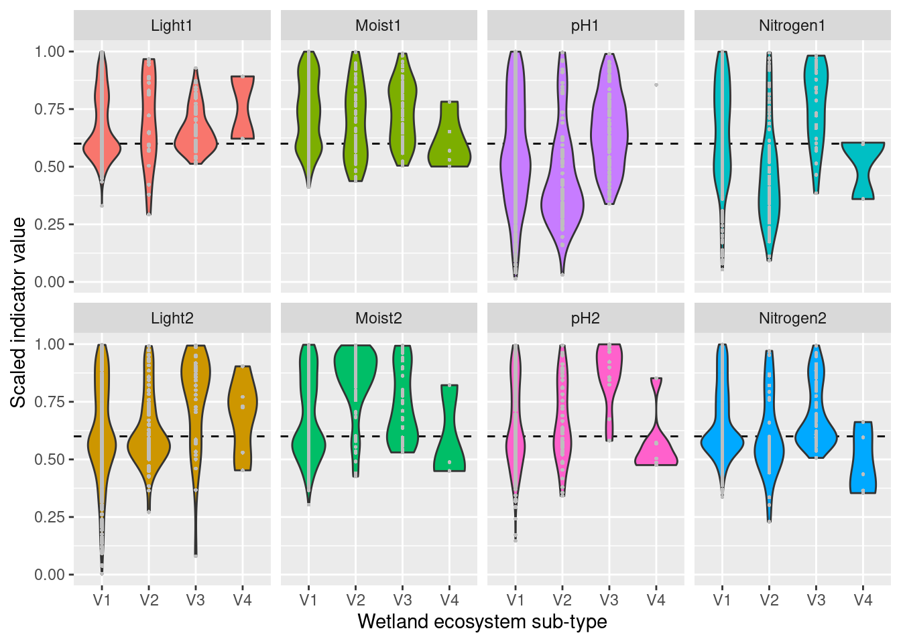

# Functional Plant Indicators - Wetlands {#functional-plant-indicators-wetland}

<br />

Norwegian name: **Vegetasjon og fuktighet/lys/pH/nitrogen**


_Author and date:_

Joachim Töpper

May 2023

<br />

<!-- Load all you dependencies here -->


<!-- Limit code block height and force scrolling -->
<style type="text/css">
pre {
  max-height: 300px;
  overflow-y: auto;
}

pre[class] {
  max-height: 200px;
}
</style>


```{=html}
<div class="tabwid"><style>.cl-8374a1d6{table-layout:auto;}.cl-836ca8b4{font-family:'DejaVu Sans';font-size:11pt;font-weight:bold;font-style:normal;text-decoration:none;color:rgba(0, 0, 0, 1.00);background-color:transparent;}.cl-836ca8be{font-family:'DejaVu Sans';font-size:11pt;font-weight:normal;font-style:normal;text-decoration:none;color:rgba(0, 0, 0, 1.00);background-color:transparent;}.cl-83706d96{margin:0;text-align:left;border-bottom: 0 solid rgba(0, 0, 0, 1.00);border-top: 0 solid rgba(0, 0, 0, 1.00);border-left: 0 solid rgba(0, 0, 0, 1.00);border-right: 0 solid rgba(0, 0, 0, 1.00);padding-bottom:5pt;padding-top:5pt;padding-left:5pt;padding-right:5pt;line-height: 1;background-color:transparent;}.cl-83708a7e{background-color:rgba(173, 216, 230, 1.00);vertical-align: middle;border-bottom: 1.5pt solid rgba(102, 102, 102, 1.00);border-top: 1.5pt solid rgba(102, 102, 102, 1.00);border-left: 0 solid rgba(0, 0, 0, 1.00);border-right: 0 solid rgba(0, 0, 0, 1.00);margin-bottom:0;margin-top:0;margin-left:0;margin-right:0;}.cl-83708a88{background-color:transparent;vertical-align: middle;border-bottom: 0.75pt solid rgba(102, 102, 102, 1.00);border-top: 0 solid rgba(0, 0, 0, 1.00);border-left: 0 solid rgba(0, 0, 0, 1.00);border-right: 0 solid rgba(0, 0, 0, 1.00);margin-bottom:0;margin-top:0;margin-left:0;margin-right:0;}.cl-83708a92{background-color:transparent;vertical-align: middle;border-bottom: 1.5pt solid rgba(102, 102, 102, 1.00);border-top: 0.75pt solid rgba(102, 102, 102, 1.00);border-left: 0 solid rgba(0, 0, 0, 1.00);border-right: 0 solid rgba(0, 0, 0, 1.00);margin-bottom:0;margin-top:0;margin-left:0;margin-right:0;}</style><table data-quarto-disable-processing='true' class='cl-8374a1d6'><thead><tr style="overflow-wrap:break-word;"><th class="cl-83708a7e"><p class="cl-83706d96"><span class="cl-836ca8b4">Ecosystem</span></p></th><th class="cl-83708a7e"><p class="cl-83706d96"><span class="cl-836ca8b4">Økologisk egenskap</span></p></th><th class="cl-83708a7e"><p class="cl-83706d96"><span class="cl-836ca8b4">ECT class</span></p></th></tr></thead><tbody><tr style="overflow-wrap:break-word;"><td class="cl-83708a88"><p class="cl-83706d96"><span class="cl-836ca8be">våtmark</span></p></td><td class="cl-83708a88"><p class="cl-83706d96"><span class="cl-836ca8be">Primærproduksjon</span></p></td><td class="cl-83708a88"><p class="cl-83706d96"><span class="cl-836ca8be">Functional state characteristic</span></p></td></tr><tr style="overflow-wrap:break-word;"><td class="cl-83708a92"><p class="cl-83706d96"><span class="cl-836ca8be">våtmark</span></p></td><td class="cl-83708a92"><p class="cl-83706d96"><span class="cl-836ca8be">Abiotiske forhold</span></p></td><td class="cl-83708a92"><p class="cl-83706d96"><span class="cl-836ca8be">Functional state characteristic</span></p></td></tr></tbody></table></div>
```

<br />


Indicators described in this chapter:

- Moisture
- Light
- pH
- Nitrogen


<!-- Don't remove these three html lines -->
<br />
<br />
<hr />

## Introduction {#intro-fpiw}
Functional plant indicators can be used to describe the functional signature of plant communities by calculating community-weighted means of functional trait values for plant communities (Diekmann 2003). The functional signature of plant communities may be indicative of ecosystem identity, depending on which functional plant indicator we look at (cf. Töpper et al. 2018). For instance, using an indicator for moisture one would find a functional signature with higher moisture values for plant communities in mires compared to e.g. grasslands or forests. Deviations in the functional signature of such an indicator beyond a certain range of indicator values (as there of course is natural variation of functional signatures within an ecosystem type) may be related to a reduction in ecological condition. 

Here, we combine functional indicator data with field sampled plant community data from the Norwegian nature monitoring program ANO (Tingstad et al. 2019) for wetland ecosystems. We calculate the functional signature of plant communities in the monitored sites with respect to light, moisture, pH and nitrogen. These functional signatures are then compared to reference distributions of functional signature, separately for each wetland ecosystem type, calculated from 'generalized species lists' underlying the Norwegian categorization system for eco-diversity (Halvorsen et al. 2020). These plant functional type indicators are developed following the principles and technical protocol of the IBECA framework (Jakobsson et al. 2021, Töpper & Jakobsson 2021).

Parallel indicator sets are explored and developed for [semi-natural ecosystems](#functional-plant-indicators-seminat) and naturally [open ecosystems](#functional-plant-indicators-open).

## About the underlying data {#underlying-data-fpiw}
We use three sets of data for building indicators for ecological condition:

- as test data we use plant community data from the ANO monitoring scheme (cf. Tingstad et al. 2019)
- as reference data we use generalized species lists from the Norwegian categorization system for eco-diversity (NiN) (cf. Halvorsen et al. 2020)
- Swedish plant indicator data for light, moisture, pH, and nitrogen from Tyler et al. (2021)

(1) **ANO monitoring data**:
ANO stands for _areal-representativ naturovervåking_, i.e. _area representative nature monitoring_. 1000 sites are randomly distributed across mainland Norway and visitied within a 5-year cycle. Each ANO site spans a 500 x 500 m grid cell, and the data collection at each ANO site includes up to 12 evenly distributed vegetation analyses in 1 x 1 m plots (up to 12, because some of these evenly distributed points may be in water or otherwise inaccessible). For the vegetation analyses, the cover of each vascular plant species in the plot is recorded. Every vegetation analysis is accompanied by an assessment of the ecosystem the plot lies in, including ecosystem type and some additional variables related to ecosystem-specific drivers of state. In the wetland-analysis in this document, we only use the plots which were classified as one of the wetland ecosystem types in the Norwegian categorization system for eco-diversity (NiN).
In the analysis in this document, we use the data available on Miljødirektoratets kartkatalog (https://kartkatalog.miljodirektoratet.no/Dataset/Details/2054), which comprises data from the first three ANO-years, 2019-2021, and a total of 8887 plots in 498 sites.

(2) **NiN reference data**:
The generalized species lists underlying the ecosystem categorization in [NiN](https://artsdatabanken.no/NiN) represent expert-compiled species lists based on empirical evidence from the literature and expert knowledge of the systems and their species. In these lists, every species is assigned an abundance value on a 6-step scale, with each step representing a range for the 'expected combination of frequency and cover' of occurrence 

    -   1 = \< 1/32

    -   2 = 1/32 - 1/8

    -   3 = 1/8 - 3/8

    -   4 = 3/8 - 4/5

    -   5 = 3/8 - 4/5 + dominance

    -   6 = \> 4/5

For the purpose of this project, these steps are simplified to maximum _expected combination of frequency and cover_, whereby steps 4 & 5 are assigned 0.6 and 0.8, respectively, in order to distinguish between them.

(3) **The Swedish plant indicator set** published by Tyler et al. (2021) contains a large collection of plant indicators based on the Swedish flora, which is well representative of the Norwegian flora as well. From this set, we decided to include indicator data for light, moisture, pH, and nitrogen for wetlands as these are thought to be subject to potential change due to shrub/tree encroachment, drainage, and pollution.


### Representativity in time and space {#representativity-fpiw}
For wetlands, the ANO data contain 1351 plots in 330 sites, in principle distributed randomly across the country. As wetlands occur more often in certain regions of Norway than in others, the amount of plots and sites is not equal among Norway's five regions. The 1351
<!-- I cannot recreate this number. Use in-line R code, here and elsewhere in similar situations -->
plots are distributed across regions in the following way:

- Northern Norway: 416
- Central Norway:  361
- Eastern Norway:  294
- Western Norway:  150
- Southern Norway: 126

### Temporal coverage {#representativity-temporal-fpiw}
The evaluation data cover the first three years, 2019-2021, of the first 5-year-cycle in the ANO monitoring scheme. Thus there is no actual time series to these data, and the indicator evaluation does therefore not include any temporal analyses.


## Collinearities with other indicators
Collinearity could occur with other indicators that are responding to the same drivers/pressures, but no really problematic issues have been discussed.

## Reference state and values {#ref-state-fpiw}
### Reference state {#ref-state2-fpiw}
The reference state is defined via the functional signature of the generalized species lists in NiN (see also Töpper et al. 2018). By bootstrapping the species lists (see details further below) and calculating community-weighted means of functional plant indicators for every re-sampled community, we describe the reference state as a distribution of indicator values for each respective plant functional indicator. These distributions are calculated for minor ecosystem types ( _grunntyper_ or _kartleggingsenheter_ at a 1:5000 mapping scale) within the major ecosystem types (hovedtyper) in NiN. A more extensive discussion on the use of reference communities can be found in Jakobsson et al. (2020).


### Reference values, thresholds for defining _good ecological condition_, minimum and/or maximum values {#ref-values-fpiw}
In this analysis, we derive scaling values from statistical (here, non-parametric) distributions (see Jakobsson et al. 2010). For each ecosystem sub-type and plant functional indicator, the reference value is defined as the median value of the indicator value distribution. As in most cases the distributions naturally are two-sided (but see the Heat-requirement indicator in the mountain assessment for an example of a one-sided plant functional indicator, Fremstad et al. 2022), and deviation from the optimal state thus may occur in both direction (e.g. indicating too low or too high pH), we need to define two threshold values for good ecological condition as well as both a minimum and maximum value. In line with previous assessments of ecological condition for Norwegian forests and mountains, we define a lower and an upper threshold value via the 95% confidence interval of the reference distribution, i.e. its 0.025 and 0.975 quantiles. The minimum and maximum values are given by the minimum and maximum of the possible indicator values for each respective plant functional indicator. For details on the scaling principles in IBECA, please see Töpper & Jakobsson (2021).


## Uncertainties {#uncertainties-fpiw}
We can calculate a mean indicator value (after scaling) for every region (or any other delimited area of interest) as well as its corresponding standard error as a measure of spatial uncertainty for a geographical area.


## References {#references-fpiw}
Diekmann, M. 2003. Species indicator values as an important tool in applied plant ecology - a review. Basic and Applied Ecology 4: 493-506, doi:10.1078/1439-1791-00185

Framstad, E., Kolstad, A. L., Nybø, S., Töpper, J. & Vandvik, V. 2022. The condition of forest and mountain ecosystems in Norway. Assessment by the IBECA method. NINA Report 2100. Norwegian Institute for Nature Research.

Halvorsen, R., Skarpaas, O., Bryn, A., Bratli, H., Erikstad, L., Simensen, T., & Lieungh, E. (2020). Towards a systematics of ecodiversity: The EcoSyst framework. Global Ecology and Biogeography, 29(11), 1887-1906. doi:10.1111/geb.13164

Jakobsson, S., Töpper, J.P., Evju, M., Framstad, E., Lyngstad, A., Pedersen, B., Sickel, H., Sverdrup-Thygeson, A., Vandvik. V., Velle, L.G., Aarrestad, P.A. & Nybø, S. 2020. Setting reference levels and limits for good ecological condition in terrestrial ecosystems. Insights from a case study based on the IBECA approach. Ecological Indicators 116: 106492.

Jakobsson, S., Evju, M., Framstad, E., Imbert, A., Lyngstad, A., Sickel, H., Sverdrup-Thygeson, A., Töpper, J., Vandvik, V., Velle, L.G., Aarrestad, P.A. & Nybø, S. 2021. An index-based assessment of ecological condition and its links to international frameworks. Ecological Indicators 124: 107252.

Tingstad, L., Evju, M., Sickel, H., & Töpper, J. 2019. Utvikling av nasjonal arealrepresentativ naturovervåking (ANO). Forslag til gjennomføring, protokoller og kostnadsvurderinger med utgangspunkt i erfaringer fra uttesting i Trøndelag. NINA Rapport 1642.

Töpper, J. & Jakobsson, S. 2021. The Index-Based Ecological Condition Assessment (IBECA) - Technical protocol, version 1.0. NINA Report 1967. Norwegian Institute for Nature Research.

Töpper, J., Velle, L.G. & Vandvik, V. 2018. Developing a method for assessment of ecological state based on indicator values after Ellenberg and Grime (revised edition). NINA Report 1529b. Norwegian Institute for Nature Research.

Tyler, T., Herbertsson, L., Olofsson, J., & Olsson, P. A. 2021. Ecological indicator and traits values for Swedish vascular plants. Ecological In-dicators, 120. doi:10.1016/j.ecolind.2020.106923


## Analyses {#analyses-fpiw}
### Data sets
<!-- Please print the entire workflow with echo=T. Also, simply reading cached data creates loose ends - I cant find out where this data comes from. You may also chose to read tin this data (or a cached version of it) way at the top of the file, so that you can add some in-line R code for the summary stats in the introduction part (see previous comments)-->

Import ANO data:

```r
# Add data from cache
ANO.sp<-readRDS(paste0(here::here(),"/data/cache/ANO.sp.RDS"))
ANO.geo<-readRDS(paste0(here::here(),"/data/cache/ANO.geo.RDS"))

# st_layers(dsn = "/data/P-Prosjekter2/41201785_okologisk_tilstand_2022_2023/data/Naturovervaking_eksport.gdb")
# ANO.sp <- st_read("/data/P-Prosjekter2/41201785_okologisk_tilstand_2022_2023/data/Naturovervaking_eksport.gdb",
#                    layer="ANO_Art")
# ANO.geo <- st_read("/data/P-Prosjekter2/41201785_okologisk_tilstand_2022_2023/data/Naturovervaking_eksport.gdb",
#                   layer="ANO_SurveyPoint")
# head(ANO.sp)
# head(ANO.geo)
```

Import Plant indicators from Tyler et al. (2021):

```r
## Tyler indicator data
## data from cache
ind.dat <-readRDS(paste0(here::here(),"/data/cache/ind.dat.RDS"))
# ind.dat <- read.table("/data/P-Prosjekter2/41201785_okologisk_tilstand_2022_2023/data/functional plant indicators/Tyler et al_Swedish plant indicators.txt",
#                         sep = '\t', header=T, quote = '')
# head(ind.dat)
```

Import Generalized species lists NiN

```r
# data from cache
Eco_State<-readRDS(paste0(here::here(),"/data/cache/Eco_State.RDS"))
# load("/data/P-Prosjekter2/41201785_okologisk_tilstand_2022_2023/functional plant indicators/reference from NiN/Eco_State.RData")
# str(Eco_State)
```

#### Data handling
- Checking for errors
- Checking species nomenclature in the different species lists to make species and indicator data possible to merge
- Merging indicator data with monitoring data and indicator data with reference data
(not shown here, but documented in the code)
<!-- Please include everything like this, but you can chose to have it take up less space by adding the attr.output option, like this: -->


```r

### Plant indicator data
names(ind.dat)
names(ind.dat)[1] <- 'species'
ind.dat$species <- as.factor(ind.dat$species)
summary(ind.dat$species)
ind.dat <- ind.dat[!is.na(ind.dat$species),] # removing species-NAs
ind.dat[,'species.orig'] <- ind.dat[,'species'] # make a backup of the original species variable
ind.dat[,'species'] <- word(ind.dat[,'species'], 1,2) # trimming away sub-species & co, and descriptor info

# the trimming above leaves some duplicates that need to be taken care of
ind.dat[duplicated(ind.dat[,'species']),"species"]
ind.dat.dup <- ind.dat[duplicated(ind.dat[,'species']),"species"]
ind.dat[ind.dat$species %in% ind.dat.dup,c("Light","Moisture","Soil_reaction_pH","Nitrogen","species.orig","species")]
ind.dat <- ind.dat %>% filter( !(species.orig %in% list("Ammophila arenaria x Calamagrostis epigejos",
                                                            "Anemone nemorosa x ranunculoides",
                                                            "Armeria maritima ssp. elongata",
                                                            "Asplenium trichomanes ssp. quadrivalens",
                                                            "Calystegia sepium ssp. spectabilis",
                                                            "Campanula glomerata 'Superba'",
                                                            "Dactylorhiza maculata ssp. fuchsii",
                                                            "Erigeron acris ssp. droebachensis",
                                                            "Erigeron acris ssp. politus",
                                                            "Erysimum cheiranthoides L. ssp. alatum",
                                                            "Euphrasia nemorosa x stricta var. brevipila",
                                                            "Galium mollugo x verum",
                                                            "Geum rivale x urbanum",
                                                            "Hylotelephium telephium (ssp. maximum)",
                                                            "Juncus alpinoarticulatus ssp. rariflorus",
                                                            "Lamiastrum galeobdolon ssp. argentatum",
                                                            "Lathyrus latifolius ssp. heterophyllus",
                                                            "Medicago sativa ssp. falcata",
                                                            "Medicago sativa ssp. x varia",
                                                            "Monotropa hypopitys ssp. hypophegea",
                                                            "Ononis spinosa ssp. hircina",
                                                            "Ononis spinosa ssp. procurrens",
                                                            "Pilosella aurantiaca ssp. decolorans",
                                                            "Pilosella aurantiaca ssp. dimorpha",
                                                            "Pilosella cymosa ssp. gotlandica",
                                                            "Pilosella cymosa ssp. praealta",
                                                            "Pilosella officinarum ssp. peleteranum",
                                                            "Poa x jemtlandica (Almq.) K. Richt.",
                                                            "Poa x herjedalica Harry Sm.",
                                                            "Ranunculus peltatus ssp. baudotii",
                                                            "Sagittaria natans x sagittifolia",
                                                            "Salix repens ssp. rosmarinifolia",
                                                            "Stellaria nemorum L. ssp. montana",
                                                            "Trichophorum cespitosum ssp. germanicum")
) )

# checking duplicates again
ind.dat[duplicated(ind.dat[,'species']),"species"]
ind.dat.dup <- ind.dat[duplicated(ind.dat[,'species']),"species"]
ind.dat[ind.dat$species %in% ind.dat.dup,c("Light","Moisture","Soil_reaction_pH","Nitrogen","species.orig","species")]
# getting rid of sect. for Hieracium
ind.dat <- ind.dat %>% mutate(species=gsub("sect. ","",species.orig))
ind.dat[,'species'] <- word(ind.dat[,'species'], 1,2)

ind.dat[duplicated(ind.dat[,'species']),"species"]
ind.dat.dup <- ind.dat[duplicated(ind.dat[,'species']),"species"]
ind.dat[ind.dat$species %in% ind.dat.dup,c("Light","Moisture","Soil_reaction_pH","Nitrogen","species.orig","species")]
# only hybrids left -> get rid of these
ind.dat <- ind.dat[!duplicated(ind.dat[,'species']),]
ind.dat[duplicated(ind.dat[,'species']),"species"]

ind.dat$species <- as.factor(ind.dat$species)
summary(ind.dat$species)
# no duplicates left

head(ind.dat)


### ANO monitoring data

head(ANO.sp)
head(ANO.geo)

## fix NiN information
ANO.geo$hovedtype_rute <- substr(ANO.geo$kartleggingsenhet_1m2,1,3) # take the 3 first characters
ANO.geo$hovedtype_rute <- gsub("-", "", ANO.geo$hovedtype_rute) # remove hyphen
unique(as.factor(ANO.geo$hovedtype_rute))

## fix NiN-variables
colnames(ANO.geo)
colnames(ANO.geo)[42:47] <- c("groeftingsintensitet",
                              "bruksintensitet",
                              "beitetrykk",
                              "slatteintensitet",
                              "tungekjoretoy",
                              "slitasje")
head(ANO.geo)

# remove variable code in the data
ANO.geo$groeftingsintensitet <- gsub("7GR-GI_", "", ANO.geo$groeftingsintensitet) 
unique(ANO.geo$groeftingsintensitet)
ANO.geo$groeftingsintensitet <- gsub("X", "NA", ANO.geo$groeftingsintensitet)
unique(ANO.geo$groeftingsintensitet)
ANO.geo$groeftingsintensitet <- as.numeric(ANO.geo$groeftingsintensitet)
unique(ANO.geo$groeftingsintensitet)

ANO.geo$bruksintensitet <- gsub("7JB-BA_", "", ANO.geo$bruksintensitet) 
unique(ANO.geo$bruksintensitet)
ANO.geo$bruksintensitet <- gsub("X", "NA", ANO.geo$bruksintensitet)
unique(ANO.geo$bruksintensitet)
ANO.geo$bruksintensitet <- as.numeric(ANO.geo$bruksintensitet)
unique(ANO.geo$bruksintensitet)

ANO.geo$beitetrykk <- gsub("7JB-BT_", "", ANO.geo$beitetrykk) 
unique(ANO.geo$beitetrykk)
ANO.geo$beitetrykk <- gsub("X", "NA", ANO.geo$beitetrykk)
unique(ANO.geo$beitetrykk)
ANO.geo$beitetrykk <- as.numeric(ANO.geo$beitetrykk)
unique(ANO.geo$beitetrykk)

ANO.geo$slatteintensitet <- gsub("7JB-SI_", "", ANO.geo$slatteintensitet) 
unique(ANO.geo$slatteintensitet)
ANO.geo$slatteintensitet <- gsub("X", "NA", ANO.geo$slatteintensitet)
unique(ANO.geo$slatteintensitet)
ANO.geo$slatteintensitet <- as.numeric(ANO.geo$slatteintensitet)
unique(ANO.geo$slatteintensitet)

ANO.geo$tungekjoretoy <- gsub("7TK_", "", ANO.geo$tungekjoretoy) 
unique(ANO.geo$tungekjoretoy)
ANO.geo$tungekjoretoy <- gsub("X", "NA", ANO.geo$tungekjoretoy)
unique(ANO.geo$tungekjoretoy)
ANO.geo$tungekjoretoy <- as.numeric(ANO.geo$tungekjoretoy)
unique(ANO.geo$tungekjoretoy)

ANO.geo$slitasje <- gsub("7SE_", "", ANO.geo$slitasje) 
unique(ANO.geo$slitasje)
ANO.geo$slitasje <- gsub("X", "NA", ANO.geo$slitasje)
unique(ANO.geo$slitasje)
ANO.geo$slitasje <- as.numeric(ANO.geo$slitasje)
unique(ANO.geo$slitasje)

## check that every point is present only once
length(levels(as.factor(ANO.geo$ano_flate_id)))
length(levels(as.factor(ANO.geo$ano_punkt_id)))
summary(as.factor(ANO.geo$ano_punkt_id))
# there's many double presences, probably some wrong registrations of point numbers,
# but also double registrations (e.g. ANO0159_55)
# CHECK THIS when preparing ecosystem-datasets for scaling


# fix species names
ANO.sp$Species <- ANO.sp$art_navn
unique(as.factor(ANO.sp$Species))
ANO.sp[,'Species'] <- word(ANO.sp[,'Species'], 1,2) # lose subspecies
ANO.sp$Species <- str_to_title(ANO.sp$Species) # make first letter capital
ANO.sp$Species <- gsub("( .*)","\\L\\1",ANO.sp$Species,perl=TRUE) # make capital letters after hyphen to lowercase
ANO.sp$Species <- gsub("( .*)","\\L\\1",ANO.sp$Species,perl=TRUE) # make capital letters after space to lowercase

## merge species data with indicators
ANO.sp.ind <- merge(x=ANO.sp[,c("Species", "art_dekning", "ParentGlobalID")], 
                y= ind.dat[,c("species", "Light", "Moisture", "Soil_reaction_pH", "Nitrogen")],
                by.x="Species", by.y="species", all.x=T)
summary(ANO.sp.ind)


## checking which species didn't find a match
unique(ANO.sp.ind[is.na(ANO.sp.ind$Moisture),'Species'])

# fix species name issues
ind.dat <- ind.dat %>% 
  mutate(species=str_replace(species,"Aconitum lycoctonum", "Aconitum septentrionale")) %>% 
  mutate(species=str_replace(species,"Carex simpliciuscula", "Kobresia simpliciuscula")) %>%
  mutate(species=str_replace(species,"Carex myosuroides", "Kobresia myosuroides")) %>%
  mutate(species=str_replace(species,"Clinopodium acinos", "Acinos arvensis")) %>%
  mutate(species=str_replace(species,"Artemisia rupestris", "Artemisia norvegica")) %>%
  mutate(species=str_replace(species,"Cherleria biflora", "Minuartia biflora"))

ANO.sp <- ANO.sp %>% 
  mutate(Species=str_replace(Species,"Arctous alpinus", "Arctous alpina")) %>%
  mutate(Species=str_replace(Species,"Betula tortuosa", "Betula pubescens")) %>%
  mutate(Species=str_replace(Species,"Blysmopsis rufa", "Blysmus rufus")) %>%
  mutate(Species=str_replace(Species,"Cardamine nymanii", "Cardamine pratensis")) %>%
  mutate(Species=str_replace(Species,"Carex adelostoma", "Carex buxbaumii")) %>%
  mutate(Species=str_replace(Species,"Carex leersii", "Carex echinata")) %>%
  mutate(Species=str_replace(Species,"Carex paupercula", "Carex magellanica")) %>%
  mutate(Species=str_replace(Species,"Carex simpliciuscula", "Kobresia simpliciuscula")) %>%
  mutate(Species=str_replace(Species,"Carex viridula", "Carex flava")) %>%
  mutate(Species=str_replace(Species,"Chamaepericlymenum suecicum", "Cornus suecia")) %>%
  mutate(Species=str_replace(Species,"Cicerbita alpina", "Lactuca alpina")) %>%
  mutate(Species=str_replace(Species,"Empetrum hermaphroditum", "Empetrum nigrum")) %>%
  mutate(Species=str_replace(Species,"Festuca prolifera", "Festuca rubra")) %>%
  mutate(Species=str_replace(Species,"Galium album", "Galium mollugo")) %>%
  mutate(Species=str_replace(Species,"Galium elongatum", "Galium palustre")) %>%
  mutate(Species=str_replace(Species,"Helictotrichon pratense", "Avenula pratensis")) %>%
  mutate(Species=str_replace(Species,"Helictotrichon pubescens", "Avenula pubescens")) %>%
  mutate(Species=str_replace(Species,"Hieracium alpina", "Hieracium Alpina")) %>%
  mutate(Species=str_replace(Species,"Hieracium alpinum", "Hieracium Alpina")) %>%
  mutate(Species=str_replace(Species,"Hieracium hieracium", "Hieracium Hieracium")) %>%
  mutate(Species=str_replace(Species,"Hieracium hieracioides", "Hieracium umbellatum")) %>%
  mutate(Species=str_replace(Species,"Hieracium murorum", "Hieracium Vulgata")) %>%
  mutate(Species=str_replace(Species,"Hieracium oreadea", "Hieracium Oreadea")) %>%
  mutate(Species=str_replace(Species,"Hieracium prenanthoidea", "Hieracium Prenanthoidea")) %>%
  mutate(Species=str_replace(Species,"Hieracium vulgata", "Hieracium Vulgata")) %>%
  mutate(Species=str_replace(Species,"Hieracium pilosella", "Pilosella officinarum")) %>%
  mutate(Species=str_replace(Species,"Hieracium vulgatum", "Hieracium umbellatum")) %>%
  mutate(Species=str_replace(Species,"Hierochloã« alpina", "Hierochloë alpina")) %>%
  mutate(Species=str_replace(Species,"Hierochloã« hirta", "Hierochloë hirta")) %>%
  mutate(Species=str_replace(Species,"Hierochloã« odorata", "Hierochloë odorata")) %>%
  mutate(Species=str_replace(Species,"Listera cordata", "Neottia cordata")) %>%
  mutate(Species=str_replace(Species,"Leontodon autumnalis", "Scorzoneroides autumnalis")) %>%
  mutate(Species=str_replace(Species,"Loiseleuria procumbens", "Kalmia procumbens")) %>%
  mutate(Species=str_replace(Species,"Mycelis muralis", "Lactuca muralis")) %>%
  mutate(Species=str_replace(Species,"Omalotheca supina", "Gnaphalium supinum")) %>%
  mutate(Species=str_replace(Species,"Omalotheca norvegica", "Gnaphalium norvegicum")) %>%
  mutate(Species=str_replace(Species,"Omalotheca sylvatica", "Gnaphalium sylvaticum")) %>%
  mutate(Species=str_replace(Species,"Oreopteris limbosperma", "Thelypteris limbosperma")) %>%
  mutate(Species=str_replace(Species,"Oxycoccus microcarpus", "Vaccinium microcarpum")) %>%
  mutate(Species=str_replace(Species,"Oxycoccus palustris", "Vaccinium oxycoccos")) %>%
  mutate(Species=str_replace(Species,"Phalaris minor", "Phalaris arundinacea")) %>%
  mutate(Species=str_replace(Species,"Pinus unicinata", "Pinus mugo")) %>%
  mutate(Species=str_replace(Species,"Poa alpigena", "Poa pratensis")) %>%
  mutate(Species=str_replace(Species,"Poa angustifolia", "Poa pratensis")) %>%
  mutate(Species=str_replace(Species,"Pyrola grandiflora", "Pyrola rotundifolia")) %>%
  mutate(Species=str_replace(Species,"Rumex alpestris", "Rumex acetosa")) %>%
  mutate(Species=str_replace(Species,"Syringa emodi", "Syringa vulgaris")) %>%
  mutate(Species=str_replace(Species,"Taraxacum crocea", "Taraxacum officinale")) %>%
  mutate(Species=str_replace(Species,"Taraxacum croceum", "Taraxacum officinale")) %>%
  mutate(Species=str_replace(Species,"Trientalis europaea", "Lysimachia europaea")) %>%
  mutate(Species=str_replace(Species,"Trifolium pallidum", "Trifolium pratense"))

## merge species data with indicators
ANO.sp.ind <- merge(x=ANO.sp[,c("Species", "art_dekning", "ParentGlobalID")], 
                    y= ind.dat[,c("species", "Light", "Moisture", "Soil_reaction_pH", "Nitrogen")],
                    by.x="Species", by.y="species", all.x=T)
summary(ANO.sp.ind)
# checking which species didn't find a match
unique(ANO.sp.ind[is.na(ANO.sp.ind$Moisture),'Species'])
# don't find synonyms for these in the ind lists

## trimming away the points without information on NiN, species or cover
ANO.sp.ind <- ANO.sp.ind[!is.na(ANO.sp.ind$Species),]
ANO.sp.ind <- ANO.sp.ind[!is.na(ANO.sp.ind$art_dekning),]


summary(ANO.sp.ind)
head(ANO.sp.ind)
rm(ANO.sp)


### NiN reference data - data handling

## generalized species lists from NiN
str(Eco_State)

# species
Eco_State$Concept_Data$Species$Species_List$species
# environments
t(Eco_State$Concept_Data$Env$Env_Data)
# abundances
t(Eco_State$Concept_Data$Species$Species_Data)

## transposing abundance data
NiN.sp <- t(Eco_State$Concept_Data$Species$Species_Data)
NiN.sp <- as.data.frame(NiN.sp)
NiN.sp$sp <- as.factor(as.vector(Eco_State$Concept_Data$Species$Species_List$species))
# only genus and species name
NiN.sp$sp <- word(NiN.sp$sp, 1,2)
NiN.sp$spgr <- as.factor(as.vector(Eco_State$Concept_Data$Species$Species_List$art.code))
# if relevant, trimming to desired species groups (for forests e.g. removing trees)
#NiN.sp <- NiN.sp[NiN.sp$spgr!="a1a",]

## environment data
NiN.env <- Eco_State$Concept_Data$Env$Env_Data

## merging with indicator values
NiN.sp.ind <- merge(NiN.sp,ind.dat, by.x="sp", by.y="species", all.x=T)
summary(NiN.sp.ind)

NiN.sp.ind[NiN.sp.ind==999] <- NA

## checking which species didn't find a match
unique(NiN.sp.ind[is.na(NiN.sp.ind$Moisture) & NiN.sp.ind$spgr %in% list("a1a","a1b","a1c"),'sp'])

## fix species name issues
ind.dat <- ind.dat %>% 
  mutate(species=str_replace(species,"Aconitum lycoctonum", "Aconitum septentrionale")) %>% 
  mutate(species=str_replace(species,"Carex simpliciuscula", "Kobresia simpliciuscula")) %>%
  mutate(species=str_replace(species,"Carex myosuroides", "Kobresia myosuroides")) %>%
  mutate(species=str_replace(species,"Clinopodium acinos", "Acinos arvensis")) %>%
  mutate(species=str_replace(species,"Artemisia rupestris", "Artemisia norvegica")) %>%
  mutate(species=str_replace(species,"Cherleria biflora", "Minuartia biflora"))

NiN.sp <- NiN.sp %>% 
  mutate(sp=str_replace(sp,"Aconitum lycoctonum", "Aconitum septentrionale")) %>% 
  mutate(sp=str_replace(sp,"Anagallis minima", "Lysimachia minima")) %>% 
  mutate(sp=str_replace(sp,"Arctous alpinus", "Arctous alpina")) %>%
  mutate(sp=str_replace(sp,"Betula tortuosa", "Betula pubescens")) %>%
  mutate(sp=str_replace(sp,"Blysmopsis rufa", "Blysmus rufus")) %>%
  mutate(sp=str_replace(sp,"Cardamine nymanii", "Cardamine pratensis")) %>%
  mutate(sp=str_replace(sp,"Carex adelostoma", "Carex buxbaumii")) %>%
  mutate(sp=str_replace(sp,"Carex leersii", "Carex echinata")) %>%
  mutate(sp=str_replace(sp,"Carex paupercula", "Carex magellanica")) %>%
  mutate(sp=str_replace(sp,"Carex simpliciuscula", "Kobresia simpliciuscula")) %>%
  mutate(sp=str_replace(sp,"Carex _vacillans", "Carex vacillans")) %>%
  mutate(sp=str_replace(sp,"Carex viridula", "Carex flava")) %>%
  mutate(sp=str_replace(sp,"Chamaepericlymenum suecicum", "Cornus suecia")) %>%
  mutate(sp=str_replace(sp,"Cornus suecia", "Cornus suecica")) %>%
  mutate(sp=str_replace(sp,"Cicerbita alpina", "Lactuca alpina")) %>%
  mutate(sp=str_replace(sp,"Dactylorhiza sphagnicola", "Dactylorhiza majalis")) %>%
  mutate(sp=str_replace(sp,"Diphasiastrum complanatum", "Lycopodium complanatum")) %>%
  mutate(sp=str_replace(sp,"Elymus alaskanus", "Elymus kronokensis")) %>%
  mutate(sp=str_replace(sp,"Empetrum hermaphroditum", "Empetrum nigrum")) %>%
  mutate(sp=str_replace(sp,"Erigeron eriocephalus", "Erigeron uniflorus")) %>%
  mutate(sp=str_replace(sp,"Festuca prolifera", "Festuca rubra")) %>%
  mutate(sp=str_replace(sp,"Galium album", "Galium mollugo")) %>%
  mutate(sp=str_replace(sp,"Galium elongatum", "Galium palustre")) %>%
  mutate(sp=str_replace(sp,"Glaux maritima", "Lysimachia maritima")) %>%
  mutate(sp=str_replace(sp,"Helictotrichon pratense", "Avenula pratensis")) %>%
  mutate(sp=str_replace(sp,"Helictotrichon pubescens", "Avenula pubescens")) %>%
  mutate(sp=str_replace(sp,"Hieracium alpina", "Hieracium Alpina")) %>%
  mutate(sp=str_replace(sp,"Hieracium alpinum", "Hieracium Alpina")) %>%
  mutate(sp=str_replace(sp,"Hieracium aurantiacum", "Pilosella aurantiaca")) %>%
  mutate(sp=str_replace(sp,"Hieracium hieracium", "Hieracium Hieracium")) %>%
  mutate(sp=str_replace(sp,"Hieracium hieracioides", "Hieracium umbellatum")) %>%
  mutate(sp=str_replace(sp,"Hieracium lactucella", "Pilosella lactucella")) %>%
  mutate(sp=str_replace(sp,"Hieracium murorum", "Hieracium Vulgata")) %>%
  mutate(sp=str_replace(sp,"Hieracium oreadea", "Hieracium Oreadea")) %>%
  mutate(sp=str_replace(sp,"Hieracium prenanthoidea", "Hieracium Prenanthoidea")) %>%
  mutate(sp=str_replace(sp,"Hieracium vulgata", "Hieracium Vulgata")) %>%
  mutate(sp=str_replace(sp,"Hieracium pilosella", "Pilosella officinarum")) %>%
  mutate(sp=str_replace(sp,"Hieracium vulgatum", "Hieracium umbellatum")) %>%
  mutate(sp=str_replace(sp,"Hierochloã« alpina", "Hierochloë alpina")) %>%
  mutate(sp=str_replace(sp,"Hierochloã« hirta", "Hierochloë hirta")) %>%
  mutate(sp=str_replace(sp,"Hierochloã« odorata", "Hierochloë odorata")) %>%
  mutate(sp=str_replace(sp,"Huperzia appressa", "Huperzia selago")) %>%
  mutate(sp=str_replace(sp,"Hylotelephium maximum", "Hylotelephium telephium")) %>%
  mutate(sp=str_replace(sp,"Lappula myosotis", "Lappula squarrosa")) %>%
  mutate(sp=str_replace(sp,"Lepidotheca suaveolens", "Matricaria discoidea")) %>%
  mutate(sp=str_replace(sp,"Listera cordata", "Neottia cordata")) %>%
  mutate(sp=str_replace(sp,"Leontodon autumnalis", "Scorzoneroides autumnalis")) %>%
  mutate(sp=str_replace(sp,"Loiseleuria procumbens", "Kalmia procumbens")) %>%
  mutate(sp=str_replace(sp,"Logfia arvensis", "Filago arvensis")) %>%
  mutate(sp=str_replace(sp,"Mentha _verticillata", "Mentha verticillata")) %>%
  mutate(sp=str_replace(sp,"Minuartia rubella", "Sabulina rubella")) %>%
  mutate(sp=str_replace(sp,"Minuartia stricta", "Sabulina stricta")) %>%
  mutate(sp=str_replace(sp,"Mycelis muralis", "Lactuca muralis")) %>%
  mutate(sp=str_replace(sp,"Omalotheca supina", "Gnaphalium supinum")) %>%
  mutate(sp=str_replace(sp,"Omalotheca norvegica", "Gnaphalium norvegicum")) %>%
  mutate(sp=str_replace(sp,"Omalotheca sylvatica", "Gnaphalium sylvaticum")) %>%
  mutate(sp=str_replace(sp,"Ononis arvensis", "Ononis spinosa")) %>%
  mutate(sp=str_replace(sp,"Oreopteris limbosperma", "Thelypteris limbosperma")) %>%
  mutate(sp=str_replace(sp,"Oxycoccus microcarpus", "Vaccinium microcarpum")) %>%
  mutate(sp=str_replace(sp,"Oxycoccus palustris", "Vaccinium oxycoccos")) %>%
  mutate(sp=str_replace(sp,"Phalaris minor", "Phalaris arundinacea")) %>%
  mutate(sp=str_replace(sp,"Phalaroides arundinacea", "Phalaris arundinacea")) %>%
  mutate(sp=str_replace(sp,"Pinus unicinata", "Pinus mugo")) %>%
  mutate(sp=str_replace(sp,"Platanthera montana", "Platanthera chlorantha")) %>%
  mutate(sp=str_replace(sp,"Poa alpigena", "Poa pratensis")) %>%
  mutate(sp=str_replace(sp,"Poa angustifolia", "Poa pratensis")) %>%
  mutate(sp=str_replace(sp,"Poa laxa", "Poa flexuosa")) %>%
  mutate(sp=str_replace(sp,"Poa _herjedalica", "Poa herjedalica")) %>%
  mutate(sp=str_replace(sp,"Poa _jemtlandica", "Poa jemtlandica")) %>%
  mutate(sp=str_replace(sp,"Poa lindebergii", "Poa arctica")) %>%
  mutate(sp=str_replace(sp,"Pyrola grandiflora", "Pyrola rotundifolia")) %>%
  mutate(sp=str_replace(sp,"Rhamnus catharticus", "Rhamnus cathartica")) %>%
  mutate(sp=str_replace(sp,"Rumex alpestris", "Rumex acetosa")) %>%
  mutate(sp=str_replace(sp,"Salix _fragilis", "Salix fragilis")) %>%
  mutate(sp=str_replace(sp,"Saxifraga _opdalensis", "Saxifraga opdalensis")) %>%
  mutate(sp=str_replace(sp,"Spergularia salina", "Spergularia marina")) %>%
  mutate(sp=str_replace(sp,"Syringa emodi", "Syringa vulgaris")) %>%
  mutate(sp=str_replace(sp,"Taraxacum crocea", "Taraxacum officinale")) %>%
  mutate(sp=str_replace(sp,"Taraxacum croceum", "Taraxacum officinale")) %>%
  mutate(sp=str_replace(sp,"Taraxacum erythrospermum", "Taraxacum officinale")) %>%
  mutate(sp=str_replace(sp,"Taraxacum hamatum", "Taraxacum officinale")) %>%
  mutate(sp=str_replace(sp,"Trientalis europaea", "Lysimachia europaea")) %>%
  mutate(sp=str_replace(sp,"Trifolium pallidum", "Trifolium pratense")) %>%
  mutate(sp=str_replace(sp,"Vicia orobus", "Vicia cassubica"))


## merge species data with indicators
NiN.sp.ind <- merge(NiN.sp,ind.dat, by.x="sp", by.y="species", all.x=T)
summary(NiN.sp.ind)

NiN.sp.ind[NiN.sp.ind==999] <- NA

# checking which species didn't find a match
unique(NiN.sp.ind[is.na(NiN.sp.ind$Moisture) & NiN.sp.ind$spgr %in% list("a1a","a1b","a1c"),'sp'])
# ok now

## matching with NiN ecosystem types - for wetlands
# NB! beware of rogue spaces in the 'Nature_type' & 'Sub_Type' variables, e.g. "Spring_Forest "
NiN.wetland <- NiN.sp.ind[,c("sp",paste(NiN.env[NiN.env$Nature_Type=="Mire","ID"]),colnames(ind.dat)[15:18])]   # Light, Moisture, Soil_reaction_pH, Nitrogen
NiN.wetland[1,]
names(NiN.wetland)

cbind(colnames(NiN.wetland),
      c("",
        'V3-C1a','V3-C1b','V3-C1c','V3-C1d','V3-C1e',
        'V1-C1a','V1-C1b','V1-C1c','V1-C1d','V1-C1e',
        'V1-C2a','V1-C2b','V1-C2c','V1-C2d',
        'V1-C3a','V1-C3b','V1-C3c','V1-C3d',
        'V1-C4a','V1-C4b','V1-C4c','V1-C4d',
        'V1-C4e','V1-C4f','V1-C4g','V1-C4h',
        'V3-C2','V1-C5',
        'V1-C6a','V1-C6b',
        'V1-C7a','V1-C7b',
        'V1-C8a','V1-C8b',
        'V2-C1a','V2-C1b',
        'V2-C2a','V2-C2b',
        'V2-C3a','V2-C3b',
        "V4-C2","V4-C3",
        "","",
        'V8-C1','V8-C2','V8-C3',
        rep("",10),
        rep("",4)
      )
)

NiN.wetland <- NiN.wetland[,c(1:43,46:48,59:62)]
colnames(NiN.wetland)[2:46] <- c('V3-C1a','V3-C1b','V3-C1c','V3-C1d','V3-C1e',
                              'V1-C1a','V1-C1b','V1-C1c','V1-C1d','V1-C1e',
                              'V1-C2a','V1-C2b','V1-C2c','V1-C2d',
                              'V1-C3a','V1-C3b','V1-C3c','V1-C3d',
                              'V1-C4a','V1-C4b','V1-C4c','V1-C4d',
                              'V1-C4e','V1-C4f','V1-C4g','V1-C4h',
                              'V3-C2','V1-C5',
                              'V1-C6a','V1-C6b',
                              'V1-C7a','V1-C7b',
                              'V1-C8a','V1-C8b',
                              'V2-C1a','V2-C1b',
                              'V2-C2a','V2-C2b',
                              'V2-C3a','V2-C3b',
                              'V4-C2','V4-C3',
                              'V8-C1','V8-C2','V8-C3'
)
head(NiN.wetland)


# translating the abundance classes into %-cover
coverscale <- data.frame(orig=0:6,
                         cov=c(0,1/32,1/8,3/8,0.6,4/5,1)
)

NiN.wetland.cov <- NiN.wetland
colnames(NiN.wetland.cov)
for (i in 2:46) {
  NiN.wetland.cov[,i] <- coverscale[,2][ match(NiN.wetland[,i], 0:6 ) ]
}

NiN.wetland.cov$sp <- as.factor(NiN.wetland.cov$sp)
```


This leaves us with the monitoring data including plant indicators (ANO.sp.ind) and the reference data including plant indicators (NiN.wetland.cov):

<!-- Print head of data set with horizontal scrolling -->
<div style="border: 1px solid #ddd; padding: 5px; overflow-x: scroll; width:100%; "><table class="table table-striped" style="margin-left: auto; margin-right: auto;">
<caption>(\#tab:ano-sp-tab)ANO species occurence data set with attached plant trait data.</caption>
 <thead>
  <tr>
   <th style="text-align:left;"> Species </th>
   <th style="text-align:right;"> art_dekning </th>
   <th style="text-align:left;"> ParentGlobalID </th>
   <th style="text-align:right;"> Light </th>
   <th style="text-align:right;"> Moisture </th>
   <th style="text-align:right;"> Soil_reaction_pH </th>
   <th style="text-align:right;"> Nitrogen </th>
  </tr>
 </thead>
<tbody>
  <tr>
   <td style="text-align:left;"> Abies alba </td>
   <td style="text-align:right;"> 0 </td>
   <td style="text-align:left;"> {CB1796B9-01F5-4109-B44E-4582CA855F93} </td>
   <td style="text-align:right;"> 2 </td>
   <td style="text-align:right;"> 5 </td>
   <td style="text-align:right;"> 5 </td>
   <td style="text-align:right;"> 5 </td>
  </tr>
  <tr>
   <td style="text-align:left;"> Abies alba </td>
   <td style="text-align:right;"> 0 </td>
   <td style="text-align:left;"> {AB9ED5C2-E906-4C73-B543-EC6CB28B39D5} </td>
   <td style="text-align:right;"> 2 </td>
   <td style="text-align:right;"> 5 </td>
   <td style="text-align:right;"> 5 </td>
   <td style="text-align:right;"> 5 </td>
  </tr>
  <tr>
   <td style="text-align:left;"> Abies alba </td>
   <td style="text-align:right;"> 0 </td>
   <td style="text-align:left;"> {32A9B462-5483-4D47-ADAF-78F11AF201AA} </td>
   <td style="text-align:right;"> 2 </td>
   <td style="text-align:right;"> 5 </td>
   <td style="text-align:right;"> 5 </td>
   <td style="text-align:right;"> 5 </td>
  </tr>
  <tr>
   <td style="text-align:left;"> Abies alba </td>
   <td style="text-align:right;"> 0 </td>
   <td style="text-align:left;"> {004C000D-459B-4244-96F4-4FF8B06454D4} </td>
   <td style="text-align:right;"> 2 </td>
   <td style="text-align:right;"> 5 </td>
   <td style="text-align:right;"> 5 </td>
   <td style="text-align:right;"> 5 </td>
  </tr>
  <tr>
   <td style="text-align:left;"> Abies alba </td>
   <td style="text-align:right;"> 0 </td>
   <td style="text-align:left;"> {B7DD61EE-A113-4486-A4B8-D50ACAAC648B} </td>
   <td style="text-align:right;"> 2 </td>
   <td style="text-align:right;"> 5 </td>
   <td style="text-align:right;"> 5 </td>
   <td style="text-align:right;"> 5 </td>
  </tr>
  <tr>
   <td style="text-align:left;"> Abies alba </td>
   <td style="text-align:right;"> 0 </td>
   <td style="text-align:left;"> {0431743B-F268-4819-98F7-FFB7006E55BA} </td>
   <td style="text-align:right;"> 2 </td>
   <td style="text-align:right;"> 5 </td>
   <td style="text-align:right;"> 5 </td>
   <td style="text-align:right;"> 5 </td>
  </tr>
</tbody>
</table></div>


<div style="border: 1px solid #ddd; padding: 5px; overflow-x: scroll; width:100%; "><table class="table table-striped" style="margin-left: auto; margin-right: auto;">
<caption>(\#tab:wetland-ref-data-tab)Reference data set</caption>
 <thead>
  <tr>
   <th style="text-align:left;"> sp </th>
   <th style="text-align:right;"> V3-C1a </th>
   <th style="text-align:right;"> V3-C1b </th>
   <th style="text-align:right;"> V3-C1c </th>
   <th style="text-align:right;"> V3-C1d </th>
   <th style="text-align:right;"> V3-C1e </th>
   <th style="text-align:right;"> V1-C1a </th>
   <th style="text-align:right;"> V1-C1b </th>
   <th style="text-align:right;"> V1-C1c </th>
   <th style="text-align:right;"> V1-C1d </th>
   <th style="text-align:right;"> V1-C1e </th>
   <th style="text-align:right;"> V1-C2a </th>
   <th style="text-align:right;"> V1-C2b </th>
   <th style="text-align:right;"> V1-C2c </th>
   <th style="text-align:right;"> V1-C2d </th>
   <th style="text-align:right;"> V1-C3a </th>
   <th style="text-align:right;"> V1-C3b </th>
   <th style="text-align:right;"> V1-C3c </th>
   <th style="text-align:right;"> V1-C3d </th>
   <th style="text-align:right;"> V1-C4a </th>
   <th style="text-align:right;"> V1-C4b </th>
   <th style="text-align:right;"> V1-C4c </th>
   <th style="text-align:right;"> V1-C4d </th>
   <th style="text-align:right;"> V1-C4e </th>
   <th style="text-align:right;"> V1-C4f </th>
   <th style="text-align:right;"> V1-C4g </th>
   <th style="text-align:right;"> V1-C4h </th>
   <th style="text-align:right;"> V3-C2 </th>
   <th style="text-align:right;"> V1-C5 </th>
   <th style="text-align:right;"> V1-C6a </th>
   <th style="text-align:right;"> V1-C6b </th>
   <th style="text-align:right;"> V1-C7a </th>
   <th style="text-align:right;"> V1-C7b </th>
   <th style="text-align:right;"> V1-C8a </th>
   <th style="text-align:right;"> V1-C8b </th>
   <th style="text-align:right;"> V2-C1a </th>
   <th style="text-align:right;"> V2-C1b </th>
   <th style="text-align:right;"> V2-C2a </th>
   <th style="text-align:right;"> V2-C2b </th>
   <th style="text-align:right;"> V2-C3a </th>
   <th style="text-align:right;"> V2-C3b </th>
   <th style="text-align:right;"> V4-C2 </th>
   <th style="text-align:right;"> V4-C3 </th>
   <th style="text-align:right;"> V8-C1 </th>
   <th style="text-align:right;"> V8-C2 </th>
   <th style="text-align:right;"> V8-C3 </th>
   <th style="text-align:right;"> Light </th>
   <th style="text-align:right;"> Moisture </th>
   <th style="text-align:right;"> Soil_reaction_pH </th>
   <th style="text-align:right;"> Nitrogen </th>
  </tr>
 </thead>
<tbody>
  <tr>
   <td style="text-align:left;"> Abietinella abietina </td>
   <td style="text-align:right;"> 0 </td>
   <td style="text-align:right;"> 0 </td>
   <td style="text-align:right;"> 0 </td>
   <td style="text-align:right;"> 0 </td>
   <td style="text-align:right;"> 0 </td>
   <td style="text-align:right;"> 0 </td>
   <td style="text-align:right;"> 0 </td>
   <td style="text-align:right;"> 0 </td>
   <td style="text-align:right;"> 0 </td>
   <td style="text-align:right;"> 0 </td>
   <td style="text-align:right;"> 0 </td>
   <td style="text-align:right;"> 0 </td>
   <td style="text-align:right;"> 0 </td>
   <td style="text-align:right;"> 0 </td>
   <td style="text-align:right;"> 0 </td>
   <td style="text-align:right;"> 0 </td>
   <td style="text-align:right;"> 0 </td>
   <td style="text-align:right;"> 0 </td>
   <td style="text-align:right;"> 0 </td>
   <td style="text-align:right;"> 0 </td>
   <td style="text-align:right;"> 0 </td>
   <td style="text-align:right;"> 0 </td>
   <td style="text-align:right;"> 0 </td>
   <td style="text-align:right;"> 0 </td>
   <td style="text-align:right;"> 0 </td>
   <td style="text-align:right;"> 0 </td>
   <td style="text-align:right;"> 0 </td>
   <td style="text-align:right;"> 0 </td>
   <td style="text-align:right;"> 0 </td>
   <td style="text-align:right;"> 0 </td>
   <td style="text-align:right;"> 0 </td>
   <td style="text-align:right;"> 0 </td>
   <td style="text-align:right;"> 0 </td>
   <td style="text-align:right;"> 0 </td>
   <td style="text-align:right;"> 0 </td>
   <td style="text-align:right;"> 0 </td>
   <td style="text-align:right;"> 0 </td>
   <td style="text-align:right;"> 0 </td>
   <td style="text-align:right;"> 0 </td>
   <td style="text-align:right;"> 0 </td>
   <td style="text-align:right;"> 0 </td>
   <td style="text-align:right;"> 0 </td>
   <td style="text-align:right;"> 0 </td>
   <td style="text-align:right;"> 0 </td>
   <td style="text-align:right;"> 0 </td>
   <td style="text-align:right;"> NA </td>
   <td style="text-align:right;"> NA </td>
   <td style="text-align:right;"> NA </td>
   <td style="text-align:right;"> NA </td>
  </tr>
  <tr>
   <td style="text-align:left;"> Acer platanoides </td>
   <td style="text-align:right;"> 0 </td>
   <td style="text-align:right;"> 0 </td>
   <td style="text-align:right;"> 0 </td>
   <td style="text-align:right;"> 0 </td>
   <td style="text-align:right;"> 0 </td>
   <td style="text-align:right;"> 0 </td>
   <td style="text-align:right;"> 0 </td>
   <td style="text-align:right;"> 0 </td>
   <td style="text-align:right;"> 0 </td>
   <td style="text-align:right;"> 0 </td>
   <td style="text-align:right;"> 0 </td>
   <td style="text-align:right;"> 0 </td>
   <td style="text-align:right;"> 0 </td>
   <td style="text-align:right;"> 0 </td>
   <td style="text-align:right;"> 0 </td>
   <td style="text-align:right;"> 0 </td>
   <td style="text-align:right;"> 0 </td>
   <td style="text-align:right;"> 0 </td>
   <td style="text-align:right;"> 0 </td>
   <td style="text-align:right;"> 0 </td>
   <td style="text-align:right;"> 0 </td>
   <td style="text-align:right;"> 0 </td>
   <td style="text-align:right;"> 0 </td>
   <td style="text-align:right;"> 0 </td>
   <td style="text-align:right;"> 0 </td>
   <td style="text-align:right;"> 0 </td>
   <td style="text-align:right;"> 0 </td>
   <td style="text-align:right;"> 0 </td>
   <td style="text-align:right;"> 0 </td>
   <td style="text-align:right;"> 0 </td>
   <td style="text-align:right;"> 0 </td>
   <td style="text-align:right;"> 0 </td>
   <td style="text-align:right;"> 0 </td>
   <td style="text-align:right;"> 0 </td>
   <td style="text-align:right;"> 0 </td>
   <td style="text-align:right;"> 0 </td>
   <td style="text-align:right;"> 0 </td>
   <td style="text-align:right;"> 0 </td>
   <td style="text-align:right;"> 0 </td>
   <td style="text-align:right;"> 0 </td>
   <td style="text-align:right;"> 0 </td>
   <td style="text-align:right;"> 0 </td>
   <td style="text-align:right;"> 0 </td>
   <td style="text-align:right;"> 0 </td>
   <td style="text-align:right;"> 0 </td>
   <td style="text-align:right;"> 4 </td>
   <td style="text-align:right;"> 4 </td>
   <td style="text-align:right;"> 6 </td>
   <td style="text-align:right;"> 5 </td>
  </tr>
  <tr>
   <td style="text-align:left;"> Achillea millefolium </td>
   <td style="text-align:right;"> 0 </td>
   <td style="text-align:right;"> 0 </td>
   <td style="text-align:right;"> 0 </td>
   <td style="text-align:right;"> 0 </td>
   <td style="text-align:right;"> 0 </td>
   <td style="text-align:right;"> 0 </td>
   <td style="text-align:right;"> 0 </td>
   <td style="text-align:right;"> 0 </td>
   <td style="text-align:right;"> 0 </td>
   <td style="text-align:right;"> 0 </td>
   <td style="text-align:right;"> 0 </td>
   <td style="text-align:right;"> 0 </td>
   <td style="text-align:right;"> 0 </td>
   <td style="text-align:right;"> 0 </td>
   <td style="text-align:right;"> 0 </td>
   <td style="text-align:right;"> 0 </td>
   <td style="text-align:right;"> 0 </td>
   <td style="text-align:right;"> 0 </td>
   <td style="text-align:right;"> 0 </td>
   <td style="text-align:right;"> 0 </td>
   <td style="text-align:right;"> 0 </td>
   <td style="text-align:right;"> 0 </td>
   <td style="text-align:right;"> 0 </td>
   <td style="text-align:right;"> 0 </td>
   <td style="text-align:right;"> 0 </td>
   <td style="text-align:right;"> 0 </td>
   <td style="text-align:right;"> 0 </td>
   <td style="text-align:right;"> 0 </td>
   <td style="text-align:right;"> 0 </td>
   <td style="text-align:right;"> 0 </td>
   <td style="text-align:right;"> 0 </td>
   <td style="text-align:right;"> 0 </td>
   <td style="text-align:right;"> 0 </td>
   <td style="text-align:right;"> 0 </td>
   <td style="text-align:right;"> 0 </td>
   <td style="text-align:right;"> 0 </td>
   <td style="text-align:right;"> 0 </td>
   <td style="text-align:right;"> 0 </td>
   <td style="text-align:right;"> 0 </td>
   <td style="text-align:right;"> 0 </td>
   <td style="text-align:right;"> 0 </td>
   <td style="text-align:right;"> 0 </td>
   <td style="text-align:right;"> 0 </td>
   <td style="text-align:right;"> 0 </td>
   <td style="text-align:right;"> 0 </td>
   <td style="text-align:right;"> 6 </td>
   <td style="text-align:right;"> 2 </td>
   <td style="text-align:right;"> 5 </td>
   <td style="text-align:right;"> 5 </td>
  </tr>
  <tr>
   <td style="text-align:left;"> Achillea ptarmica </td>
   <td style="text-align:right;"> 0 </td>
   <td style="text-align:right;"> 0 </td>
   <td style="text-align:right;"> 0 </td>
   <td style="text-align:right;"> 0 </td>
   <td style="text-align:right;"> 0 </td>
   <td style="text-align:right;"> 0 </td>
   <td style="text-align:right;"> 0 </td>
   <td style="text-align:right;"> 0 </td>
   <td style="text-align:right;"> 0 </td>
   <td style="text-align:right;"> 0 </td>
   <td style="text-align:right;"> 0 </td>
   <td style="text-align:right;"> 0 </td>
   <td style="text-align:right;"> 0 </td>
   <td style="text-align:right;"> 0 </td>
   <td style="text-align:right;"> 0 </td>
   <td style="text-align:right;"> 0 </td>
   <td style="text-align:right;"> 0 </td>
   <td style="text-align:right;"> 0 </td>
   <td style="text-align:right;"> 0 </td>
   <td style="text-align:right;"> 0 </td>
   <td style="text-align:right;"> 0 </td>
   <td style="text-align:right;"> 0 </td>
   <td style="text-align:right;"> 0 </td>
   <td style="text-align:right;"> 0 </td>
   <td style="text-align:right;"> 0 </td>
   <td style="text-align:right;"> 0 </td>
   <td style="text-align:right;"> 0 </td>
   <td style="text-align:right;"> 0 </td>
   <td style="text-align:right;"> 0 </td>
   <td style="text-align:right;"> 0 </td>
   <td style="text-align:right;"> 0 </td>
   <td style="text-align:right;"> 0 </td>
   <td style="text-align:right;"> 0 </td>
   <td style="text-align:right;"> 0 </td>
   <td style="text-align:right;"> 0 </td>
   <td style="text-align:right;"> 0 </td>
   <td style="text-align:right;"> 0 </td>
   <td style="text-align:right;"> 0 </td>
   <td style="text-align:right;"> 0 </td>
   <td style="text-align:right;"> 0 </td>
   <td style="text-align:right;"> 0 </td>
   <td style="text-align:right;"> 0 </td>
   <td style="text-align:right;"> 0 </td>
   <td style="text-align:right;"> 0 </td>
   <td style="text-align:right;"> 0 </td>
   <td style="text-align:right;"> 5 </td>
   <td style="text-align:right;"> 6 </td>
   <td style="text-align:right;"> 4 </td>
   <td style="text-align:right;"> 4 </td>
  </tr>
  <tr>
   <td style="text-align:left;"> Acinos arvensis </td>
   <td style="text-align:right;"> 0 </td>
   <td style="text-align:right;"> 0 </td>
   <td style="text-align:right;"> 0 </td>
   <td style="text-align:right;"> 0 </td>
   <td style="text-align:right;"> 0 </td>
   <td style="text-align:right;"> 0 </td>
   <td style="text-align:right;"> 0 </td>
   <td style="text-align:right;"> 0 </td>
   <td style="text-align:right;"> 0 </td>
   <td style="text-align:right;"> 0 </td>
   <td style="text-align:right;"> 0 </td>
   <td style="text-align:right;"> 0 </td>
   <td style="text-align:right;"> 0 </td>
   <td style="text-align:right;"> 0 </td>
   <td style="text-align:right;"> 0 </td>
   <td style="text-align:right;"> 0 </td>
   <td style="text-align:right;"> 0 </td>
   <td style="text-align:right;"> 0 </td>
   <td style="text-align:right;"> 0 </td>
   <td style="text-align:right;"> 0 </td>
   <td style="text-align:right;"> 0 </td>
   <td style="text-align:right;"> 0 </td>
   <td style="text-align:right;"> 0 </td>
   <td style="text-align:right;"> 0 </td>
   <td style="text-align:right;"> 0 </td>
   <td style="text-align:right;"> 0 </td>
   <td style="text-align:right;"> 0 </td>
   <td style="text-align:right;"> 0 </td>
   <td style="text-align:right;"> 0 </td>
   <td style="text-align:right;"> 0 </td>
   <td style="text-align:right;"> 0 </td>
   <td style="text-align:right;"> 0 </td>
   <td style="text-align:right;"> 0 </td>
   <td style="text-align:right;"> 0 </td>
   <td style="text-align:right;"> 0 </td>
   <td style="text-align:right;"> 0 </td>
   <td style="text-align:right;"> 0 </td>
   <td style="text-align:right;"> 0 </td>
   <td style="text-align:right;"> 0 </td>
   <td style="text-align:right;"> 0 </td>
   <td style="text-align:right;"> 0 </td>
   <td style="text-align:right;"> 0 </td>
   <td style="text-align:right;"> 0 </td>
   <td style="text-align:right;"> 0 </td>
   <td style="text-align:right;"> 0 </td>
   <td style="text-align:right;"> 7 </td>
   <td style="text-align:right;"> 1 </td>
   <td style="text-align:right;"> 7 </td>
   <td style="text-align:right;"> 3 </td>
  </tr>
  <tr>
   <td style="text-align:left;"> Aconitum septentrionale </td>
   <td style="text-align:right;"> 0 </td>
   <td style="text-align:right;"> 0 </td>
   <td style="text-align:right;"> 0 </td>
   <td style="text-align:right;"> 0 </td>
   <td style="text-align:right;"> 0 </td>
   <td style="text-align:right;"> 0 </td>
   <td style="text-align:right;"> 0 </td>
   <td style="text-align:right;"> 0 </td>
   <td style="text-align:right;"> 0 </td>
   <td style="text-align:right;"> 0 </td>
   <td style="text-align:right;"> 0 </td>
   <td style="text-align:right;"> 0 </td>
   <td style="text-align:right;"> 0 </td>
   <td style="text-align:right;"> 0 </td>
   <td style="text-align:right;"> 0 </td>
   <td style="text-align:right;"> 0 </td>
   <td style="text-align:right;"> 0 </td>
   <td style="text-align:right;"> 0 </td>
   <td style="text-align:right;"> 0 </td>
   <td style="text-align:right;"> 0 </td>
   <td style="text-align:right;"> 0 </td>
   <td style="text-align:right;"> 0 </td>
   <td style="text-align:right;"> 0 </td>
   <td style="text-align:right;"> 0 </td>
   <td style="text-align:right;"> 0 </td>
   <td style="text-align:right;"> 0 </td>
   <td style="text-align:right;"> 0 </td>
   <td style="text-align:right;"> 0 </td>
   <td style="text-align:right;"> 0 </td>
   <td style="text-align:right;"> 0 </td>
   <td style="text-align:right;"> 0 </td>
   <td style="text-align:right;"> 0 </td>
   <td style="text-align:right;"> 0 </td>
   <td style="text-align:right;"> 0 </td>
   <td style="text-align:right;"> 0 </td>
   <td style="text-align:right;"> 0 </td>
   <td style="text-align:right;"> 0 </td>
   <td style="text-align:right;"> 0 </td>
   <td style="text-align:right;"> 0 </td>
   <td style="text-align:right;"> 0 </td>
   <td style="text-align:right;"> 0 </td>
   <td style="text-align:right;"> 0 </td>
   <td style="text-align:right;"> 0 </td>
   <td style="text-align:right;"> 0 </td>
   <td style="text-align:right;"> 0 </td>
   <td style="text-align:right;"> 4 </td>
   <td style="text-align:right;"> 5 </td>
   <td style="text-align:right;"> 7 </td>
   <td style="text-align:right;"> 7 </td>
  </tr>
</tbody>
</table></div>

<br />

For each ecosystem type with a NiN species list, we can calculate a community weighted mean (CWM) for the relevant functional plant indicators.
For wetland ecosystem we are testing "Light", "Moisture", "Soil_reaction_pH", and "Nitrogen". In order to get distributions of CWMs rather than one single value (for comparison with the empirical testing data) the NiN lists can be bootstrapped.

<br />

##### Bootstrap function for frequency abundance
- function to calculate community weighted means of selected indicator values (ind)
- for species lists (sp) with given abundances in percent (or on a scale from 0 to 1) in one or more 'sites' (abun)
- with a given number of iterations (iter),
- with species given a certain minimum abundance occurring in all bootstraps (obl), and
- with a given re-sampling ratio of the original species list (rat)
- in every bootstrap iteration the abundance of the sampled species can be randomly changed by a limited amount if wished by introducing a re-sampling of abundance values from adjacent abundance steps with a certain probability (var.abun)


```r
indBoot.freq <- function(sp,abun,ind,iter,obl,rat=2/3,var.abun=F) {
  
  ind.b <- matrix(nrow=iter,ncol=length(colnames(abun)))
  colnames(ind.b) <- colnames(abun)
  ind.b <- as.data.frame(ind.b)  
  
  ind <- as.data.frame(ind)
  ind.list <- as.list(1:length(colnames(ind)))
  names(ind.list) <- colnames(ind)
  
  for (k in 1:length(colnames(ind)) ) {
    ind.list[[k]] <- ind.b }
  
  for (j in 1:length(colnames(abun)) ) {
    
    dat <- cbind(sp,abun[,j],ind)
    dat <- dat[dat[,2]>0,]            # only species that are present in the ecosystem
    dat <- dat[!is.na(dat[,3]),]      # only species that have indicator values
    
    for (i in 1:iter) {
      
      speciesSample <- sample(dat$sp[dat[,2] < obl], size=round( (length(dat$sp)-length(dat$sp[dat[,2]>=obl])) *rat,0), replace=F)  
      dat.b <- rbind(dat[dat[,2] >= obl,],
                     dat[match(speciesSample,dat$sp),]
      )
      
      if (var.abun==T) {
        for (m in 1:nrow(coverscale[-1,]) ) {
          xxx <- dat.b[dat.b[,2]==coverscale[-1,][m,2],2]
          if ( m==1 ) { dat.b[dat.b[,2]==coverscale[-1,][m,2],2] <- sample( c(0.01,coverscale[2:7,2]), prob = c(0.5, 0.5, 0.0, 0.0, 0.0, 0.0, 0.0) ,size=length(xxx),replace=T) }
          if ( m==2 ) { dat.b[dat.b[,2]==coverscale[-1,][m,2],2] <- sample( c(0.01,coverscale[2:7,2]), prob = c(0.2, 0.3, 0.5, 0.0, 0.0, 0.0, 0.0) ,size=length(xxx),replace=T) }
          if ( m==3 ) { dat.b[dat.b[,2]==coverscale[-1,][m,2],2] <- sample( c(0.01,coverscale[2:7,2]), prob = c(0.0, 0.2, 0.3, 0.5, 0.0, 0.0, 0.0) ,size=length(xxx),replace=T) }
          if ( m==4 ) { dat.b[dat.b[,2]==coverscale[-1,][m,2],2] <- sample( c(0.01,coverscale[2:7,2]), prob = c(0.0, 0.0, 0.2, 0.3, 0.5, 0.0, 0.0) ,size=length(xxx),replace=T) }
          if ( m==5 ) { dat.b[dat.b[,2]==coverscale[-1,][m,2],2] <- sample( c(0.01,coverscale[2:7,2]), prob = c(0.0, 0.0, 0.0, 0.2, 0.3, 0.5, 0.0) ,size=length(xxx),replace=T) }
          if ( m==6 ) { dat.b[dat.b[,2]==coverscale[-1,][m,2],2] <- sample( c(0.01,coverscale[2:7,2]), prob = c(0.0, 0.0, 0.0, 0.0, 0.2, 0.3, 0.5) ,size=length(xxx),replace=T) }
        }
        dat.b[!is.na(dat.b[,2]) & dat.b[,2]<=(0),2] <- 0.01
        dat.b[!is.na(dat.b[,2]) & dat.b[,2]>1,2] <- 1
      }
      
      for (k in 1:length(colnames(ind))) {
        
        if ( nrow(dat.b)>2 ) {
          
          ind.b <- sum(dat.b[!is.na(dat.b[,2+k]),2] * dat.b[!is.na(dat.b[,2+k]),2+k] , na.rm=T) / sum(dat.b[!is.na(dat.b[,2+k]),2],na.rm=T)
          ind.list[[k]][i,j] <- ind.b
          
        } else {ind.list[[k]][i,j] <- NA}
        
      }
 
#      print(paste(i,"",j)) 
    }
    
  }
  return(ind.list)
}
```


```r
colnames(NiN.wetland)
#>  [1] "sp"               "V3-C1a"          
#>  [3] "V3-C1b"           "V3-C1c"          
#>  [5] "V3-C1d"           "V3-C1e"          
#>  [7] "V1-C1a"           "V1-C1b"          
#>  [9] "V1-C1c"           "V1-C1d"          
#> [11] "V1-C1e"           "V1-C2a"          
#> [13] "V1-C2b"           "V1-C2c"          
#> [15] "V1-C2d"           "V1-C3a"          
#> [17] "V1-C3b"           "V1-C3c"          
#> [19] "V1-C3d"           "V1-C4a"          
#> [21] "V1-C4b"           "V1-C4c"          
#> [23] "V1-C4d"           "V1-C4e"          
#> [25] "V1-C4f"           "V1-C4g"          
#> [27] "V1-C4h"           "V3-C2"           
#> [29] "V1-C5"            "V1-C6a"          
#> [31] "V1-C6b"           "V1-C7a"          
#> [33] "V1-C7b"           "V1-C8a"          
#> [35] "V1-C8b"           "V2-C1a"          
#> [37] "V2-C1b"           "V2-C2a"          
#> [39] "V2-C2b"           "V2-C3a"          
#> [41] "V2-C3b"           "V4-C2"           
#> [43] "V4-C3"            "V8-C1"           
#> [45] "V8-C2"            "V8-C3"           
#> [47] "Light"            "Moisture"        
#> [49] "Soil_reaction_pH" "Nitrogen"
# 1st column is the species
# 2nd-46th column is the abundances of sp in different ecosystem types
# 47th-50th column is the indicator values of the respective species
# we choose 1000 iterations
# species with abundance 1 (i.e. a max of 100%, must be included in each sample)
# each sample re-samples 2/3 of the number of species
# the abundance of the re-sampled species may vary (see bootstrap function for details)
```

Running the bootstraps:

```r
wetland.ref.cov <- indBoot.freq(sp=NiN.wetland.cov[,1],abun=NiN.wetland.cov[,2:46],ind=NiN.wetland.cov[,47:50],
                          iter=1000,obl=1,rat=2/3,var.abun=T)

# fixing NaNs
for (i in 1:length(wetland.ref.cov) ) {
  for (j in 1:ncol(wetland.ref.cov[[i]]) ) {
    v <- wetland.ref.cov[[i]][,j]
    v[is.nan(v)] <- NA
    wetland.ref.cov[[i]][,j] <- v
  }
}
```

<!-- Please insert all the code that produces the cached data. Probably just needs to add the saveRDS() part to the code chunk above. -->


```r
head(wetland.ref.cov[[1]]) %>%
    kable("html", caption = "Table showing the first 6 rows of the boostrapped data set.") %>% kable_styling("striped") %>% scroll_box(width = "100%")
```

<div style="border: 1px solid #ddd; padding: 5px; overflow-x: scroll; width:100%; "><table class="table table-striped" style="margin-left: auto; margin-right: auto;">
<caption>(\#tab:unnamed-chunk-12)Table showing the first 6 rows of the boostrapped data set.</caption>
 <thead>
  <tr>
   <th style="text-align:right;"> V3-C1a </th>
   <th style="text-align:right;"> V3-C1b </th>
   <th style="text-align:right;"> V3-C1c </th>
   <th style="text-align:right;"> V3-C1d </th>
   <th style="text-align:right;"> V3-C1e </th>
   <th style="text-align:right;"> V1-C1a </th>
   <th style="text-align:right;"> V1-C1b </th>
   <th style="text-align:right;"> V1-C1c </th>
   <th style="text-align:right;"> V1-C1d </th>
   <th style="text-align:right;"> V1-C1e </th>
   <th style="text-align:right;"> V1-C2a </th>
   <th style="text-align:right;"> V1-C2b </th>
   <th style="text-align:right;"> V1-C2c </th>
   <th style="text-align:right;"> V1-C2d </th>
   <th style="text-align:right;"> V1-C3a </th>
   <th style="text-align:right;"> V1-C3b </th>
   <th style="text-align:right;"> V1-C3c </th>
   <th style="text-align:right;"> V1-C3d </th>
   <th style="text-align:right;"> V1-C4a </th>
   <th style="text-align:right;"> V1-C4b </th>
   <th style="text-align:right;"> V1-C4c </th>
   <th style="text-align:right;"> V1-C4d </th>
   <th style="text-align:right;"> V1-C4e </th>
   <th style="text-align:right;"> V1-C4f </th>
   <th style="text-align:right;"> V1-C4g </th>
   <th style="text-align:right;"> V1-C4h </th>
   <th style="text-align:right;"> V3-C2 </th>
   <th style="text-align:right;"> V1-C5 </th>
   <th style="text-align:right;"> V1-C6a </th>
   <th style="text-align:right;"> V1-C6b </th>
   <th style="text-align:right;"> V1-C7a </th>
   <th style="text-align:right;"> V1-C7b </th>
   <th style="text-align:right;"> V1-C8a </th>
   <th style="text-align:right;"> V1-C8b </th>
   <th style="text-align:right;"> V2-C1a </th>
   <th style="text-align:right;"> V2-C1b </th>
   <th style="text-align:right;"> V2-C2a </th>
   <th style="text-align:right;"> V2-C2b </th>
   <th style="text-align:right;"> V2-C3a </th>
   <th style="text-align:right;"> V2-C3b </th>
   <th style="text-align:right;"> V4-C2 </th>
   <th style="text-align:right;"> V4-C3 </th>
   <th style="text-align:right;"> V8-C1 </th>
   <th style="text-align:right;"> V8-C2 </th>
   <th style="text-align:right;"> V8-C3 </th>
  </tr>
 </thead>
<tbody>
  <tr>
   <td style="text-align:right;"> 6.336842 </td>
   <td style="text-align:right;"> 5.702703 </td>
   <td style="text-align:right;"> 5.891986 </td>
   <td style="text-align:right;"> 5.407407 </td>
   <td style="text-align:right;"> 5.284661 </td>
   <td style="text-align:right;"> 5.682713 </td>
   <td style="text-align:right;"> 5.723592 </td>
   <td style="text-align:right;"> 5.291436 </td>
   <td style="text-align:right;"> 5.353811 </td>
   <td style="text-align:right;"> 5.171986 </td>
   <td style="text-align:right;"> 5.823009 </td>
   <td style="text-align:right;"> 5.360731 </td>
   <td style="text-align:right;"> 5.617886 </td>
   <td style="text-align:right;"> 5.255973 </td>
   <td style="text-align:right;"> 5.879501 </td>
   <td style="text-align:right;"> 5.451771 </td>
   <td style="text-align:right;"> 5.150421 </td>
   <td style="text-align:right;"> 5.454386 </td>
   <td style="text-align:right;"> 6.036180 </td>
   <td style="text-align:right;"> 5.361275 </td>
   <td style="text-align:right;"> 5.287129 </td>
   <td style="text-align:right;"> 5.246544 </td>
   <td style="text-align:right;"> 5.826291 </td>
   <td style="text-align:right;"> 6.096953 </td>
   <td style="text-align:right;"> 5.435681 </td>
   <td style="text-align:right;"> 4.918367 </td>
   <td style="text-align:right;"> 4.994775 </td>
   <td style="text-align:right;"> 4.727076 </td>
   <td style="text-align:right;"> 4.996255 </td>
   <td style="text-align:right;"> 4.630435 </td>
   <td style="text-align:right;"> 5.005076 </td>
   <td style="text-align:right;"> 4.927380 </td>
   <td style="text-align:right;"> 4.901750 </td>
   <td style="text-align:right;"> 4.761329 </td>
   <td style="text-align:right;"> 4.395683 </td>
   <td style="text-align:right;"> 4.030844 </td>
   <td style="text-align:right;"> 4.660793 </td>
   <td style="text-align:right;"> 3.813056 </td>
   <td style="text-align:right;"> 4.138365 </td>
   <td style="text-align:right;"> 3.871470 </td>
   <td style="text-align:right;"> 4.859013 </td>
   <td style="text-align:right;"> 4.983607 </td>
   <td style="text-align:right;"> 4.767647 </td>
   <td style="text-align:right;"> 4.595033 </td>
   <td style="text-align:right;"> 4.620053 </td>
  </tr>
  <tr>
   <td style="text-align:right;"> 6.162896 </td>
   <td style="text-align:right;"> 5.603411 </td>
   <td style="text-align:right;"> 5.233202 </td>
   <td style="text-align:right;"> 5.353871 </td>
   <td style="text-align:right;"> 5.077465 </td>
   <td style="text-align:right;"> 5.908840 </td>
   <td style="text-align:right;"> 5.667160 </td>
   <td style="text-align:right;"> 5.929448 </td>
   <td style="text-align:right;"> 5.263294 </td>
   <td style="text-align:right;"> 5.245902 </td>
   <td style="text-align:right;"> 6.299618 </td>
   <td style="text-align:right;"> 5.416517 </td>
   <td style="text-align:right;"> 5.716802 </td>
   <td style="text-align:right;"> 5.514939 </td>
   <td style="text-align:right;"> 6.344234 </td>
   <td style="text-align:right;"> 5.197347 </td>
   <td style="text-align:right;"> 5.304290 </td>
   <td style="text-align:right;"> 5.319415 </td>
   <td style="text-align:right;"> 5.798913 </td>
   <td style="text-align:right;"> 5.616487 </td>
   <td style="text-align:right;"> 5.851117 </td>
   <td style="text-align:right;"> 5.579498 </td>
   <td style="text-align:right;"> 6.095665 </td>
   <td style="text-align:right;"> 5.593711 </td>
   <td style="text-align:right;"> 5.651720 </td>
   <td style="text-align:right;"> 5.438084 </td>
   <td style="text-align:right;"> 5.015432 </td>
   <td style="text-align:right;"> 4.652138 </td>
   <td style="text-align:right;"> 5.033333 </td>
   <td style="text-align:right;"> 4.773573 </td>
   <td style="text-align:right;"> 4.801927 </td>
   <td style="text-align:right;"> 4.846557 </td>
   <td style="text-align:right;"> 5.127968 </td>
   <td style="text-align:right;"> 4.896014 </td>
   <td style="text-align:right;"> 4.188559 </td>
   <td style="text-align:right;"> 4.155105 </td>
   <td style="text-align:right;"> 4.615487 </td>
   <td style="text-align:right;"> 4.059268 </td>
   <td style="text-align:right;"> 4.056991 </td>
   <td style="text-align:right;"> 3.942257 </td>
   <td style="text-align:right;"> 5.042409 </td>
   <td style="text-align:right;"> 5.249798 </td>
   <td style="text-align:right;"> 4.660854 </td>
   <td style="text-align:right;"> 4.547687 </td>
   <td style="text-align:right;"> 4.647333 </td>
  </tr>
  <tr>
   <td style="text-align:right;"> 5.807692 </td>
   <td style="text-align:right;"> 6.099119 </td>
   <td style="text-align:right;"> 5.567628 </td>
   <td style="text-align:right;"> 5.296296 </td>
   <td style="text-align:right;"> 5.269912 </td>
   <td style="text-align:right;"> 6.087065 </td>
   <td style="text-align:right;"> 6.065979 </td>
   <td style="text-align:right;"> 5.575145 </td>
   <td style="text-align:right;"> 5.536041 </td>
   <td style="text-align:right;"> 5.169304 </td>
   <td style="text-align:right;"> 5.894265 </td>
   <td style="text-align:right;"> 5.898420 </td>
   <td style="text-align:right;"> 5.455844 </td>
   <td style="text-align:right;"> 5.415879 </td>
   <td style="text-align:right;"> 5.713128 </td>
   <td style="text-align:right;"> 5.320140 </td>
   <td style="text-align:right;"> 5.617048 </td>
   <td style="text-align:right;"> 5.505593 </td>
   <td style="text-align:right;"> 6.293651 </td>
   <td style="text-align:right;"> 5.648649 </td>
   <td style="text-align:right;"> 5.619326 </td>
   <td style="text-align:right;"> 5.577703 </td>
   <td style="text-align:right;"> 5.855586 </td>
   <td style="text-align:right;"> 5.934783 </td>
   <td style="text-align:right;"> 5.580581 </td>
   <td style="text-align:right;"> 5.851128 </td>
   <td style="text-align:right;"> 4.773709 </td>
   <td style="text-align:right;"> 4.726855 </td>
   <td style="text-align:right;"> 4.904824 </td>
   <td style="text-align:right;"> 4.773680 </td>
   <td style="text-align:right;"> 4.572449 </td>
   <td style="text-align:right;"> 4.504233 </td>
   <td style="text-align:right;"> 5.070941 </td>
   <td style="text-align:right;"> 4.808081 </td>
   <td style="text-align:right;"> 4.110694 </td>
   <td style="text-align:right;"> 4.091158 </td>
   <td style="text-align:right;"> 4.479858 </td>
   <td style="text-align:right;"> 3.668596 </td>
   <td style="text-align:right;"> 4.187162 </td>
   <td style="text-align:right;"> 4.057981 </td>
   <td style="text-align:right;"> 5.047048 </td>
   <td style="text-align:right;"> 4.992795 </td>
   <td style="text-align:right;"> 4.679577 </td>
   <td style="text-align:right;"> 4.609576 </td>
   <td style="text-align:right;"> 4.564313 </td>
  </tr>
  <tr>
   <td style="text-align:right;"> 6.775086 </td>
   <td style="text-align:right;"> 5.789572 </td>
   <td style="text-align:right;"> 5.493739 </td>
   <td style="text-align:right;"> 5.475034 </td>
   <td style="text-align:right;"> 5.269912 </td>
   <td style="text-align:right;"> 6.352518 </td>
   <td style="text-align:right;"> 5.483051 </td>
   <td style="text-align:right;"> 5.570014 </td>
   <td style="text-align:right;"> 5.728624 </td>
   <td style="text-align:right;"> 5.022152 </td>
   <td style="text-align:right;"> 5.849462 </td>
   <td style="text-align:right;"> 5.354067 </td>
   <td style="text-align:right;"> 5.591304 </td>
   <td style="text-align:right;"> 5.561783 </td>
   <td style="text-align:right;"> 5.722591 </td>
   <td style="text-align:right;"> 5.573379 </td>
   <td style="text-align:right;"> 5.204703 </td>
   <td style="text-align:right;"> 5.590814 </td>
   <td style="text-align:right;"> 5.889374 </td>
   <td style="text-align:right;"> 5.685484 </td>
   <td style="text-align:right;"> 5.371715 </td>
   <td style="text-align:right;"> 5.093677 </td>
   <td style="text-align:right;"> 5.851802 </td>
   <td style="text-align:right;"> 5.616374 </td>
   <td style="text-align:right;"> 5.151030 </td>
   <td style="text-align:right;"> 5.386395 </td>
   <td style="text-align:right;"> 4.870244 </td>
   <td style="text-align:right;"> 4.667209 </td>
   <td style="text-align:right;"> 4.994338 </td>
   <td style="text-align:right;"> 4.894553 </td>
   <td style="text-align:right;"> 4.884762 </td>
   <td style="text-align:right;"> 4.812344 </td>
   <td style="text-align:right;"> 4.881336 </td>
   <td style="text-align:right;"> 5.094451 </td>
   <td style="text-align:right;"> 4.260394 </td>
   <td style="text-align:right;"> 4.165308 </td>
   <td style="text-align:right;"> 4.733990 </td>
   <td style="text-align:right;"> 3.914540 </td>
   <td style="text-align:right;"> 4.233787 </td>
   <td style="text-align:right;"> 4.077534 </td>
   <td style="text-align:right;"> 4.738647 </td>
   <td style="text-align:right;"> 5.027458 </td>
   <td style="text-align:right;"> 4.835616 </td>
   <td style="text-align:right;"> 4.512004 </td>
   <td style="text-align:right;"> 4.539221 </td>
  </tr>
  <tr>
   <td style="text-align:right;"> 5.903114 </td>
   <td style="text-align:right;"> 5.789572 </td>
   <td style="text-align:right;"> 5.641694 </td>
   <td style="text-align:right;"> 5.492308 </td>
   <td style="text-align:right;"> 5.007634 </td>
   <td style="text-align:right;"> 6.364508 </td>
   <td style="text-align:right;"> 5.517544 </td>
   <td style="text-align:right;"> 5.720264 </td>
   <td style="text-align:right;"> 5.458237 </td>
   <td style="text-align:right;"> 5.034188 </td>
   <td style="text-align:right;"> 5.867383 </td>
   <td style="text-align:right;"> 5.418605 </td>
   <td style="text-align:right;"> 5.108579 </td>
   <td style="text-align:right;"> 5.505747 </td>
   <td style="text-align:right;"> 5.830116 </td>
   <td style="text-align:right;"> 5.317019 </td>
   <td style="text-align:right;"> 5.466457 </td>
   <td style="text-align:right;"> 5.370787 </td>
   <td style="text-align:right;"> 5.776280 </td>
   <td style="text-align:right;"> 5.713755 </td>
   <td style="text-align:right;"> 5.469660 </td>
   <td style="text-align:right;"> 5.717724 </td>
   <td style="text-align:right;"> 5.981818 </td>
   <td style="text-align:right;"> 5.697906 </td>
   <td style="text-align:right;"> 5.566054 </td>
   <td style="text-align:right;"> 5.235374 </td>
   <td style="text-align:right;"> 4.886615 </td>
   <td style="text-align:right;"> 4.814668 </td>
   <td style="text-align:right;"> 4.880233 </td>
   <td style="text-align:right;"> 4.836431 </td>
   <td style="text-align:right;"> 4.783305 </td>
   <td style="text-align:right;"> 4.893412 </td>
   <td style="text-align:right;"> 4.988858 </td>
   <td style="text-align:right;"> 4.848684 </td>
   <td style="text-align:right;"> 4.273535 </td>
   <td style="text-align:right;"> 4.234497 </td>
   <td style="text-align:right;"> 4.586890 </td>
   <td style="text-align:right;"> 3.797063 </td>
   <td style="text-align:right;"> 4.404070 </td>
   <td style="text-align:right;"> 3.836165 </td>
   <td style="text-align:right;"> 4.844905 </td>
   <td style="text-align:right;"> 4.734485 </td>
   <td style="text-align:right;"> 4.500463 </td>
   <td style="text-align:right;"> 4.502172 </td>
   <td style="text-align:right;"> 4.762053 </td>
  </tr>
  <tr>
   <td style="text-align:right;"> 6.336842 </td>
   <td style="text-align:right;"> 5.726054 </td>
   <td style="text-align:right;"> 5.668407 </td>
   <td style="text-align:right;"> 5.569579 </td>
   <td style="text-align:right;"> 5.178284 </td>
   <td style="text-align:right;"> 5.616307 </td>
   <td style="text-align:right;"> 5.634868 </td>
   <td style="text-align:right;"> 5.710968 </td>
   <td style="text-align:right;"> 5.466031 </td>
   <td style="text-align:right;"> 4.925319 </td>
   <td style="text-align:right;"> 5.891344 </td>
   <td style="text-align:right;"> 5.359712 </td>
   <td style="text-align:right;"> 5.739508 </td>
   <td style="text-align:right;"> 5.353218 </td>
   <td style="text-align:right;"> 5.906937 </td>
   <td style="text-align:right;"> 5.390173 </td>
   <td style="text-align:right;"> 5.092166 </td>
   <td style="text-align:right;"> 5.493927 </td>
   <td style="text-align:right;"> 6.177054 </td>
   <td style="text-align:right;"> 5.651599 </td>
   <td style="text-align:right;"> 5.235872 </td>
   <td style="text-align:right;"> 5.522613 </td>
   <td style="text-align:right;"> 5.779343 </td>
   <td style="text-align:right;"> 5.812823 </td>
   <td style="text-align:right;"> 5.526852 </td>
   <td style="text-align:right;"> 5.490647 </td>
   <td style="text-align:right;"> 4.876712 </td>
   <td style="text-align:right;"> 4.749831 </td>
   <td style="text-align:right;"> 5.161597 </td>
   <td style="text-align:right;"> 4.823015 </td>
   <td style="text-align:right;"> 4.814433 </td>
   <td style="text-align:right;"> 4.869048 </td>
   <td style="text-align:right;"> 4.859482 </td>
   <td style="text-align:right;"> 4.702290 </td>
   <td style="text-align:right;"> 4.174721 </td>
   <td style="text-align:right;"> 4.005499 </td>
   <td style="text-align:right;"> 4.520000 </td>
   <td style="text-align:right;"> 4.033181 </td>
   <td style="text-align:right;"> 4.377852 </td>
   <td style="text-align:right;"> 3.859554 </td>
   <td style="text-align:right;"> 4.999081 </td>
   <td style="text-align:right;"> 4.966232 </td>
   <td style="text-align:right;"> 4.805742 </td>
   <td style="text-align:right;"> 4.491489 </td>
   <td style="text-align:right;"> 4.608948 </td>
  </tr>
</tbody>
</table></div>

This results in an R-list with a slot for every selected indicator, and in every slot there's a data frame with as many columns as there are NiN species lists and as many rows as there were iterations in the bootstrap.

Next, we need to derive scaling values from these bootstrap-lists (the columns) for every mapping unit in NiN. Here, we define things in the following way:

- Median = reference values
- 0.025 and 0.975 quantiles = lower and upper limit values
- min and max of the respective indicator's scale = min/max values


```r

# every NiN-type is represented by one 'generalisert artsliste'
# some NiN-types are represented by two such species lists
# in some cases two NiN-types are represented by the same species list
head(wetland.ref.cov[[1]])
wetland.ref.cov[[1]][0,]

# checking the actual NiN-types in the wetland lists
wetland.NiNtypes <- colnames(wetland.ref.cov[["Light"]])
wetland.NiNtypes <- substr(wetland.NiNtypes,1,5)
unique(wetland.NiNtypes)

# 4 indicator-value indicators: Tyler's Light, Moisture, Soil_reaction_pH, "Nitrogen"
indEll.n=4
# creating a table to hold:
# Tyler: the 0.5 quantile (median), 0.05 quantile and  0.95 quantile for each NiN-type
# for every nature type (nrows)
tab <- matrix(ncol=3*indEll.n, nrow=length(unique(wetland.NiNtypes)) ) # 43 basic ecosystem types
# coercing the values into the table
# NiN-types where each type is represented by one species list (including when one species list represents two NiN-types)
names(wetland.ref.cov[["Light"]])
x <- c(27,28,41:45)

for (i in 1:length(x) ) {
  tab[i,1:3] <- quantile(as.matrix(wetland.ref.cov[["Light"]][,x[i]]),probs=c(0.025,0.5,0.975),na.rm=T)
  tab[i,4:6] <- quantile(as.matrix(wetland.ref.cov[["Moisture"]][,x[i]]),probs=c(0.025,0.5,0.975),na.rm=T)
  tab[i,7:9] <- quantile(as.matrix(wetland.ref.cov[["Soil_reaction_pH"]][,x[i]]),probs=c(0.025,0.5,0.975),na.rm=T)
  tab[i,10:12] <- quantile(as.matrix(wetland.ref.cov[["Nitrogen"]][,x[i]]),probs=c(0.025,0.5,0.975),na.rm=T)
}

tab <- as.data.frame(tab)
tab$NiN <- NA
tab$NiN[1:length(x)] <- names(wetland.ref.cov[[1]])[x]

# NiN-types represented by several species lists
wetland.NiNtypes2 <- wetland.NiNtypes[-x]
unique(wetland.NiNtypes2)
grep(pattern=unique(wetland.NiNtypes2)[1], x=wetland.NiNtypes) # finds columns in e.g. colnames(wetland.ref.cov[["Continentality"]]) that match the first NiN-type


for (i in 1:length(unique(wetland.NiNtypes2)) ) {
  tab[length(x)+i,1:3] <- quantile(as.matrix(wetland.ref.cov[["Light"]][,grep(pattern=unique(wetland.NiNtypes2)[i], x=wetland.NiNtypes)]),probs=c(0.025,0.5,0.975),na.rm=T)
  tab[length(x)+i,4:6] <- quantile(as.matrix(wetland.ref.cov[["Moisture"]][,grep(pattern=unique(wetland.NiNtypes2)[i], x=wetland.NiNtypes)]),probs=c(0.025,0.5,0.975),na.rm=T)
  tab[length(x)+i,7:9] <- quantile(as.matrix(wetland.ref.cov[["Soil_reaction_pH"]][,grep(pattern=unique(wetland.NiNtypes2)[i], x=wetland.NiNtypes)]),probs=c(0.025,0.5,0.975),na.rm=T)
  tab[length(x)+i,10:12] <- quantile(as.matrix(wetland.ref.cov[["Nitrogen"]][,grep(pattern=unique(wetland.NiNtypes2)[i], x=wetland.NiNtypes)]),probs=c(0.025,0.5,0.975),na.rm=T)
  tab$NiN[length(x)+i] <- unique(wetland.NiNtypes2)[i]
  
}

tab

# making it a proper data frame
round(tab[,1:12],digits=2)

colnames(tab) <- c("Light_q2.5","Light_q50","Light_q97.5",
                   "Moist_q2.5","Moist_q50","Moist_q97.5",
                   "pH_q2.5","pH_q50","pH_q97.5",
                   "Nitrogen_q2.5","Nitrogen_q50","Nitrogen_q97.5",
                   "NiN")
summary(tab)
tab$NiN <- gsub("C", "C-", tab$NiN) # add extra hyphon after C for NiN-types
tab


# restructuring into separate indicators for lower (q2.5) and higher (q97.5) than reference value (=median, q50)
y.Light <- numeric(length=nrow(tab)*2)
y.Light[((1:dim(tab)[1])*2)-1] <- tab$Light_q2.5 
y.Light[((1:dim(tab)[1])*2)] <- tab$Light_q97.5 

y.Moist <- numeric(length=nrow(tab)*2)
y.Moist[((1:dim(tab)[1])*2)-1] <- tab$Moist_q2.5 
y.Moist[((1:dim(tab)[1])*2)] <- tab$Moist_q97.5 

y.pH <- numeric(length=nrow(tab)*2)
y.pH[((1:dim(tab)[1])*2)-1] <- tab$pH_q2.5 
y.pH[((1:dim(tab)[1])*2)] <- tab$pH_q97.5 

y.Nitrogen <- numeric(length=nrow(tab)*2)
y.Nitrogen[((1:dim(tab)[1])*2)-1] <- tab$Nitrogen_q2.5 
y.Nitrogen[((1:dim(tab)[1])*2)] <- tab$Nitrogen_q97.5 

# creating final objects holding the reference and limit values for all indicators

# ref object for indicators
wetland.ref.cov.val <- data.frame(N1=rep('wetland',(nrow(tab)*2*indEll.n)),
                              hoved=c(rep('NA',(nrow(tab)*2*indEll.n))),
                              grunn=c(rep(rep(tab$NiN,each=2),indEll.n)),
                              county=rep('all',(nrow(tab)*2*indEll.n)),
                              region=rep('all',(nrow(tab)*2*indEll.n)),
                              Ind=c(rep(c('Light1','Light2'),nrow(tab)),
                                    rep(c('Moist1','Moist2'),nrow(tab)),
                                    rep(c('pH1','pH2'),nrow(tab)),
                                    rep(c('Nitrogen1','Nitrogen2'),nrow(tab))
                              ),
                              Rv=c(rep(tab$Light_q50,each=2),
                                   rep(tab$Moist_q50,each=2),
                                   rep(tab$pH_q50,each=2),
                                   rep(tab$Nitrogen_q50,each=2)
                              ),
                              Gv=c(y.Light,y.Moist,y.pH,y.Nitrogen),
                              maxmin=c(rep(c(1,7),nrow(tab)), # 7 levels of light
                                       rep(c(1,12),nrow(tab)), # 12 levels of moisture
                                       rep(c(1,8),nrow(tab)), # 8 levels of soil reaction pH
                                       rep(c(1,9),nrow(tab))  # 9 levels of nitrogen
                              )
)

wetland.ref.cov.val
wetland.ref.cov.val$grunn <- as.factor(wetland.ref.cov.val$grunn)
wetland.ref.cov.val$Ind <- as.factor(wetland.ref.cov.val$Ind)
summary(wetland.ref.cov.val)

```


```r
wetland.ref.cov.val %>%
      kable("html", caption = "Reference values (Rv and threshold values (Gv) for each indicator and nature type combination") %>% kable_styling("striped") %>% scroll_box(width = "100%", height = "300px")
```

<div style="border: 1px solid #ddd; padding: 0px; overflow-y: scroll; height:300px; overflow-x: scroll; width:100%; "><table class="table table-striped" style="margin-left: auto; margin-right: auto;">
<caption>(\#tab:unnamed-chunk-14)Reference values (Rv and threshold values (Gv) for each indicator and nature type combination</caption>
 <thead>
  <tr>
   <th style="text-align:left;position: sticky; top:0; background-color: #FFFFFF;"> N1 </th>
   <th style="text-align:left;position: sticky; top:0; background-color: #FFFFFF;"> hoved </th>
   <th style="text-align:left;position: sticky; top:0; background-color: #FFFFFF;"> grunn </th>
   <th style="text-align:left;position: sticky; top:0; background-color: #FFFFFF;"> county </th>
   <th style="text-align:left;position: sticky; top:0; background-color: #FFFFFF;"> region </th>
   <th style="text-align:left;position: sticky; top:0; background-color: #FFFFFF;"> Ind </th>
   <th style="text-align:right;position: sticky; top:0; background-color: #FFFFFF;"> Rv </th>
   <th style="text-align:right;position: sticky; top:0; background-color: #FFFFFF;"> Gv </th>
   <th style="text-align:right;position: sticky; top:0; background-color: #FFFFFF;"> maxmin </th>
  </tr>
 </thead>
<tbody>
  <tr>
   <td style="text-align:left;"> wetland </td>
   <td style="text-align:left;"> NA </td>
   <td style="text-align:left;"> V3-C-2 </td>
   <td style="text-align:left;"> all </td>
   <td style="text-align:left;"> all </td>
   <td style="text-align:left;"> Light1 </td>
   <td style="text-align:right;"> 4.900265 </td>
   <td style="text-align:right;"> 4.736150 </td>
   <td style="text-align:right;"> 1 </td>
  </tr>
  <tr>
   <td style="text-align:left;"> wetland </td>
   <td style="text-align:left;"> NA </td>
   <td style="text-align:left;"> V3-C-2 </td>
   <td style="text-align:left;"> all </td>
   <td style="text-align:left;"> all </td>
   <td style="text-align:left;"> Light2 </td>
   <td style="text-align:right;"> 4.900265 </td>
   <td style="text-align:right;"> 5.120000 </td>
   <td style="text-align:right;"> 7 </td>
  </tr>
  <tr>
   <td style="text-align:left;"> wetland </td>
   <td style="text-align:left;"> NA </td>
   <td style="text-align:left;"> V1-C-5 </td>
   <td style="text-align:left;"> all </td>
   <td style="text-align:left;"> all </td>
   <td style="text-align:left;"> Light1 </td>
   <td style="text-align:right;"> 4.760764 </td>
   <td style="text-align:right;"> 4.597880 </td>
   <td style="text-align:right;"> 1 </td>
  </tr>
  <tr>
   <td style="text-align:left;"> wetland </td>
   <td style="text-align:left;"> NA </td>
   <td style="text-align:left;"> V1-C-5 </td>
   <td style="text-align:left;"> all </td>
   <td style="text-align:left;"> all </td>
   <td style="text-align:left;"> Light2 </td>
   <td style="text-align:right;"> 4.760764 </td>
   <td style="text-align:right;"> 4.902329 </td>
   <td style="text-align:right;"> 7 </td>
  </tr>
  <tr>
   <td style="text-align:left;"> wetland </td>
   <td style="text-align:left;"> NA </td>
   <td style="text-align:left;"> V4-C-2 </td>
   <td style="text-align:left;"> all </td>
   <td style="text-align:left;"> all </td>
   <td style="text-align:left;"> Light1 </td>
   <td style="text-align:right;"> 4.901870 </td>
   <td style="text-align:right;"> 4.610423 </td>
   <td style="text-align:right;"> 1 </td>
  </tr>
  <tr>
   <td style="text-align:left;"> wetland </td>
   <td style="text-align:left;"> NA </td>
   <td style="text-align:left;"> V4-C-2 </td>
   <td style="text-align:left;"> all </td>
   <td style="text-align:left;"> all </td>
   <td style="text-align:left;"> Light2 </td>
   <td style="text-align:right;"> 4.901870 </td>
   <td style="text-align:right;"> 5.232242 </td>
   <td style="text-align:right;"> 7 </td>
  </tr>
  <tr>
   <td style="text-align:left;"> wetland </td>
   <td style="text-align:left;"> NA </td>
   <td style="text-align:left;"> V4-C-3 </td>
   <td style="text-align:left;"> all </td>
   <td style="text-align:left;"> all </td>
   <td style="text-align:left;"> Light1 </td>
   <td style="text-align:right;"> 4.996095 </td>
   <td style="text-align:right;"> 4.677531 </td>
   <td style="text-align:right;"> 1 </td>
  </tr>
  <tr>
   <td style="text-align:left;"> wetland </td>
   <td style="text-align:left;"> NA </td>
   <td style="text-align:left;"> V4-C-3 </td>
   <td style="text-align:left;"> all </td>
   <td style="text-align:left;"> all </td>
   <td style="text-align:left;"> Light2 </td>
   <td style="text-align:right;"> 4.996095 </td>
   <td style="text-align:right;"> 5.309336 </td>
   <td style="text-align:right;"> 7 </td>
  </tr>
  <tr>
   <td style="text-align:left;"> wetland </td>
   <td style="text-align:left;"> NA </td>
   <td style="text-align:left;"> V8-C-1 </td>
   <td style="text-align:left;"> all </td>
   <td style="text-align:left;"> all </td>
   <td style="text-align:left;"> Light1 </td>
   <td style="text-align:right;"> 4.709785 </td>
   <td style="text-align:right;"> 4.464570 </td>
   <td style="text-align:right;"> 1 </td>
  </tr>
  <tr>
   <td style="text-align:left;"> wetland </td>
   <td style="text-align:left;"> NA </td>
   <td style="text-align:left;"> V8-C-1 </td>
   <td style="text-align:left;"> all </td>
   <td style="text-align:left;"> all </td>
   <td style="text-align:left;"> Light2 </td>
   <td style="text-align:right;"> 4.709785 </td>
   <td style="text-align:right;"> 4.972819 </td>
   <td style="text-align:right;"> 7 </td>
  </tr>
  <tr>
   <td style="text-align:left;"> wetland </td>
   <td style="text-align:left;"> NA </td>
   <td style="text-align:left;"> V8-C-2 </td>
   <td style="text-align:left;"> all </td>
   <td style="text-align:left;"> all </td>
   <td style="text-align:left;"> Light1 </td>
   <td style="text-align:right;"> 4.586035 </td>
   <td style="text-align:right;"> 4.425726 </td>
   <td style="text-align:right;"> 1 </td>
  </tr>
  <tr>
   <td style="text-align:left;"> wetland </td>
   <td style="text-align:left;"> NA </td>
   <td style="text-align:left;"> V8-C-2 </td>
   <td style="text-align:left;"> all </td>
   <td style="text-align:left;"> all </td>
   <td style="text-align:left;"> Light2 </td>
   <td style="text-align:right;"> 4.586035 </td>
   <td style="text-align:right;"> 4.779277 </td>
   <td style="text-align:right;"> 7 </td>
  </tr>
  <tr>
   <td style="text-align:left;"> wetland </td>
   <td style="text-align:left;"> NA </td>
   <td style="text-align:left;"> V8-C-3 </td>
   <td style="text-align:left;"> all </td>
   <td style="text-align:left;"> all </td>
   <td style="text-align:left;"> Light1 </td>
   <td style="text-align:right;"> 4.635103 </td>
   <td style="text-align:right;"> 4.490343 </td>
   <td style="text-align:right;"> 1 </td>
  </tr>
  <tr>
   <td style="text-align:left;"> wetland </td>
   <td style="text-align:left;"> NA </td>
   <td style="text-align:left;"> V8-C-3 </td>
   <td style="text-align:left;"> all </td>
   <td style="text-align:left;"> all </td>
   <td style="text-align:left;"> Light2 </td>
   <td style="text-align:right;"> 4.635103 </td>
   <td style="text-align:right;"> 4.790331 </td>
   <td style="text-align:right;"> 7 </td>
  </tr>
  <tr>
   <td style="text-align:left;"> wetland </td>
   <td style="text-align:left;"> NA </td>
   <td style="text-align:left;"> V3-C-1 </td>
   <td style="text-align:left;"> all </td>
   <td style="text-align:left;"> all </td>
   <td style="text-align:left;"> Light1 </td>
   <td style="text-align:right;"> 5.594595 </td>
   <td style="text-align:right;"> 4.892675 </td>
   <td style="text-align:right;"> 1 </td>
  </tr>
  <tr>
   <td style="text-align:left;"> wetland </td>
   <td style="text-align:left;"> NA </td>
   <td style="text-align:left;"> V3-C-1 </td>
   <td style="text-align:left;"> all </td>
   <td style="text-align:left;"> all </td>
   <td style="text-align:left;"> Light2 </td>
   <td style="text-align:right;"> 5.594595 </td>
   <td style="text-align:right;"> 6.567474 </td>
   <td style="text-align:right;"> 7 </td>
  </tr>
  <tr>
   <td style="text-align:left;"> wetland </td>
   <td style="text-align:left;"> NA </td>
   <td style="text-align:left;"> V1-C-1 </td>
   <td style="text-align:left;"> all </td>
   <td style="text-align:left;"> all </td>
   <td style="text-align:left;"> Light1 </td>
   <td style="text-align:right;"> 5.575057 </td>
   <td style="text-align:right;"> 4.958721 </td>
   <td style="text-align:right;"> 1 </td>
  </tr>
  <tr>
   <td style="text-align:left;"> wetland </td>
   <td style="text-align:left;"> NA </td>
   <td style="text-align:left;"> V1-C-1 </td>
   <td style="text-align:left;"> all </td>
   <td style="text-align:left;"> all </td>
   <td style="text-align:left;"> Light2 </td>
   <td style="text-align:right;"> 5.575057 </td>
   <td style="text-align:right;"> 6.315900 </td>
   <td style="text-align:right;"> 7 </td>
  </tr>
  <tr>
   <td style="text-align:left;"> wetland </td>
   <td style="text-align:left;"> NA </td>
   <td style="text-align:left;"> V1-C-2 </td>
   <td style="text-align:left;"> all </td>
   <td style="text-align:left;"> all </td>
   <td style="text-align:left;"> Light1 </td>
   <td style="text-align:right;"> 5.522530 </td>
   <td style="text-align:right;"> 5.139566 </td>
   <td style="text-align:right;"> 1 </td>
  </tr>
  <tr>
   <td style="text-align:left;"> wetland </td>
   <td style="text-align:left;"> NA </td>
   <td style="text-align:left;"> V1-C-2 </td>
   <td style="text-align:left;"> all </td>
   <td style="text-align:left;"> all </td>
   <td style="text-align:left;"> Light2 </td>
   <td style="text-align:right;"> 5.522530 </td>
   <td style="text-align:right;"> 6.264477 </td>
   <td style="text-align:right;"> 7 </td>
  </tr>
  <tr>
   <td style="text-align:left;"> wetland </td>
   <td style="text-align:left;"> NA </td>
   <td style="text-align:left;"> V1-C-3 </td>
   <td style="text-align:left;"> all </td>
   <td style="text-align:left;"> all </td>
   <td style="text-align:left;"> Light1 </td>
   <td style="text-align:right;"> 5.450281 </td>
   <td style="text-align:right;"> 5.089262 </td>
   <td style="text-align:right;"> 1 </td>
  </tr>
  <tr>
   <td style="text-align:left;"> wetland </td>
   <td style="text-align:left;"> NA </td>
   <td style="text-align:left;"> V1-C-3 </td>
   <td style="text-align:left;"> all </td>
   <td style="text-align:left;"> all </td>
   <td style="text-align:left;"> Light2 </td>
   <td style="text-align:right;"> 5.450281 </td>
   <td style="text-align:right;"> 6.152334 </td>
   <td style="text-align:right;"> 7 </td>
  </tr>
  <tr>
   <td style="text-align:left;"> wetland </td>
   <td style="text-align:left;"> NA </td>
   <td style="text-align:left;"> V1-C-4 </td>
   <td style="text-align:left;"> all </td>
   <td style="text-align:left;"> all </td>
   <td style="text-align:left;"> Light1 </td>
   <td style="text-align:right;"> 5.647878 </td>
   <td style="text-align:right;"> 5.126794 </td>
   <td style="text-align:right;"> 1 </td>
  </tr>
  <tr>
   <td style="text-align:left;"> wetland </td>
   <td style="text-align:left;"> NA </td>
   <td style="text-align:left;"> V1-C-4 </td>
   <td style="text-align:left;"> all </td>
   <td style="text-align:left;"> all </td>
   <td style="text-align:left;"> Light2 </td>
   <td style="text-align:right;"> 5.647878 </td>
   <td style="text-align:right;"> 6.162793 </td>
   <td style="text-align:right;"> 7 </td>
  </tr>
  <tr>
   <td style="text-align:left;"> wetland </td>
   <td style="text-align:left;"> NA </td>
   <td style="text-align:left;"> V1-C-6 </td>
   <td style="text-align:left;"> all </td>
   <td style="text-align:left;"> all </td>
   <td style="text-align:left;"> Light1 </td>
   <td style="text-align:right;"> 4.816224 </td>
   <td style="text-align:right;"> 4.525242 </td>
   <td style="text-align:right;"> 1 </td>
  </tr>
  <tr>
   <td style="text-align:left;"> wetland </td>
   <td style="text-align:left;"> NA </td>
   <td style="text-align:left;"> V1-C-6 </td>
   <td style="text-align:left;"> all </td>
   <td style="text-align:left;"> all </td>
   <td style="text-align:left;"> Light2 </td>
   <td style="text-align:right;"> 4.816224 </td>
   <td style="text-align:right;"> 5.124243 </td>
   <td style="text-align:right;"> 7 </td>
  </tr>
  <tr>
   <td style="text-align:left;"> wetland </td>
   <td style="text-align:left;"> NA </td>
   <td style="text-align:left;"> V1-C-7 </td>
   <td style="text-align:left;"> all </td>
   <td style="text-align:left;"> all </td>
   <td style="text-align:left;"> Light1 </td>
   <td style="text-align:right;"> 4.804564 </td>
   <td style="text-align:right;"> 4.504224 </td>
   <td style="text-align:right;"> 1 </td>
  </tr>
  <tr>
   <td style="text-align:left;"> wetland </td>
   <td style="text-align:left;"> NA </td>
   <td style="text-align:left;"> V1-C-7 </td>
   <td style="text-align:left;"> all </td>
   <td style="text-align:left;"> all </td>
   <td style="text-align:left;"> Light2 </td>
   <td style="text-align:right;"> 4.804564 </td>
   <td style="text-align:right;"> 5.059866 </td>
   <td style="text-align:right;"> 7 </td>
  </tr>
  <tr>
   <td style="text-align:left;"> wetland </td>
   <td style="text-align:left;"> NA </td>
   <td style="text-align:left;"> V1-C-8 </td>
   <td style="text-align:left;"> all </td>
   <td style="text-align:left;"> all </td>
   <td style="text-align:left;"> Light1 </td>
   <td style="text-align:right;"> 4.915094 </td>
   <td style="text-align:right;"> 4.558245 </td>
   <td style="text-align:right;"> 1 </td>
  </tr>
  <tr>
   <td style="text-align:left;"> wetland </td>
   <td style="text-align:left;"> NA </td>
   <td style="text-align:left;"> V1-C-8 </td>
   <td style="text-align:left;"> all </td>
   <td style="text-align:left;"> all </td>
   <td style="text-align:left;"> Light2 </td>
   <td style="text-align:right;"> 4.915094 </td>
   <td style="text-align:right;"> 5.303735 </td>
   <td style="text-align:right;"> 7 </td>
  </tr>
  <tr>
   <td style="text-align:left;"> wetland </td>
   <td style="text-align:left;"> NA </td>
   <td style="text-align:left;"> V2-C-1 </td>
   <td style="text-align:left;"> all </td>
   <td style="text-align:left;"> all </td>
   <td style="text-align:left;"> Light1 </td>
   <td style="text-align:right;"> 4.173047 </td>
   <td style="text-align:right;"> 3.974819 </td>
   <td style="text-align:right;"> 1 </td>
  </tr>
  <tr>
   <td style="text-align:left;"> wetland </td>
   <td style="text-align:left;"> NA </td>
   <td style="text-align:left;"> V2-C-1 </td>
   <td style="text-align:left;"> all </td>
   <td style="text-align:left;"> all </td>
   <td style="text-align:left;"> Light2 </td>
   <td style="text-align:right;"> 4.173047 </td>
   <td style="text-align:right;"> 4.598703 </td>
   <td style="text-align:right;"> 7 </td>
  </tr>
  <tr>
   <td style="text-align:left;"> wetland </td>
   <td style="text-align:left;"> NA </td>
   <td style="text-align:left;"> V2-C-2 </td>
   <td style="text-align:left;"> all </td>
   <td style="text-align:left;"> all </td>
   <td style="text-align:left;"> Light1 </td>
   <td style="text-align:right;"> 4.256174 </td>
   <td style="text-align:right;"> 3.685444 </td>
   <td style="text-align:right;"> 1 </td>
  </tr>
  <tr>
   <td style="text-align:left;"> wetland </td>
   <td style="text-align:left;"> NA </td>
   <td style="text-align:left;"> V2-C-2 </td>
   <td style="text-align:left;"> all </td>
   <td style="text-align:left;"> all </td>
   <td style="text-align:left;"> Light2 </td>
   <td style="text-align:right;"> 4.256174 </td>
   <td style="text-align:right;"> 4.700616 </td>
   <td style="text-align:right;"> 7 </td>
  </tr>
  <tr>
   <td style="text-align:left;"> wetland </td>
   <td style="text-align:left;"> NA </td>
   <td style="text-align:left;"> V2-C-3 </td>
   <td style="text-align:left;"> all </td>
   <td style="text-align:left;"> all </td>
   <td style="text-align:left;"> Light1 </td>
   <td style="text-align:right;"> 4.125515 </td>
   <td style="text-align:right;"> 3.631843 </td>
   <td style="text-align:right;"> 1 </td>
  </tr>
  <tr>
   <td style="text-align:left;"> wetland </td>
   <td style="text-align:left;"> NA </td>
   <td style="text-align:left;"> V2-C-3 </td>
   <td style="text-align:left;"> all </td>
   <td style="text-align:left;"> all </td>
   <td style="text-align:left;"> Light2 </td>
   <td style="text-align:right;"> 4.125515 </td>
   <td style="text-align:right;"> 4.457249 </td>
   <td style="text-align:right;"> 7 </td>
  </tr>
  <tr>
   <td style="text-align:left;"> wetland </td>
   <td style="text-align:left;"> NA </td>
   <td style="text-align:left;"> V3-C-2 </td>
   <td style="text-align:left;"> all </td>
   <td style="text-align:left;"> all </td>
   <td style="text-align:left;"> Moist1 </td>
   <td style="text-align:right;"> 5.736585 </td>
   <td style="text-align:right;"> 5.201878 </td>
   <td style="text-align:right;"> 1 </td>
  </tr>
  <tr>
   <td style="text-align:left;"> wetland </td>
   <td style="text-align:left;"> NA </td>
   <td style="text-align:left;"> V3-C-2 </td>
   <td style="text-align:left;"> all </td>
   <td style="text-align:left;"> all </td>
   <td style="text-align:left;"> Moist2 </td>
   <td style="text-align:right;"> 5.736585 </td>
   <td style="text-align:right;"> 6.151852 </td>
   <td style="text-align:right;"> 12 </td>
  </tr>
  <tr>
   <td style="text-align:left;"> wetland </td>
   <td style="text-align:left;"> NA </td>
   <td style="text-align:left;"> V1-C-5 </td>
   <td style="text-align:left;"> all </td>
   <td style="text-align:left;"> all </td>
   <td style="text-align:left;"> Moist1 </td>
   <td style="text-align:right;"> 5.821132 </td>
   <td style="text-align:right;"> 5.391474 </td>
   <td style="text-align:right;"> 1 </td>
  </tr>
  <tr>
   <td style="text-align:left;"> wetland </td>
   <td style="text-align:left;"> NA </td>
   <td style="text-align:left;"> V1-C-5 </td>
   <td style="text-align:left;"> all </td>
   <td style="text-align:left;"> all </td>
   <td style="text-align:left;"> Moist2 </td>
   <td style="text-align:right;"> 5.821132 </td>
   <td style="text-align:right;"> 6.265910 </td>
   <td style="text-align:right;"> 12 </td>
  </tr>
  <tr>
   <td style="text-align:left;"> wetland </td>
   <td style="text-align:left;"> NA </td>
   <td style="text-align:left;"> V4-C-2 </td>
   <td style="text-align:left;"> all </td>
   <td style="text-align:left;"> all </td>
   <td style="text-align:left;"> Moist1 </td>
   <td style="text-align:right;"> 7.088321 </td>
   <td style="text-align:right;"> 6.708205 </td>
   <td style="text-align:right;"> 1 </td>
  </tr>
  <tr>
   <td style="text-align:left;"> wetland </td>
   <td style="text-align:left;"> NA </td>
   <td style="text-align:left;"> V4-C-2 </td>
   <td style="text-align:left;"> all </td>
   <td style="text-align:left;"> all </td>
   <td style="text-align:left;"> Moist2 </td>
   <td style="text-align:right;"> 7.088321 </td>
   <td style="text-align:right;"> 7.496453 </td>
   <td style="text-align:right;"> 12 </td>
  </tr>
  <tr>
   <td style="text-align:left;"> wetland </td>
   <td style="text-align:left;"> NA </td>
   <td style="text-align:left;"> V4-C-3 </td>
   <td style="text-align:left;"> all </td>
   <td style="text-align:left;"> all </td>
   <td style="text-align:left;"> Moist1 </td>
   <td style="text-align:right;"> 6.935913 </td>
   <td style="text-align:right;"> 6.599488 </td>
   <td style="text-align:right;"> 1 </td>
  </tr>
  <tr>
   <td style="text-align:left;"> wetland </td>
   <td style="text-align:left;"> NA </td>
   <td style="text-align:left;"> V4-C-3 </td>
   <td style="text-align:left;"> all </td>
   <td style="text-align:left;"> all </td>
   <td style="text-align:left;"> Moist2 </td>
   <td style="text-align:right;"> 6.935913 </td>
   <td style="text-align:right;"> 7.284055 </td>
   <td style="text-align:right;"> 12 </td>
  </tr>
  <tr>
   <td style="text-align:left;"> wetland </td>
   <td style="text-align:left;"> NA </td>
   <td style="text-align:left;"> V8-C-1 </td>
   <td style="text-align:left;"> all </td>
   <td style="text-align:left;"> all </td>
   <td style="text-align:left;"> Moist1 </td>
   <td style="text-align:right;"> 7.217742 </td>
   <td style="text-align:right;"> 6.803539 </td>
   <td style="text-align:right;"> 1 </td>
  </tr>
  <tr>
   <td style="text-align:left;"> wetland </td>
   <td style="text-align:left;"> NA </td>
   <td style="text-align:left;"> V8-C-1 </td>
   <td style="text-align:left;"> all </td>
   <td style="text-align:left;"> all </td>
   <td style="text-align:left;"> Moist2 </td>
   <td style="text-align:right;"> 7.217742 </td>
   <td style="text-align:right;"> 7.663696 </td>
   <td style="text-align:right;"> 12 </td>
  </tr>
  <tr>
   <td style="text-align:left;"> wetland </td>
   <td style="text-align:left;"> NA </td>
   <td style="text-align:left;"> V8-C-2 </td>
   <td style="text-align:left;"> all </td>
   <td style="text-align:left;"> all </td>
   <td style="text-align:left;"> Moist1 </td>
   <td style="text-align:right;"> 7.251258 </td>
   <td style="text-align:right;"> 6.925680 </td>
   <td style="text-align:right;"> 1 </td>
  </tr>
  <tr>
   <td style="text-align:left;"> wetland </td>
   <td style="text-align:left;"> NA </td>
   <td style="text-align:left;"> V8-C-2 </td>
   <td style="text-align:left;"> all </td>
   <td style="text-align:left;"> all </td>
   <td style="text-align:left;"> Moist2 </td>
   <td style="text-align:right;"> 7.251258 </td>
   <td style="text-align:right;"> 7.577229 </td>
   <td style="text-align:right;"> 12 </td>
  </tr>
  <tr>
   <td style="text-align:left;"> wetland </td>
   <td style="text-align:left;"> NA </td>
   <td style="text-align:left;"> V8-C-3 </td>
   <td style="text-align:left;"> all </td>
   <td style="text-align:left;"> all </td>
   <td style="text-align:left;"> Moist1 </td>
   <td style="text-align:right;"> 7.382590 </td>
   <td style="text-align:right;"> 7.024416 </td>
   <td style="text-align:right;"> 1 </td>
  </tr>
  <tr>
   <td style="text-align:left;"> wetland </td>
   <td style="text-align:left;"> NA </td>
   <td style="text-align:left;"> V8-C-3 </td>
   <td style="text-align:left;"> all </td>
   <td style="text-align:left;"> all </td>
   <td style="text-align:left;"> Moist2 </td>
   <td style="text-align:right;"> 7.382590 </td>
   <td style="text-align:right;"> 7.755543 </td>
   <td style="text-align:right;"> 12 </td>
  </tr>
  <tr>
   <td style="text-align:left;"> wetland </td>
   <td style="text-align:left;"> NA </td>
   <td style="text-align:left;"> V3-C-1 </td>
   <td style="text-align:left;"> all </td>
   <td style="text-align:left;"> all </td>
   <td style="text-align:left;"> Moist1 </td>
   <td style="text-align:right;"> 6.907166 </td>
   <td style="text-align:right;"> 5.528727 </td>
   <td style="text-align:right;"> 1 </td>
  </tr>
  <tr>
   <td style="text-align:left;"> wetland </td>
   <td style="text-align:left;"> NA </td>
   <td style="text-align:left;"> V3-C-1 </td>
   <td style="text-align:left;"> all </td>
   <td style="text-align:left;"> all </td>
   <td style="text-align:left;"> Moist2 </td>
   <td style="text-align:right;"> 6.907166 </td>
   <td style="text-align:right;"> 8.486166 </td>
   <td style="text-align:right;"> 12 </td>
  </tr>
  <tr>
   <td style="text-align:left;"> wetland </td>
   <td style="text-align:left;"> NA </td>
   <td style="text-align:left;"> V1-C-1 </td>
   <td style="text-align:left;"> all </td>
   <td style="text-align:left;"> all </td>
   <td style="text-align:left;"> Moist1 </td>
   <td style="text-align:right;"> 7.280132 </td>
   <td style="text-align:right;"> 5.735756 </td>
   <td style="text-align:right;"> 1 </td>
  </tr>
  <tr>
   <td style="text-align:left;"> wetland </td>
   <td style="text-align:left;"> NA </td>
   <td style="text-align:left;"> V1-C-1 </td>
   <td style="text-align:left;"> all </td>
   <td style="text-align:left;"> all </td>
   <td style="text-align:left;"> Moist2 </td>
   <td style="text-align:right;"> 7.280132 </td>
   <td style="text-align:right;"> 8.718040 </td>
   <td style="text-align:right;"> 12 </td>
  </tr>
  <tr>
   <td style="text-align:left;"> wetland </td>
   <td style="text-align:left;"> NA </td>
   <td style="text-align:left;"> V1-C-2 </td>
   <td style="text-align:left;"> all </td>
   <td style="text-align:left;"> all </td>
   <td style="text-align:left;"> Moist1 </td>
   <td style="text-align:right;"> 7.915167 </td>
   <td style="text-align:right;"> 6.426842 </td>
   <td style="text-align:right;"> 1 </td>
  </tr>
  <tr>
   <td style="text-align:left;"> wetland </td>
   <td style="text-align:left;"> NA </td>
   <td style="text-align:left;"> V1-C-2 </td>
   <td style="text-align:left;"> all </td>
   <td style="text-align:left;"> all </td>
   <td style="text-align:left;"> Moist2 </td>
   <td style="text-align:right;"> 7.915167 </td>
   <td style="text-align:right;"> 8.924438 </td>
   <td style="text-align:right;"> 12 </td>
  </tr>
  <tr>
   <td style="text-align:left;"> wetland </td>
   <td style="text-align:left;"> NA </td>
   <td style="text-align:left;"> V1-C-3 </td>
   <td style="text-align:left;"> all </td>
   <td style="text-align:left;"> all </td>
   <td style="text-align:left;"> Moist1 </td>
   <td style="text-align:right;"> 8.216718 </td>
   <td style="text-align:right;"> 7.113426 </td>
   <td style="text-align:right;"> 1 </td>
  </tr>
  <tr>
   <td style="text-align:left;"> wetland </td>
   <td style="text-align:left;"> NA </td>
   <td style="text-align:left;"> V1-C-3 </td>
   <td style="text-align:left;"> all </td>
   <td style="text-align:left;"> all </td>
   <td style="text-align:left;"> Moist2 </td>
   <td style="text-align:right;"> 8.216718 </td>
   <td style="text-align:right;"> 9.016390 </td>
   <td style="text-align:right;"> 12 </td>
  </tr>
  <tr>
   <td style="text-align:left;"> wetland </td>
   <td style="text-align:left;"> NA </td>
   <td style="text-align:left;"> V1-C-4 </td>
   <td style="text-align:left;"> all </td>
   <td style="text-align:left;"> all </td>
   <td style="text-align:left;"> Moist1 </td>
   <td style="text-align:right;"> 8.040734 </td>
   <td style="text-align:right;"> 7.065645 </td>
   <td style="text-align:right;"> 1 </td>
  </tr>
  <tr>
   <td style="text-align:left;"> wetland </td>
   <td style="text-align:left;"> NA </td>
   <td style="text-align:left;"> V1-C-4 </td>
   <td style="text-align:left;"> all </td>
   <td style="text-align:left;"> all </td>
   <td style="text-align:left;"> Moist2 </td>
   <td style="text-align:right;"> 8.040734 </td>
   <td style="text-align:right;"> 8.935004 </td>
   <td style="text-align:right;"> 12 </td>
  </tr>
  <tr>
   <td style="text-align:left;"> wetland </td>
   <td style="text-align:left;"> NA </td>
   <td style="text-align:left;"> V1-C-6 </td>
   <td style="text-align:left;"> all </td>
   <td style="text-align:left;"> all </td>
   <td style="text-align:left;"> Moist1 </td>
   <td style="text-align:right;"> 7.233970 </td>
   <td style="text-align:right;"> 6.016056 </td>
   <td style="text-align:right;"> 1 </td>
  </tr>
  <tr>
   <td style="text-align:left;"> wetland </td>
   <td style="text-align:left;"> NA </td>
   <td style="text-align:left;"> V1-C-6 </td>
   <td style="text-align:left;"> all </td>
   <td style="text-align:left;"> all </td>
   <td style="text-align:left;"> Moist2 </td>
   <td style="text-align:right;"> 7.233970 </td>
   <td style="text-align:right;"> 8.688171 </td>
   <td style="text-align:right;"> 12 </td>
  </tr>
  <tr>
   <td style="text-align:left;"> wetland </td>
   <td style="text-align:left;"> NA </td>
   <td style="text-align:left;"> V1-C-7 </td>
   <td style="text-align:left;"> all </td>
   <td style="text-align:left;"> all </td>
   <td style="text-align:left;"> Moist1 </td>
   <td style="text-align:right;"> 7.271581 </td>
   <td style="text-align:right;"> 6.326991 </td>
   <td style="text-align:right;"> 1 </td>
  </tr>
  <tr>
   <td style="text-align:left;"> wetland </td>
   <td style="text-align:left;"> NA </td>
   <td style="text-align:left;"> V1-C-7 </td>
   <td style="text-align:left;"> all </td>
   <td style="text-align:left;"> all </td>
   <td style="text-align:left;"> Moist2 </td>
   <td style="text-align:right;"> 7.271581 </td>
   <td style="text-align:right;"> 8.463120 </td>
   <td style="text-align:right;"> 12 </td>
  </tr>
  <tr>
   <td style="text-align:left;"> wetland </td>
   <td style="text-align:left;"> NA </td>
   <td style="text-align:left;"> V1-C-8 </td>
   <td style="text-align:left;"> all </td>
   <td style="text-align:left;"> all </td>
   <td style="text-align:left;"> Moist1 </td>
   <td style="text-align:right;"> 7.091729 </td>
   <td style="text-align:right;"> 6.258498 </td>
   <td style="text-align:right;"> 1 </td>
  </tr>
  <tr>
   <td style="text-align:left;"> wetland </td>
   <td style="text-align:left;"> NA </td>
   <td style="text-align:left;"> V1-C-8 </td>
   <td style="text-align:left;"> all </td>
   <td style="text-align:left;"> all </td>
   <td style="text-align:left;"> Moist2 </td>
   <td style="text-align:right;"> 7.091729 </td>
   <td style="text-align:right;"> 7.784715 </td>
   <td style="text-align:right;"> 12 </td>
  </tr>
  <tr>
   <td style="text-align:left;"> wetland </td>
   <td style="text-align:left;"> NA </td>
   <td style="text-align:left;"> V2-C-1 </td>
   <td style="text-align:left;"> all </td>
   <td style="text-align:left;"> all </td>
   <td style="text-align:left;"> Moist1 </td>
   <td style="text-align:right;"> 5.859056 </td>
   <td style="text-align:right;"> 5.112448 </td>
   <td style="text-align:right;"> 1 </td>
  </tr>
  <tr>
   <td style="text-align:left;"> wetland </td>
   <td style="text-align:left;"> NA </td>
   <td style="text-align:left;"> V2-C-1 </td>
   <td style="text-align:left;"> all </td>
   <td style="text-align:left;"> all </td>
   <td style="text-align:left;"> Moist2 </td>
   <td style="text-align:right;"> 5.859056 </td>
   <td style="text-align:right;"> 8.126484 </td>
   <td style="text-align:right;"> 12 </td>
  </tr>
  <tr>
   <td style="text-align:left;"> wetland </td>
   <td style="text-align:left;"> NA </td>
   <td style="text-align:left;"> V2-C-2 </td>
   <td style="text-align:left;"> all </td>
   <td style="text-align:left;"> all </td>
   <td style="text-align:left;"> Moist1 </td>
   <td style="text-align:right;"> 6.488092 </td>
   <td style="text-align:right;"> 5.513549 </td>
   <td style="text-align:right;"> 1 </td>
  </tr>
  <tr>
   <td style="text-align:left;"> wetland </td>
   <td style="text-align:left;"> NA </td>
   <td style="text-align:left;"> V2-C-2 </td>
   <td style="text-align:left;"> all </td>
   <td style="text-align:left;"> all </td>
   <td style="text-align:left;"> Moist2 </td>
   <td style="text-align:right;"> 6.488092 </td>
   <td style="text-align:right;"> 7.920221 </td>
   <td style="text-align:right;"> 12 </td>
  </tr>
  <tr>
   <td style="text-align:left;"> wetland </td>
   <td style="text-align:left;"> NA </td>
   <td style="text-align:left;"> V2-C-3 </td>
   <td style="text-align:left;"> all </td>
   <td style="text-align:left;"> all </td>
   <td style="text-align:left;"> Moist1 </td>
   <td style="text-align:right;"> 6.772113 </td>
   <td style="text-align:right;"> 6.004292 </td>
   <td style="text-align:right;"> 1 </td>
  </tr>
  <tr>
   <td style="text-align:left;"> wetland </td>
   <td style="text-align:left;"> NA </td>
   <td style="text-align:left;"> V2-C-3 </td>
   <td style="text-align:left;"> all </td>
   <td style="text-align:left;"> all </td>
   <td style="text-align:left;"> Moist2 </td>
   <td style="text-align:right;"> 6.772113 </td>
   <td style="text-align:right;"> 7.759210 </td>
   <td style="text-align:right;"> 12 </td>
  </tr>
  <tr>
   <td style="text-align:left;"> wetland </td>
   <td style="text-align:left;"> NA </td>
   <td style="text-align:left;"> V3-C-2 </td>
   <td style="text-align:left;"> all </td>
   <td style="text-align:left;"> all </td>
   <td style="text-align:left;"> pH1 </td>
   <td style="text-align:right;"> 2.243827 </td>
   <td style="text-align:right;"> 1.831766 </td>
   <td style="text-align:right;"> 1 </td>
  </tr>
  <tr>
   <td style="text-align:left;"> wetland </td>
   <td style="text-align:left;"> NA </td>
   <td style="text-align:left;"> V3-C-2 </td>
   <td style="text-align:left;"> all </td>
   <td style="text-align:left;"> all </td>
   <td style="text-align:left;"> pH2 </td>
   <td style="text-align:right;"> 2.243827 </td>
   <td style="text-align:right;"> 2.533659 </td>
   <td style="text-align:right;"> 8 </td>
  </tr>
  <tr>
   <td style="text-align:left;"> wetland </td>
   <td style="text-align:left;"> NA </td>
   <td style="text-align:left;"> V1-C-5 </td>
   <td style="text-align:left;"> all </td>
   <td style="text-align:left;"> all </td>
   <td style="text-align:left;"> pH1 </td>
   <td style="text-align:right;"> 2.516520 </td>
   <td style="text-align:right;"> 2.155809 </td>
   <td style="text-align:right;"> 1 </td>
  </tr>
  <tr>
   <td style="text-align:left;"> wetland </td>
   <td style="text-align:left;"> NA </td>
   <td style="text-align:left;"> V1-C-5 </td>
   <td style="text-align:left;"> all </td>
   <td style="text-align:left;"> all </td>
   <td style="text-align:left;"> pH2 </td>
   <td style="text-align:right;"> 2.516520 </td>
   <td style="text-align:right;"> 2.836431 </td>
   <td style="text-align:right;"> 8 </td>
  </tr>
  <tr>
   <td style="text-align:left;"> wetland </td>
   <td style="text-align:left;"> NA </td>
   <td style="text-align:left;"> V4-C-2 </td>
   <td style="text-align:left;"> all </td>
   <td style="text-align:left;"> all </td>
   <td style="text-align:left;"> pH1 </td>
   <td style="text-align:right;"> 3.787654 </td>
   <td style="text-align:right;"> 3.437916 </td>
   <td style="text-align:right;"> 1 </td>
  </tr>
  <tr>
   <td style="text-align:left;"> wetland </td>
   <td style="text-align:left;"> NA </td>
   <td style="text-align:left;"> V4-C-2 </td>
   <td style="text-align:left;"> all </td>
   <td style="text-align:left;"> all </td>
   <td style="text-align:left;"> pH2 </td>
   <td style="text-align:right;"> 3.787654 </td>
   <td style="text-align:right;"> 4.212773 </td>
   <td style="text-align:right;"> 8 </td>
  </tr>
  <tr>
   <td style="text-align:left;"> wetland </td>
   <td style="text-align:left;"> NA </td>
   <td style="text-align:left;"> V4-C-3 </td>
   <td style="text-align:left;"> all </td>
   <td style="text-align:left;"> all </td>
   <td style="text-align:left;"> pH1 </td>
   <td style="text-align:right;"> 4.388411 </td>
   <td style="text-align:right;"> 3.953983 </td>
   <td style="text-align:right;"> 1 </td>
  </tr>
  <tr>
   <td style="text-align:left;"> wetland </td>
   <td style="text-align:left;"> NA </td>
   <td style="text-align:left;"> V4-C-3 </td>
   <td style="text-align:left;"> all </td>
   <td style="text-align:left;"> all </td>
   <td style="text-align:left;"> pH2 </td>
   <td style="text-align:right;"> 4.388411 </td>
   <td style="text-align:right;"> 4.813829 </td>
   <td style="text-align:right;"> 8 </td>
  </tr>
  <tr>
   <td style="text-align:left;"> wetland </td>
   <td style="text-align:left;"> NA </td>
   <td style="text-align:left;"> V8-C-1 </td>
   <td style="text-align:left;"> all </td>
   <td style="text-align:left;"> all </td>
   <td style="text-align:left;"> pH1 </td>
   <td style="text-align:right;"> 4.163711 </td>
   <td style="text-align:right;"> 3.889345 </td>
   <td style="text-align:right;"> 1 </td>
  </tr>
  <tr>
   <td style="text-align:left;"> wetland </td>
   <td style="text-align:left;"> NA </td>
   <td style="text-align:left;"> V8-C-1 </td>
   <td style="text-align:left;"> all </td>
   <td style="text-align:left;"> all </td>
   <td style="text-align:left;"> pH2 </td>
   <td style="text-align:right;"> 4.163711 </td>
   <td style="text-align:right;"> 4.486426 </td>
   <td style="text-align:right;"> 8 </td>
  </tr>
  <tr>
   <td style="text-align:left;"> wetland </td>
   <td style="text-align:left;"> NA </td>
   <td style="text-align:left;"> V8-C-2 </td>
   <td style="text-align:left;"> all </td>
   <td style="text-align:left;"> all </td>
   <td style="text-align:left;"> pH1 </td>
   <td style="text-align:right;"> 4.575937 </td>
   <td style="text-align:right;"> 4.381745 </td>
   <td style="text-align:right;"> 1 </td>
  </tr>
  <tr>
   <td style="text-align:left;"> wetland </td>
   <td style="text-align:left;"> NA </td>
   <td style="text-align:left;"> V8-C-2 </td>
   <td style="text-align:left;"> all </td>
   <td style="text-align:left;"> all </td>
   <td style="text-align:left;"> pH2 </td>
   <td style="text-align:right;"> 4.575937 </td>
   <td style="text-align:right;"> 4.795269 </td>
   <td style="text-align:right;"> 8 </td>
  </tr>
  <tr>
   <td style="text-align:left;"> wetland </td>
   <td style="text-align:left;"> NA </td>
   <td style="text-align:left;"> V8-C-3 </td>
   <td style="text-align:left;"> all </td>
   <td style="text-align:left;"> all </td>
   <td style="text-align:left;"> pH1 </td>
   <td style="text-align:right;"> 4.876376 </td>
   <td style="text-align:right;"> 4.682191 </td>
   <td style="text-align:right;"> 1 </td>
  </tr>
  <tr>
   <td style="text-align:left;"> wetland </td>
   <td style="text-align:left;"> NA </td>
   <td style="text-align:left;"> V8-C-3 </td>
   <td style="text-align:left;"> all </td>
   <td style="text-align:left;"> all </td>
   <td style="text-align:left;"> pH2 </td>
   <td style="text-align:right;"> 4.876376 </td>
   <td style="text-align:right;"> 5.070794 </td>
   <td style="text-align:right;"> 8 </td>
  </tr>
  <tr>
   <td style="text-align:left;"> wetland </td>
   <td style="text-align:left;"> NA </td>
   <td style="text-align:left;"> V3-C-1 </td>
   <td style="text-align:left;"> all </td>
   <td style="text-align:left;"> all </td>
   <td style="text-align:left;"> pH1 </td>
   <td style="text-align:right;"> 2.013841 </td>
   <td style="text-align:right;"> 1.494071 </td>
   <td style="text-align:right;"> 1 </td>
  </tr>
  <tr>
   <td style="text-align:left;"> wetland </td>
   <td style="text-align:left;"> NA </td>
   <td style="text-align:left;"> V3-C-1 </td>
   <td style="text-align:left;"> all </td>
   <td style="text-align:left;"> all </td>
   <td style="text-align:left;"> pH2 </td>
   <td style="text-align:right;"> 2.013841 </td>
   <td style="text-align:right;"> 2.868778 </td>
   <td style="text-align:right;"> 8 </td>
  </tr>
  <tr>
   <td style="text-align:left;"> wetland </td>
   <td style="text-align:left;"> NA </td>
   <td style="text-align:left;"> V1-C-1 </td>
   <td style="text-align:left;"> all </td>
   <td style="text-align:left;"> all </td>
   <td style="text-align:left;"> pH1 </td>
   <td style="text-align:right;"> 2.099490 </td>
   <td style="text-align:right;"> 1.697084 </td>
   <td style="text-align:right;"> 1 </td>
  </tr>
  <tr>
   <td style="text-align:left;"> wetland </td>
   <td style="text-align:left;"> NA </td>
   <td style="text-align:left;"> V1-C-1 </td>
   <td style="text-align:left;"> all </td>
   <td style="text-align:left;"> all </td>
   <td style="text-align:left;"> pH2 </td>
   <td style="text-align:right;"> 2.099490 </td>
   <td style="text-align:right;"> 3.207349 </td>
   <td style="text-align:right;"> 8 </td>
  </tr>
  <tr>
   <td style="text-align:left;"> wetland </td>
   <td style="text-align:left;"> NA </td>
   <td style="text-align:left;"> V1-C-2 </td>
   <td style="text-align:left;"> all </td>
   <td style="text-align:left;"> all </td>
   <td style="text-align:left;"> pH1 </td>
   <td style="text-align:right;"> 2.837740 </td>
   <td style="text-align:right;"> 2.076494 </td>
   <td style="text-align:right;"> 1 </td>
  </tr>
  <tr>
   <td style="text-align:left;"> wetland </td>
   <td style="text-align:left;"> NA </td>
   <td style="text-align:left;"> V1-C-2 </td>
   <td style="text-align:left;"> all </td>
   <td style="text-align:left;"> all </td>
   <td style="text-align:left;"> pH2 </td>
   <td style="text-align:right;"> 2.837740 </td>
   <td style="text-align:right;"> 3.691609 </td>
   <td style="text-align:right;"> 8 </td>
  </tr>
  <tr>
   <td style="text-align:left;"> wetland </td>
   <td style="text-align:left;"> NA </td>
   <td style="text-align:left;"> V1-C-3 </td>
   <td style="text-align:left;"> all </td>
   <td style="text-align:left;"> all </td>
   <td style="text-align:left;"> pH1 </td>
   <td style="text-align:right;"> 3.604344 </td>
   <td style="text-align:right;"> 2.768193 </td>
   <td style="text-align:right;"> 1 </td>
  </tr>
  <tr>
   <td style="text-align:left;"> wetland </td>
   <td style="text-align:left;"> NA </td>
   <td style="text-align:left;"> V1-C-3 </td>
   <td style="text-align:left;"> all </td>
   <td style="text-align:left;"> all </td>
   <td style="text-align:left;"> pH2 </td>
   <td style="text-align:right;"> 3.604344 </td>
   <td style="text-align:right;"> 4.317388 </td>
   <td style="text-align:right;"> 8 </td>
  </tr>
  <tr>
   <td style="text-align:left;"> wetland </td>
   <td style="text-align:left;"> NA </td>
   <td style="text-align:left;"> V1-C-4 </td>
   <td style="text-align:left;"> all </td>
   <td style="text-align:left;"> all </td>
   <td style="text-align:left;"> pH1 </td>
   <td style="text-align:right;"> 4.508963 </td>
   <td style="text-align:right;"> 3.410753 </td>
   <td style="text-align:right;"> 1 </td>
  </tr>
  <tr>
   <td style="text-align:left;"> wetland </td>
   <td style="text-align:left;"> NA </td>
   <td style="text-align:left;"> V1-C-4 </td>
   <td style="text-align:left;"> all </td>
   <td style="text-align:left;"> all </td>
   <td style="text-align:left;"> pH2 </td>
   <td style="text-align:right;"> 4.508963 </td>
   <td style="text-align:right;"> 5.601644 </td>
   <td style="text-align:right;"> 8 </td>
  </tr>
  <tr>
   <td style="text-align:left;"> wetland </td>
   <td style="text-align:left;"> NA </td>
   <td style="text-align:left;"> V1-C-6 </td>
   <td style="text-align:left;"> all </td>
   <td style="text-align:left;"> all </td>
   <td style="text-align:left;"> pH1 </td>
   <td style="text-align:right;"> 3.091580 </td>
   <td style="text-align:right;"> 2.655389 </td>
   <td style="text-align:right;"> 1 </td>
  </tr>
  <tr>
   <td style="text-align:left;"> wetland </td>
   <td style="text-align:left;"> NA </td>
   <td style="text-align:left;"> V1-C-6 </td>
   <td style="text-align:left;"> all </td>
   <td style="text-align:left;"> all </td>
   <td style="text-align:left;"> pH2 </td>
   <td style="text-align:right;"> 3.091580 </td>
   <td style="text-align:right;"> 3.699116 </td>
   <td style="text-align:right;"> 8 </td>
  </tr>
  <tr>
   <td style="text-align:left;"> wetland </td>
   <td style="text-align:left;"> NA </td>
   <td style="text-align:left;"> V1-C-7 </td>
   <td style="text-align:left;"> all </td>
   <td style="text-align:left;"> all </td>
   <td style="text-align:left;"> pH1 </td>
   <td style="text-align:right;"> 3.547120 </td>
   <td style="text-align:right;"> 3.246374 </td>
   <td style="text-align:right;"> 1 </td>
  </tr>
  <tr>
   <td style="text-align:left;"> wetland </td>
   <td style="text-align:left;"> NA </td>
   <td style="text-align:left;"> V1-C-7 </td>
   <td style="text-align:left;"> all </td>
   <td style="text-align:left;"> all </td>
   <td style="text-align:left;"> pH2 </td>
   <td style="text-align:right;"> 3.547120 </td>
   <td style="text-align:right;"> 3.916825 </td>
   <td style="text-align:right;"> 8 </td>
  </tr>
  <tr>
   <td style="text-align:left;"> wetland </td>
   <td style="text-align:left;"> NA </td>
   <td style="text-align:left;"> V1-C-8 </td>
   <td style="text-align:left;"> all </td>
   <td style="text-align:left;"> all </td>
   <td style="text-align:left;"> pH1 </td>
   <td style="text-align:right;"> 4.212409 </td>
   <td style="text-align:right;"> 3.808178 </td>
   <td style="text-align:right;"> 1 </td>
  </tr>
  <tr>
   <td style="text-align:left;"> wetland </td>
   <td style="text-align:left;"> NA </td>
   <td style="text-align:left;"> V1-C-8 </td>
   <td style="text-align:left;"> all </td>
   <td style="text-align:left;"> all </td>
   <td style="text-align:left;"> pH2 </td>
   <td style="text-align:right;"> 4.212409 </td>
   <td style="text-align:right;"> 4.677554 </td>
   <td style="text-align:right;"> 8 </td>
  </tr>
  <tr>
   <td style="text-align:left;"> wetland </td>
   <td style="text-align:left;"> NA </td>
   <td style="text-align:left;"> V2-C-1 </td>
   <td style="text-align:left;"> all </td>
   <td style="text-align:left;"> all </td>
   <td style="text-align:left;"> pH1 </td>
   <td style="text-align:right;"> 2.942611 </td>
   <td style="text-align:right;"> 2.628539 </td>
   <td style="text-align:right;"> 1 </td>
  </tr>
  <tr>
   <td style="text-align:left;"> wetland </td>
   <td style="text-align:left;"> NA </td>
   <td style="text-align:left;"> V2-C-1 </td>
   <td style="text-align:left;"> all </td>
   <td style="text-align:left;"> all </td>
   <td style="text-align:left;"> pH2 </td>
   <td style="text-align:right;"> 2.942611 </td>
   <td style="text-align:right;"> 3.685835 </td>
   <td style="text-align:right;"> 8 </td>
  </tr>
  <tr>
   <td style="text-align:left;"> wetland </td>
   <td style="text-align:left;"> NA </td>
   <td style="text-align:left;"> V2-C-2 </td>
   <td style="text-align:left;"> all </td>
   <td style="text-align:left;"> all </td>
   <td style="text-align:left;"> pH1 </td>
   <td style="text-align:right;"> 3.618644 </td>
   <td style="text-align:right;"> 3.196779 </td>
   <td style="text-align:right;"> 1 </td>
  </tr>
  <tr>
   <td style="text-align:left;"> wetland </td>
   <td style="text-align:left;"> NA </td>
   <td style="text-align:left;"> V2-C-2 </td>
   <td style="text-align:left;"> all </td>
   <td style="text-align:left;"> all </td>
   <td style="text-align:left;"> pH2 </td>
   <td style="text-align:right;"> 3.618644 </td>
   <td style="text-align:right;"> 4.074977 </td>
   <td style="text-align:right;"> 8 </td>
  </tr>
  <tr>
   <td style="text-align:left;"> wetland </td>
   <td style="text-align:left;"> NA </td>
   <td style="text-align:left;"> V2-C-3 </td>
   <td style="text-align:left;"> all </td>
   <td style="text-align:left;"> all </td>
   <td style="text-align:left;"> pH1 </td>
   <td style="text-align:right;"> 4.097649 </td>
   <td style="text-align:right;"> 3.783875 </td>
   <td style="text-align:right;"> 1 </td>
  </tr>
  <tr>
   <td style="text-align:left;"> wetland </td>
   <td style="text-align:left;"> NA </td>
   <td style="text-align:left;"> V2-C-3 </td>
   <td style="text-align:left;"> all </td>
   <td style="text-align:left;"> all </td>
   <td style="text-align:left;"> pH2 </td>
   <td style="text-align:right;"> 4.097649 </td>
   <td style="text-align:right;"> 4.434308 </td>
   <td style="text-align:right;"> 8 </td>
  </tr>
  <tr>
   <td style="text-align:left;"> wetland </td>
   <td style="text-align:left;"> NA </td>
   <td style="text-align:left;"> V3-C-2 </td>
   <td style="text-align:left;"> all </td>
   <td style="text-align:left;"> all </td>
   <td style="text-align:left;"> Nitrogen1 </td>
   <td style="text-align:right;"> 1.952862 </td>
   <td style="text-align:right;"> 1.811728 </td>
   <td style="text-align:right;"> 1 </td>
  </tr>
  <tr>
   <td style="text-align:left;"> wetland </td>
   <td style="text-align:left;"> NA </td>
   <td style="text-align:left;"> V3-C-2 </td>
   <td style="text-align:left;"> all </td>
   <td style="text-align:left;"> all </td>
   <td style="text-align:left;"> Nitrogen2 </td>
   <td style="text-align:right;"> 1.952862 </td>
   <td style="text-align:right;"> 2.142723 </td>
   <td style="text-align:right;"> 9 </td>
  </tr>
  <tr>
   <td style="text-align:left;"> wetland </td>
   <td style="text-align:left;"> NA </td>
   <td style="text-align:left;"> V1-C-5 </td>
   <td style="text-align:left;"> all </td>
   <td style="text-align:left;"> all </td>
   <td style="text-align:left;"> Nitrogen1 </td>
   <td style="text-align:right;"> 2.167561 </td>
   <td style="text-align:right;"> 1.853110 </td>
   <td style="text-align:right;"> 1 </td>
  </tr>
  <tr>
   <td style="text-align:left;"> wetland </td>
   <td style="text-align:left;"> NA </td>
   <td style="text-align:left;"> V1-C-5 </td>
   <td style="text-align:left;"> all </td>
   <td style="text-align:left;"> all </td>
   <td style="text-align:left;"> Nitrogen2 </td>
   <td style="text-align:right;"> 2.167561 </td>
   <td style="text-align:right;"> 2.438285 </td>
   <td style="text-align:right;"> 9 </td>
  </tr>
  <tr>
   <td style="text-align:left;"> wetland </td>
   <td style="text-align:left;"> NA </td>
   <td style="text-align:left;"> V4-C-2 </td>
   <td style="text-align:left;"> all </td>
   <td style="text-align:left;"> all </td>
   <td style="text-align:left;"> Nitrogen1 </td>
   <td style="text-align:right;"> 3.323729 </td>
   <td style="text-align:right;"> 3.008427 </td>
   <td style="text-align:right;"> 1 </td>
  </tr>
  <tr>
   <td style="text-align:left;"> wetland </td>
   <td style="text-align:left;"> NA </td>
   <td style="text-align:left;"> V4-C-2 </td>
   <td style="text-align:left;"> all </td>
   <td style="text-align:left;"> all </td>
   <td style="text-align:left;"> Nitrogen2 </td>
   <td style="text-align:right;"> 3.323729 </td>
   <td style="text-align:right;"> 3.678983 </td>
   <td style="text-align:right;"> 9 </td>
  </tr>
  <tr>
   <td style="text-align:left;"> wetland </td>
   <td style="text-align:left;"> NA </td>
   <td style="text-align:left;"> V4-C-3 </td>
   <td style="text-align:left;"> all </td>
   <td style="text-align:left;"> all </td>
   <td style="text-align:left;"> Nitrogen1 </td>
   <td style="text-align:right;"> 3.807000 </td>
   <td style="text-align:right;"> 3.262604 </td>
   <td style="text-align:right;"> 1 </td>
  </tr>
  <tr>
   <td style="text-align:left;"> wetland </td>
   <td style="text-align:left;"> NA </td>
   <td style="text-align:left;"> V4-C-3 </td>
   <td style="text-align:left;"> all </td>
   <td style="text-align:left;"> all </td>
   <td style="text-align:left;"> Nitrogen2 </td>
   <td style="text-align:right;"> 3.807000 </td>
   <td style="text-align:right;"> 4.234730 </td>
   <td style="text-align:right;"> 9 </td>
  </tr>
  <tr>
   <td style="text-align:left;"> wetland </td>
   <td style="text-align:left;"> NA </td>
   <td style="text-align:left;"> V8-C-1 </td>
   <td style="text-align:left;"> all </td>
   <td style="text-align:left;"> all </td>
   <td style="text-align:left;"> Nitrogen1 </td>
   <td style="text-align:right;"> 4.462636 </td>
   <td style="text-align:right;"> 4.148721 </td>
   <td style="text-align:right;"> 1 </td>
  </tr>
  <tr>
   <td style="text-align:left;"> wetland </td>
   <td style="text-align:left;"> NA </td>
   <td style="text-align:left;"> V8-C-1 </td>
   <td style="text-align:left;"> all </td>
   <td style="text-align:left;"> all </td>
   <td style="text-align:left;"> Nitrogen2 </td>
   <td style="text-align:right;"> 4.462636 </td>
   <td style="text-align:right;"> 4.812027 </td>
   <td style="text-align:right;"> 9 </td>
  </tr>
  <tr>
   <td style="text-align:left;"> wetland </td>
   <td style="text-align:left;"> NA </td>
   <td style="text-align:left;"> V8-C-2 </td>
   <td style="text-align:left;"> all </td>
   <td style="text-align:left;"> all </td>
   <td style="text-align:left;"> Nitrogen1 </td>
   <td style="text-align:right;"> 5.459677 </td>
   <td style="text-align:right;"> 5.142488 </td>
   <td style="text-align:right;"> 1 </td>
  </tr>
  <tr>
   <td style="text-align:left;"> wetland </td>
   <td style="text-align:left;"> NA </td>
   <td style="text-align:left;"> V8-C-2 </td>
   <td style="text-align:left;"> all </td>
   <td style="text-align:left;"> all </td>
   <td style="text-align:left;"> Nitrogen2 </td>
   <td style="text-align:right;"> 5.459677 </td>
   <td style="text-align:right;"> 5.816705 </td>
   <td style="text-align:right;"> 9 </td>
  </tr>
  <tr>
   <td style="text-align:left;"> wetland </td>
   <td style="text-align:left;"> NA </td>
   <td style="text-align:left;"> V8-C-3 </td>
   <td style="text-align:left;"> all </td>
   <td style="text-align:left;"> all </td>
   <td style="text-align:left;"> Nitrogen1 </td>
   <td style="text-align:right;"> 5.900868 </td>
   <td style="text-align:right;"> 5.629957 </td>
   <td style="text-align:right;"> 1 </td>
  </tr>
  <tr>
   <td style="text-align:left;"> wetland </td>
   <td style="text-align:left;"> NA </td>
   <td style="text-align:left;"> V8-C-3 </td>
   <td style="text-align:left;"> all </td>
   <td style="text-align:left;"> all </td>
   <td style="text-align:left;"> Nitrogen2 </td>
   <td style="text-align:right;"> 5.900868 </td>
   <td style="text-align:right;"> 6.152190 </td>
   <td style="text-align:right;"> 9 </td>
  </tr>
  <tr>
   <td style="text-align:left;"> wetland </td>
   <td style="text-align:left;"> NA </td>
   <td style="text-align:left;"> V3-C-1 </td>
   <td style="text-align:left;"> all </td>
   <td style="text-align:left;"> all </td>
   <td style="text-align:left;"> Nitrogen1 </td>
   <td style="text-align:right;"> 1.494737 </td>
   <td style="text-align:right;"> 1.072464 </td>
   <td style="text-align:right;"> 1 </td>
  </tr>
  <tr>
   <td style="text-align:left;"> wetland </td>
   <td style="text-align:left;"> NA </td>
   <td style="text-align:left;"> V3-C-1 </td>
   <td style="text-align:left;"> all </td>
   <td style="text-align:left;"> all </td>
   <td style="text-align:left;"> Nitrogen2 </td>
   <td style="text-align:right;"> 1.494737 </td>
   <td style="text-align:right;"> 1.996790 </td>
   <td style="text-align:right;"> 9 </td>
  </tr>
  <tr>
   <td style="text-align:left;"> wetland </td>
   <td style="text-align:left;"> NA </td>
   <td style="text-align:left;"> V1-C-1 </td>
   <td style="text-align:left;"> all </td>
   <td style="text-align:left;"> all </td>
   <td style="text-align:left;"> Nitrogen1 </td>
   <td style="text-align:right;"> 1.667114 </td>
   <td style="text-align:right;"> 1.389752 </td>
   <td style="text-align:right;"> 1 </td>
  </tr>
  <tr>
   <td style="text-align:left;"> wetland </td>
   <td style="text-align:left;"> NA </td>
   <td style="text-align:left;"> V1-C-1 </td>
   <td style="text-align:left;"> all </td>
   <td style="text-align:left;"> all </td>
   <td style="text-align:left;"> Nitrogen2 </td>
   <td style="text-align:right;"> 1.667114 </td>
   <td style="text-align:right;"> 2.134328 </td>
   <td style="text-align:right;"> 9 </td>
  </tr>
  <tr>
   <td style="text-align:left;"> wetland </td>
   <td style="text-align:left;"> NA </td>
   <td style="text-align:left;"> V1-C-2 </td>
   <td style="text-align:left;"> all </td>
   <td style="text-align:left;"> all </td>
   <td style="text-align:left;"> Nitrogen1 </td>
   <td style="text-align:right;"> 1.974614 </td>
   <td style="text-align:right;"> 1.567785 </td>
   <td style="text-align:right;"> 1 </td>
  </tr>
  <tr>
   <td style="text-align:left;"> wetland </td>
   <td style="text-align:left;"> NA </td>
   <td style="text-align:left;"> V1-C-2 </td>
   <td style="text-align:left;"> all </td>
   <td style="text-align:left;"> all </td>
   <td style="text-align:left;"> Nitrogen2 </td>
   <td style="text-align:right;"> 1.974614 </td>
   <td style="text-align:right;"> 2.519928 </td>
   <td style="text-align:right;"> 9 </td>
  </tr>
  <tr>
   <td style="text-align:left;"> wetland </td>
   <td style="text-align:left;"> NA </td>
   <td style="text-align:left;"> V1-C-3 </td>
   <td style="text-align:left;"> all </td>
   <td style="text-align:left;"> all </td>
   <td style="text-align:left;"> Nitrogen1 </td>
   <td style="text-align:right;"> 2.396491 </td>
   <td style="text-align:right;"> 1.746633 </td>
   <td style="text-align:right;"> 1 </td>
  </tr>
  <tr>
   <td style="text-align:left;"> wetland </td>
   <td style="text-align:left;"> NA </td>
   <td style="text-align:left;"> V1-C-3 </td>
   <td style="text-align:left;"> all </td>
   <td style="text-align:left;"> all </td>
   <td style="text-align:left;"> Nitrogen2 </td>
   <td style="text-align:right;"> 2.396491 </td>
   <td style="text-align:right;"> 3.048414 </td>
   <td style="text-align:right;"> 9 </td>
  </tr>
  <tr>
   <td style="text-align:left;"> wetland </td>
   <td style="text-align:left;"> NA </td>
   <td style="text-align:left;"> V1-C-4 </td>
   <td style="text-align:left;"> all </td>
   <td style="text-align:left;"> all </td>
   <td style="text-align:left;"> Nitrogen1 </td>
   <td style="text-align:right;"> 2.685903 </td>
   <td style="text-align:right;"> 2.053753 </td>
   <td style="text-align:right;"> 1 </td>
  </tr>
  <tr>
   <td style="text-align:left;"> wetland </td>
   <td style="text-align:left;"> NA </td>
   <td style="text-align:left;"> V1-C-4 </td>
   <td style="text-align:left;"> all </td>
   <td style="text-align:left;"> all </td>
   <td style="text-align:left;"> Nitrogen2 </td>
   <td style="text-align:right;"> 2.685903 </td>
   <td style="text-align:right;"> 3.184157 </td>
   <td style="text-align:right;"> 9 </td>
  </tr>
  <tr>
   <td style="text-align:left;"> wetland </td>
   <td style="text-align:left;"> NA </td>
   <td style="text-align:left;"> V1-C-6 </td>
   <td style="text-align:left;"> all </td>
   <td style="text-align:left;"> all </td>
   <td style="text-align:left;"> Nitrogen1 </td>
   <td style="text-align:right;"> 2.761761 </td>
   <td style="text-align:right;"> 2.303992 </td>
   <td style="text-align:right;"> 1 </td>
  </tr>
  <tr>
   <td style="text-align:left;"> wetland </td>
   <td style="text-align:left;"> NA </td>
   <td style="text-align:left;"> V1-C-6 </td>
   <td style="text-align:left;"> all </td>
   <td style="text-align:left;"> all </td>
   <td style="text-align:left;"> Nitrogen2 </td>
   <td style="text-align:right;"> 2.761761 </td>
   <td style="text-align:right;"> 3.191950 </td>
   <td style="text-align:right;"> 9 </td>
  </tr>
  <tr>
   <td style="text-align:left;"> wetland </td>
   <td style="text-align:left;"> NA </td>
   <td style="text-align:left;"> V1-C-7 </td>
   <td style="text-align:left;"> all </td>
   <td style="text-align:left;"> all </td>
   <td style="text-align:left;"> Nitrogen1 </td>
   <td style="text-align:right;"> 3.186189 </td>
   <td style="text-align:right;"> 2.846378 </td>
   <td style="text-align:right;"> 1 </td>
  </tr>
  <tr>
   <td style="text-align:left;"> wetland </td>
   <td style="text-align:left;"> NA </td>
   <td style="text-align:left;"> V1-C-7 </td>
   <td style="text-align:left;"> all </td>
   <td style="text-align:left;"> all </td>
   <td style="text-align:left;"> Nitrogen2 </td>
   <td style="text-align:right;"> 3.186189 </td>
   <td style="text-align:right;"> 3.487493 </td>
   <td style="text-align:right;"> 9 </td>
  </tr>
  <tr>
   <td style="text-align:left;"> wetland </td>
   <td style="text-align:left;"> NA </td>
   <td style="text-align:left;"> V1-C-8 </td>
   <td style="text-align:left;"> all </td>
   <td style="text-align:left;"> all </td>
   <td style="text-align:left;"> Nitrogen1 </td>
   <td style="text-align:right;"> 3.517028 </td>
   <td style="text-align:right;"> 3.058802 </td>
   <td style="text-align:right;"> 1 </td>
  </tr>
  <tr>
   <td style="text-align:left;"> wetland </td>
   <td style="text-align:left;"> NA </td>
   <td style="text-align:left;"> V1-C-8 </td>
   <td style="text-align:left;"> all </td>
   <td style="text-align:left;"> all </td>
   <td style="text-align:left;"> Nitrogen2 </td>
   <td style="text-align:right;"> 3.517028 </td>
   <td style="text-align:right;"> 4.025923 </td>
   <td style="text-align:right;"> 9 </td>
  </tr>
  <tr>
   <td style="text-align:left;"> wetland </td>
   <td style="text-align:left;"> NA </td>
   <td style="text-align:left;"> V2-C-1 </td>
   <td style="text-align:left;"> all </td>
   <td style="text-align:left;"> all </td>
   <td style="text-align:left;"> Nitrogen1 </td>
   <td style="text-align:right;"> 3.211879 </td>
   <td style="text-align:right;"> 2.899263 </td>
   <td style="text-align:right;"> 1 </td>
  </tr>
  <tr>
   <td style="text-align:left;"> wetland </td>
   <td style="text-align:left;"> NA </td>
   <td style="text-align:left;"> V2-C-1 </td>
   <td style="text-align:left;"> all </td>
   <td style="text-align:left;"> all </td>
   <td style="text-align:left;"> Nitrogen2 </td>
   <td style="text-align:right;"> 3.211879 </td>
   <td style="text-align:right;"> 3.767787 </td>
   <td style="text-align:right;"> 9 </td>
  </tr>
  <tr>
   <td style="text-align:left;"> wetland </td>
   <td style="text-align:left;"> NA </td>
   <td style="text-align:left;"> V2-C-2 </td>
   <td style="text-align:left;"> all </td>
   <td style="text-align:left;"> all </td>
   <td style="text-align:left;"> Nitrogen1 </td>
   <td style="text-align:right;"> 4.032121 </td>
   <td style="text-align:right;"> 3.605832 </td>
   <td style="text-align:right;"> 1 </td>
  </tr>
  <tr>
   <td style="text-align:left;"> wetland </td>
   <td style="text-align:left;"> NA </td>
   <td style="text-align:left;"> V2-C-2 </td>
   <td style="text-align:left;"> all </td>
   <td style="text-align:left;"> all </td>
   <td style="text-align:left;"> Nitrogen2 </td>
   <td style="text-align:right;"> 4.032121 </td>
   <td style="text-align:right;"> 4.559971 </td>
   <td style="text-align:right;"> 9 </td>
  </tr>
  <tr>
   <td style="text-align:left;"> wetland </td>
   <td style="text-align:left;"> NA </td>
   <td style="text-align:left;"> V2-C-3 </td>
   <td style="text-align:left;"> all </td>
   <td style="text-align:left;"> all </td>
   <td style="text-align:left;"> Nitrogen1 </td>
   <td style="text-align:right;"> 4.900636 </td>
   <td style="text-align:right;"> 4.489434 </td>
   <td style="text-align:right;"> 1 </td>
  </tr>
  <tr>
   <td style="text-align:left;"> wetland </td>
   <td style="text-align:left;"> NA </td>
   <td style="text-align:left;"> V2-C-3 </td>
   <td style="text-align:left;"> all </td>
   <td style="text-align:left;"> all </td>
   <td style="text-align:left;"> Nitrogen2 </td>
   <td style="text-align:right;"> 4.900636 </td>
   <td style="text-align:right;"> 5.338214 </td>
   <td style="text-align:right;"> 9 </td>
  </tr>
</tbody>
</table></div>

Once test data (ANO) and the scaling values from the reference data (NiN) are in place, we can calculate CWMs of the selected indicators for the ANO community data and scale them against the scaling values from the reference distribution. Note that we scale each ANO plot's CWM against either the lower threshold value and the min value OR the upper threshold value and the max value based on whether the CWM is smaller or higher than the reference value. Since the scaled values for both sides range between 0 and 1, we generate separate lower and upper indicators for each plant functional indicator type. An ANO plot can only have a scaled value in either the lower or the upper indicator (the other one will be 'NA'), except for the unlikely event that the CWM exactly matches the reference value, in which case both lower and upper indicator will receive a scaled indicator value of 1.

Here is the scaling function:

```r

#### scaled values ####
r.s <- 1    # reference value
l.s <- 0.6  # limit value
a.s <- 0    # abscence of indicator, or indicator at maximum

#### function for calculating scaled values for measured value ####

## scaling function including truncation
scal <- function() {
  # place to hold the result
   x <- numeric()
  if (maxmin < ref) {
    # values >= the reference value equal 1
    if (val >= ref) {x <- 1}
    # values < the reference value and >= the limit value can be deducted from the linear relationship between these two
    if (val < ref & val >= lim) {x <- (l.s + (val-lim) * ( (r.s-l.s) / (ref-lim) ) )}
    # values < the limit value and > maxmin can be deducted from the linear relationship between these two
    if (val < lim & val > maxmin) {x <- (a.s + (val-maxmin) * ( (l.s-a.s) / (lim-maxmin) ) )}
    # value equals or lower than maxmin
    if (val <= maxmin) {x <-0}
  } else {
    # values <= the reference value equal 1
    if (val <= ref) {x <- 1}
    # values > the reference value and <= the limit value can be deducted from the linear relationship between these two
    if (val > ref & val <= lim) {x <- ( r.s - ( (r.s - l.s) * (val - ref) / (lim - ref) ) )}
    # values > the limit value and < maxmin can be deducted from the linear relationship between these two
    if (val > lim) {x <- ( l.s - (l.s * (val - lim) / (maxmin - lim) ) )}
    # value equals or larger than maxmin
    if (val >= maxmin) {x <-0}
  }
  return(x)
  
}
```

We then can prepare a list of data frames to hold the results and perform the scaling according to the principles described in NINA report 1967 (Töpper and Jakobsson 2021).

```r

unique(ANO.geo$hovedtype_rute) # NiN types in data
unique(substr(wetland.ref.cov.val$grunn,1,2)) # NiN types in reference
#### creating dataframe to hold the results for wetlands ####
# all ANO points
nrow(ANO.geo)
# all wetland ANO points
nrow(ANO.geo[ANO.geo$hovedtype_rute %in% list("V1","V2","V3","V4","V5","V6","V7","V8","V9","V10","V11","V12","V13"),])
# all wetland ANO points with a NiN-type represented in the reference
nrow(ANO.geo[ANO.geo$hovedtype_rute %in% unique(substr(wetland.ref.cov.val$grunn,1,2)),])
# ok, we'll be losing 70 (our of 1349) that are not covered by the reference
ANO.wetland <- ANO.geo[ANO.geo$hovedtype_rute %in% list("V1","V2","V3","V4","V5","V6","V7","V8","V9","V10","V11","V12","V13"),]

head(ANO.wetland)
# update row-numbers
row.names(ANO.wetland) <- 1:nrow(ANO.wetland)
head(ANO.wetland)
dim(ANO.wetland)
colnames(ANO.wetland)

length(levels(as.factor(ANO.wetland$ano_flate_id)))
length(levels(as.factor(ANO.wetland$ano_punkt_id)))
summary(as.factor(ANO.wetland$ano_punkt_id))
# four points that are double
ANO.wetland[ANO.wetland$ano_punkt_id=="ANO0159_55",] # double registration, said so in comment. -> choose row 207 over 206
ANO.wetland <- ANO.wetland[-206,]
row.names(ANO.wetland) <- 1:nrow(ANO.wetland) # update row-numbers
ANO.wetland[ANO.wetland$ano_punkt_id=="ANO0283_22",] # 2019 & 2021. Lot of NA's in 2019 -> omit 2019
ANO.wetland <- ANO.wetland[-156,]
row.names(ANO.wetland) <- 1:nrow(ANO.wetland) # update row-numbers
ANO.wetland[ANO.wetland$ano_punkt_id=="ANO0363_24",]
ANO.wetland[ANO.wetland$ano_flate_id=="ANO0363","ano_punkt_id"] # point-ID 15 is missing, but 24 is double. Likely that registrations are valid, but wrong point-ID.  -> keep both, call the second obs the one that's missing
ANO.wetland[311,"ano_punkt_id"] <- "ANO0363_15"
ANO.wetland[ANO.wetland$ano_punkt_id=="ANO1550_64",] # point-ID 66 is missing, but 64 is double. Likely that registrations are valid, but wrong point-ID.  -> keep both
ANO.wetland[ANO.wetland$ano_flate_id=="ANO1550","ano_punkt_id"] # point-ID 66 is missing, but 64 is double. Likely that registrations are valid, but wrong point-ID.  -> keep both
ANO.wetland[1273,"ano_punkt_id"] <- "ANO1550_66"

unique(ANO.wetland$hovedoekosystem_punkt)
unique(ANO.wetland$hovedtype_rute)
unique(ANO.wetland$kartleggingsenhet_1m2)
ANO.wetland$hovedtype_rute <- factor(ANO.wetland$hovedtype_rute)
ANO.wetland$kartleggingsenhet_1m2 <- factor(ANO.wetland$kartleggingsenhet_1m2)
summary(ANO.wetland$Hovedtype_rute)
summary(ANO.wetland$Kartleggingsenhet_rute)

results.wetland <- list()
ind <- unique(wetland.ref.cov.val$Ind)
# choose columns for site description
colnames(ANO.wetland)
results.wetland[['original']] <- ANO.wetland
# drop geometry
st_geometry(results.wetland[['original']]) <- NULL
results.wetland[['original']]

# add columns for indicators
nvar.site <- ncol(results.wetland[['original']])
for (i in 1:length(ind) ) {results.wetland[['original']][,i+nvar.site] <- NA}
colnames(results.wetland[['original']])[(nvar.site+1):(length(ind)+nvar.site)] <- paste(ind)
for (i in (nvar.site+1):(length(ind)+nvar.site) ) {results.wetland[['original']][,i] <- as.numeric(results.wetland[['original']][,i])}
summary(results.wetland[['original']])
#results.wetland[['original']]$Region <- as.factor(results.wetland[['original']]$Region)
results.wetland[['original']]$GlobalID <- as.factor(results.wetland[['original']]$GlobalID)
results.wetland[['original']]$ano_flate_id <- as.factor(results.wetland[['original']]$ano_flate_id)
results.wetland[['original']]$ano_punkt_id <- as.factor(results.wetland[['original']]$ano_punkt_id)
results.wetland[['original']]$hovedoekosystem_punkt <- as.factor(results.wetland[['original']]$hovedoekosystem_punkt)
#results.wetland[['original']]$Hovedoekosystem_rute  <- as.factor(results.wetland[['original']]$Hovedoekosystem_rute )
results.wetland[['original']]$kartleggingsenhet_1m2 <- as.factor(results.wetland[['original']]$kartleggingsenhet_1m2)
results.wetland[['original']]$hovedtype_rute    <- as.factor(results.wetland[['original']]$hovedtype_rute)


# roll out
results.wetland[['scaled']] <- results.wetland[['non-truncated']] <- results.wetland[['original']]
```


```r

#### calculating scaled and non-truncated values for the indicators based on the dataset ####
for (i in 1:nrow(ANO.wetland) ) {  #
  tryCatch({
    print(i)
    print(paste(ANO.wetland$ano_flate_id[i]))
    print(paste(ANO.wetland$ano_punkt_id[i]))
#    ANO.wetland$Hovedoekosystem_sirkel[i]
#    ANO.wetland$Hovedoekosystem_rute[i]

    # if the ANO.hovedtype exists in the reference
    if (ANO.wetland$hovedtype_rute[i] %in% unique(substr(wetland.ref.cov.val$grunn,1,2)) ) {
      
      # if there is any species present in current ANO point  
      if ( length(ANO.sp.ind[ANO.sp.ind$ParentGlobalID==as.character(ANO.wetland$GlobalID[i]),'Species']) > 0 ) {
        

          
          # Light
          dat <- ANO.sp.ind[ANO.sp.ind$ParentGlobalID==as.character(ANO.wetland$GlobalID[i]),c('art_dekning','Light')]
          results.wetland[['original']][i,'richness'] <- nrow(dat)
          dat <- dat[!is.na(dat$Light),]
          
          if ( nrow(dat)>0 ) {
            
            val <- sum(dat[,'art_dekning'] * dat[,'Light'],na.rm=T) / sum(dat[,'art_dekning'],na.rm=T)
            # lower part of distribution
            ref <- wetland.ref.cov.val[wetland.ref.cov.val$Ind=='Light1' & wetland.ref.cov.val$grunn==as.character(results.wetland[['original']][i,"kartleggingsenhet_1m2"]),'Rv']
            lim <- wetland.ref.cov.val[wetland.ref.cov.val$Ind=='Light1' & wetland.ref.cov.val$grunn==as.character(results.wetland[['original']][i,"kartleggingsenhet_1m2"]),'Gv']
            maxmin <- wetland.ref.cov.val[wetland.ref.cov.val$Ind=='Light1' & wetland.ref.cov.val$grunn==as.character(results.wetland[['original']][i,"kartleggingsenhet_1m2"]),'maxmin']
            # coercing x into results.wetland dataframe
            results.wetland[['scaled']][i,'Light1'] <- scal() 
            results.wetland[['non-truncated']][i,'Light1'] <- scal.2() 
            results.wetland[['original']][i,'Light1'] <- val 
            
            # upper part of distribution
            ref <- wetland.ref.cov.val[wetland.ref.cov.val$Ind=='Light2' & wetland.ref.cov.val$grunn==as.character(results.wetland[['original']][i,"kartleggingsenhet_1m2"]),'Rv']
            lim <- wetland.ref.cov.val[wetland.ref.cov.val$Ind=='Light2' & wetland.ref.cov.val$grunn==as.character(results.wetland[['original']][i,"kartleggingsenhet_1m2"]),'Gv']
            maxmin <- wetland.ref.cov.val[wetland.ref.cov.val$Ind=='Light2' & wetland.ref.cov.val$grunn==as.character(results.wetland[['original']][i,"kartleggingsenhet_1m2"]),'maxmin']
            # coercing x into results.wetland dataframe
            results.wetland[['scaled']][i,'Light2'] <- scal() 
            results.wetland[['non-truncated']][i,'Light2'] <- scal.2() 
            results.wetland[['original']][i,'Light2'] <- val
          }
          
          
          # Moisture
          dat <- ANO.sp.ind[ANO.sp.ind$ParentGlobalID==as.character(ANO.wetland$GlobalID[i]),c('art_dekning','Moisture')]
          results.wetland[['original']][i,'richness'] <- nrow(dat)
          dat <- dat[!is.na(dat$Moisture),]
          
          if ( nrow(dat)>0 ) {
            
            val <- sum(dat[,'art_dekning'] * dat[,'Moisture'],na.rm=T) / sum(dat[,'art_dekning'],na.rm=T)
            # lower part of distribution
            ref <- wetland.ref.cov.val[wetland.ref.cov.val$Ind=='Moist1' & wetland.ref.cov.val$grunn==as.character(results.wetland[['original']][i,"kartleggingsenhet_1m2"]),'Rv']
            lim <- wetland.ref.cov.val[wetland.ref.cov.val$Ind=='Moist1' & wetland.ref.cov.val$grunn==as.character(results.wetland[['original']][i,"kartleggingsenhet_1m2"]),'Gv']
            maxmin <- wetland.ref.cov.val[wetland.ref.cov.val$Ind=='Moist1' & wetland.ref.cov.val$grunn==as.character(results.wetland[['original']][i,"kartleggingsenhet_1m2"]),'maxmin']
            # coercing x into results.wetland dataframe
            results.wetland[['scaled']][i,'Moist1'] <- scal() 
            results.wetland[['non-truncated']][i,'Moist1'] <- scal.2() 
            results.wetland[['original']][i,'Moist1'] <- val 
            
            # upper part of distribution
            ref <- wetland.ref.cov.val[wetland.ref.cov.val$Ind=='Moist2' & wetland.ref.cov.val$grunn==as.character(results.wetland[['original']][i,"kartleggingsenhet_1m2"]),'Rv']
            lim <- wetland.ref.cov.val[wetland.ref.cov.val$Ind=='Moist2' & wetland.ref.cov.val$grunn==as.character(results.wetland[['original']][i,"kartleggingsenhet_1m2"]),'Gv']
            maxmin <- wetland.ref.cov.val[wetland.ref.cov.val$Ind=='Moist2' & wetland.ref.cov.val$grunn==as.character(results.wetland[['original']][i,"kartleggingsenhet_1m2"]),'maxmin']
            # coercing x into results.wetland dataframe
            results.wetland[['scaled']][i,'Moist2'] <- scal() 
            results.wetland[['non-truncated']][i,'Moist2'] <- scal.2() 
            results.wetland[['original']][i,'Moist2'] <- val
          }
          
          
          # Soil_reaction_pH
          dat <- ANO.sp.ind[ANO.sp.ind$ParentGlobalID==as.character(ANO.wetland$GlobalID[i]),c('art_dekning','Soil_reaction_pH')]
          results.wetland[['original']][i,'richness'] <- nrow(dat)
          dat <- dat[!is.na(dat$Soil_reaction_pH),]
          
          if ( nrow(dat)>0 ) {
            
            val <- sum(dat[,'art_dekning'] * dat[,'Soil_reaction_pH'],na.rm=T) / sum(dat[,'art_dekning'],na.rm=T)
            # lower part of distribution
            ref <- wetland.ref.cov.val[wetland.ref.cov.val$Ind=='pH1' & wetland.ref.cov.val$grunn==as.character(results.wetland[['original']][i,"kartleggingsenhet_1m2"]),'Rv']
            lim <- wetland.ref.cov.val[wetland.ref.cov.val$Ind=='pH1' & wetland.ref.cov.val$grunn==as.character(results.wetland[['original']][i,"kartleggingsenhet_1m2"]),'Gv']
            maxmin <- wetland.ref.cov.val[wetland.ref.cov.val$Ind=='pH1' & wetland.ref.cov.val$grunn==as.character(results.wetland[['original']][i,"kartleggingsenhet_1m2"]),'maxmin']
            # coercing x into results.wetland dataframe
            results.wetland[['scaled']][i,'pH1'] <- scal() 
            results.wetland[['non-truncated']][i,'pH1'] <- scal.2() 
            results.wetland[['original']][i,'pH1'] <- val 
            
            # upper part of distribution
            ref <- wetland.ref.cov.val[wetland.ref.cov.val$Ind=='pH2' & wetland.ref.cov.val$grunn==as.character(results.wetland[['original']][i,"kartleggingsenhet_1m2"]),'Rv']
            lim <- wetland.ref.cov.val[wetland.ref.cov.val$Ind=='pH2' & wetland.ref.cov.val$grunn==as.character(results.wetland[['original']][i,"kartleggingsenhet_1m2"]),'Gv']
            maxmin <- wetland.ref.cov.val[wetland.ref.cov.val$Ind=='pH2' & wetland.ref.cov.val$grunn==as.character(results.wetland[['original']][i,"kartleggingsenhet_1m2"]),'maxmin']
            # coercing x into results.wetland dataframe
            results.wetland[['scaled']][i,'pH2'] <- scal() 
            results.wetland[['non-truncated']][i,'pH2'] <- scal.2() 
            results.wetland[['original']][i,'pH2'] <- val
          }
          
          
          # Nitrogen
          dat <- ANO.sp.ind[ANO.sp.ind$ParentGlobalID==as.character(ANO.wetland$GlobalID[i]),c('art_dekning','Nitrogen')]
          results.wetland[['original']][i,'richness'] <- nrow(dat)
          dat <- dat[!is.na(dat$Nitrogen),]
          
          if ( nrow(dat)>0 ) {
            
            val <- sum(dat[,'art_dekning'] * dat[,'Nitrogen'],na.rm=T) / sum(dat[,'art_dekning'],na.rm=T)
            # lower part of distribution
            ref <- wetland.ref.cov.val[wetland.ref.cov.val$Ind=='Nitrogen1' & wetland.ref.cov.val$grunn==as.character(results.wetland[['original']][i,"kartleggingsenhet_1m2"]),'Rv']
            lim <- wetland.ref.cov.val[wetland.ref.cov.val$Ind=='Nitrogen1' & wetland.ref.cov.val$grunn==as.character(results.wetland[['original']][i,"kartleggingsenhet_1m2"]),'Gv']
            maxmin <- wetland.ref.cov.val[wetland.ref.cov.val$Ind=='Nitrogen1' & wetland.ref.cov.val$grunn==as.character(results.wetland[['original']][i,"kartleggingsenhet_1m2"]),'maxmin']
            # coercing x into results.wetland dataframe
            results.wetland[['scaled']][i,'Nitrogen1'] <- scal() 
            results.wetland[['non-truncated']][i,'Nitrogen1'] <- scal.2() 
            results.wetland[['original']][i,'Nitrogen1'] <- val 
            
            # upper part of distribution
            ref <- wetland.ref.cov.val[wetland.ref.cov.val$Ind=='Nitrogen2' & wetland.ref.cov.val$grunn==as.character(results.wetland[['original']][i,"kartleggingsenhet_1m2"]),'Rv']
            lim <- wetland.ref.cov.val[wetland.ref.cov.val$Ind=='Nitrogen2' & wetland.ref.cov.val$grunn==as.character(results.wetland[['original']][i,"kartleggingsenhet_1m2"]),'Gv']
            maxmin <- wetland.ref.cov.val[wetland.ref.cov.val$Ind=='Nitrogen2' & wetland.ref.cov.val$grunn==as.character(results.wetland[['original']][i,"kartleggingsenhet_1m2"]),'maxmin']
            # coercing x into results.wetland dataframe
            results.wetland[['scaled']][i,'Nitrogen2'] <- scal() 
            results.wetland[['non-truncated']][i,'Nitrogen2'] <- scal.2() 
            results.wetland[['original']][i,'Nitrogen2'] <- val
          }
          
        }
      }
      

    
  }, error=function(e){cat("ERROR :",conditionMessage(e), "\n")})
}

# for using both sides of the plant indicators
results.wetland[['2-sided']] <- results.wetland[['non-truncated']]

# remove values >1 for 2-sided indicators
results.wetland[['2-sided']]$Light1[results.wetland[['2-sided']]$Light1>1] <- NA
results.wetland[['2-sided']]$Light2[results.wetland[['2-sided']]$Light2>1] <- NA

results.wetland[['2-sided']]$Moist1[results.wetland[['2-sided']]$Moist1>1] <- NA
results.wetland[['2-sided']]$Moist2[results.wetland[['2-sided']]$Moist2>1] <- NA

results.wetland[['2-sided']]$pH1[results.wetland[['2-sided']]$pH1>1] <- NA
results.wetland[['2-sided']]$pH2[results.wetland[['2-sided']]$pH2>1] <- NA

results.wetland[['2-sided']]$Nitrogen1[results.wetland[['2-sided']]$Nitrogen1>1] <- NA
results.wetland[['2-sided']]$Nitrogen2[results.wetland[['2-sided']]$Nitrogen2>1] <- NA

```


```r
head(results.wetland[['2-sided']]) %>%
      kable("html", caption = "ANO plots for wetland ecosystems with scaled indicator values in the far-right columns.") %>% 
  kable_styling("striped") %>% scroll_box(width = "100%")
```

<div style="border: 1px solid #ddd; padding: 5px; overflow-x: scroll; width:100%; "><table class="table table-striped" style="margin-left: auto; margin-right: auto;">
<caption>(\#tab:unnamed-chunk-19)ANO plots for wetland ecosystems with scaled indicator values in the far-right columns.</caption>
 <thead>
  <tr>
   <th style="text-align:left;"> GlobalID </th>
   <th style="text-align:left;"> registeringsdato </th>
   <th style="text-align:left;"> klokkeslett_start </th>
   <th style="text-align:left;"> ano_flate_id </th>
   <th style="text-align:left;"> ano_punkt_id </th>
   <th style="text-align:left;"> ssb_id </th>
   <th style="text-align:left;"> program </th>
   <th style="text-align:left;"> instruks </th>
   <th style="text-align:right;"> aar </th>
   <th style="text-align:left;"> dataansvarlig_mdir </th>
   <th style="text-align:left;"> dataeier </th>
   <th style="text-align:left;"> vaer </th>
   <th style="text-align:left;"> hovedoekosystem_punkt </th>
   <th style="text-align:right;"> andel_hovedoekosystem_punkt </th>
   <th style="text-align:left;"> utilgjengelig_punkt </th>
   <th style="text-align:left;"> utilgjengelig_begrunnelse </th>
   <th style="text-align:left;"> gps </th>
   <th style="text-align:left;"> noeyaktighet </th>
   <th style="text-align:left;"> kommentar_posisjon </th>
   <th style="text-align:left;"> klokkeslett_karplanter_start </th>
   <th style="text-align:left;"> art_alle_registrert </th>
   <th style="text-align:right;"> karplanter_dekning </th>
   <th style="text-align:left;"> klokkeslett_karplanter_slutt </th>
   <th style="text-align:right;"> karplanter_feltsjikt </th>
   <th style="text-align:right;"> moser_dekning </th>
   <th style="text-align:right;"> torvmoser_dekning </th>
   <th style="text-align:right;"> lav_dekning </th>
   <th style="text-align:right;"> stroe_dekning </th>
   <th style="text-align:right;"> jord_grus_stein_berg_dekning </th>
   <th style="text-align:right;"> stubber_kvister_dekning </th>
   <th style="text-align:right;"> alger_fjell_dekning </th>
   <th style="text-align:left;"> kommentar_ruteanalyse </th>
   <th style="text-align:left;"> fastmerker </th>
   <th style="text-align:left;"> kommentar_fastmerker </th>
   <th style="text-align:left;"> kartleggingsenhet_1m2 </th>
   <th style="text-align:left;"> hovedtype_1m2 </th>
   <th style="text-align:left;"> ke_beskrivelse_1m2 </th>
   <th style="text-align:left;"> kartleggingsenhet_250m2 </th>
   <th style="text-align:left;"> hovedtype_250m2 </th>
   <th style="text-align:left;"> ke_beskrivelse_250m2 </th>
   <th style="text-align:right;"> andel_kartleggingsenhet_250m2 </th>
   <th style="text-align:right;"> groeftingsintensitet </th>
   <th style="text-align:right;"> bruksintensitet </th>
   <th style="text-align:right;"> beitetrykk </th>
   <th style="text-align:right;"> slatteintensitet </th>
   <th style="text-align:right;"> tungekjoretoy </th>
   <th style="text-align:right;"> slitasje </th>
   <th style="text-align:left;"> forekomst_ntyp </th>
   <th style="text-align:left;"> ntyp </th>
   <th style="text-align:left;"> kommentar_naturtyperegistering </th>
   <th style="text-align:left;"> side_5_note </th>
   <th style="text-align:right;"> krypende_vier_dekning </th>
   <th style="text-align:right;"> ikke_krypende_vier_dekning </th>
   <th style="text-align:right;"> vedplanter_total_dekning </th>
   <th style="text-align:right;"> busker_dekning </th>
   <th style="text-align:right;"> tresjikt_dekning </th>
   <th style="text-align:left;"> treslag_registrert </th>
   <th style="text-align:right;"> roesslyng_dekning </th>
   <th style="text-align:left;"> roesslyngblad </th>
   <th style="text-align:right;"> pa_dekning </th>
   <th style="text-align:left;"> pa_note </th>
   <th style="text-align:left;"> pa_registrert </th>
   <th style="text-align:right;"> fa_total_dekning </th>
   <th style="text-align:left;"> fa_registrert </th>
   <th style="text-align:left;"> kommentar_250m2_flate </th>
   <th style="text-align:left;"> klokkeslett_slutt </th>
   <th style="text-align:left;"> vedlegg_url </th>
   <th style="text-align:left;"> creator </th>
   <th style="text-align:left;"> creationdate </th>
   <th style="text-align:left;"> editor </th>
   <th style="text-align:left;"> editdate </th>
   <th style="text-align:left;"> hovedtype_rute </th>
   <th style="text-align:right;"> Light1 </th>
   <th style="text-align:right;"> Light2 </th>
   <th style="text-align:right;"> Moist1 </th>
   <th style="text-align:right;"> Moist2 </th>
   <th style="text-align:right;"> pH1 </th>
   <th style="text-align:right;"> pH2 </th>
   <th style="text-align:right;"> Nitrogen1 </th>
   <th style="text-align:right;"> Nitrogen2 </th>
  </tr>
 </thead>
<tbody>
  <tr>
   <td style="text-align:left;"> {36BAE83E-F412-4C90-8B56-DE6B4225BB17} </td>
   <td style="text-align:left;"> 2019-08-16 11:59:59 </td>
   <td style="text-align:left;"> 13:19 </td>
   <td style="text-align:left;"> ANO0003 </td>
   <td style="text-align:left;"> ANO0003_35 </td>
   <td style="text-align:left;"> 20940006559500 </td>
   <td style="text-align:left;"> ANO </td>
   <td style="text-align:left;"> https://nedlasting.miljodirektoratet.no/naturovervaking/ano_instruks.pdf </td>
   <td style="text-align:right;"> 2019 </td>
   <td style="text-align:left;"> Ole Einar Butli Hårstad </td>
   <td style="text-align:left;"> Miljødirektoratet, VAL/VMK </td>
   <td style="text-align:left;"> overskyet </td>
   <td style="text-align:left;"> vaatmark </td>
   <td style="text-align:right;"> NA </td>
   <td style="text-align:left;"> NA </td>
   <td style="text-align:left;"> NA </td>
   <td style="text-align:left;"> NA </td>
   <td style="text-align:left;"> NA </td>
   <td style="text-align:left;"> NA </td>
   <td style="text-align:left;"> NA </td>
   <td style="text-align:left;"> NA </td>
   <td style="text-align:right;"> 85.1 </td>
   <td style="text-align:left;"> NA </td>
   <td style="text-align:right;"> NA </td>
   <td style="text-align:right;"> 20 </td>
   <td style="text-align:right;"> 20 </td>
   <td style="text-align:right;"> 0 </td>
   <td style="text-align:right;"> 60 </td>
   <td style="text-align:right;"> NA </td>
   <td style="text-align:right;"> NA </td>
   <td style="text-align:right;"> NA </td>
   <td style="text-align:left;"> NA </td>
   <td style="text-align:left;"> NA </td>
   <td style="text-align:left;"> NA </td>
   <td style="text-align:left;"> V1-C-5 </td>
   <td style="text-align:left;"> Åpen jordvannsmyr </td>
   <td style="text-align:left;"> svært og temmelig kalkfattige myrkanter </td>
   <td style="text-align:left;"> NA </td>
   <td style="text-align:left;"> NA </td>
   <td style="text-align:left;"> NA </td>
   <td style="text-align:right;"> NA </td>
   <td style="text-align:right;"> 1 </td>
   <td style="text-align:right;"> 1 </td>
   <td style="text-align:right;"> NA </td>
   <td style="text-align:right;"> 1 </td>
   <td style="text-align:right;"> 0 </td>
   <td style="text-align:right;"> 0 </td>
   <td style="text-align:left;"> nei </td>
   <td style="text-align:left;"> NA </td>
   <td style="text-align:left;"> en del gjengroing med bjørk og einer, noen store furuer </td>
   <td style="text-align:left;"> NA </td>
   <td style="text-align:right;"> 0 </td>
   <td style="text-align:right;"> 1 </td>
   <td style="text-align:right;"> 30 </td>
   <td style="text-align:right;"> 12 </td>
   <td style="text-align:right;"> 15 </td>
   <td style="text-align:left;"> NA </td>
   <td style="text-align:right;"> NA </td>
   <td style="text-align:left;"> NA </td>
   <td style="text-align:right;"> NA </td>
   <td style="text-align:left;"> NA </td>
   <td style="text-align:left;"> NA </td>
   <td style="text-align:right;"> 0 </td>
   <td style="text-align:left;"> NA </td>
   <td style="text-align:left;"> litt nakent berg </td>
   <td style="text-align:left;"> 13:33 </td>
   <td style="text-align:left;"> https://nin-felles-test.miljodirektoratet.no/api/Overvaking/list/36bae83e-f412-4c90-8b56-de6b4225bb17 </td>
   <td style="text-align:left;"> chrpot_miljodirektoratet </td>
   <td style="text-align:left;"> 2019-09-09 10:54:17 </td>
   <td style="text-align:left;"> chrpot_miljodirektoratet </td>
   <td style="text-align:left;"> 2019-09-09 10:54:17 </td>
   <td style="text-align:left;"> V1 </td>
   <td style="text-align:right;"> NA </td>
   <td style="text-align:right;"> 0.9880821 </td>
   <td style="text-align:right;"> NA </td>
   <td style="text-align:right;"> 0.5073251 </td>
   <td style="text-align:right;"> 0.5130170 </td>
   <td style="text-align:right;"> NA </td>
   <td style="text-align:right;"> NA </td>
   <td style="text-align:right;"> 0.6919856 </td>
  </tr>
  <tr>
   <td style="text-align:left;"> {662B047A-411B-42F1-8F2F-E24602CBF350} </td>
   <td style="text-align:left;"> 2019-08-16 11:59:59 </td>
   <td style="text-align:left;"> 15:38 </td>
   <td style="text-align:left;"> ANO0003 </td>
   <td style="text-align:left;"> ANO0003_44 </td>
   <td style="text-align:left;"> 20940006559500 </td>
   <td style="text-align:left;"> ANO </td>
   <td style="text-align:left;"> https://nedlasting.miljodirektoratet.no/naturovervaking/ano_instruks.pdf </td>
   <td style="text-align:right;"> 2019 </td>
   <td style="text-align:left;"> Ole Einar Butli Hårstad </td>
   <td style="text-align:left;"> Miljødirektoratet, VAL/VMK </td>
   <td style="text-align:left;"> sol </td>
   <td style="text-align:left;"> vaatmark </td>
   <td style="text-align:right;"> NA </td>
   <td style="text-align:left;"> NA </td>
   <td style="text-align:left;"> NA </td>
   <td style="text-align:left;"> NA </td>
   <td style="text-align:left;"> NA </td>
   <td style="text-align:left;"> NA </td>
   <td style="text-align:left;"> NA </td>
   <td style="text-align:left;"> NA </td>
   <td style="text-align:right;"> 81.0 </td>
   <td style="text-align:left;"> NA </td>
   <td style="text-align:right;"> NA </td>
   <td style="text-align:right;"> 5 </td>
   <td style="text-align:right;"> 0 </td>
   <td style="text-align:right;"> 0 </td>
   <td style="text-align:right;"> 45 </td>
   <td style="text-align:right;"> NA </td>
   <td style="text-align:right;"> NA </td>
   <td style="text-align:right;"> NA </td>
   <td style="text-align:left;"> NA </td>
   <td style="text-align:left;"> NA </td>
   <td style="text-align:left;"> NA </td>
   <td style="text-align:left;"> V1-C-1 </td>
   <td style="text-align:left;"> Åpen jordvannsmyr </td>
   <td style="text-align:left;"> svært og temmelig kalkfattige myrflater </td>
   <td style="text-align:left;"> NA </td>
   <td style="text-align:left;"> NA </td>
   <td style="text-align:left;"> NA </td>
   <td style="text-align:right;"> NA </td>
   <td style="text-align:right;"> 1 </td>
   <td style="text-align:right;"> 1 </td>
   <td style="text-align:right;"> NA </td>
   <td style="text-align:right;"> 1 </td>
   <td style="text-align:right;"> 0 </td>
   <td style="text-align:right;"> 0 </td>
   <td style="text-align:left;"> nei </td>
   <td style="text-align:left;"> NA </td>
   <td style="text-align:left;"> NA </td>
   <td style="text-align:left;"> NA </td>
   <td style="text-align:right;"> 0 </td>
   <td style="text-align:right;"> 0 </td>
   <td style="text-align:right;"> 7 </td>
   <td style="text-align:right;"> 1 </td>
   <td style="text-align:right;"> 3 </td>
   <td style="text-align:left;"> NA </td>
   <td style="text-align:right;"> NA </td>
   <td style="text-align:left;"> NA </td>
   <td style="text-align:right;"> NA </td>
   <td style="text-align:left;"> NA </td>
   <td style="text-align:left;"> NA </td>
   <td style="text-align:right;"> 0 </td>
   <td style="text-align:left;"> NA </td>
   <td style="text-align:left;"> NA </td>
   <td style="text-align:left;"> 15:45 </td>
   <td style="text-align:left;"> https://nin-felles-test.miljodirektoratet.no/api/Overvaking/list/662b047a-411b-42f1-8f2f-e24602cbf350 </td>
   <td style="text-align:left;"> chrpot_miljodirektoratet </td>
   <td style="text-align:left;"> 2019-09-09 10:56:19 </td>
   <td style="text-align:left;"> chrpot_miljodirektoratet </td>
   <td style="text-align:left;"> 2019-09-09 10:56:19 </td>
   <td style="text-align:left;"> V1 </td>
   <td style="text-align:right;"> 0.5557351 </td>
   <td style="text-align:right;"> NA </td>
   <td style="text-align:right;"> NA </td>
   <td style="text-align:right;"> 0.9783315 </td>
   <td style="text-align:right;"> 0.9992800 </td>
   <td style="text-align:right;"> NA </td>
   <td style="text-align:right;"> NA </td>
   <td style="text-align:right;"> 0.5718196 </td>
  </tr>
  <tr>
   <td style="text-align:left;"> {F003E630-94CD-4FFF-839B-772299BF697A} </td>
   <td style="text-align:left;"> 2019-08-16 11:59:59 </td>
   <td style="text-align:left;"> 15:07 </td>
   <td style="text-align:left;"> ANO0003 </td>
   <td style="text-align:left;"> ANO0003_64 </td>
   <td style="text-align:left;"> 20940006559500 </td>
   <td style="text-align:left;"> ANO </td>
   <td style="text-align:left;"> https://nedlasting.miljodirektoratet.no/naturovervaking/ano_instruks.pdf </td>
   <td style="text-align:right;"> 2019 </td>
   <td style="text-align:left;"> Ole Einar Butli Hårstad </td>
   <td style="text-align:left;"> Miljødirektoratet, VAL/VMK </td>
   <td style="text-align:left;"> sol </td>
   <td style="text-align:left;"> vaatmark </td>
   <td style="text-align:right;"> NA </td>
   <td style="text-align:left;"> NA </td>
   <td style="text-align:left;"> NA </td>
   <td style="text-align:left;"> NA </td>
   <td style="text-align:left;"> NA </td>
   <td style="text-align:left;"> NA </td>
   <td style="text-align:left;"> NA </td>
   <td style="text-align:left;"> NA </td>
   <td style="text-align:right;"> 79.0 </td>
   <td style="text-align:left;"> NA </td>
   <td style="text-align:right;"> NA </td>
   <td style="text-align:right;"> 85 </td>
   <td style="text-align:right;"> 75 </td>
   <td style="text-align:right;"> 0 </td>
   <td style="text-align:right;"> 15 </td>
   <td style="text-align:right;"> NA </td>
   <td style="text-align:right;"> NA </td>
   <td style="text-align:right;"> NA </td>
   <td style="text-align:left;"> NA </td>
   <td style="text-align:left;"> NA </td>
   <td style="text-align:left;"> NA </td>
   <td style="text-align:left;"> V1-C-1 </td>
   <td style="text-align:left;"> Åpen jordvannsmyr </td>
   <td style="text-align:left;"> svært og temmelig kalkfattige myrflater </td>
   <td style="text-align:left;"> NA </td>
   <td style="text-align:left;"> NA </td>
   <td style="text-align:left;"> NA </td>
   <td style="text-align:right;"> NA </td>
   <td style="text-align:right;"> 1 </td>
   <td style="text-align:right;"> 1 </td>
   <td style="text-align:right;"> NA </td>
   <td style="text-align:right;"> 1 </td>
   <td style="text-align:right;"> 0 </td>
   <td style="text-align:right;"> 0 </td>
   <td style="text-align:left;"> nei </td>
   <td style="text-align:left;"> NA </td>
   <td style="text-align:left;"> 40% bærlyngskog T4C5, rute i overgang mellom myr og skog </td>
   <td style="text-align:left;"> NA </td>
   <td style="text-align:right;"> 0 </td>
   <td style="text-align:right;"> 0 </td>
   <td style="text-align:right;"> 45 </td>
   <td style="text-align:right;"> 12 </td>
   <td style="text-align:right;"> 8 </td>
   <td style="text-align:left;"> NA </td>
   <td style="text-align:right;"> NA </td>
   <td style="text-align:left;"> NA </td>
   <td style="text-align:right;"> NA </td>
   <td style="text-align:left;"> NA </td>
   <td style="text-align:left;"> NA </td>
   <td style="text-align:right;"> 0 </td>
   <td style="text-align:left;"> NA </td>
   <td style="text-align:left;"> NA </td>
   <td style="text-align:left;"> 15:17 </td>
   <td style="text-align:left;"> https://nin-felles-test.miljodirektoratet.no/api/Overvaking/list/f003e630-94cd-4fff-839b-772299bf697a </td>
   <td style="text-align:left;"> chrpot_miljodirektoratet </td>
   <td style="text-align:left;"> 2019-09-09 10:57:21 </td>
   <td style="text-align:left;"> chrpot_miljodirektoratet </td>
   <td style="text-align:left;"> 2019-09-09 10:57:21 </td>
   <td style="text-align:left;"> V1 </td>
   <td style="text-align:right;"> 0.5506190 </td>
   <td style="text-align:right;"> NA </td>
   <td style="text-align:right;"> 0.5484802 </td>
   <td style="text-align:right;"> NA </td>
   <td style="text-align:right;"> NA </td>
   <td style="text-align:right;"> 0.8622486 </td>
   <td style="text-align:right;"> NA </td>
   <td style="text-align:right;"> 0.5796588 </td>
  </tr>
  <tr>
   <td style="text-align:left;"> {F8239C33-99BD-4EEE-85A9-04A10772858D} </td>
   <td style="text-align:left;"> 2019-08-16 11:59:59 </td>
   <td style="text-align:left;"> 13:58 </td>
   <td style="text-align:left;"> ANO0003 </td>
   <td style="text-align:left;"> ANO0003_55 </td>
   <td style="text-align:left;"> 20940006559500 </td>
   <td style="text-align:left;"> ANO </td>
   <td style="text-align:left;"> https://nedlasting.miljodirektoratet.no/naturovervaking/ano_instruks.pdf </td>
   <td style="text-align:right;"> 2019 </td>
   <td style="text-align:left;"> Ole Einar Butli Hårstad </td>
   <td style="text-align:left;"> Miljødirektoratet, VAL/VMK </td>
   <td style="text-align:left;"> sol </td>
   <td style="text-align:left;"> vaatmark </td>
   <td style="text-align:right;"> NA </td>
   <td style="text-align:left;"> NA </td>
   <td style="text-align:left;"> NA </td>
   <td style="text-align:left;"> NA </td>
   <td style="text-align:left;"> NA </td>
   <td style="text-align:left;"> NA </td>
   <td style="text-align:left;"> NA </td>
   <td style="text-align:left;"> NA </td>
   <td style="text-align:right;"> 51.1 </td>
   <td style="text-align:left;"> NA </td>
   <td style="text-align:right;"> NA </td>
   <td style="text-align:right;"> 80 </td>
   <td style="text-align:right;"> 60 </td>
   <td style="text-align:right;"> 0 </td>
   <td style="text-align:right;"> 75 </td>
   <td style="text-align:right;"> NA </td>
   <td style="text-align:right;"> NA </td>
   <td style="text-align:right;"> NA </td>
   <td style="text-align:left;"> har noen arter som er i V1C2 men bare veldig lokalt </td>
   <td style="text-align:left;"> NA </td>
   <td style="text-align:left;"> NA </td>
   <td style="text-align:left;"> V1-C-1 </td>
   <td style="text-align:left;"> Åpen jordvannsmyr </td>
   <td style="text-align:left;"> svært og temmelig kalkfattige myrflater </td>
   <td style="text-align:left;"> NA </td>
   <td style="text-align:left;"> NA </td>
   <td style="text-align:left;"> NA </td>
   <td style="text-align:right;"> NA </td>
   <td style="text-align:right;"> 1 </td>
   <td style="text-align:right;"> 1 </td>
   <td style="text-align:right;"> NA </td>
   <td style="text-align:right;"> 1 </td>
   <td style="text-align:right;"> 0 </td>
   <td style="text-align:right;"> 0 </td>
   <td style="text-align:left;"> nei </td>
   <td style="text-align:left;"> NA </td>
   <td style="text-align:left;"> noen store furuer, litt bjørk </td>
   <td style="text-align:left;"> NA </td>
   <td style="text-align:right;"> 0 </td>
   <td style="text-align:right;"> 3 </td>
   <td style="text-align:right;"> 17 </td>
   <td style="text-align:right;"> 8 </td>
   <td style="text-align:right;"> 12 </td>
   <td style="text-align:left;"> NA </td>
   <td style="text-align:right;"> NA </td>
   <td style="text-align:left;"> NA </td>
   <td style="text-align:right;"> NA </td>
   <td style="text-align:left;"> NA </td>
   <td style="text-align:left;"> NA </td>
   <td style="text-align:right;"> 0 </td>
   <td style="text-align:left;"> NA </td>
   <td style="text-align:left;"> NA </td>
   <td style="text-align:left;"> 14:12 </td>
   <td style="text-align:left;"> https://nin-felles-test.miljodirektoratet.no/api/Overvaking/list/f8239c33-99bd-4eee-85a9-04a10772858d </td>
   <td style="text-align:left;"> chrpot_miljodirektoratet </td>
   <td style="text-align:left;"> 2019-09-09 10:58:29 </td>
   <td style="text-align:left;"> chrpot_miljodirektoratet </td>
   <td style="text-align:left;"> 2019-09-09 10:58:29 </td>
   <td style="text-align:left;"> V1 </td>
   <td style="text-align:right;"> NA </td>
   <td style="text-align:right;"> 0.9702611 </td>
   <td style="text-align:right;"> NA </td>
   <td style="text-align:right;"> 0.7785145 </td>
   <td style="text-align:right;"> NA </td>
   <td style="text-align:right;"> 0.4743074 </td>
   <td style="text-align:right;"> NA </td>
   <td style="text-align:right;"> 0.5484617 </td>
  </tr>
  <tr>
   <td style="text-align:left;"> {95E184F4-9560-4ADC-A7A9-75AD9A97D654} </td>
   <td style="text-align:left;"> 2019-08-16 11:59:59 </td>
   <td style="text-align:left;"> 12:06 </td>
   <td style="text-align:left;"> ANO0003 </td>
   <td style="text-align:left;"> ANO0003_15 </td>
   <td style="text-align:left;"> 20940006559500 </td>
   <td style="text-align:left;"> ANO </td>
   <td style="text-align:left;"> https://nedlasting.miljodirektoratet.no/naturovervaking/ano_instruks.pdf </td>
   <td style="text-align:right;"> 2019 </td>
   <td style="text-align:left;"> Ole Einar Butli Hårstad </td>
   <td style="text-align:left;"> Miljødirektoratet, VAL/VMK </td>
   <td style="text-align:left;"> sol </td>
   <td style="text-align:left;"> vaatmark </td>
   <td style="text-align:right;"> NA </td>
   <td style="text-align:left;"> NA </td>
   <td style="text-align:left;"> NA </td>
   <td style="text-align:left;"> NA </td>
   <td style="text-align:left;"> NA </td>
   <td style="text-align:left;"> NA </td>
   <td style="text-align:left;"> NA </td>
   <td style="text-align:left;"> NA </td>
   <td style="text-align:right;"> 71.0 </td>
   <td style="text-align:left;"> NA </td>
   <td style="text-align:right;"> NA </td>
   <td style="text-align:right;"> 80 </td>
   <td style="text-align:right;"> 80 </td>
   <td style="text-align:right;"> 0 </td>
   <td style="text-align:right;"> 23 </td>
   <td style="text-align:right;"> NA </td>
   <td style="text-align:right;"> NA </td>
   <td style="text-align:right;"> NA </td>
   <td style="text-align:left;"> NA </td>
   <td style="text-align:left;"> NA </td>
   <td style="text-align:left;"> NA </td>
   <td style="text-align:left;"> V1-C-1 </td>
   <td style="text-align:left;"> Åpen jordvannsmyr </td>
   <td style="text-align:left;"> svært og temmelig kalkfattige myrflater </td>
   <td style="text-align:left;"> NA </td>
   <td style="text-align:left;"> NA </td>
   <td style="text-align:left;"> NA </td>
   <td style="text-align:right;"> NA </td>
   <td style="text-align:right;"> 1 </td>
   <td style="text-align:right;"> 1 </td>
   <td style="text-align:right;"> NA </td>
   <td style="text-align:right;"> 1 </td>
   <td style="text-align:right;"> 0 </td>
   <td style="text-align:right;"> 0 </td>
   <td style="text-align:left;"> nei </td>
   <td style="text-align:left;"> NA </td>
   <td style="text-align:left;"> delvis myr, ganske mye lyng, virker som det gror igjen med bjørk, einer og furu </td>
   <td style="text-align:left;"> NA </td>
   <td style="text-align:right;"> 0 </td>
   <td style="text-align:right;"> 0 </td>
   <td style="text-align:right;"> 53 </td>
   <td style="text-align:right;"> 13 </td>
   <td style="text-align:right;"> 8 </td>
   <td style="text-align:left;"> NA </td>
   <td style="text-align:right;"> NA </td>
   <td style="text-align:left;"> NA </td>
   <td style="text-align:right;"> NA </td>
   <td style="text-align:left;"> NA </td>
   <td style="text-align:left;"> NA </td>
   <td style="text-align:right;"> 0 </td>
   <td style="text-align:left;"> NA </td>
   <td style="text-align:left;"> en bekk går gjennom flaten </td>
   <td style="text-align:left;"> 12:19 </td>
   <td style="text-align:left;"> https://nin-felles-test.miljodirektoratet.no/api/Overvaking/list/95e184f4-9560-4adc-a7a9-75ad9a97d654 </td>
   <td style="text-align:left;"> chrpot_miljodirektoratet </td>
   <td style="text-align:left;"> 2019-09-09 10:59:26 </td>
   <td style="text-align:left;"> chrpot_miljodirektoratet </td>
   <td style="text-align:left;"> 2019-09-09 10:59:26 </td>
   <td style="text-align:left;"> V1 </td>
   <td style="text-align:right;"> 0.5998524 </td>
   <td style="text-align:right;"> NA </td>
   <td style="text-align:right;"> 0.5246274 </td>
   <td style="text-align:right;"> NA </td>
   <td style="text-align:right;"> 0.8311036 </td>
   <td style="text-align:right;"> NA </td>
   <td style="text-align:right;"> NA </td>
   <td style="text-align:right;"> 0.7270619 </td>
  </tr>
  <tr>
   <td style="text-align:left;"> {6C11D423-9559-4C61-9036-C1309E0C6328} </td>
   <td style="text-align:left;"> 2019-08-15 11:59:59 </td>
   <td style="text-align:left;"> 15:43 </td>
   <td style="text-align:left;"> ANO0003 </td>
   <td style="text-align:left;"> ANO0003_51 </td>
   <td style="text-align:left;"> 20940006559500 </td>
   <td style="text-align:left;"> ANO </td>
   <td style="text-align:left;"> https://nedlasting.miljodirektoratet.no/naturovervaking/ano_instruks.pdf </td>
   <td style="text-align:right;"> 2019 </td>
   <td style="text-align:left;"> Ole Einar Butli Hårstad </td>
   <td style="text-align:left;"> Miljødirektoratet, VAL/VMK </td>
   <td style="text-align:left;"> nedbør </td>
   <td style="text-align:left;"> vaatmark </td>
   <td style="text-align:right;"> NA </td>
   <td style="text-align:left;"> NA </td>
   <td style="text-align:left;"> NA </td>
   <td style="text-align:left;"> NA </td>
   <td style="text-align:left;"> NA </td>
   <td style="text-align:left;"> NA </td>
   <td style="text-align:left;"> NA </td>
   <td style="text-align:left;"> NA </td>
   <td style="text-align:right;"> 11.3 </td>
   <td style="text-align:left;"> NA </td>
   <td style="text-align:right;"> NA </td>
   <td style="text-align:right;"> 85 </td>
   <td style="text-align:right;"> 85 </td>
   <td style="text-align:right;"> 0 </td>
   <td style="text-align:right;"> 1 </td>
   <td style="text-align:right;"> NA </td>
   <td style="text-align:right;"> NA </td>
   <td style="text-align:right;"> NA </td>
   <td style="text-align:left;"> NA </td>
   <td style="text-align:left;"> NA </td>
   <td style="text-align:left;"> NA </td>
   <td style="text-align:left;"> V1-C-1 </td>
   <td style="text-align:left;"> Åpen jordvannsmyr </td>
   <td style="text-align:left;"> svært og temmelig kalkfattige myrflater </td>
   <td style="text-align:left;"> NA </td>
   <td style="text-align:left;"> NA </td>
   <td style="text-align:left;"> NA </td>
   <td style="text-align:right;"> NA </td>
   <td style="text-align:right;"> 1 </td>
   <td style="text-align:right;"> 1 </td>
   <td style="text-align:right;"> NA </td>
   <td style="text-align:right;"> 1 </td>
   <td style="text-align:right;"> 0 </td>
   <td style="text-align:right;"> 0 </td>
   <td style="text-align:left;"> nei </td>
   <td style="text-align:left;"> NA </td>
   <td style="text-align:left;"> rute ligger i en streng i fattigmyr </td>
   <td style="text-align:left;"> NA </td>
   <td style="text-align:right;"> 0 </td>
   <td style="text-align:right;"> 0 </td>
   <td style="text-align:right;"> 5 </td>
   <td style="text-align:right;"> 2 </td>
   <td style="text-align:right;"> 0 </td>
   <td style="text-align:left;"> NA </td>
   <td style="text-align:right;"> NA </td>
   <td style="text-align:left;"> NA </td>
   <td style="text-align:right;"> NA </td>
   <td style="text-align:left;"> NA </td>
   <td style="text-align:left;"> NA </td>
   <td style="text-align:right;"> 0 </td>
   <td style="text-align:left;"> NA </td>
   <td style="text-align:left;"> NA </td>
   <td style="text-align:left;"> 15:50 </td>
   <td style="text-align:left;"> https://nin-felles-test.miljodirektoratet.no/api/Overvaking/list/6c11d423-9559-4c61-9036-c1309e0c6328 </td>
   <td style="text-align:left;"> chrpot_miljodirektoratet </td>
   <td style="text-align:left;"> 2019-09-09 10:59:58 </td>
   <td style="text-align:left;"> chrpot_miljodirektoratet </td>
   <td style="text-align:left;"> 2019-09-09 10:59:58 </td>
   <td style="text-align:left;"> V1 </td>
   <td style="text-align:right;"> 0.9771330 </td>
   <td style="text-align:right;"> NA </td>
   <td style="text-align:right;"> NA </td>
   <td style="text-align:right;"> 0.9056025 </td>
   <td style="text-align:right;"> NA </td>
   <td style="text-align:right;"> 0.7803061 </td>
   <td style="text-align:right;"> NA </td>
   <td style="text-align:right;"> 0.9422970 </td>
  </tr>
</tbody>
</table></div>
#### Scaled value analyses

In order to visualize the results we need to rearrange the results-objects from wide to long format (note that there is both a lower and an upper condition indicator for each of the functional plant indicators).


```r
#### plotting scaled values by main ecosystem type ####
## continuing with 2-sided
res.wetland <- results.wetland[['2-sided']]

# make long version of the scaled value part
res.wetland <-
res.wetland %>%
pivot_longer(
cols = c("Light1","Light2","Moist1","Moist2","pH1","pH2","Nitrogen1","Nitrogen2"),
names_to = "fp_ind",
values_to = "scaled_value",
values_drop_na = FALSE
)

# add original values as well
res.wetland <-
res.wetland %>% add_column(original = results.wetland[['original']] %>%
pivot_longer(
cols = c("Light1","Light2","Moist1","Moist2","pH1","pH2","Nitrogen1","Nitrogen2"),
names_to = NULL,
values_to = "original",
values_drop_na = FALSE
) %>%
pull(original)
)
```

### Ecosystem sub-types {#ecosystem-sub-types-fpiw}
And we can show the resulting scaled values as Violin plots for each indicator and main ecosystem type 
<div class="figure">

<p class="caption">(\#fig:fpiw-plot-maintype)Scaled vegetation indicator values for wetlands. 1 = cases where variable is lower than the reference value- 2 = cases where variablei is higher than the reference value.</p>
</div>

This figure is a bit easier to read if we remove the sub-types with very few data points:

```r
ggplot(res.wetland[res.wetland$hovedtype_rute %in% c("V1", "V2", "V3", "V4"),], aes(x=factor(hovedtype_rute), y=scaled_value, fill=fp_ind)) + 
  geom_hline(yintercept=0.6, linetype="dashed") + 
  geom_violin() +
#  geom_boxplot(width=0.2, color="grey") +
  geom_point(size=0.7, shape=16, color="grey") +
  facet_wrap(~factor(fp_ind,levels=c("Light1","Moist1","pH1","Nitrogen1","Light2","Moist2","pH2","Nitrogen2")), ncol = 4) + 
  xlab("Wetland ecosystem sub-type") + 
  ylab("Scaled indicator value") +
  guides(fill='none')
```

<div class="figure">

<p class="caption">(\#fig:fpiw-plot-maintype-v2)Scaled vegetation indicator values for the four most common sub-types of wetland. 1 = cases where variable is lower than the reference value- 2 = cases where variablei is higher than the reference value.</p>
</div>


### Indicator index maps
We can also show the results as a map, for instance for pH1 (the lower pH indicator), either by directly plotting the data onto the map...


```r
#### scaled value maps ####
# keep wide format and add geometry again
res.wetland2 <- results.wetland[['2-sided']]
st_geometry(res.wetland2) <- st_geometry(ANO.wetland)

#nor <- readRDS('P:/41201785_okologisk_tilstand_2022_2023/data/rds/norway_outline.RDS')%>%
#  st_as_sf() %>%
#  st_transform(crs = crs(ANO.geo))

nor <- st_read("data/outlineOfNorway_EPSG25833.shp")%>%
  st_as_sf() %>%
  st_transform(crs = crs(ANO.geo))
#> Reading layer `outlineOfNorway_EPSG25833' from data source 
#>   `/data/Egenutvikling/41001581_egenutvikling_anders_kolstad/github/ecosystemCondition_v2/data/outlineOfNorway_EPSG25833.shp' 
#>   using driver `ESRI Shapefile'
#> Simple feature collection with 1 feature and 2 fields
#> Geometry type: MULTIPOLYGON
#> Dimension:     XY
#> Bounding box:  xmin: -113472.7 ymin: 6448359 xmax: 1114618 ymax: 7939917
#> Projected CRS: ETRS89 / UTM zone 33N

#reg <- st_read("P:/41201785_okologisk_tilstand_2022_2023/data/regioner/regNorway_wgs84 - MERGED.shp")%>%
#  st_as_sf() %>%
#  st_transform(crs = crs(ANO.geo))

reg <- st_read("data/regions.shp")%>%
  st_as_sf() %>%
  st_transform(crs = crs(ANO.geo))
#> Reading layer `regions' from data source 
#>   `/data/Egenutvikling/41001581_egenutvikling_anders_kolstad/github/ecosystemCondition_v2/data/regions.shp' 
#>   using driver `ESRI Shapefile'
#> Simple feature collection with 5 features and 2 fields
#> Geometry type: POLYGON
#> Dimension:     XY
#> Bounding box:  xmin: -99551.21 ymin: 6426048 xmax: 1121941 ymax: 7962744
#> Projected CRS: ETRS89 / UTM zone 33N

# change region names to something R-friendly
reg$region
#> [1] "Nord-Norge"      "Midt-Norge"      "Ã\u0098stlandet"
#> [4] "Vestlandet"      "Sørlandet"
reg$region <- c("Northern Norway","Central Norway","Eastern Norway","Western Norway","Southern Norway")

regnor <- st_intersection(reg,nor)


## scaled value maps
# pH1 (lower indicator)
tm_shape(regnor) +
  tm_fill('GID_0', labels="", title="", legend.show = FALSE) + 
  tm_borders() +
  tm_shape(res.wetland2) +
  tm_dots('pH1',midpoint=NA, palette=tmaptools::get_brewer_pal("YlOrRd", 7, plot = FALSE), scale=1, legend.show = FALSE) + # 
  tm_layout(main.title = "pH (lower), wetland",legend.position = c("right", "bottom"), main.title.size=1.2) + 
  tm_add_legend(type = "fill", 
                col = c(tmaptools::get_brewer_pal("YlOrRd", 5, plot = FALSE),'grey'),
                labels = c("0.0 - 0.2", "0.2 - 0.4", "0.4 - 0.6", 
                           "0.6 - 0.8", "0.8 - 1.0", "NA"),
                title = "index values")
```

<div class="figure">

<p class="caption">(\#fig:ph-lower-map-fpiw)Functional plant indicator values for pH (lower) in wetlands.</p>
</div>

...but here the colors and values of the data points on the map are hard to make out.

### Regions - maps and statistics
Alternatively we can calculate and show the region-wise means and their related standard errors. But note that calculating a simple mean would be inappropriate for these data. This is because:
(i) the scaled data are bound between 0 and 1, and thus follow a beta-distribution rather than a Gaussian one
(ii) the ANO dataset has a nested structure

Therefore, we need to (i) use a beta-model, that (ii) can account for the nested structure of the data.
Here, we apply the following function using either a glmmTMB null-model with a beta-distribution, logit link, and the nesting as a random intercept, or a simple betareg null-model with logit link if the nesting is not extensive enough for a mixed model.

```r
expit <- function(L) exp(L) / (1+exp(L)) # since the beta-models use a logit link, we need to calculate the estimates back to the identity scale

# the function performs a glmmTMB if there's >= 5 random levels in the nesting structure
# if that is not the case, then the function performs a betareg if theres >= 2 observations
# if that is not the case either, then the function returns the value of the single observation with NA standard error

indmean.beta <- function(df) {

  st_geometry(df) <- NULL
  colnames(df) <- c("y","ran")
  
  if ( nrow(df[!is.na(df[,1]),]) >= 2 ) {
    
    if ( length(unique(df[!is.na(df[,1]),2])) >=5 ) {
      
      mod1 <- glmmTMB(y ~ 1 +(1|ran), family=beta_family(), data=df)
      
      return(c(
        expit(summary( mod1 )$coefficients$cond[1]),
        
        expit( summary( mod1 )$coefficients$cond[1] + 
                 summary( mod1 )$coefficients$cond[2] )-
          expit( summary( mod1 )$coefficients$cond[1] ),
        
        nrow(df[!is.na(df$y),]),
        summary( mod1 )$coefficients$cond[1],
        summary( mod1 )$coefficients$cond[2]
      ))
      
    } else {
      
      mod2 <- betareg(y ~ 1, data=df)
      
      return(c(
        expit(summary( mod2 )$coefficients$mean[1]),
        expit( summary( mod2 )$coefficients$mean[1] + 
                 summary( mod2 )$coefficients$mean[2] )-
          expit( summary( mod2 )$coefficients$mean[1] ),
        nrow(df[!is.na(df$y),]),
        summary( mod2 )$coefficients$mean[1],
        summary( mod2 )$coefficients$mean[2]
      ))
      
    }
    
  } else {
    
    return(c(df$y,NA,1,NA,NA))
    
  }

}
```


```r

res.wetland2 = st_join(res.wetland2, regnor, left = TRUE)

regnor <- regnor %>%
  mutate(
    pH1.reg.mean = c(indmean.beta(df=res.wetland2[res.wetland2$region=="Northern Norway",c("pH1","ano_flate_id")])[1],
            indmean.beta(df=res.wetland2[res.wetland2$region=="Central Norway",c("pH1","ano_flate_id")])[1],
            indmean.beta(df=res.wetland2[res.wetland2$region=="Eastern Norway",c("pH1","ano_flate_id")])[1],
            indmean.beta(df=res.wetland2[res.wetland2$region=="Western Norway",c("pH1","ano_flate_id")])[1],
            indmean.beta(df=res.wetland2[res.wetland2$region=="Southern Norway",c("pH1","ano_flate_id")])[1]
    ),
    pH1.reg.se = c(indmean.beta(df=res.wetland2[res.wetland2$region=="Northern Norway",c("pH1","ano_flate_id")])[2],
            indmean.beta(df=res.wetland2[res.wetland2$region=="Central Norway",c("pH1","ano_flate_id")])[2],
            indmean.beta(df=res.wetland2[res.wetland2$region=="Eastern Norway",c("pH1","ano_flate_id")])[2],
            indmean.beta(df=res.wetland2[res.wetland2$region=="Western Norway",c("pH1","ano_flate_id")])[2],
            indmean.beta(df=res.wetland2[res.wetland2$region=="Southern Norway",c("pH1","ano_flate_id")])[2]
    ),
    pH1.reg.n = c(nrow(res.wetland2[res.wetland2$region=="Northern Norway" & !is.na(res.wetland2$pH1),]),
            nrow(res.wetland2[res.wetland2$region=="Central Norway" & !is.na(res.wetland2$pH1),]),
            nrow(res.wetland2[res.wetland2$region=="Eastern Norway" & !is.na(res.wetland2$pH1),]),
            nrow(res.wetland2[res.wetland2$region=="Western Norway" & !is.na(res.wetland2$pH1),]),
            nrow(res.wetland2[res.wetland2$region=="Southern Norway" & !is.na(res.wetland2$pH1),])
    )
  )

# Colour palettes
myCol <- "RdYlGn"

## scaled value maps for pH1 (lower indicator)
# mean
tm_shape(regnor) +
  tm_polygons(col="pH1.reg.mean", title="pH (lower), mean", style="fixed", 
              palette=myCol,
              breaks = seq(0,1,.2)) +
  tm_text("pH1.reg.n",col="black",bg.color="grey")
```

<div class="figure">

<p class="caption">(\#fig:ph-map-fpiw)Mean index value by region for the lower pH indicator (i.e. index shows deviations towards a more acidic environment). Numbers in grey fields show the number of observations in the respective region.</p>
</div>


We can also plot the uncertainty, here represented as the spatial variation:

```r

tm_shape(regnor) +
  tm_polygons(col="pH1.reg.se", title="pH (lower), sd", style="quantile", palette=get_brewer_pal(palette="OrRd", n=5, plot=FALSE)) +
  tm_text("pH1.reg.n",col="black",bg.color="grey")
```

<div class="figure">

<p class="caption">(\#fig:ph-se-fpiw)Standard error to the mean index value by region for the lower pH indicator. Numbers in grey fields show the number of observations in the respective region.</p>
</div>


### Unscaled values vs. reference
We can also compare the unscaled values to the reference distribution in order to identify ecosystem types and functional plant indicators showing a deviation from the expectation. Since pH and nitrogen show some deviation in the lower indicator we exemplify this with these two indicators for unscaled values. (Only the code for the first figure is shown).


```r
    #summary(res.wetland$kartleggingsenhet_1m2)
    #length(unique(res.wetland$kartleggingsenhet_1m2))
# 16 NiN-types to plot
    #colnames(wetland.ref.cov[['Soil_reaction_pH']])

### pH
par(mfrow=c(2,4))
## V1s
# V1-C-1
plot(density( as.matrix(wetland.ref.cov[['Soil_reaction_pH']][,c("V1-C1a","V1-C1b","V1-C1c","V1-C1d","V1-C1e")]) ,na.rm=T),
     xlim=c(1,7), type="l", main='V1-C1',xlab='pH value')
points(density(res.wetland[res.wetland$fp_ind=="pH1" & res.wetland$fp_ind=="pH1" & res.wetland$kartleggingsenhet_1m2=="V1-C-1",]$original,na.rm=T),
       type="l", col="red")
points(res.wetland[res.wetland$fp_ind=="pH1" & res.wetland$fp_ind=="pH1" & res.wetland$kartleggingsenhet_1m2=="V1-C-1",]$original,
       rep(0,length(res.wetland[res.wetland$fp_ind=="pH1" & res.wetland$fp_ind=="pH1" & res.wetland$kartleggingsenhet_1m2=="V1-C-1",]$original)),
       col="red")

# V1-C-2
plot(density( as.matrix(wetland.ref.cov[['Soil_reaction_pH']][,c("V1-C2a","V1-C2b","V1-C2c","V1-C2d")]) ,na.rm=T),
     xlim=c(1,7), type="l", main='V1-C2',xlab='pH value')
points(density(res.wetland[res.wetland$fp_ind=="pH1" & res.wetland$kartleggingsenhet_1m2=="V1-C-2",]$original,na.rm=T),
       type="l", col="red")
points(res.wetland[res.wetland$fp_ind=="pH1" & res.wetland$kartleggingsenhet_1m2=="V1-C-2",]$original,
       rep(0,length(res.wetland[res.wetland$fp_ind=="pH1" & res.wetland$kartleggingsenhet_1m2=="V1-C-2",]$original)),
       col="red")

# V1-C-3
plot(density( as.matrix(wetland.ref.cov[['Soil_reaction_pH']][,c("V1-C3a","V1-C3b","V1-C3c","V1-C3d")]) ,na.rm=T),
     xlim=c(1,7), type="l", main='V1-C3',xlab='pH value')
points(density(res.wetland[res.wetland$fp_ind=="pH1" & res.wetland$kartleggingsenhet_1m2=="V1-C-3",]$original,na.rm=T),
       type="l", col="red")
points(res.wetland[res.wetland$fp_ind=="pH1" & res.wetland$kartleggingsenhet_1m2=="V1-C-3",]$original,
       rep(0,length(res.wetland[res.wetland$fp_ind=="pH1" & res.wetland$kartleggingsenhet_1m2=="V1-C-3",]$original)),
       col="red")

# V1-C-4
plot(density( as.matrix(wetland.ref.cov[['Soil_reaction_pH']][,c("V1-C4a","V1-C4b","V1-C4c","V1-C4d","V1-C4e","V1-C4f","V1-C4g","V1-C4h")]) ,na.rm=T),
     xlim=c(1,7), type="l", main='V1-C4',xlab='pH value')
points(density(res.wetland[res.wetland$fp_ind=="pH1" & res.wetland$kartleggingsenhet_1m2=="V1-C-4",]$original,na.rm=T),
       type="l", col="red")
points(res.wetland[res.wetland$fp_ind=="pH1" & res.wetland$kartleggingsenhet_1m2=="V1-C-4",]$original,
       rep(0,length(res.wetland[res.wetland$fp_ind=="pH1" & res.wetland$kartleggingsenhet_1m2=="V1-C-4",]$original)),
       col="red")

# V1-C-5
plot(density( as.matrix(wetland.ref.cov[['Soil_reaction_pH']][,c("V1-C5")]) ,na.rm=T),
     xlim=c(1,7), type="l", main='V1-C5',xlab='pH value')
points(density(res.wetland[res.wetland$fp_ind=="pH1" & res.wetland$kartleggingsenhet_1m2=="V1-C-5",]$original,na.rm=T),
       type="l", col="red")
points(res.wetland[res.wetland$fp_ind=="pH1" & res.wetland$kartleggingsenhet_1m2=="V1-C-5",]$original,
       rep(0,length(res.wetland[res.wetland$fp_ind=="pH1" & res.wetland$kartleggingsenhet_1m2=="V1-C-5",]$original)),
       col="red")

# V1-C-6
plot(density( as.matrix(wetland.ref.cov[['Soil_reaction_pH']][,c("V1-C6a","V1-C6b")]) ,na.rm=T),
     xlim=c(1,7), type="l", main='V1-C6',xlab='pH value')
points(density(res.wetland[res.wetland$fp_ind=="pH1" & res.wetland$kartleggingsenhet_1m2=="V1-C-6",]$original,na.rm=T),
       type="l", col="red")
points(res.wetland[res.wetland$fp_ind=="pH1" & res.wetland$kartleggingsenhet_1m2=="V1-C-6",]$original,
       rep(0,length(res.wetland[res.wetland$fp_ind=="pH1" & res.wetland$kartleggingsenhet_1m2=="V1-C-6",]$original)),
       col="red")

# V1-C-7
plot(density( as.matrix(wetland.ref.cov[['Soil_reaction_pH']][,c("V1-C7a","V1-C7b")]) ,na.rm=T),
     xlim=c(1,7), type="l", main='V1-C7',xlab='pH value')
points(density(res.wetland[res.wetland$fp_ind=="pH1" & res.wetland$kartleggingsenhet_1m2=="V1-C-7",]$original,na.rm=T),
       type="l", col="red")
points(res.wetland[res.wetland$fp_ind=="pH1" & res.wetland$kartleggingsenhet_1m2=="V1-C-7",]$original,
       rep(0,length(res.wetland[res.wetland$fp_ind=="pH1" & res.wetland$kartleggingsenhet_1m2=="V1-C-7",]$original)),
       col="red")

# V1-C-8
plot(density( as.matrix(wetland.ref.cov[['Soil_reaction_pH']][,c("V1-C8a","V1-C8b")]) ,na.rm=T),
     xlim=c(1,7), type="l", main='V1-C8',xlab='pH value')
points(density(res.wetland[res.wetland$fp_ind=="pH1" & res.wetland$kartleggingsenhet_1m2=="V1-C-8",]$original,na.rm=T),
       type="l", col="red")
points(res.wetland[res.wetland$fp_ind=="pH1" & res.wetland$kartleggingsenhet_1m2=="V1-C-8",]$original,
       rep(0,length(res.wetland[res.wetland$fp_ind=="pH1" & res.wetland$kartleggingsenhet_1m2=="V1-C-8",]$original)),
       col="red")
```

<div class="figure">

<p class="caption">(\#fig:pH-distcomp-fpiw)Comparing the reference and variable distribution for the pH indicator in ecosystem sub-type V1.</p>
</div>

<div class="figure">

<p class="caption">(\#fig:ph-distcomp2-fpiw)Comparing the reference and variable distribution for the pH indicator in ecosystem sub-types other than V1.</p>
</div>

<div class="figure">

<p class="caption">(\#fig:n-distcomp-fpiw)Comparing the reference and variable distribution for the nitrogen affiliation indicator in ecosystem sub-type V1.</p>
</div>

<div class="figure">

<p class="caption">(\#fig:n-distcomp2-fpiw)Comparing the reference and variable distribution for the nitrogen affiliation indicator in ecosystem sub-types other than V1.</p>
</div>


Deviations from the reference occur mainly in V2-C1, which represents limestone-poor swamp forests. According to the functional signature from the plant community composition many of the occurrences of this ecosystem type are too acidic and may have too low availability of nitrogen. 

### Eksport file (final product) {#exp-fpiw}
Nothing exported yet.
