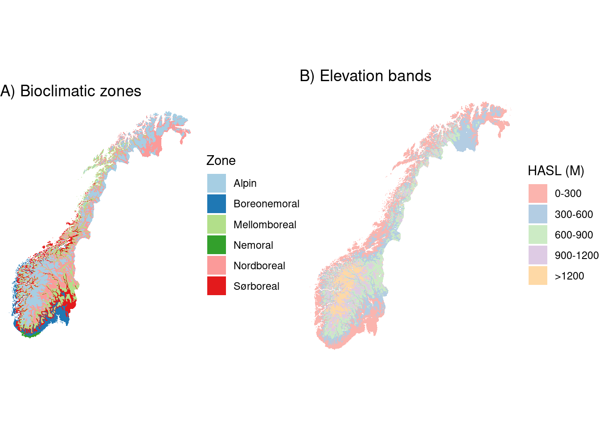

# Vegetation regrowth/encroachment (gjengroing) {#gjengroing}

<br />

*Author and date:* Zander Venter


```r
Sys.Date()
#> [1] "2023-08-30"
```

<br />

<!-- Load all you dependencies here -->


<!-- Fill in which ecosystem the indicator belongs to, as well as the ecosystem characteristic it should be linked to. It's OK to use some Norwegian here -->


|Ecosystem                      |Økologisk.egenskap |ECT.class                       |
|:------------------------------|:------------------|:-------------------------------|
|Våtmark og Semi-/Naturlig-åpne |Gjengroing         |Structural state characteristic |


<!-- Don't remove these three html lines -->

<br /> <br />

<hr />

<!-- Document you work below. Try not to change  the headers too much. Data can be stored on NINA server. Since the book is rendered on the R Server this works fine, but note that directory paths are different on the server compared to you local machine. If it is not too big you may store under /data/ on this repository -->

## Introduction

The Norwegian word "gjengroing" is directly translated to "regrowing" in English. The gjengroing indicator describes the regrowth of woody vegetation (trees and bushes) in open ecosystems (wetland, semi- and naturally open areas) across Norway. We will use a spatial reference approach where reference areas define good or optimal vegetation regrowth heights.

The workflow spans two platforms including RStudio and Google Earth Engine (GEE). To reproduce this workflow you will need a GEE account and access to the NINA RStudio and R/GeoSpatialData servers.

## About the underlying data

We rely on the following datasets:

-   [NiN polygons](https://kartkatalog.miljodirektoratet.no/dataset/Details/2050) are used to identify reference areas with good ecological condition.
-   NIBIO's [AR5](https://kartkatalog.geonorge.no/metadata/arealressurskart-fkb-ar5-arealtyper/280bbd7a-5ce9-4c83-9e15-ac162cabd8a6) is used as the population sample for each ecosystem type. The population sample are the areas used to determine ecological condition relative to the reference areas. We also use the AR5 data to identify forest surrounding the population polygons for defining the lower limit of ecological condition index (ie. poor condition),
-   LiDAR-derived digital elevation model from Kartverket's [høydedata](https://hoydedata.no/LaserInnsyn/). This includes both a terrain (DTM) and surface mode (DSM). We calculate the canopy height model (DSM - DTM) to get the height of objects above the ground. From this we remove buildings, and what remains is vegetation - mostly trees but also some bushes or smaller woody plants.
-   Kartverket's [national 10m elevation model](https://kartkatalog.geonorge.no/metadata/dtm-10-terrengmodell-utm32/fd851873-f363-46f9-9fc6-bb1b403575df). We use this to stratify reference (good condition) and forest (poor condition) heights by elevational band. This is done in combination with bioclimatic zones - see next point.
-   Moen's [bioclimatic zones](https://artsdatabanken.no/Pages/181901/Bioklimatiske_soner). We use this to stratify reference (good condition) and forest (poor condition) heights by bioclimatic (also referred to as vegetation/climatic) zones.
-   [FKB building footprints](https://kartkatalog.geonorge.no/metadata/fkb-bygning/8b4304ea-4fb0-479c-a24d-fa225e2c6e97) are used to isolate vegetation in the LiDAR height data.
-   A [European satellite-based map](https://www.nature.com/articles/s41893-020-00609-y) of forest clear cuts is used for identifying AR5 forest patches in near-climax successional stages.
-   The [SSB 10km grid](https://kartkatalog.geonorge.no/metadata/statistisk-rutenett-5000m/32ac0653-d95c-446c-8558-bf9b79f4934e) is used for visualization purposes.
-   The regional delineation for Norway (five regions) are used for aggregating and reporting gjengroing condition values.

### Representativity in time and space

The index will cover the mainland of Norway. The analysis will be stratified by (1) åpne and (2) våtmark ecosystems. The former includes both semi-naturlig mark and naturlig åpne områder under skoggrensa (due to the fact that AR5 does not differentiate these), and the latter includes våtmark only. The LiDAR data cover a range of years and therefore the indicator represents conditions for circa 2010 to 2021.

### Original units

The original units for ecological condition are meters. This is the height of the vegetation within referecne, polygon and forest areas.

### Temporal coverage

Circa 2010 to 2021. This is a single snapshot and not a change analysis. In the future, when LiDAR data has been repeated across the country, it may be possible to do a change assessment. In addition, the use of optical or radar satellite imagery may serve as a proxy for vegetation height using machine learning. This will allow for annual updates, depending on the uncertainty in the satellite-based maps of vegetation height.

### Aditional comments about the dataset

None.

## Ecosystem characteristic

### Norwegain standard

Not sure what this means??

## Collinearities with other indicators

There is possibly a collinearity with the primary production indicator (primærproduksjon). The primary production indicator uses the normalized difference vegetation index (NDVI) as a proxy for vegetation production. NDVI can be correlated with vegetation height and consequently yield similar results to the LiDAR-based gjengroing indicator.

## Reference state and values

The methodology used to calculate the gjengroing indicator is outlined in the schematic below. The workflow in the schematic is conducted for all reference and population polygons in Norway and repeated for each ecosystem type (åpne and våtmark), respectively. The indicator values are aggregated to a 50km grid and regional level at the end. The individual steps are discussed in turn in the following subsections.


### Reference state

The NiN polygons including "Naturlig åpne områder under skoggrensa", "Semi-naturlig mark", and "Våtmark" with good ecological condition are used to define a reference gjengroing state. We use the all-encompassing "Tilstand" variable assigned to each NiN polygon. The 50th percentile of LiDAR-derived vegetation heights within these polygons is used to define the upper limit (ie. 1) of the scaled indicator value. We cannot define local reference values based on proximity, because the NiN polygons are spatially biased and not close to all AR5 population polygons. Therefore we calculate regional reference values using elevation (300m bands) and bioclimatic zones as stratification. We calculate the mean reference value for each unique combination of elevation-bioclimatic zone. When calculating the index for each population polygon, the reference value is inhereted from the elecation-bioclimatic zone it falls within.

### Reference values, thresholds for defining *good ecological condition*, minimum and/or maximum values

Once we have the reference vegetation height for a given ecosystem type and elevation-bioclimatic zone, we need to define the minimum (or worst/bad) condition. We use the 50th percentile of LiDAR-derived vegetation heights within AR5 skog polygons to define a climax vegetation successional stage where gjengroing is at its most extreme. In order not to include forest patches that have recently been harvested, we mask out any forest which has been clear-cut since 1986. Here, 1986 is a hard limit defined by the clear-cut dataset which was based on Landsat imagery. Therefore we can be assured that we are measuring forest that is at least 35 years old.

We use both local and regional "reference" approaches to defining poor ecological condition. To do this we calculate the forest heights in AR5 forest patches that fall within 200m of a population polygon (local reference). For population polygons that do not have forest within their proximity, we use the mean forest height within the unique elevation-bioblimatic zone the population falls within (regional reference).

To define the ecological condition of the population polygon, we measure 50th percentile of LiDAR-derived vegetation height. As a reminder, we use AR5 polygons that have types that are approximately compatible with the NiN ecosystem types. For våtmark we use the AR5 polygons defined as "Myr". For åpne ecosystems we use the AR5 polygons defined as either "Åpent fastmark" or "Innmarksbeite".

The vegetation height percentiles are then scaled to between 0 and 1 using a sigmoid transformation [Oliver at al. (2021)](https://www.sciencedirect.com/science/article/pii/S1470160X21000066).

## Uncertainties

For the indicator map at the polygon level there is no uncertainty associated with the indicator values. For aggregated indicator values (e.g. for 50km grid and regions), the uncertainty in the indicator value is calculated from the spatial variation in the polygon-level reference height values. We could use the alternative of calculating the spatial variation in the indicator values via bootstrapping using the EAtools package. However, given the extreme number of population polygons, the uncertainty values are extremely small and therefore we choose to use the standard deviation in reference vegetation heights, converted to the indicator scale.

## References

Links to data and resources are provided with hyperlinks in-line.

## Analyses

### Data sets

There are several datasets which are used in GEE which will not be imported into the R session here. These datasets have been obtained from the source and ingested into GEE by Zander Venter or Vegard Bakkestuen with the help of Miljædata section at NINA. They include

-   [AR5](https://kartkatalog.geonorge.no/metadata/arealressurskart-fkb-ar5-arealtyper/280bbd7a-5ce9-4c83-9e15-ac162cabd8a6)
-   [LiDAR-derived digital elevation model from høydedata](https://hoydedata.no/LaserInnsyn/).
-   [Kartverket's national 10m elevation model](https://kartkatalog.geonorge.no/metadata/dtm-10-terrengmodell-utm32/fd851873-f363-46f9-9fc6-bb1b403575df)
-   [FKB building footprints](https://kartkatalog.geonorge.no/metadata/fkb-bygning/8b4304ea-4fb0-479c-a24d-fa225e2c6e97)
-   [European forest clear-cut map](https://www.nature.com/articles/s41893-020-00609-y)

The remaining datasets will be imported into the R session.

#### Regions

The regional delineation for Norway (five regions) are used for aggregating and reporting gjengroing condition values.


```r
regions <- st_read('/data/P-Prosjekter2/41201785_okologisk_tilstand_2022_2023/gjengroing/R_project/DATA/regions.shp') %>%
  mutate(region = factor(region) )
#> Reading layer `regions' from data source 
#>   `/data/P-Prosjekter2/41201785_okologisk_tilstand_2022_2023/gjengroing/R_project/DATA/regions.shp' 
#>   using driver `ESRI Shapefile'
#> Simple feature collection with 5 features and 2 fields
#> Geometry type: POLYGON
#> Dimension:     XY
#> Bounding box:  xmin: -99551.21 ymin: 6426048 xmax: 1121941 ymax: 7962744
#> Projected CRS: ETRS89 / UTM zone 33N
# Rename regions with correct Norwegian characters
levels(regions$region) <- c("Østlandet", "Midt-Norge","Nord-Norge","Sørlandet","Vestlandet")
```

#### SSB 10 and 50km grids

The [SSB 10km and 50km grids](https://kartkatalog.geonorge.no/metadata/statistisk-rutenett-5000m/32ac0653-d95c-446c-8558-bf9b79f4934e) are used for visualizing the distribution of available data and for aggregating gjengroing index scores.


```r
ssb10km <- st_read('/data/R/GeoSpatialData/Population_demography/Norway_SSB/Original/ssb_10km/ssb10km.shp')%>%
  # mutate the id value so that it aligns with the data coming from GEE
  mutate(SSBID = as.numeric(SSBID)/1000)
#> Reading layer `ssb10km' from data source 
#>   `/data/R/GeoSpatialData/Population_demography/Norway_SSB/Original/ssb_10km/ssb10km.shp' 
#>   using driver `ESRI Shapefile'
#> Simple feature collection with 4218 features and 6 fields
#> Geometry type: POLYGON
#> Dimension:     XY
#> Bounding box:  xmin: -80000 ymin: 6440000 xmax: 1120000 ymax: 7940000
#> Projected CRS: WGS 84 / UTM zone 33N
# Transform to the correct projection
ssb10km <- st_transform(ssb10km, st_crs(regions))

ssb50km <- st_read('/data/R/GeoSpatialData/Population_demography/Norway_SSB/Original/ssb_50km/ssb50km.shp')%>%
  # mutate the id value so that it aligns with the data coming from GEE
  mutate(SSBID = as.numeric(SSBID)/1000)
#> Reading layer `ssb50km' from data source 
#>   `/data/R/GeoSpatialData/Population_demography/Norway_SSB/Original/ssb_50km/ssb50km.shp' 
#>   using driver `ESRI Shapefile'
#> Simple feature collection with 273 features and 6 fields
#> Geometry type: POLYGON
#> Dimension:     XY
#> Bounding box:  xmin: -150000 ymin: 6400000 xmax: 1150000 ymax: 8e+06
#> Projected CRS: WGS 84 / UTM zone 33N
# Transform to the correct projection
ssb50km <- st_transform(ssb50km, st_crs(regions))
```

#### Bioclimatic regions

The Moen's bioclimatic regions are imported from NINA R/GeoSpatialData/ server.


```r
bioclim <- st_read('/data/R/GeoSpatialData/BiogeographicalRegions/Norway_VegetationZones_Moen/Original/Vector/soner.shp') %>%
  mutate(NAVN = ifelse(NAVN == 'S°rboreal', 'Sørboreal', NAVN))
#> Reading layer `soner' from data source 
#>   `/data/R/GeoSpatialData/BiogeographicalRegions/Norway_VegetationZones_Moen/Original/Vector/soner.shp' 
#>   using driver `ESRI Shapefile'
#> Simple feature collection with 3050 features and 7 fields
#> Geometry type: POLYGON
#> Dimension:     XY
#> Bounding box:  xmin: -75844 ymin: 6449504 xmax: 1114610 ymax: 7939790
#> Projected CRS: WGS 84 / UTM zone 33N
bioclim <- st_transform(bioclim, st_crs(regions))
```

#### NiN polygons

[NiN polygons](https://kartkatalog.miljodirektoratet.no/dataset/Details/2050) are imported here from the NINA servers:


```r
nin <- st_read('/data/R/GeoSpatialData/Habitats_biotopes/Norway_Miljodirektoratet_Naturtyper_nin/Original/versjon20221231/Natur_Naturtyper_NiN_norge_med_svalbard_25833/Natur_Naturtyper_NiN_norge_med_svalbard_25833.gdb')%>%
  # Simplify ecosystem names
  mutate(hovedøkosystem = recode(hovedøkosystem, 
                                 "Våtmark" = 'Våtmark',
                                 "Skog" = "Skog",
                                 "Ingen" = "Ingen",
                                 "Fjell" = "Fjell",
                                 "Semi-naturlig mark" = 'Semi-naturlig',
                                 "Naturlig åpne områder i lavlandet" = 'Naturlig åpne',
                                 "Naturlig åpne områder under skoggrensa" = 'Naturlig åpne')) %>% 
  # Fix any invalid geometries
  mutate(validGeo = st_is_valid(SHAPE)) %>%
  filter(validGeo) %>%
  # Filter out the ecosystems we are not interested in
  filter(!hovedøkosystem %in% c('Skog','Ingen','Fjell')) %>%
  # Get the main ecosystem codes in case we need them later
  mutate(hovedtype = substr(ninkartleggingsenheter, 4, 6),
         hovedtype = str_remove(hovedtype, '-'),
         id = identifikasjon_lokalid) %>%
  # Drop polygons with no condition score
  drop_na(tilstand) %>%
  dplyr::select(id, hovedøkosystem, hovedtype, naturtypekode, tilstand)
#> Reading layer `Naturtyper_NiN_norge_med_svalbard' from data source `/data/R/GeoSpatialData/Habitats_biotopes/Norway_Miljodirektoratet_Naturtyper_nin/Original/versjon20221231/Natur_Naturtyper_NiN_norge_med_svalbard_25833/Natur_Naturtyper_NiN_norge_med_svalbard_25833.gdb' 
#>   using driver `OpenFileGDB'
#> Simple feature collection with 95469 features and 35 fields
#> Geometry type: MULTIPOLYGON
#> Dimension:     XY
#> Bounding box:  xmin: -74953.5 ymin: 6448986 xmax: 1075080 ymax: 7921283
#> Projected CRS: ETRS89 / UTM zone 33N
```

-   **Export the cleaned NiN data and upload to GEE before proceeding**


```r
# Only run if you are repeating this workflow for the first time
# nin %>%
#   dplyr::select(id, hovedøkosystem, tilstand) %>%
#   st_transform(st_crs(fylker_wgs84)) %>%
#   st_write('nin_cleaned.shp', append=FALSE)
```

-   **Now run the following GEE JavaScript code by clicking on the hyperlink:** [GEE script](https://code.earthengine.google.com/b2d06ad72c515fbbb3024f157987eedc) This script is also found in the SCR repository as "GEE_script.js". When you run the script, then click the Tasks tab in the GEE code editor and run the export tasks. The export files will appear in your Google Drive. Download the files from your Google Drive to the /data/gjengroing/From_GEE directory. This script extracts three CSV files:
    -   'area_cover_grid.csv' - this gives the area coverage of NiN, AR5 and LiDAR data for each 10x10km SSB grid cell.
    -   'elevation_stratified.shp' - this is a 300m elevation band stratification that is simply used for visualizing the strata here in R.
    -   'vegHeights.zip' - this is a folder with hundreds of CSV files. These files contain the vegetation heights for reference, population, and forest polygons over Norway. The exports were split by 50km grid to prevent hitting user memory limits in GEE. Unzip the folder before you upload to ./DATA/From_GEE/

#### Data from Google Earth Engine

Once you have run the GEE script above, and downloaded the data to the /data/gjengroing/From_GEE directory, you can proceed with this R workflow.

Create functions to import vegetation height files and stratify data by elevation band and vegetation/climate zone


```r
# Function to read in multiple files resulting from GEE exports
readVegHeightFiles <- function(uniqueString){
  dir <- '/data/P-Prosjekter2/41201785_okologisk_tilstand_2022_2023/gjengroing/R_project/DATA/From_GEE/vegHeights/'
  files <- list.files(dir)[str_detect(list.files(dir), uniqueString)]
  #print(files)
  
  dat <- tibble()
  for (i in files){
    dat <- dat %>% 
      bind_rows(read_csv(paste0(dir, i)) %>%
                  mutate(ssbid = substr(str_split(i, '_')[[1]][3], 1, 14)))
  }
  return (dat)
}

# Vegetation type lookup
vegLookup <- tibble(
  vegClimZone = c(1,2,3,4,5,6), 
  vegClimZoneLab = c('Nemoral','Boreonemoral','Sørboreal','Mellomboreal','Nordboreal','Alpin')
  )

# Elevation stratification and vegetation type cleaning function
cleanElevVegType <- function(data){
  
  dataOut <- data %>%
    mutate(e = elevation) %>%
    mutate(elevation = ifelse(e < 300, '0-300',
                              ifelse(e > 300 & e < 600, '300-600',
                                     ifelse(e > 600 & e < 900, '600-900',
                                     ifelse(e > 900 & e < 1200, '900-1200', '>1200'))))) %>%
    mutate(vegClimZone = round(vegClimZone)) %>%
    left_join(vegLookup, by = 'vegClimZone') %>%
    dplyr::select(-e, -vegClimZone) %>%
    drop_na(vegClimZoneLab, elevation)
  
  return (dataOut)
  
}

```

Import the CSV files generated in GEE related to area covers and elevation bands:


```r
# Import data coverages per SSB 10km grid cell
areaCovers <- read_csv('/data/P-Prosjekter2/41201785_okologisk_tilstand_2022_2023/gjengroing/R_project/DATA/From_GEE/area_cover_grid.csv') %>%
  dplyr::select(-'.geo', -'system:index')

# Calculate percentage cover relative to the land area in each cell
areaCoversPerc <- areaCovers %>%
  gather(key, val, aapne_ar5, vaatmark_ar5,aapne_nin, vaatmark_nin, lidarCover, skog) %>%
  mutate(type = ifelse(str_detect(key, 'ar5'), 'ar5', 
                       ifelse(str_detect(key, 'nin'), 'nin', 
                              ifelse(key == 'lidarCover', 'lidar', NA)))) %>%
  mutate(ecosystem = ifelse(str_detect(key, 'aapne'), 'Semi-/Naturlig åpne', 
                       ifelse(str_detect(key, 'vaatmark'), 'Våtmark', NA))) %>%
  mutate(areaPerc = val/land*100,
         areaPerc = ifelse(is.na(areaPerc), 0, areaPerc)) %>%
  dplyr::select(SSBID, key, type,ecosystem, areaPerc)

elevStrata <- st_read('/data/P-Prosjekter2/41201785_okologisk_tilstand_2022_2023/gjengroing/R_project/DATA/From_GEE/elevation_stratified.shp') %>%
  mutate(elevBand = ifelse(mode == 1, '0-300',
                           ifelse(mode == 2, '300-600',
                                  ifelse(mode == 3, '600-900',
                                         ifelse(mode == 4, '900-1200', '>1200')))),
         elevBand = factor(elevBand, levels=c('0-300','300-600','600-900','900-1200','>1200')))
#> Reading layer `elevation_stratified' from data source 
#>   `/data/P-Prosjekter2/41201785_okologisk_tilstand_2022_2023/gjengroing/R_project/DATA/From_GEE/elevation_stratified.shp' 
#>   using driver `ESRI Shapefile'
#> Simple feature collection with 10293 features and 2 fields
#> Geometry type: MULTIPOLYGON
#> Dimension:     XY
#> Bounding box:  xmin: 4.078351 ymin: 57.8515 xmax: 31.78239 ymax: 71.29928
#> Geodetic CRS:  WGS 84
elevStrata <- st_transform(elevStrata, st_crs(regions))
```

Import the CSV files generated in GEE of vegetation heights (circa 15 min runtime):


```r

if (runFromScratch){
  
  # Import median LiDAR heights for NiN polygons
  refVaatmarkRaw <- readVegHeightFiles('vaatmark_ref') %>%
    mutate(ref = chm) %>%
    dplyr::select(-'.geo', -'system:index', -chm)
  refAapneRaw <- readVegHeightFiles('aapne_ref') %>%
    mutate(ref = chm) %>%
    dplyr::select(-'.geo', -'system:index', -chm)
  
  # Add elevation and veg/clim zones and summarise per strata
    # this will form the upper limit of the ecological condition score (ie. good condition)
  refVaatmark <- cleanElevVegType(refVaatmarkRaw) %>%
    group_by(elevation, vegClimZoneLab) %>%
    summarise(ref = mean(ref, na.rm=T))
  refAapne <- cleanElevVegType(refAapneRaw) %>%
    group_by(elevation, vegClimZoneLab) %>%
    summarise(ref = mean(ref, na.rm=T))
  
  # Export to file for reference
  refVaatmark %>%
    st_write('data/P-Prosjekter2/41201785_okologisk_tilstand_2022_2023/gjengroing/R_project/DATA/refVaatmark.csv')
  refAapne %>%
    st_write('data/P-Prosjekter2/41201785_okologisk_tilstand_2022_2023/gjengroing/R_project/DATA/refAapne.csv')
  
  # Import median LiDAR heights for AR5 polygons for population measurement
  popVaatmarkHt <- readVegHeightFiles('vaatmark_pop')  %>%
    mutate(pop = chm)%>%
    dplyr::select(-chm)
  popAapneHt <- readVegHeightFiles('aapne_pop')  %>%
    mutate(pop = chm)%>%
    dplyr::select(-chm)
  
  # Turn into spatial objects using the .geo column in the CSV
  popVaatmarkHt <- st_as_sf(bind_cols(popVaatmarkHt,geojsonsf::geojson_sf(popVaatmarkHt$.geo)))
  popAapneHt <- st_as_sf(bind_cols(popAapneHt,geojsonsf::geojson_sf(popAapneHt$.geo)))
  
  # Import median LiDAR heights for forest (skog) within 200m of population polygons
    # this will form the lower limit of the ecological condition score (ie. poor condition)
  popVaatmarkSkog <- readVegHeightFiles('vaatmark_skog') %>%
    mutate(skog = chm)%>%
    dplyr::select(-chm, -'.geo', -ssbid)
  popAapneSkog <- readVegHeightFiles('aapne_skog') %>%
    mutate(skog = chm)%>%
    dplyr::select(-chm, -'.geo', -ssbid)
  
  # Combine the population heights with the forest heights
  popVaatmark <- popVaatmarkHt %>%
    left_join(popVaatmarkSkog, by = 'system:index')%>%
    dplyr::select(-'.geo')
  popAapne <- popAapneHt %>%
    left_join(popAapneSkog, by = 'system:index')%>%
    dplyr::select(-'.geo')
  
  # Add elevation and veg/clim zones to the combined population and forest heights
  popVaatmark <- cleanElevVegType(popVaatmark)
  popAapne <- cleanElevVegType(popAapne)
  
  # Get regional reference values for forest height
    # this is to fill in for population polygons which did not have any forest within 200m
  vaatmarkSkogRegionalRef <- popVaatmark %>%
    as_tibble() %>%
    group_by(elevation, vegClimZoneLab) %>%
    summarise(skogFill = mean(skog, na.rm=TRUE)) %>%
    drop_na(skogFill)
  aapneSkogRegionalRef <- popAapne %>%
    as_tibble() %>%
    group_by(elevation, vegClimZoneLab) %>%
    summarise(skogFill = mean(skog, na.rm=TRUE)) %>%
    drop_na(skogFill)
  
  # Combine all the above into one data frame
  #set.seed(123)
  vaatmarkHts <- popVaatmark %>%
    #sample_n(100000) %>%
    as_tibble() %>% dplyr::select(-geometry) %>%
    left_join(refVaatmark, by=c('vegClimZoneLab', 'elevation')) %>%
    gather(type, height, ref, pop, skog) %>%
    group_by(`system:index`, elevation, vegClimZoneLab, type) %>%
    summarise(height = mean(height)) %>%
    pivot_wider(values_from = height, names_from = type) %>%
    # If population height is less than the reference value, then it is automatically "good" condition - ie. it inherits the reference height so that the rescaled value will be 1
    mutate(pop = ifelse(pop < ref, ref, pop)) %>%
    drop_na(pop, ref) %>%
    left_join(vaatmarkSkogRegionalRef, by = c('vegClimZoneLab', 'elevation')) %>%
    mutate(skog = ifelse(is.na(skog), skogFill, skog)) %>%
    dplyr::select(-skogFill) %>%
    filter(skog < 30)
  #colSums(is.na(vaatmarkHts))
  
  aapneHts <- popAapne %>%
    #sample_n(100000) %>%
    as_tibble() %>% dplyr::select(-geometry) %>%
    left_join(refAapne, by=c('vegClimZoneLab', 'elevation')) %>%
    gather(type, height, ref, pop, skog) %>%
    group_by(`system:index`, elevation, vegClimZoneLab, type) %>%
    summarise(height = mean(height)) %>%
    pivot_wider(values_from = height, names_from = type) %>%
    # If population height is less than the reference value, then it is automatically "good" condition - ie. it inherits the reference height so that the rescaled index will be 1
    mutate(pop = ifelse(pop < ref, ref, pop)) %>%
    drop_na(pop, ref) %>%
    left_join(aapneSkogRegionalRef, by = c('vegClimZoneLab', 'elevation')) %>%
    mutate(skog = ifelse(is.na(skog), skogFill, skog)) %>%
    dplyr::select(-skogFill) %>%
    filter(skog < 30)
  #colSums(is.na(aapneHts))
  
} else {
  
  refVaatmark  <- read_csv('/data/P-Prosjekter2/41201785_okologisk_tilstand_2022_2023/gjengroing/R_project/DATA/refVaatmark.csv')
  refAapne <- read_csv('/data/P-Prosjekter2/41201785_okologisk_tilstand_2022_2023/gjengroing/R_project/DATA/refAapne.csv')
  
}
```

### Explore data coverages

Here we will make maps of NiN, AR5 and LiDAR coverage over Norway to get a feel for the data distributions. These areas were calculated in GEE and exported to CSV in the GEE script provided above. All we need to do now is join them with the SSB 10km grid and visualize.


```r


c1 <- ssb10km %>% 
  left_join(areaCoversPerc %>%
              filter(type == 'nin') %>%
              group_by(SSBID) %>%
              summarise(areaPerc = sum(areaPerc, na.rm=T)))  %>%
  ggplot() +
  geom_sf(aes(fill=areaPerc), color=NA) +
  geom_sf(data=regions, fill=NA, size=0.3) +
  scale_fill_gradientn(colours = c('#e6bf6b', '#91b5a2'),
                       name = '% cover',
                       limits=c(0, 2),
                       oob=scales::squish) +
  theme_void() +
  theme(legend.position = c(0.7, 0.4)) +
  ggtitle('A) NiN polygons with good condition')
#c1
c2 <- ssb10km %>% 
  left_join(areaCoversPerc %>%
              filter(type == 'ar5') %>%
              group_by(SSBID) %>%
              summarise(areaPerc = sum(areaPerc, na.rm=T)))  %>%
  ggplot() +
  geom_sf(aes(fill=areaPerc), color=NA) +
  geom_sf(data=regions, fill=NA, size=0.3) +
  scale_fill_gradientn(colours = c('#e6bf6b', '#91b5a2'),
                       name = '% cover',
                       limits=c(0, 100),
                       oob=scales::squish) +
  theme_void() +
  theme(legend.position = c(0.7, 0.4)) +
  ggtitle('B) AR5 polygons')
#c2
c3 <- ssb10km %>% 
  left_join(areaCoversPerc %>%
              filter(type == 'lidar') %>%
              group_by(SSBID) %>%
              summarise(areaPerc = sum(areaPerc, na.rm=T)))  %>%
  ggplot() +
  geom_sf(aes(fill=areaPerc), color=NA) +
  geom_sf(data=regions, fill=NA, size=0.3) +
  scale_fill_gradientn(colours = c('#e6bf6b', '#91b5a2'),
                       name = '% cover',
                       limits=c(0, 100),
                       oob=scales::squish) +
  theme_void() +
  theme(legend.position = c(0.7, 0.4)) +
  ggtitle('C) LiDAR canopy height model')
#c3

coverageFig <- grid.arrange(c1, c2, c3, ncol=3, widths=c(1,1,1), padding = unit(0, "line"), newpage = T) 
```


### Bioclimatic zone and elevation strata for regional reference values

We will visualize the elevation bands and bioclimatic zones that are used to define regional reference values for poor (forest vegetation height) and good (NiN vegetation height) ecological condition. For each unique spatial combination of these strata (n = 21), we calcualte a mean reference value later on in the analysis. Note that poor ecological condition is preferably calculated using a local reference (forest height within 200m of population polygon), but a regional reference is used where there are no nearby forest patches.


```r

bioclimPlot <- bioclim %>%
  ggplot() + 
  geom_sf(aes(fill = NAVN), color=NA)+
    scale_fill_manual(values=brewer.pal(10, 'Paired'), name = 'Zone')+
    ggtitle('A) Bioclimatic zones') +
    theme_void()

elevPlot <- elevStrata %>%
  ggplot() +
  geom_sf(aes(fill = elevBand), color=NA, size=0.001)+
    scale_fill_manual(values=brewer.pal(5, 'Pastel1'), name = 'HASL (M)')+
    ggtitle('B) Elevation bands')+
    theme_void()


strataPlot <- grid.arrange(bioclimPlot, elevPlot, ncol=2, widths=c(1,1), padding = unit(0, "line"), newpage = T) 
```



We can see that while AR5 polygons are well distributed across the country, the NiN polygons are clustered and biased toward low elevation regions of the country. The LiDAR data covers nearly the entire country with some exceptions in the north. Future iterations of this work will need to attempt to quantify the biases introduced by the relative distributions of reference and population polygons and by the datasets used to quantify gjengroing (in this case LiDAR).

### Scaled indicator values at polygon level (circa 120 min runtime)

We will calculate the gjengroing index for each population polygon over Norway using a Sigmoid scaling function.


```r

# Define Sigmoid scaling function
scaleSigmoid <- function(variable){
  refLow <- min(variable)
  refHigh <- max(variable)
  thr <- (refHigh-refLow)/2
  indicator_LowHigh <- (variable - refLow)/(refHigh - refLow)
  indicator_LowHigh[indicator_LowHigh[] < 0] <- 0
  indicator_LowHigh[indicator_LowHigh[] > 1] <- 1
  indicator_sigmoid <- 100.68*(1-exp(-5*(indicator_LowHigh)^2.5))/100
  return (round(indicator_sigmoid, 4))
}

if (runFromScratch){
  
  # Calcualte gjengroing index values
  vaatmarkIndexPoly <- vaatmarkHts  %>%
    # Gather into long format so taht we can mutate the scaleSigmoid() function
    gather(type, height, ref, pop, skog) %>%
    group_by(`system:index`) %>%
    mutate(index = scaleSigmoid(height)) %>%
    # Because short vegetation is good condition, we must invert the scaled indicator
    mutate(index = 1-index) %>%
    # Get the indicator values for the population polygons only (ref and skog will be 1 and 0)
    filter(type == 'pop') %>%
    dplyr::select(-type, -height) %>%
    # Join with original data to get the actual median vegetaiton heights for each indicator score
    left_join(vaatmarkHts %>% dplyr::select("system:index", pop, ref, skog)) %>%
    left_join(popVaatmark %>% dplyr::select("system:index", ssbid))
  
  # do the same for åpne polygons - will not comment this because same as above
  aapneIndexPoly <- aapneHts  %>%
    gather(type, height, ref, pop, skog) %>%
    group_by(`system:index`) %>%
    mutate(index = scaleSigmoid(height)) %>%
    mutate(index = 1-index) %>%
    filter(type == 'pop') %>%
    dplyr::select(-type, -height) %>%
    left_join(aapneHts %>% dplyr::select("system:index", pop, ref, skog)) %>%
    left_join(popAapne %>% dplyr::select("system:index", ssbid))
  
  
  # Make into spatial objects
  vaatmarkIndexPolySpat <- popVaatmark %>%
    dplyr::select("system:index") %>%
    left_join(vaatmarkIndexPoly) %>%
    filter(!is.na(index))
  aapneIndexPolySpat <- popAapne %>%
    dplyr::select("system:index") %>%
    left_join(aapneIndexPoly) %>%
    filter(!is.na(index))
  
  # Transform to correct projection
  vaatmarkIndexPolySpat <- st_transform(vaatmarkIndexPolySpat, st_crs(regions))
  aapneIndexPolySpat <- st_transform(aapneIndexPolySpat, st_crs(regions))
  
} else {
  
  vaatmarkIndexPolySpat <- st_read('/data/P-Prosjekter2/41201785_okologisk_tilstand_2022_2023/gjengroing/R_project/OUTPUT/vaatmark_index.shp')%>%
    mutate(`system:index` = id,
           elevation = elev, 
           vegClimZoneLab = vegZn) %>%
    dplyr::select(-id, -elev, -vegZn)
  aapneIndexPolySpat <- st_read('/data/P-Prosjekter2/41201785_okologisk_tilstand_2022_2023/gjengroing/R_project/OUTPUT/aapne_index.shp')%>%
    mutate(`system:index` = id,
           elevation = elev, 
           vegClimZoneLab = vegZn) %>%
    dplyr::select(-id, -elev, -vegZn)
  
}
#> Reading layer `vaatmark_index' from data source 
#>   `/data/P-Prosjekter2/41201785_okologisk_tilstand_2022_2023/gjengroing/R_project/OUTPUT/vaatmark_index.shp' 
#>   using driver `ESRI Shapefile'
#> Simple feature collection with 1069897 features and 8 fields
#> Geometry type: MULTIPOLYGON
#> Dimension:     XY
#> Bounding box:  xmin: -75794.71 ymin: 6449710 xmax: 1108262 ymax: 7939216
#> Projected CRS: ETRS89 / UTM zone 33N
#> Reading layer `aapne_index' from data source 
#>   `/data/P-Prosjekter2/41201785_okologisk_tilstand_2022_2023/gjengroing/R_project/OUTPUT/aapne_index.shp' 
#>   using driver `ESRI Shapefile'
#> Simple feature collection with 1763446 features and 8 fields
#> Geometry type: MULTIPOLYGON
#> Dimension:     XY
#> Bounding box:  xmin: -76208.98 ymin: 6448886 xmax: 1108352 ymax: 7939986
#> Projected CRS: ETRS89 / UTM zone 33N
```

Here we will visualize the spatial variation in scaled gjengroind indicator values, as well as the vegetation heights for reference (good condition), indicator, and mature forest (poor condition) over the country. We could plot all the polygons, but it is computationally intensive and very difficult to visualize spatial variations over the entire country. Therefore we will calculate the area-weighted mean in values for each bioclimatic-elevation strata (n = 21) over the country.


```r

# Create intersection of the two strata layers
#elevStrata <- st_transform(elevStrata, st_crs(regions))
bioClimElev <- bioclim %>%
  st_intersection(elevStrata) %>%
  mutate(elevation = elevBand,
         vegClimZoneLab = NAVN)%>%
  dplyr::select(elevation, vegClimZoneLab) %>%
  rowid_to_column("ID")

if (runFromScratch){
  
  # Get area-weighted mean for reference, forest and population vegetation heights 
  # for each unique bioclimatic-elevation zone combination
  vaatmarkIndexStrata <- bioClimElev %>% 
    #sample_n(10000) %>%
    st_join(vaatmarkIndexPolySpat %>% 
                mutate(area = as.numeric(st_area(geometry))) ,st_intersects) %>%
    group_by(ID) %>%
    summarise_at(vars(pop, ref, skog, index), funs(weighted.mean(., w=area, na.rm=TRUE)))%>% 
                as_tibble() %>% 
                dplyr::select(-geometry)
  
  
  aapneIndexStrata <- bioClimElev %>% 
    #sample_n(10000) %>%
    st_join(aapneIndexPolySpat %>% 
                mutate(area = as.numeric(st_area(geometry))) ,st_intersects) %>%
    group_by(ID) %>%
    summarise_at(vars(pop, ref, skog, index), funs(weighted.mean(., w=area, na.rm=TRUE)))%>% 
                as_tibble() %>% 
                dplyr::select(-geometry)
  
  
  # Write out for import later
  vaatmarkIndexStrata %>% write_csv('/data/P-Prosjekter2/41201785_okologisk_tilstand_2022_2023/gjengroing/R_project/DATA/vaatmarkIndexStrata.csv')
  aapneIndexStrata %>% write_csv('/data/P-Prosjekter2/41201785_okologisk_tilstand_2022_2023/gjengroing/R_project/DATA/aapneIndexStrata.csv')
  

} else {
  
  vaatmarkIndexStrata <- read_csv('/data/P-Prosjekter2/41201785_okologisk_tilstand_2022_2023/gjengroing/R_project/DATA/vaatmarkIndexStrata.csv')
  aapneIndexStrata <- read_csv('/data/P-Prosjekter2/41201785_okologisk_tilstand_2022_2023/gjengroing/R_project/DATA/aapneIndexStrata.csv')
  
  
}

# Make plots of indicator heights and scaled condition values for each strata polygon

theme_legend_1 <- theme(legend.key.size = unit(0.25, 'cm'), #change legend key size
                        legend.key.height = unit(0.25, 'cm'), #change legend key height
                        legend.key.width = unit(0.25, 'cm'), #change legend key width
                        legend.title = element_text(size=6), #change legend title font size
                        legend.text = element_text(size=6)) #change legend text font size

makeStrataHeightMap <- function(data, var, title, limits){
  p <- bioClimElev %>%
    left_join(data, by = c('ID'))  %>%
    mutate(response = .[[var]]) %>%
    ggplot() + 
    geom_sf(aes(fill = response), color=NA)+
      scale_fill_gradientn(colors=viridis::viridis(10),
                           limits = limits,
                           oob = scales::squish,
                           name = 'Veg ht (m)')+
      ggtitle(title) +
      theme_void() +
    theme(plot.title = element_text(size=9)) +
    theme_legend_1
    
  return (p)
}

makeStrataIndicatorMap <- function(data, title){
  p <- bioClimElev %>%
    left_join(data, by = c('ID'))  %>%
    ggplot() + 
    geom_sf(aes(fill = index), color=NA)+
      scale_fill_gradientn(colors=brewer.pal(10, 'Spectral'),
                           limits = c(0,1),
                           name = 'Index')+
      ggtitle(title) +
      theme_void()+
    theme(plot.title = element_text(size=9)) +
    theme_legend_1
    
  return (p)
}

a1 <- makeStrataIndicatorMap(aapneIndexStrata,  'A) Semi-/Naturlig-åpne scaled indicator')
a2 <- makeStrataHeightMap(aapneIndexStrata, "ref", 'B) Semi-/Naturlig-åpne reference height', c(0,5))
a3 <- makeStrataHeightMap(aapneIndexStrata, "pop", 'C) Semi-/Naturlig-åpne indicator height', c(0,5))
a4 <- makeStrataHeightMap(aapneIndexStrata, "skog", 'D) Semi-/Naturlig-åpne forest height', c(0,5))

v1 <- makeStrataIndicatorMap(vaatmarkIndexStrata,  'E) Våtmark scaled indicator')
v2 <- makeStrataHeightMap(vaatmarkIndexStrata, "ref", 'F) Våtmark reference height', c(0,5))
v3 <- makeStrataHeightMap(vaatmarkIndexStrata, "pop", 'G) Våtmark indicator height', c(0,5))
v4 <- makeStrataHeightMap(vaatmarkIndexStrata, "skog", 'H) Mature forest height', c(0,5))

strataHeightPlot <- grid.arrange(a1,a2,a3,a4, v1,v2,v3,v4, ncol=4, widths=c(1,1,1,1), padding = unit(0, "line"), newpage = T) 
```


We can see that overall, the condition scores for both ecosystem types are poor along the coastal areas and lower-altitude zones of the country (A and E). At higher altitudes the gjengroing condition scores are higher.

When comparing våtmark to semi-/naturlig-åpne ecosystems, we can see that the reference heights for våtmark are generally higher in terms of good (B and F) and poor (D and H) ecological condition. This makes ecological sense because wetlands can and do naturally occur under forest and therefore våtmark in good condition can have tree cover without necessarily being gjengroing.

### Scaled indicator values at 50km grid level (circa 45 min runtime)

Using the polygon-level indicator scores, we will aggregate to 50km grid level to explore the spatial variation over Norway. We are doing this as an alternative way of visualizing the broad-scale patterns as presented in the section above where we used bioclimatic-elevation strata.

Here we will use a weighted average, but test out the eaTools::ea_spread function! It takes some time to run so best to do this overnight, or to parallelize in some way.


```r

if (runFromScratch){
  
  # Aggregate polygon index scores to grid level using eaTools ea_spread function
  vaatmarkIndexGrid <- eaTools::ea_spread(indicator_data = vaatmarkIndexPolySpat,
                                            indicator = index,
                                            regions = ssb50km,
                                            groups = SSBID,
                                            threshold = 1) %>%
    mutate(index = w_mean, ssbid = ID) %>%
    dplyr::select(ssbid, index, sd)

  aapneIndexGrid <- eaTools::ea_spread(indicator_data = aapneIndexPolySpat,
                                            indicator = index,
                                            regions = ssb50km,
                                            groups = SSBID,
                                            threshold = 1) %>%
    mutate(index = w_mean, ssbid = ID) %>%
    dplyr::select(ssbid, index, sd)
  
} else {
  
  print('Will import pre-exported data')
  
  vaatmarkIndexGrid <- st_read('/data/P-Prosjekter2/41201785_okologisk_tilstand_2022_2023/gjengroing/R_project/OUTPUT/vaatmark_index_grid.shp')
  aapneIndexGrid <- st_read('/data/P-Prosjekter2/41201785_okologisk_tilstand_2022_2023/gjengroing/R_project/OUTPUT/aapne_index_grid.shp')
  
}
#> [1] "Will import pre-exported data"
#> Reading layer `vaatmark_index_grid' from data source 
#>   `/data/P-Prosjekter2/41201785_okologisk_tilstand_2022_2023/gjengroing/R_project/OUTPUT/vaatmark_index_grid.shp' 
#>   using driver `ESRI Shapefile'
#> Simple feature collection with 273 features and 3 fields
#> Geometry type: POLYGON
#> Dimension:     XY
#> Bounding box:  xmin: -150000 ymin: 6400000 xmax: 1150000 ymax: 8e+06
#> Projected CRS: ETRS89 / UTM zone 33N
#> Reading layer `aapne_index_grid' from data source 
#>   `/data/P-Prosjekter2/41201785_okologisk_tilstand_2022_2023/gjengroing/R_project/OUTPUT/aapne_index_grid.shp' 
#>   using driver `ESRI Shapefile'
#> Simple feature collection with 273 features and 3 fields
#> Geometry type: POLYGON
#> Dimension:     XY
#> Bounding box:  xmin: -150000 ymin: 6400000 xmax: 1150000 ymax: 8e+06
#> Projected CRS: ETRS89 / UTM zone 33N
```

Visualize the spatial distribution of gjengroing indicator scores at grid level.


```r

vGrid1 <- aapneIndexGrid %>%
  ggplot() +
  geom_sf(aes(fill=index), color=NA) +
  geom_sf(data=regions, fill=NA, size=0.5) +
  scale_fill_gradientn(colors=brewer.pal(10, 'Spectral'),
                       limits = c(0,1),
                       name = 'Index') +
  theme_void() +
  theme(legend.position = c(0.7, 0.4)) +
  ggtitle('A) Semi-/Naturlig gjengroing condition')
#vGrid1

vGrid2 <- vaatmarkIndexGrid %>%
  ggplot() +
  geom_sf(aes(fill=index), color=NA) +
  geom_sf(data=regions, fill=NA, size=0.5) +
  scale_fill_gradientn(colors=brewer.pal(10, 'Spectral'),
                       limits = c(0,1),
                       name = 'Index') +
  theme_void() +
  theme(legend.position = c(0.7, 0.4)) +
  ggtitle('B) Våtmark gjengroing condition')
#vGrid2


indexGridFig <- grid.arrange(vGrid1, vGrid2, ncol=2, widths=c(1,1), padding = unit(0, "line"), newpage = T) 
```


These patterns mirror those in the previous section with higher condition scores at higher elevations and lower scores along the coastal zone and low-lying parts of the country.

We see some very low condition scores for a few coastal 50km grid cells - this may be an artifact of creating an average with very few population polygons and therefore vulnerable to skewed average indicator scores.

### Scaled indicator values at regional level (circa 120 min runtime)

Now we will aggregate up to the regional level for final reporting. We will use the same method as in the section above, except here we will use a different method to calculate the uncertainty value around the indicator values. The ea_spread function in eaTools uses a bootstrapping method to calculate the standard error in indicator values when aggregating from the polygon to regional level. Because we have hundreds of thousands of polygons per region, the resulting standard errors are extremely small. Therefore we will use the standard deviation in reference values per region. The standard deviation, as a percentage of the average reference value is used to calcualte the uncertainty in the scaled indicator value.


```r

if (runFromScratch){
  
  # Get the mean population, reference and forest heights per region for interpreting index values
  # The standard deviation is used later to define uncertainty around the indicator score
  vaatmarkHeightsRegion <- regions %>%
    st_join(vaatmarkIndexPolySpat) %>%
    as_tibble() %>%
    drop_na(index) %>%
    group_by(region) %>%
    summarise(pop_mean = mean(pop),
              skog_mean = mean(skog),
              ref_mean = mean(ref),
              sd_ref = sd(ref))
  aapneHeightsRegion <- regions %>%
    st_join(aapneIndexPolySpat) %>%
    as_tibble() %>%
    drop_na(index) %>%
    group_by(region)  %>%
    summarise(pop_mean = mean(pop),
              skog_mean = mean(skog),
              ref_mean = mean(ref),
              sd_ref = sd(ref))
  
  # Aggregate polygon index scores to regional level using eaTools
  vaatmarkIndexRegion <- eaTools::ea_spread(indicator_data = vaatmarkIndexPolySpat,
                                            indicator = index,
                                            regions = regions,
                                            groups = region,
                                            threshold = 1) %>%
    mutate(index = w_mean, region = ID) %>%
    dplyr::select(region, index, sd) %>%
    left_join(vaatmarkHeightsRegion)
  
  # Only run on first iteration - takes a long time
  aapneIndexRegion <- eaTools::ea_spread(indicator_data = aapneIndexPolySpat,
                                            indicator = index,
                                            regions = regions,
                                            groups = region,
                                            threshold = 1) %>%
    mutate(index = w_mean, region = ID) %>%
    dplyr::select(region, index, sd) %>%
    left_join(aapneHeightsRegion)
  
} else {
  
  print('Will import pre-exported data')
  
  vaatmarkIndexRegion <- st_read('/data/P-Prosjekter2/41201785_okologisk_tilstand_2022_2023/gjengroing/R_project/OUTPUT/vaatmark_index_region.shp')
  aapneIndexRegion <- st_read('/data/P-Prosjekter2/41201785_okologisk_tilstand_2022_2023/gjengroing/R_project/OUTPUT/aapne_index_region.shp')
  
  
}
#> [1] "Will import pre-exported data"
#> Reading layer `vaatmark_index_region' from data source 
#>   `/data/P-Prosjekter2/41201785_okologisk_tilstand_2022_2023/gjengroing/R_project/OUTPUT/vaatmark_index_region.shp' 
#>   using driver `ESRI Shapefile'
#> Simple feature collection with 5 features and 7 fields
#> Geometry type: POLYGON
#> Dimension:     XY
#> Bounding box:  xmin: -99551.21 ymin: 6426048 xmax: 1121941 ymax: 7962744
#> Projected CRS: ETRS89 / UTM zone 33N
#> Reading layer `aapne_index_region' from data source 
#>   `/data/P-Prosjekter2/41201785_okologisk_tilstand_2022_2023/gjengroing/R_project/OUTPUT/aapne_index_region.shp' 
#>   using driver `ESRI Shapefile'
#> Simple feature collection with 5 features and 7 fields
#> Geometry type: POLYGON
#> Dimension:     XY
#> Bounding box:  xmin: -99551.21 ymin: 6426048 xmax: 1121941 ymax: 7962744
#> Projected CRS: ETRS89 / UTM zone 33N
```

Present the indicator values as table, plots, and maps:


```r

# Join into a table to present values
aapentTable <- aapneIndexRegion %>% as_tibble() 
vaatmarkTable <- vaatmarkIndexRegion %>% as_tibble() 

# Join ecosystem types and calculate uncertainty
indicatorTable <- aapentTable %>% mutate(Ecosystem = 'Semi-/Naturlig åpne') %>%
  bind_rows(vaatmarkTable %>% mutate(Ecosystem = 'Våtmark')) %>%
  # Calculate the error based on the standard deviation in reference polygon heights
  # as a percentage of the reference height, and multiply by index score
  mutate(sd = (sd_ref/ref_mean)*index)

# Format the table for presentation
indicatorTable_formatted <- regions %>%
  left_join(indicatorTable) %>% as_tibble() %>%
  dplyr::select(-geometry)  %>%
  dplyr::select( region, Ecosystem, index, sd, pop_mean, ref_mean, skog_mean) %>%
  mutate_if(is.numeric, round, 2)
names(indicatorTable_formatted) <- c( "Region", "Ecosystem",
                                      "Scaled indicator",  "Scaled Std.dev",
                                      "Indicator height","Reference height",
                                      "Mature forest height")

# Use knitr to visualize
knitr::kable(indicatorTable_formatted)
```


|Region     |Ecosystem           | Scaled indicator| Scaled Std.dev| Indicator height| Reference height| Mature forest height|
|:----------|:-------------------|----------------:|--------------:|----------------:|----------------:|--------------------:|
|Nord-Norge |Semi-/Naturlig åpne |             0.80|           0.27|             1.42|             0.97|                 2.79|
|Nord-Norge |Våtmark             |             0.80|           0.32|             0.98|             0.81|                 2.17|
|Midt-Norge |Semi-/Naturlig åpne |             0.89|           0.32|             1.89|             1.23|                 4.09|
|Midt-Norge |Våtmark             |             0.85|           0.44|             1.38|             1.09|                 2.80|
|Østlandet  |Semi-/Naturlig åpne |             0.96|           0.55|             2.32|             1.48|                 5.25|
|Østlandet  |Våtmark             |             0.87|           0.67|             1.86|             1.27|                 3.63|
|Vestlandet |Semi-/Naturlig åpne |             0.86|           0.38|             2.63|             1.90|                 4.88|
|Vestlandet |Våtmark             |             0.75|           0.42|             2.44|             2.09|                 3.83|
|Sørlandet  |Semi-/Naturlig åpne |             0.94|           0.40|             2.86|             2.03|                 5.62|
|Sørlandet  |Våtmark             |             0.78|           0.51|             2.55|             2.28|                 3.83|


```r

# Make plots of regional index values
getIndicatorPlot <- function(label){
  regions %>%
    left_join(indicatorTable %>%
                filter(Ecosystem == label)) %>%
    mutate(lowError = index-sd, 
           upError = index+sd,
           upError = ifelse(upError > 1, 1, upError)) %>%
    ggplot(aes(y=region, x=index)) +
    geom_point() +
    geom_segment(aes(yend=region, x=lowError, xend=upError)) +
    coord_cartesian(xlim=c(0,1)) +
    geom_vline(xintercept = 1) +
    geom_vline(xintercept = 0) +
    labs(x = 'Tilstandsverdi') +
    theme(axis.title.y=element_blank()) +
    ggtitle(label) 
}
i1 <- getIndicatorPlot('Semi-/Naturlig åpne')
i2 <- getIndicatorPlot('Våtmark')
indicatorGraphFig <- grid.arrange(i1, i2, ncol=2, widths=c(1,1), padding = unit(0, "line"), newpage = T) 
```


```r


# Make maps of regional index values
getIndicatorMap <- function(data, label){
  regions %>%
    left_join(data) %>%
    ggplot() +
    geom_sf(aes(fill=index)) +
    scale_fill_gradientn(colors=brewer.pal(10, 'Spectral'),
                         limits = c(0,1))+
    ggtitle(label)+
    theme_void()
}
m1 <- getIndicatorMap(aapentTable, 'A) Semi-/Naturlig åpne')
m2 <- getIndicatorMap(vaatmarkTable, 'B) Våtmark')
indicatorGMapFig <- grid.arrange(m1, m2, ncol=2, widths=c(1,1), padding = unit(0, "line"), newpage = T) 
```


From these tables, figures and maps we can see that the gjengroing condition indicator scores are on average above 0.8 and therefore indicate a good overall condition in Norway. Østlandet comes out best for våtmark and semi-naturlig åpne ecosystems. Nord-Norge has poorest condition for semi-naturlig åpne ecosystems, while vestlandet has the poorest scores for våtmark.

### Uncertainty and validation

The calculation of the indicator involves many small decisions which can have significant effects on the resulting conditions cores. Therefore in the future it would be good to perform sensitivity analyses with each decision to test the effect on the outcome. The decisions which would benefit from further exploration include:

-   **Selection of the reference and population areas.** Here we were limited to using NiN and AR5 because these are arguably the best datasets currently available for this exercise. However, both NiN and AR5 are spatially and thematically biased in some ways. Therefore, it may be worth exploring alternative datasets in the future. NiN polygons are biased towards low lying areas which are generally warmer and more productive. For a given bioclimatic-elevation strata, this could lead to higher reference values for vegetation height than one would expect with a representative reference sample. This could consequently result in high elevation population polygons appearing to have very good condition ebcause they are being compared with (relatively) high productivity polygons in the same bioclimatic-elevation strata. This is a possible explanation for why the high elevation parts of norway appear to be in very good ecological condition.

-   **Definition of good condition states in NiN data.** Here we used the overall "tilstand" score for each NiN reference polygon. However, the overall score is a combination of several sub-scores that may or may not be relevant for ecological condition. For instance, ditches or wheel marks in wetlands is a common condition score in NiN, however it is debatable as to whether this should be considered a part of ecological condition. Therefore it may be beneficial to attempt repeating the indicator calculation using sub-categories of "tilstand" in the NiN data.

-   **Definition of climax successional stage for tree regrowth.** Here we use the 50th percentile of LiDAR-derived tree heights in AR5 forest polygons that have not been harvested since 1986. This defines the zero on the scaled indicator score. The resulting indicator scores will vary widely depending on how you define this zero-point. Therefore, testing different definitions (i.e. tree height percentiles) may be important.

-   **Quantifying regional vs local references for poor and good condition.** For good condition, we used NiN polygons and were restricted to these due to lack of better data. However, for poor condition we use climax successional stage for trees (as explained above) within 200m of each population polygon. For polygons with no surrounding forest, we impute with regional reference values (mean of forest height in elevation-bioclamic zone). The choice of 200m buffer zone was largely based on computational limitations. Calculating the average LiDAR vegetation height within 200m of nearly 2 million complex plygons takes time, even in GEE. It may make more ecological sense to define a larger buffer zone to use for defining reference for poor condition. However, longer processing times need to be expected.

-   **Quantification of uncertainty around indicator scores.** Here we used the standard deviation in the vegetation heights for reference (NiN) polygons within each region to quantify the uncertainty around scaled indicator scores. We did this because the method used in eaTools::ea_spread() function is a bootstrapping approach which resulted in extremely small uncertainty estimates due to the large number of polygons included in our analysis. In the future, a better method for quantifying uncertainty is needed. Perhaps by running sensitivity analyses that test several variations of the points mentioned above can form the basis for quantifying an error margin around indicator values.

#### Validation of random polygons

After exporting the final polygon-level indicator scores, we imported to QGIS and explored how they look at the landscape scale. We chose random locations spread across the 5 regions in Norway. The figures below show våtmark and åpne (semi- and naturlig-åpne) ecosysystem polygons from AR5. The polygons have jaggered edges because we chose a low resolution geometry export from GEE to save computing time and minimize storage space. Each polygon is colored based on the final scaled gjengroing indicator score (0 to 1). The polygons are also labelled with the median LiDAR-derived forest height. An orthophoto from Norgeibilder is displayed in the background for reference.

In the first example from midt-norge, we see a våtmark polygon colored red (ie. in poor condition) due to the growth of a forest in the northern section. It looks like a plantation forest and possibly occured after the wetland was drained. The height of the forest vegetation equates to a median of 2.4m which is higher than the reference value for this region (1.09m) and almost as high as the mature forest height reference of 2.8m. Therefore it gets a scaped indicator score of 0.1. In contrast the wetland plygon in the middle of the image is in good condition because it has a median vegetation height of 1.1m which is only fractionally higher than the regional reference for good ecological condition.


The second example from Sørlandet shows three AR5 semi-naturlig åpne polygons with different indicator values. The lower polygon has poor ecological condition because its median vegetation height is 6.2m which is close to the local reference value for mature forest (7.9m). Although the centeral polygon appears to have greater coverage of forest in the orthophoto, the LiDAR data tells us that it is mostly covered by short trees and results in a median vegetation height of 2.8 - therefore good condition.


The third example from Østlandet shows a range of indicator values for våtmark polygons. Although many of the polygons are partly covered by trees, their indicator values show good condition because the local reference for mature forest (zero on the indicator scale) is very high in this landscape of productive forest.


The fourth example from Nord-norge shows AR5 semi-naturlig åpne polygons with low and high condition scores. The large polygon with poor condition score has a median vegetation height of 2.7 which is nearly as high as the local reference for mature forest (3.8m).


The fifth and final example from further north in Nord-norge shows two våtmark polygons with contrasting condition scores, yet exactly the same median vegetation heights of 0.6m. The difference in the scaled iindicator value is due to different local reference values for surrounding forest. The polygon on the left has surrounding forest (within 200m buffer zone) with median height 0.5m, while the polygon on the right has surrounding forest of 0.7m. This creates a contrast in the final indicator valye and illustrates the effect that a local reference value can have on defining good and poor ecological condition.


### Eksport file (final product)

We will export gjengroing indicator values at three levels: - polygon level - 50km grid level - regional level


```r

if (runFromScratch){
  # Polygon level
  vaatmarkIndexPolySpat  %>%
    #mutate(area = as.numeric(st_area(geometry)))%>% 
    #filter(area > 7500) %>%
    mutate(id = `system:index`,
           elev = elevation, 
           vegZn = vegClimZoneLab) %>%
    dplyr::select(-"system:index", -vegClimZoneLab, -elevation) %>%
    st_write('/data/P-Prosjekter2/41201785_okologisk_tilstand_2022_2023/gjengroing/R_project/OUTPUT/vaatmark_index.shp', append=FALSE)
  
  aapneIndexPolySpat %>% 
    #mutate(area = as.numeric(st_area(geometry)))%>% 
    #filter(area > 7500) %>%
    mutate(id = `system:index`,
           elev = elevation, 
           vegZn = vegClimZoneLab) %>%
    dplyr::select(-"system:index", -vegClimZoneLab, -elevation) %>%
    st_write('/data/P-Prosjekter2/41201785_okologisk_tilstand_2022_2023/gjengroing/R_project/OUTPUT/aapne_index.shp', append=FALSE)
  
  # Grid level
  vaatmarkIndexGrid %>%
    st_write('/data/P-Prosjekter2/41201785_okologisk_tilstand_2022_2023/gjengroing/R_project/OUTPUT/vaatmark_index_grid.shp', append = FALSE)
  aapneIndexGrid %>%
    st_write('/data/P-Prosjekter2/41201785_okologisk_tilstand_2022_2023/gjengroing/R_project/OUTPUT/aapne_index_grid.shp', append = FALSE)
  
  # Region level
  vaatmarkIndexRegion %>%
    st_write('/data/P-Prosjekter2/41201785_okologisk_tilstand_2022_2023/gjengroing/R_project/OUTPUT/vaatmark_index_region.shp', append = FALSE)
  aapneIndexRegion %>%
    st_write('/data/P-Prosjekter2/41201785_okologisk_tilstand_2022_2023/gjengroing/R_project/OUTPUT/aapne_index_region.shp', append = FALSE)
}
```
