# Insect indicators

<br />

_Author and date:_

Jens Åström 2023-10-23


<br />

<!--# Notes on this draft
Most things are done but some things needs updates or touching up.

Incomplete list of things that will change:

* Upgrade genetic diversity calculation. The current calculation is just a placeholder, awaiting some new data from Marie. Waiting for software installation by IT. Unsure of timeline.
* Calculate NorIns indicators on 5 year interval. (Moving window?)
* Fix remaining comments in this draft inside hard brackets.-->


<!-- Load all you dependencies here -->


<!-- Fill in which ecosystem the indicator belongs to, as well as the ecosystem characteristic it should be linked to. It's OK to use some Norwegian here -->


```{=html}
<div class="tabwid"><style>.cl-3305e4f4{table-layout:auto;}.cl-32fdaa28{font-family:'DejaVu Sans';font-size:11pt;font-weight:bold;font-style:normal;text-decoration:none;color:rgba(0, 0, 0, 1.00);background-color:transparent;}.cl-32fdaa29{font-family:'DejaVu Sans';font-size:11pt;font-weight:normal;font-style:normal;text-decoration:none;color:rgba(0, 0, 0, 1.00);background-color:transparent;}.cl-33014f7a{margin:0;text-align:left;border-bottom: 0 solid rgba(0, 0, 0, 1.00);border-top: 0 solid rgba(0, 0, 0, 1.00);border-left: 0 solid rgba(0, 0, 0, 1.00);border-right: 0 solid rgba(0, 0, 0, 1.00);padding-bottom:5pt;padding-top:5pt;padding-left:5pt;padding-right:5pt;line-height: 1;background-color:transparent;}.cl-3301691a{background-color:rgba(173, 216, 230, 1.00);vertical-align: middle;border-bottom: 1.5pt solid rgba(102, 102, 102, 1.00);border-top: 1.5pt solid rgba(102, 102, 102, 1.00);border-left: 0 solid rgba(0, 0, 0, 1.00);border-right: 0 solid rgba(0, 0, 0, 1.00);margin-bottom:0;margin-top:0;margin-left:0;margin-right:0;}.cl-33016924{background-color:transparent;vertical-align: middle;border-bottom: 0.75pt solid rgba(102, 102, 102, 1.00);border-top: 0 solid rgba(0, 0, 0, 1.00);border-left: 0 solid rgba(0, 0, 0, 1.00);border-right: 0 solid rgba(0, 0, 0, 1.00);margin-bottom:0;margin-top:0;margin-left:0;margin-right:0;}.cl-33016925{background-color:transparent;vertical-align: middle;border-bottom: 0.75pt solid rgba(102, 102, 102, 1.00);border-top: 0.75pt solid rgba(102, 102, 102, 1.00);border-left: 0 solid rgba(0, 0, 0, 1.00);border-right: 0 solid rgba(0, 0, 0, 1.00);margin-bottom:0;margin-top:0;margin-left:0;margin-right:0;}.cl-3301692e{background-color:transparent;vertical-align: middle;border-bottom: 1.5pt solid rgba(102, 102, 102, 1.00);border-top: 0.75pt solid rgba(102, 102, 102, 1.00);border-left: 0 solid rgba(0, 0, 0, 1.00);border-right: 0 solid rgba(0, 0, 0, 1.00);margin-bottom:0;margin-top:0;margin-left:0;margin-right:0;}</style><table data-quarto-disable-processing='true' class='cl-3305e4f4'><thead><tr style="overflow-wrap:break-word;"><th class="cl-3301691a"><p class="cl-33014f7a"><span class="cl-32fdaa28">Ecosystem</span></p></th><th class="cl-3301691a"><p class="cl-33014f7a"><span class="cl-32fdaa28">Økologisk egenskap</span></p></th><th class="cl-3301691a"><p class="cl-33014f7a"><span class="cl-32fdaa28">ECT class</span></p></th></tr></thead><tbody><tr style="overflow-wrap:break-word;"><td class="cl-33016924"><p class="cl-33014f7a"><span class="cl-32fdaa29">Semi-naturlig mark</span></p></td><td class="cl-33016924"><p class="cl-33014f7a"><span class="cl-32fdaa29">Biologisk mangfold</span></p></td><td class="cl-33016924"><p class="cl-33014f7a"><span class="cl-32fdaa29">Functional state characteristics</span></p></td></tr><tr style="overflow-wrap:break-word;"><td class="cl-33016925"><p class="cl-33014f7a"><span class="cl-32fdaa29">Semi-naturlig mark</span></p></td><td class="cl-33016925"><p class="cl-33014f7a"><span class="cl-32fdaa29">Funksjonelle grupper innen trofiske nivåer</span></p></td><td class="cl-33016925"><p class="cl-33014f7a"><span class="cl-32fdaa29">Functional state characteristics</span></p></td></tr><tr style="overflow-wrap:break-word;"><td class="cl-3301692e"><p class="cl-33014f7a"><span class="cl-32fdaa29">Semi-naturlig mark</span></p></td><td class="cl-3301692e"><p class="cl-33014f7a"><span class="cl-32fdaa29">Funksjonelt viktige arter og biofysiske strukturer</span></p></td><td class="cl-3301692e"><p class="cl-33014f7a"><span class="cl-32fdaa29">Functional state characteristics</span></p></td></tr></tbody></table></div>
```

<!-- Don't remove these three html lines -->
<br />
<br />
<hr />


<!-- Document you work below. Try not to change  the headers too much. Data can be stored on NINA server. Since the book is rendered on the R Server this works fine, but note that directory paths are different on the server compared to you local machine. If it is not too big you may store under /data/ on this repository -->

## Introduction
We here show how to calculate a set of indicators for terrestrial insects in Norway. Two of them are adapted from earlier work on the Nature Index for Norway and use data from the Norwegian monitoring program on bumblebees and butterflies (**NMBB**). The others are developed during 2023, and use data from the Norwegian insect monitoring program (**NorIns**). 

This workflow is shortened by putting most of the underlying code in separate R-packages, which are freely available through Github. The relevant packages are `bombLepiSurv` https://github.com/jenast/bombLepiSurv for the bumblebee and butterfly indicators (**Not public yet**), and `Norimon` https://github.com/jenast/Norimon for the rest of the indicators.

For the indicators from the NMBB program, community reference values has been elicited from experts, and is explained further below. For the indicators from the NorIns program, this is significantly harder to do, because of the size of the communities, lack of historical timeseries and changes in sampling and identification techniques. We therefore currently lack reference values for many of these indicators.

Below is a list of the indicators calculated in this document, and their state of development. Some details is further expanded on below.


|Dataset |Indicator                                        |Norwegian type                                     |ECT |Current geographical scope                         |Indicator data |Reference values |
|:-------|:------------------------------------------------|:--------------------------------------------------|:---|:--------------------------------------------------|:--------------|:----------------|
|NMBB    |Bumblebees in semi-natural grasslands            |Funksjonelt viktige arter og biofysiske stukturer  |B1  |Sørlandet, Østfold-Vestfold, Vestlandet, Trøndelag |Present        |Present          |
|NMBB    |Butterflies in semi-natural grasslands           |Funksjonelt viktige arter og biofysiske stukturer  |B1  |Sørlandet, Østfold-Vestfold, Vestlandet, Trøndelag |Present        |Present          |
|NorIns  |Biomass of flying insects                        |Funksjonelt viktige arter og biofysiske stukturer  |B2  |Sørlandet, Østlandet, Trøndelag, Nord-Norge        |Present        |Lacking          |
|NorIns  |Species richness of flying insects               |Biologisk mangfold                                 |B1  |Sørlandet, Østlandet, Trøndelag, Nord-Norge        |Present        |Lacking          |
|NorIns  |Species richness of pollinating insects          |Biologisk mangfold                                 |B1  |Sørlandet, Østlandet, Trøndelag, Nord-Norge        |Present        |Lacking          |
|NorIns  |Species richness of dung associated insects      |Biologisk mangfold                                 |B1  |Sørlandet, Østlandet, Trøndelag, Nord-Norge        |Present        |Lacking          |
|NorIns  |Quotent of Apocrita vs Symphyta species richness |Funksjonelt viktige arter og biofysiske strukturer |B2  |Sørlandet, Østlandet, Trøndelag, Nord-Norge        |Present        |Lacking          |
|NorIns  |Intraspesific genetic variation                  |Biologisk mangfold                                 |B1  |Sørlandet, Østlandet, Trøndelag, Nord-Norge        |Present        |Lacking          |
Many of these indicators are self-explanatory and don't require much justification. **Bumblebees in semi-natural grasslands** and **Butterflies in semi-natural grasslands** are functionally important pollinators, and are as a community dependent on a varied herbaceous flora. They therefore both represent key functionality, as well as indicators of habitat quality. **Biomass of flying insects** represent a key functional characteristic in ecosystem functioning as food for insectivores, and as a response to habitat quality and management. **Species richness of flying insects** represents the total breadth of the insect community, and **Species richness of pollinating insects** complements the butterfly and bumblebee indicators in taxonomic breadth and spatial resolution.
**Species richness of dung associated insects** represent a key functional group in decomposition, and function as an indicator of grazing intensity and diversity. **Quotent of Apocrita vs Symphyta species richness** tries to go beyond simple amounts, and capture compositional changes in the insect community. Apocrita covers predatory and parasitic wasps, while Symphyta is plant-feeding wasps. A relative decrease in predatory/parasitic wasps could indicate a degradation in insect prey communities, and a decrease in the potential for natural pest control. Lastly, **Intraspecific genetic variation** captures biodiversity that until now has been hidden, due to lack of practical technologies to measure it. The need to conserve genetic diversity is identified in Norwegian law, and decreased intraspecific diversity could signal population decreases, and decreased potential to adapt to environmental changes, before whole species are lost to an area. 


## About the underlying data
The data used here comes from the ongoing monitoring programs "Norwegian insect monitoring" ([NorIns](https://www.nina.no/Naturmangfold/Insekter/Overv%C3%A5king-av-insekter)) and "Norwegian monitoring of bumblebees and butterflies" ([NMBB](https://www.nina.no/V%C3%A5re-fagomr%C3%A5der/Milj%C3%B8overv%C3%A5king-p%C3%A5-land/Humler-og-dagsommerfugler)). Both programs are initiated and financed by the Environmental agency, with the aim to produce continuous, areal representative, time-series of insect community data. The **NorIns** program use malaise and window traps to sample a broad community of insect species, which are identified through metabarcoding of DNA. The **NMBB** program use sweep netting along transect walks where the species are identified manually in the field. More information is available in the links above.

### Representativity in time and space
The **NorIns** program started in 2020 with monitoring in semi-natural land and forests in the south-eastern region of Norway (Østlandet), with the long-term ambition to cover the entire country. In 2021, the program was expanded to semi-natural land in central Norway (Trøndelag), in 2022 to semi-natural land in south-western Norway (Sørlandet), and in 2023 to semi-natural land in northern Norway (Nord-Norge), with a possible expansion to western Norway (Vestlandet) in 2024. So far, forest habitats are only monitored in south-eastern Norway.

These 5 regions represents the planned spatial precision of the survey. Finer resolution could be evaluated in the future, although it is unlikely to be feasible without more intense sampling. This program uses a staggered sampling scheme where we visit different locations each year, and return to each location every 5 years. This sampling scheme, coupled with the strong yearly variation in insect abundances makes it reasonable to use a temporal resolution of 5 years. [How to deal with this now? average over 5 years? Add 5 year aggregation in bootstrap_value()]

The **NMBB** program started in 2009 in a subset of south-eastern Norway (counties of Vestfold and Østfold), and was expanded to central Norway (Trøndelag) in 2010, south-western Norway in 2013, and to western Norway (Vestland and Møre og Romsdal fylke) in 2022. The spatial resolution aligns with these (as of now) 4 regions, and it is not recommended to downscale the predictions due to the limited number of sampling locations in each region. Since the same locations are visited each year, yearly estimates of the condition could be calculated, but should be interpreted by caution due to natural yearly variability.

Both programs are designed to be area representative, within their respective habitat types and regions. Both use semi-randomized selection schemes of localities, the **NorIns** selects by random draws, and the **NMBB** by a predefined continuous network of survey squares. In both programs however, some subjective decisions are made to define habitat criteria and to discard unpractical survey locations.


### Original units
The original units from **NorIns** include number of species, total biomass as wet weight, and inter-specific genetic diversity (unit to be determined). For the **NMBB** program, original units are number of individuals of each species within a transect, although only presences in transects (as presence frequencies) are used for the indicator calculations.


### Temporal coverage
2009-present for the **NMBB** data, and 2020-present for the **NorIns** data.


## Ecosystem characteristic
### Norwegian standard
Four of the indicators are tied to the *Økologisk egenskap* (Ecological characteristic) of **Funksjonelt viktige arter og biofysiske stukturer** (Funktionally important species and structures), and the other four to **Biologisk mangfold** (Biodiversity).

### UN standard
Six of the indicators are tied to the UN standard (ECT-classes) **B1 Compositional state characteristics**, and the two remaining to **B2 Structural state characteristics**.


## Collinearities with other indicators
None measured so far, but it is reasonable to assume that some of these indicators will share some causal relationships with each other, and therefore correlate to some degree. They might also correlate to other indicators, not described here, as well.

## Reference condition and values
The reference condition is meant to be one with minimal negative human impact, but this has a special interpretation for semi-natural land. These habitats are formed and maintained through human activities. Thus, "minimal negative human impact" is replaced by a state of "good maintenance", here understood as resembling the traditional agricultural maintenance regime, existing for several hundred years up until the late 1800s. This is characterized by extensive grazing, meadows and lays, crop rotation with legumes to bind nitrogen in addition to fertilization from manure, relatively small field sizes and abundant field margins, and a lack of artificial fertilization and mechanized tilling. 


### Reference condition
Assessing the current state of insect communities may be a complicated task, due to their taxonomic and functional breadth and high temporal and spatial variability. Still, even more challenging is to establishing reference values, when the reference states are extinct or prohibitively difficult to measure empirically. We currently lack reference values for all indicators from the **NorIns** program. It is unlikely that this can be solved "simply" by surveying a state in a reference area, since intact reference areas of sufficient size and numbers likely no longer exist. The question of how to handle these reference values is currently unresolved, and we present these indicator value calculations with made up reference values as placeholders in the code.

For the **NMBB** indicators, the communities are small enough and well known enough to identify reference communities by expert opinion. These communities specify the expected rate of observing each species. The current rates of observation are then compared to the expected rates. The calculations are further explained below.


### Reference values, thresholds for defining _good ecological condition_, minimum and/or maximum values
<!-- Text here -->
The specific reference communities for the **NMBB** indicators won't be spelled out here, see instead the scripts below. We have not specified a value for _good ecological condition_ as of yet, since there lack a straightforward empirical basis to do so.

## Uncertainties
The uncertainties for the indicator values is calculated by bootstrapping the average values for each locality within a year. This takes the variability between the localities into account. For the **NorIns** indicators, this uncertainties are given as standard deviation, as well as confidence intervals.The uncertainties for the **NMBB** indicators are constituted by a distribution of discrete values, and therefore we only provide confidence intervals and not a standard deviation. 

## References
* Åström, Jens; Birkemoe, Tone; Brandsegg, Hege; Dahle, Sondre; Davey, Marie Louise; Ekrem, Torbjørn; Fossøy, Frode; Hanssen, Oddvar; Laugsand, Arne Endre; Majaneva, Markus; Staverløkk, Arnstein; Sverdrup-Thygeson, Anne; Ødegaard, Frode.
Insektovervåking på Østlandet, Sørlandet og i Trøndelag. Rapport fra feltsesong 2022. Trondheim: Norsk institutt for naturforskning (NINA) 2023 (ISBN 978‐82‐426‐5037‐5) 99 s. NINA rapport(2241)

* Åström, Sandra Charlotte Helene; Åström, Jens; Bøhn, Kristoffer; Gjershaug, Jan Ove; Staverløkk, Arnstein; Dahle, Sondre; Ødegaard, Frode. Nasjonal overvåking av dagsommerfugler og humler i Norge. Oppsummering av aktiviteten i 2022. Trondheim: Norsk institutt for naturforskning (NINA) 2023 (ISBN 978-82-426-5009-2) 54 s. NINA rapport(2214)

* Connor M French, Laura D Bertola, Ana C Carnaval, Evan P Economo, Jamie M Kass, David J Lohman, Katharine A Marske, Rudolf Meier, Isaac Overcast, Andrew J. Rominger, Phillip Staniczenko, Michael J Hickerson. 2023. Global determinants of insect mitochondrial genetic diversity. https://doi.org/10.1101/2022.02.09.479762

* Öberg, S., Gjershaug, J. O., Diserud, O. & Ødegaard, F. 2011. Videreutvikling av metodikk for 
arealrepresentativ overvåking av dagsommerfugler og humler. Naturindeks for Norge. – NINA 
Rapport 663. 


## Analyses

### Calculation principles for NorIns indicators
The indicators from the Norwegian insect monitoring are calculated with functions in the `Norimon` R-package [link](https://github.com/NINAnor/Norimon). This methodology is meant to facilitate the calculation of a broad variety of insect indicators using data from **NorIns**.

**Main steps of workflow:**

1. Fetch data of biomass or community diversity from a centralized database. Diversity data can be filtered on several taxonomic levels, but biomass is only available for whole samples.
2. Bootstrap observations and calculate mean and uncertainty of point estimates.
3. Compare observations to reference points.
4. Display and plot the results

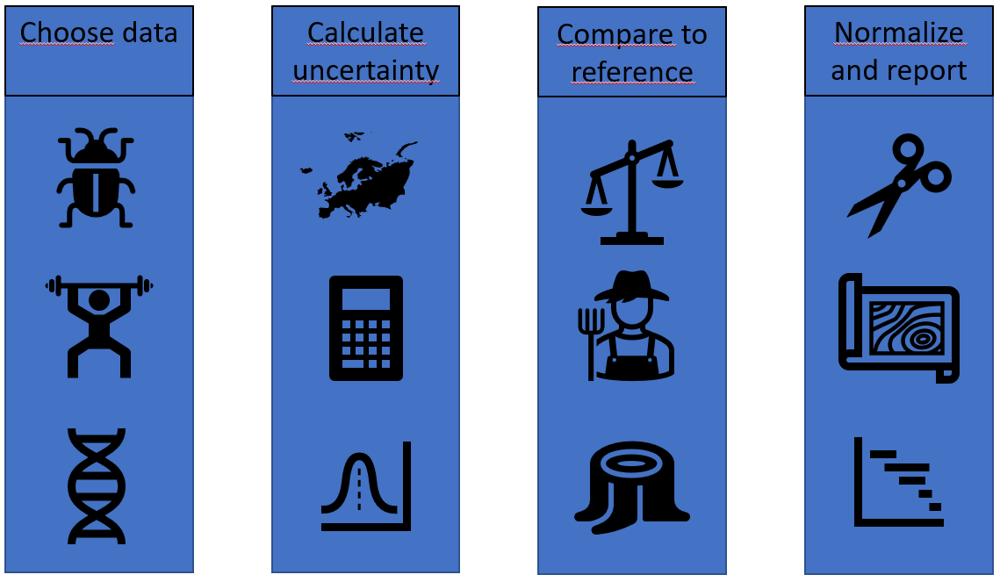

Most of the ecology comes into step 1, in choosing what data to use to describe a quality. This can be a custom selection of species, or a set of higher taxa such as specific genuses, families or even order. The goal is to choose a set of taxa that represent specific qualities of the community that can indicate the ecological status of the ecosystem. In addition to the selection of taxa, we have to decide on the level of aggregation, e.g. if we should aggregate the data on the region scale, locality scale, or even the individual sample occasion scale. For ecological indicators, we will aggregate the values to a year locality scale, where the variables summarises all catches in a locality in a year.[NOTE, implement 5 year/region aggregation]

The second step is to get an estimate of the uncertainty of the data, were we use the bootstrap method. This method is flexible, as we could bootstrap the samples on different sampling levels (samples within localities, regions within country). For the insect indicators, we will bootstrap and summarize the variables to regional values, for example expressing the mean values of insect biomass in Trøndelag in 2021, with uncertainty.

Ecological knowledge also comes into step 3, comparing the values to a reference state. Here we have several options. We could for example use a single defined value as the reference state. But we can also use a point in time as a reference point (e.g. the start of a time series).

Taken together, this framework is meant to facilitate the calculation of an arbitrary set of insect indicators, based on the combination of choices in data to fetch, aggregation level, and reference comparison. We can work through an example with pollinators, to showcase the framework. 

In the example, we start with connecting to the database in order to fetch the data.


```r
connect_to_insect_db()
```


For convenience, the pollinator families can be retrieved by the `get_pollinators()` function.


```r
pollinators <- get_pollinators()

pollinators_fam <- pollinators %>%
  select(family_latin) %>%
  pull()
```


|family_norwegian          |family_latin |
|:-------------------------|:------------|
|Gravebier                 |Andrenidae   |
|Langtungbebier            |Apidae       |
|Korttungebier             |Colletidae   |
|Markbier                  |Halictidae   |
|Buksamlerbier             |Megachilidae |
|Blomsterbier              |Melittidae   |
|Blomfluer                 |Syrphidae    |
|Smygere                   |Hesperiidae  |
|Glansvinger               |Lycaenidae   |
|Nymfevinger               |Nymphalidae  |
|Svalestjerter             |Papilionidae |
|Hvitvinger                |Pieridae     |
|Metallmerker (uoffisiell) |Riodinidae   |

We then fetch the community data for these families through the `get_observations` function. We additionally subset the habitat type that we are interested in, here semi-natural land. The result is a tibble of the aggregated number of species, shannon diversity, and the mean number of genetic variants per species. The default aggregation level is "year_locality", meaning the total observations for a locality within a year. 

Note that the output currently contains some experimental values, awaiting a more robust methodology. "Shannon diversity" doesn't really make sense without counts or amounts, etc. This will be replaced by measurements of genetic diversity that are based on published peer-reviewed methodology (Connor et al. 2023), in the (hopefully near) future.


```r

poll_loc_year <- get_observations(subset_families = pollinators_fam,
                                  subset_habitat = "Semi-nat")
```


```r
poll_loc_year %>% 
  slice(1:5) %>% 
kableExtra::kbl()
```

<table>
 <thead>
  <tr>
   <th style="text-align:right;"> year </th>
   <th style="text-align:left;"> locality </th>
   <th style="text-align:left;"> habitat_type </th>
   <th style="text-align:left;"> region_name </th>
   <th style="text-align:right;"> no_species </th>
   <th style="text-align:right;"> shannon_div </th>
   <th style="text-align:right;"> mean_asv_per_species </th>
   <th style="text-align:right;"> GDE_by_asv </th>
  </tr>
 </thead>
<tbody>
  <tr>
   <td style="text-align:right;"> 2020 </td>
   <td style="text-align:left;"> Semi-nat_01 </td>
   <td style="text-align:left;"> Semi-nat </td>
   <td style="text-align:left;"> Østlandet </td>
   <td style="text-align:right;"> 98 </td>
   <td style="text-align:right;"> 49.47 </td>
   <td style="text-align:right;"> 2.68 </td>
   <td style="text-align:right;"> 0.50 </td>
  </tr>
  <tr>
   <td style="text-align:right;"> 2020 </td>
   <td style="text-align:left;"> Semi-nat_02 </td>
   <td style="text-align:left;"> Semi-nat </td>
   <td style="text-align:left;"> Østlandet </td>
   <td style="text-align:right;"> 34 </td>
   <td style="text-align:right;"> 28.64 </td>
   <td style="text-align:right;"> 1.44 </td>
   <td style="text-align:right;"> 0.84 </td>
  </tr>
  <tr>
   <td style="text-align:right;"> 2020 </td>
   <td style="text-align:left;"> Semi-nat_03 </td>
   <td style="text-align:left;"> Semi-nat </td>
   <td style="text-align:left;"> Østlandet </td>
   <td style="text-align:right;"> 40 </td>
   <td style="text-align:right;"> 34.07 </td>
   <td style="text-align:right;"> 1.57 </td>
   <td style="text-align:right;"> 0.85 </td>
  </tr>
  <tr>
   <td style="text-align:right;"> 2020 </td>
   <td style="text-align:left;"> Semi-nat_04 </td>
   <td style="text-align:left;"> Semi-nat </td>
   <td style="text-align:left;"> Østlandet </td>
   <td style="text-align:right;"> 56 </td>
   <td style="text-align:right;"> 42.90 </td>
   <td style="text-align:right;"> 1.89 </td>
   <td style="text-align:right;"> 0.77 </td>
  </tr>
  <tr>
   <td style="text-align:right;"> 2020 </td>
   <td style="text-align:left;"> Semi-nat_05 </td>
   <td style="text-align:left;"> Semi-nat </td>
   <td style="text-align:left;"> Østlandet </td>
   <td style="text-align:right;"> 78 </td>
   <td style="text-align:right;"> 52.19 </td>
   <td style="text-align:right;"> 1.90 </td>
   <td style="text-align:right;"> 0.67 </td>
  </tr>
</tbody>
</table>

#### Bootstrap observations
The localities in the NorIns program are (semi-)randomly selected and can be viewed as samples of a larger population. Individually, they represent a single measurement of an insect community in a habitat type in a region. To get the sampling uncertainty for this representation, we can bootstrap the values by this simple process: we choose a random set of localities within a year and region (with replacement) and calculate the average values. We then repeat this process a large number of times to get a bootstrap sample of values, which can be used to express the uncertainty in the dataset.

We typically have 10 localities for a given habitat type and region each year, which is not very much to base our uncertainty estimates on. But bootstrapping works fairly well on small samples and has the advantage that is doesn't make assumptions of the statistical distribution of the errors. Note that once we get a larger dataset with repeating surveys every 5 years, aggregating and bootstrapping over a whole 5 year period.

When **NorIns** is fully scaled up, it will have 50 localities for each covered habitat type in every country region, with 10 localities every year, in a rotating survey scheme over 5 years. Since the program is rolled out sequentially starting in 2020, for semi-natural land it currently covers 4/5 of the country, with varying amounts of localities within each region. The map below displays the localities surveyed so far. 


```r
semi_loc <- get_localities(dataset = "NasIns",
                           habitat_type = "Semi-nat")
```


```r
norway_regions <- get_map()
```


```r
tm_shape(norway_regions) +
  tm_polygons("region") +
  tm_shape(semi_loc) +
  tm_symbols(col = "red",
             shape = 22,
             size = 0.8)
```


The bootstrap routine is implemented in the function `bootstrap_value()`, which takes a community (from `get_observation`) or weight dataset (from `get_biomass`) as its first input. It also needs to know what measurement in the dataset to bootstrap, and what, if any, grouping structure to aggregate the results on. In this example, we bootstrap the number of pollinator species, and aggregate the results on the year and regional scale.


```r

poll_richness_boot <- bootstrap_value(poll_loc_year,
                                      value = no_species,
                                      groups = c("year",
                                                 "region_name")
                                      )
```

This creates an object of type `boot_stat`. Calling it prints a simple summary of the bootstrap values.

```r
poll_richness_boot
#> # A tibble: 6 × 6
#>    year region_name no_species boot_sd boot_lower2.5 boot_…¹
#>   <int> <chr>            <dbl>   <dbl>         <dbl>   <dbl>
#> 1  2020 Østlandet         60.5    6.19          48.7    73.1
#> 2  2021 Trøndelag         42.0    2.94          35.6    47.2
#> 3  2021 Østlandet         53.8    5.71          41.9    65.3
#> 4  2022 Sørlandet         29.3    5.94          18.7    41.4
#> 5  2022 Trøndelag         34.7    2.46          30      39.9
#> 6  2022 Østlandet         35.9    2.84          30.1    41.3
#> # … with abbreviated variable name ¹​boot_upper97.5
```

But the `boot_stat` object also stores the individual bootstrap values for later computation. By default, we use 999 bootstrap samples, which here results in 999 samples * 6 groups = 5994 rows of bootstrap values.


```r
poll_richness_boot[2]
#> $bootstrap_values
#> # A tibble: 5,994 × 3
#> # Groups:   year, region_name [6]
#>     year region_name boot_values
#>    <int> <chr>             <dbl>
#>  1  2020 Østlandet          59.2
#>  2  2020 Østlandet          59.5
#>  3  2020 Østlandet          47.3
#>  4  2020 Østlandet          56.2
#>  5  2020 Østlandet          64.1
#>  6  2020 Østlandet          65  
#>  7  2020 Østlandet          67.6
#>  8  2020 Østlandet          56.6
#>  9  2020 Østlandet          67.9
#> 10  2020 Østlandet          56.3
#> # … with 5,984 more rows
```

#### Comparing bootstrap values to a reference point
Setting aside the practical difficulties in establishing robust reference values, the next step in the methodology is to compare the observed values (with bootstrapped uncertainty) to a chosen reference value. This can be made in several ways. Most simply, if we have a single numeric value as a reference value, we can simply subtract that from the observed values. For example, if we observe 13 species of pollinators in 2022 at a location, and the reference point is 10, the 2022 value has increased by 13 - 10 = 3 species. Such subtractions should be made on the set of bootstrapped values, followed by new summary statistics being calculated, preserving the uncertainty from the bootstrap. The `boot_stat` has its own subtraction method `-` do to just that. In this example, we set the reference value arbitrarily to 30 species.


```r
poll_richness_boot
#> # A tibble: 6 × 6
#>    year region_name no_species boot_sd boot_lower2.5 boot_…¹
#>   <int> <chr>            <dbl>   <dbl>         <dbl>   <dbl>
#> 1  2020 Østlandet         60.5    6.19          48.7    73.1
#> 2  2021 Trøndelag         42.0    2.94          35.6    47.2
#> 3  2021 Østlandet         53.8    5.71          41.9    65.3
#> 4  2022 Sørlandet         29.3    5.94          18.7    41.4
#> 5  2022 Trøndelag         34.7    2.46          30      39.9
#> 6  2022 Østlandet         35.9    2.84          30.1    41.3
#> # … with abbreviated variable name ¹​boot_upper97.5
```


```r
diff_poll_richness_boot <- poll_richness_boot - 30
```


```r
diff_poll_richness_boot
#> # A tibble: 6 × 6
#>    year region_name no_species boot_sd boot_lower2.5 boot_…¹
#>   <int> <chr>            <dbl>   <dbl>         <dbl>   <dbl>
#> 1  2020 Østlandet       30.5      6.19        18.7      43.1
#> 2  2021 Trøndelag       12.0      2.94         5.6      17.2
#> 3  2021 Østlandet       23.8      5.71        11.9      35.3
#> 4  2022 Sørlandet       -0.739    5.94       -11.3      11.4
#> 5  2022 Trøndelag        4.73     2.46         0         9.9
#> 6  2022 Østlandet        5.92     2.84         0.100    11.3
#> # … with abbreviated variable name ¹​boot_upper97.5
```

Alternatively, we could use a reference point in the time series itself. Say for example that we want to use the values for species richness of pollinators in semi-natural land i Østlandet 2020 as a reference point. We can then calculate the difference (the contrast) between this level and all the other levels. We do this by the function `boot_contrast()`

**NB! This functionality is in development. It currently works for single rows as reference points, but needs updating to allow for referencing several values simultaneously, e.g using the start values for all regions and habitat types as their own reference points.**


```r

diff_poll_richness_boot2 <- poll_richness_boot %>%
  boot_contrast(year == 2020 & region_name == 'Østlandet')
```


```r
diff_poll_richness_boot2
#> # A tibble: 6 × 6
#>    year region_name no_species boot_sd boot_lower2.5 boot_…¹
#>   <int> <chr>            <dbl>   <dbl>         <dbl>   <dbl>
#> 1  2020 Østlandet         0       0              0      0   
#> 2  2021 Trøndelag       -18.5     6.80         -33     -5.60
#> 3  2021 Østlandet        -6.69    8.28         -23.2    9.6 
#> 4  2022 Sørlandet       -31.3     8.72         -47.7  -14.4 
#> 5  2022 Trøndelag       -25.8     6.60         -38.9  -13.4 
#> 6  2022 Østlandet       -24.6     6.76         -38.2  -11.9 
#> # … with abbreviated variable name ¹​boot_upper97.5
```

#### Normalizing the values
After the comparison to a reference value, we need to normalize the indicator values so that they lie between 0 and 1. This can be done in several ways (se e.g. [eaTools](https://github.com/NINAnor/eaTools)). The simplest case is to use a linear scaling, with a natural zero, which e.g. can be done by dividing the indicator values by the highest value state. A `boot_stat` class has a `/` function that divides each bootstrap value by a given value, truncates the highest values to 1, and recalculates the summary values. We can also simply divide by the reference state, to compare the values to the reference state, and normalize them in one go. Here, we exemplify the method by dividing the value by 30.


```r
diff_poll_richness_boot3 <- poll_richness_boot / 30
```


```r
diff_poll_richness_boot3
#> # A tibble: 6 × 6
#>    year region_name no_species boot_sd boot_lower2.5 boot_…¹
#>   <int> <chr>            <dbl>   <dbl>         <dbl>   <dbl>
#> 1  2020 Østlandet        1     0               1           1
#> 2  2021 Trøndelag        1     0               1           1
#> 3  2021 Østlandet        1     0               1           1
#> 4  2022 Sørlandet        0.907 0.117           0.623       1
#> 5  2022 Trøndelag        0.999 0.00561         1           1
#> 6  2022 Østlandet        0.999 0.00735         1           1
#> # … with abbreviated variable name ¹​boot_upper97.5
```


#### Display and plot bootstrap values
The boot_stat class also has its own plot function. It tries to plot a comparison of the bootstrap distributions over years, for each group. For example, if we plot the object `diff_poll_richness_boot`, we can look at the yearly differences in beetles species richness in the two geographic regions: (Note that we have only 1 year of data from Sørlandet so far)


```r
plot(diff_poll_richness_boot)
```

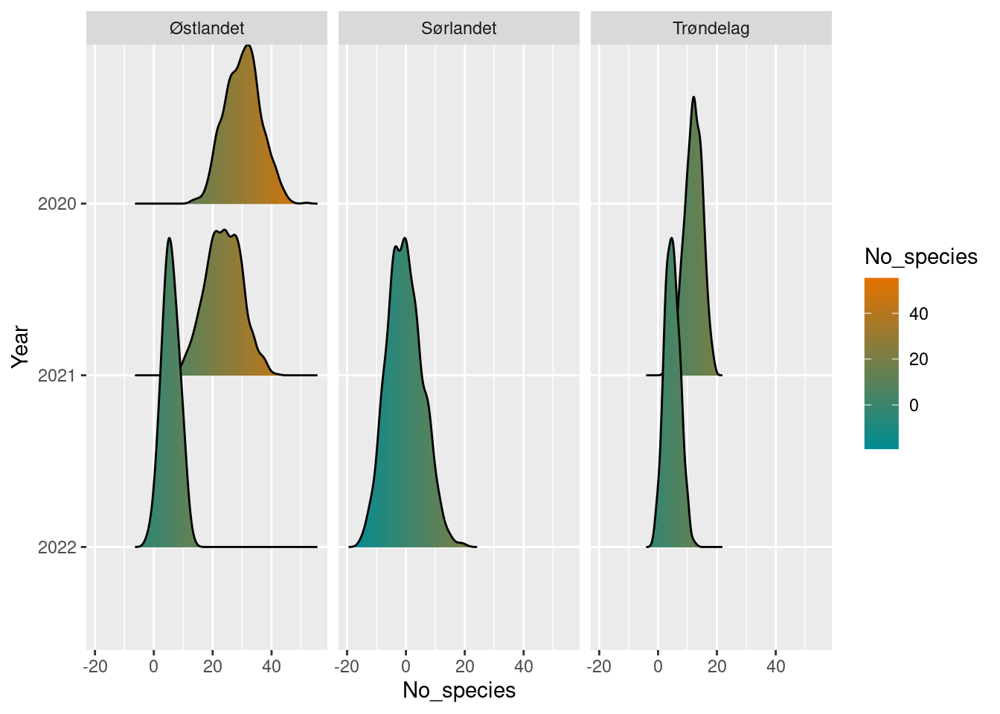

In the cases where we have used a single row as a reference point, this shows up as a sharp spike at 0.


```r
plot(diff_poll_richness_boot2)
```

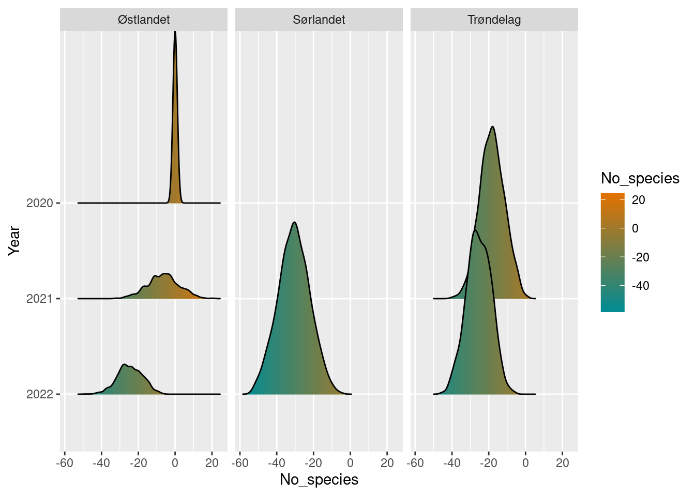

More plotting options are available, see the `Norimon` indicator workflow vignette.


#### Map plots
In addition to the density plots above, we can also display the values geographically. The `map_plot()` function takes a `boot_stat` object and plots the values according to its region names.


```r
map_plot(poll_richness_boot)
```

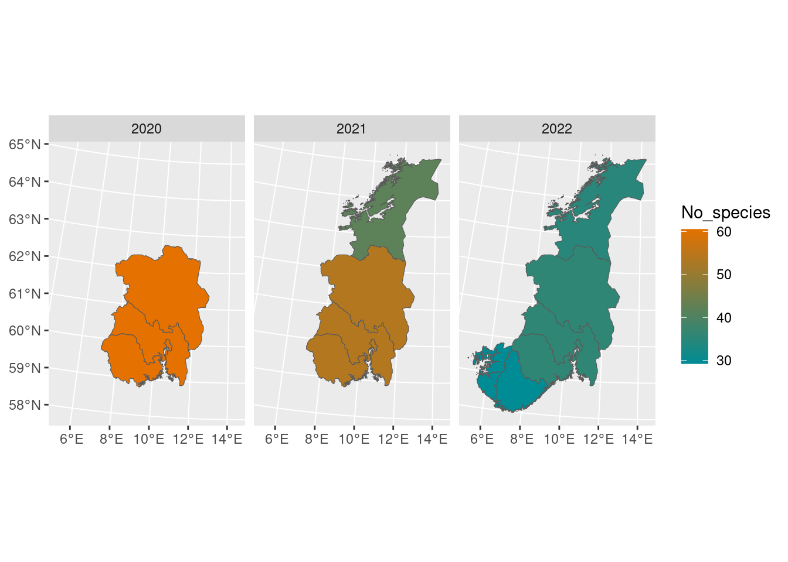

By default, it only shows the regions with data, but this can be overridden manually:

```r
map_plot(poll_richness_boot,
         whole_country = TRUE)
```

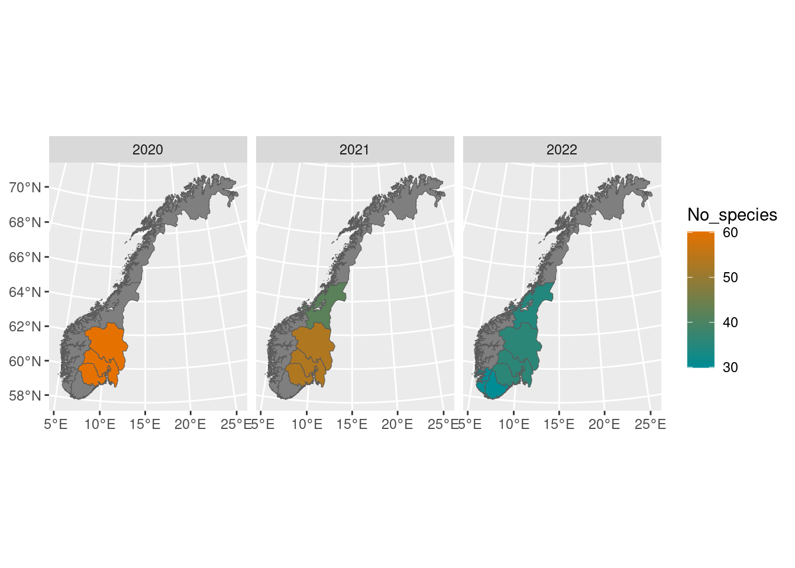

We can also choose a different palette, for example from the NinaR package, and visualize the uncertainty by setting the transparency of the colors from the bootstrap standard deviations. By the way, most of these functions can be piped as well:


```r
diff_poll_richness_boot %>%
map_plot(palette = "orange-green",
         whole_country = FALSE,
         alpha_from_sd = TRUE)
```

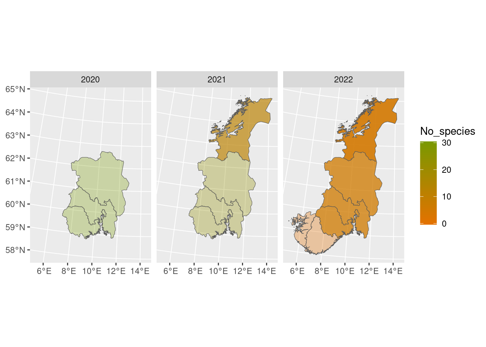

This concludes the tour of the `Norimon` functionality.

### Calculation principles for NBBM indicators
These indicators were developed for the Nature Index of Norway, back in 2010 by Ola Diserud and Sandra Öberg (Öberg et. al 2011), and are calculated routinely on a yearly basis (see Åström et. al 2022 for the latest report). 

These indicators summarize the state of a bumblebee or butterfly community by estimating the difference from a reference community. Formally, the community indicator (CI) is expressed as the relative change of the community from a state of reference (SR), were the change is calculated by a state of change (SC). 


$$CI = \frac{SR-SC}{SR}$$
The state of reference (SR) represents a community of species that can be expected to be observed in a given habitat type and region. It is calculated by assigning each species to class of expected commonality: common (C), sporadic (S) and rare (R) species. This classification is done by expert opinion, informed by known present and past species distributions. Note that this state of reference only contains a subset of highlighted species, making up a historical reference community. Potential observations of "new" species therefore don't inform the indicator value at all. Common species are expected to be observed in at least 5 % of the surveyed transects in a habitat type and region. Sporadic species similarly are defined as having a presence below 5 % but above 1 %. Rare species are seen in no more than 1 % of the transects, and lastly, species not seen in any transect are assumed as lost (L) for the purpose of this calculation. 
  
Each commonality class gets its own weight, so that common species inform the reference state more than sporadic species, followed by rare species. The state of reference (SR) is thus a value where each species adds to the state according to its commonality. Formally, it is defined as:

$$SR = n_C * w_{C, SR} + n_S * w_{S, SR} + n_R * w_{R, SR} = \sum_{i = (C, S, R)} n_i * w_{i, SR}, $$
where $n_i$ is the number of species in a commonality class (C, S, R), and the weights $[w_{C, SR}, w_{S, SR}, w_{R, SR}]$ specify their respective contribution to the reference state (SR). The weights used are $[w_{C, SR}, w_{S, SR}, w_{R, SR}] = [1.0, 0.75, 0.50]$, i.e. a sporadic species has 75 % the weight of a common species, and a rare species has 50 % the weight of a common species. 


The state of change (SC) is calculated as
 $$SC = n_{CS} * w_{CS} + n_{CR} * w_{CR} + n_{CL} * w_{CL} + n_{SR} * w_{SR} + n_{SL} * w_{SL} + n_{RL} * w_{RL}, $$ 
where $n_{CS}$ is the number of expected common species (C) that is observed sporadically (S), and $w_{CS}$ is the weight of this change. Similarly, $n_{CR}$ is the number of expected species that is observed rarely, $n_{RL}$ is the number of rare species that is lost, and so on. Potential increases in observation rates do not inform the indicator. Changes for common species are weighted more heavily than changes for less common species, and larger decreases are weighted more heavily than smaller decreases, such that $[w_{CS}, w_{CR}, w_{CL}, w_{SR}, w_{SL}, w_{RL}]= [0.50, 0.75, 1.00, 0.50, 0.75, 0.50]$.

The indicator values are estimated with uncertainty, by bootstrapping the set of localities within a region, and calculating the indicator for each of 9999 such samples.

#### Calculation example
These calculations with bootstrap sampling are implemented in the R-package `bombLepiSurv` ([Bombus and Lepidoptera Survey](https://github.com/jenast/bombLepiSurv)). We briefly show this functionality with bumblebees in semi-natural lands as an example.

We connect to the internal database with a convenience function.

```r
bombLepiSurv::humlesommerfConnect()
```


We can fetch all observations of bumblebees in semi-natural land with the `getAllData` function. Species names are here shown in Norwegian.


```r
allBombusGrassland2022 <- getAllData(type = "bumblebees",
                                     habitat = "gressmark",
                                     year = 2022,
                                     language = "norsk")
```


A summary of the records is most easily plotted by `surveyBarPlot`:


```r
surveyBarplot(allBombusGrassland2022)
```

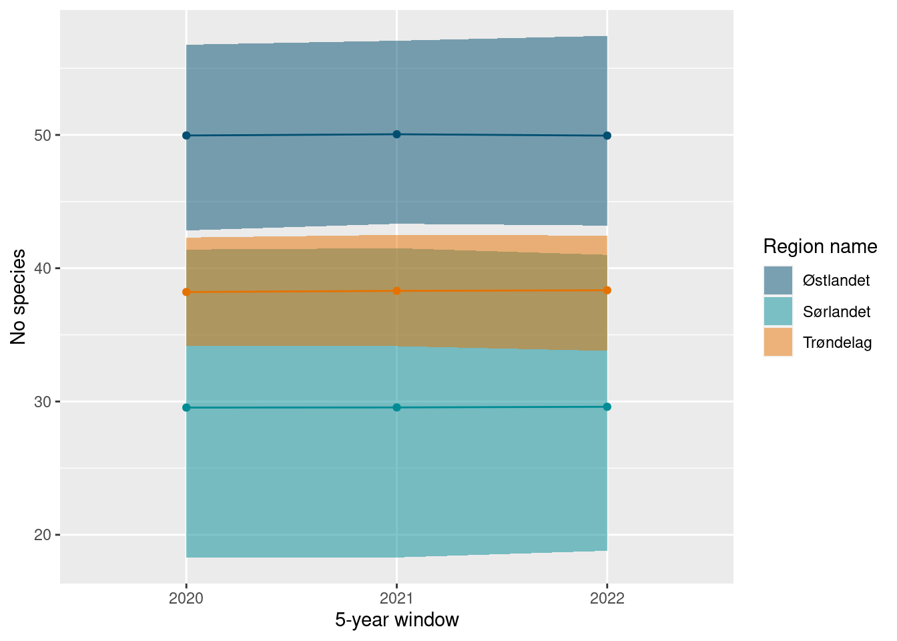

Note that for calculating the indicator values, we only consider the transects that were surveyed for the standard 3 times per year, to cover the phenology of the entire season without bias. Data of these complete survey rounds can be fetched from the database by the function `getComplData`, which fetches data from one habitat type and region at a time. 


```r
bombus_trond_2022 <- getComplData(type = "Humler",
                                  region_short = "Trond",
                                  habitat = "Gressmark",
                                  year = 2022)
```

The observed relative to the expected occurrences can be visualized through the `plotArt` function. This requires a reference community, which can be fetched through the `getExpValues` function.


```r
exp_bombus_trond <- getExpValues(type = "Humler",
                                 region_short = "Trond",
                                 habitat = "Gressmark")
```


Species in green bars are species that are expected to be common, who need to reach the green areas in the plot not to decrease the indicator value (from 1). Similarly with the blue (sporadic species), and red (rare species). We see in this case that _Bombus soroeensis_ is expected to be a sporadic species, but that it was only observed rarely. 


```r
plotArt(bombus_trond_2022,
        exp_bombus_trond)
```


The actual calculation and bootstrapping of the indicator is done in the function `calcInd`. This function calls the `getComplData` and `getExpectedValues` functions internally. It also requires the weights for the commonality classes in the reference community (SR), and the weights for the changes in state (CS). This is fetched internally via the functions `getAmountWeights` and `getDiffWeights`, respectively. Here the classes are coded in Norwegian (v = common, m = sporadic, s = rare).


```r
getDiffWeights()
#>      v    m   s
#> v 0.00 0.00 0.0
#> m 0.50 0.00 0.0
#> s 0.75 0.50 0.0
#> t 1.00 0.75 0.5
```


```r
getAmountWeights()
#>   v    m   s
#> 1 1 0.75 0.5
```

Lastly, we specify the number of samples for the bootstrap. To speed up, only 999 samples are used here.


```r
nIter = 999
```


```r
hInd2022TrondGress <- calcInd(type = "Humler",
                              region_short = "Trond",
                              habitat = "Gressmark",
                              year = 2022,
                              nIter = nIter,
                              save.draws = T)
```

The result is an object of class "comm_index" (community index). It comes with some (still rudimentary) print and plotting functions, showing the point estimate and the limits of a 95% confidence interval. Due to the limited number of species and the fixed "weights" of each species and state of change, the indicator calculation returns a distribution of discrete values. Therefore it can happen that the 95% and the 90% confidence intervals are the same, as in this case.


```r
hInd2022TrondGress
#> $`Community indicator estimates, with percentiles`
#>           2.5%             5% Point estimate            95% 
#>      0.5416667      0.5833333      0.7083333      0.7500000 
#>          97.5% 
#>      0.7500000
```


```r
plot(hInd2022TrondGress)
```

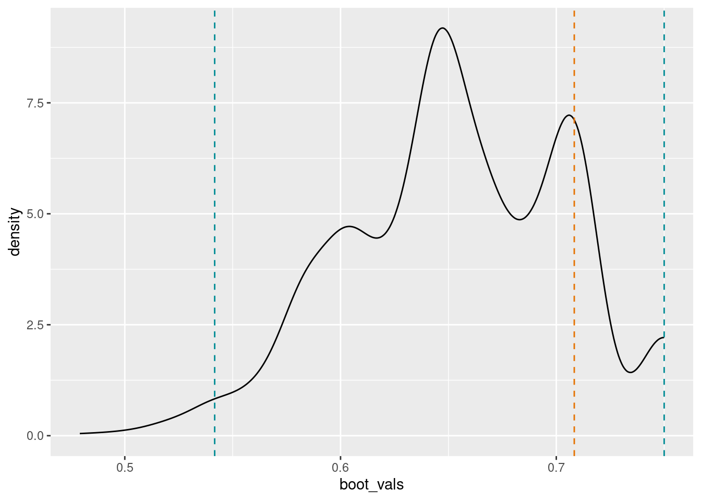

Plotting functions for a series of indicator values is shown below in the indicator calculations.


### Data sets
There are a few different ways to access the data required for these indicators. Both the NMBB and the NorIns project store their data in an internal database at NINA. They both also export most of their data to GBIF, but those exports need to be restructured before they can be processed in the following scripts.


#### NorIns data
The `Norimon` package has convenience functions to fetch data from the database, housed internally at NINA. This database is currently not available outside NINA, but we will implement a solution for this. Either we will make the database externally available, or we will provide an alternative route to the data from the GBIF export. For now, we will fetch the data through the `Norimon` functions.


#### NMBB data
The data for the bumblebee and butterfly indicators can be accessed through the R-package `bombLepiSurv`. 


#### Regions
<!-- In case you need to map the indicator value to regions, you can do that here. Remove this chapter if not relevant. -->
We here show how to import a shape file with the regional delineation. The indicators associated with the NorIns project can be attributed to the 5 country regions of Norway. Currently however, the data program only covers 4 of the 5 regions.


```r
connect_to_insect_db()
norway_regions <- Norimon::get_map()

```


```r
norway_reg_NorIns <- norway_regions %>% 
  filter(region != "Vestlandet") %>% 
  select(region) %>% 
  group_by(region) %>% 
  summarize(geom = st_union(geom))
```


```r
tm_shape(norway_reg_NorIns) + 
  tm_polygons(col = "region") 
```

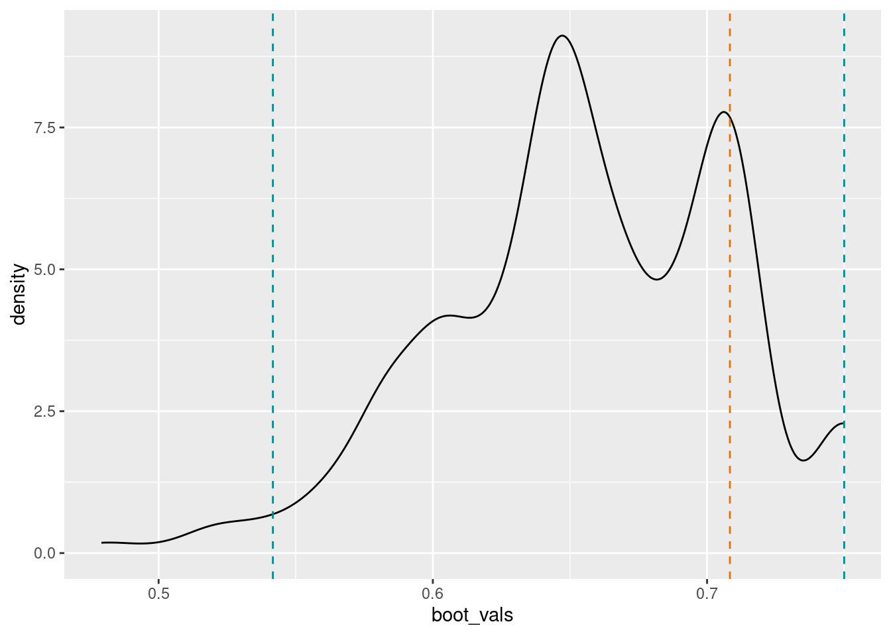

The indicators from the NMBB program are similary connected to regions, with the exception that the south-east region only covers the old counties of Vestfold and Østfold, and that Nord-Norge isn't covered yet.


```r
nbbm_norway_regions <- bombLepiSurv::get_map()
```


```r

norway_reg_NBBM <- nbbm_norway_regions %>% 
  filter(region %in% c("Øst", "Sørlandet", "Trøndelag", "Vestlandet")) %>% 
  select(region) %>% 
  group_by(region) %>% 
  summarize(geom = st_union(geom))
```


```r
tm_shape(norway_reg_NBBM) + 
  tm_polygons(col = "region") 
```

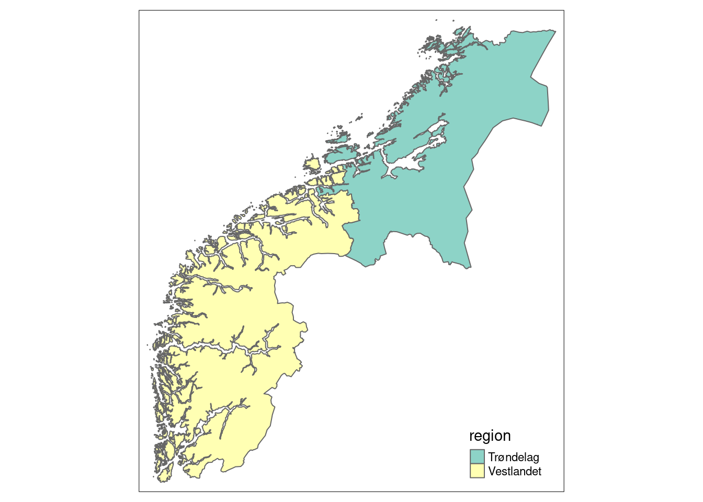


### Calculation of NorIns indicators
Here we calculate the indicators in abbreviated form, following the general framework outlined above.

#### Biomass of flying insects in semi-natural land

Fetch the data.

```r
biomass_sn <- get_biomass(subset_year = 2020:2022,
                          subset_region = NULL)
```


Calculate the indicator values for each region and year.

```r
biomass_sn_boot <- bootstrap_value(df = biomass_sn,
                                   value = avg_wet_weight,
                                   groups = c("year",
                                              "region_name")
                                   )
```

Compare values to a reference state. The reference state is here set uniformly for all regions, with a made-up value just to be able to continue the calculations. Alternatively, we could calculate the indicator values for each region separately, compare to individual reference states, and then put it all together again.

We here use a single value as a reference state and normalize the values at the same time, using the `/` function.


```r
biomass_ref <- 50
  
biomass_sn_diff <- biomass_sn_boot / biomass_ref
```

Plot the results and display uncertainty.

```r
biomass_sn_diff
#> # A tibble: 6 × 6
#>    year region_name avg_wet_weight boot_sd boot_lo…¹ boot_…²
#>   <int> <chr>                <dbl>   <dbl>     <dbl>   <dbl>
#> 1  2020 Østlandet            0.674  0.0802     0.522   0.833
#> 2  2021 Trøndelag            0.860  0.0991     0.658   1    
#> 3  2021 Østlandet            0.579  0.0731     0.438   0.729
#> 4  2022 Sørlandet            0.464  0.0648     0.332   0.589
#> 5  2022 Trøndelag            0.627  0.0700     0.502   0.775
#> 6  2022 Østlandet            0.376  0.0409     0.298   0.459
#> # … with abbreviated variable names ¹​boot_lower2.5,
#> #   ²​boot_upper97.5
```


```r
plot(biomass_sn_diff)
```

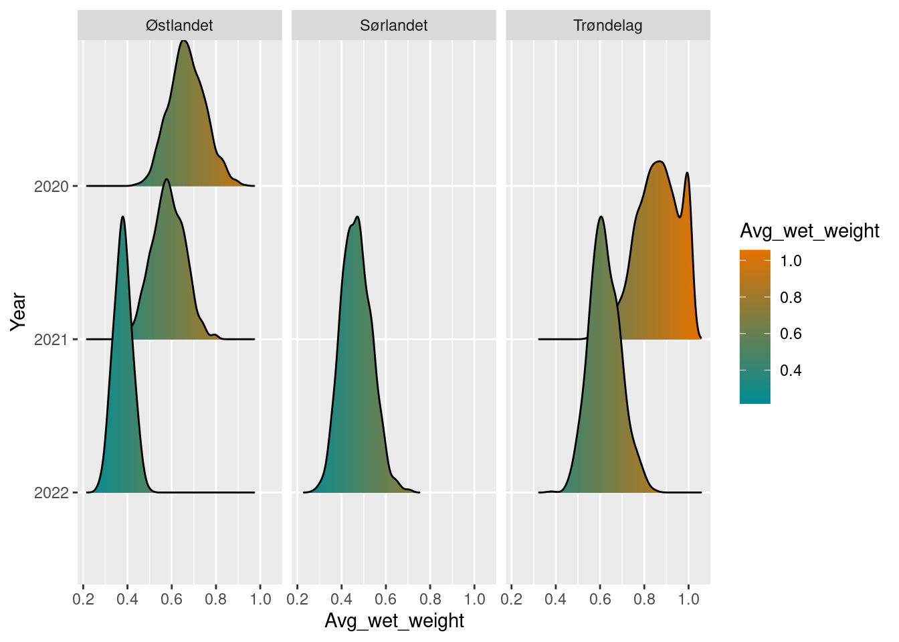

Prepare export format.


```r
biomass_sn_to_exp <- biomass_sn_diff$bootstrap_summary

biomass_sn_to_exp <- biomass_sn_to_exp %>% 
  select(year,
         region = region_name,
         ind_value = boot_value,
         ind_sd = boot_sd,
         ind_lower2.5 = boot_lower2.5,
         ind_upper97.5 = boot_upper97.5)

biomass_sn_to_exp <- norway_reg_NorIns  %>% 
  inner_join(biomass_sn_to_exp,
            by = c("region" = "region"),
            multiple = "all")

biomass_sn_to_exp
#> Simple feature collection with 6 features and 6 fields
#> Geometry type: MULTIPOLYGON
#> Dimension:     XY
#> Bounding box:  xmin: -76208 ymin: 6450245 xmax: 468357.5 ymax: 7237323
#> Projected CRS: ETRS89 / UTM zone 33N
#> # A tibble: 6 × 7
#>   region                           geom  year ind_v…¹ ind_sd
#>   <chr>              <MULTIPOLYGON [m]> <int>   <dbl>  <dbl>
#> 1 Sørlandet (((-31605 6513854, -31464 …  2022   0.464 0.0648
#> 2 Trøndelag (((227783 7068646, 227876 …  2021   0.860 0.0991
#> 3 Trøndelag (((227783 7068646, 227876 …  2022   0.627 0.0700
#> 4 Østlandet (((179915 6537265, 180246 …  2020   0.674 0.0802
#> 5 Østlandet (((179915 6537265, 180246 …  2021   0.579 0.0731
#> 6 Østlandet (((179915 6537265, 180246 …  2022   0.376 0.0409
#> # … with 2 more variables: ind_lower2.5 <dbl>,
#> #   ind_upper97.5 <dbl>, and abbreviated variable name
#> #   ¹​ind_value
```


#### Species richness of flying insects in semi-natural land

Fetch the data.


```r
richness_sn <- get_observations(subset_year = 2020:2022,
                                subset_region = NULL)
```


Calculate the indicator values for each region and year.

```r
richness_sn_boot <- bootstrap_value(df = richness_sn,
                                   value = no_species,
                                   groups = c("year",
                                              "region_name")
                                   )
```

Compare to arbitrary reference value and normalize.

```r
richness_ref <- 4000
  
richness_sn_diff <- richness_sn_boot / richness_ref
```

Plot the results and display uncertainty.

```r
richness_sn_diff
#> # A tibble: 6 × 6
#>    year region_name no_species boot_sd boot_lower2.5 boot_…¹
#>   <int> <chr>            <dbl>   <dbl>         <dbl>   <dbl>
#> 1  2020 Østlandet        0.517  0.0478         0.426   0.614
#> 2  2021 Trøndelag        0.697  0.0450         0.593   0.772
#> 3  2021 Østlandet        0.767  0.0407         0.689   0.849
#> 4  2022 Sørlandet        0.543  0.0619         0.420   0.668
#> 5  2022 Trøndelag        0.630  0.0290         0.572   0.685
#> 6  2022 Østlandet        0.627  0.0210         0.582   0.666
#> # … with abbreviated variable name ¹​boot_upper97.5
```


```r
plot(richness_sn_diff)
```

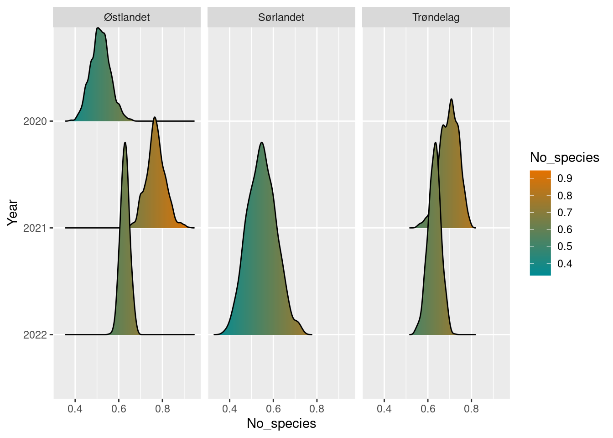

Prepare export format.


```r
richness_sn_to_exp <- richness_sn_diff$bootstrap_summary

richness_sn_to_exp <- richness_sn_to_exp %>% 
  select(year,
         region = region_name,
         ind_value = boot_value,
         ind_sd = boot_sd,
         ind_lower2.5 = boot_lower2.5,
         ind_upper97.5 = boot_upper97.5)

richness_sn_to_exp <- norway_reg_NorIns  %>% 
  inner_join(richness_sn_to_exp,
            by = c("region" = "region"),
            multiple = "all")

richness_sn_to_exp
#> Simple feature collection with 6 features and 6 fields
#> Geometry type: MULTIPOLYGON
#> Dimension:     XY
#> Bounding box:  xmin: -76208 ymin: 6450245 xmax: 468357.5 ymax: 7237323
#> Projected CRS: ETRS89 / UTM zone 33N
#> # A tibble: 6 × 7
#>   region                           geom  year ind_v…¹ ind_sd
#>   <chr>              <MULTIPOLYGON [m]> <int>   <dbl>  <dbl>
#> 1 Sørlandet (((-31605 6513854, -31464 …  2022   0.543 0.0619
#> 2 Trøndelag (((227783 7068646, 227876 …  2021   0.697 0.0450
#> 3 Trøndelag (((227783 7068646, 227876 …  2022   0.630 0.0290
#> 4 Østlandet (((179915 6537265, 180246 …  2020   0.517 0.0478
#> 5 Østlandet (((179915 6537265, 180246 …  2021   0.767 0.0407
#> 6 Østlandet (((179915 6537265, 180246 …  2022   0.627 0.0210
#> # … with 2 more variables: ind_lower2.5 <dbl>,
#> #   ind_upper97.5 <dbl>, and abbreviated variable name
#> #   ¹​ind_value
```


#### Species richness of pollinators in semi-natural land

Fetch the data.

```r
pollinator_fam <- get_pollinators() %>% 
  select(family_latin) %>% 
  pull()
  
```


```r
pollinators_sn <- get_observations(subset_year = 2020:2022,
                                   subset_families = pollinator_fam,
                                   subset_region = NULL)
```


Calculate the indicator values for each region and year.

```r
pollinators_sn_boot <- bootstrap_value(df = pollinators_sn,
                                       value = no_species,
                                       groups = c("year",
                                                  "region_name")
                                       )
```
Compare to arbitrary reference value and normalize.

```r
pollinators_ref <- 50
  
pollinators_sn_diff <- pollinators_sn_boot / pollinators_ref
```

Plot the results and display uncertainty.

```r
pollinators_sn_diff
#> # A tibble: 6 × 6
#>    year region_name no_species boot_sd boot_lower2.5 boot_…¹
#>   <int> <chr>            <dbl>   <dbl>         <dbl>   <dbl>
#> 1  2020 Østlandet        0.925  0.0732         0.754   1    
#> 2  2021 Trøndelag        0.839  0.0633         0.702   0.944
#> 3  2021 Østlandet        0.910  0.0740         0.748   1    
#> 4  2022 Sørlandet        0.594  0.115          0.372   0.83 
#> 5  2022 Trøndelag        0.695  0.0492         0.6     0.794
#> 6  2022 Østlandet        0.637  0.0559         0.526   0.746
#> # … with abbreviated variable name ¹​boot_upper97.5
```


```r
plot(pollinators_sn_diff)
```

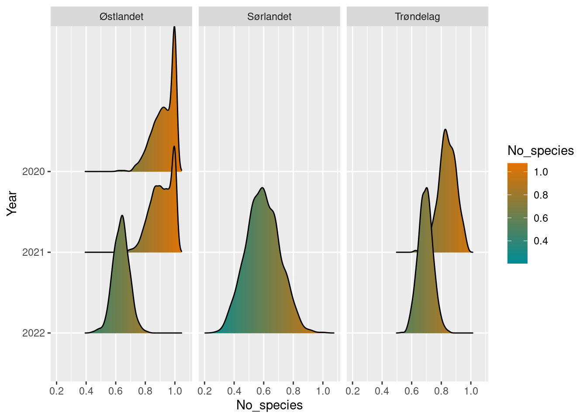

Prepare export format.


```r
pollinators_sn_to_exp <- pollinators_sn_diff$bootstrap_summary

pollinators_sn_to_exp <- pollinators_sn_to_exp %>% 
  select(year,
         region = region_name,
         ind_value = boot_value,
         ind_sd = boot_sd,
         ind_lower2.5 = boot_lower2.5,
         ind_upper97.5 = boot_upper97.5)

pollinators_sn_to_exp <- norway_reg_NorIns  %>% 
  inner_join(pollinators_sn_to_exp,
            by = c("region" = "region"),
            multiple = "all")

pollinators_sn_to_exp
#> Simple feature collection with 6 features and 6 fields
#> Geometry type: MULTIPOLYGON
#> Dimension:     XY
#> Bounding box:  xmin: -76208 ymin: 6450245 xmax: 468357.5 ymax: 7237323
#> Projected CRS: ETRS89 / UTM zone 33N
#> # A tibble: 6 × 7
#>   region                           geom  year ind_v…¹ ind_sd
#>   <chr>              <MULTIPOLYGON [m]> <int>   <dbl>  <dbl>
#> 1 Sørlandet (((-31605 6513854, -31464 …  2022   0.594 0.115 
#> 2 Trøndelag (((227783 7068646, 227876 …  2021   0.839 0.0633
#> 3 Trøndelag (((227783 7068646, 227876 …  2022   0.695 0.0492
#> 4 Østlandet (((179915 6537265, 180246 …  2020   0.925 0.0732
#> 5 Østlandet (((179915 6537265, 180246 …  2021   0.910 0.0740
#> 6 Østlandet (((179915 6537265, 180246 …  2022   0.637 0.0559
#> # … with 2 more variables: ind_lower2.5 <dbl>,
#> #   ind_upper97.5 <dbl>, and abbreviated variable name
#> #   ¹​ind_value
```

#### Species richness of dung associated insects
Note that the species list will probably be expanded, after a taxonomic review.

Fetch the data.


```r
dung_fam <- c("Muscidae") 
  
dung_sn <- get_observations(subset_year = 2020:2022,
                                   subset_families = dung_fam,
                                   subset_region = NULL)
```

[This will be amended with data based on genus and species lists. Need to use the lowest taxonomic resolution. Will implement a species lookup list in the database]

Calculate the indicator values for each region and year.

```r
dung_sn_boot <- bootstrap_value(df = dung_sn,
                                       value = no_species,
                                       groups = c("year",
                                                  "region_name")
                                       )
```
Compare to arbitrary reference value and normalize.


```r
dung_ref <- 90
  
dung_sn_diff <- dung_sn_boot / dung_ref
```

Plot the results and display uncertainty.

```r
dung_sn_diff
#> # A tibble: 6 × 6
#>    year region_name no_species boot_sd boot_lower2.5 boot_…¹
#>   <int> <chr>            <dbl>   <dbl>         <dbl>   <dbl>
#> 1  2020 Østlandet        0.685  0.0501         0.587   0.784
#> 2  2021 Trøndelag        0.926  0.0538         0.804   1    
#> 3  2021 Østlandet        0.838  0.0492         0.742   0.937
#> 4  2022 Sørlandet        0.671  0.0674         0.553   0.807
#> 5  2022 Trøndelag        0.926  0.0410         0.841   0.997
#> 6  2022 Østlandet        0.636  0.0442         0.548   0.718
#> # … with abbreviated variable name ¹​boot_upper97.5
```


```r
plot(dung_sn_diff)
```

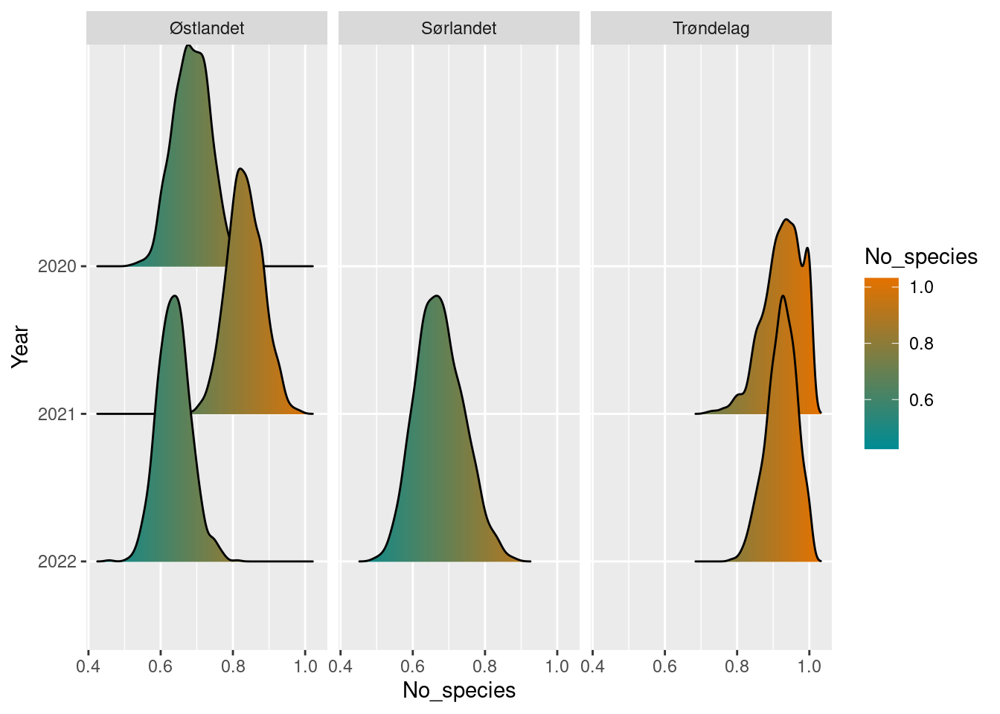

Prepare export format.


```r
dung_sn_to_exp <- dung_sn_diff$bootstrap_summary

dung_sn_to_exp <- dung_sn_to_exp %>% 
  select(year,
         region = region_name,
         ind_value = boot_value,
         ind_sd = boot_sd,
         ind_lower2.5 = boot_lower2.5,
         ind_upper97.5 = boot_upper97.5)

dung_sn_to_exp <- norway_reg_NorIns  %>% 
  inner_join(dung_sn_to_exp,
            by = c("region" = "region"),
            multiple = "all")

dung_sn_to_exp
#> Simple feature collection with 6 features and 6 fields
#> Geometry type: MULTIPOLYGON
#> Dimension:     XY
#> Bounding box:  xmin: -76208 ymin: 6450245 xmax: 468357.5 ymax: 7237323
#> Projected CRS: ETRS89 / UTM zone 33N
#> # A tibble: 6 × 7
#>   region                           geom  year ind_v…¹ ind_sd
#>   <chr>              <MULTIPOLYGON [m]> <int>   <dbl>  <dbl>
#> 1 Sørlandet (((-31605 6513854, -31464 …  2022   0.671 0.0674
#> 2 Trøndelag (((227783 7068646, 227876 …  2021   0.926 0.0538
#> 3 Trøndelag (((227783 7068646, 227876 …  2022   0.926 0.0410
#> 4 Østlandet (((179915 6537265, 180246 …  2020   0.685 0.0501
#> 5 Østlandet (((179915 6537265, 180246 …  2021   0.838 0.0492
#> 6 Østlandet (((179915 6537265, 180246 …  2022   0.636 0.0442
#> # … with 2 more variables: ind_lower2.5 <dbl>,
#> #   ind_upper97.5 <dbl>, and abbreviated variable name
#> #   ¹​ind_value
```


#### Relationship between Symphyta and Parasitica in semi-natural land


```r
symphyta_fam <- c("Argidae", "Cephidae", "Cimbicidae", 
                  "Diprionidae", "Orussidae", "Pamphiliidae", 
                  "Pergidae", "Siricidae", "Anaxyelidae",
                  "Tenthredinidae", "Xiphydriidae", "Xyelidae") 

symphyta_sn <- get_observations(subset_year = 2020:2022,
                                subset_families = symphyta_fam,
                                subset_region = NULL)

symphyta_sn
#> # A tibble: 90 × 8
#>     year locality habitat_…¹ regio…² no_sp…³ shann…⁴ mean_…⁵
#>    <int> <chr>    <chr>      <chr>     <int>   <dbl>   <dbl>
#>  1  2020 Skog_01  Forest     Østlan…      15   15       1   
#>  2  2020 Skog_02  Forest     Østlan…      42   36.8     1.31
#>  3  2020 Skog_03  Forest     Østlan…      24   21       1.38
#>  4  2020 Skog_04  Forest     Østlan…       5    4.37    1.4 
#>  5  2020 Skog_05  Forest     Østlan…      23   21.6     1.17
#>  6  2020 Skog_06  Forest     Østlan…       9    8.71    1.11
#>  7  2020 Skog_07  Forest     Østlan…      25   22.5     1.4 
#>  8  2020 Skog_08  Forest     Østlan…       7    6.73    1.14
#>  9  2020 Skog_09  Forest     Østlan…      18   17.4     1.11
#> 10  2020 Skog_10  Forest     Østlan…      11    4.6     2.64
#> # … with 80 more rows, 1 more variable: GDE_by_asv <dbl>,
#> #   and abbreviated variable names ¹​habitat_type,
#> #   ²​region_name, ³​no_species, ⁴​shannon_div,
#> #   ⁵​mean_asv_per_species
```

[Note, this list needs to be checked over by e.g. Arnstein.]

```r
parasitica_fam <- c("Braconidae", "Ichneumonidae", "Chalcididae", 
                    "Eulophidae", "Pteromalidae", "Aphelinidae", 
                    "Scelionidae", "Eupelmidae", "Encyrtidae", 
                    "Mymaridae", "Diapriidae", "Bethylidae", 
                    "Evaniidae", "Ceraphronidae", "Torymidae", 
                    "Dryinidae", "Eucharitidae", "Mymarommatidae", 
                    "Orussidae", "Megaspilidae", "Stephanidae", 
                    "Trigonalidae", "Platygastridae", "Aulacidae", 
                    "Gasteruptiidae", "Rhopalosomatidae", "Larridae", 
                    "Agaonidae", "Pompilidae", "Bradynobaenidae"
                    )

parasitica_sn <- get_observations(subset_year = 2020:2022,
                                subset_families = parasitica_fam,
                                subset_region = NULL)

parasitica_sn
#> # A tibble: 90 × 8
#>     year locality habitat_…¹ regio…² no_sp…³ shann…⁴ mean_…⁵
#>    <int> <chr>    <chr>      <chr>     <int>   <dbl>   <dbl>
#>  1  2020 Skog_01  Forest     Østlan…     208   187.     1.34
#>  2  2020 Skog_02  Forest     Østlan…     508   447.     1.39
#>  3  2020 Skog_03  Forest     Østlan…     312   256.     1.56
#>  4  2020 Skog_04  Forest     Østlan…     130   121.     1.2 
#>  5  2020 Skog_05  Forest     Østlan…     236   208.     1.43
#>  6  2020 Skog_06  Forest     Østlan…      99    90.3    1.23
#>  7  2020 Skog_07  Forest     Østlan…     337   284.     1.46
#>  8  2020 Skog_08  Forest     Østlan…     114   111.     1.08
#>  9  2020 Skog_09  Forest     Østlan…     168   152.     1.27
#> 10  2020 Skog_10  Forest     Østlan…     175   161.     1.22
#> # … with 80 more rows, 1 more variable: GDE_by_asv <dbl>,
#> #   and abbreviated variable names ¹​habitat_type,
#> #   ²​region_name, ³​no_species, ⁴​shannon_div,
#> #   ⁵​mean_asv_per_species
```

Divide the richness of Parasitica by Symphyta. [Could make a function for this later on.]


```r
par_sym <- symphyta_sn %>% 
  full_join(parasitica_sn,
       by = c("year" ="year",
              "locality" = "locality",
              "habitat_type" = "habitat_type",
              "region_name" = "region_name"),
       suffix = c("_sym", "_par")
       ) %>% 
  mutate(par_per_sym_richn = no_species_par / no_species_sym)
```

Bootstrap the fraction of Parasitica to Symphyta.


```r
par_sym_sn_boot <- bootstrap_value(par_sym,
                                value = par_per_sym_richn,
                                groups = c("year", 
                                           "region_name"))
```

Compare to arbitrary reference value and normalize.


```r
par_sym_ref <- 40
  
par_sym_sn_diff <- par_sym_sn_boot / par_sym_ref
```

Plot the results and display uncertainty.

```r
par_sym_sn_diff
#> # A tibble: 6 × 6
#>    year region_name par_per_sym_ri…¹ boot_sd boot_…² boot_…³
#>   <int> <chr>                  <dbl>   <dbl>   <dbl>   <dbl>
#> 1  2020 Østlandet              0.287  0.0237   0.245   0.339
#> 2  2021 Trøndelag              0.893  0.0913   0.702   1    
#> 3  2021 Østlandet              0.603  0.0522   0.500   0.711
#> 4  2022 Sørlandet              0.816  0.170    0.527   1    
#> 5  2022 Trøndelag              0.561  0.0603   0.454   0.689
#> 6  2022 Østlandet              0.710  0.132    0.478   1    
#> # … with abbreviated variable names ¹​par_per_sym_richn,
#> #   ²​boot_lower2.5, ³​boot_upper97.5
```


```r
plot(par_sym_sn_diff)
```

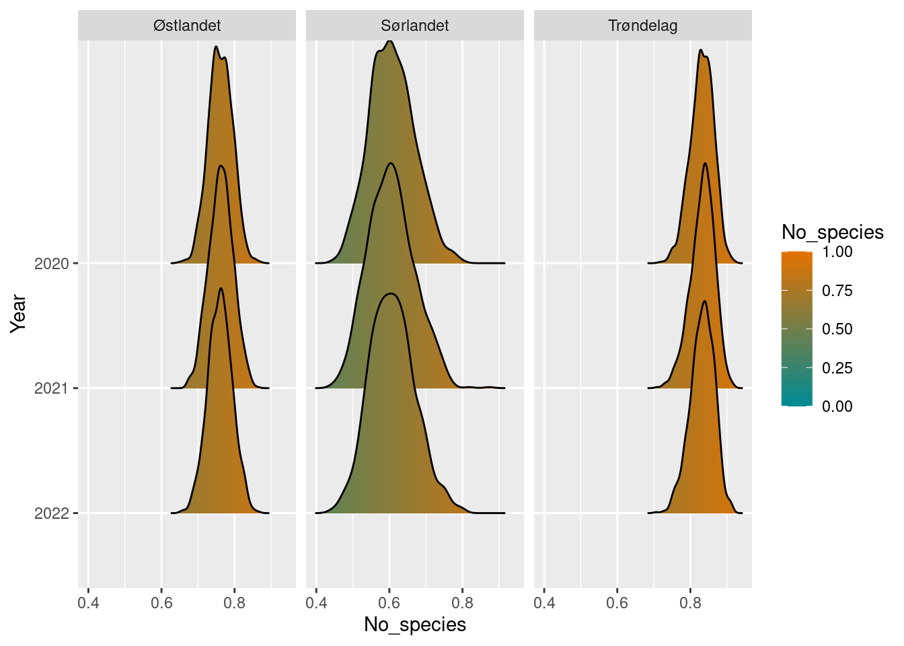

Prepare export format.


```r
par_sym_sn_exp <- par_sym_sn_diff$bootstrap_summary

par_sym_sn_exp <- par_sym_sn_exp %>% 
  select(year,
         region = region_name,
         ind_value = boot_value,
         ind_sd = boot_sd,
         ind_lower2.5 = boot_lower2.5,
         ind_upper97.5 = boot_upper97.5)

par_sym_sn_exp <- norway_reg_NorIns  %>% 
  inner_join(par_sym_sn_exp,
            by = c("region" = "region"),
            multiple = "all")

par_sym_sn_exp
#> Simple feature collection with 6 features and 6 fields
#> Geometry type: MULTIPOLYGON
#> Dimension:     XY
#> Bounding box:  xmin: -76208 ymin: 6450245 xmax: 468357.5 ymax: 7237323
#> Projected CRS: ETRS89 / UTM zone 33N
#> # A tibble: 6 × 7
#>   region                           geom  year ind_v…¹ ind_sd
#>   <chr>              <MULTIPOLYGON [m]> <int>   <dbl>  <dbl>
#> 1 Sørlandet (((-31605 6513854, -31464 …  2022   0.816 0.170 
#> 2 Trøndelag (((227783 7068646, 227876 …  2021   0.893 0.0913
#> 3 Trøndelag (((227783 7068646, 227876 …  2022   0.561 0.0603
#> 4 Østlandet (((179915 6537265, 180246 …  2020   0.287 0.0237
#> 5 Østlandet (((179915 6537265, 180246 …  2021   0.603 0.0522
#> 6 Østlandet (((179915 6537265, 180246 …  2022   0.710 0.132 
#> # … with 2 more variables: ind_lower2.5 <dbl>,
#> #   ind_upper97.5 <dbl>, and abbreviated variable name
#> #   ¹​ind_value
```

#### Genetic diversity evenness of flying insects in semi-natural land
This is not fully implemented yet, and the method shown here functions as a placeholder, awaiting a proper calculation. Here, the intraspecific variation is based simply on the number of unique genetic variants (ASVs), and their relative abundance measured as number of DNA-reads in the samples. But to do this properly, we need to use the full COI sequence to calculate the true GDE (see Connor et al. 2023). This temporarily postponed due to lack of software, but will be updated (and amended here) as soon as possible.


Fetch the data.

```r
richness_sn <- get_observations(subset_year = 2020:2022,
                                subset_region = NULL)
```

Calculate the indicator values for each region and year.


```r
gde_sn_boot <- bootstrap_value(df = richness_sn,
                                   value = GDE_by_asv,
                                   groups = c("year",
                                              "region_name")
                                   )
```

Compare to arbitrary reference value and normalize.

```r
gde_sn_ref <- 0.7
  
gde_sn_diff <- gde_sn_boot / gde_sn_ref
```

Plot the results and display uncertainty.

```r
gde_sn_diff
#> # A tibble: 6 × 6
#>    year region_name GDE_by_asv boot_sd boot_lower2.5 boot_…¹
#>   <int> <chr>            <dbl>   <dbl>         <dbl>   <dbl>
#> 1  2020 Østlandet        0.871  0.0299         0.814   0.931
#> 2  2021 Trøndelag        0.755  0.0254         0.706   0.803
#> 3  2021 Østlandet        0.825  0.0178         0.79    0.859
#> 4  2022 Sørlandet        0.812  0.0277         0.756   0.867
#> 5  2022 Trøndelag        0.746  0.0218         0.706   0.793
#> 6  2022 Østlandet        0.933  0.0155         0.901   0.964
#> # … with abbreviated variable name ¹​boot_upper97.5
```


```r
plot(gde_sn_diff)
```

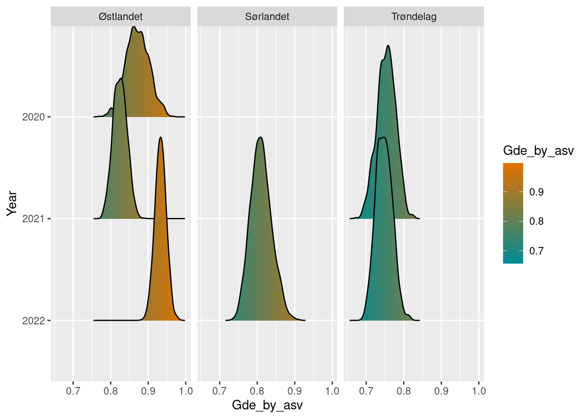

Prepare export format.


```r
gde_sn_to_exp <- gde_sn_diff$bootstrap_summary

gde_sn_to_exp <- gde_sn_to_exp %>% 
  select(year,
         region = region_name,
         ind_value = boot_value,
         ind_sd = boot_sd,
         ind_lower2.5 = boot_lower2.5,
         ind_upper97.5 = boot_upper97.5)

gde_sn_to_exp <- norway_reg_NorIns  %>% 
  inner_join(gde_sn_to_exp,
            by = c("region" = "region"),
            multiple = "all")

gde_sn_to_exp
#> Simple feature collection with 6 features and 6 fields
#> Geometry type: MULTIPOLYGON
#> Dimension:     XY
#> Bounding box:  xmin: -76208 ymin: 6450245 xmax: 468357.5 ymax: 7237323
#> Projected CRS: ETRS89 / UTM zone 33N
#> # A tibble: 6 × 7
#>   region                           geom  year ind_v…¹ ind_sd
#>   <chr>              <MULTIPOLYGON [m]> <int>   <dbl>  <dbl>
#> 1 Sørlandet (((-31605 6513854, -31464 …  2022   0.812 0.0277
#> 2 Trøndelag (((227783 7068646, 227876 …  2021   0.755 0.0254
#> 3 Trøndelag (((227783 7068646, 227876 …  2022   0.746 0.0218
#> 4 Østlandet (((179915 6537265, 180246 …  2020   0.871 0.0299
#> 5 Østlandet (((179915 6537265, 180246 …  2021   0.825 0.0178
#> 6 Østlandet (((179915 6537265, 180246 …  2022   0.933 0.0155
#> # … with 2 more variables: ind_lower2.5 <dbl>,
#> #   ind_upper97.5 <dbl>, and abbreviated variable name
#> #   ¹​ind_value
```

### Calculation of NBBM indicators

### Bumblebees in open landscapes

```r
require(bombLepiSurv)
humlesommerfConnect(host = "ninradardata01.nina.no")

```


```r
allBombusGressmark2022 <- getAllData(type = "bumblebees",
                          habitat = "gressmark",
                          year = 2022,
                          language = "norsk")


surveyBarplot(allBombusGressmark2022)
```

<div class="figure">

<p class="caption">(\#fig:bombusGressBarplot)Bumblebees in grasslands 2021</p>
</div>


```r
nIter = 999

hInd2022TrondGress <- calcInd(type = "Humler",
                              region_short = "Trond",
                              habitat = "Gressmark",
                              year = 2022,
                              nIter = nIter,
                              save.draws = T)
```


```r
hInd2022SorGress <- calcInd(type = "Humler",
                              region_short = "Sor",
                              habitat = "Gressmark",
                              year = 2022,
                              nIter = nIter,
                              save.draws = T)
```


```r
hInd2022OstGress <- calcInd(type = "Humler",
                              region_short = "Ost",
                              habitat = "Gressmark",
                              year = 2022,
                              nIter = nIter,
                              save.draws = T)
```


```r
hInd2022VestGress <- calcInd(type = "Humler",
                              region_short = "Vest",
                              habitat = "Gressmark",
                              year = 2022,
                              nIter = nIter,
                              save.draws = T)
```


### Butterflies in open landscapes


```r
nIter = 999

sInd2022TrondGress <- calcInd(type = "Sommerfugl",
                              region_short = "Trond",
                              habitat = "Gressmark",
                              year = 2022,
                              nIter = nIter,
                              save.draws = T)
```


```r
sInd2022SorGress <- calcInd(type = "Sommerfugl",
                              region_short = "Sor",
                              habitat = "Gressmark",
                              year = 2022,
                              nIter = nIter,
                              save.draws = T)
```


```r
sInd2022OstGress <- calcInd(type = "Sommerfugl",
                              region_short = "Ost",
                              habitat = "Gressmark",
                              year = 2022,
                              nIter = nIter,
                              save.draws = T)
```


```r
sInd2022VestGress <- calcInd(type = "Sommerfugl",
                              region_short = "Vest",
                              habitat = "Gressmark",
                              year = 2022,
                              nIter = nIter,
                              save.draws = T)
```


The calculations for earlier years are already present as datasets in the R-package and can be fetched individually. Once this is done, we can plot the timeseries of values using the function `indPlot`.


```r
data("sInd2022VestGress")
data("sInd2022VestSkog")
data("sInd2022TrondGress")
data("sInd2022TrondSkog")
data("sInd2022OstGress")
data("sInd2022OstSkog")
data("sInd2022SorGress")
data("sInd2022SorSkog")

data("sInd2021TrondGress")
data("sInd2021TrondSkog")
data("sInd2021OstGress")
data("sInd2021OstSkog")
data("sInd2021SorGress")
data("sInd2021SorSkog")

data("sInd2020TrondGress")
data("sInd2020TrondSkog")
data("sInd2020OstGress")
data("sInd2020OstSkog")
data("sInd2020SorGress")
data("sInd2020SorSkog")


data("sInd2019TrondGress")
data("sInd2019TrondSkog")
data("sInd2019OstGress")
data("sInd2019OstSkog")
data("sInd2019SorGress")
data("sInd2019SorSkog")
data("sInd2018TrondGress")
data("sInd2018TrondSkog")
data("sInd2018OstGress")
data("sInd2018OstSkog")
data("sInd2018SorGress")
data("sInd2018SorSkog")
data("sInd2017TrondGress")
data("sInd2017TrondSkog")
data("sInd2017OstGress")
data("sInd2017OstSkog")
data("sInd2017SorGress")
data("sInd2017SorSkog")
data("sInd2016TrondGress")
data("sInd2016TrondSkog")
data("sInd2016OstGress")
data("sInd2016OstSkog")
data("sInd2016SorGress")
data("sInd2016SorSkog")
data("sInd2015TrondGress")
data("sInd2015TrondSkog")
data("sInd2015OstGress")
data("sInd2015OstSkog")
data("sInd2015SorGress")
data("sInd2015SorSkog")
data("sInd2014TrondGress")
data("sInd2014TrondSkog")
data("sInd2014OstGress")
data("sInd2014OstSkog")
data("sInd2014SorGress")
data("sInd2014SorSkog")
data("sInd2013TrondGress")
data("sInd2013TrondSkog")
data("sInd2013OstGress")
data("sInd2013OstSkog")
data("sInd2013SorGress")
data("sInd2013SorSkog")
data("sInd2012TrondGress")
data("sInd2012TrondSkog")
data("sInd2012OstGress")
data("sInd2012OstSkog")
data("sInd2011OstGress")
data("sInd2011OstSkog")
data("sInd2010OstGress")
data("sInd2010OstSkog")
data("sInd2009OstGress")
data("sInd2009OstSkog")

data("hInd2022VestGress")
data("hInd2022VestSkog")
data("hInd2022TrondGress")
data("hInd2022TrondSkog")
data("hInd2022OstGress")
data("hInd2022OstSkog")
data("hInd2022SorGress")
data("hInd2022SorSkog")
data("hInd2021TrondGress")
data("hInd2021TrondSkog")
data("hInd2021OstGress")
data("hInd2021OstSkog")
data("hInd2021SorGress")
data("hInd2021SorSkog")
data("hInd2020TrondGress")
data("hInd2020TrondSkog")
data("hInd2020OstGress")
data("hInd2020OstSkog")
data("hInd2020SorGress")
data("hInd2020SorSkog")
data("hInd2019TrondGress")
data("hInd2019TrondSkog")
data("hInd2019OstGress")
data("hInd2019OstSkog")
data("hInd2019SorGress")
data("hInd2019SorSkog")
data("hInd2018TrondGress")
data("hInd2018TrondSkog")
data("hInd2018OstGress")
data("hInd2018OstSkog")
data("hInd2018SorGress")
data("hInd2018SorSkog")
data("hInd2017TrondGress")
data("hInd2017TrondSkog")
data("hInd2017OstGress")
data("hInd2017OstSkog")
data("hInd2017SorGress")
data("hInd2017SorSkog")
data("hInd2016TrondGress")
data("hInd2016TrondSkog")
data("hInd2016OstGress")
data("hInd2016OstSkog")
data("hInd2016SorGress")
data("hInd2016SorSkog")
data("hInd2015TrondGress")
data("hInd2015TrondSkog")
data("hInd2015OstGress")
data("hInd2015OstSkog")
data("hInd2015SorGress")
data("hInd2015SorSkog")
data("hInd2014TrondGress")
data("hInd2014TrondSkog")
data("hInd2014OstGress")
data("hInd2014OstSkog")
data("hInd2014SorGress")
data("hInd2014SorSkog")
data("hInd2013TrondGress")
data("hInd2013TrondSkog")
data("hInd2013OstGress")
data("hInd2013OstSkog")
data("hInd2013SorGress")
data("hInd2013SorSkog")
data("hInd2012TrondGress")
data("hInd2012TrondSkog")
data("hInd2012OstGress")
data("hInd2012OstSkog")
data("hInd2011OstGress")
data("hInd2011OstSkog")
data("hInd2010OstGress")
data("hInd2010OstSkog")
data("hInd2009OstGress")
data("hInd2009OstSkog")
```

Once loaded, the yearly datasets can be organized through the convenience function `collectIndData`, and plotted with `indPlot`.


```r
hGressIndVals <- collectIndData(taxa = "bumblebees", 
                                habitat = "gressmark",
                                years = 2009:2022)

indPlot(input = hGressIndVals,
        confLevel = "95%",
        lineWidth = 1,
        dodge = 0.5,
        pointSize = 4) +
  ggtitle("Indicator values for bumblebees in semi-natural landscapes") +
  scale_x_continuous(breaks = 2009:2022)
```


```r
sGressIndVals <- collectIndData(taxa = "butterflies", 
                                habitat = "gressmark",
                                years = 2009:2022)

indPlot(input = sGressIndVals,
        confLevel = "95%",
        lineWidth = 1,
        dodge = 0.5,
        pointSize = 4) +
  ggtitle("Indicator values for butterflies in semi-natural landscapes") +
  scale_x_continuous(breaks = 2009:2022)
```


## Prepare export
We here fetch the indicator regions as an sf and join the calculated indicator values. 


```r
norway_reg_NBBM <- bombLepiSurv::get_map() %>% 
  filter(region %in% c("Sør", "Vestlandet", "Øst", "Trøndelag")) %>% 
  select(region) %>% 
  group_by(region) %>% 
  summarize(geom = st_union(geom))
```


```r

hGressIndVals_to_exp <- hGressIndVals %>% 
  select(year = Year,
         region = Region,
         ind_value = Indicator_value,
         ind_sd = NULL,
         ind_lower2.5 = lower95,
         ind_upper97.5 = upper95)

hGressIndVals_to_exp <- norway_reg_NBBM  %>% 
  inner_join(hGressIndVals_to_exp,
            by = c("region" = "region"),
            multiple = "all")

hGressIndVals_to_exp
#> Simple feature collection with 36 features and 5 fields
#> Geometry type: MULTIPOLYGON
#> Dimension:     XY
#> Bounding box:  xmin: -76208 ymin: 6450245 xmax: 468357.5 ymax: 7237323
#> Projected CRS: ETRS89 / UTM zone 33N
#> # A tibble: 36 × 6
#>    region                         geom  year ind_v…¹ ind_l…²
#>    <chr>            <MULTIPOLYGON [m]> <int>   <dbl>   <dbl>
#>  1 Sør    (((-31605 6513854, -31464 6…  2013   0.596   0.423
#>  2 Sør    (((-31605 6513854, -31464 6…  2014   0.635   0.5  
#>  3 Sør    (((-31605 6513854, -31464 6…  2015   0.519   0.385
#>  4 Sør    (((-31605 6513854, -31464 6…  2016   0.635   0.462
#>  5 Sør    (((-31605 6513854, -31464 6…  2017   0.615   0.423
#>  6 Sør    (((-31605 6513854, -31464 6…  2018   0.577   0.462
#>  7 Sør    (((-31605 6513854, -31464 6…  2019   0.519   0.422
#>  8 Sør    (((-31605 6513854, -31464 6…  2020   0.593   0.444
#>  9 Sør    (((-31605 6513854, -31464 6…  2021   0.519   0.389
#> 10 Sør    (((-31605 6513854, -31464 6…  2022   0.593   0.370
#> # … with 26 more rows, 1 more variable:
#> #   ind_upper97.5 <dbl>, and abbreviated variable names
#> #   ¹​ind_value, ²​ind_lower2.5
```


```r


sGressIndVals_to_exp <- sGressIndVals %>% 
  select(year = Year,
         region = Region,
         ind_value = Indicator_value,
         ind_sd = NULL,
         ind_lower2.5 = lower95,
         ind_upper97.5 = upper95)

sGressIndVals_to_exp <- norway_reg_NBBM  %>% 
  inner_join(sGressIndVals_to_exp,
            by = c("region" = "region"),
            multiple = "all")

sGressIndVals_to_exp
#> Simple feature collection with 36 features and 5 fields
#> Geometry type: MULTIPOLYGON
#> Dimension:     XY
#> Bounding box:  xmin: -76208 ymin: 6450245 xmax: 468357.5 ymax: 7237323
#> Projected CRS: ETRS89 / UTM zone 33N
#> # A tibble: 36 × 6
#>    region                         geom  year ind_v…¹ ind_l…²
#>    <chr>            <MULTIPOLYGON [m]> <int>   <dbl>   <dbl>
#>  1 Sør    (((-31605 6513854, -31464 6…  2013   0.259   0.151
#>  2 Sør    (((-31605 6513854, -31464 6…  2014   0.374   0.273
#>  3 Sør    (((-31605 6513854, -31464 6…  2015   0.345   0.230
#>  4 Sør    (((-31605 6513854, -31464 6…  2016   0.302   0.216
#>  5 Sør    (((-31605 6513854, -31464 6…  2017   0.345   0.237
#>  6 Sør    (((-31605 6513854, -31464 6…  2018   0.309   0.201
#>  7 Sør    (((-31605 6513854, -31464 6…  2019   0.388   0.281
#>  8 Sør    (((-31605 6513854, -31464 6…  2020   0.419   0.284
#>  9 Sør    (((-31605 6513854, -31464 6…  2021   0.399   0.270
#> 10 Sør    (((-31605 6513854, -31464 6…  2022   0.358   0.25 
#> # … with 26 more rows, 1 more variable:
#> #   ind_upper97.5 <dbl>, and abbreviated variable names
#> #   ¹​ind_value, ²​ind_lower2.5
```

### Eksport file (final product)
<!-- Export final file. Ideally a georeferenced shape or raster with indicators values (raw and normalised), reference values and errors. -->

TBD. Need to consult with others.


