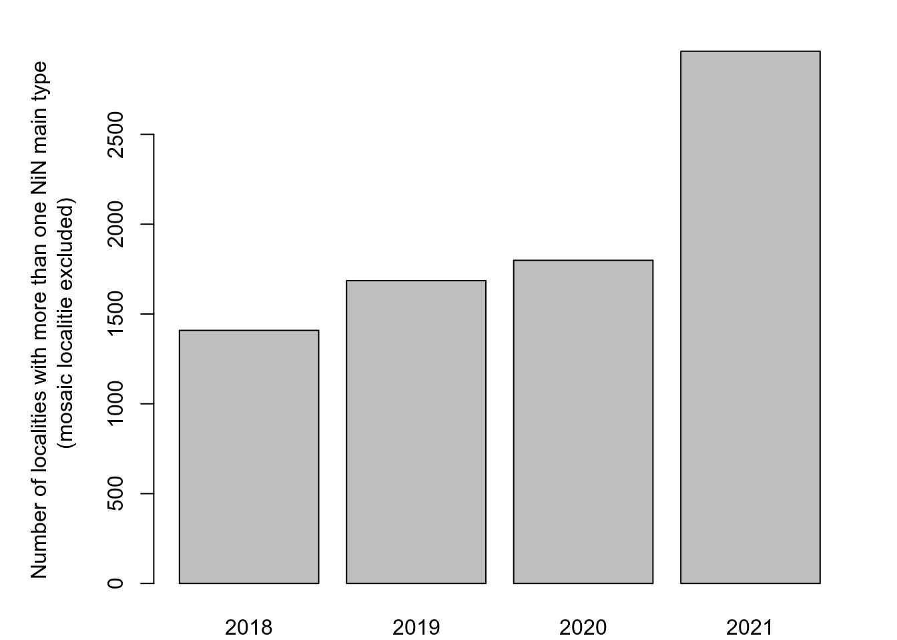
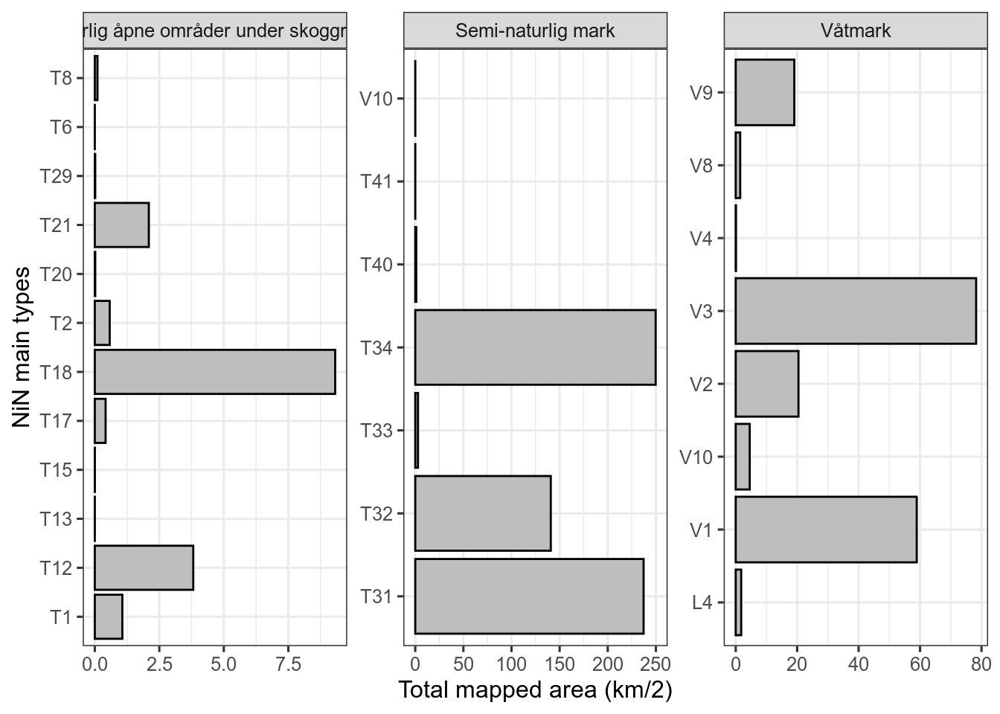

# (PART\*) GENERAL TOPICS {.unnumbered}

# Nature types - Part 1 {#naturtype1}

**On the application of the naturetype dataset - Part 1 - Data exploration and cleaning**

<br />


Author: Anders L. Kolstad

Date: 2022-10-11

<br />

Here I will investigate a specific data set, [Naturtyper - Miljødirektoratets instruks](https://kartkatalog.geonorge.no/metadata/naturtyper-miljoedirektoratets-instruks/eb48dd19-03da-41e1-afd9-7ebc3079265c) and try to evaluate its usability for designing indicators for ecosystem condition. This involves assessing both the spatial and temporal representation, as well as conseptual alignment with the [Norwegian system for ecosystem condition assessments](https://www.regjeringen.no/no/dokumenter/fagsystem-for-fastsetting-av-god-okologisk-tilstand/id2558481/).

The precision in field mapping will not be assess in itself. We assume some, or even considerable, sampling error, but this is inherent to all field data.

The first part of this analysis is simply to get an overview of the data and to clean it, making it ready for part 2.


## Import data and general summary statistics

```r
# local path
#path <- "data/R:/GeoSpatialData/Habitats_biotopes/Norway_Miljodirektoratet_Naturtyper_nin/Original/Natur_Naturtyper_NiN_norge_med_svalbard_25833.gdb"
# server path
#path <- "/data/P-Prosjekter/41201785_okologisk_tilstand_2022_2023/data/Natur_Naturtyper_NiN_norge_med_svalbard_25833.gdb"

# temporary path 
path <- "/data/Egenutvikling/41001581_egenutvikling_anders_kolstad/data/Natur_Naturtyper_NiN_norge_med_svalbard_25833.gdb"
dat <- sf::st_read(dsn = path)
```

Fix non-valid polygons


```r
dat <- sf::st_make_valid(dat)
```

The dataset has 95k polygons, each with 36 variables:

```r
dim(dat)
#> [1] 95469    36
```

It therefore takes a little minute to render a plot, but this is the code to do it:

```r
nor <- sf::read_sf("data/outlineOfNorway_EPSG25833.shp")
tmap_mode("view")
tm_shape(dat) + 
  tm_polygons(col="tilstand")+
  tm_shape(nor)+
  tm_polygons(alpha = 0,border.col = "black")
```


## Area
Calculating the area for each polygon/locality

```r
dat$area <- sf::st_area(dat)
summary(dat$area)
#>    Min. 1st Qu.  Median    Mean 3rd Qu.    Max. 
#>      20     722    2891   17677    9026 8532702
```
The smallest polygons are 20 m2, and the biggest is 8.5 km2.

Sum of mapped area divided by Norwegian mainland area:

```r
nor <- sf::read_sf("data/outlineOfNorway_EPSG25833.shp")
sum(dat$area)/sf::st_area(nor)
#> 0.005181438 [1]
```
About 0.5% of Norway has been mapped (not that a bigger area than this has been surveyed, but only a small fraction is delineated). It is therefore essential that these 0.5% are representative.

## Temporal trend

```r
dat$kartleggingsår <- as.numeric(dat$kartleggingsår)
```


```r
area_year <- as.data.frame(tapply(dat$area, dat$kartleggingsår, sum))
names(area_year) <- "area"
area_year$year <- row.names(area_year)
area_year$area_km2 <- area_year$area/10^6
```


```r
ggplot(area_year)+
  geom_bar(aes(x = year, y = area_km2),
           stat = "identity",
           fill = "grey",
           colour="black",
           size = 1.2)+
  theme_bw(base_size = 12)+
  labs(x = "Year", y = "Total mapped area (km/2)")
```

<div class="figure">

<p class="caption">(\#fig:unnamed-chunk-9)Temproal trend in nature type mapping using Miljødirektoratets Instruks</p>
</div>

The rate of nature type mapping is strongly positive last three years. There are some differences in the field mapping instructions between the years. I will need to decide whether to include all years, or to perhaps exclude the first year.


## Condition
A quick overview of the condition scores 

```r
barplot(tapply(dat$area/10^6, factor(dat$tilstand), sum))
```

<div class="figure">

<p class="caption">(\#fig:unnamed-chunk-10)The overal distribution of condition scores</p>
</div>

Most sites/polygons are in either good or moderately good condition. I'm not sure what the first class represents. It seems like some polygons don't have a condition score. Looking at just the data set, and also the online *faktaark* for some of these localities, does not give the answer:

```r
View(dat[dat$tilstand=="",])
```

This figure show that these cases are not restricted to just one field season.

```r
barplot(table(dat$kartleggingsår[dat$tilstand==""]), 
        ylab="Number of localities without condition scores",
        xlab="Year")
```

<div class="figure">

<p class="caption">(\#fig:unnamed-chunk-12)Temporal trend in localities without condition scores.</p>
</div>


```r
par(mar=c(5,20,1,1))
barplot(table(dat$hovedøkosystem[dat$tilstand==""]),
        horiz = T, las=2,
        xlab="Number of localities without condition scores")
```

<div class="figure">

<p class="caption">(\#fig:unnamed-chunk-13)Main ecosystems with localities missing condition scores.</p>
</div>

These cases are restricted to two main ecosystems, and one class where the main ecosystem is not recorded. Looking at some of those cases it is clear that they are not relevant for our work here, I and I don't know why they are in the data set to begin with.

```r
par(mar=c(5,20,1,1))
barplot(table(dat$naturtype[dat$tilstand==""]),
        horiz = T, las=2,
        xlab="Number of localities without condition scores")
```

<div class="figure">

<p class="caption">(\#fig:unnamed-chunk-14)Nature types with localities missing condition scores.</p>
</div>

There are only six nature types (if you exclude those that are not mapped) that don't have a condition score.

`Snøleieblokkmark` and `rabbeblokkmark` do not have a protocol for assessing condition status. `Leirskredgrop`, `leirravine` and `grotte` were nature types in 2018 (not mapped in 2021), and was similarly not assessed for condition scores. `Isinnfrysingsmark` is assessed for condition now, but not in 2018. We can therefore exclude these localities from our data set.

```r
dat <- dat[dat$tilstand!="",]
```


## Mosaic types
The field mapping instruction include and option for delineating mosaic types. Let's investigate these cases.

When an area displays a repeating pattern of mixed nature types that each are smaller than the minimum mapping unit MMU, these are grouped into as many overlapping polygons as there are unique nature types. Within the nature type polygons, these will have the same distribution of NiN-grunntyper (online you can see the percentage distribution, but our data set only has the presence/absence data) but be assigned different nature types (nature types is the Environmental agencies classification). The condition scoring can be unique to each overlapping nature type in the mosaic. But we don't know the precise location of the NiN-grunntyper that are part of mosaic nature types.


```r
barplot(table(dat$mosaikk),
        xlab = "Mosaic", ylab="Number of localities")
```

<div class="figure">

<p class="caption">(\#fig:unnamed-chunk-16)The number of mosaic localities is relatively small.</p>
</div>

Fix duplicated `hovedøkosystem`

```r
#unique(dat$hovedøkosystem)
dat$hovedøkosystem[dat$hovedøkosystem=="Naturlig åpne områder i lavlandet"] <- "Naturlig åpne områder under skoggrensa"
```


```r
par(mar=c(5,20,1,1))
barplot(table(dat$hovedøkosystem[dat$mosaikk=="Ja"]),
        horiz = T, las=2,
        xlab="Number of mosaic localities")
```

<div class="figure">

<p class="caption">(\#fig:unnamed-chunk-18)Distribution of mosaic nature types across hovedøkosystem</p>
</div>

Mosaic localities occur in many main ecosystems (and many nature types therein). 

Some conclusion here could be that

1. Mosaic localities CANNOT be used to pin-point NiN grunntyper (e.g. for remote sensing purposes).
1. Mosaic localities CAN be used to extract condition scores for nature types, but these should not be tied to all the *NiN grunntype* listed in that polygon, because that will include some that belong to the other part(s) of the mosaic.


## NiN types across main ecosystems
The NiN main types can be extracted from the column `ninkartleggingsenheter`, but it is oddly concatenated. Let's tease it apart.


```r
#dat$ninkartleggingsenheter[1:10]
dat$ninkartleggingsenheter2 <- gsub("NA_", dat$ninkartleggingsenheter, replacement = "")
#dat$ninkartleggingsenheter2[1:30]
dat$ninkartleggingsenheter2 <- str_replace_all(dat$ninkartleggingsenheter2, ".[CE].[\\d]{1,}", replacement = "")
#dat$ninkartleggingsenheter2[1:30]
dat$ninkartleggingsenheter2 <- str_replace_all(dat$ninkartleggingsenheter2, "-.", replacement = "")
uni <- function(x){paste(unique(unlist(strsplit(x, ","))), collapse = ",")}
dat$ninkartleggingsenheter3 <- lapply(dat$ninkartleggingsenheter2, uni)
n_uni <- function(x){length(unique(unlist(strsplit(x, ","))))}
dat$n_ninkartleggingsenheter <- lapply(dat$ninkartleggingsenheter2, n_uni)
dat$n_ninkartleggingsenheter <- as.numeric(dat$n_ninkartleggingsenheter) 

par(mfrow=c(1,3))
barplot(table(dat$n_ninkartleggingsenheter),
        xlab = "Number of NiN main types",
        ylab = "Number of localities")
barplot(table(dat$n_ninkartleggingsenheter[dat$mosaikk=="Nei"]),
        xlab = "Number of NiN main types\n(Mosaic localities excluded)")
barplot(table(dat$n_ninkartleggingsenheter[dat$mosaikk=="Ja"]),
        xlab = "Number of NiN main types\n(Mosaic localities only)")
```

<div class="figure">

<p class="caption">(\#fig:unnamed-chunk-19)The number of NiN main types within one locality should normally be one, except for mosaic localities.</p>
</div>

Mosaic localities have a much higher likelihood of including multiple NiN main types, but it also occurs in non-mosaic localities (about 8000 cases), so we need to see whats going on there.

First I need to melt the data frame in order to tally the number of NiN min types within each `hovedøkosystem`.

```r
dat_melt <- tidyr::separate_rows(dat, ninkartleggingsenheter3)
```


```r
ggplot(dat_melt[dat_melt$mosaikk!="Ja",])+
  geom_bar(aes(x = ninkartleggingsenheter3))+
  coord_flip()+
  theme_bw(base_size = 12)+
  facet_wrap("hovedøkosystem",
             scales = "free")
```

<div class="figure">

<p class="caption">(\#fig:unnamed-chunk-21)Figure showing the number of localities for each NiN main type. One locality can have more than one NiN main type. Mosaic localities are excluded in this figure.</p>
</div>

There is a lot of miss-match between NiN main types and *hovedøkosystem*. 
Taking one example: T2 (åpne grunnledt mark) is not found in mountains, but there is one case where this occurs. If I view that case


```r
View(dat_melt[dat_melt$mosaikk!="Ja" & dat_melt$hovedøkosystem=="Fjell" & dat_melt$ninkartleggingsenheter3=="T2",])
```

.. and find the online fact sheet for that locality, I see that it is indeed not a mosaic. It is a nature type called *Kalkfattig og intermediær fjellhei, leside og tundra* which is defined as strictly T3, but the field surveyor has recorded lots of main NiN types. This is a mistake. Online I can see that the locality is 50% T3, but this information is not in the data set that we have available. And the order of the NiN types in the `ninkartleggingsenheter` column is not reflecting the commonness of the types ether. 

If there was a way to extract the defining NiN type from the `naturtype` column, that would be nice. If we exclude all localities that are not mosaics, but that have multiple NiN main types, we first need to know if there are not any `naturtype` which allow for multiple NiN main types.

As this next figure show, these cases are not correlated to mapping year, and hence to any changes in the field protocol.

```r
par(mar=c(2,6,2,2))
temp <- dat[dat$n_ninkartleggingsenheter>1 & dat$mosaikk!="Ja",]
barplot(table(temp$kartleggingsår), ylab="Number of localities with more than one NiN main type\n(mosaic localitie excluded) ")
```




```r
temp2 <- as.data.frame(table(temp$naturtype, temp$n_ninkartleggingsenheter))
temp2 <- temp2[base::order(temp2$Freq, decreasing = T),][1:10,]
par(mar=c(8,20,1,1))
barplot(temp2$Freq, names.arg = temp2$Var1, las=2,
        horiz = T, xlab = "Number of localities with >1 NiN main type")
```

<div class="figure">

<p class="caption">(\#fig:unnamed-chunk-24)The ten most common nature types and the number of localities with with multiple NiN main types</p>
</div>

'Hule eiker' is a special case because these are recorded as points and not polygons, and they can be found in any NiN main type and any *hovedøkosystem*. 

```r
DT::datatable(
  dat[dat$naturtype=="Hule eiker",][1:5,c("naturtype", "hovedøkosystem", "ninkartleggingsenheter")])
```

```{=html}
<div id="htmlwidget-870c9c937f7044845031" style="width:100%;height:auto;" class="datatables html-widget"></div>
<script type="application/json" data-for="htmlwidget-870c9c937f7044845031">{"x":{"filter":"none","vertical":false,"data":[["3","8","19","33","38"],["Hule eiker","Hule eiker","Hule eiker","Hule eiker","Hule eiker"],["Semi-naturlig mark","Skog","Skog","Semi-naturlig mark","Skog"],["NA_T4-C-3","NA_T43-C-1","NA_T35-C-2,NA_T4-C-7","NA_T4-C-2","NA_T4-C-7"],[{"type":"MultiPolygon","coordinates":[[[[257373.1209,6576294.7663],[257373.089,6576293.79],[257372.9932,6576292.8179],[257372.8341,6576291.8541],[257372.6123,6576290.9029],[257372.3288,6576289.9681],[257371.9847,6576289.0539],[257371.5816,6576288.1642],[257371.1211,6576287.3027],[257370.6053,6576286.4732],[257370.0363,6576285.6793],[257369.4166,6576284.9242],[257368.7489,6576284.2112],[257368.036,6576283.5435],[257367.2809,6576282.9238],[257366.4869,6576282.3549],[257365.6574,6576281.8391],[257364.796,6576281.3786],[257363.9062,6576280.9755],[257362.992,6576280.6314],[257362.0573,6576280.3478],[257361.106,6576280.126],[257360.1423,6576279.9669],[257359.1702,6576279.8712],[257358.1939,6576279.8392],[257357.2176,6576279.8712],[257356.2455,6576279.9669],[257355.2818,6576280.126],[257354.3305,6576280.3478],[257353.3957,6576280.6314],[257352.4816,6576280.9755],[257351.5918,6576281.3786],[257350.7304,6576281.8391],[257349.9009,6576282.3549],[257349.1069,6576282.9238],[257348.3518,6576283.5435],[257347.6389,6576284.2112],[257346.9711,6576284.9242],[257346.3515,6576285.6793],[257345.7825,6576286.4732],[257345.2667,6576287.3027],[257344.8062,6576288.1642],[257344.4031,6576289.0539],[257344.059,6576289.9681],[257343.7755,6576290.9029],[257343.5537,6576291.8541],[257343.3945,6576292.8179],[257343.2988,6576293.79],[257343.2668,6576294.7663],[257343.2988,6576295.7425],[257343.3945,6576296.7146],[257343.5537,6576297.6784],[257343.7755,6576298.6297],[257344.059,6576299.5644],[257344.4031,6576300.4786],[257344.8062,6576301.3683],[257345.2667,6576302.2298],[257345.7825,6576303.0593],[257346.3515,6576303.8533],[257346.9711,6576304.6084],[257347.6389,6576305.3213],[257348.3518,6576305.989],[257349.1069,6576306.6087],[257349.9009,6576307.1777],[257350.7304,6576307.6935],[257351.5918,6576308.1539],[257352.4816,6576308.5571],[257353.3957,6576308.9011],[257354.3305,6576309.1847],[257355.2818,6576309.4065],[257356.2455,6576309.5656],[257357.2176,6576309.6614],[257358.1939,6576309.6933],[257359.1702,6576309.6614],[257360.1423,6576309.5656],[257361.106,6576309.4065],[257362.0573,6576309.1847],[257362.992,6576308.9011],[257363.9062,6576308.5571],[257364.796,6576308.1539],[257365.6574,6576307.6935],[257366.4869,6576307.1777],[257367.2809,6576306.6087],[257368.036,6576305.989],[257368.7489,6576305.3213],[257369.4166,6576304.6084],[257370.0363,6576303.8533],[257370.6053,6576303.0593],[257371.1211,6576302.2298],[257371.5816,6576301.3683],[257371.9847,6576300.4786],[257372.3288,6576299.5644],[257372.6123,6576298.6297],[257372.8341,6576297.6784],[257372.9932,6576296.7146],[257373.089,6576295.7425],[257373.1209,6576294.7663]]]]},{"type":"MultiPolygon","coordinates":[[[[230205.4737,6612351.6694],[230205.4418,6612350.6931],[230205.346,6612349.721],[230205.1869,6612348.7573],[230204.9651,6612347.806],[230204.6815,6612346.8713],[230204.3375,6612345.9571],[230203.9343,6612345.0673],[230203.4739,6612344.2059],[230202.9581,6612343.3764],[230202.3891,6612342.5824],[230201.7694,6612341.8273],[230201.1017,6612341.1144],[230200.3888,6612340.4467],[230199.6337,6612339.827],[230198.8397,6612339.258],[230198.0102,6612338.7422],[230197.1487,6612338.2817],[230196.259,6612337.8786],[230195.3448,6612337.5345],[230194.4101,6612337.251],[230193.4588,6612337.0292],[230192.495,6612336.8701],[230191.5229,6612336.7743],[230190.5467,6612336.7424],[230189.5704,6612336.7743],[230188.5983,6612336.8701],[230187.6345,6612337.0292],[230186.6833,6612337.251],[230185.7485,6612337.5345],[230184.8343,6612337.8786],[230183.9446,6612338.2817],[230183.0831,6612338.7422],[230182.2536,6612339.258],[230181.4597,6612339.827],[230180.7046,6612340.4467],[230179.9917,6612341.1144],[230179.3239,6612341.8273],[230178.7042,6612342.5824],[230178.1353,6612343.3764],[230177.6195,6612344.2059],[230177.159,6612345.0673],[230176.7559,6612345.9571],[230176.4118,6612346.8713],[230176.1282,6612347.806],[230175.9064,6612348.7573],[230175.7473,6612349.721],[230175.6516,6612350.6931],[230175.6196,6612351.6694],[230175.6516,6612352.6457],[230175.7473,6612353.6178],[230175.9064,6612354.5815],[230176.1282,6612355.5328],[230176.4118,6612356.4676],[230176.7559,6612357.3817],[230177.159,6612358.2715],[230177.6195,6612359.1329],[230178.1353,6612359.9624],[230178.7042,6612360.7564],[230179.3239,6612361.5115],[230179.9917,6612362.2244],[230180.7046,6612362.8922],[230181.4597,6612363.5118],[230182.2536,6612364.0808],[230183.0831,6612364.5966],[230183.9446,6612365.0571],[230184.8343,6612365.4602],[230185.7485,6612365.8043],[230186.6833,6612366.0878],[230187.6345,6612366.3096],[230188.5983,6612366.4688],[230189.5704,6612366.5645],[230190.5467,6612366.5965],[230191.5229,6612366.5645],[230192.495,6612366.4688],[230193.4588,6612366.3096],[230194.4101,6612366.0878],[230195.3448,6612365.8043],[230196.259,6612365.4602],[230197.1487,6612365.0571],[230198.0102,6612364.5966],[230198.8397,6612364.0808],[230199.6337,6612363.5118],[230200.3888,6612362.8922],[230201.1017,6612362.2244],[230201.7694,6612361.5115],[230202.3891,6612360.7564],[230202.9581,6612359.9624],[230203.4739,6612359.1329],[230203.9343,6612358.2715],[230204.3375,6612357.3817],[230204.6815,6612356.4676],[230204.9651,6612355.5328],[230205.1869,6612354.5815],[230205.346,6612353.6178],[230205.4418,6612352.6457],[230205.4737,6612351.6694]]]]},{"type":"MultiPolygon","coordinates":[[[[234886.4963,6595819.1304],[234886.4644,6595818.1541],[234886.3686,6595817.1821],[234886.2095,6595816.2183],[234885.9877,6595815.267],[234885.7041,6595814.3323],[234885.3601,6595813.4181],[234884.9569,6595812.5284],[234884.4965,6595811.6669],[234883.9807,6595810.8374],[234883.4117,6595810.0434],[234882.792,6595809.2883],[234882.1243,6595808.5754],[234881.4114,6595807.9077],[234880.6563,6595807.288],[234879.8623,6595806.719],[234879.0328,6595806.2032],[234878.1713,6595805.7428],[234877.2816,6595805.3396],[234876.3674,6595804.9955],[234875.4327,6595804.712],[234874.4814,6595804.4902],[234873.5176,6595804.3311],[234872.5455,6595804.2353],[234871.5693,6595804.2034],[234870.593,6595804.2353],[234869.6209,6595804.3311],[234868.6571,6595804.4902],[234867.7059,6595804.712],[234866.7711,6595804.9955],[234865.8569,6595805.3396],[234864.9672,6595805.7428],[234864.1057,6595806.2032],[234863.2762,6595806.719],[234862.4822,6595807.288],[234861.7272,6595807.9077],[234861.0142,6595808.5754],[234860.3465,6595809.2883],[234859.7268,6595810.0434],[234859.1579,6595810.8374],[234858.6421,6595811.6669],[234858.1816,6595812.5284],[234857.7785,6595813.4181],[234857.4344,6595814.3323],[234857.1508,6595815.267],[234856.929,6595816.2183],[234856.7699,6595817.1821],[234856.6742,6595818.1541],[234856.6422,6595819.1304],[234856.6742,6595820.1067],[234856.7699,6595821.0788],[234856.929,6595822.0425],[234857.1508,6595822.9938],[234857.4344,6595823.9286],[234857.7785,6595824.8428],[234858.1816,6595825.7325],[234858.6421,6595826.594],[234859.1579,6595827.4235],[234859.7268,6595828.2174],[234860.3465,6595828.9725],[234861.0142,6595829.6854],[234861.7272,6595830.3532],[234862.4822,6595830.9729],[234863.2762,6595831.5418],[234864.1057,6595832.0576],[234864.9672,6595832.5181],[234865.8569,6595832.9212],[234866.7711,6595833.2653],[234867.7059,6595833.5489],[234868.6571,6595833.7707],[234869.6209,6595833.9298],[234870.593,6595834.0255],[234871.5693,6595834.0575],[234872.5455,6595834.0255],[234873.5176,6595833.9298],[234874.4814,6595833.7707],[234875.4327,6595833.5489],[234876.3674,6595833.2653],[234877.2816,6595832.9212],[234878.1713,6595832.5181],[234879.0328,6595832.0576],[234879.8623,6595831.5418],[234880.6563,6595830.9729],[234881.4114,6595830.3532],[234882.1243,6595829.6854],[234882.792,6595828.9725],[234883.4117,6595828.2174],[234883.9807,6595827.4235],[234884.4965,6595826.594],[234884.9569,6595825.7325],[234885.3601,6595824.8428],[234885.7041,6595823.9286],[234885.9877,6595822.9938],[234886.2095,6595822.0425],[234886.3686,6595821.0788],[234886.4644,6595820.1067],[234886.4963,6595819.1304]]]]},{"type":"MultiPolygon","coordinates":[[[[246942.6116,6656594.3792],[246942.5796,6656593.403],[246942.4839,6656592.4309],[246942.3248,6656591.4671],[246942.1029,6656590.5158],[246941.8194,6656589.5811],[246941.4753,6656588.6669],[246941.0722,6656587.7772],[246940.6117,6656586.9157],[246940.0959,6656586.0862],[246939.5269,6656585.2922],[246938.9073,6656584.5372],[246938.2395,6656583.8242],[246937.5266,6656583.1565],[246936.7715,6656582.5368],[246935.9775,6656581.9679],[246935.148,6656581.452],[246934.2866,6656580.9916],[246933.3969,6656580.5884],[246932.4827,6656580.2444],[246931.5479,6656579.9608],[246930.5966,6656579.739],[246929.6329,6656579.5799],[246928.6608,6656579.4842],[246927.6845,6656579.4522],[246926.7082,6656579.4842],[246925.7361,6656579.5799],[246924.7724,6656579.739],[246923.8211,6656579.9608],[246922.8864,6656580.2444],[246921.9722,6656580.5884],[246921.0825,6656580.9916],[246920.221,6656581.452],[246919.3915,6656581.9679],[246918.5975,6656582.5368],[246917.8424,6656583.1565],[246917.1295,6656583.8242],[246916.4618,6656584.5372],[246915.8421,6656585.2922],[246915.2731,6656586.0862],[246914.7573,6656586.9157],[246914.2969,6656587.7772],[246913.8937,6656588.6669],[246913.5496,6656589.5811],[246913.2661,6656590.5158],[246913.0443,6656591.4671],[246912.8852,6656592.4309],[246912.7894,6656593.403],[246912.7575,6656594.3792],[246912.7894,6656595.3555],[246912.8852,6656596.3276],[246913.0443,6656597.2914],[246913.2661,6656598.2427],[246913.5496,6656599.1774],[246913.8937,6656600.0916],[246914.2969,6656600.9813],[246914.7573,6656601.8428],[246915.2731,6656602.6723],[246915.8421,6656603.4663],[246916.4618,6656604.2213],[246917.1295,6656604.9343],[246917.8424,6656605.602],[246918.5975,6656606.2217],[246919.3915,6656606.7906],[246920.221,6656607.3065],[246921.0825,6656607.7669],[246921.9722,6656608.17],[246922.8864,6656608.5141],[246923.8211,6656608.7977],[246924.7724,6656609.0195],[246925.7361,6656609.1786],[246926.7082,6656609.2743],[246927.6845,6656609.3063],[246928.6608,6656609.2743],[246929.6329,6656609.1786],[246930.5966,6656609.0195],[246931.5479,6656608.7977],[246932.4827,6656608.5141],[246933.3969,6656608.17],[246934.2866,6656607.7669],[246935.148,6656607.3065],[246935.9775,6656606.7906],[246936.7715,6656606.2217],[246937.5266,6656605.602],[246938.2395,6656604.9343],[246938.9073,6656604.2213],[246939.5269,6656603.4663],[246940.0959,6656602.6723],[246940.6117,6656601.8428],[246941.0722,6656600.9813],[246941.4753,6656600.0916],[246941.8194,6656599.1774],[246942.1029,6656598.2427],[246942.3248,6656597.2914],[246942.4839,6656596.3276],[246942.5796,6656595.3555],[246942.6116,6656594.3792]]]]},{"type":"MultiPolygon","coordinates":[[[[34307.7715999996,6459711.1272],[34307.7396999998,6459710.151],[34307.6438999996,6459709.1789],[34307.4847999997,6459708.2151],[34307.2630000003,6459707.2638],[34306.9793999996,6459706.3291],[34306.6354,6459705.4149],[34306.2322000004,6459704.5252],[34305.7718000002,6459703.6637],[34305.2560000001,6459702.8342],[34304.6869999999,6459702.0402],[34304.0673000002,6459701.2852],[34303.3996000001,6459700.5722],[34302.6867000004,6459699.9045],[34301.9315999998,6459699.2848],[34301.1376,6459698.7159],[34300.3081,6459698.2],[34299.4466000004,6459697.7396],[34298.5569000002,6459697.3364],[34297.6426999997,6459696.9924],[34296.7079999996,6459696.7088],[34295.7566999998,6459696.487],[34294.7928999998,6459696.3279],[34293.8207999999,6459696.2322],[34292.8446000004,6459696.2002],[34291.8683000002,6459696.2322],[34290.8962000003,6459696.3279],[34289.9324000003,6459696.487],[34288.9812000003,6459696.7088],[34288.0464000003,6459696.9924],[34287.1321999999,6459697.3364],[34286.2424999997,6459697.7396],[34285.3810000001,6459698.2],[34284.5515000001,6459698.7159],[34283.7576000001,6459699.2848],[34283.0025000004,6459699.9045],[34282.2895,6459700.5722],[34281.6217999998,6459701.2852],[34281.0021000002,6459702.0402],[34280.4331999999,6459702.8342],[34279.9173999997,6459703.6637],[34279.4568999996,6459704.5252],[34279.0537999999,6459705.4149],[34278.7096999995,6459706.3291],[34278.4260999998,6459707.2638],[34278.2043000003,6459708.2151],[34278.0451999996,6459709.1789],[34277.9495000001,6459710.151],[34277.9175000004,6459711.1272],[34277.9495000001,6459712.1035],[34278.0451999996,6459713.0756],[34278.2043000003,6459714.0394],[34278.4260999998,6459714.9907],[34278.7096999995,6459715.9254],[34279.0537999999,6459716.8396],[34279.4568999996,6459717.7293],[34279.9173999997,6459718.5908],[34280.4331999999,6459719.4203],[34281.0021000002,6459720.2143],[34281.6217999998,6459720.9693],[34282.2895,6459721.6823],[34283.0025000004,6459722.35],[34283.7576000001,6459722.9697],[34284.5515000001,6459723.5386],[34285.3810000001,6459724.0545],[34286.2424999997,6459724.5149],[34287.1321999999,6459724.918],[34288.0464000003,6459725.2621],[34288.9812000003,6459725.5457],[34289.9324000003,6459725.7675],[34290.8962000003,6459725.9266],[34291.8683000002,6459726.0223],[34292.8446000004,6459726.0543],[34293.8207999999,6459726.0223],[34294.7928999998,6459725.9266],[34295.7566999998,6459725.7675],[34296.7079999996,6459725.5457],[34297.6426999997,6459725.2621],[34298.5569000002,6459724.918],[34299.4466000004,6459724.5149],[34300.3081,6459724.0545],[34301.1376,6459723.5386],[34301.9315999998,6459722.9697],[34302.6867000004,6459722.35],[34303.3996000001,6459721.6823],[34304.0673000002,6459720.9693],[34304.6869999999,6459720.2143],[34305.2560000001,6459719.4203],[34305.7718000002,6459718.5908],[34306.2322000004,6459717.7293],[34306.6354,6459716.8396],[34306.9793999996,6459715.9254],[34307.2630000003,6459714.9907],[34307.4847999997,6459714.0394],[34307.6438999996,6459713.0756],[34307.7396999998,6459712.1035],[34307.7715999996,6459711.1272]]]]}]],"container":"<table class=\"display\">\n  <thead>\n    <tr>\n      <th> <\/th>\n      <th>naturtype<\/th>\n      <th>hovedøkosystem<\/th>\n      <th>ninkartleggingsenheter<\/th>\n      <th>SHAPE<\/th>\n    <\/tr>\n  <\/thead>\n<\/table>","options":{"order":[],"autoWidth":false,"orderClasses":false,"columnDefs":[{"orderable":false,"targets":0}]}},"evals":[],"jsHooks":[]}</script>
```

*Kystlynghei* often occurs as a mosaic, but figure \@ref(fig:multipleNiN) has excluded the mosaic localities, and then *kystlynghei* is strictly defined to T34.
The same is true for *naturbeitemark* which is restricted to T32.
Maybe these should all have been recorded as mosaic localities. In any case, we cannot automatically extract the main NiN type from these rows now. One option is to manually define all *naturbeitemark* as T32, and all *kystlynghei* as T34, but this is also not without risk.

Lets look at how the NiN main types cover the different *hovedøkosystem* when we exclude *Hule eiker* and all localities that have more than one NiN main type.

```r
dat_red <- dat_melt[dat_melt$n_ninkartleggingsenheter==1 & 
                      dat_melt$naturtype != "Hule eiker" &
                      dat_melt$mosaikk == "Nei",]
```


```r
ggplot(dat_red)+
  geom_bar(aes(x = ninkartleggingsenheter3),
           fill="grey",
           colour="black")+
  coord_flip()+
  theme_bw(base_size = 12)+
  facet_wrap("hovedøkosystem",
             scales = "free")+
  labs(y = "Number of localities",
       x = "NiN main types")
```

<div class="figure">

<p class="caption">(\#fig:unnamed-chunk-26)NiN main type across five main ecosystems (Hule eiker, mosaic localities, and localities with >1 NiN main type excluded)</p>
</div>

Let's focus in on our three targeted ecosystems.

```r
dat_red_tally <- stats::aggregate(data = dat_red,
                                  area~hovedøkosystem+ninkartleggingsenheter3, FUN = length)
names(dat_red_tally)[3] <- "count"
```


```r
target <- c("Semi-naturlig mark",
            "Våtmark",
            "Naturlig åpne områder under skoggrensa")
```


```r
ggplot(dat_red_tally[dat_red_tally$hovedøkosystem %in% target,],
       aes(x = ninkartleggingsenheter3,
               y = count))+
  geom_bar(
           fill="grey",
           colour="black",
           stat="identity")+
  coord_flip()+
  theme_bw(base_size = 12)+
  labs(y = "Number of localities",
       x = "NiN main types")+
  scale_y_continuous(position = "left",
                   expand = expansion(mult=c(.0,.3)))+
  geom_text(aes(label=count), hjust=-0.25)+
    facet_wrap("hovedøkosystem",
             scales = "free",
             ncol = 3)
```

<div class="figure">

<p class="caption">(\#fig:unnamed-chunk-29)Number of localities for each combination of main ecosystem and NiN main type</p>
</div>


Still some weird cases which I will look at in turn below.


### Naturlig åpne områder under skoggrensa

* V10 (semi-naturlig våteng)
    + One case of Åpen flomfastmark wrongly associated with V10 whan it should be T18.
    + **Exclude** this case
* T8 (fulglefjelleng og fugltopp)
    + Ok
* T6 (Standberg)
    + Ok
* T33 (Semi naturlig strandeng)
    + These are cases where either the `naturtype` should have been `semi-naturlig strandeng` (and hence the hovedøkosystem would be Semi-nat), or the `naturtype` is correctly recorded as `Strandeng` but then the NiN type should be `T12`.
    + **Exclude**
* T32 (Semi-naturlig eng)
    + Obvious error
    + **Exclude**
* T30 (Flomskogsmark)
    + Obvious error
    + **Exclude**
* T29 (Grus og steindominert strand og strandlinje)
    + Ok
* T21 (Sanddynemark)
    + Ok
* T20 (Isinnfrysingsmark)
    + Ok. Rare nature type
* T2 (Åpen grunlendt mark)
    + Ok
* T18 (Åpne flomfastmark)
    + Ok
* T17 (Aktiv skredmark)
    + Ok
* T15 (Fosse-eng)
    + Ok
* T13 (Rasmark)
    + Ok
* T12 (Strandeng)
    + Ok
* T1 (Nakent berg)
    + Ok


```r
#View(dat_red[dat_red$hovedøkosystem=="Naturlig åpne områder under skoggrensa" & dat_red$ninkartleggingsenheter3 == "V10",])
#View(dat_red[dat_red$hovedøkosystem=="Naturlig åpne områder under skoggrensa" & dat_red$ninkartleggingsenheter3 == "T33",])
#View(dat_red[dat_red$hovedøkosystem=="Naturlig åpne områder under skoggrensa" & dat_red$ninkartleggingsenheter3 == "T32",])

`%!in%` <- Negate(`%in%`)
dat_red2 <- dat_red[
  dat_red$hovedøkosystem!="Naturlig åpne områder under skoggrensa" |
  dat_red$hovedøkosystem=="Naturlig åpne områder under skoggrensa" & 
    dat_red$ninkartleggingsenheter3 %!in% c("T30", "T32", "T33", "V10"),]
```


### Semi-naturlig mark

* V9 (Semi-naturlig myr)
   + Kystlynghei recorded as mire
   + **Exclude**

* V10 (semi-nat våteng)
   + Ok

* T41 (Oppdyrket mark med preg av semi-naturlig eng)
   + Probably not always use correctly, but at least its the correct ``hovedkøosystem`
   + Ok

* T40 (Sterkt endret fastmark med preg av semi-naturlig eng)
   + Ok

* T4 (Fastmarksskogsmark)
   + These should all be T32 (naturbeitemark, lauveng, hagemark, +++)
   + **Exclude**

* T35 (Sterkt endret fastmark med løsmassedekke)
   + Wrong NiN type given to eng-aktig sterkt endret fastmark (it should be T40)
   + **Exclude**

* T31-34
   + Ok

* T3 (Fjellhei, leside og tundra)
   + Boreal hei (should've been T31)
   + **Exclude**

* T12 (Strandeng)
   + Should probably have been T33
   + **Exclude**

* T1 (Nakent berg)
   + Obvious mistake
   + **Exclude**
  


```r
#unique(dat$hovedøkosystem)
#View(dat_red[dat_red$hovedøkosystem=="Semi-naturlig mark" & dat_red$ninkartleggingsenheter3 == "V9",])
#View(dat_red[dat_red$hovedøkosystem=="Semi-naturlig mark" & dat_red$ninkartleggingsenheter3 == "T41",])
#View(dat_red[dat_red$hovedøkosystem=="Semi-naturlig mark" & dat_red$ninkartleggingsenheter3 == "T4",])
#View(dat_red[dat_red$hovedøkosystem=="Semi-naturlig mark" & dat_red$ninkartleggingsenheter3 == "T35",])
#View(dat_red[dat_red$hovedøkosystem=="Semi-naturlig mark" & dat_red$ninkartleggingsenheter3 == "T3",])
#View(dat_red[dat_red$hovedøkosystem=="Semi-naturlig mark" & dat_red$ninkartleggingsenheter3 == "T1",])

dat_red3 <- dat_red2[
  dat_red2$hovedøkosystem!="Semi-naturlig mark" |
  dat_red2$hovedøkosystem=="Semi-naturlig mark" & dat_red2$ninkartleggingsenheter3 %!in% c("V9", "T4", "T35", "T3", "T12", "T1"),]
```

### Våtmark

Våtmakr doesn't distinguish between semi-natural and natural, so all V-types are correct, except perhaps the strongly modified V11-V13.

* V11 (Torvtak)
  + Obvious mistake
  + **Exclude**
 
* V12 (Grøftet åpne torvmark)
  + Obvious mistake
  + **Exclude**
 
* V13 (Ny våtmark)
  + Obvious mistake
  + **Exclude**
 
* T4 (skog)
  +   some that should've been T2 and some other strange things
  + **Exclude**
 
* T30-T32
  + Someone switching the semi-natural and natural equivalents
  + **Exclude**
 
* L4 (Helofyttsump)
    + Ok


```r
#unique(dat$hovedøkosystem)
#w(dat_red[dat_red$hovedøkosystem=="Våtmark" & dat_red$ninkartleggingsenheter3 == "T4",])
#w(dat_red[dat_red$hovedøkosystem=="Våtmark" & dat_red$ninkartleggingsenheter3 == "T32",])
#w(dat_red[dat_red$hovedøkosystem=="Våtmark" & dat_red$ninkartleggingsenheter3 == "L4",])
#w(dat_red[dat_red$hovedøkosystem=="Våtmark" & dat_red$ninkartleggingsenheter3 == "V9",])
#w(dat_red[dat_red$hovedøkosystem=="Våtmark" & dat_red$ninkartleggingsenheter3 == "V11",])
#w(dat_red[dat_red$hovedøkosystem=="Våtmark" & dat_red$ninkartleggingsenheter3 == "V12",])
#w(dat_red[dat_red$hovedøkosystem=="Våtmark" & dat_red$ninkartleggingsenheter3 == "V13",])
dat_red4 <- dat_red3[
  dat_red3$hovedøkosystem!="Våtmark" |
  dat_red3$hovedøkosystem=="Våtmark" & dat_red3$ninkartleggingsenheter3 %!in% c("T4", "T30", "T31", "T32", "V11", "V12", "V13"),]
```

Let's make the plot again to see if it worked

```r
dat_red_tally2 <- stats::aggregate(data = dat_red4,
                                 area~hovedøkosystem+ninkartleggingsenheter3, FUN = length)
names(dat_red_tally2)[3] <- "count"


ggplot(dat_red_tally2[dat_red_tally2$hovedøkosystem %in% target,],
       aes(x = ninkartleggingsenheter3,
               y = count))+
  geom_bar(
           fill="grey",
           colour="black",
           stat="identity")+
  coord_flip()+
  theme_bw(base_size = 12)+
  labs(y = "Number of localities",
       x = "NiN main types")+
  scale_y_continuous(position = "left",
                   expand = expansion(mult=c(.0,.3)))+
  geom_text(aes(label=count), hjust=-0.25)+
    facet_wrap("hovedøkosystem",
             scales = "free",
             ncol = 3)
```

<div class="figure">

<p class="caption">(\#fig:unnamed-chunk-33)Number of localities for each combination of main ecosystem and NiN main type (after data set cleaning)</p>
</div>

### Areal 
Same type of analysis as above, but focusing onthe accumalitive mapped rea.

```r
dat_red_tally_area <- stats::aggregate(data = dat_red4,
                                 area~hovedøkosystem+ninkartleggingsenheter3, FUN = sum)
names(dat_red_tally_area)[3] <- "area_m2"
dat_red_tally_area$area_km2 <- drop_units(dat_red_tally_area$area_m2/10^6)
ggplot(dat_red_tally_area[dat_red_tally_area$hovedøkosystem %in% target,],
       aes(x = ninkartleggingsenheter3,
               y = area_km2))+
  geom_bar(
           fill="grey",
           colour="black",
           stat="identity")+
  coord_flip()+
  theme_bw(base_size = 12)+
  labs(y = "Total mapped area (km/2)",
       x = "NiN main types")+
    facet_wrap("hovedøkosystem",
             scales = "free",
             ncol = 3)
```

<div class="figure">

<p class="caption">(\#fig:unnamed-chunk-34)Total mapped are for each combination of main ecosystem and NiN main type (after data set cleaning)</p>
</div>

## Export
`dat_red4` now has one row per locality, and only localities with 1 NiN main type. `Hule eiker` and `Mosaic localities` are not included, but we will add these back in now. Depending on what the data set will be used for, these last two can be excluded again later. 

```r
exp <- rbind(dat_red4,
             dat[dat$mosaikk=="Ja",],
             dat[dat$naturtype== "Hule eiker",])
```

To remove `hule eiker`, use this

```r
exp[exp$naturtype != "Hule eiker",]
```

To remove mosaic localities, first consider if you want to remove all mosaic localities, or just those that include different NiN main types, because a mosaic locality may also consist of different sub units (*grunntype*) within the same NiN main type, or even the same *grunntype* throughout, but varying in some other parameter (e.g. a mosaic between old pine forest and old spruce forest, which are both T4 and could both be, say T4-C-2).

To exclude mosaics in general:

```r
exp[exp$mosaikk == "Nei",]
```

To exclude only mosaics that include multiple NiN main types:

```r
exp[exp$n_ninkartleggingsenheter == 1]
```

I will save this as an rds file to my personal folder (the shape standard truncates field names, and gdb is not soo easy to use in R), but then manually move it to 
`/data/P-Prosjekter/41201785_okologisk_tilstand_2022_2023/data/Mdir_Naturtyper_cleanedALK.shp`.
This is simply because I cannot access that drive from RStudio Server at the moment.


```r
exp$ninkartleggingsenheter3 <- unlist(exp$ninkartleggingsenheter3)
saveRDS(exp, "/data/Egenutvikling/41001581_egenutvikling_anders_kolstad/data/Mdir_Naturtyper_cleanedALK.rds")

```

This is the code for importing the cleaned data back into R ()

```r
#myData <- readRDS("/data/Egenutvikling/41001581_egenutvikling_anders_kolstad/data/Mdir_Naturtyper_cleanedALK.rds")
myData <- readRDS("/data/P-Prosjekter/41201785_okologisk_tilstand_2022_2023/data/Mdir_Naturtyper_cleanedALK.rds")
```


## Overview of nature types


```r
temp <- tapply(exp$area, exp$naturtype, sum)
temp <- data.frame(nat = row.names(temp),
                   area = temp)

ggplot(exp[exp$hovedøkosystem %in% target,], 
       aes(x = naturtype))+
  geom_bar(fill = "grey20",
           size=0
           )+
  theme_bw(base_size = 12)+
  coord_flip()+
  facet_grid(rows = vars(hovedøkosystem),
             scales = "free",
             space = "free")+
  labs(y = "Number of localities",
       x = "Nature type")
```

<div class="figure">

<p class="caption">(\#fig:unnamed-chunk-41)An overview of the nature types in the data set</p>
</div>


