# (PART\*) GENERAL TOPICS {.unnumbered}

# Nature types {#naturtype}

**On the application of the nature type data set**

*Data exploration and an analyses of thematic coverage*

<br />


Author: 

Anders L. Kolstad

March 2023


<br />

Here I will investigate a specific data set, [Naturtyper - Miljødirektoratets instruks](https://kartkatalog.geonorge.no/metadata/naturtyper-miljoedirektoratets-instruks/eb48dd19-03da-41e1-afd9-7ebc3079265c) and try to evaluate its usability for designing indicators for ecosystem condition. This involves assessing both the spatial and temporal representation, as well as conceptual alignment with the [Norwegian system for ecosystem condition assessments](https://www.regjeringen.no/no/dokumenter/fagsystem-for-fastsetting-av-god-okologisk-tilstand/id2558481/).

The precision in field mapping will not be assess in itself. We assume some, or even considerable, sampling error, but this is inherent to all field data.

The first part of this analysis is simply to get an overview of the data, making it ready for part 2 where we look at the thematic coverage of nature types and how the NiN variables are used.


## Import data and general summary statistics

```r
dir <- substr(getwd(), 1,2)

# local path
#path <- "data/R:/GeoSpatialData/Habitats_biotopes/Norway_Miljodirektoratet_Naturtyper_nin/Original/Natur_Naturtyper_NiN_norge_med_svalbard_25833.gdb"
# temporary path 
#path <- "/data/Egenutvikling/41001581_egenutvikling_anders_kolstad/data/Natur_Naturtyper_NiN_norge_med_svalbard_25833.g#db"

# server path pre 2022 data
#path <- "/data/P-Prosjekter2/41201785_okologisk_tilstand_2022_2023/data/Natur_Naturtyper_NiN_norge_med_svalbard_25833.gdb"
path <- ifelse(dir == "C:", 
               "R:/GeoSpatialData/Habitats_biotopes/Norway_Miljodirektoratet_Naturtyper_nin/Original/Naturtyper_nin_0000_norge_25833_FILEGDB/Naturtyper_nin_0000_norge_25833_FILEGDB.gdb",
               "/data/R/GeoSpatialData/Habitats_biotopes/Norway_Miljodirektoratet_Naturtyper_nin/Original/Naturtyper_nin_0000_norge_25833_FILEGDB/Naturtyper_nin_0000_norge_25833_FILEGDB.gdb")

dat <- sf::st_read(dsn = path)
```

Fix non-valid polygons:

```r
dat <- sf::st_make_valid(dat)
```

The data set has 117k polygons, each with 37 variables:

```r
dim(dat)
#> [1] 117427     37
```

It therefore takes a little minute to render a plot, but this is the code to do it:

```r
nor <- sf::read_sf("data/outlineOfNorway_EPSG25833.shp")
tmap_mode("view")
tm_shape(dat) + 
  tm_polygons(col="tilstand")+
  tm_shape(nor)+
  tm_polygons(alpha = 0,border.col = "black")
```


## Area
Calculating the area for each polygon/locality

```r
dat$area <- sf::st_area(dat)
summary(dat$area)
#>     Min.  1st Qu.   Median     Mean  3rd Qu.     Max. 
#>       20      700     2810    17153     8674 15794178
```
The smallest polygons are 20 m2, and the biggest is 15.8 km2.

The largest polygon is a Kalkfattig og intermediær fjellhei, leside og tundra , and the smallest polygon is a Sørlig kaldkilde.


Sum of mapped area divided by Norwegian mainland area:

```r
#Import outline of mainland Norway
nor <- sf::read_sf("data/outlineOfNorway_EPSG25833.shp")
sum(dat$area)/sf::st_area(nor)
#> 0.006184274 [1]
```
About 0.6% of Norway has been mapped (note that a bigger area than this has been surveyed, but only a small fraction is delineated). It is therefore essential that these 0.5% are representative.

## Temporal trend

```r
dat$kartleggingsår <- as.numeric(dat$kartleggingsår)
```


```r
area_year <- as.data.frame(tapply(dat$area, dat$kartleggingsår, sum))
names(area_year) <- "area"
area_year$year <- row.names(area_year)
area_year$area_km2 <- area_year$area/10^6
```


```r
ggplot(area_year)+
  geom_bar(aes(x = year, y = area_km2),
           stat = "identity",
           fill = "grey",
           colour="black",
           size = 1.2)+
  theme_bw(base_size = 12)+
  labs(x = "Year", y = "Total mapped area (km/2)")
#> Warning: Using `size` aesthetic for lines was deprecated in ggplot2
#> 3.4.0.
#> ℹ Please use `linewidth` instead.
#> This warning is displayed once every 8 hours.
#> Call `lifecycle::last_lifecycle_warnings()` to see where
#> this warning was generated.
```

<div class="figure">
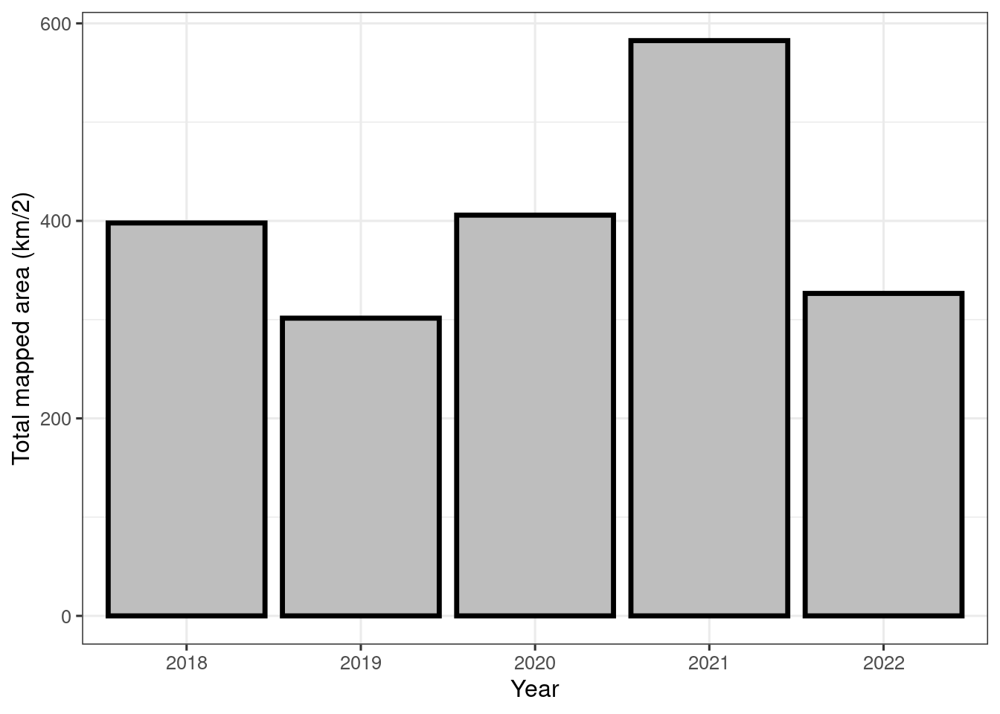
<p class="caption">(\#fig:unnamed-chunk-9)Temproal trend in nature type mapping using Miljødirektoratets Instruks</p>
</div>

There are some differences in the field mapping instructions between the years. I will need to decide whether to include all years, or to perhaps exclude the first year.


## Condition
A quick overview of the condition scores 

```r
dat <- dat %>%
  mutate(tilstand =  recode(tilstand, 
                            "sværtRedusert" = "1 - Svært redusert",
                            "dårlig" = "2 - Dårlig",
                            "moderat" = "3 - Moderat",
                            "god" = "4 - God"))

barplot(tapply(dat$area/10^6, factor(dat$tilstand), sum))
```

<div class="figure">
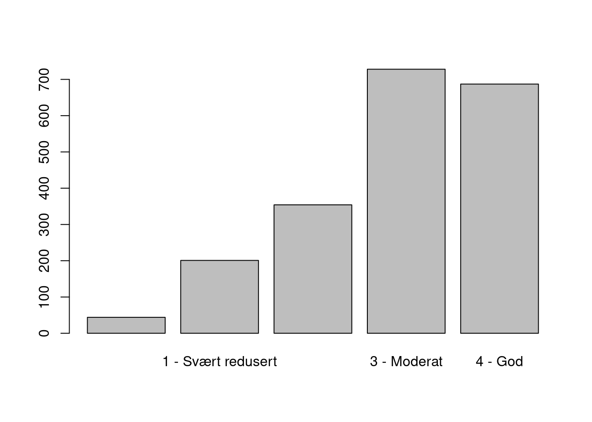
<p class="caption">(\#fig:unnamed-chunk-10)The overal distribution of condition scores</p>
</div>

Most sites/polygons are in either good or moderately good condition. I'm not sure what the first class represents. It seems like some polygons don't have a condition score. Looking at just the data set, and also the online *faktaark* for some of these localities, does not give the answer:

```r
View(dat[dat$tilstand=="",])
```

This figure show that these cases are not restricted to just one field season.

```r
barplot(table(dat$kartleggingsår[dat$tilstand==""]), 
        ylab="Number of localities without condition scores",
        xlab="Year")
```

<div class="figure">
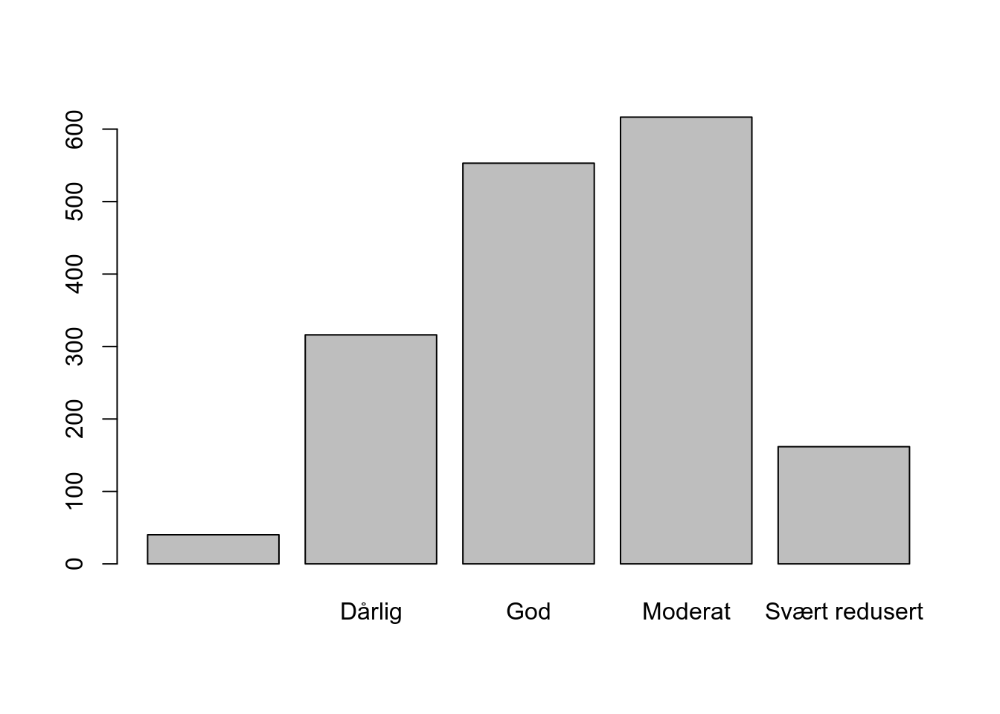
<p class="caption">(\#fig:unnamed-chunk-12)Temporal trend in localities without condition scores.</p>
</div>


```r
par(mar=c(5,20,1,1))
barplot(table(dat$hovedøkosystem[dat$tilstand==""]),
        horiz = T, las=2,
        xlab="Number of localities without condition scores")
```

<div class="figure">
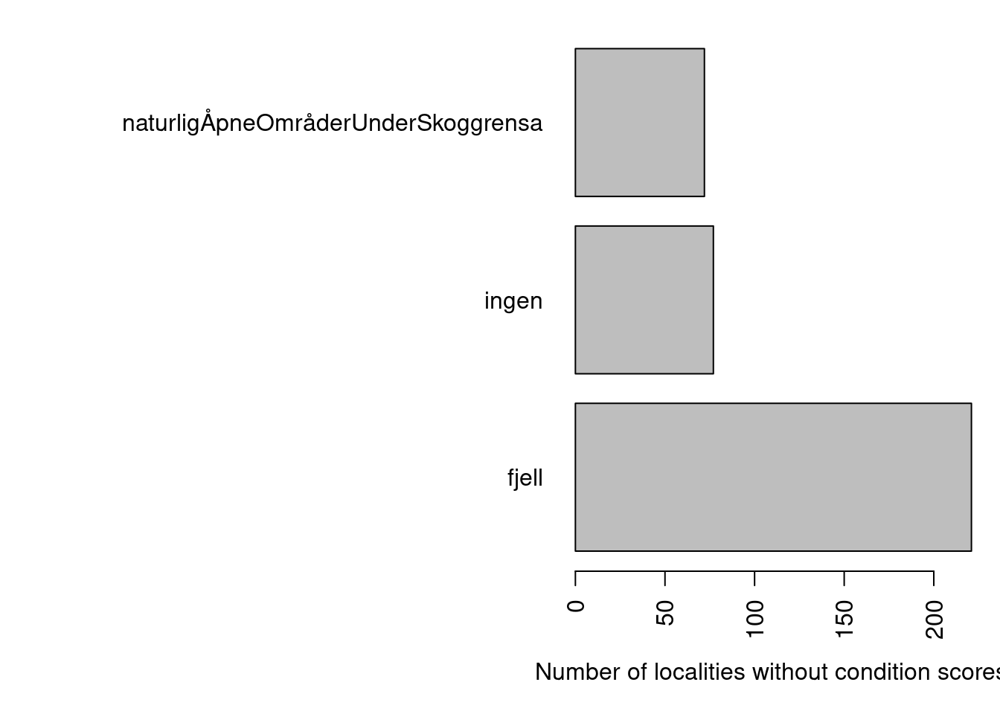
<p class="caption">(\#fig:unnamed-chunk-13)Main ecosystems with localities missing condition scores.</p>
</div>

These cases are restricted to two main ecosystems, and one class where the main ecosystem is not recorded. Looking at some of those cases it is clear that they are not relevant for our work here, I and I don't know why they are in the data set to begin with.

```r
par(mar=c(5,20,1,1))
barplot(table(dat$naturtype[dat$tilstand==""]),
        horiz = T, las=2,
        xlab="Number of localities without condition scores")
```

<div class="figure">
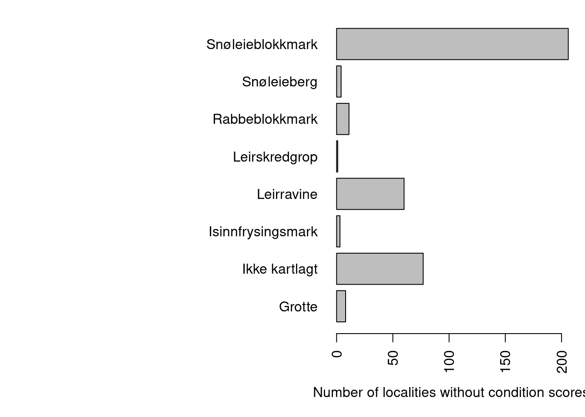
<p class="caption">(\#fig:unnamed-chunk-14)Nature types with localities missing condition scores.</p>
</div>

There are only seven nature types (if you exclude those that are not mapped) that don't have a condition score.

`Snøleieblokkmark` and `rabbeblokkmark` do not have a protocol for assessing condition status. `Leirskredgrop`, `leirravine` and `grotte` were nature types in 2018 (not mapped in 2021), and was similarly not assessed for condition scores. `Isinnfrysingsmark` is assessed for condition now, but not in 2018. `Snøleieberg` is new in 2022 and is only mapped for area. We can therefore exclude these localities from our data set:

```r
dat_rm <- dat
dat <- dat_rm[dat_rm$tilstand!="",]
```

This resulted in the deletion of 370 rows, or 0.32 % of the data.


## Mosaic types
The field mapping instruction include and option for delineating mosaic types. Let's investigate these cases.

When an area displays a repeating pattern of mixed nature types that each are smaller than the minimum mapping unit MMU, these are grouped into as many overlapping polygons as there are unique nature types. Within the nature type polygons, these will have the same distribution of NiN-grunntyper (online you can see the percentage distribution, but our data set only has the presence/absence data) but be assigned different nature types (nature types is the Environmental agencies classification). The condition scoring can be unique to each overlapping nature type in the mosaic. But we don't know the precise location of the NiN-grunntyper that are part of mosaic nature types.


```r
barplot(table(dat$mosaikk),
        xlab = "Mosaic", ylab="Number of localities")
```

<div class="figure">
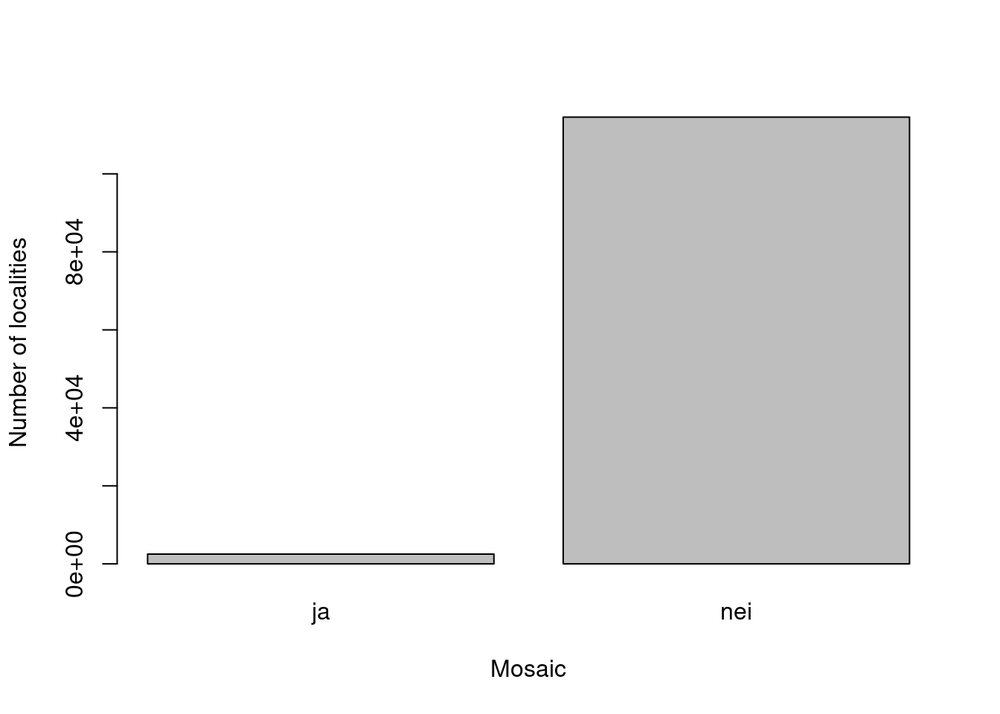
<p class="caption">(\#fig:unnamed-chunk-17)The number of mosaic localities is relatively small.</p>
</div>
Mosaic localities occur in many main ecosystems (and many nature types therein). 

```r
# Fix duplicated `hovedøkosystem`
#unique(dat$hovedøkosystem)
dat$hovedøkosystem[dat$hovedøkosystem=="naturligÅpneOmråderILavlandet"] <- "naturligÅpneOmråderUnderSkoggrensa"
```


```r
par(mar=c(5,20,1,1))
barplot(table(dat$hovedøkosystem[dat$mosaikk=="ja"]),
        horiz = T, las=2,
        xlab="Number of mosaic localities")
```

<div class="figure">
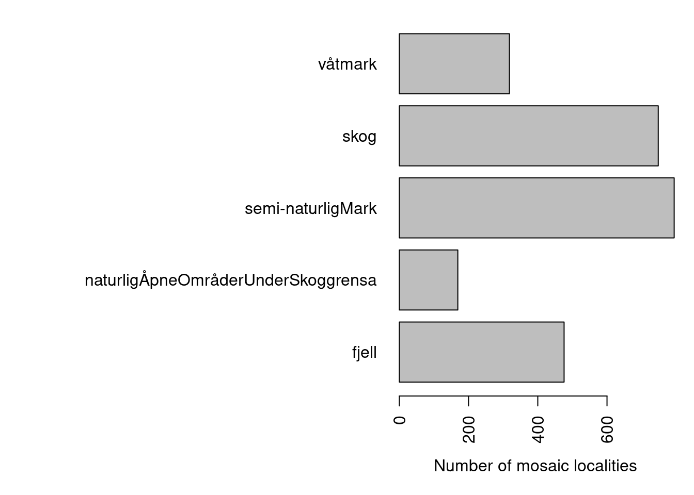
<p class="caption">(\#fig:unnamed-chunk-19)Distribution of mosaic nature types across hovedøkosystem</p>
</div>

Some conclusion here could be that

1. Mosaic localities CANNOT be used to pin-point NiN grunntyper (e.g. for remote sensing purposes).
1. Mosaic localities CAN be used to extract condition scores for nature types, but these should not be tied to all the *NiN grunntype* listed in that polygon, because that will include some that belong to the other part(s) of the mosaic.


## NiN types across main ecosystems
The NiN main types can be extracted from the column `ninKartleggingsenheter`. These are NiN mapping units recorded in the field. The NiN main type makes up the first part of this mapping unit code. The variable is oddly concatenated. Let's tease it apart.


```r
#dat$ninKartleggingsenheter  [1:10]
# remove NA prefix:
dat$ninKartleggingsenheter2 <- gsub("NA_", dat$ninKartleggingsenheter, replacement = "")
#dat$ninKartleggingsenheter2[1:30]

dat$ninKartleggingsenheter2 <- str_replace_all(dat$ninKartleggingsenheter2, ".[CE].[\\d]{1,}", replacement = "")
#dat$ninKartleggingsenheter2[1:30]
dat$ninKartleggingsenheter2 <- str_replace_all(dat$ninKartleggingsenheter2, "-.", replacement = "")
uni <- function(x){paste(unique(unlist(strsplit(x, ","))), collapse = ",")}
dat$ninKartleggingsenheter3 <- lapply(dat$ninKartleggingsenheter2, uni)
n_uni <- function(x){length(unique(unlist(strsplit(x, ","))))}
dat$n_ninKartleggingsenheter <- lapply(dat$ninKartleggingsenheter2, n_uni)
dat$n_ninKartleggingsenheter <- as.numeric(dat$n_ninKartleggingsenheter) 

par(mfrow=c(1,3))
barplot(table(dat$n_ninKartleggingsenheter),
        xlab = "Number of NiN main types",
        ylab = "Number of localities")
barplot(table(dat$n_ninKartleggingsenheter[dat$mosaikk=="nei"]),
        xlab = "Number of NiN main types\n(Mosaic localities excluded)")
barplot(table(dat$n_ninKartleggingsenheter[dat$mosaikk=="ja"]),
        xlab = "Number of NiN main types\n(Mosaic localities only)")
```

<div class="figure">
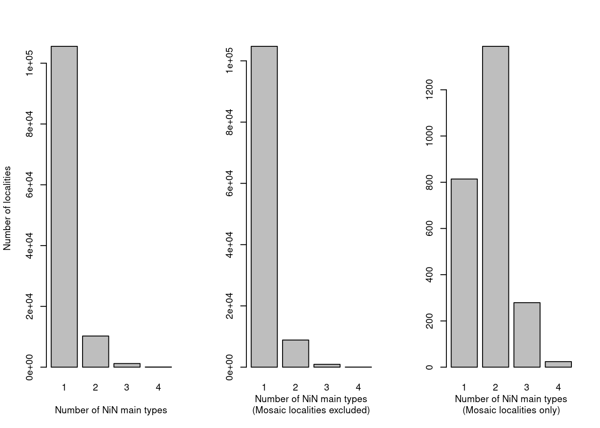
<p class="caption">(\#fig:unnamed-chunk-20)The number of NiN main types within one locality should normally be one, except for mosaic localities.</p>
</div>

Mosaic localities (right pane) have a much higher likelihood of including multiple NiN main types, but it also occurs in non-mosaic localities (over 10 000 cases). Most, if not all, nature types are defined within a single NiN main type, so we need to see whats going on there.

First I need to melt the data frame in order to tally the number of NiN min types within each `hovedøkosystem`.

```r
dat_melt <- tidyr::separate_rows(dat, ninKartleggingsenheter3)
```


```r
ggplot(dat_melt[dat_melt$mosaikk!="ja",])+
  geom_bar(aes(x = ninKartleggingsenheter3))+
  coord_flip()+
  theme_bw(base_size = 12)+
  facet_wrap("hovedøkosystem",
             scales = "free")
```

<div class="figure">

<p class="caption">(\#fig:unnamed-chunk-22)Figure showing the number of localities for each NiN main type. One locality can have more than one NiN main type. Mosaic localities are excluded in this figure.</p>
</div>

This is a messy figure, but the point is, there is a lot of miss-match between NiN main types and *hovedøkosystem*. Taking one example: T2 (åpen grunnledt mark) is not found in mountains, but there is one case where this occurs. If I view that case


```r
View(dat_melt[dat_melt$mosaikk!="Ja" & dat_melt$hovedøkosystem=="Fjell" & dat_melt$ninKartleggingsenheter3=="T2",])
```

.. and find the online fact sheet for that locality, I see that it is actually NOT a mosaic. It is a nature type called *Kalkfattig og intermediær fjellhei, leside og tundra* which is defined as strictly T3, but the field surveyor has recorded lots of NiN mapping units (and hence, main NiN types) in addition. This is a mistake. Online I can see that the locality is 50% T3, but this information is not in the data set that we have available. Miljødirektoratet could consider adding this information to the downloadable dataset. The order of the NiN types in the `ninKartleggingsenheter` column is not reflecting the commonness of the types ether. 

If there was a way to extract the defining NiN type from the `naturtype` column, that would be nice. Miljødirektoratet may consider adding this as well. If we exclude all localities that are not mosaics, but that have multiple NiN main types (no, we're not going to do that, here at least), we first need to know if there are not any `naturtype` which allow for multiple NiN main types.

As this next figure show, these cases are not restricted to mapping year, and hence to any changes in the field protocol.

```r
par(mar=c(2,6,2,2))
temp <- dat[dat$n_ninKartleggingsenheter>1 & dat$mosaikk!="ja",]
barplot(table(temp$kartleggingsår), ylab="Number of localities with more than one NiN main type\n(mosaic localitie excluded) ")
```

<div class="figure">

<p class="caption">(\#fig:unnamed-chunk-24)Temporal trend in the recording of non-mosaic localities that are recorded as consisting of multiple NiN mapping units from different NiN main types.</p>
</div>

Lets look at the most common nature types that are recorded this way.

```r
temp2 <- as.data.frame(table(temp$naturtype, temp$n_ninKartleggingsenheter))
temp2 <- temp2[base::order(temp2$Freq, decreasing = T),][1:10,]
par(mar=c(8,20,1,1))
barplot(temp2$Freq, names.arg = temp2$Var1, las=2,
        horiz = T, xlab = "Number of localities with >1 NiN main type")
```

<div class="figure">
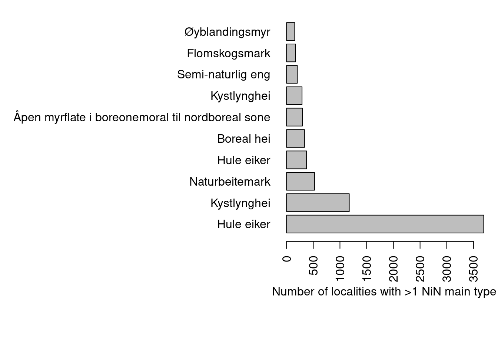
<p class="caption">(\#fig:multipleNiN)The ten most common nature types and the number of localities with with multiple NiN main types</p>
</div>

'Hule eiker' is a special case because these are recorded as points and not polygons, and they can be found in any NiN main type and any *hovedøkosystem*.


```r
DT::datatable(
  dat[dat$naturtype=="Hule eiker",][1:5,c("naturtype", "hovedøkosystem", "ninKartleggingsenheter")])
```

```{=html}
<div class="datatables html-widget html-fill-item-overflow-hidden html-fill-item" id="htmlwidget-4606be82e42d1e184e59" style="width:100%;height:auto;"></div>
<script type="application/json" data-for="htmlwidget-4606be82e42d1e184e59">{"x":{"filter":"none","vertical":false,"data":[["30","35","108","109","110"],["Hule eiker","Hule eiker","Hule eiker","Hule eiker","Hule eiker"],["semi-naturligMark","skog","skog","skog","skog"],["NA_T4-C-2","NA_T37-C-2,NA_T35-C-1","NA_T4-C-6,NA_T44-C-1","NA_T4-C-10,NA_T44-C-1","NA_T4-C-6"],[{"type":"Polygon","coordinates":[[[293447.5702,6554104.6838],[293447.5382,6554103.7075],[293447.4425,6554102.7354],[293447.2833,6554101.7717],[293447.0615,6554100.8204],[293446.778,6554099.8857],[293446.4339,6554098.9715],[293446.0308,6554098.0817],[293445.5703,6554097.2203],[293445.0545,6554096.3908],[293444.4855,6554095.5968],[293443.8659,6554094.8417],[293443.1981,6554094.1288],[293442.4852,6554093.461],[293441.7301,6554092.8414],[293440.9361,6554092.2724],[293440.1066,6554091.7566],[293439.2452,6554091.2961],[293438.3554,6554090.893],[293437.4413,6554090.5489],[293436.5065,6554090.2654],[293435.5552,6554090.0436],[293434.5915,6554089.8845],[293433.6194,6554089.7887],[293432.6431,6554089.7567],[293431.6668,6554089.7887],[293430.6947,6554089.8845],[293429.731,6554090.0436],[293428.7797,6554090.2654],[293427.845,6554090.5489],[293426.9308,6554090.893],[293426.041,6554091.2961],[293425.1796,6554091.7566],[293424.3501,6554092.2724],[293423.5561,6554092.8414],[293422.801,6554093.461],[293422.0881,6554094.1288],[293421.4204,6554094.8417],[293420.8007,6554095.5968],[293420.2317,6554096.3908],[293419.7159,6554097.2203],[293419.2554,6554098.0817],[293418.8523,6554098.9715],[293418.5082,6554099.8857],[293418.2247,6554100.8204],[293418.0029,6554101.7717],[293417.8438,6554102.7354],[293417.748,6554103.7075],[293417.7161,6554104.6838],[293417.748,6554105.6601],[293417.8438,6554106.6322],[293418.0029,6554107.5959],[293418.2247,6554108.5472],[293418.5082,6554109.4819],[293418.8523,6554110.3961],[293419.2554,6554111.2859],[293419.7159,6554112.1473],[293420.2317,6554112.9768],[293420.8007,6554113.7708],[293421.4204,6554114.5259],[293422.0881,6554115.2388],[293422.801,6554115.9066],[293423.5561,6554116.5262],[293424.3501,6554117.0952],[293425.1796,6554117.611],[293426.041,6554118.0715],[293426.9308,6554118.4746],[293427.845,6554118.8187],[293428.7797,6554119.1022],[293429.731,6554119.324],[293430.6947,6554119.4832],[293431.6668,6554119.5789],[293432.6431,6554119.6109],[293433.6194,6554119.5789],[293434.5915,6554119.4832],[293435.5552,6554119.324],[293436.5065,6554119.1022],[293437.4413,6554118.8187],[293438.3554,6554118.4746],[293439.2452,6554118.0715],[293440.1066,6554117.611],[293440.9361,6554117.0952],[293441.7301,6554116.5262],[293442.4852,6554115.9066],[293443.1981,6554115.2388],[293443.8659,6554114.5259],[293443.9651,6554114.405],[293444.0363,6554114.329],[293444.6559,6554113.5739],[293445.2249,6554112.7799],[293445.7407,6554111.9504],[293446.2012,6554111.089],[293446.3077,6554110.8539],[293446.2244,6554110.8585],[293446.4339,6554110.3961],[293446.778,6554109.4819],[293447.0615,6554108.5472],[293447.2833,6554107.5959],[293447.4425,6554106.6322],[293447.5382,6554105.6601],[293447.5702,6554104.6838]]]},{"type":"Polygon","coordinates":[[[54460.4755999995,6457415.3689],[54460.4436999997,6457414.3926],[54460.3479000004,6457413.4205],[54460.1887999997,6457412.4568],[54459.9670000002,6457411.5055],[54459.6835000003,6457410.5707],[54459.3393999999,6457409.6566],[54458.9362000003,6457408.7668],[54458.4758000001,6457407.9054],[54457.96,6457407.0759],[54457.3909999998,6457406.2819],[54456.7713000001,6457405.5268],[54456.1036,6457404.8139],[54455.3907000003,6457404.1461],[54454.6355999997,6457403.5265],[54453.8415999999,6457402.9575],[54453.0120999999,6457402.4417],[54452.1506000003,6457401.9812],[54451.2609000001,6457401.5781],[54450.3466999996,6457401.234],[54449.4119999995,6457400.9505],[54448.4606999997,6457400.7287],[54447.4968999997,6457400.5695],[54446.5248999996,6457400.4738],[54445.5486000003,6457400.4418],[54444.5723000001,6457400.4738],[54443.6002000002,6457400.5695],[54442.6365,6457400.7287],[54441.6852000002,6457400.9505],[54440.7504000003,6457401.234],[54439.8361999998,6457401.5781],[54438.9464999996,6457401.9812],[54438.0850999998,6457402.4417],[54437.2555999998,6457402.9575],[54436.4616,6457403.5265],[54435.7065000003,6457404.1461],[54434.9935999997,6457404.8139],[54434.3257999998,6457405.5268],[54433.7061000001,6457406.2819],[54433.1371999998,6457407.0759],[54432.6213999996,6457407.9054],[54432.1608999996,6457408.7668],[54431.7577999998,6457409.6566],[54431.4137000004,6457410.5707],[54431.1301999995,6457411.5055],[54430.9083000002,6457412.4568],[54430.7492000004,6457413.4205],[54430.6535,6457414.3926],[54430.6215000004,6457415.3689],[54430.6535,6457416.3452],[54430.7492000004,6457417.3173],[54430.9083000002,6457418.281],[54431.1301999995,6457419.2323],[54431.4137000004,6457420.167],[54431.7577999998,6457421.0812],[54432.1608999996,6457421.971],[54432.6213999996,6457422.8324],[54433.1371999998,6457423.6619],[54433.7061000001,6457424.4559],[54434.3257999998,6457425.211],[54434.9935999997,6457425.9239],[54435.7065000003,6457426.5916],[54436.4616,6457427.2113],[54437.2555999998,6457427.7803],[54438.0850999998,6457428.2961],[54438.9464999996,6457428.7566],[54439.8361999998,6457429.1597],[54440.7504000003,6457429.5038],[54441.6852000002,6457429.7873],[54442.6365,6457430.0091],[54443.6002000002,6457430.1682],[54444.5723000001,6457430.264],[54445.5486000003,6457430.2959],[54446.5248999996,6457430.264],[54447.4968999997,6457430.1682],[54448.4606999997,6457430.0091],[54449.4119999995,6457429.7873],[54450.3466999996,6457429.5038],[54451.2609000001,6457429.1597],[54452.1506000003,6457428.7566],[54453.0120999999,6457428.2961],[54453.8415999999,6457427.7803],[54454.6355999997,6457427.2113],[54455.3907000003,6457426.5916],[54456.1036,6457425.9239],[54456.7713000001,6457425.211],[54457.3909999998,6457424.4559],[54457.96,6457423.6619],[54458.4758000001,6457422.8324],[54458.9362000003,6457421.971],[54459.3393999999,6457421.0812],[54459.6835000003,6457420.167],[54459.9670000002,6457419.2323],[54460.1887999997,6457418.281],[54460.3479000004,6457417.3173],[54460.4436999997,6457416.3452],[54460.4755999995,6457415.3689]]]},{"type":"Polygon","coordinates":[[[279113.4302,6564090.2734],[279113.3982,6564089.2971],[279113.3025,6564088.3251],[279113.1434,6564087.3613],[279112.9216,6564086.41],[279112.638,6564085.4753],[279112.294,6564084.5611],[279111.8908,6564083.6714],[279111.4304,6564082.8099],[279110.9145,6564081.9804],[279110.3456,6564081.1864],[279109.7259,6564080.4313],[279109.0582,6564079.7184],[279108.3452,6564079.0507],[279107.5902,6564078.431],[279106.7962,6564077.862],[279105.9667,6564077.3462],[279105.1052,6564076.8858],[279104.2155,6564076.4826],[279103.3013,6564076.1385],[279102.3666,6564075.855],[279101.4153,6564075.6332],[279100.4515,6564075.4741],[279099.4794,6564075.3783],[279098.5032,6564075.3464],[279097.5269,6564075.3783],[279096.5548,6564075.4741],[279095.591,6564075.6332],[279094.6397,6564075.855],[279093.705,6564076.1385],[279092.7908,6564076.4826],[279091.9011,6564076.8858],[279091.0396,6564077.3462],[279090.2101,6564077.862],[279089.4161,6564078.431],[279088.6611,6564079.0507],[279087.9481,6564079.7184],[279087.2804,6564080.4313],[279086.6607,6564081.1864],[279086.0918,6564081.9804],[279085.5759,6564082.8099],[279085.1155,6564083.6714],[279084.7124,6564084.5611],[279084.3683,6564085.4753],[279084.0847,6564086.41],[279083.8629,6564087.3613],[279083.7038,6564088.3251],[279083.6081,6564089.2971],[279083.5761,6564090.2734],[279083.6081,6564091.2497],[279083.7038,6564092.2218],[279083.8629,6564093.1855],[279084.0847,6564094.1368],[279084.3683,6564095.0716],[279084.7124,6564095.9858],[279085.1155,6564096.8755],[279085.5759,6564097.7369],[279086.0918,6564098.5664],[279086.6607,6564099.3604],[279087.2804,6564100.1155],[279087.9481,6564100.8284],[279088.6611,6564101.4962],[279089.4161,6564102.1158],[279090.2101,6564102.6848],[279091.0396,6564103.2006],[279091.9011,6564103.6611],[279092.7908,6564104.0642],[279093.705,6564104.4083],[279094.6397,6564104.6918],[279095.591,6564104.9137],[279096.5548,6564105.0728],[279097.5269,6564105.1685],[279098.5032,6564105.2005],[279099.4794,6564105.1685],[279100.4515,6564105.0728],[279101.4153,6564104.9137],[279102.3666,6564104.6918],[279103.3013,6564104.4083],[279104.2155,6564104.0642],[279105.1052,6564103.6611],[279105.9667,6564103.2006],[279106.7962,6564102.6848],[279107.5902,6564102.1158],[279108.3452,6564101.4962],[279109.0582,6564100.8284],[279109.7259,6564100.1155],[279110.3456,6564099.3604],[279110.9145,6564098.5664],[279111.4304,6564097.7369],[279111.8908,6564096.8755],[279112.294,6564095.9858],[279112.638,6564095.0716],[279112.9216,6564094.1368],[279113.1434,6564093.1855],[279113.3025,6564092.2218],[279113.3982,6564091.2497],[279113.4302,6564090.2734]]]},{"type":"Polygon","coordinates":[[[279073.1685,6564122.7994],[279073.1365,6564121.8231],[279073.0408,6564120.851],[279072.8816,6564119.8873],[279072.6598,6564118.936],[279072.3763,6564118.0013],[279072.0322,6564117.0871],[279071.6291,6564116.1973],[279071.1686,6564115.3359],[279070.6528,6564114.5064],[279070.0838,6564113.7124],[279069.4642,6564112.9573],[279068.7964,6564112.2444],[279068.0835,6564111.5766],[279067.3284,6564110.957],[279066.5344,6564110.388],[279065.7049,6564109.8722],[279064.8435,6564109.4117],[279063.9537,6564109.0086],[279063.0396,6564108.6645],[279062.1048,6564108.381],[279061.1535,6564108.1592],[279060.1898,6564108],[279059.2177,6564107.9043],[279058.2414,6564107.8723],[279057.2651,6564107.9043],[279056.293,6564108],[279055.3293,6564108.1592],[279054.378,6564108.381],[279053.4433,6564108.6645],[279052.5291,6564109.0086],[279051.6393,6564109.4117],[279050.7779,6564109.8722],[279049.9484,6564110.388],[279049.1544,6564110.957],[279048.3993,6564111.5766],[279047.6864,6564112.2444],[279047.0187,6564112.9573],[279046.399,6564113.7124],[279045.83,6564114.5064],[279045.3142,6564115.3359],[279044.8537,6564116.1973],[279044.4506,6564117.0871],[279044.1065,6564118.0013],[279043.823,6564118.936],[279043.6012,6564119.8873],[279043.4421,6564120.851],[279043.3463,6564121.8231],[279043.3144,6564122.7994],[279043.3463,6564123.7757],[279043.4421,6564124.7478],[279043.6012,6564125.7115],[279043.823,6564126.6628],[279044.1065,6564127.5975],[279044.4506,6564128.5117],[279044.8537,6564129.4015],[279045.3142,6564130.2629],[279045.83,6564131.0924],[279046.399,6564131.8864],[279047.0187,6564132.6415],[279047.6864,6564133.3544],[279048.3993,6564134.0221],[279049.1544,6564134.6418],[279049.9484,6564135.2108],[279050.7779,6564135.7266],[279051.6393,6564136.1871],[279052.5291,6564136.5902],[279053.4433,6564136.9343],[279054.378,6564137.2178],[279055.3293,6564137.4396],[279056.293,6564137.5987],[279057.2651,6564137.6945],[279058.2414,6564137.7264],[279059.2177,6564137.6945],[279060.1898,6564137.5987],[279061.1535,6564137.4396],[279062.1048,6564137.2178],[279063.0396,6564136.9343],[279063.9537,6564136.5902],[279064.8435,6564136.1871],[279065.7049,6564135.7266],[279066.5344,6564135.2108],[279067.3284,6564134.6418],[279068.0835,6564134.0221],[279068.7964,6564133.3544],[279069.4642,6564132.6415],[279070.0838,6564131.8864],[279070.6528,6564131.0924],[279071.1686,6564130.2629],[279071.6291,6564129.4015],[279072.0322,6564128.5117],[279072.3763,6564127.5975],[279072.6598,6564126.6628],[279072.8816,6564125.7115],[279073.0408,6564124.7478],[279073.1365,6564123.7757],[279073.1685,6564122.7994]]]},{"type":"Polygon","coordinates":[[[282601.5632,6566337.7197],[282601.5313,6566336.7434],[282601.4355,6566335.7713],[282601.2764,6566334.8076],[282601.0546,6566333.8563],[282600.7711,6566332.9215],[282600.427,6566332.0073],[282600.0238,6566331.1176],[282599.5634,6566330.2562],[282599.0476,6566329.4267],[282598.4786,6566328.6327],[282597.8589,6566327.8776],[282597.1912,6566327.1647],[282596.4783,6566326.4969],[282595.7232,6566325.8773],[282594.9292,6566325.3083],[282594.0997,6566324.7925],[282593.2382,6566324.332],[282592.3485,6566323.9289],[282591.4343,6566323.5848],[282590.4996,6566323.3013],[282589.5483,6566323.0794],[282588.5845,6566322.9203],[282587.6125,6566322.8246],[282586.6362,6566322.7926],[282585.6599,6566322.8246],[282584.6878,6566322.9203],[282583.7241,6566323.0794],[282582.7728,6566323.3013],[282581.838,6566323.5848],[282580.9238,6566323.9289],[282580.0341,6566324.332],[282579.1726,6566324.7925],[282578.3431,6566325.3083],[282577.5492,6566325.8773],[282576.7941,6566326.4969],[282576.0812,6566327.1647],[282575.4134,6566327.8776],[282574.7937,6566328.6327],[282574.2248,6566329.4267],[282573.709,6566330.2562],[282573.2485,6566331.1176],[282572.8454,6566332.0073],[282572.5013,6566332.9215],[282572.2177,6566333.8563],[282571.9959,6566334.8076],[282571.8368,6566335.7713],[282571.7411,6566336.7434],[282571.7091,6566337.7197],[282571.7411,6566338.696],[282571.8368,6566339.6681],[282571.9959,6566340.6318],[282572.2177,6566341.5831],[282572.5013,6566342.5178],[282572.8454,6566343.432],[282573.2485,6566344.3217],[282573.709,6566345.1832],[282574.2248,6566346.0127],[282574.7937,6566346.8067],[282575.4134,6566347.5618],[282576.0812,6566348.2747],[282576.7941,6566348.9424],[282577.5492,6566349.5621],[282578.3431,6566350.1311],[282579.1726,6566350.6469],[282580.0341,6566351.1073],[282580.9238,6566351.5105],[282581.838,6566351.8546],[282582.7728,6566352.1381],[282583.7241,6566352.3599],[282584.6878,6566352.519],[282585.6599,6566352.6148],[282586.6362,6566352.6467],[282587.6125,6566352.6148],[282588.5845,6566352.519],[282589.5483,6566352.3599],[282590.4996,6566352.1381],[282591.4343,6566351.8546],[282592.3485,6566351.5105],[282593.2382,6566351.1073],[282594.0997,6566350.6469],[282594.9292,6566350.1311],[282595.7232,6566349.5621],[282596.4783,6566348.9424],[282597.1912,6566348.2747],[282597.8589,6566347.5618],[282598.4786,6566346.8067],[282599.0476,6566346.0127],[282599.5634,6566345.1832],[282600.0238,6566344.3217],[282600.427,6566343.432],[282600.7711,6566342.5178],[282601.0546,6566341.5831],[282601.2764,6566340.6318],[282601.4355,6566339.6681],[282601.5313,6566338.696],[282601.5632,6566337.7197]]]}]],"container":"<table class=\"display\">\n  <thead>\n    <tr>\n      <th> <\/th>\n      <th>naturtype<\/th>\n      <th>hovedøkosystem<\/th>\n      <th>ninKartleggingsenheter<\/th>\n      <th>SHAPE<\/th>\n    <\/tr>\n  <\/thead>\n<\/table>","options":{"columnDefs":[{"orderable":false,"targets":0}],"order":[],"autoWidth":false,"orderClasses":false}},"evals":[],"jsHooks":[]}</script>
```

*Kystlynghei* often occurs as a mosaic, but figure \@ref(fig:multipleNiN) has excluded the mosaic localities, and then *kystlynghei* is strictly defined to T34.
The same is true for *naturbeitemark* which is restricted to T32.
Maybe these localities should all have been recorded as mosaic localities. In any case, we cannot automatically extract the main NiN type from these rows now. 

The remaining option is to manually assign the defining NiN main type to each nature type. This data is not included in the data set, and would need to be sourced from the mapping protocols for all the different field seasons.

For a deeper analyses into the causes for localities being mapped to NiN main types outside the definition of the nature type, see [Appendix 1].

## Assigning NiN main types to Nature types
The NiN main types need to be added manually to the nature types, as the field recorded data is error prone, and the defining NiN units for each nature type is not included in the data set.

I will start by excluding all but the three target ecosystems.

```r
target <- c("semi-naturligMark",
            "våtmark",
            "naturligÅpneOmråderUnderSkoggrensa")
dat <- dat[dat$hovedøkosystem %in% target,]
```

I will also exclude `Hule eiker`, as this nature type is not easy to tie to a single main ecosystem. _In some other scenarios, one might wish to keep hule eiker depending on the main ecosystem that it was recorded to in the field._


```r
dat <- dat[dat$naturtype != "Hule eiker",]
```

Get the unique nature types

```r
ntyp <- unique(dat$naturtype)
```

Extract the year when these were mapped

```r
years <- NULL
for(i in 1:length(ntyp)){
years[i] <- paste(sort(unique(dat$kartleggingsår[dat$naturtype == ntyp[i]])), collapse = ", ")
}
```

Extract the associated ecosystem

```r
eco <- NULL
for(i in 1:length(ntyp)){
eco[i] <- paste(unique(dat$hovedøkosystem[dat$naturtype == ntyp[i]]), collapse = ", ")
}
```

Combine into one data frame

```r
ntypDF <- data.frame(
  "Nature_type" = ntyp,
  "Year"        = years,
  "Ecosystem"   = eco
)
```

We have 69 nature types to consider. 

Some of the wetland types can actually be excluded because of the way we limited this ecosystem to mean *open* wetland:


```r
excl_nt <- c("Kalkrik myr- og sumpskogsmark",
             #"Flommyr, myrkant og myrskogsmark",  # Only V9 is relevant. This type also includes V2 and V8
             "Gammel fattig sumpskog",
             "Rik gransumpskog",
             "Grankildeskog",
             "Rik svartorsumpskog",
             "Rik gråorsumpskog",
             "Rik svartorstrandskog",
             "Saltpåvirket svartorstrandskog",
             "Kilde-edellauvskog",
             "Saltpåvirket strand- og sumpskogsmark",
             "Svak kilde og kildeskogsmark",
             "Rik vierstrandskog",
             "Varmekjær kildelauvskog"
             )
ntypDF$Nature_type <- trimws(ntypDF$Nature_type)
ntypDF <- ntypDF[!ntypDF$Nature_type %in% excl_nt,]
```


```r
DT::datatable(ntypDF)
```

<div class="figure">

```{=html}
<div class="datatables html-widget html-fill-item-overflow-hidden html-fill-item" id="htmlwidget-df53d904a5619d882027" style="width:100%;height:auto;"></div>
<script type="application/json" data-for="htmlwidget-df53d904a5619d882027">{"x":{"filter":"none","vertical":false,"data":[["1","3","4","5","7","8","9","10","11","12","13","14","15","16","17","18","19","20","21","22","23","24","25","27","28","30","31","32","33","36","37","38","39","40","41","43","44","46","47","49","50","52","53","55","56","57","58","59","60","61","63","64","65","66","68","69"],["Flommyr, myrkant og myrskogsmark","Slåttemyr","Hagemark","Naturbeitemark","Semi-naturlig eng","Eng-aktig sterkt endret fastmark","Sørlig kaldkilde","Åpen flomfastmark","Høgereligende og nordlig nedbørsmyr","Øyblandingsmyr","Strandeng","Nakent tørkeutsatt kalkberg","Kystlynghei","Sørlig slåttemyr","Konsentrisk høymyr","Boreal hei","Semi-naturlig våteng","Slåttemark","Sanddynemark","Semi-naturlig strandeng","Kalkrik åpen jordvannsmyr i boreonemoral til nordboreal sone","Åpen myrflate i boreonemoral til nordboreal sone","Kaldkilde under skoggrensa","Sentrisk høgmyr","Rik åpen jordvannsmyr i mellomboreal sone","Sørlig nedbørsmyr","Atlantisk høymyr","Terrengdekkende myr","Åpen grunnlendt kalkrik mark i boreonemoral sone","Rik åpen sørlig jordvannsmyr","Aktiv skredmark","Semi-naturlig myr","Kystnedbørsmyr","Silt og leirskred","Eksentrisk høymyr","Øvre sandstrand uten pionervegetasjon","Kalkrik helofyttsump","Fuglefjell-eng og fugletopp","Isinnfrysingsmark","Sørlig strandeng","Åpen grunnlendt kalkrik mark i sørboreal sone","Sørlig etablert sanddynemark","Rik åpen jordvannsmyr i nordboreal og lavalpin sone","Rik åpen jordvannsmyr i nordboreal og lavalpin sone","Fossepåvirket berg","Fosse-eng","Svært tørkeutsatt sørlig kalkberg","Lauveng","Kanthøymyr","Platåhøymyr","Rik åpen sørlig jordvannsmyr","Palsmyr","Nakent tørkeutsatt kalkberg","Tørt kalkrikt berg i kontinentale områder","Åpen myrflate i lavalpin sone","Fosseberg"],["2018","2018, 2019, 2020, 2021, 2022","2018, 2019, 2020, 2021, 2022","2018, 2019, 2020, 2021, 2022","2018, 2019, 2020, 2021, 2022","2018, 2019, 2020, 2021, 2022","2018, 2019, 2020, 2021, 2022","2018, 2019, 2020, 2021, 2022","2019, 2020, 2021, 2022","2019, 2020, 2021, 2022","2018, 2019, 2020, 2021, 2022","2019, 2020, 2021, 2022","2018, 2019, 2020, 2021, 2022","2019, 2020, 2021, 2022","2019, 2020, 2022","2018, 2019, 2020, 2021, 2022","2018, 2019, 2020, 2021, 2022","2018, 2019, 2020, 2021, 2022","2018, 2019, 2020, 2021, 2022","2018, 2019, 2020, 2021, 2022","2018","2018","2018","2018","2019, 2020, 2021, 2022","2019, 2020, 2021, 2022","2019, 2020, 2021, 2022","2019, 2020, 2021, 2022","2018, 2019, 2020, 2021, 2022","2018, 2019, 2020, 2021, 2022","2019, 2020, 2021, 2022","2019, 2020, 2021, 2022","2018","2019, 2020, 2021, 2022","2019, 2020, 2021, 2022","2019, 2020, 2021, 2022","2019, 2020, 2021, 2022","2019, 2020, 2021, 2022","2018, 2019, 2020, 2021, 2022","2018","2019, 2020, 2021","2018, 2019, 2020, 2021, 2022","2018","2019, 2020, 2021, 2022","2019, 2020, 2021, 2022","2019, 2020, 2022","2019, 2020, 2021, 2022","2019, 2020, 2022","2019, 2020, 2021, 2022","2019, 2020, 2021, 2022","2018","2021, 2022","2018","2019","2018","2021, 2022"],["våtmark","våtmark","semi-naturligMark","semi-naturligMark","semi-naturligMark","semi-naturligMark","våtmark","naturligÅpneOmråderUnderSkoggrensa","våtmark","våtmark","naturligÅpneOmråderUnderSkoggrensa","naturligÅpneOmråderUnderSkoggrensa","semi-naturligMark","våtmark","våtmark","semi-naturligMark","våtmark","semi-naturligMark","naturligÅpneOmråderUnderSkoggrensa","semi-naturligMark","våtmark","våtmark","våtmark","våtmark","våtmark","våtmark","våtmark","våtmark","naturligÅpneOmråderUnderSkoggrensa","våtmark","naturligÅpneOmråderUnderSkoggrensa","våtmark","våtmark","naturligÅpneOmråderUnderSkoggrensa","våtmark","naturligÅpneOmråderUnderSkoggrensa","våtmark","naturligÅpneOmråderUnderSkoggrensa","naturligÅpneOmråderUnderSkoggrensa","naturligÅpneOmråderUnderSkoggrensa","naturligÅpneOmråderUnderSkoggrensa","naturligÅpneOmråderUnderSkoggrensa","våtmark","våtmark","naturligÅpneOmråderUnderSkoggrensa","naturligÅpneOmråderUnderSkoggrensa","naturligÅpneOmråderUnderSkoggrensa","semi-naturligMark","våtmark","våtmark","våtmark","våtmark","naturligÅpneOmråderUnderSkoggrensa","naturligÅpneOmråderUnderSkoggrensa","våtmark","naturligÅpneOmråderUnderSkoggrensa"]],"container":"<table class=\"display\">\n  <thead>\n    <tr>\n      <th> <\/th>\n      <th>Nature_type<\/th>\n      <th>Year<\/th>\n      <th>Ecosystem<\/th>\n    <\/tr>\n  <\/thead>\n<\/table>","options":{"columnDefs":[{"orderable":false,"targets":0}],"order":[],"autoWidth":false,"orderClasses":false}},"evals":[],"jsHooks":[]}</script>
```

<p class="caption">(\#fig:unnamed-chunk-32)List of nature types showing the years when that nature type was mapped.</p>
</div>

I will also now exclude nature types that were only mapped in 2018 and/or 2019 and not after that. These nature types will not only not get more data in the future, but also they were mapped in a time when the methodology was quite unstable. 


```r
ntypDF2 <- ntypDF[ntypDF$Year != "2018" &
                  ntypDF$Year != "2019" & 
                  ntypDF$Year != "2018, 2019"# no types were mappend in 2018 & 2019 only
                  ,]
```

This removed 12 nature types.

Next I want to add the NiN main types. I need to look at the definition of each nature type and get the NiN code from there. I could also extract the NiN sub types (grunntyper), but it would become too messy. Therefor I will create a second column with a textual/categorical description of the degree of thematic coverage.

I will look at the definitions of the nature type in the first and last year when that type was mapped, but not for the years in between.

### Add NiN main type and degree of representativity

```r
#remove trailing white spaces
ntypDF2$Nature_type <- trimws(ntypDF2$Nature_type)
```


```r
ntypDF2$hovedgruppe[ntypDF2$Nature_type == "Aktiv skredmark"                                    ] <- "T17 | all (if including sub-types)"
ntypDF2$hovedgruppe[ntypDF2$Nature_type == "Åpen flomfastmark"                                  ] <- "T18 | all"
ntypDF2$hovedgruppe[ntypDF2$Nature_type == "Åpen grunnlendt kalkrik mark i boreonemoral sone"   ] <- "T2  | calcareous"
ntypDF2$hovedgruppe[ntypDF2$Nature_type == "Åpen grunnlendt kalkrik mark i sørboreal sone"      ] <- "T2  | calcareous"
ntypDF2$hovedgruppe[ntypDF2$Nature_type == "Atlantisk høymyr"                                   ] <- "V3  | all (if including sub-types)" # can also include smaller areas of V1
ntypDF2$hovedgruppe[ntypDF2$Nature_type == "Boreal hei"                                         ] <- "T31 | all"
ntypDF2$hovedgruppe[ntypDF2$Nature_type == "Eksentrisk høymyr"                                  ] <- "V3  | all (if including sub-types)" # can also include smaller areas of V1
ntypDF2$hovedgruppe[ntypDF2$Nature_type == "Eng-aktig sterkt endret fastmark"                   ] <- "T41 | all"
ntypDF2$hovedgruppe[ntypDF2$Nature_type == "Fosse-eng"                                          ] <- "T15 | all"
ntypDF2$hovedgruppe[ntypDF2$Nature_type == "Fosseberg"                                          ] <- "T1  | extra wet"
ntypDF2$hovedgruppe[ntypDF2$Nature_type == "Fossepåvirket berg"                                 ] <- "T1  | extra wet"
ntypDF2$hovedgruppe[ntypDF2$Nature_type == "Fuglefjell-eng og fugletopp"                        ] <- "T8  | all"
ntypDF2$hovedgruppe[ntypDF2$Nature_type == "Hagemark"                                           ] <- "T32 | all (if including sub-types)"
ntypDF2$hovedgruppe[ntypDF2$Nature_type == "Høgereligende og nordlig nedbørsmyr"                ] <- "V3  | all (if including sub-types)" # torvmarksformene are excluded
ntypDF2$hovedgruppe[ntypDF2$Nature_type == "Isinnfrysingsmark"                                  ] <- "T20 | all"
ntypDF2$hovedgruppe[ntypDF2$Nature_type == "Kalkrik helofyttsump"                               ] <- "L4 | calcareous"
ntypDF2$hovedgruppe[ntypDF2$Nature_type == "Kanthøymyr"                                         ] <- "V3  | all (if including sub-types)" # can also include smaller areas of V1
ntypDF2$hovedgruppe[ntypDF2$Nature_type == "Konsentrisk høymyr"                                 ] <- "V3  | all (if including sub-types)" # can also include smaller areas of V1
ntypDF2$hovedgruppe[ntypDF2$Nature_type == "Kystlynghei"                                        ] <- "T34 | all"
ntypDF2$hovedgruppe[ntypDF2$Nature_type == "Lauveng"                                            ] <- "T32 | all (if including sub-types)"
ntypDF2$hovedgruppe[ntypDF2$Nature_type == "Nakent tørkeutsatt kalkberg"                        ] <- "T1  | calcareous and dry"
ntypDF2$hovedgruppe[ntypDF2$Nature_type == "Naturbeitemark"                                     ] <- "T32 | all (if including sub-types)"
ntypDF2$hovedgruppe[ntypDF2$Nature_type == "Øvre sandstrand uten pionervegetasjon"              ] <- "T29 | sandy and vegetated"
ntypDF2$hovedgruppe[ntypDF2$Nature_type == "Øyblandingsmyr"                                     ] <- "V1  | partial" # also includes V3
ntypDF2$hovedgruppe[ntypDF2$Nature_type == "Palsmyr"                                            ] <- "V3  | all (if including sub-types)"
ntypDF2$hovedgruppe[ntypDF2$Nature_type == "Platåhøymyr"                                        ] <- "V3  | all (if including sub-types)" # can also include smaller areas of V1
ntypDF2$hovedgruppe[ntypDF2$Nature_type == "Rik åpen jordvannsmyr i mellomboreal sone"          ] <- "V1  | calcareous"
ntypDF2$hovedgruppe[ntypDF2$Nature_type == "Rik åpen jordvannsmyr i nordboreal og lavalpin sone"] <- "V1  | calcareous"
ntypDF2$hovedgruppe[ntypDF2$Nature_type == "Rik åpen sørlig jordvannsmyr"                       ] <- "V1  | calcareous"
ntypDF2$hovedgruppe[ntypDF2$Nature_type == "Sanddynemark"                                       ] <- "T21 | all (if including sub-types)"
ntypDF2$hovedgruppe[ntypDF2$Nature_type == "Semi-naturlig eng"                                  ] <- "T32 | all (if including sub-types)"
# This might be called Kulturmarkseng in the 2018 protocol, but Semi-naturlig eng in the data set. 
# Kulturmarkseng also includes V10
ntypDF2$hovedgruppe[ntypDF2$Nature_type == "Semi-naturlig myr"                                  ] <- "V9  | all (if including sub-types)"
ntypDF2$hovedgruppe[ntypDF2$Nature_type == "Semi-naturlig strandeng"                            ] <- "T33 | all (-2018)" # could perhaps be used in 2018, but it's defined awkwardly
ntypDF2$hovedgruppe[ntypDF2$Nature_type == "Semi-naturlig våteng"                               ] <- "V10 | all (-2018)"
ntypDF2$hovedgruppe[ntypDF2$Nature_type == "Silt og leirskred"                                  ] <- "T17 | all (if including sub-types)"
ntypDF2$hovedgruppe[ntypDF2$Nature_type == "Slåttemark"                                         ] <- "T32 | all (if including sub-types)"
ntypDF2$hovedgruppe[ntypDF2$Nature_type == "Slåttemyr"                                          ] <- "V9  | all (if including sub-types)"
ntypDF2$hovedgruppe[ntypDF2$Nature_type == "Sørlig etablert sanddynemark"                       ] <- "T21 | all (if including sub-types)"
ntypDF2$hovedgruppe[ntypDF2$Nature_type == "Sørlig kaldkilde"                                   ] <- "V4  | southern"
ntypDF2$hovedgruppe[ntypDF2$Nature_type == "Sørlig nedbørsmyr"                                  ] <- "V3  | all (if including sub-types)"
ntypDF2$hovedgruppe[ntypDF2$Nature_type == "Sørlig slåttemyr"                                   ] <- "V9  | all (if including sub-types)"
ntypDF2$hovedgruppe[ntypDF2$Nature_type == "Strandeng"                                          ] <- "T12 | all (-2018)"
ntypDF2$hovedgruppe[ntypDF2$Nature_type == "Svært tørkeutsatt sørlig kalkberg"                  ] <- "T1  | calcareous and dry"
ntypDF2$hovedgruppe[ntypDF2$Nature_type == "Terrengdekkende myr"                                ] <- "V3  | all (if including sub-types)"
```

Split this new column in two.

```r
ntypDF2 <- ntypDF2 %>%
  tidyr::separate(col = hovedgruppe,
                  into = c("NiN_mainType", "NiN_mainTypeCoverage"),
                  #sep = "|",
                  remove=T,
                  extra = "merge"
              )
```

## Add NiN variables

Preparing the data:

```r
#Exclude non-relevant forest wetland types
dat2 <- dat[!dat$naturtype %in% excl_nt,]

# Melt data
dat2L <- tidyr::separate_rows(dat2, ninBeskrivelsesvariable, sep=",")

# Split the code and the value into separate columns
dat2L <- tidyr::separate(dat2L, 
                              col = ninBeskrivelsesvariable,
                              into = c("NiN_variable_code", "NiN_variable_value"),
                              sep = "_",
                              remove=F
                              )
#> Warning: Expected 2 pieces. Missing pieces filled with `NA` in 1
#> rows [189800].
# One NA produced here, but I check it, and it's fine.

# Convert values to numeric. This causes some NA's which I will go through below
dat2L$NiN_variable_value <- as.numeric(dat2L$NiN_variable_value)
#> Warning: NAs introduced by coercion
```

Here are all the NiN variable codes:

```r
unique(sort(dat2L$NiN_variable_code))
#>  [1] "1AG-A-0"   "1AG-A-E"   "1AG-A-G"   "1AG-B"    
#>  [5] "1AG-C"     "1AR-A-E"   "1AR-C-L"   "3TO-BØ"   
#>  [9] "3TO-HA"    "3TO-HE"    "3TO-HK"    "3TO-HN"   
#> [13] "3TO-HP"    "3TO-PA"    "3TO-TE"    "4DL-S-0"  
#> [17] "4DL-SS-0"  "4TG-BL"    "4TG-EL"    "4TG-GF"   
#> [21] "4TL-BS"    "4TL-HE"    "4TL-HL"    "4TL-RB"   
#> [25] "4TL-SB"    "4TS-TS"    "5AB-0"     "5AB-DO-TT"
#> [29] "5BY-0"     "6SE"       "6SO"       "7FA"      
#> [33] "7GR-GI"    "7JB-BA"    "7JB-BT"    "7JB-GJ"   
#> [37] "7JB-HT-SL" "7JB-HT-ST" "7JB-KU-BY" "7JB-KU-DE"
#> [41] "7JB-KU-MO" "7JB-KU-PI" "7RA-BH"    "7RA-SJ"   
#> [45] "7SD-0"     "7SD-NS"    "7SE"       "7SN-BE"   
#> [49] "7TK"       "7VR-RE"    "7VR-RI"    "LKMKI"    
#> [53] "LKMSP"     "PRAK"      "PRAM"      "PRH"      
#> [57] "PRHA"      "PRHT"      "PRKA"      "PRKU"     
#> [61] "PRMY"      "PRRL-CR"   "PRRL-DD"   "PRRL-EN"  
#> [65] "PRRL-NT"   "PRRL-VU"   "PRSE-KA"   "PRSE-PA"  
#> [69] "PRSE-SH"   "PRSL"      "PRTK"      "PRTO"     
#> [73] "PRVS"
```

Converting NiN_variable_value to numeric also introduced NA's for these categories: 

```r
sort(unique(dat2L$NiN_variable_code[is.na(dat2L$NiN_variable_value)]))
#>  [1] "4DL-S-0"   "4DL-SS-0"  "4TL-HL"    "5AB-0"    
#>  [5] "5BY-0"     "7FA"       "7GR-GI"    "7JB-BA"   
#>  [9] "7JB-BT"    "7JB-GJ"    "7JB-KU-BY" "7JB-KU-DE"
#> [13] "7JB-KU-MO" "7JB-KU-PI" "7RA-SJ"    "7SD-0"    
#> [17] "7SD-NS"    "7SE"       "7SN-BE"    "7TK"      
#> [21] "7VR-RE"    "7VR-RI"    "LKMKI"     "LKMSP"    
#> [25] "PRH"       "PRVS"
```
When I now go through the variable codes separately I will also judge if these NA's are real, or if they for example should be coded as zeros or something. I will exclude variables that are part of the biodiversity assessment of the localities, since these are not assessed for localities that have a very poor condition (this bias is not possible to correct).

### 1AG-A (sjiktdekningsvariabler)
These are different variables describing the cover in different vegetation strata and/or species

* 1AG-A-0 = Total tre canopy cover
* 1AG-B = Total shrub cover
* 1AG-C = Total field layer cover
* 1AG-A-E = 'Overstandere'
* 1AG-A-G = 'gjenveksttrær'


### 1AR-C-L (Andel vedvekster i fletsjiktet)
A condition variable in some mire nature types

### 3TO (Torvmarksformer)
These are defining variables, and not part of the condition assessment.

```r
exclude <- c("3TO-BØ",
             "3TO-HA",
             "3TO-HE",
             "3TO-HK",
             "3TO-HN",
             "3TO-HP",
             "3TO-PA",
             "3TO-TE")
```


### 4DL (Coarse dead wood)
4DL-SS-0 and 4DL-S-0 has to do with the total amount of coarse woody debris/logs. It was only recorded for one nature type in 2018, and then as a a *biodiversity variable*, and not a state variable. 


```r
exclude <- c(exclude,
             "4DL-SS-0",
             "4DL-S-0")
```


### 4TG (old trees)
These three variables are used as *biodiversity variables* in  2018.

```r
exclude <- c(exclude,
             "4TG-BL",
             "4TG-EL",
             "4TG-GF")
```


### 4TL (trees with fire scars)
These five variables are used together with 4TG as *biodiversity variables* in 2018.

```r
exclude <- c(exclude,
             "4TL-BS",
             "4TL-HE",
             "4TL-HL",
             "4TL-RB",
             "4TL-SB")
```

### 5AB and 5BY (arealbruksklasser og byggningstyper)
These area land use types and building types, respectively, and the values are not numeric, but categorical, and represents presence or absence of these land uses or objects. These are not suited for automatically determining ecosystem condition as this is done subjectively in the field.

```r
exclude <- c(exclude,
             "5AB-0",
             "5AB-DO-TT",
             "5BY-0"
             )
```

### 6SE and 6SO (Bioclimatical sections and sones)
Not relevant here as condition variables.

```r
exclude <- c(exclude,
             "6SE",
             "6SO")
```

### 7FA (fremmedartsinnslag)
Should not have been allowed the value X, so Ok to keep these as NA.

### 7GR-GI
7GR-GI (grøftingsintensitet) should not have the value X either, so OK to exclude these NA's. But we keep the variable, even though its clearly a pressure indicator, we might want to use it as a surrogate for mire hydrology.


### 7JB-BA (Aktuell bruksintensitet)
A common condition/pressure variable in semi-natural nature types.

Overview of cases where the value is set as *X*.

```r
temp <- dat2L[dat2L$ninBeskrivelsesvariable == "7JB-BA_X",]
table(temp$kartleggingsår, temp$naturtype)
#>       
#>        Eng-aktig sterkt endret fastmark Hagemark
#>   2018                                0        0
#>   2020                                1        0
#>   2021                                0        1
#>       
#>        Semi-naturlig eng Semi-naturlig strandeng Slåttemark
#>   2018                 0                       0          0
#>   2020                 0                       0          0
#>   2021                 1                       1          1
#>       
#>        Strandeng
#>   2018        27
#>   2020         0
#>   2021         0
```
These are just a few cases, mostly from 2018. OK to treat as NA.

### 7JB-BT (Beitetrykk)
Similar variable to the above.

```r
temp <- dat2L[dat2L$ninBeskrivelsesvariable == "7JB-BT_X",]
table(temp$kartleggingsår, temp$naturtype)
#>       
#>        Åpen flomfastmark Kystlynghei Sanddynemark
#>   2019                 3           0            0
#>   2020                 1           1            2
#>   2021                 3           0            0
```
OK to treat X's as NA's.

### 7JB-GJ (Gjødsling)
Similar variable to the two above.

```r
temp <- dat2L[dat2L$ninBeskrivelsesvariable == "7JB-BT_X",]
table(temp$kartleggingsår, temp$naturtype)
#>       
#>        Åpen flomfastmark Kystlynghei Sanddynemark
#>   2019                 3           0            0
#>   2020                 1           1            2
#>   2021                 3           0            0
```
OK to treat as X's NA's.

This variable is used as a condition indicator, but it is perhaps strictly speaking a pressure indicator. Secondly, many semi-natural areas were fertilized, also in the reference condition. The people that made the meadows would probably not agree that a productive field/meadow has poor condition. This condition variable is therefor more directly tuned towards the maintenance of biodiversity.


### 7JB-HT (Høsting av tresjiktet)
Used for *Lauveng* in 2019 and 2020.

```r
temp <- dat2L[dat2L$NiN_variable_code == "7JB-HT-ST" | 
               dat2L$NiN_variable_code == "7JB-HT-SL" ,]
table(temp$kartleggingsår, temp$naturtype)
#>       
#>        Lauveng
#>   2019      14
#>   2020       8
#>   2022       2
```
This is so marginal that I will exclude these already now.

```r
exclude <- c(exclude,
             "7JB-HT-SL",
             "7JB-HT-ST")
```

### 7JB-KU (Kystlyngheias utviklingsfaser)

* BY = byggefase
* DE = degenereringsfase
* MO = moden fase
* PI = pionerfase

This variable is used as in the *biodiversity assessment*, and can therefore not be used in the condition assessment because localities with *very poor* conditions have not been mapped/assessed.

```r
exclude <- c(exclude, 
             "7JB-KU-BY", 
             "7JB-KU-DE", 
             "7JB-KU-MO", 
             "7JB-KU-PI")
```

I will nonetheless explore this variable a bit more since this variable has been suggested previously as a condition variable.
NiN defines the possible values for these as numeric between 0 and 4 (shifted to become 1-5 in the data set), but there are 998 cases where it has been given then value *X*.

```r
temp <- dat2L[dat2L$ninBeskrivelsesvariable == "7JB-KU-BY_X" |
                     dat2L$ninBeskrivelsesvariable == "7JB-KU-DE_X" |
                dat2L$ninBeskrivelsesvariable == "7JB-KU-MO_X" |
                     dat2L$ninBeskrivelsesvariable == "7JB-KU-PI_X",]
table(temp$kartleggingsår, temp$naturtype)
#>       
#>        Kystlynghei
#>   2018         510
#>   2019         132
#>   2020          21
#>   2021         326
#>   2022           7
```

The reason could be that this variable is used in the biodiversity assessment, which is not performed if the condition is *very poor*, but the following table shows that the localities where this variable has been given the value X is spread across all condition scores: 

```r
table(temp$tilstand)
#> 
#> 1 - Svært redusert         2 - Dårlig        3 - Moderat 
#>                  9                181                733 
#>            4 - God 
#>                 73
```

We can also make a note that a big proportion of the total number of localities of *Kystlynghei* had very poor (svært redusert) condition, and therefore this variable 7JB-KU was not recorded in a large proportion of the localities.

```r
KU <- dat2[dat2$naturtype=="Kystlynghei",]
barplot(table(KU$tilstand))
```

<div class="figure">

<p class="caption">(\#fig:unnamed-chunk-54)The distribution of condition scores for Kystlynghei.</p>
</div>

The percentage of localities with very poor condition is 0%.

Each *kystlynghei* locality should have values for all four parameters (7BA-BY/DE/MO/PI), but if we look at some cases in more detail, to understand why some of these values have been set as X (probably means they were left blank), for example like this:

```r
#View(dat2L[dat2L$NiN_variable_code == "7JB-KU-BY" & is.na(dat2L$NiN_variable_value),])
#View(dat2L[dat2L$identifikasjon_lokalid =="NINFP1810002975",]) # None of the 7JB-KU variables have values
#View(dat2L[dat2L$identifikasjon_lokalid =="NINFP2110057689",]) # Two of the 7JB-KU variables have values
```
 ... we can see that sometimes <4 but >0 of the variables/phases has been given a score, but sometimes none have. This makes it problematic to set these NA's to be zeros. 
 
For this variable to be used in as an indicator for Ecological Condition in the future, the variable needs to be assessed for all localities, and the field protocol and/or field app needs to be revised to that it is not possible to record blank or NA values.


### 7RA-BH and 7RA-SJ (rask suksesjon i boreal hei og i i semi-naturlig og sterkt endret jordbruksmark inkludert våteng)
Condition variables.
There are some very few cases where 7RA-SJ has the value X. It should be numeric 1-4, so the value X is a mistake here I think. We can exclude these (i.e. allow them to be NA's).

### 7SD-0 and 7SD- NS (Natur- og normalskogsdynamikk)
7SD-NS and 7SD-0 was also only used for only one nature type (which is not forest), and then only for wooded localities of *Flommyr, myrkant og myrskogsmark*. *X* therefore means *not relevant*, and we can also exclude the parameters from the dataset all together.


```r
exclude <- c(exclude, 
             "7SD-0",     
             "7SD-NS")
```

### 7TK and 7SE (kjørespor & slitasje)
7TK (kjørespor) and 7SE (slitasje) are not allowed the value X, but it happened on some rare occasions (24) anyhow. It's fine to treat these as NA's.

### 7VR-RI (Reguleringsintensitet)
This variable is defined as numeric between 1-5. There are, however, quite a few cases where it is X.

```r
temp <- dat2L[dat2L$ninBeskrivelsesvariable == "7VR-RI_X",]
table(temp$kartleggingsår, temp$naturtype)
#>       
#>        Åpen flomfastmark
#>   2019                96
#>   2020                 1
#>   2021                11
#>   2022                 1
```
I cannot explain these, but in any case, this variable is not a good indicator for condition as it rather represents a pressure/driver. So OK to treat as NA's.

*LKMs*  
LKM's (lokal kompleks miljøvariabel) are not relevant to us here.

### LKMKI
    + Kalk (lime)
    + Exclude

### LKMSP
    + Slåttemarkspreg
    + Exclude
    
*MdirPR-variables*
These are Miljødirektoratets own variables (usually variations on existing NiN-variables)

### PRAK
    + Antall NiN-kartleggingsenheter
    + Used in the biodiversity assessment
    + Exclude

### PRAM
    + Menneskeskapte objekter
    + Related to 5BY and 5AB
    + Exclude (see 5BY and 5AB)

### PRH
    + This is perhaps a mistake and should be PRHA or PRHT
    + Exclude

### PRHA
    + Habitat spesifikke arter
    + Used in the biodiversity assessment
    + Exclude

### PRHT
    + Høsting av tresjiktet

### PRKA
    + Kalkindikatorer
    + Used in the biodiversity assessment
    + Exclude

### PRKU
    + Kystlyngheias utviklingsfaser
    + Related to 7JB-KU
    + Used in the biodiversity assessment
    + Exclude

### PRMY
    + Myrstruktur
    + Used in the biodiversity assessment
    + Exclude

### PRRL-CR/DD/EN/NT/VU
    + Red list categories
    + Used in the biodiversity assessment
    + Exclude

### PRSE-KA
    + Strukturer, elementer og torvmarksformer (in 2018)
    + See PRSE-PA

### PRSE-PA
    + Strukturer, elementer og torvmarksformer
    + Used in the biodiversity assessment
    + Exclude

### PRSE-SH
    + Strukturer, elementer og torvmarksformer (in 2018)
    + See PRSE-PA

### PRSL
    + Slitasje
    + Related to 7SE
    
### PRTK
    + Spor av tunge kjøretøyer
    + Related to 7TK
    
### PRTO
    + Torvuttak
    + Strictly speaking a pressure variable

### PRVS
    + Variasjon i vannsprutintensitet
    + Used in the biodiversity assessment
    + Exclude


```r
exclude <- c(exclude,
             "LKMKI",     
          "LKMSP",
          "PRAK",
          "PRAM",
          "PRH",
          "PRHA",
          "PRKA",
          "PRKU",
          "PRMY",
          "PRRL-DD",   "PRRL-VU",   "PRRL-NT",   "PRRL-EN",   "PRRL-CR",  
          "PRSE-KA",
          "PRSE-PA",
          "PRSE-SH",
          "PRVS"
          )
```


## Subset

```r
# Exclude NAs
dat2L2 <- dat2L[!is.na(dat2L$NiN_variable_value),]

# Exclude selected NiN variables 
dat2L2 <- dat2L2[!dat2L2$NiN_variable_code %in% exclude,]
```
Now we are now down to 24 possible condition variables.

`dat2L2` includes only the three target ecosystems. Hule eiker are excluded. Mosaics are included. Several non-relevant NiN variables are excluded (forested wetlands). The localities are duplicated in as many rows as there are NiN variables for that locality.

## Combine Naturetypes, NiN variables and  NiN main types


```r
ntyp_vars <- as.data.frame(table(dat2L2$naturtype, dat2L2$NiN_variable_code))
names(ntyp_vars) <- c("Nature_type", "NiN_variable_code", "NiN_variable_count")
ntyp_vars <- ntyp_vars[ntyp_vars$NiN_variable_count >0,]
head(ntyp_vars)
#>                                          Nature_type
#> 3   Åpen grunnlendt kalkrik mark i boreonemoral sone
#> 16                                          Hagemark
#> 29                                    Naturbeitemark
#> 73                                          Hagemark
#> 83                                           Lauveng
#> 156                                Semi-naturlig myr
#>     NiN_variable_code NiN_variable_count
#> 3             1AG-A-0                 41
#> 16            1AG-A-0                348
#> 29            1AG-A-0                  1
#> 73            1AG-A-E               1706
#> 83            1AG-A-E                 12
#> 156           1AG-A-G                792
```

Add a column for the total number of localities for each nature type and get the percentage of localities where each NiN main type has been recorded.

```r
#options(scipen=999) # suppress exp notation
count <- as.data.frame(table(dat2$naturtype))
names(count) <- c("Nature_type", "totalLocations")
ntyp_vars$totalLocations <- count$totalLocations[match(ntyp_vars$Nature_type, count$Nature_type)]
ntyp_vars$percentageUse <- round((ntyp_vars$NiN_variable_count/ntyp_vars$totalLocations)*100, 1)
```

Cast to get NiN codes as columns

```r
# should switch to pivot_wider
ntyp_vars_wide <- data.table::dcast(setDT(ntyp_vars),
                                    Nature_type~NiN_variable_code,
                                    value.var = "percentageUse")
```

This data set contains the nature types that were only mapped in 2018 or 2019, and which we removed from ntypDF2. Let's exclude these nature types now

```r
ntyp_vars_wide <- ntyp_vars_wide[ntyp_vars_wide$Nature_type %in% ntypDF2$Nature_type]
```

Combine data sets

```r
ntyp_fill <- cbind(ntypDF2, ntyp_vars_wide[,-1][match(ntypDF2$Nature_type, ntyp_vars_wide$Nature_type)])
```


### Add number of location and total area mapped

```r
dat2$km2 <- units::drop_units(dat2$area/10^6)

num <- as.data.frame(dat2) %>%
  group_by(naturtype)%>%
  summarise(km2 = sum(km2),
            numberOfLocalities = n())

ntyp_fill <- cbind(ntyp_fill, num[,-1][match(ntyp_fill$Nature_type, num$naturtype),])
```


## Plots

### The total mapped area

```r

mySize <- 8
gg_area <- ntyp_fill %>%
  arrange(km2) %>%
  mutate(Nature_type=factor(Nature_type, levels=Nature_type)) %>%   # This trick update the factor levels
  ggplot( aes(x = Nature_type,
                   y = km2)) +
        geom_segment( aes(xend=Nature_type, yend=0)) +
        geom_point( size=4, aes(group = Ecosystem,
                                colour= Ecosystem)) +
        coord_flip() +
        theme_bw(base_size = mySize) +
        xlab("")+
        ylab(expression(km^2))+
      theme(legend.position = "top",
        legend.key.size =  unit(.05, 'cm'),
            legend.background = element_rect(fill = "white", color = "black")
            )

gg_locs <- ntyp_fill %>%
  arrange(km2) %>%
  mutate(Nature_type=factor(Nature_type, levels=Nature_type)) %>%    # also sorted after km2
  ggplot( aes(x = Nature_type,
                   y = numberOfLocalities)) +
        geom_segment( aes(xend=Nature_type, yend=0)) +
        geom_point( size=4, aes(group = Ecosystem,
                                colour= Ecosystem)) +
        coord_flip() +
        theme_bw(base_size = mySize) +
        xlab("")+
        ylab("Number of localities")+
  theme(legend.position = "none",
        axis.text.y = element_blank())


egg::ggarrange(gg_area, gg_locs, 
                        ncol = 2)
```

<div class="figure">

<p class="caption">(\#fig:unnamed-chunk-66)The total mapped area for nature types associated with three selected main ecosystems</p>
</div>

### Area of localities per NiN main type
First I will add the NiN main types that are not covered by any nature types.


```r
open <- c(
  "T1",
  "T2",
  "T6",
  "T8",
  "T11",
  "T12",
  "T13",
  "T15",
  "T16",
  "T17",
  "T18",
  "T20",
  "T21",
  "T23",
  "T24",
  "T25",
  "T26",
  "T27",
  "T29"
)

semi <- c(
  "T31",
  "T32",
  "T33",
  "T34",
  "T40",  # are these included
  "T41"   # are these included
)

wetland <- c(
  "V1",
  "V3",
  "V4",
  "V6",
  "V9",
  "V10",
  "L4"    # this will probably not be part of the assessments
  
)
```

Adding these non-mapped open types

```r
open[!open %in% ntyp_fill$NiN_mainType]
#> [1] "T6"  "T11" "T13" "T16" "T23" "T24" "T25" "T26" "T27"
```


```r
ntyp_fill2 <- ntyp_fill %>%
  add_row(NiN_mainType = "T6",  Ecosystem = "naturligÅpneOmråderUnderSkoggrensa", NiN_mainTypeCoverage = "Not mapped", km2 = 0) %>%
  add_row(NiN_mainType = "T11", Ecosystem = "naturligÅpneOmråderUnderSkoggrensa", NiN_mainTypeCoverage = "Not mapped", km2 = 0) %>%
  add_row(NiN_mainType = "T13", Ecosystem = "naturligÅpneOmråderUnderSkoggrensa", NiN_mainTypeCoverage = "Not mapped", km2 = 0) %>%
  add_row(NiN_mainType = "T16", Ecosystem = "naturligÅpneOmråderUnderSkoggrensa", NiN_mainTypeCoverage = "Not mapped", km2 = 0) %>%
  add_row(NiN_mainType = "T23", Ecosystem = "naturligÅpneOmråderUnderSkoggrensa", NiN_mainTypeCoverage = "Not mapped", km2 = 0) %>%
  add_row(NiN_mainType = "T24", Ecosystem = "naturligÅpneOmråderUnderSkoggrensa", NiN_mainTypeCoverage = "Not mapped", km2 = 0) %>%
  add_row(NiN_mainType = "T25", Ecosystem = "naturligÅpneOmråderUnderSkoggrensa", NiN_mainTypeCoverage = "Not mapped", km2 = 0) %>%
  add_row(NiN_mainType = "T26", Ecosystem = "naturligÅpneOmråderUnderSkoggrensa", NiN_mainTypeCoverage = "Not mapped", km2 = 0) %>%
  add_row(NiN_mainType = "T27", Ecosystem = "naturligÅpneOmråderUnderSkoggrensa", NiN_mainTypeCoverage = "Not mapped", km2 = 0) 
```


Adding the non-mapped semi-natural types

```r
semi[!semi %in% ntyp_fill$NiN_mainType]
#> [1] "T40"
```

```r
ntyp_fill2 <- ntyp_fill2 %>%
  add_row(NiN_mainType = "T40", Ecosystem = "semi-naturligMark", NiN_mainTypeCoverage = "Not mapped", km2 = 0)
```


Adding the non-mapped wetland types

```r
wetland[!wetland %in% ntyp_fill$NiN_mainType]
#> [1] "V6"
```
V6 is *Våtsnøleie*, and my guess is that it *is* mapped, but grouped with the alpine ecosystem. I'll therefore not add it in here, but mention it in the figure caption below.


```r
mySize <- 10
ntyp_fill2 %>%
  # combining two classes to get a better colour palette
  mutate(NiN_mainTypeCoverage = 
           replace(NiN_mainTypeCoverage, NiN_mainTypeCoverage == "southern", "partial"),
         NiN_mainTypeCoverage = 
           replace(NiN_mainTypeCoverage, NiN_mainTypeCoverage == "calcareous and dry", "calcareous")) %>%
  
  group_by(NiN_mainType, NiN_mainTypeCoverage) %>%
  mutate(km2 = sum(km2)) %>%
  slice_head()%>%
  select(Ecosystem,
         NiN_mainType,
         NiN_mainTypeCoverage,
         km2)%>%
  ungroup() %>%
  mutate(NiN_mainType = forcats::fct_reorder(NiN_mainType, km2)) %>%
  ggplot(aes(x = NiN_mainType,
             y = km2,
             fill = NiN_mainTypeCoverage))+
    geom_bar(stat = "identity",
             colour = "grey40",
             position = "stack")+
    theme_bw(base_size = mySize)+
    coord_flip()+
  labs(x = "NiN main type",
       y = expression(km^2),
       fill = "Spatial coverage")+
  scale_fill_brewer(palette = "Set1")+
  facet_wrap(vars(Ecosystem),
             scales = "free",
             labeller = label_wrap_gen(width=25))
```

<div class="figure">

<p class="caption">(\#fig:unnamed-chunk-73)The areas mapped for each NiN main type, and the degree of spatial representativity (or coverage) of the mapping units (nature types). V6 Våtsnøleie og snøleiekilde is not included.</p>
</div>

### Number of localities per NiN main type


```r
mySize <- 10
ntyp_fill2 %>%
  # combining two classes to get a better colour palette
  mutate(NiN_mainTypeCoverage = 
           replace(NiN_mainTypeCoverage, NiN_mainTypeCoverage == "southern", "partial"),
         NiN_mainTypeCoverage = 
           replace(NiN_mainTypeCoverage, NiN_mainTypeCoverage == "calcareous and dry", "calcareous")) %>%
  
  group_by(NiN_mainType, NiN_mainTypeCoverage) %>%
  mutate(count = sum(numberOfLocalities)) %>%
  slice_head()%>%
  select(Ecosystem,
         NiN_mainType,
         NiN_mainTypeCoverage,
         count)%>%
  ungroup() %>%
  mutate(count = replace_na(count, 0)) %>%
  mutate(NiN_mainType = fct_reorder(NiN_mainType, count)) %>%
  ggplot(aes(x = NiN_mainType,
             y = count,
             fill = NiN_mainTypeCoverage))+
    geom_bar(stat = "identity",
             colour = "grey40",
             position = "stack")+
    theme_bw(base_size = mySize)+
    coord_flip()+
  labs(x = "NiN main type",
       y = "Number of localities",
       fill = "Spatial coverage")+
  scale_fill_brewer(palette = "Set1")+
  facet_wrap(vars(Ecosystem),
             scales = "free",
             labeller = label_wrap_gen(width=25))
```

<div class="figure">

<p class="caption">(\#fig:unnamed-chunk-74)The number of localities mapped for each NiN main type, and the degree of spatial representativity (or coverage) of the mapping units (nature types). V6 Våtsnøleie og snøleiekilde is not included. NiN main types are arranged rougly by decreasing order, except for types that are not mapped at all, which are arranged on top.</p>
</div>


From the figure above I take that *Naturlig åpne områder* is very poorly represented in general as there are many NiN main types that are completely missing from the data set. The three most common types by area, however, have complete thematic coverage (if excluding the year 2018 and including all sub-types). I will need to investigate especially if there are some NiN variables for the nature types mapping T18 Åpen flomfastmark, T12 Strandeng and T21 Sanddynemark which we can use. 

For *Semi-naturlig mark* we have quite good thematic coverage for the three main types (by area). The other three types probably makes up a considerably smaller area, but note that T33 has some coverage, and is classes as *all (-2018)*. Of the three main ecosystems, semi-naturlig mark dominates clearly in terms of area and in terms of number of localities. 

For *Våtmark* we have good thematic coverage for V3 nedbørsmyr and _V9 semi-naturlig myr_, but for _V1 åpen jordvassmyr_ only calcareous localities are mapped and assessed. A question is then whether, for a given NiN variable, that calcareous localities can be representative for all mires (poor and rich) or if this will introduce too much bias in one way or another. Another important bias for this main ecosystem is related to the lower size limit for mapping units (MMU), which is quite big for V3. We need to think about whether small bogs are more or less prone to different pressures compared to big bogs.

### Commonness of NiN variables

I want to see how common the different NiN variables are, and if we can use this to select core variables \(_kjernevariabler_\).

First I will get the total area mapped per main ecosystem

```r
areaSum <- ntyp_fill2 %>%
  group_by(Ecosystem) %>%
  summarise(km2 = sum(km2)) %>%
  tibble::add_column(.before=1,
                     NiN_code = rep("Combined", 3))
```


```r
ntyp_fill2 %>%
  pivot_longer(cols = unique(ntyp_vars$NiN_variable_code)) %>%
  drop_na(value) %>%
  rename(NiN_code = name,
         useFrequency = value) %>%
  filter(useFrequency > 0) %>%
  group_by(NiN_code, Ecosystem, NiN_mainType) %>%  # NiN main type could be replaced with Nature_type
  summarise(km2 = sum(km2)) %>%
  
  # create a truncated fill variable 
  group_by(Ecosystem) %>%
  mutate(myFill = fct_lump(NiN_mainType, 3, w = km2)) %>%
  
  # qick fix to sort variable across facets (dont work after adding 'Nature_type' in the first group_by)
  #mutate(lab = paste(NiN_code, substr(Ecosystem, start = 1, stop = 1), sep = " ")) %>%
  #ungroup()%>%
  #mutate(lab = forcats::fct_reorder(lab, km2)) %>%
  
  
  # plot
  ggplot(aes(x = NiN_code,
              y = km2,
             fill = myFill
                ))+
  geom_bar(stat = "identity",
           colour = "grey40",
           #fill = "grey80",
           position = "stack")+
  geom_hline(data = areaSum,
             aes(yintercept = km2),
             colour = "red",
             linetype = "dashed")+
  facet_wrap(vars(Ecosystem),
             scales = "free",
             labeller = label_wrap_gen(width=25))+
  labs(x = "",
       y = expression(km^2),
       fill = "")+
  coord_flip()+
  scale_fill_brewer(palette = "Set1")+
  theme_bw(base_size = mySize)
#> `summarise()` has grouped output by 'NiN_code',
#> 'Ecosystem'. You can override using the `.groups` argument.
#> Warning in RColorBrewer::brewer.pal(n, pal): n too large, allowed maximum for palette Set1 is 9
#> Returning the palette you asked for with that many colors
```

<div class="figure">
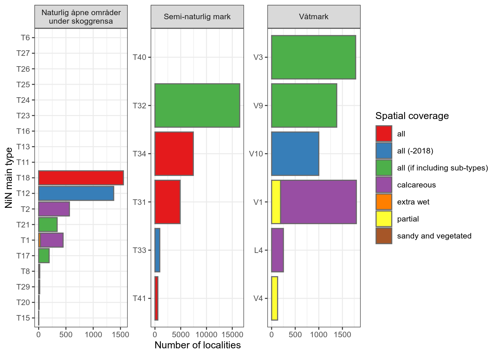
<p class="caption">(\#fig:unnamed-chunk-76)Barplot showing the proportion area for which each NiN variable is recorded. The total mapped area for each main ecosystem (the facets) is shown as a dashed red line. The three most dominant NiN main types for each ecosystem is given a uniqe colour, and all the remaining are grouped as 'other'.</p>
</div>

This figure, in combination with the above, points to he most obvious NiN variable candidates. 

7SE and 7TK are good candidates for *Naturlig åpne områder*. 7JA-BT is probably more appropriately classed as a pressure indicator. Same with 7VR-RI with is recorded for all T18 localities. 

The same two variables (7SE and 7TK) are the best candidates also for *Semi-natural areas*. 7JB-BT is a pressure variable (*beitetrykk*). 7RA-SJ/BH are related to *gjengoing* which will be covered by another indicator informed from remote sensing (LiDAR), and we therefor don't need to describe this with a field-based indicator as well.

For *Våtmark*, 7GR-Gi is the most common variables, but this is a pressure variable (*grøfting*). But, perhaps it could be used as a surrogate indicator. I think this is justifiable, especially since the relationship between the pressure (grøfting) and the condition (hydrology) is so well known. 7SE+PRSL and 7TK+PRTK are other good candidates. PRTO is only relevant for V3, but covers a relatively large area. It is, however,, more like a pressure indicator.


## Tables
Here are some output tables with the numbers underlying the above figures. 


```r
DT::datatable(ntyp_fill2,
              #extensions = "FixedColumns",
  options = list(
    scrollX = T,
    scrollY=T,
    pageLength = 10))
```

<div class="figure">

```{=html}
<div class="datatables html-widget html-fill-item-overflow-hidden html-fill-item" id="htmlwidget-492c99a744bfaab31c67" style="width:100%;height:auto;"></div>
<script type="application/json" data-for="htmlwidget-492c99a744bfaab31c67">{"x":{"filter":"none","vertical":false,"data":[["1","2","3","4","5","6","7","8","9","10","11","12","13","14","15","16","17","18","19","20","21","22","23","24","25","26","27","28","29","30","31","32","33","34","35","36","37","38","39","40","41","42","43","44","45","46","47","48","49","50","51","52","53","54"],["Slåttemyr","Hagemark","Naturbeitemark","Semi-naturlig eng","Eng-aktig sterkt endret fastmark","Sørlig kaldkilde","Åpen flomfastmark","Høgereligende og nordlig nedbørsmyr","Øyblandingsmyr","Strandeng","Nakent tørkeutsatt kalkberg","Kystlynghei","Sørlig slåttemyr","Konsentrisk høymyr","Boreal hei","Semi-naturlig våteng","Slåttemark","Sanddynemark","Semi-naturlig strandeng","Rik åpen jordvannsmyr i mellomboreal sone","Sørlig nedbørsmyr","Atlantisk høymyr","Terrengdekkende myr","Åpen grunnlendt kalkrik mark i boreonemoral sone","Rik åpen sørlig jordvannsmyr","Aktiv skredmark","Semi-naturlig myr","Silt og leirskred","Eksentrisk høymyr","Øvre sandstrand uten pionervegetasjon","Kalkrik helofyttsump","Fuglefjell-eng og fugletopp","Isinnfrysingsmark","Åpen grunnlendt kalkrik mark i sørboreal sone","Sørlig etablert sanddynemark","Rik åpen jordvannsmyr i nordboreal og lavalpin sone","Fossepåvirket berg","Fosse-eng","Svært tørkeutsatt sørlig kalkberg","Lauveng","Kanthøymyr","Platåhøymyr","Palsmyr","Fosseberg",null,null,null,null,null,null,null,null,null,null],["2018, 2019, 2020, 2021, 2022","2018, 2019, 2020, 2021, 2022","2018, 2019, 2020, 2021, 2022","2018, 2019, 2020, 2021, 2022","2018, 2019, 2020, 2021, 2022","2018, 2019, 2020, 2021, 2022","2018, 2019, 2020, 2021, 2022","2019, 2020, 2021, 2022","2019, 2020, 2021, 2022","2018, 2019, 2020, 2021, 2022","2019, 2020, 2021, 2022","2018, 2019, 2020, 2021, 2022","2019, 2020, 2021, 2022","2019, 2020, 2022","2018, 2019, 2020, 2021, 2022","2018, 2019, 2020, 2021, 2022","2018, 2019, 2020, 2021, 2022","2018, 2019, 2020, 2021, 2022","2018, 2019, 2020, 2021, 2022","2019, 2020, 2021, 2022","2019, 2020, 2021, 2022","2019, 2020, 2021, 2022","2019, 2020, 2021, 2022","2018, 2019, 2020, 2021, 2022","2018, 2019, 2020, 2021, 2022","2019, 2020, 2021, 2022","2019, 2020, 2021, 2022","2019, 2020, 2021, 2022","2019, 2020, 2021, 2022","2019, 2020, 2021, 2022","2019, 2020, 2021, 2022","2019, 2020, 2021, 2022","2018, 2019, 2020, 2021, 2022","2019, 2020, 2021","2018, 2019, 2020, 2021, 2022","2019, 2020, 2021, 2022","2019, 2020, 2021, 2022","2019, 2020, 2022","2019, 2020, 2021, 2022","2019, 2020, 2022","2019, 2020, 2021, 2022","2019, 2020, 2021, 2022","2021, 2022","2021, 2022",null,null,null,null,null,null,null,null,null,null],["våtmark","semi-naturligMark","semi-naturligMark","semi-naturligMark","semi-naturligMark","våtmark","naturligÅpneOmråderUnderSkoggrensa","våtmark","våtmark","naturligÅpneOmråderUnderSkoggrensa","naturligÅpneOmråderUnderSkoggrensa","semi-naturligMark","våtmark","våtmark","semi-naturligMark","våtmark","semi-naturligMark","naturligÅpneOmråderUnderSkoggrensa","semi-naturligMark","våtmark","våtmark","våtmark","våtmark","naturligÅpneOmråderUnderSkoggrensa","våtmark","naturligÅpneOmråderUnderSkoggrensa","våtmark","naturligÅpneOmråderUnderSkoggrensa","våtmark","naturligÅpneOmråderUnderSkoggrensa","våtmark","naturligÅpneOmråderUnderSkoggrensa","naturligÅpneOmråderUnderSkoggrensa","naturligÅpneOmråderUnderSkoggrensa","naturligÅpneOmråderUnderSkoggrensa","våtmark","naturligÅpneOmråderUnderSkoggrensa","naturligÅpneOmråderUnderSkoggrensa","naturligÅpneOmråderUnderSkoggrensa","semi-naturligMark","våtmark","våtmark","våtmark","naturligÅpneOmråderUnderSkoggrensa","naturligÅpneOmråderUnderSkoggrensa","naturligÅpneOmråderUnderSkoggrensa","naturligÅpneOmråderUnderSkoggrensa","naturligÅpneOmråderUnderSkoggrensa","naturligÅpneOmråderUnderSkoggrensa","naturligÅpneOmråderUnderSkoggrensa","naturligÅpneOmråderUnderSkoggrensa","naturligÅpneOmråderUnderSkoggrensa","naturligÅpneOmråderUnderSkoggrensa","semi-naturligMark"],["V9","T32","T32","T32","T41","V4","T18","V3","V1","T12","T1","T34","V9","V3","T31","V10","T32","T21","T33","V1","V3","V3","V3","T2","V1","T17","V9","T17","V3","T29","L4","T8","T20","T2","T21","V1","T1","T15","T1","T32","V3","V3","V3","T1","T6","T11","T13","T16","T23","T24","T25","T26","T27","T40"],["all (if including sub-types)","all (if including sub-types)","all (if including sub-types)","all (if including sub-types)","all","southern","all","all (if including sub-types)","partial","all (-2018)","calcareous and dry","all","all (if including sub-types)","all (if including sub-types)","all","all (-2018)","all (if including sub-types)","all (if including sub-types)","all (-2018)","calcareous","all (if including sub-types)","all (if including sub-types)","all (if including sub-types)","calcareous","calcareous","all (if including sub-types)","all (if including sub-types)","all (if including sub-types)","all (if including sub-types)","sandy and vegetated","calcareous","all","all","calcareous","all (if including sub-types)","calcareous","extra wet","all","calcareous and dry","all (if including sub-types)","all (if including sub-types)","all (if including sub-types)","all (if including sub-types)","extra wet","Not mapped","Not mapped","Not mapped","Not mapped","Not mapped","Not mapped","Not mapped","Not mapped","Not mapped","Not mapped"],[null,16.9,0,null,null,null,null,null,null,null,null,null,null,null,null,null,null,null,null,null,null,null,null,8.7,null,null,null,null,null,null,null,null,null,null,null,null,null,null,null,null,null,null,null,null,null,null,null,null,null,null,null,null,null,null],[null,82.9,null,null,null,null,null,null,null,null,null,null,null,null,null,null,null,null,null,null,null,null,null,null,null,null,null,null,null,null,null,null,null,null,null,null,null,null,null,100,null,null,null,null,null,null,null,null,null,null,null,null,null,null],[100,null,null,null,null,null,null,null,null,null,null,null,100,null,null,null,null,null,null,null,null,null,null,null,null,null,100,null,null,null,null,null,null,null,null,null,null,null,null,null,null,null,null,null,null,null,null,null,null,null,null,null,null,null],[100,null,null,null,null,null,null,null,null,null,null,null,100,null,null,null,null,null,null,null,null,null,null,99.6,null,null,100,null,null,null,100,null,null,100,null,null,null,null,null,null,null,null,null,null,null,null,null,null,null,null,null,null,null,null],[null,16.9,0,null,null,null,null,null,null,null,null,null,null,null,null,null,null,null,null,null,null,null,null,null,null,null,null,null,null,null,null,null,null,null,null,null,null,null,null,null,null,null,null,null,null,null,null,null,null,null,null,null,null,null],[null,null,null,null,null,null,null,null,null,null,null,null,null,null,null,null,null,null,null,null,null,null,null,null,null,null,null,null,null,null,null,null,null,null,null,null,null,null,null,null,null,null,null,null,null,null,null,null,null,null,null,null,null,null],[57.6,null,null,null,null,null,null,null,null,null,null,null,39.6,null,null,null,null,null,null,null,null,null,null,null,null,null,44.4,null,null,null,null,null,null,null,null,null,null,null,null,null,null,null,null,null,null,null,null,null,null,null,null,null,null,null],[null,null,null,null,null,null,null,null,null,null,null,null,null,null,null,null,null,null,null,null,null,null,null,null,null,null,null,null,null,null,null,null,null,null,null,null,null,null,null,null,null,null,null,null,null,null,null,null,null,null,null,null,null,null],[5.5,99.9,99.9,99.9,100,null,70.7,null,null,99.9,100,99.9,null,null,100,99.8,99.8,100,99.1,100,null,null,null,99.8,100,null,null,null,null,100,100,null,null,100,100,100,null,null,100,100,null,null,null,null,null,null,null,null,null,null,null,null,null,null],[99.6,null,null,null,null,98.5,null,99.8,100,null,null,null,100,100,null,null,null,null,null,100,100,100,100,null,100,null,100,null,100,null,100,null,null,null,null,null,null,null,null,null,100,100,100,null,null,null,null,null,null,null,null,null,null,null],[null,100,100,99.9,99.9,null,null,null,null,1.9,null,null,null,null,null,100,99.9,null,98.9,null,null,null,null,null,null,null,null,null,null,null,null,null,null,null,null,null,null,null,null,100,null,null,null,null,null,null,null,null,null,null,null,null,null,null],[null,null,null,null,null,null,88.2,null,null,null,null,100,null,null,100,null,null,99.2,null,null,null,null,null,null,null,null,null,null,null,100,null,100,null,null,100,null,null,100,null,null,null,null,null,null,null,null,null,null,null,null,null,null,null,null],[null,99.8,99.7,99.4,99.4,null,null,null,null,null,null,null,null,null,null,99.7,98.8,99.2,null,null,null,null,null,null,null,null,null,null,null,100,null,null,null,null,100,null,null,null,null,100,null,null,null,null,null,null,null,null,null,null,null,null,null,null],[null,null,null,null,null,null,null,null,null,null,null,0,null,null,100,null,null,null,null,null,null,null,null,null,null,null,null,null,null,null,null,null,null,null,null,null,null,null,null,null,null,null,null,null,null,null,null,null,null,null,null,null,null,null],[null,99.9,100,99.9,99.4,null,null,null,null,1.4,null,100,null,null,null,100,99.9,null,98.8,null,null,null,null,null,null,null,null,null,null,null,null,null,null,null,null,null,null,null,null,100,null,null,null,null,null,null,null,null,null,null,null,null,null,null],[5.5,null,null,null,99.6,9.1,88.4,99.8,100,99.9,100,41.5,null,100,23.6,null,null,100,13.6,100,100,100,100,99.6,100,null,null,null,100,100,null,100,93.3,100,100,100,100,100,100,null,100,100,100,null,null,null,null,null,null,null,null,null,null,null],[null,null,null,null,null,null,null,null,null,null,null,null,null,null,null,null,null,null,null,null,null,null,null,null,null,null,null,null,null,null,null,null,null,null,null,null,null,null,null,null,null,null,null,null,null,null,null,null,null,null,null,null,null,null],[99.9,null,null,null,null,null,88.3,null,null,99.9,100,58,100,null,76.3,null,null,100,null,null,null,null,null,99.6,100,100,100,100,null,100,100,null,93.3,100,100,100,null,100,null,null,null,null,null,null,null,null,null,null,null,null,null,null,null,null],[null,null,null,null,null,null,null,null,null,null,null,null,null,null,null,null,null,null,null,null,null,null,null,null,null,null,null,null,null,null,null,null,null,null,null,null,null,null,null,null,null,null,null,null,null,null,null,null,null,null,null,null,null,null],[null,null,null,null,null,null,93.8,null,null,null,null,null,null,null,null,null,null,null,null,null,null,null,null,null,null,null,null,null,null,null,null,null,null,null,null,null,100,100,null,null,null,null,null,100,null,null,null,null,null,null,null,null,null,null],[null,null,null,null,null,null,null,null,null,null,null,null,null,null,null,null,null,null,null,null,null,null,null,null,null,null,null,null,null,null,null,null,null,null,null,null,null,null,null,100,null,null,null,null,null,null,null,null,null,null,null,null,null,null],[94.5,null,null,null,null,90.9,null,null,null,null,null,null,100,null,null,null,null,null,85.6,null,null,null,null,null,null,null,100,null,null,null,100,null,null,null,null,null,null,null,null,null,null,null,null,null,null,null,null,null,null,null,null,null,null,null],[null,null,null,null,null,null,null,99.8,100,null,null,null,null,100,null,null,null,null,null,100,100,100,100,null,null,null,null,null,100,null,null,null,null,null,null,null,null,null,null,null,100,100,100,null,null,null,null,null,null,null,null,null,null,null],[null,null,null,null,null,null,null,99.8,null,null,null,null,null,100,null,null,null,null,null,null,100,100,100,null,null,null,null,null,100,null,null,null,null,null,null,null,null,null,null,null,100,100,null,null,null,null,null,null,null,null,null,null,null,null],[10.8599681769678,17.2892756436555,125.395454959427,29.5273133834903,1.30060426791085,0.054693214794524,11.2210640471648,17.0161039645494,4.47342889033033,5.31240419413453,0.153160113321643,530.333666293998,0.859130020342248,0.409299904933389,368.076228072285,5.70309815289171,8.08730162096645,2.12492117847008,3.74860715696163,9.30242158937103,15.8891449971379,3.71004777569769,21.1853317928982,0.711262375853877,0.232630287231787,0.429869567548852,8.82716234570841,0.0281316995894742,5.54454125198943,0.173325803167218,2.12141082941421,0.256328309129139,0.0229694300823598,0.156271240033641,0.391864908667946,0.00540369751175468,0.0691880614123939,0.00615737757466229,0.105362181789421,0.0291096401727506,0.396661041366587,3.97834096015764,1.31405172299685,0.00941745752789786,0,0,0,0,0,0,0,0,0,0],[750,2057,11548,4051,684,132,1777,518,213,1812,50,8110,134,13,6719,1134,1869,364,1092,1169,953,92,451,469,60,172,792,49,117,25,302,21,15,124,73,3,32,5,91,12,32,88,39,14,null,null,null,null,null,null,null,null,null,null]],"container":"<table class=\"display\">\n  <thead>\n    <tr>\n      <th> <\/th>\n      <th>Nature_type<\/th>\n      <th>Year<\/th>\n      <th>Ecosystem<\/th>\n      <th>NiN_mainType<\/th>\n      <th>NiN_mainTypeCoverage<\/th>\n      <th>1AG-A-0<\/th>\n      <th>1AG-A-E<\/th>\n      <th>1AG-A-G<\/th>\n      <th>1AG-B<\/th>\n      <th>1AG-C<\/th>\n      <th>1AR-A-E<\/th>\n      <th>1AR-C-L<\/th>\n      <th>4TS-TS<\/th>\n      <th>7FA<\/th>\n      <th>7GR-GI<\/th>\n      <th>7JB-BA<\/th>\n      <th>7JB-BT<\/th>\n      <th>7JB-GJ<\/th>\n      <th>7RA-BH<\/th>\n      <th>7RA-SJ<\/th>\n      <th>7SE<\/th>\n      <th>7SN-BE<\/th>\n      <th>7TK<\/th>\n      <th>7VR-RE<\/th>\n      <th>7VR-RI<\/th>\n      <th>PRHT<\/th>\n      <th>PRSL<\/th>\n      <th>PRTK<\/th>\n      <th>PRTO<\/th>\n      <th>km2<\/th>\n      <th>numberOfLocalities<\/th>\n    <\/tr>\n  <\/thead>\n<\/table>","options":{"scrollX":true,"scrollY":true,"pageLength":10,"columnDefs":[{"className":"dt-right","targets":[6,7,8,9,10,11,12,13,14,15,16,17,18,19,20,21,22,23,24,25,26,27,28,29,30,31]},{"orderable":false,"targets":0}],"order":[],"autoWidth":false,"orderClasses":false}},"evals":[],"jsHooks":[]}</script>
```

<p class="caption">(\#fig:unnamed-chunk-77)List of 45 nature types additionam data, including the proportion of localities for which there is data for each of the NiN variables.</p>
</div>


```r
DT::datatable(
  ntyp_fill2 %>%
  pivot_longer(cols = unique(ntyp_vars$NiN_variable_code)) %>%
  drop_na(value) %>%
  rename(NiN_code = name,
         useFrequency = value) %>%
  filter(useFrequency > 0) %>%
  group_by(NiN_code, Ecosystem, NiN_mainType) %>%  # NiN main type could be replaced with Nature_type
  summarise(km2 = sum(km2)),
  options = list(
    scrollX = T,
    scrollY=T,
    pageLength = 10))
#> `summarise()` has grouped output by 'NiN_code',
#> 'Ecosystem'. You can override using the `.groups` argument.
```

<div class="figure">

```{=html}
<div class="datatables html-widget html-fill-item-overflow-hidden html-fill-item" id="htmlwidget-31b440fcdad4d740cc91" style="width:100%;height:auto;"></div>
<script type="application/json" data-for="htmlwidget-31b440fcdad4d740cc91">{"x":{"filter":"none","vertical":false,"data":[["1","2","3","4","5","6","7","8","9","10","11","12","13","14","15","16","17","18","19","20","21","22","23","24","25","26","27","28","29","30","31","32","33","34","35","36","37","38","39","40","41","42","43","44","45","46","47","48","49","50","51","52","53","54","55","56","57","58","59","60","61","62","63","64","65","66","67","68","69","70","71","72","73","74","75","76","77","78","79","80","81","82","83","84","85","86","87","88","89","90","91","92","93","94","95"],["1AG-A-0","1AG-A-0","1AG-A-E","1AG-A-G","1AG-B","1AG-B","1AG-B","1AG-C","1AR-C-L","7FA","7FA","7FA","7FA","7FA","7FA","7FA","7FA","7FA","7FA","7FA","7FA","7FA","7FA","7FA","7GR-GI","7GR-GI","7GR-GI","7GR-GI","7GR-GI","7JB-BA","7JB-BA","7JB-BA","7JB-BA","7JB-BA","7JB-BT","7JB-BT","7JB-BT","7JB-BT","7JB-BT","7JB-BT","7JB-BT","7JB-GJ","7JB-GJ","7JB-GJ","7JB-GJ","7JB-GJ","7RA-BH","7RA-SJ","7RA-SJ","7RA-SJ","7RA-SJ","7RA-SJ","7RA-SJ","7SE","7SE","7SE","7SE","7SE","7SE","7SE","7SE","7SE","7SE","7SE","7SE","7SE","7SE","7SE","7SE","7SE","7TK","7TK","7TK","7TK","7TK","7TK","7TK","7TK","7TK","7TK","7TK","7TK","7TK","7TK","7VR-RI","7VR-RI","7VR-RI","PRHT","PRSL","PRSL","PRSL","PRSL","PRTK","PRTK","PRTO"],["naturligÅpneOmråderUnderSkoggrensa","semi-naturligMark","semi-naturligMark","våtmark","naturligÅpneOmråderUnderSkoggrensa","våtmark","våtmark","semi-naturligMark","våtmark","naturligÅpneOmråderUnderSkoggrensa","naturligÅpneOmråderUnderSkoggrensa","naturligÅpneOmråderUnderSkoggrensa","naturligÅpneOmråderUnderSkoggrensa","naturligÅpneOmråderUnderSkoggrensa","naturligÅpneOmråderUnderSkoggrensa","semi-naturligMark","semi-naturligMark","semi-naturligMark","semi-naturligMark","semi-naturligMark","våtmark","våtmark","våtmark","våtmark","våtmark","våtmark","våtmark","våtmark","våtmark","naturligÅpneOmråderUnderSkoggrensa","semi-naturligMark","semi-naturligMark","semi-naturligMark","våtmark","naturligÅpneOmråderUnderSkoggrensa","naturligÅpneOmråderUnderSkoggrensa","naturligÅpneOmråderUnderSkoggrensa","naturligÅpneOmråderUnderSkoggrensa","naturligÅpneOmråderUnderSkoggrensa","semi-naturligMark","semi-naturligMark","naturligÅpneOmråderUnderSkoggrensa","naturligÅpneOmråderUnderSkoggrensa","semi-naturligMark","semi-naturligMark","våtmark","semi-naturligMark","naturligÅpneOmråderUnderSkoggrensa","semi-naturligMark","semi-naturligMark","semi-naturligMark","semi-naturligMark","våtmark","naturligÅpneOmråderUnderSkoggrensa","naturligÅpneOmråderUnderSkoggrensa","naturligÅpneOmråderUnderSkoggrensa","naturligÅpneOmråderUnderSkoggrensa","naturligÅpneOmråderUnderSkoggrensa","naturligÅpneOmråderUnderSkoggrensa","naturligÅpneOmråderUnderSkoggrensa","naturligÅpneOmråderUnderSkoggrensa","naturligÅpneOmråderUnderSkoggrensa","semi-naturligMark","semi-naturligMark","semi-naturligMark","semi-naturligMark","våtmark","våtmark","våtmark","våtmark","naturligÅpneOmråderUnderSkoggrensa","naturligÅpneOmråderUnderSkoggrensa","naturligÅpneOmråderUnderSkoggrensa","naturligÅpneOmråderUnderSkoggrensa","naturligÅpneOmråderUnderSkoggrensa","naturligÅpneOmråderUnderSkoggrensa","naturligÅpneOmråderUnderSkoggrensa","naturligÅpneOmråderUnderSkoggrensa","naturligÅpneOmråderUnderSkoggrensa","semi-naturligMark","semi-naturligMark","våtmark","våtmark","våtmark","naturligÅpneOmråderUnderSkoggrensa","naturligÅpneOmråderUnderSkoggrensa","naturligÅpneOmråderUnderSkoggrensa","semi-naturligMark","semi-naturligMark","våtmark","våtmark","våtmark","våtmark","våtmark","våtmark"],["T2","T32","T32","V9","T2","L4","V9","T32","V9","T1","T12","T18","T2","T21","T29","T31","T32","T33","T34","T41","L4","V1","V10","V9","L4","V1","V3","V4","V9","T12","T32","T33","T41","V10","T15","T18","T21","T29","T8","T31","T34","T21","T29","T32","T41","V10","T31","T12","T32","T33","T34","T41","V10","T1","T12","T15","T18","T2","T20","T21","T29","T8","T31","T33","T34","T41","V1","V3","V4","V9","T1","T12","T15","T17","T18","T2","T20","T21","T29","T31","T34","L4","V1","V9","T1","T15","T18","T32","T33","L4","V4","V9","V1","V3","V3"],[0.711262375853877,17.2892756436555,17.3183852838282,20.5462605430184,0.867533615887518,2.12141082941421,20.5462605430184,17.2892756436555,20.5462605430184,0.258522295111064,5.31240419413453,11.2210640471648,0.867533615887518,2.51678608713803,0.173325803167218,368.076228072285,180.328455247712,3.74860715696163,530.333666293998,1.30060426791085,2.12141082941421,9.54045557411458,5.70309815289171,10.8599681769678,2.12141082941421,14.0084807669331,69.4435234117271,0.054693214794524,20.5462605430184,5.31240419413453,180.328455247712,3.74860715696163,1.30060426791085,5.70309815289171,0.00615737757466229,11.2210640471648,2.51678608713803,0.173325803167218,0.256328309129139,368.076228072285,530.333666293998,2.51678608713803,0.173325803167218,180.328455247712,1.30060426791085,5.70309815289171,368.076228072285,5.31240419413453,180.328455247712,3.74860715696163,530.333666293998,1.30060426791085,5.70309815289171,0.327710356523457,5.31240419413453,0.00615737757466229,11.2210640471648,0.867533615887518,0.0229694300823598,2.51678608713803,0.173325803167218,0.256328309129139,368.076228072285,3.74860715696163,530.333666293998,1.30060426791085,14.0138844644449,69.4435234117271,0.054693214794524,10.8599681769678,0.153160113321643,5.31240419413453,0.00615737757466229,0.458001267138326,11.2210640471648,0.867533615887518,0.0229694300823598,2.51678608713803,0.173325803167218,368.076228072285,530.333666293998,2.12141082941421,0.238033984743542,20.5462605430184,0.0786055189402917,0.00615737757466229,11.2210640471648,0.0291096401727506,3.74860715696163,2.12141082941421,0.054693214794524,20.5462605430184,13.7758504797014,69.4435234117271,68.1294716887303]],"container":"<table class=\"display\">\n  <thead>\n    <tr>\n      <th> <\/th>\n      <th>NiN_code<\/th>\n      <th>Ecosystem<\/th>\n      <th>NiN_mainType<\/th>\n      <th>km2<\/th>\n    <\/tr>\n  <\/thead>\n<\/table>","options":{"scrollX":true,"scrollY":true,"pageLength":10,"columnDefs":[{"className":"dt-right","targets":4},{"orderable":false,"targets":0}],"order":[],"autoWidth":false,"orderClasses":false}},"evals":[],"jsHooks":[]}</script>
```

<p class="caption">(\#fig:unnamed-chunk-78)List of unique combinatios of NiN variable codes and naturetypes with the summed area for which we have this data.</p>
</div>

## Export data {#exp-natureType-summary}
Exporting the table with the summary statistics and other information that I compiled for each nature type in the three main ecosystems. This can be merged with the main data set in order to subset according to a specific research question. 


```r
saveRDS(ntyp_fill2, "data/naturetypes/natureType_summary.rds")
```


Note also that the main data set still contains some localities where there is a mis-match between the nature type definition and the NiN mapping uits recorded in the field. Each researcher should decide to include or exclude these. 

The main data set also includes mosaic localities, that are less suitable to use as ground truth data for remote sensing methods.


## Appendix 1
Here is a deeper look into the causes for why some localities are recorded with seemingly erroneous NiN mapping units (and hence NiN main types)

Lets have a look at how the NiN main types (recorded in the field) cover the different *hovedøkosystem* when we exclude *Hule eiker* and all localities that have more than one NiN main type.

```r
dat_red <- dat_melt[dat_melt$n_ninKartleggingsenheter==1 & 
                      dat_melt$naturtype != "Hule eiker" &
                      dat_melt$mosaikk == "nei",]
```


Let's focus in on our three targeted ecosystems.

```r
dat_red_tally <- stats::aggregate(data = dat_red,
                                  area~hovedøkosystem+ninKartleggingsenheter3, FUN = length)
names(dat_red_tally)[3] <- "count"
```


```r
ggplot(dat_red_tally[dat_red_tally$hovedøkosystem %in% target,],
       aes(x = ninKartleggingsenheter3,
               y = count))+
  geom_bar(
           fill="grey",
           colour="black",
           stat="identity")+
  coord_flip()+
  theme_bw(base_size = 12)+
  labs(y = "Number of localities",
       x = "NiN main types")+
  scale_y_continuous(position = "left",
                   expand = expansion(mult=c(.0,.3)))+
  geom_text(aes(label=count), hjust=-0.25)+
    facet_wrap("hovedøkosystem",
             scales = "free",
             ncol = 3)
```

<div class="figure">
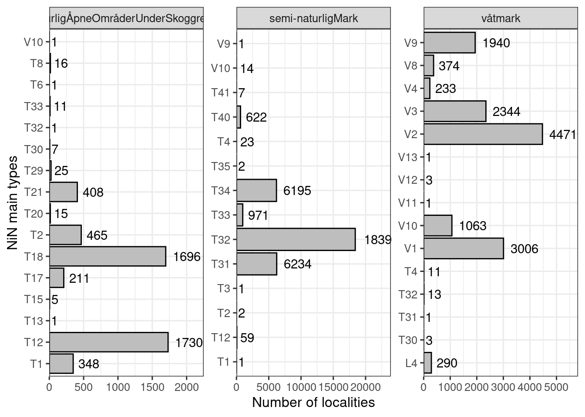
<p class="caption">(\#fig:unnamed-chunk-82)Number of localities for each combination of main ecosystem and NiN main type</p>
</div>

Still some weird cases which I will look at in turn below, trying to understand how they came to be recorded in this way.

#### naturligÅpneOmråderUnderSkoggrensa
Listing the NiN main types recorded for nature types belonging to *naturligÅpneOmråderUnderSkoggrensa*, but which clearly don't belong there:

* V10 (semi-naturlig våteng)
    + One case of Åpen flomfastmark wrongly associated with V10 whan it should be T18.
* T33 (Semi naturlig strandeng)
    + These are cases where either the `naturtype` should have been `semi-naturlig strandeng` (and hence the hovedøkosystem would be Semi-nat), or the `naturtype` is correctly recorded as `Strandeng` but then the NiN type should be `T12`.
* T32 (Semi-naturlig eng)
    + Obvious error
* T30 (Flomskogsmark)
    + Obvious error

Listing the remaining NiN main types:
* T8 (fulglefjelleng og fugltopp)
* T6 (Standberg)
* T29 (Grus og steindominert strand og strandlinje)
* T21 (Sanddynemark)
* T20 (Isinnfrysingsmark)
* T2 (Åpen grunlendt mark)
* T18 (Åpne flomfastmark)
* T17 (Aktiv skredmark)
* T15 (Fosse-eng)
* T13 (Rasmark)
* T12 (Strandeng)
* T1 (Nakent berg)


```r
`%!in%` <- Negate(`%in%`)
dat_red2 <- dat_red[
  dat_red$hovedøkosystem!="naturligÅpneOmråderUnderSkoggrensa" |
  dat_red$hovedøkosystem=="naturligÅpneOmråderUnderSkoggrensa" & 
    dat_red$ninKartleggingsenheter3 %!in% c("T30", "T32", "T33", "V10"),]
```

This resulted in deleting 20m localities.

#### Semi-naturlig mark
Listing the NiN main types recorded for nature types belonging to *Semi-naturlig mark*, but which clearly don't belong there:

* V9 (Semi-naturlig myr)
   + Kystlynghei recorded as mire
* T4 (Fastmarksskogsmark)
   + These should all be T32 (naturbeitemark, lauveng, hagemark, +++)
* T35 (Sterkt endret fastmark med løsmassedekke)
   + Wrong NiN type given to eng-aktig sterkt endret fastmark (it should be T40)
* T3 (Fjellhei, leside og tundra)
   + Boreal hei (should've been T31)
* T12 (Strandeng)
   + Should probably have been T33
* T1 (Nakent berg)
   + Obvious mistake
  
Listing the remaining NiN-main types:
* V10 (semi-nat våteng)
* T41 (Oppdyrket mark med preg av semi-naturlig eng)
* T40 (Sterkt endret fastmark med preg av semi-naturlig eng)
* T31-34

  


```r
dat_red3 <- dat_red2[
  dat_red2$hovedøkosystem!="semi-naturligMark" |
  dat_red2$hovedøkosystem=="semi-naturligMark" & dat_red2$ninKartleggingsenheter3 %!in% c("V9", "T4", "T35", "T3", "T12", "T1"),]
```

This resulted in the deletion of 87 localities.

#### Våtmark
Listing the NiN main types recorded for nature types belonging to *Våtmark*, but which clearly don't belong there.

Våtmark doesn't distinguish between semi-natural and natural, so all V-types are correct, except the strongly modified V11-V13.

* V11 (Torvtak)
  + Obvious mistake
* V12 (Grøftet åpne torvmark)
  + Obvious mistake
* V13 (Ny våtmark)
  + Obvious mistake
* T4 (skog)
  +   some that should've been T2 and some other strange things
* T30-T32
  + Someone switching the semi-natural and natural equivalents


```r
dat_red4 <- dat_red3[
  dat_red3$hovedøkosystem!="våtmark" |
  dat_red3$hovedøkosystem=="våtmark" & dat_red3$ninKartleggingsenheter3 %!in% c("T4", "T30", "T31", "T32", "V11", "V12", "V13"),]
```
This resulted in the deletion of 33 localities.

In total 140 localities, or 0.2% of localities, have a field-recorded NiN main that don't match the definition of the nature type. I see this as a symptom of a bigger problem with data validation.
