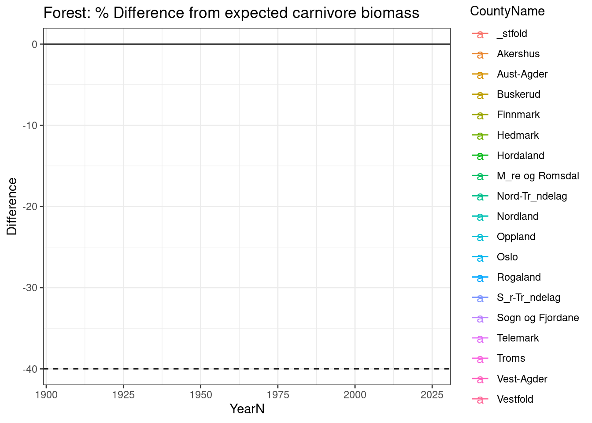
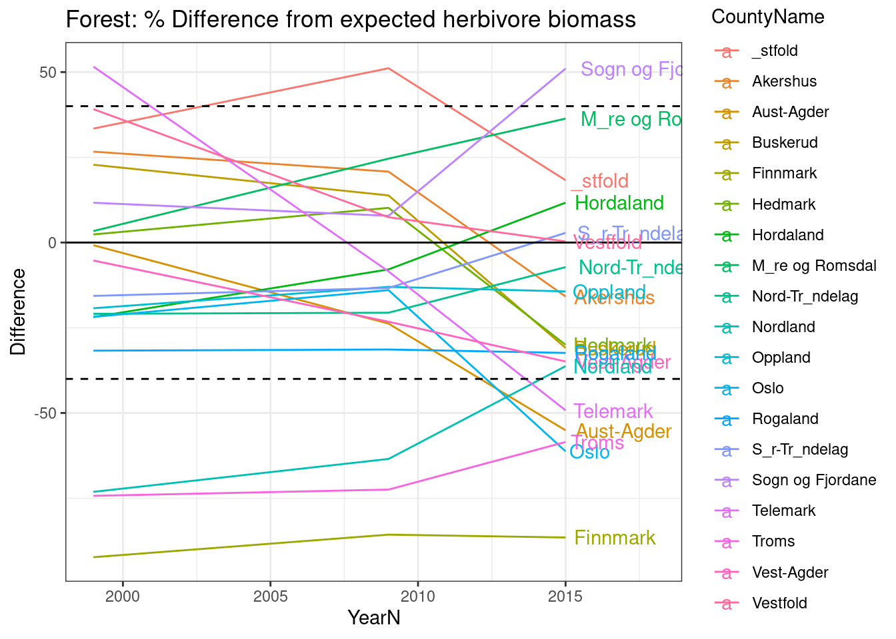

# Trophic level biomass ratios

<br />

_Author and date:_
James Speed

June 2023

<br />

<!-- Load all you dependencies here -->


<!-- Don't remove these three html lines -->
<br />
<br />
<hr />


<!-- Document you work below. Try not to change  the headers too much. Data can be stored on NINA server. Since the book is rendered on the R Server this works fine, but note that directory paths are different on the server compared to you local machine. If it is not too big you may store under /data/ on this repository -->

## Introduction

Here we will develop indicators of ecological condition for Norway, based on the distribution of biomass between trophic levels - specifically between vegetation and vertebrate consumers. This includes three trophic levels, plants, herbivores and carnivores. Indicators of trophic interactions are based on deviation between the observed biomass at each consumer trophic level from the expected biomass based on the biomass at the prey trophic level. The expected biomass estimates are derived from global relationships between plants and vertebrate herbivores ([Fløjgaard et al. 2022](https://doi.org/10.1111/1365-2664.14047)) and between vertebrate prey and predators ([Hatton et al 2015](https://www.science.org/doi/pdf/10.1126/science.aac6284?casa_token=mM3vaCIMkpAAAAAA:bo4aODtkJORM0kIeFfezII4T_0wo7Y7X8ktWxI6vHN64sGmMw9Xi9xCc_g33c437swJaeTeiEE_N))

As the plant biomass level we use Net Primary Productivity. MODIS NPP was selected since it provides the highest temporal extent of available data sources (1999 to present). Spatial resolution is low relative to other remote sensing sources, however, the spatial resolution is still far higher than the consumer data, so the temporal extent was prioritised.

The herbivore data is an extension of the data presented in Austrheim et al. 2008 <https://onlinelibrary.wiley.com/doi/pdf/10.2981/10-038> and Speed et al. 2015 <https://journals.plos.org/plosone/article?id=10.1371/journal.pone.0217166>. For the development of the trophic interaction indicators the same methods were applied to herbivore data going back to 1907 (contra 1949 in the two studies above). This data was extracted by Gunnar Austrheim (livestock) and Erling J. Solberg (wild cervids). In each dataset, the metabolic biomass and the raw biomass of a given species is provided for each year and municipality. The 2007 municipalities were used. The data were rasterized to the same grid as the NPP data.

Metabolic biomass measures were used in the previous studies on Norwegian herbivores cited above. However, for consistency with the global studies used to find predicted biomass, we use raw (unscaled) biomass here.

Herbivore species are wild herbivores: moose/elg, red deer/hjort, roe deer/rådyr, wild reindeer/villrein and livestock: cattle/storfe, sheep/sau, horses/hest, goats/geit and semi-domestic reindeer/tamrein

The carnivore data is taken from back-cast population modelling for the large carnivores in Norway (wolf/ulv, brown bear/bjørn, lynx/gaupe and wolverine/jerv). The data was based on hunting statistics, and was collated and modelled by Anna Sobocinski in a master thesis: <https://ntnuopen.ntnu.no/ntnu-xmlui/handle/11250/3047580> The thesis also presented metabolic biomass, but we use raw biomass to make the indicators. This data was also rasterized.

We calculate indicators (1) across all ecosystems and the total consumer communities (all localities and all herbivores and all carnivores) and (2) specific indicators for each main ecosystem type

## Part 1: Total communities

We start by calculation biomass ratios across all herbivores and carnivores, with no regard to the ecosystem type.


```r
#NPP
#Read in
npprast<-rast(paste0(pData,"/Trophic_levels/NPP.tiff"))
viltrast<-rast(paste0(pData,"/Trophic_levels/Vilt_RawBiomass.tiff"))
livestockrast<-rast(paste0(pData,"/Trophic_levels/Livestock_RawBiomass.tiff"))
carnivorerast<-rast(paste0(pData,"/Trophic_levels/Carnivores_RawBiomass.tiff"))

#Vector of years we work with
allyears_vect<-c(1907,1917,1929,1938,1949,1959,1969,1979,1989,1999,2009,2015)

#Livestock data from 1939 and vilt from 1938
names(livestockrast)<- sub(1939,1938,names(livestockrast))
names(livestockrast)
#>  [1] "RawBiomassDensity_sau_1907"    
#>  [2] "RawBiomassDensity_sau_1917"    
#>  [3] "RawBiomassDensity_sau_1929"    
#>  [4] "RawBiomassDensity_sau_1938"    
#>  [5] "RawBiomassDensity_sau_1949"    
#>  [6] "RawBiomassDensity_sau_1959"    
#>  [7] "RawBiomassDensity_sau_1969"    
#>  [8] "RawBiomassDensity_sau_1979"    
#>  [9] "RawBiomassDensity_sau_1989"    
#> [10] "RawBiomassDensity_sau_1999"    
#> [11] "RawBiomassDensity_sau_2009"    
#> [12] "RawBiomassDensity_sau_2015"    
#> [13] "RawBiomassDensity_geit_1907"   
#> [14] "RawBiomassDensity_geit_1917"   
#> [15] "RawBiomassDensity_geit_1929"   
#> [16] "RawBiomassDensity_geit_1938"   
#> [17] "RawBiomassDensity_geit_1949"   
#> [18] "RawBiomassDensity_geit_1959"   
#> [19] "RawBiomassDensity_geit_1969"   
#> [20] "RawBiomassDensity_geit_1979"   
#> [21] "RawBiomassDensity_geit_1989"   
#> [22] "RawBiomassDensity_geit_1999"   
#> [23] "RawBiomassDensity_geit_2009"   
#> [24] "RawBiomassDensity_geit_2015"   
#> [25] "RawBiomassDensity_storf_1907"  
#> [26] "RawBiomassDensity_storf_1917"  
#> [27] "RawBiomassDensity_storf_1929"  
#> [28] "RawBiomassDensity_storf_1938"  
#> [29] "RawBiomassDensity_storf_1949"  
#> [30] "RawBiomassDensity_storf_1959"  
#> [31] "RawBiomassDensity_storf_1969"  
#> [32] "RawBiomassDensity_storf_1979"  
#> [33] "RawBiomassDensity_storf_1989"  
#> [34] "RawBiomassDensity_storf_1999"  
#> [35] "RawBiomassDensity_storf_2009"  
#> [36] "RawBiomassDensity_storf_2015"  
#> [37] "RawBiomassDensity_hest_1907"   
#> [38] "RawBiomassDensity_hest_1917"   
#> [39] "RawBiomassDensity_hest_1929"   
#> [40] "RawBiomassDensity_hest_1938"   
#> [41] "RawBiomassDensity_hest_1949"   
#> [42] "RawBiomassDensity_hest_1959"   
#> [43] "RawBiomassDensity_hest_1969"   
#> [44] "RawBiomassDensity_hest_1979"   
#> [45] "RawBiomassDensity_hest_1989"   
#> [46] "RawBiomassDensity_hest_1999"   
#> [47] "RawBiomassDensity_hest_2009"   
#> [48] "RawBiomassDensity_hest_2015"   
#> [49] "RawBiomassDensity_tamrein_1907"
#> [50] "RawBiomassDensity_tamrein_1917"
#> [51] "RawBiomassDensity_tamrein_1929"
#> [52] "RawBiomassDensity_tamrein_1938"
#> [53] "RawBiomassDensity_tamrein_1949"
#> [54] "RawBiomassDensity_tamrein_1959"
#> [55] "RawBiomassDensity_tamrein_1969"
#> [56] "RawBiomassDensity_tamrein_1979"
#> [57] "RawBiomassDensity_tamrein_1989"
#> [58] "RawBiomassDensity_tamrein_1999"
#> [59] "RawBiomassDensity_tamrein_2009"
#> [60] "RawBiomassDensity_tamrein_2015"
#> [61] "Livestock_Raw_1907"            
#> [62] "Livestock_Raw_1917"            
#> [63] "Livestock_Raw_1929"            
#> [64] "Livestock_Raw_1938"            
#> [65] "Livestock_Raw_1949"            
#> [66] "Livestock_Raw_1959"            
#> [67] "Livestock_Raw_1969"            
#> [68] "Livestock_Raw_1979"            
#> [69] "Livestock_Raw_1989"            
#> [70] "Livestock_Raw_1999"            
#> [71] "Livestock_Raw_2009"            
#> [72] "Livestock_Raw_2015"            
#> [73] "TotalHerbivoreBiomass_Raw_1907"
#> [74] "TotalHerbivoreBiomass_Raw_1917"
#> [75] "TotalHerbivoreBiomass_Raw_1929"
#> [76] "TotalHerbivoreBiomass_Raw_1938"
#> [77] "TotalHerbivoreBiomass_Raw_1949"
#> [78] "TotalHerbivoreBiomass_Raw_1959"
#> [79] "TotalHerbivoreBiomass_Raw_1969"
#> [80] "TotalHerbivoreBiomass_Raw_1979"
#> [81] "TotalHerbivoreBiomass_Raw_1989"
#> [82] "TotalHerbivoreBiomass_Raw_1999"
#> [83] "TotalHerbivoreBiomass_Raw_2009"
#> [84] "TotalHerbivoreBiomass_Raw_2015"

#Norwegian counties to help plotting
norcounty_shp<-st_read(paste0(pData,"/Trophic_levels/"),"ViltdataCounty")
#> Reading layer `ViltdataCounty' from data source 
#>   `/data/P-Prosjekter2/41201785_okologisk_tilstand_2022_2023/data/Trophic_levels' 
#>   using driver `ESRI Shapefile'
#> Simple feature collection with 912 features and 8 fields
#> Geometry type: MULTIPOLYGON
#> Dimension:     XY
#> Bounding box:  xmin: -76208 ymin: 6450245 xmax: 1114929 ymax: 7939986
#> Projected CRS: ETRS89 / UTM zone 33N
#Simplify by county nr
norcounty<-norcounty_shp %>% 
  group_by(FylkeNr) %>%
  summarise(geometry = st_union(geometry)) 
```

Now we can plot the raw biomass data.

First NPP


```r
#Select relevant years for NPP
npprast_yrs<-npprast[[names(npprast)%in%c("NPP_2000","NPP_2009","NPP_2015")]]

ggplot()+geom_sf(data=norcounty,fill="white",lwd=0.1)+
         geom_spatraster(data=npprast_yrs)+facet_grid(~lyr)+
         scale_fill_continuous(low="lightgreen",high="darkgreen",na.value=NA,expression('kgC km'^-2~'year'^-1))+theme_bw()
#> SpatRaster resampled to ncells = 500703
```


Next total herbivore biomass


```r
#Total herbivore biomass
#For some reason need to read the raster in again
livestockrast<-rast(paste0(pData,"/Trophic_levels/Livestock_RawBiomass.tiff"))

totalherbivorebiomass<-livestockrast[[sapply(strsplit(names(livestockrast),"_"),'[',1) %in% "TotalHerbivoreBiomass"]]
names(totalherbivorebiomass)<-allyears_vect
totalherbivorebiomass
#> class       : SpatRaster 
#> dimensions  : 3378, 2701, 12  (nrow, ncol, nlyr)
#> resolution  : 440.9985, 441.0127  (x, y)
#> extent      : -76208, 1114929, 6450245, 7939986  (xmin, xmax, ymin, ymax)
#> coord. ref. : +proj=utm +zone=33 +ellps=GRS80 +units=m +no_defs 
#> source      : Livestock_RawBiomass.tiff 
#> names       :     1907,     1917,     1929,     1938,        1949,        1959, ... 
#> min values  :     0.00,     0.00,     0.00,     0.00,    36.40469,    37.53634, ... 
#> max values  : 24068.81, 32279.18, 33138.37, 36387.98, 15082.97559, 22528.81055, ...
ggplot()+geom_sf(data=norcounty,fill="white",lwd=0.1)+
  geom_spatraster(data=totalherbivorebiomass)+facet_wrap(~lyr)+
  scale_fill_continuous(trans='log10',low="lightskyblue",high="darkblue", na.value=NA,expression('Herbivore \nbiomass \nkg km'^-2 ))+theme_bw()
#> SpatRaster resampled to ncells = 500703
#> Warning: Transformation introduced infinite values in discrete
#> y-axis
```


And finally total carnivore biomass


```r
carnivorerast<-rast(paste0(pData,"/Trophic_levels/Carnivores_RawBiomass.tiff"))

totalcarnivores<-carnivorerast[[49:60]]

ggplot()+geom_sf(data=norcounty,fill="white",lwd=0.1)+
  geom_spatraster(data=totalcarnivores)+facet_wrap(~lyr)+
  scale_fill_continuous(low='white',high='red', na.value=NA, expression('Carnviore\nBiomass \nkg km'^-2 ))+theme_bw()
#> SpatRaster resampled to ncells = 500703
```


Now we use the NPP to estimate the expected herbivore biomass Fløjgaard et al. 2015 Figure 1/Table 1 Global relationship (mean NPP1km)


```r
# npprast<-rast("Vertebrates/data/TrophicBiomassData/NPP.tiff")
# npprast_yrs<-npprast[[names(npprast)%in%c("NPP_2000","NPP_2009","NPP_2015")]]

expected_herbivore_biomass<-(npprast_yrs^0.47 * 0.643)#Global 
ggplot()+geom_sf(data=norcounty,fill="white",lwd=0.1)+
  ggtitle("Expected herbivore biomass")+
  geom_spatraster(data=expected_herbivore_biomass)+facet_wrap(~lyr)+theme_bw()+
  scale_fill_continuous(low='lightskyblue',high="darkblue",na.value=NA,expression('kg km'^-2))
#> SpatRaster resampled to ncells = 500703
```


```r
#writeRaster(expected_herbivore_biomass,paste0(pData,"/Trophic_levels/expectedherbivorebiomass.tif"),overwrite=TRUE)
```

Now we can calculate the deviation between the observed herbivore biomass and the expected herbivore biomass. We calculate this as a % change.

100 x (ActualBiomass -- ExpectedBiomass)/(ExpectedBiomass +1)

To display this we truncated to 100%\|-100%

A value of 0 indicates that the locality has expected biomass. Value of 100 indicates that the locality has 100% (or more) higher biomass than expected Value of -100 indicates that the locality has 100% (or more) lower biomass than expected

«Good» condition assumed to be 0 to \|40%\|


```r
#expected_herbivore_biomass<-rast("Vertebrates/outputs/expectedbiomass/expectedherbivorebiomass.tif")
#livestockrast<-rast("Vertebrates/data/TrophicBiomassData/Livestock_RawBiomass.tiff")

totalherbivorebiomass<-livestockrast[[sapply(strsplit(names(livestockrast),"_"),'[',1) %in% "TotalHerbivoreBiomass"]]
names(totalherbivorebiomass)<-allyears_vect
totalherbivorebiomass_npp<-totalherbivorebiomass[[names(totalherbivorebiomass) %in% c("1999","2009","2015")]]
 
 diffherb<-100*(totalherbivorebiomass_npp-expected_herbivore_biomass)/(expected_herbivore_biomass+1)
 names(diffherb)<-c("2000",'2009','2015')
   
# #Plot on a diverging colour scale around 0
 ggplot()+geom_sf(data=norcounty,fill="white",lwd=0.1)+
   geom_spatraster(data=diffherb)+
   ggtitle("Difference from expected herbivore biomass")+
   scale_fill_distiller(type="div",limit=c(-100,100),oob=squish, na.value=NA,'% Difference from \nexpected biomass')+
   facet_wrap(~lyr)+theme_bw()
#> SpatRaster resampled to ncells = 500703
```


```r
 
#writeRaster(diffherb,paste0(pData,"/Trophic_levels/HerbivoreBiomassDiffExpected.tif"),overwrite=TRUE)
```

Above we see that on the West coast, Trøndelag, Oppland have double herbivore biomass than expected. There is more herbivore biomass than expected in parts of Finnmark, while Nordland and Lierne have lower herbivore biomass than expected based on NPP. Vestfold & Telemark (and parts of Viken) change from having more herbivore biomass than expected in 2000 to less than expected in 2015 (this is consistent with reduction in moose population in these regions)

-- Next we move on to estimate the expected carnivore biomass based on observed herbivore biomass and calculate the deviation as a % difference from expected as for the herbivores. This is based on Hatton et al. 2015 Figure 1 (predator prey biomass relationships)


```r
#livestockrast<-rast(paste0(pData,"/Trophic_levels/Livestock_RawBiomass.tiff"))

totalherbivorebiomass<-livestockrast[[sapply(strsplit(names(livestockrast),"_"),'[',1) %in% "TotalHerbivoreBiomass"]]
names(totalherbivorebiomass)<-allyears_vect
#carnivorerast<-rast(paste0(pData,"/Trophic_levels/Carnivores_RawBiomass.tiff"))
totalcarnivores<-carnivorerast[[49:60]]

#Expected carnivore biomass 
#Taken from Hatton et al. Figure 1
expected_carnivore_biomass<-(totalherbivorebiomass^0.73)*0.014#African carnivore and herbivore communities
ggplot()+geom_spatraster(data=expected_carnivore_biomass)+
  ggtitle("Expected carnivore biomass")+
  facet_wrap(~lyr)+theme_bw()+
  scale_fill_continuous(low='lightskyblue',high="darkblue",na.value=NA,expression('kg km'^-2),trans='log10')
#> SpatRaster resampled to ncells = 500703
#> Warning: Transformation introduced infinite values in discrete
#> y-axis
```


```r

diffcarn<-100* (totalcarnivores-expected_carnivore_biomass)/(expected_carnivore_biomass+1)
names(diffcarn)<-allyears_vect

ggplot()+geom_sf(data=norcounty,fill="white",lwd=0.1)+
  geom_spatraster(data=diffcarn)+
  ggtitle('Difference from expected carnivore biomass')+
  scale_fill_distiller(type="div",limit=c(-100,100),oob=squish,na.value=NA,"%difference from \nexpected biomass")+
  facet_wrap(~lyr)+theme_bw()
#> SpatRaster resampled to ncells = 500703
```


```r

#writeRaster(expected_carnivore_biomass,paste0(pData,"/Trophic_levels/expectedcarnivorebiomass.tif"),overwrite=TRUE)

#writeRaster(diffcarn,paste0(pData,"/Trophic_levels/CarnivoreBiomassDiffExpected.tif"),overwrite=TRUE)
```

From the above we see that Norway has had less carnivore biomass than expected based on the available herbivore biomass across the time period. Some counties and time periods (e.g. Hedmark today and Finnmark in 1907 had about the same carnivore biomass as predicted.

## Part 2 - Habitat specific biomass distributions

We now create biomass ratios for specific habitat types. To do this we need an ecosystem map and to place each consumer species within each habitat.

Indicators were not developed for mire ecosystems. This decision was taken in conversation with the mire ecosystem group, on the basis that herbivores have minimum use of the mrie ecosystems.

Table of the consumer species associated with each habitat.

| Ecosystem             | Livestock               | Wild herbivores   | Carnivores        |
|------------------|-------------------|------------------|------------------|
| Forest                | Storfe                  | Elg, rådyr, hjort | Ulv, gaupe, bjørn |
| Alpine                | Sau, tamrein, geit      | Villrein          | Jerv              |
| Semi-naturlig mark    | Sau, hest, geit, storfe | Hjort             | Gaupe, ulv        |
| Naturlig åpne områder | Sau, geit, storfe       | Hjort             | Gaupe, ulv        |
| Myr                   | \-\--                   | \-\--             | \-\--             |

Since a suitable ecosystem map is still under development, we use the AR50 land-cover map as a place-holding solution. AR50 does not give a good representation of naturlig åpen områder or semi-naturlig mark, so we demonstrate the habitat specific biomass distributions using the forest class in AR50 and the species outlined above.


```r
#Forest
#AR50 type raster
artype50<-rast("/data/R/GeoSpatialData/LandCover/Norway_LandResource_AR50/Processed/Raster/AR50_Norge.tif")

#artype50<-rast("Vertebrates/AR50/AR50_artype_25_ETRS_1989_UTM_Zone_33N.tif")

#Reclassify
artype50_F<-artype50
arTdf<-data.frame(id=c(10,20,30,50,60,70,81,82,128),label=c("BuiltUp","Pastures/Arable","Forest","Open","Mires","Ice","Freshwater","Sea","Unmapped"))
levels(artype50_F)<-arTdf

arcols<-c("black","orange","darkgreen","wheat","lightblue","white","blue","blue",NA)
ggplot()+geom_spatraster(data=artype50_F)+scale_fill_manual(values=arcols,na.value = NA)
#> SpatRaster resampled to ncells = 501014
```


```r


#Load biomass rasters
# npprast<-rast("Vertebrates/data/TrophicBiomassData/NPP.tiff")
# viltrast<-rast("Vertebrates/data/TrophicBiomassData/Vilt_RawBiomass.tiff")
# livestockrast<-rast("Vertebrates/data/TrophicBiomassData/Livestock_RawBiomass.tiff")
# carnivorerast<-rast("Vertebrates/data/TrophicBiomassData/Carnivores_RawBiomass.tiff")
# expected_herbivore_biomass<-rast("Vertebrates/outputs/expectedbiomass/expectedherbivorebiomass.tif")
# expected_carnivore_biomass<-rast("Vertebrates/outputs/expectedbiomass/expectedcarnivorebiomass.tif")

#Project the AR50 to the NPP rasters

### NEED TO CHECK IF THIS IS THE CORRECT LAYER OR GET THE CORRECT ONE FROM JAMES

artype50_FR<-project(resample(artype50_F,npprast,method='near'),npprast)

#Combine herbivores
allherbivores<-c(viltrast,livestockrast)

#Mask out forest from rasters
forest_expected_herbivore_biomass<-mask(expected_herbivore_biomass,artype50_FR,maskvalues=30,inverse=TRUE)
forest_herbivores<-mask(allherbivores,artype50_FR,maskvalues=30,inverse=TRUE)
forest_carnivores<-mask(carnivorerast,artype50_FR,maskvalues=30,inverse=TRUE)
forest_expected_carnivore_biomass<-mask(expected_carnivore_biomass,artype50_FR,maskvalues=30,inverse=TRUE)

#Sum up selected forest herbivore species
#Here we select the relevant herbivore species for the ecosystem type
allyears_vect<-c(1907,1917,1929,1938,1949,1959,1969,1979,1989,1999,2009,2015)

forest_herbivores_selectspp<-rast(forest_herbivores,nlyrs=12)
for(i in 1:length(allyears_vect)){
  print(i)
  forest_herbivores_selectspp[[i]]<-sum(forest_herbivores[[sapply(strsplit(names(forest_herbivores),"_"),'[',3)
                                                         %in% allyears_vect[i] &
                                      sapply(strsplit(names(forest_herbivores),"_"),'[',2)
                                                          %in% c("roe","hjort","elg","storf")]]
)
}
#> [1] 1
#> [1] 2
#> [1] 3
#> [1] 4
#> [1] 5
#> [1] 6
#> [1] 7
#> [1] 8
#> [1] 9
#> [1] 10
#> [1] 11
#> [1] 12
names(forest_herbivores_selectspp)<-allyears_vect
 
 #Sum up selected forest carnivore species
 #Here we select the relevant carnivore species for the habitat type
 forest_carnivores_selectspp<-rast(forest_carnivores,nlyrs=12)
 for(i in 1:length(allyears_vect)){
   print(i)
   forest_carnivores_selectspp[[i]]<-sum(forest_carnivores[[sapply(strsplit(names(forest_carnivores),"_"),'[',3) 
                                                            %in% allyears_vect[i] &
                                                              sapply(strsplit(names(forest_carnivores),"_"),'[',2)
                                                            %in% c("Wolf","Lynx","Bear")]]
   )
 }
#> [1] 1
#> [1] 2
#> [1] 3
#> [1] 4
#> [1] 5
#> [1] 6
#> [1] 7
#> [1] 8
#> [1] 9
#> [1] 10
#> [1] 11
#> [1] 12
 names(forest_carnivores_selectspp)<-allyears_vect
 
 
 #Difference in expected and actual biomass in forest
 forest_herbivores_selectspp_nppyrs<-forest_herbivores_selectspp[[names(forest_herbivores_selectspp)%in% c("1999","2009","2015")]]
 
forest_diffherb<-100*(forest_herbivores_selectspp_nppyrs - forest_expected_herbivore_biomass)/
 (forest_expected_herbivore_biomass+1)

#norcounty_shp<-st_read("Vertebrates/data/Processed/","ViltdataCounty")
 #Simplify by county nr
norcounty<-norcounty_shp %>% 
   group_by(FylkeNr) %>%
   summarise(geometry = st_union(geometry)) 
 
ggplot()+geom_sf(data=norcounty,fill="white",lwd=0.1)+
   geom_spatraster(data=forest_diffherb)+
   ggtitle("Difference in forest herbivores from expectation")+
   scale_fill_distiller(type="div",palette='RdYlBu',limit=c(-100,100),oob=squish,na.value=NA, "% difference from \nexpected biomass")+
   facet_wrap(~lyr)+theme_bw()
#> SpatRaster resampled to ncells = 500703
```


```r
 
 
forest_diffcarn<-100*(forest_carnivores_selectspp-forest_expected_carnivore_biomass)/
   (forest_expected_carnivore_biomass+1)
 
ggplot()+geom_sf(data=norcounty,fill="white",lwd=0.1)+
   geom_spatraster(data=forest_diffcarn)+
   ggtitle("Difference from expected carnivore biomass")+
   scale_fill_distiller(type="div",palette='RdYlBu',limit=c(-100,100),oob=squish,na.value=NA,"% difference from\nexpected biomass")+
   facet_wrap(~lyr)+theme_bw()
#> SpatRaster resampled to ncells = 500703
```


```r
 
 
 
# #Scaling as indicators
 
 ggplot()+geom_sf(data=norcounty,fill="white",lwd=0.1)+
   geom_spatraster(data=forest_diffherb)+
   ggtitle("Difference from expected herbivore biomass")+
  scale_fill_gradientn(colors= c("blue","yellow",'yellow' ,  "red"),
                       breaks=c(-100,-40,0,40,100),limits=c(-100,100),na.value=NA,"% difference from\nexpected biomass")+
   facet_wrap(~lyr)+theme_bw()
#> SpatRaster resampled to ncells = 500703
```


```r
 
 
 ggplot()+geom_sf(data=norcounty,fill="white",lwd=0.1)+
   geom_spatraster(data=forest_diffcarn)+
   ggtitle("Difference from expected carnivore biomass")+
   scale_fill_gradientn(colors= c("blue","yellow",'yellow' ,  "red"),
                     breaks=c(-100,-40,0,40,100),limits=c(-100,100),na.value=NA,"% difference from\nexpected biomass")+
   facet_wrap(~lyr)+theme_bw()
#> SpatRaster resampled to ncells = 500703
```


```r
 
 #writeRaster(forest_diffcarn,paste0(pData,"/Trophic_levels/forest_carnivores_diffexpected.tif"),overwrite=TRUE)
 #writeRaster(forest_diffherb,paste0(pData,"/Trophic_levels/forest_herbivores_diffexpected.tif"),overwrite=TRUE)
```

In the above maps, yellow indicates good condition (within 40% of expected biomass between 60% and 140% of expected biomass). Blue indicates poor condition, with \>40% less biomass than expected (i.e. \<60% of expected biomass), while red indicates poor conditions with \>40% biomass than expected (i.e. \>140% of expected biomass).

## Part 3 County averages over time

Finally we summarise the biomass deviations by county over time. 0% deviation represents reference condition. The lines at 40% and -40% show the limits for good condition.


```r
#forest_diffcarn<-rast("Vertebrates/outputs/forest_carnivores_diffexpected.tif")
#forest_diffherb<-rast("Vertebrates/outputs/forest_herbivores_diffexpected.tif")

#norcounty_shp<-st_read("Vertebrates/data/Processed/","ViltdataCounty")
 #Simplify by county nr
norcounty<-norcounty_shp %>% 
  group_by(FylkeNr) %>%
 summarise(geometry = st_union(geometry)) 

#County timegraphs
#Make spatVect 
norcounty$CountyName<-norcounty$FylkeNr
#Provide names (some issues with encoding...)
norcounty$CountyName<-c("_stfold","Akershus","Oslo","Hedmark","Oppland","Buskerud","Vestfold","Telemark","Aust-Agder","Vest-Agder","Rogaland","Hordaland","Sogn og Fjordane",
                        "M_re og Romsdal","S_r-Tr_ndelag","Nord-Tr_ndelag","Nordland","Troms","Finnmark")
norcounty_vect<-vect(norcounty)

forest_carn_herb_county<-terra::extract(forest_diffcarn,norcounty_vect,mean,na.rm=T)
forest_carn_herb_county$ID<-norcounty_vect$FylkeNr#Replace IDs with Fylke Nrs
forest_carn_herb_county$CountyName<-norcounty_vect$CountyName#Replace IDs with Fylke Nrs
forest_carn_herb_countyDF<-gather(forest_carn_herb_county,key="Year",value="Difference",-ID,-CountyName)
forest_carn_herb_countyDF$YearN<-as.numeric(substr(forest_carn_herb_countyDF$Year,2,5))
ggplot(data=forest_carn_herb_countyDF,aes(x=YearN,y=Difference,color=CountyName))+geom_line()+scale_color_discrete()+
  ggtitle("Forest: % Difference from expected carnivore biomass")+theme_bw()+xlim(c(1905,2025))+geom_hline(yintercept=c(-40,0),lty=c(2,1))+
  geom_text(data=forest_carn_herb_countyDF[forest_carn_herb_countyDF$YearN==2015,],aes(label = CountyName, x = 2015, y = Difference), hjust = -.1) 
#> Warning: Removed 228 rows containing missing values
#> (`geom_line()`).
#> Warning: Removed 19 rows containing missing values
#> (`geom_text()`).
```



```r


forest_herb_veg_county<-terra::extract(forest_diffherb,norcounty_vect,mean,na.rm=T)
forest_herb_veg_county$ID<-norcounty_vect$FylkeNr#Replace IDs with Fylke Nrs
forest_herb_veg_county$CountyName<-norcounty_vect$CountyName#Replace IDs with Fylke Nrs
forest_herb_veg_countyDF<-gather(forest_herb_veg_county,key="Year",value="Difference",-ID,-CountyName)
forest_herb_veg_countyDF$YearN<-as.numeric(substr(forest_herb_veg_countyDF$Year,2,5))
ggplot(data=forest_herb_veg_countyDF,aes(x=YearN,y=Difference,color=CountyName))+geom_line()+scale_color_discrete()+
  ggtitle("Forest: % Difference from expected herbivore biomass")+theme_bw()+xlim(c(1999,2018))+geom_hline(yintercept=c(-40,0,40),lty=c(2,1,2))+
  geom_text(data=forest_herb_veg_countyDF[forest_herb_veg_countyDF$YearN==2015,],aes(label = CountyName, x = 2015, y = Difference), hjust = -.1) 
#> Warning: Removed 57 rows containing missing values (`geom_line()`).
#> Removed 19 rows containing missing values (`geom_text()`).
```


