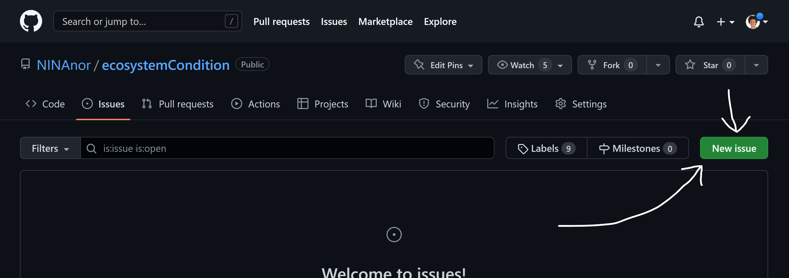

--- 
title: "Indicators for Ecosystem Condition in Norway"
author: "Anders L. Kolstad"
date: "2022-09-15"
site: bookdown::bookdown_site
documentclass: book
bibliography: [book.bib, packages.bib]
url: https://ninanor.github.io/ecosystemCondition/index.html
# cover-image: path to the social sharing image like images/cover.jpg
description: |
  This is a site for documenting the analyses related to the development and design of ecosystem condition indicators.
biblio-style: apalike
csl: chicago-fullnote-bibliography.csl
---

# About {-}

On this site you may view the nitty gritty details for how certain indicators for ecosystem condition for Norway has been calculated.

The web page is made to document the work related to a R&D project to develop indicators for ecosystem condition for three main ecosystems in Norway: wetlands, open areas below the forest line, and semi-natural land. These indicators are not yet used in real assessments, and may represent unfinished work pending future data availability. In addition,  we may chose to also present some analyses documenting indicators that _are_ used in existing assessments of ecosystem condition.  

## Community review {-}

We want our work to be transparent and credible. Therefor we encourage all types of feedback on the analyses of the indicators for ecological condition that you can read about on this web site. To submit your comments, please to to [*this github repository*](https://github.com/NINAnor/ecosystemCondition/issues) and open a new _issue_ and we will answer them there. 

## Author guidelines {-}

For those participating in the indicator project, detailed information about how to document your work will be communicated over email, but the main steps can be summarised as this:

* Obtain a _go ahead_ signal from the coordination group to make sure you are free to start your work
* Read the [`template.Rmd`](template.Rmd) file. Make a copy of it and store it, in the same (root) folder as `DRAFT_myIndicator.Rmd`. (For an example, see `DRAFT_breareal.Rmd`). Finish your documentation and analyses there. 
  + You can load data from internal NINA servers, from web hosts, of store smaller data set under `data`.
  The `data` folder also contains some supporting data sets that you may want to use, such as a delineation of the five regions used in the ecosystem assessment (`data/regions.shp`), and an outline of Norway (`outlineOfNorway_EPSG25833.shp`).
  + To preview you rmarkdown file as html, type `rmarkdown::render("DRAFT_myIndicator.Rmd")` in the console (the knitr shortcuts don't work as expected inside bookdown projects). 
  + When filling out the template.Rmd file with your own work, try not to change the headers too much.
  + Final result from the analyses should be written to the `indicators` folder. The preferred output is georeferenced data (rasters or shape files), andthese should be placed under `indators/indicatorMaps`. All georeference data should use EPSG:25833 - ETRS89 / UTM zone 33N. Other output, like data tables, can be stired under `indicators`.
* Make a pull request to the main [*GitHub repository*](https://github.com/NINAnor/ecosystemCondition) to submit your file.
* Anders or someone else in the project wil conduct a rapid code review, making sure the code is reproducible, interpretable and that it renders locally on the R Studio server.
* When approved, the reviewer will make a copy of the DRAFT_ file, removing the DRAFT_ part of the name, as well as the YML header, and as well as updating the rmd_files part of _bookdown.yml. (For an example of such a file, see `breareal.Rmd`.)
* To update the web site (this web site), an admin user needs to pull down the repo to R Studio server, compile the book there (Ctr+Shift+B), commit and push to main. The html version of the book will be in the `docs` folder.

