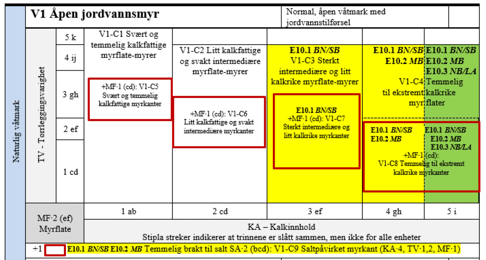

# On the application of the naturetype dataset - Part 2 - Representativity {#naturtype2}

<br />

*Work in progress*

```{r, include=FALSE}
library(knitr)
library(sf)
library(tmap)
library(ggplot2)
library(data.table)
library(stringr)
library(units)
library(dplyr)
knitr::opts_chunk$set(echo = TRUE)
```

Author: Anders L. Kolstad

Date: `r Sys.Date()`

This chapter continues with the cleaned dataset exported at the end of the previous chapter:
```{r, eval=T}
myData <- readRDS("/data/P-Prosjekter/41201785_okologisk_tilstand_2022_2023/data/Mdir_Naturtyper_cleanedALK.rds")
```

## Representativity in mapping units
Only a subset of nature types are mapped. How well do the mapped units represent, or cover, the range of nature types that is included for each main ecosystem group? I will tsrt by looking at wetlands (våtmark).


### Våtmark
```{r}
wet <- myData[myData$hovedøkosystem == "Våtmark",]
any(wet[wet$naturtype == " Hule eiker",])
```

How many mosaic localities do we have?
```{r}
wet_Mos <- wet[wet$mosaikk == "Ja",]
nrow(wet_Mos)
```
275, compared to 
```{r}
wet_noMos <- wet[wet$mosaikk != "Ja",]
nrow(wet_noMos)
```
118550 *normal* localities.

Let's plot the summed area of each NiN main type, excluding mosaic localities.
```{r, fig.cap="Total mapped are for each NiN main type in the wetland ecosystem (excluding mosaics)"}
temp <- stats::aggregate(data = wet_noMos,
                                 area~ninkartleggingsenheter3, FUN = sum)

names(temp)[2] <- "area_m2"
temp$area_km2 <- drop_units(temp$area_m2/10^6)


ggplot(temp,
       aes(x = ninkartleggingsenheter3,
               y = area_km2))+
  geom_bar(
           fill="grey",
           colour="black",
           stat="identity")+
  coord_flip()+
  theme_bw(base_size = 12)+
  labs(y = "Total mapped area (km/2)",
       x = "NiN main types")
```

If we include mosaic localities we get some other main types included as well
```{r, fig.cap="Total mapped are for each NiN main type in the wetland ecosystem (including mosaics)"}
wet_long <- tidyr::separate_rows(wet, ninkartleggingsenheter3)
wet_long_agg <- stats::aggregate(data = wet_long,
                                 area~ninkartleggingsenheter3, FUN = sum)
names(wet_long_agg)[2] <- "area_m2"
wet_long_agg$area_km2 <- drop_units(wet_long_agg$area_m2/10^6)
ggplot(wet_long_agg,
       aes(x = ninkartleggingsenheter3,
               y = area_km2))+
  geom_bar(
           fill="grey",
           colour="black",
           stat="identity")+
  coord_flip()+
  theme_bw(base_size = 12)+
  labs(y = "Total mapped area (km/2)",
       x = "NiN main types")
```

Especially T34 (kystlynghei) and T1 (nakent berg) commonly occur in mosaics with wetlands.

V5, V6 are V7 are not represented at all. V5 is *Varm kilde* which we don't have in mainland Norway. V6 and V7 might be linked to the alpine ecosystem.

### V1 Åpen jordvassmyr

The field recorders are allowed to themselves select the NiN types (sub units of the NiN main types) that thir locality supposedy belongs to. This may differ from what NEA (Norwegian Environmental Agency) uses to define the nature type. Therefore, in the data set, there are a lot of nature types that presumably cover, at least partly, V1 *Åpen jordvassmyr*:
```{r}
unique(wet$naturtype[wet$ninkartleggingsenheter3 =="V1"])
```
If we  look at the field protocol, we get a different picture.



Green areas means that the entire NiN space is included in the nature type (which is bold). So for V1, the highest KA level (level *i*) is covered by E10 (*Rik åpne jordvassmyr*) with three sub-classes. For the yellow areas, only parts of the NiN spaces is mapped, and the defining parameters are in bold followingthe nature type code. So for KA e-f for exmaple, this NiN space is covered by E10.1 (*Rik åpen sørlig jordvassmye*), but only in boreonemoral and south boreal sones (*BN/SB*). The red boxes indicate a third axis in this figure related to MF (myrflate). The two boxes on the right are partly covered, and the two to the right are not. Finally, there is one more NiN type (V1-C9) written at the bottom which is partly covered (yellow outline).

So, NiN main type is actually, today, only mapped through one nature type, E10. Some of the nature types might be old refracted, types. The list of nature types linked to V1 is, however, not of much use to us.


## Environmental space

-   Extract environmental data from the polygons and compare against reference data points.
-   Uni-variate (e.g. *boreal hei* plotted against elevation, oceanity, distance from roads, etc)


## Conclution 1

Conclude about which main ecosystem types that can reliably assess using the available mapping units?

What about suitability for defining reference values?

## Suitability

In the subset of mapping units that can be said to represent an ecosystem group, which NiN or MdirPRAM variables should we use?

## Concrete examples

### Andel lynghei med minst to faser i kystlynghei

### Areal uten skadet og/eller død røsslyng i kystlynghei

### Aktuell bruksintensitet