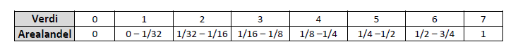

# Anthropogenic disturbance to soils and vegetation (ADSV) {#slitasje}


*Author and date:* 

Anders L. Kolstad

September 2023


Norwegian indicator name: **Slitasje**


```{r setup, include=FALSE}
library(knitr)
library(sf)
library(tmap)
library(ggpubr)
library(DT)
library(units)
library(eaTools)
library(tidyverse)
library(tibble)
library(flextable)
knitr::opts_chunk$set(echo = TRUE)

# Set up conditional file paths
dir <- substr(getwd(), 1,2)

path <- ifelse(dir == "C:", 
               "R:/GeoSpatialData/Habitats_biotopes/Norway_Miljodirektoratet_Naturtyper_nin/Original/Naturtyper_nin_0000_norge_25833_FILEGDB/Naturtyper_nin_0000_norge_25833_FILEGDB.gdb",
               "/data/R/GeoSpatialData/Habitats_biotopes/Norway_Miljodirektoratet_Naturtyper_nin/Original/Naturtyper_nin_0000_norge_25833_FILEGDB/Naturtyper_nin_0000_norge_25833_FILEGDB.gdb")

pData <- ifelse(dir == "C:", 
               "P:/41201785_okologisk_tilstand_2022_2023/data/",
               "/data/P-Prosjekter2/41201785_okologisk_tilstand_2022_2023/data/")

```

```{r, echo=F}
Ecosystem <- "Våtmark, Naturlig åpne områder under skoggrensa, Semi-naturlig mark" 
Egenskap  <- "Primærproduksjon (evt. Abiotiske fohold)"
ECT       <- "Physical state characteristics" 
Contact   <- "anders.kolstad@nina.no"
```

```{r, echo=F}
metaData <- data.frame(Ecosystem,
                       "Økologisk egenskap" = Egenskap,
                       "ECT class" = ECT,
                       check.names = F)
flextable(metaData) %>%
  bg(bg = "lightblue", part="header") %>%
  theme_vanilla() %>%
  set_table_properties(layout = "autofit")
```

<hr/>

## Introduction
This indicator represent human caused damage or **disturbance to soils and vegetation**, typically from things like recreational activities and off-road vehicle traffic. The data come from a combination non-random field surveys and area-representative surveys. Disturbance to soils and vegetation is recorded in the various data sets are NiN variables 7SE and 7TK, or as the similar, but more fine-scaled variable, PRSL and PRTK. Effects from domestic animals are not included in the definition of these variables, and the upper reference value is therefore set to 0% disturbance. 

The indicator is calculated separately for the three ecosystems, but all nature types associated with the same ecosystem are pooled and treated equally. This means we assume the nature types that are mapped and which we have data from are, when pooled, representative for the main ecosystem. This is less true for Naturally open ecosystems than it is for the other two. You can read more about that [here](#naturtype).

Since the data is not sampled in a systematic or random way, we must take extra care not to over-extrapolate in space. We delineate _homogeneous impact areas_ (HIA) based on four classes of increasing infrastructure, and we say that the field data is representative inside the HIA and region (_five regions in Norway_) where it was recorded. We then calculate an area weighted mean (and error) indicator value for each HIA and region combination, as long as there is more than 150 data points for a give combination of HIA and region. 

Here is a general workflow for the calculation of the indicator.

1.  Import [Nature type data](#NTM) data set and [ANO data
    set](#ANO-import)

2.  Identify the [relevant](#naturtype) nature types and [subset](#NTM)
    the data

3.  Convert [ANO points to polygons](#ANO-points-to-poly)

4.  For each polygon, extract the variable that has the lowest value
    (one-out all-out principle), e.g. Fig. \@ref(fig:slitasje-naturetype). The four variables are 7TK, 7SE (both NiN2-variables) and PRTK and PRSL (both defined by the Norwegain Environmental Agency)

5.  [Combine](#combine-nt-ano) data sets (nature types and ANO) but keep ecosystems separate. 

6.  [Scale](#scale-slitasje-ind) the `slitasje` variable based on
    reference values.

7.  Define [homogeneous impact areas](#HIA-slitasje) (HIA)

8.  [Aggregate and spread](#spread-slitasje) indicator value across HIAs
    and assessment regions

9.  Confirm relationship between infrastructure index and indicator
    values to [justify the extrapolation](#validate-slitasje)

10. TO DO: Prepare ecosystem delineation maps and us ethese to mask the extrapolated indicator maps

11. Spatial aggregation of indicator values and uncertainties to accounting areas

12. Export indicator maps and regional extrapolated maps

Note that besides the wetland map, we do not have ecosystem delineation maps to complete step 10 in the workflow.

| Variable    | Name |Measurement scale | Description |
|------       |------|------|-----|
|7TK          |Spor etter ferdsel med tunge kjøretøy      |A4b      | Det som skal registreres er andelen (tenkte) småruter á 10 × 10 m (100 m2) innenfor en kartfigur som inneholder kjøretøyspor. |
|7SE          |Spor etter slitasje og slitasjebetinget erosjon      |A4b  | Det som skal registreres er antall (tenkte) småruter á 2 × 2 m (4 m2) som inneholder spor etter slitasje og slitasjebetinget erosjon (slitasjespor). |
|PRTK         |Kjørespor      |A8 | Same as 7TK, but with a finer measurement scale |
|PRSL         |Slitasje | A8 | Same as 7SE, but with a finer measurement scale |

: Variables used in this composite ADSV indicator


## About the underlying data

The indicator uses a data set from a standardised field survey of nature
types. You can read more about the preliminary analyses
[here](#naturtype). See also the [official
site](https://www.miljodirektoratet.no/ansvarsomrader/overvaking-arealplanlegging/naturkartlegging/naturtyper/)
of the Environment Agency. I also import a data set called
[ANO](#ANO-import), which you can read about
[here](https://www.miljodirektoratet.no/ansvarsomrader/overvaking-arealplanlegging/miljoovervaking/overvakingsprogrammer/natur-pa-land/arealrepresentativ-naturovervakning-ano/)

### Representativity in time and space

The nature type mapping is not random and cannot be said to be area
representative. The ANO data set however, is area representative. The
data is from 2018 to present. The data from one field season usually
becomes available early the following year.

### Original units

The variables are recorded on a coarse four-step ordinal scale (Fig.
\@ref(fig:four-step)) or eigth-step scale.

### Temporal coverage {#temoporal-sli}

The data goes back to 2018. I therefore [bulk all the data from 2018 to 2022](https://github.com/NINAnor/ecosystemCondition/issues/101#issuecomment-1719170208) into one time step. I then use the mean date for the raw data,
and define the variable as belonging to the year 2020 (read more
[here](#scaled-slitasje-variable)).

Regarding update frequency, the Nature type data set is not replicated, nor will it be in the future. We must therefore trust that the selection criteria for which areas to survey will not change drastically and systematically over time. For example, we are now surveying a lot in pressure areas, meaning lowland areas close to human population centers. If we in the future allocate more time to surveying wilderness areas, then the indicator becomes biased. On the other hand, ANO is replicated every 5 years.

### Aditional comments about the dataset

For a run through of the nature type data set, see [here](#naturtype).

## Ecosystem characteristic

### Norwegain standard

The indicator is tagged to the *Økologisk egenskap* called
**Primærproduksjon** (Primary productivity). This is [somewhat tentative](https://github.com/NINAnor/ecosystemCondition/issues/96), and
perhaps *abiotiske forhold* is more suited. But the thought behind the
choice is that *ADSV* affect the potential for primary productivity.

### UN standard

The indicator is tagged as a **Physical state characteristics**
indicator. This is quite clear. It's a type of abiotic characteristic that
has to do with the physical structure rather than the chemical
composition.

## Collinearities with other indicators

_ADSV_ is not thought to exhibit collinearity with any other indicator at
the present.

## Reference condition and values

### Reference condition

The reference condition is one with minimal negative human impact. This
is also true for semi-natural ecosystems. For example, in the reference
condition, *ADSV* in semi-natural ecosystems is defined to be zero,
even though at no point in time would this condition be realized.

### Reference values, thresholds for defining *good ecological condition*, minimum and/or maximum values
For a further discussion on this topic, see [GitHub issue 88](https://github.com/NINAnor/ecosystemCondition/issues/88). 

* Upper = 0%

* Threshold = 10%

* Lower = 100%

The upper reference value is 0% (no *damage*), and the lower reference
value is 100%. Note that 100% _damage_ does not mean that all the area
must be scarred or damaged, but that all hypothetical quadrats around a
point is affected (the variable is frequency-driven, and not
amount-driven). 

The threshold for good ecosystem condition is set to 10%
damage. This is an expert judgement, and a rather weak one at that. 
In the future we should try to empirically validate the dose-response relationship,
for example by comparing different variable scores with erosion rates or the potential for plant growth.
This would need to be done specifically for each nature type.

The indicator value could be interpreted differently at the polygon
_vs_ landscape scale. At the polygon scale, 10% damage may seem 
like not that much, whilst at the landscape scale, 10% seems more serious.

Read about the normalisation [here](#scaled-slitasje-variable).

## Uncertainties

Uncertainties/errors are estimated for aggregated indicator values by
bootstrapping individual indicator values 1000 times and calculating a
distribution of area weighted means. See the documentation for `eaTools::ea_spread` [here](https://ninanor.github.io/eaTools/reference/ea_spread.html). 
This uncertainty is different from 
the spatial variation which we could get more straight forward without 
bootstrapping. When aggregating a second time,
from homogeneous impact areas to accounting areas, we assume a normal
distribution around the indicator values, with the already mentioned
errors, and sample _n_ times from these and combine the resamples into an
a new, area weighted, distribution. The errors for the accounting areas
thus represents both the spatial variation, and the precision, of the
indicator values within the accounting areas.

## References

Halvorsen, R. & Bratli, H. 2019. Dokumentasjon av NiN versjon 2.2 tilrettelagt for praktisk naturkartlegging: utvalgte variabler fra beskrivelsessystemet. – Natur i Norge, Artikkel 11 (versjon 2.2.0): 1–218 (Artsdatabanken, Trondheim; http://www.artsdatabanken.no.)

Miljødirektoratet 2022. Kartleggingsinstruks - kartlegging av terrestriske Naturtyper etter NiN2. URL: https://www.miljodirektoratet.no/publikasjoner/2022/januar/kartleggingsinstruks-kartlegging-av-terrestriske-naturtyper-etter-nin/

Miljødirektoratet 2023. Arealrepresnetativ Naturovervåking. Webpage. URL: https://www.miljodirektoratet.no/ansvarsomrader/overvaking-arealplanlegging/miljoovervaking/overvakingsprogrammer/natur-pa-land/arealrepresentativ-naturovervakning-ano/


## Analyses

### Data sets

#### Nature type mapping {#NTM}

This indicator uses the data set
`Naturtyper etter Miljødirektoratets Instruks`, which can be found
[here](https://kartkatalog.geonorge.no/metadata/naturtyper-miljoedirektoratets-instruks/eb48dd19-03da-41e1-afd9-7ebc3079265c).
See also [here](#naturtype) for a detailed description of the data set.

We also have a separate [summary file](#exp-natureType-summary) where
the nature types are manually mapped to the correct NiN-main typesand to the NiN variables  that are recorded in each nature type. We can use this to find the nature types associated with the NiN main types
that we are interested in.

```{r}
naturetypes_summary_import <- readRDS("data/naturetypes/natureType_summary.rds")
```

We are only interested in a mapping units that include our target variables.

```{r}
myVars <- c('7TK', '7SE', 'PRTK', 'PRSL')
```


```{r}
naturetypes_summary <- naturetypes_summary_import %>%
  rowwise() %>%
  mutate(keepers = sum(c_across(
    all_of(myVars))>0, na.rm=T)) %>%
  filter(keepers > 0) %>%
  select(Nature_type, NiN_mainType, Year)
```

This deleted `r nrow(naturetypes_summary_import) - nrow(naturetypes_summary)` nature types and left us with these:

```{r}
DT::datatable(naturetypes_summary)
```

Importing and sub-setting the main data file, fix duplicate _hovedøkosystem_, calculate area, split one column in two, make numeric, and select target variables:
```{r, message=F}
naturetypes <- sf::st_read(dsn = path) %>%
  filter(naturtype %in% naturetypes_summary$Nature_type) %>%
  mutate(hovedøkosystem = recode(hovedøkosystem,
                                 "naturligÅpneOmråderUnderSkoggrensa" = "naturligÅpneOmråderILavlandet"),
         area = st_area(.)) %>%
  separate_rows(ninBeskrivelsesvariable, sep=",") %>%
  separate(col = ninBeskrivelsesvariable,
           into = c("NiN_variable_code", "NiN_variable_value"),
           sep = "_",
           remove=F) %>%
  mutate(NiN_variable_value = as.numeric(NiN_variable_value)) %>%
  filter(NiN_variable_code %in% myVars)
```

```{r fig.cap="An overview of the naturetypes for which we will calculate the indicator. Colours refer to the main ecosystem affiliation.", fig.height=10}
ggplot(data = naturetypes, aes(x = naturtype, fill = hovedøkosystem))+
  geom_bar()+
  coord_flip()+
  theme_bw(base_size = 12)+
  theme(legend.position = "top",
        legend.title = element_blank(),
        legend.direction = "vertical")+
  #guides(fill = "none")+
  xlab("")+
  ylab("Number of localities")
```

Column names starting with a number is problematic, so adding a prefix

```{r}
naturetypes$NiN_variable_code <- paste0("var_", naturetypes$NiN_variable_code)
```

```{r, fig.cap="Distribution of data points over time."}
barplot(table(naturetypes$kartleggingsår))
```


Now I need to create a single row per locality with a new variable which
is a product/function of the four variables "7SE", "7TK", "PRTK" and
"PRSL". 

I initially baseed this indicator on whichever of the variables have the highest value (worst condition), but after some thought and discussion I now use an additive approach (adding the variable values togther). I first convert the ordinal scale to a continuous scale, using the median value of each ordinal step.

The variables use slightly different scales. PRSL and PRTK use this 8
step scale:

```{r eight-step, fig.cap="Eight step condition scale"}

```

7TK and 7SE use a 4 step scale

```{r four-step, fig.cap="Four step condition scale"}
knitr::include_graphics("images/ninAR4b.PNG")
```


I here transfer these ordinal variables over to a continuous scale. The data is strongly right skewed, so simply taking the center value of each value range will not work. 

```{r naturetypes-histogram-vars, fig.cap="Histogram showing the distribution of the four variables used in this indicator."}
naturetypes %>% 
  ggplot()+
  theme_bw() +
  geom_histogram(aes(x = NiN_variable_value),
                 binwidth = 1) +
  facet_wrap(.~NiN_variable_code)
```

The table below shows that, if I assume there is some ADSV and therefore exlude case with variable value <1, the median value for all the variables is 1. The most common % value for each range category should then be the lower limit of that category. For example, when the category is `1/2 - 1` then the % value is most likely 50%, and not 75% which is the center value for that value range. One  issue is when the variable value is 1, because there the lower limit is the same as when the variable value is 0. Here I think I must manually assign it to something a bit higher than 0.
```{r}
naturetypes %>%
  as.tibble() %>%
  filter(NiN_variable_value >0) %>%
  group_by(NiN_variable_code)%>%
  summarise(mean = mean(NiN_variable_value, na.rm=T),
            median = median(NiN_variable_value, na.rm=T))
```

 

You can read more about this issue [here](https://github.com/NINAnor/ecosystemCondition/issues/100).


```{r}
naturetypes <- naturetypes %>%
  mutate(NiN_variable_value = case_when(
    NiN_variable_code %in% c("var_7TK", "var_7SE") ~ 
      case_match(NiN_variable_value,
             0 ~ 0,
             1 ~ mean(c(0, 1/16))*100,
             2 ~ 1/16*100,
             3 ~ 50),
    NiN_variable_code %in% c('var_PRTK', 'var_PRSL') ~ 
      case_match(NiN_variable_value,
             0 ~ 0,
             1 ~ 1.5,
             2 ~ 3,
             3 ~ 6.25,
             4 ~ 12.5,
             5 ~ 25,
             6 ~ 50,
             7 ~ 75)
    )
  )
```

This scaling of the variable implies that it very difficult to measure a location when it
is in its most degraded form (100% disturbed), since the highest % value one can use is 75% for PRSL and PRTK and just 50% for the other two. 
This is a problem with the original data resolution. 
But I will compensate somewhat for this by
using a non-linear transformation.


I will create a new data table where I calculate the new
variable which I then paste back into the sf object.

```{r}
naturetypes_wide <- pivot_wider(naturetypes,
                                names_from = "NiN_variable_code",
                                values_from = "NiN_variable_value",
                                id_cols = "identifikasjon_lokalId")
naturetypes_wide <- as.data.frame(naturetypes_wide)
head(naturetypes_wide, 10)
```

First I will combine 7TK and PRTK, and also 7SE and PRSL.

```{r}
naturetypes_wide <- naturetypes_wide %>%
  mutate(TK = if_else(
    is.na(var_PRTK), var_7TK, var_PRTK),
    SE = if_else(
      is.na(var_PRSL), var_7SE, var_PRSL)
    )
```


SE has `r nrow(naturetypes_wide[is.na(naturetypes_wide$SE),])`
NA's, and TK has
`r nrow(naturetypes_wide[is.na(naturetypes_wide$TK),])`.

```{r, fig.cap="7SE scores in the naturetype dataset", fig.width=5}
temp <- naturetypes_wide %>%
  group_by(SE) %>%
  summarise(sum = n())

ggplot(temp, aes(x = factor(SE),
                 y = sum))+
  geom_bar(stat="identity",
           fill="grey",
           colour = "black")+
  theme_bw(base_size = 12)+
  labs(x = "7SE or PRSL score",
       y = "Number of localities")
```

The NA fraction is quite big. These are localities with 7TK or PRTK recorded,
but not 7SE or PRSL.

```{r, fig.cap="7TK scores in the nature type dataset", fig.width=5}
temp <- naturetypes_wide %>%
  group_by(TK) %>%
  summarise(sum = n())

ggplot(temp, aes(x = factor(TK),
                 y = sum))+
  geom_bar(stat="identity",
           fill="grey",
           colour = "black")+
  theme_bw(base_size = 12)+
  labs(x = "7TK og PRTK score",
       y = "Number of localities")
```

Then I can add these two variables together into a composite variable called
`slitasje`

```{r, warning=F}
naturetypes_wide$slitasje <- apply(naturetypes_wide[,c("TK", "SE")], 1, sum, na.rm=T)
```

Chekhing for -Inf
```{r}
nrow(naturetypes_wide[naturetypes_wide$slitasje<0,])
```
No issues with that.

```{r slitasje-naturetype, fig.cap="ADSV scores.", fig.width=5}
temp <- naturetypes_wide %>%
  group_by(slitasje) %>%
  summarise(sum = n())

ggplot(temp, aes(x = slitasje,
                 y = sum))+
  geom_bar(stat="identity",
           fill="grey",
           colour = "black")+
  theme_bw(base_size = 12)+
  labs(x = "ADSV score converted to percentage",
       y = "Number of localities") + 
  theme(axis.text.x = element_text(angle=90, vjust=0.5))+
  scale_x_continuous(
    labels = scales::label_number(accuracy = 1))
```

It appears most localities are in good condition. Note also that we theoretically can get >100% for the unscaled variable.  

I would also like to know, when both TK and SE was recorded,
which one is likely to be in the worst (or best) condition. 
I can do this by taking the difference.

```{r, fig.cap="Counting the number of cases where TK or SE was in the worst condition for a given locality.", fig.width=3}


diff <- naturetypes_wide$SE - naturetypes_wide$TK

diff <- ifelse(diff == 0, "TK and SE",
               ifelse(diff <0, "TK", "SE"))

diff_tbl <- as.data.frame(table(diff))

ggplot(diff_tbl, aes(x = diff, y = Freq))+
  geom_bar(stat = "identity",
           colour = "black",
           fill = "grey")+
  theme_bw(base_size = 12)+
  labs(x = "Variable indicating the worst state",
       y = "Number of localities")
```

Looks like SE (= 7SE or PRSL) is more likely to be in a detrimental state.

Now I will copy these ADVS-values into the sf object.

```{r}
naturetypes$slitasje <- naturetypes_wide$slitasje[match(naturetypes$identifikasjon_lokalId, naturetypes_wide$identifikasjon_lokalId)]
#nrow(naturetypes[is.na(naturetypes$slitasje),])  # 13 cases
naturetypes <- naturetypes[!is.na(naturetypes$slitasje),]
```

#### GRUK

This variable is also recorded in
[GRUK](https://www.nina.no/Naturmangfold/Trua-natur/%C3%85pen-grunnlendt-kalkmark).
This is a stratified and intensive monitoring program for calcareous naturally open areas around the Oslo fjord. 
The nature type data set I'm working on here includes some data from GRUK already
(presently only 2021 included). The full GRUK data set also contains a related variable:
`% cover in 5m radii circles`, which is much more detailed than the four variable we have looked at so far. This data is
not published. In any case it might be better to use the harmonized data set
in our case.

#### ANO {#ANO-import}

Arealrepresentativ Naturovervåking (ANO) consist of 1000 systematically
placed locations each with 18 sample points. In each sample point a
circle of 250 m2 is visualised, and the main ecosystem is recorded.
Depending on the main ecosystem, certain NiN variables are also
recorded. 7SE is recorded for våtmark (wetlands), but not semi-natural areas or
naturally open areas. 7TK is recorded in wetlands and naturally open
areas only.

| Variable | Våtmark | Naturlig åpne områder | Semi-naturlige områder |
|----------|---------|-----------------------|------------------------|
| 7SE      | X       | \-                    | \-                     |
| 7TK      | X       | X                     | \-                     |

: Table showing which main ecosystems the two NiN variables 7SE and 7TK
is recorded in withing the ANO data set.

It would be very nice to have 7SE recorded for naturally open areas.
This variable is very relevant here.

I think I will only use wetlands here since my approach will be to the
'worst value' of the variable 7SE and 7TK (see below). I think not
having 7SE for naturally open areas will underestimate the degree of
degradation in these areas.


> *ANO could harmonise better with the Naturetype data set if it included
> 7SE and 7TK for Naturally open and Semi natural ecosystem.*


```{r}
ano <- sf::st_read(paste0(pData, "Naturovervaking_eksport.gdb"),
                   layer = "ANO_SurveyPoint") %>%
  dplyr::filter(hovedoekosystem_punkt == "vaatmark")
```

```{r}
table(ano$aar)
```

This data set only contains data from year 2019 and 2021. We need to
update this data set later. It is not clear why there is no data from
2020. This topic is maintained as a [GitHub issue](https://github.com/NINAnor/ecosystemCondition/issues/101).

Each point/row here is 250 square meters. The data also contains
information about how big a proportion of this area is made up of the
dominant main ecosystem. However, there are
`r (NAS <- length(ano$andel_hovedoekosystem_punkt[is.na(ano$andel_hovedoekosystem_punkt)]))`
NA's here, which is `r round(NAS/nrow(ano), 2)*100`% of the data.

It appears the proportion of each circle that is made up of the dominant
ecosystem was only recorded after year 2019. In fact, the main ecosystem
was not recorded at all in 2019:
```{r}
# Hard coding name change
#unique(ano$hovedtype_250m2)[3]
#ano$hovedtype_250m2[ano$hovedtype_250m2==unique(ano$hovedtype_250m2)[3]] <- "Aapen jordvassmyr"
```


```{r}
table(ano$hovedtype_250m2, ano$aar)
```

I can remove the NA's, and thus the 2019 data.

> *All of 2019 ANO data is excluded because of missing information*

```{r}
ano <- ano[!is.na(ano$andel_hovedoekosystem_punkt),]
```

Let's look at the variation in the recorded proportion of ecosystem
cover

```{r, fig.cap="Distribution of the ANO variable andel_hovedoekosystem_punkt for wetland localities."}
par(mar=c(5,6,4,2))
plot(ano$andel_hovedoekosystem_punkt[order(ano$andel_hovedoekosystem_punkt)],
     ylab="Percentage of the 250 m2 area\ncovered by the main ecosystem")
```

The zero in there is an obvious mistake.

```{r}
ano <- ano[ano$andel_hovedoekosystem_punkt>20,]
```

Here's another plot of the distribution of the same variable:

```{r, warning=F, fig.cap="Percentage cover of the Våtmark main ecosystem in the 250m2 circle"}
ggplot(ano, aes(x = andel_hovedoekosystem_punkt))+
         geom_histogram(fill = "grey",
                        colour="black",
                        binwidth = 1)+
  theme_bw(base_size = 12)+
  xlab("Percentage cover of the Våtmark main ecosystem\n in the 250m2 circle")+
  scale_x_continuous(limits = c(0,101),
                     breaks = seq(0,100,10))
```

We can see that people tend to record the variable in steps of 5%, and
that most sample points are 100% belonging to the same main ecosystem.

We want to use area weighting in this indicator, so we can use this
percentage cover data to calculate the area. Note that both data sets
use m^2^ as area units.

```{r}
ano$area <- (ano$andel_hovedoekosystem_punkt/100)*250
```

Let's now look at the distribution of the variables. First I need to
separate the variable name from the values themselves. Now the data
looks like this:

```{r}
ano$bv_7se[1:6]
```

So I create a new variable prefixed var\_:

```{r}
ano$var_7SE <- as.numeric(sub(pattern = "7SE_",
                 replacement = "",
                 x = ano$bv_7se))
```

The NA's is the case of blank cells. The field app should not allow
users leaving this field blank. I will need to remove these rows. There
are fourteen cases:

```{r}
nrow(ano[is.na(ano$var_7SE),])
```

```{r}
ano <- ano[!is.na(ano$var_7SE),]
```

Same with the other variable 7TK

```{r}
ano$var_7TK <- as.numeric(sub(pattern = "7TK_",
                 replacement = "",
                 x = ano$bv_7tk))
```

No NA's this time.


> *The ANO field app should not allow user to leave blank cells. This
> resulted in the exclusion of data.*


```{r, fig.cap="Distribution of 7TK and 7SE scores in the ANO data"}
par(mfrow=c(1,2))
barplot(table(ano$var_7TK), xlab="7TK scores")
barplot(table(ano$var_7SE), xlab="7SE scores")
```

The ANO sites seem to be in an even better condition than the localities in the naturtype data set.

Combining these two variables 7TK and 7SE into one, same as for the nature
type data.

First I convert the range categories into percentages, like I did previously for the nature type data set.

```{r}
ano <- ano %>%
  mutate(var_7TK = case_match(var_7TK,
             0 ~ 0,
             1 ~ mean(c(0, 1/16))*100,
             2 ~ 1/16*100,
             3 ~ 50)) %>%
  mutate(var_7SE = case_match(var_7SE,
             0 ~ 0,
             1 ~ mean(c(0, 1/16))*100,
             2 ~ 1/16*100,
             3 ~ 50))
```

```{r}
temp <- as.data.frame(ano)
temp$slitasje <- apply(temp[,c("var_7TK", "var_7SE")], 1, sum, na.rm=T)
ano$slitasje <- temp$slitasje
```


```{r, fig.cap="Distribution of slitasje scores in the ANO data", fig.width=6}
barplot(table(ano$slitasje), xlab="ADVS variable score", ylab = "Number of localities", las=2)
```

##### Combine Naturtype data and ANO {#combine-nt-ano}

We need to combine the nature type data set with the ANO data set. I
will add a column `origin` to show where the data comes from. I will
also add a column with the main ecosystem.

```{r}
ano$origin <- "ANO"
naturetypes$origin <- "Nature type mapping"
ano$hovedøkosystem <- "Våtmark"
ano$kartleggingsår <- ano$aar
```

Fix class

```{r}
naturetypes$kartleggingsår <- as.numeric(naturetypes$kartleggingsår)
naturetypes$area <- units::drop_units(naturetypes$area)
```

I use `dplyr::select` to reduce the number of columns to keep things a
bit more tidy.

```{r}
slitasje_data <- dplyr::bind_rows(select(ano,
                                  GlobalID,
                                  origin,
                                  kartleggingsår,
                                  hovedøkosystem,
                                  area,
                                  slitasje,
                                  SHAPE), 
                           select(naturetypes,
                                  identifikasjon_lokalId,
                                  origin,
                                  hovedøkosystem,
                                  kartleggingsår,
                                  area,
                                  slitasje,
                                  SHAPE))

unique(st_geometry_type(slitasje_data))
```

###### Points to polygons {#ANO-points-to-poly}

The ANO data is point data, and the nature type data is *multipolygon*.
Because later we might want to save this as a shape file, we cannot have
a mixed class type. I will therefore convert the points to polygons. I
use the area column to calculate a radii that gives that area.

```{r}
slitasje_data_points <- slitasje_data %>%
  mutate(g_type = st_geometry_type(.)) %>%
  filter(g_type =="POINT") %>%
  st_buffer(sqrt(slitasje_data$area/pi))
```

Checking now that the new polygons have the area corresponding to the
proportion of the point that was part of the same main ecosystem:

```{r new-area, fig.cap="Checking that the area of the new polygons fall in line with the proportion of each point which is part of the main ecosystem."}
slitasje_data_points$area2 <- st_area(slitasje_data_points)
plot(slitasje_data_points$area, slitasje_data_points$area2,
     xlab = "Target area",
     ylab = "Area of the new polygons")
abline(0,1)
```

The area calculation seems to have worked fine. Checking that the new
data set contains **only polygons**.

```{r}
slitasje_data_polygons <- slitasje_data %>%
  mutate(g_type = st_geometry_type(.)) %>%
  filter(g_type !="POINT")

slitasje_data <- bind_rows(slitasje_data_points, slitasje_data_polygons)

unique(st_geometry_type(slitasje_data))
```

Ok.

#### Distribution of ADVS scores

```{r, fig.cap="ADVS variable scores (ANO Naturetype data combined). The score for a locality equals the sum of the related variables 7TK, 7SE, PRSL and PRTK."}
temp <- as.data.frame(table(slitasje_data$slitasje))
temp$Var1 <- as.numeric(as.character(temp$Var1))
ggplot(temp, aes(x = Var1,
                 y = Freq))+
  geom_bar(stat="identity",
           fill="grey",
           colour = "black")+
  theme_bw(base_size = 12)+
  labs(x = "ADVS score",
       y = "Number of localities")+
  scale_x_continuous(
    labels = scales::label_number(accuracy = 1))
```

Let's see the proportion of data points (not area) origination from each
data set

```{r, fig.cap="Barplot show the contribution (number of localities) of different data sets to the ADVS indicator.", fig.width=4}
temp <- as.data.frame(table(slitasje_data$origin))

ggplot(temp, aes(x = Var1,
                 y = Freq))+
  geom_bar(stat="identity",
           fill="grey",
           colour = "black")+
  theme_bw(base_size = 12)+
  labs(x = "Data origin",
       y = "Number of localities")
```

So the ANO data is not very important here, but it can become more
important in the future so good to have them included in the workflow.

#### Outline of Norway and regions

The GIS layers are used to crop out marine areas, and to define
accounting areas, respectively.

```{r}
outline <- sf::read_sf("data/outlineOfNorway_EPSG25833.shp")
```

```{r}
regions <- sf::read_sf("data/regions.shp", options = "ENCODING=UTF8")
unique(regions$region)
```

### Scaled indicator values {#scale-slitasje-ind}

I can scale the indicator for each polygon, or I can chose to aggregate
them first. If the scaled value is representative and precise at the
polygon level, then I could scale at that level. I think they are.

However, the combined surveyed area is a very small fraction of the
total area of Norway, so that only producing indicator values for the
mapped areas leaves the indicator without much value for regional
assessments. When we do regional assessments and calculate regional
indicator values, we cannot simply do an area weighting of the polygons
in each region. This is because we don't want to assume that the
polygons are representative far outside of the mapped area. But perhaps
we can assume them to be representative inside *homogeneous ecological
areas,* or *Homoegeneous Impact Areas* (HIAs). That's where the
infrastructure index comes in. Here's the plan:

1.  normalise the indicators at the polygon level.

2.  take a simplified infrastructure index (vector data set with HIAs)
    and extract the corresponding indicator values that intersect with a
    given HIA, and extrapolate the area weighted mean of those values to
    the entire HIA withing a given geographical region. Errors are
    calculated from bootstrapping.

3.  Take the new area weighted indicator values for the HIAs and match
    them with ecosystem occurrences of the same HIA (possibly using
    randomly sampled points from the available ecosystem occurrences).
    The errors are the same as for the HIAs.

4.  calculate an indicator value for a region (accounting area) by doing
    a weighted average based of the relative area of ecosystem
    occurrences. Errors should be carried somehow, perhaps via weighted
    resampling.

#### Scaled variable {#scaled-slitasje-variable}

I will use the same reference levels/values for all of Norway:

```{r}
upper <- 0
lower <- 100
threshold <- 10
```

Also, the threshold value is set quite conservatively (I think), and should be
discussed.

I need to do a little trick and reverse the upper and lower reference
values for the normalisation to work. This is a bug which can be fixed
inside eaTools.

<!-- THE BREAKPOINT IS AT 0.5 RATHER THAN 0.6. TEST CODE FROM HERE: https://ninanor.github.io/eaTools/articles/normalise-condition-variable.html -->

```{r slitasje-normalise, fig.cap="Performing a linear break-point type normalisation of the ADSV variable.", fig.width=5}
eaTools::ea_normalise(data = slitasje_data,
                      vector = "slitasje",
                      upper_reference_level = lower,
                      lower_reference_level = upper,
                      break_point = threshold,
                      plot=T,
                      reverse = T
                      )
```

This normalisation seems reasonable to me. I can save it as indicator
values. There is no point yet making this a time series, and I will
assign all the indicator value to the average year of the data.

```{r}
mean(slitasje_data$kartleggingsår)
```

Assigning the indicator to year 2020.

```{r}
slitasje_data$i_2020 <- eaTools::ea_normalise(data = slitasje_data,
                      vector = "slitasje",
                      upper_reference_level = lower,
                      lower_reference_level = upper,
                      break_point = threshold,
                      reverse = T
                      )
```

### Homogeneous impact areas {#HIA-slitasje}

I want to use the [Homogeneous Impact Areas](#homogeneous-impact-areas) (HIA) to define
smaller regions into which I can extrapolate the indicator values. This
data is generated by discretizing the Norwegian Infrastructure Index. I
refer to the ordinal values of the four HIA classes as their *Human
Impact Factor* (HIF). This is just to keep the approach separate from
the Norwegian Infrastructure Index.

```{r}
HIA <- readRDS(paste0(pData, "infrastrukturindeks/homogeneous_impact_areas.rds"))
```

I want to check that HIF is in fact a good predictor for *slitasje*.

I also want to split these four HIA classes based on their region. To do
this I need the two layers to have the same CRS.

```{r}
st_crs(HIA) == st_crs(regions)
```

Since the HIA map and the _region_ map are completely overlapping (HIA was masked using the region map), we can get the
intersections

```{r, eval=F}
HIA_regions <- eaTools::ea_homogeneous_area(HIA,
                             regions,
                             keep1 = "infrastructureIndex",
                             keep2 = "region")
saveRDS(HIA_regions, "P:/41201785_okologisk_tilstand_2022_2023/data/cache/HIA_regions.rds")
```

```{r, include=F}
# silently read cached file
HIA_regions <- readRDS(paste0(pData, "cache/HIA_regions.rds"))
```

Create a new column by crossing region and HIF

```{r}
HIA_regions <- HIA_regions %>%
  mutate(region_HIF = paste(region, infrastructureIndex))
```

#### Validate {#validate-slitasje}

I now have `r length(unique(HIA_regions$region_HIF))` unique areas (for each main ecosystem) that I will, given
there is data, extrapolate indicator values over.

###### Subset ETs

I will subset the `slitasje_data` into the three ecosystems. Note that
only for open wetland do we have good ecosystem delineation maps to base
a spatial averaging on.

```{r}
#Check spelling
#unique(slitasje_data$hovedøkosystem)

# Rename one level
slitasje_data <- slitasje_data %>%
  mutate(hovedøkosystem = recode(hovedøkosystem, "Våtmark" = "våtmark"))

#make valid
slitasje_data <- st_make_valid(slitasje_data)

#subset
wetlands <- slitasje_data[slitasje_data$hovedøkosystem == "våtmark",]
seminat <- slitasje_data[slitasje_data$hovedøkosystem == "semi-naturligMark",]
natOpen <- slitasje_data[slitasje_data$hovedøkosystem == "naturligÅpneOmråderILavlandet",]
```

Creating some summary statistics.

```{r, eval=F}
wetland_stats <- ea_spread(indicator_data = wetlands,
          indicator = i_2020,
          regions = HIA_regions,
          groups = region_HIF,
          summarise = TRUE)

seminat_stats <- ea_spread(indicator_data = seminat,
          indicator = i_2020,
          regions = HIA_regions,
          groups = region_HIF,
          summarise = TRUE)

natOpen_stats <- ea_spread(indicator_data = natOpen,
          indicator = i_2020,
          regions = HIA_regions,
          groups = region_HIF,
          summarise = TRUE)

wetland_stats <- wetland_stats %>%
  add_column(eco = "wetland")

seminat_stats <- seminat_stats %>%
  add_column(eco = "semi-natural")

natOpen_stats <- natOpen_stats %>%
  add_column(eco = "Naturally-open")

all_stats <- rbind(wetland_stats,
                   seminat_stats,
                   natOpen_stats)
all_stats <- all_stats %>%
  separate(region_HIF,
           into = c("region", "HIF"),
           sep = " ")

saveRDS(all_stats, "/data/P-Prosjekter2/41201785_okologisk_tilstand_2022_2023/data/cache/all_stats.rds")
```

```{r, include=F}
#silently read cached file
all_stats <- readRDS(paste0(pData, "cache/all_stats.rds"))
```

```{r dense-stats, fig.height= 12, fig.cap="Barplot showing the number of data points, the area weighted scaled indicator values and the sd for the ADSV indicator. Transparent bars represents categories with less than 150 data points, indicated by the vertical line in the top row of panes."}
temp_plot <- all_stats %>%
  mutate(HIF_NA = case_when(
    n > 150 ~ HIF
  ))

myColour_list <- unique(temp_plot$myColour)
names(myColour_list) <-   myColour_list

ggarrange(
ggplot(temp_plot, aes(x = region, y = n, group = HIF, fill = HIF_NA))+
  geom_bar(position = "dodge", stat = "identity", col="black")+
  theme_bw(base_size = 10)+
  scale_fill_brewer(palette="Oranges", na.translate=F)+
  theme(axis.text.x = element_text(angle = 90, vjust=0.5))+
  coord_flip()+
  labs(fill = "HIF")+
  geom_hline(yintercept=150)+
  facet_wrap(.~eco),
ggplot(temp_plot, aes(x = region, y = w_mean, group = HIF, fill = HIF_NA))+
  geom_bar(position = "dodge", stat = "identity", col="black")+
  theme_bw(base_size = 10)+
  scale_fill_brewer(palette="Oranges",  na.translate=F)+
  theme(axis.text.x = element_text(angle = 90, vjust=0.5))+
  coord_flip()+
  labs(fill = "HIF")+
  facet_wrap(.~eco),
ggplot(temp_plot, aes(x = region, y = sd, group = HIF, fill = HIF_NA))+
  geom_bar(position = "dodge", stat = "identity", col="black")+
  theme_bw(base_size = 10)+
  scale_fill_brewer(palette="Oranges",  na.translate=F)+
  theme(axis.text.x = element_text(angle = 90, vjust=0.5))+
  coord_flip()+
  labs(fill = "HIF")+
  facet_wrap(.~eco),
ncol = 1)

```

In the figure above, colors refer to Human Impact Factor (amount or frequency of infrastructure) 
and NA means that there are less than 150 data points which we set as a threshold for evaluating the indicator values.

In the top row
we see that the sample size (number of polygons) varies between
ecosystems. For naturally open ecosystems many polygons are from high
infrastructure areas, not surprisingly, and there are few points for the
lowest impact class (zero such polygons in *Sørlandet* for example). We
may therefore not be able to extrapolate indicator values for Naturally
open areas in in *Sørlandet* with low levels of infrastructure. 

In semi-natural areas and wetlands, we have very little data from HIF
class 3.

We can also from the middle row see the association between the indicator
values (area weighted means) and the modified infrastructure index
(HIF). We should then not put any weight on the bars were there is
little data (transparent bars). Then we se the general pattern that the indicator 
value decreases with increasing HIF. But there are exceptions, like for Semi-natural areas
in Vestlandet.

Let us look at the indicator to pressure relationship across all ecosystems.

```{r, fig.cap="Indicator to pressure relationship across all ecosystems."}
temp_plot %>%
  filter(!is.na(HIF_NA)) %>%
  ggplot(aes(x = HIF_NA, y = w_mean))+
  geom_point(size=2, position = position_dodge2(.1))+
  geom_violin(alpha=0)+
  theme_bw()
```

The pattern is not perfect, and there is quite some noise. But this is perhaps also expected.

Let us look at the effect of sample size on the indicator uncertainty.

```{r, fig.cap="Smaple size against indicator uncertainty."}
temp_plot %>%
  ggplot(aes(x = n, y = sd))+
  geom_point(size=2, position = position_dodge2(.1))+
  theme_bw()+
    facet_wrap(.~eco)
```

This shows that the uncertainty is inflated with sample sizes less than about 300-500.

```{r, fig.cap="Summary statistics for the slitasje indicator."}
DT::datatable(all_stats)
```

In addition to looking at the area weighted means and its relationship
with the pressure indicator (HIF), we can do the same at the polygon
level. Because the indicator is pseudo-continuous, boxplots for example
become useless, so I will present a relative frequency plot.

```{r, eval=F}
corrCheck <- st_intersection(slitasje_data, HIA_regions)
saveRDS(corrCheck, "/data/P-Prosjekter2/41201785_okologisk_tilstand_2022_2023/data/cache/corrCheck.rds")
```

```{r, include=F}
#Silently read cached data
corrCheck <- readRDS(paste0(pData, "cache/corrCheck.rds"))
```

```{r slitasje-precentageplot, fig.height=12, fig.cap="Relative frequency plot (conditioned on region and main ecosystem) showing the distribution of polygons with different scaled indicator values for the indicator named Anthropogenic disturbance to soils and vegetation."}
ggplot(corrCheck, aes(x = factor(infrastructureIndex), fill = factor(round(i_2020,2))))+
  geom_bar(position="fill")+
  theme_bw(base_size = 12)+
  guides(fill = guide_legend("Scaled indicator values"))+
  ylab("Fraction of data points")+
  xlab("HIF")+
  scale_fill_brewer(palette = "RdYlGn")+
  facet_grid(hovedøkosystem~region)
```

The figure above I think supports the indicator-pressure relationship
and justifies using the HIA+region intersections as local reference
areas. Especially when down-weighting the importance of those
groups/categories that have very little data.


```{r, include=FALSE, eval=FALSE}
# Figure for the report 2023

corrCheck %>%
  filter(hovedøkosystem == "naturligÅpneOmråderILavlandet") %>%
ggplot(aes(x = factor(infrastructureIndex), fill = factor(round(i_2020,2))))+
  geom_bar(position="fill")+
  theme_bw(base_size = 12)+
  guides(fill = guide_legend("Skalerte indikatorverdier"))+
  ylab("Andel av datapunkter")+
  xlab("Infrastrukturindeksen (kategorisk versjon)")+
  scale_fill_brewer(palette = "RdYlGn")
```
#### Looking at the HIA

Here is a view of the data zooming in on Trondheim

```{r}
myBB <- st_bbox(c(xmin=260520.12, xmax = 278587.56,
                ymin = 7032142.5, ymax = 7045245.27),
                crs = st_crs(HIA_regions))
```

Cropping the raster to the bbox

```{r}
HIA_trd <- sf::st_crop(HIA_regions, myBB)
```

Get map of major roads, for context

```{r}
hw_utm <- readRDS("data/cache/highways_trondheim.rds")
```

```{r, fig.cap="A closer look at the HIA designation over Trondheim"}
(HIA_trd <- tm_shape(HIA_trd)+
  tm_polygons(col = "infrastructureIndex",
    title="Infrastructure index\n(modified 4-step scale)",
    palette = "-viridis",
    style="cat")+
  tm_layout(legend.outside = T)+
  tm_shape(hw_utm)+
  tm_lines(col="red")+
  tm_shape(outline)+
  tm_borders(col = "black", lwd=2))
```

Let's calculate the areas of these polygons and compare the HIF in the
five regions.

```{r}
HIA_regions$area <- sf::st_area(HIA_regions)
```

```{r HIF-region, fig.cap="Stacked barplot showing the distribution of human impact factor across five regions in Norway."}
temp <- as.data.frame(HIA_regions) %>%
  group_by(region, infrastructureIndex) %>%
  summarise(area = mean(area))

ggplot(temp, aes(x = region, y = area, fill = factor(infrastructureIndex)))+
  geom_bar(position = "stack", stat = "identity")+
  guides(fill = guide_legend("HIF"))
```

The figure above shows that _Nord-Norge_ for example, has a lot of
relatively untouched areas, and that _Østlandet_ has the highest
proportion of impacted areas. This is expected.

### Aggregate and spread (extrapolate) {#spread-slitasje}

I now want to find the mean indicator value for each HIA (i.e. to
aggregate) and to spread these out spatially to the entire HIA within
each region (i.e. to extrapolate).

I want to add a threshold so that we don't end up over extrapolating
based on too few data points. I have previousl used 150 data pionts, and I think that was about right.

```{r, eval=F}
wetlands_slitasje_extr <- ea_spread(indicator_data = wetlands,
                         indicator = i_2020,
                         regions = HIA_regions,
                         groups = region_HIF,
                         threshold = 150)

seminat_slitasje_extr <- ea_spread(indicator_data = seminat,
                         indicator = i_2020,
                         regions = HIA_regions,
                         groups = region_HIF,
                         threshold = 150)

natOpen_slitasje_extr <- ea_spread(indicator_data = natOpen,
                         indicator = i_2020,
                         regions = HIA_regions,
                         groups = region_HIF,
                         threshold = 150)
#saveRDS(wetlands_slitasje_extr, "/data/P-Prosjekter2/41201785_okologisk_tilstand_2022_2023/data/cache/wetlands_slitasje_extr.rds")
#saveRDS(seminat_slitasje_extr,  "/data/P-Prosjekter2/41201785_okologisk_tilstand_2022_2023/data/cache/seminat_slitasje_extr.rds")
#saveRDS(natOpen_slitasje_extr,  "/data/P-Prosjekter2/41201785_okologisk_tilstand_2022_2023/data/cache/natOpen_slitasje_extr.rds")
```

```{r, include=F}
wetlands_slitasje_extr <- readRDS(paste0(pData, "cache/wetlands_slitasje_extr.rds"))
seminat_slitasje_extr  <- readRDS(paste0(pData, "cache/seminat_slitasje_extr.rds"))
natOpen_slitasje_extr  <- readRDS(paste0(pData, "cache/natOpen_slitasje_extr.rds"))
```

It's easier to see what's happening if we zoom in a bit. Lets get a
boundary box around Trondheim.

```{r}
myBB <- st_bbox(c(xmin=260520.12, xmax = 278587.56,
                ymin = 7032142.5, ymax = 7045245.27),
                crs = st_crs(wetlands_slitasje_extr))
```

Cropping the data to the bbox

```{r, warning=F}
wetlands_slitasje_extr_trd <- sf::st_crop(wetlands_slitasje_extr, myBB)
seminat_slitasje_extr_trd <- sf::st_crop(seminat_slitasje_extr, myBB)
natOpen_slitasje_extr_trd <- sf::st_crop(natOpen_slitasje_extr, myBB)
```

```{r extrapolated-slitasje, fig.cap="ADSV indicator extrapolated over Trondheim, with one map for each ecosystem. The map is not masked against ecosystem delineation maps, which make them easy to missinterpret."}
myCol <- "RdYlGn"
tmap_arrange(
tm_shape(wetlands_slitasje_extr_trd)+
  tm_polygons(col = "w_mean",
    title="Indicator value",
    palette = myCol,
    style="cont",
    breaks = c(0,1))+
  tm_layout(legend.outside = T)+
  tm_shape(hw_utm)+
  tm_lines(col="blue")+
  tm_layout(title = "Wetland"),

tm_shape(seminat_slitasje_extr_trd)+
  tm_polygons(col = "w_mean",
    title="Indicator value",
    palette = myCol,
    style="cont",
    breaks = c(0,1))+
  tm_layout(legend.outside = T)+
  tm_shape(hw_utm)+
  tm_lines(col="blue")+
  tm_layout(title = "Semi-natural areas"),

tm_shape(natOpen_slitasje_extr_trd)+
  tm_polygons(col = "w_mean",
    title="Indicator value",
    palette = myCol,
    style="cont",
    breaks = c(0,1))+
  tm_layout(legend.outside = T)+
  tm_shape(hw_utm)+
  tm_lines(col="blue")+
  tm_layout(title = "Naturally open areas"),
HIA_trd)
```

Note that for wetland and semi-natural areas we did not
extrapolate values for the most urban areas, and that for naturally open
areas we did not extrapolate to the least affected areas.
For the other regions we generally excluded more HIFs. 

> *The maps above are easy to misunderstand, and they should therefor be
> communicated with caution. They should be considered as temporary
> files or as by-products.*


The next step now is to

1. Prepare ecosystem delineation maps in EPSG25833 and perfectly aligned to a master grid

2. Rasterize the extrapolated indicator map, using the ET map as a template (see Fig. \@ref(fig:#masking-example))

3. and mask it using the perfectly aligned ET map.


A faster way could be to:

1.  Draw *n* random point samples from the ET map, and

2.  extract indicator values at those points (from the extrapolated
    indicator map (a stars object)).

... but his will not provide spatially explicit indicator values for the
entire ecosystem delineation.

### Ecosystem map

See [here](https://github.com/NINAnor/ecosystemCondition/issues/34).

### Aggregate to region

We need to aggreate the ET occurence and their indicator values, to a
regional delineation. This functionality can be developed in `eaTools`,
but will in any case build around `exactextratr::exact_extract()`.

To carry the errors, we can for example
produce distributions for the indicator values for each ET
occurrence (or groups of them) and resample the distributions with an
area weighting.

### Uncertainty

The calculations of indicator uncertainty is done with bootstrapping, as
is described in eaTools.

## Eksport files (final product)

According to the workflow specifications, I will export the indicator
map at its highest resolution, for use in various web interfaces etc.
For the finest resolution indicator map I will not include columns for
uncertainty (because this will only be estimated at the aggregated
level), or reference levels (because there is no spatial variation).

I can also export a map of the indicator where we extrapolate the
indicator values to the homogeneous areas (e.g. Fig. \@ref(fig:extrapolated-slitasje) . This map should be
interpreted with caution, since they appear as providing explicit indicator
values for areas where there is no data. This map is mainly for
aggregation purposes. I will mark this map with the prefix
*homogeneous-areas*. I will also export this same map after masking it
with the ET map, and this output must come with the same disclaimers.

Finally I will export a map of the five accounting areas with
wall-to-wall indicator value and errors (e.g. Fig \@ref(fig:wall-to-wall-summer-temp-indicator)). This map can also contain data
covering other ETs. Otherwise the maps would not we visually
interpretative.

### ADSV in wetlands

This is how I plan to export the final product.

```{r, eval=F}
# keep col names short and standardized
exp_wetland <- ...
```

```{r, eval=F}
exp_wetland_HIAextrapolated <- …
```

```{r, eval=F}
exp_wetland_AAextrapolated <- …
```

Write to file

```{r, eval=F}
st_write(exp_wetland, "indicators/indicatorMaps/slitasje/wetland_slitasje.shp",
         append = F)

st_write(exp_wetlandHIAextrapolated, 
         "indicators/indicatorMaps/extrapolated_to_homogeneous_areas/slitasje/homogeneous_areas_wetland_slitasje.shp",
         append = F)

st_write(exp_wetland, "indicators/indicatorMaps/extrapolated_to_accounting_areas/slitasje/accounting_areas_wetland_slitasje.shp",
         append = F)
```
